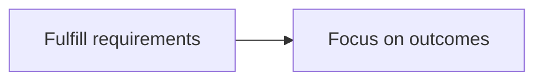

# Editorial rules

Cross-cutting rules for authoring and reviewing content in `src/content/`. These bind AI collaborators the same way `AGENTS.md`'s engineering rules do — they're not suggestions to weigh against convenience.

## Diagrams, flowcharts, and formulas: English labels, even in Chinese articles

Mermaid diagrams and math formulas use English node labels and variable names, in both `zh.md` and `en.md` — this is already how every existing diagram and formula on the site is written (verified: zero Chinese characters inside any `mermaid` block or KaTeX expression across the content tree). Keep it that way:



```
\text{Profit} = \text{Revenue} - \text{Cost}
```

Use Chinese inside a diagram or formula only when the concept has no natural English label and forcing one would be misleading (a proper noun, a term the piece is specifically about). Default to English; treat a Chinese label as the exception that needs a reason, not the baseline.

## AI-detection threshold

Every piece must pass an AI-text detection check at **5% or below** before it enters the finalize/publish flow (see `CONTRIBUTING.md` for the human-facing publish process this sits inside, and the relevant `agent/category-guides/*.md` for the drafting order that leads up to it). This is not a proofreading nicety — content over the threshold goes back for revision, full stop.

Getting under the threshold is not about scrubbing an AI vocabulary blocklist onto otherwise-generic prose. The detectable signal is structural: uniform sentence length and rhythm, predictable connective tissue ("此外"、"值得注意的是"、"综上所述" and their English equivalents "moreover", "furthermore", "it's worth noting"), claims left abstract instead of cashed out into concrete criteria, and hedges bolted onto a sentence instead of built into it. `agent/writing-style.md` describes what this site's actual voice does instead — calibrate against it, not against a generic "sound human" checklist. The `.claude/skills/humanize-writing` skill operationalizes this check.

## English translation standard: 信达雅, not literal translation

Chinese is the source locale; every published English page is a translation of a Chinese original (see `agent/translation-spec.md` for mechanics — quoting, what to translate vs. copy verbatim, `translationKey` wiring). The *quality* bar for that translation is Yan Fu's three-part standard, in this order of priority when they trade off:

1. **信 (faithful)** — the English carries the same meaning, argument structure, and claims as the Chinese. Nothing added, nothing dropped, no softening or hardening of a claim's certainty.
2. **达 (expressive/fluent)** — reads as English written by someone thinking in English, not as Chinese re-cased into English words. A literal, clause-for-clause translation that preserves Chinese sentence structure is a failure at this level even if every word is individually correct.
3. **雅 (elegant)** — the English carries the register and rhetorical moves documented in `agent/writing-style.md` (the negation-reframe move, claims cashed out into concrete criteria, non-absolute hedging built into the sentence), not flattened into generic translated-technical-writing English.

A translation that is faithful but not fluent is unpublishable; a translation that is fluent but not faithful is worse. When forced to trade 达 against 雅, prefer 达 — Yan Fu himself treated fluency as the more load-bearing of the two, since a translation nobody can follow is useless regardless of how faithful or elegant it is underneath.

English-side review (published `en.md` files carry `translationStatus: reviewed`) checks against this same 信达雅 standard, not against a literal back-translation match to the Chinese. The `.claude/skills/xinda-ya-translation` skill operationalizes this check.
