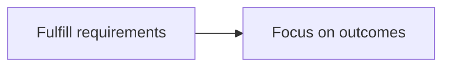

# Editorial rules

Cross-cutting rules for authoring and reviewing content in `src/content/`. These bind AI collaborators the same way `AGENTS.md`'s engineering rules do — they're not suggestions to weigh against convenience.

## Diagrams, flowcharts, and formulas: English labels, even in Chinese articles

Mermaid diagrams and math formulas use English node labels and variable names, in both `zh.md` and `en.md` — this is already how every existing diagram and formula on the site is written (verified: zero Chinese characters inside any `mermaid` block or KaTeX expression across the content tree). Keep it that way:



```
\text{Profit} = \text{Revenue} - \text{Cost}
```

Use Chinese inside a diagram or formula only when the concept has no natural English label and forcing one would be misleading (a proper noun, a term the piece is specifically about). Default to English; treat a Chinese label as the exception that needs a reason, not the baseline.

## A diagram earns its place by carrying an argument

A diagram belongs in a piece when the reader needs to see a structure that prose cannot hold: a capability space with layers, an ownership boundary, a decision procedure, or a lifecycle. Removing it should cost the reader something. A diagram added because a technical article is expected to have one is an AI signal (`agent/writing-style.md`), not a structural aid.

Match the diagram to the question it answers:

| Diagram | Question it answers |
| --- | --- |
| Structure map (house diagram) | What is the whole trying to achieve, and how does the capability space decompose? |
| Dependency diagram | What calls what, where does data flow, and where are the ownership boundaries? |
| Flowchart | How does a reader classify a case or make a decision? |
| State machine | How does something move through its lifecycle? |

`zh.md` and `en.md` keep the same nodes, layers, and relationships; only visible labels may differ, under the English-label rule above. The `.claude/skills/house-diagram` skill operationalizes the structure-map case.

## Analytical evidence sequence

When a piece in any collection makes a claim about a market, product, approach, or industry, do the research and judgment passes in this order before fixing the final argument. This is the canonical statement of the sequence; the category guides and the `write-*` skills cite it rather than restating it.

1. **Industry facts and scope** — collect dated, sourced facts and define the time window, population, and terms being used; distinguish observation from interpretation.
2. **Development and change** — trace what changed over time and test whether the apparent change is substantive or only a change in naming, packaging, or attention.
3. **Competitors, prior art, and alternatives** — identify the real competing options and the obvious alternative explanation or approach a knowledgeable reader would raise.
4. **Like-for-like comparison** — compare the options against shared dimensions and the actual constraints of the decision, not against marketing claims or incomparable feature lists.
5. **Pros and cons** — record benefits, costs, failure modes, and which party or user bears each trade-off; don't reduce this to a decorative scorecard.
6. **Conclusion and dialectical challenge** — write a provisional conclusion, then try to disprove it with counterexamples, omitted alternatives, selection effects, changing assumptions, and cases where the opposite choice is better.
7. **Bounded judgment** — keep only the conclusion that survives the challenge, state its conditions and limits, and make the practical implication clear.

Two constraints on how this shows up: the sequence belongs to the working process, so don't force seven visible sections, a competitor table, or literal `Pros` / `Cons` headings into prose that reads better as an essay; and the challenge in step 6 must happen after the comparison and before the conclusion is treated as final. Personal or reflective pieces are exempt unless they genuinely make an analytical comparative claim.

## AI-detection threshold

When an AI-text detector is run on a piece, **5% or below** is the bar it must clear before the piece enters the finalize/publish flow (see `CONTRIBUTING.md` for the human-facing publish process this sits inside, and the relevant `agent/category-guides/*.md` for the drafting order that leads up to it). This is not a proofreading nicety — a measured score over the threshold sends the content back for revision, full stop.

No detector is wired into this repository: nothing in `npm run publish:check` measures it, and no skill may report a percentage it did not actually measure (`.claude/skills/content-review`, `.claude/skills/humanize-writing`). So the pre-publish report must state which of two cases applies, and never leave it ambiguous:

- **A detector was run** — name the tool and the date, give the score, and revise anything above 5% before finalizing.
- **No detector was run** — say so plainly, and the qualitative AI-signal pass in `.claude/skills/content-review` carries this gate on its own judgment. An unrun check is reported as unrun, never as a pass.

Getting under the threshold is not about scrubbing an AI vocabulary blocklist onto otherwise-generic prose. The detectable signal is structural: uniform sentence length and rhythm, predictable connective tissue ("此外"、"值得注意的是"、"综上所述" and their English equivalents "moreover", "furthermore", "it's worth noting"), claims left abstract instead of cashed out into concrete criteria, and hedges bolted onto a sentence instead of built into it. `agent/writing-style.md` describes what this site's actual voice does instead — calibrate against it, not against a generic "sound human" checklist. The `.claude/skills/humanize-writing` skill operationalizes this check.

## English translation standard: 信达雅, not literal translation

Chinese is the source locale; every published English page is a translation of a Chinese original (see `agent/translation-spec.md` for mechanics — quoting, what to translate vs. copy verbatim, `translationKey` wiring). The *quality* bar for that translation is Yan Fu's three-part standard, in this order of priority when they trade off:

1. **信 (faithful)** — the English carries the same meaning, argument structure, and claims as the Chinese. Nothing added, nothing dropped, no softening or hardening of a claim's certainty.
2. **达 (expressive/fluent)** — reads as English written by someone thinking in English, not as Chinese re-cased into English words. A literal, clause-for-clause translation that preserves Chinese sentence structure is a failure at this level even if every word is individually correct.
3. **雅 (elegant)** — the English carries the register and rhetorical moves documented in `agent/writing-style.md` (the negation-reframe move, claims cashed out into concrete criteria, non-absolute hedging built into the sentence), not flattened into generic translated-technical-writing English.

A translation that is faithful but not fluent is unpublishable; a translation that is fluent but not faithful is worse. When forced to trade 达 against 雅, prefer 达 — Yan Fu himself treated fluency as the more load-bearing of the two, since a translation nobody can follow is useless regardless of how faithful or elegant it is underneath.

English-side review (published `en.md` files carry `translationStatus: reviewed`) checks against this same 信达雅 standard, not against a literal back-translation match to the Chinese. The `.claude/skills/xinda-ya-translation` skill operationalizes this check.
