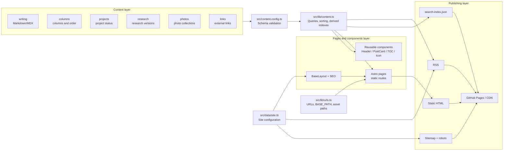
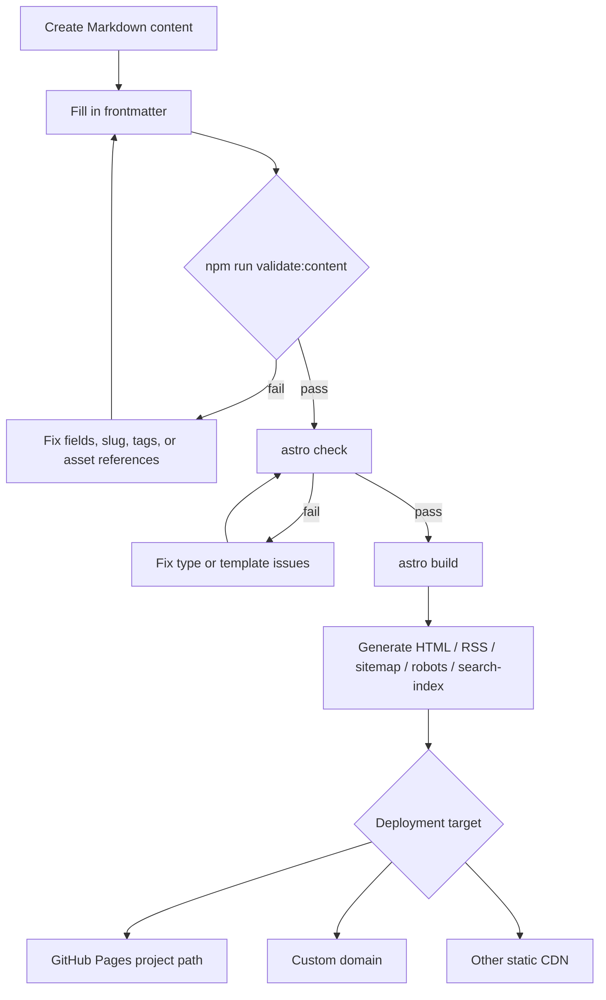
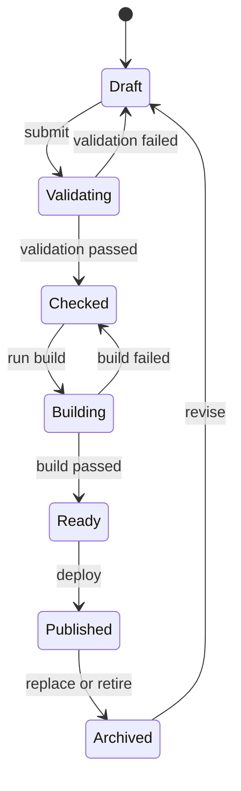

[View Fourfold on GitHub ↗](https://github.com/Liyuk/astro-fourfold)

## Project positioning

Fourfold is a static-first personal publication starter for independent authors, engineers, researchers, and creators.

It is not primarily about “how to display a Markdown file.” It addresses a longer-term problem: once personal content begins to accumulate, how can different kinds of work retain clear and sustainable relationships?

- Writing accumulates over time.
- Columns organize learning in sequence.
- Tags enable lateral discovery.
- Projects and research provide evidence of practice.
- Photos and links express the author's other interests.
- A start page gives new readers an entry point.
- RSS, search, and favorites support long-term return visits.

## Inspiration and abstraction scope

The project studied a public editorial-style personal publication site. What is worth abstracting from the reference is an information architecture for a “personal publication,” not its visual identity:

1. Separate content types from reading modes: writing, projects, research, and photos are content types; columns, tags, search, and favorites are reading modes.
2. Let the homepage introduce the publication, surface featured work, show recent updates, and route readers into content sections.
3. Treat columns as ordered reading paths, not ordinary categories.
4. Use tags as a cross-year, cross-column index.
5. Give projects statuses, research versions, and each content type metadata that matches its own semantics.
6. Create an editorial feeling through whitespace, numbering, rules, and typographic hierarchy rather than decorative components.
7. Use stable URLs, RSS, sitemaps, and durable archives to give content the permanence of a publication.

This project does not include the reference site's articles, images, brand, personal information, or inferred internal implementation. All example content is placeholder content.

## Design principles

The principles came from a concrete maintenance problem. Imagine a personal blog that has accumulated tags for several years. When its author wants to give a group of articles a reading order, the only available tool is the tag system, so tags such as `series-xxx-01` and `series-xxx-02` get added. The tag index is immediately polluted: it answers neither what a piece is about nor the order in which it should be read. Projects and research run into the same problem when maintenance or freshness status gets stuffed into titles or summaries because the content model has nowhere else to put it. A one-off fix is easy; having to invent another field convention every time a new reading mode appears is the reason to settle the content model before shaping the pages.

### 1. Content model before page model

Pages are different projections of content collections. Adding a tag or year should not require hand-writing a new page; pages should be derived from schemas and query functions.

### 2. A column is not a category

A category answers “what does this belong to?” A column answers “in what order should this be read?” An article can therefore have multiple tags, but at most one column and one order number.

### 3. Static first, bounded interaction

The build handles pages, RSS, sitemaps, SEO, and search data. The browser handles only the theme, favorites, link copying, and lightweight search. There is no need to introduce a full SPA for three small interactions.

### 4. External capabilities are pluggable

Comments, email subscriptions, login, cloud favorites, analytics, and a CMS are not part of the core template. They should be connected through configuration or independent components without polluting the content layer or static build layer.

### 5. A few honest examples

Template examples demonstrate structure and capability; they do not simulate a real author's experience, work, or social relationships. Before publishing, users should replace the author, domain, social links, license, and example content.

## Why not use an existing solution?

Before building Fourfold, three easier options were available:

- **Use a CMS such as Ghost or WordPress.** The editing experience, comments, and subscriptions are ready-made, but the trade-off is maintaining a database and an administrative backend. Content and presentation become tightly coupled, and a semantic field such as column order usually means modifying a plugin or embedding HTML in the body.
- **Use Hugo or Jekyll with an existing theme.** The static-first direction is sound and avoids writing a build pipeline, but most themes model only articles, categories, and tags. Adding columns or project status either misuses frontmatter or couples custom fields to the theme.
- **Publish directly from Notion or Feishu Docs.** This removes almost all build work, but gives up an independent domain, RSS, sitemap, durable archives, and the ability to organize content through site-wide tags and columns.

Fourfold therefore sits between “I need semantic content types and reading modes” and “I do not want to maintain a backend.” Static builds retain the deployment simplicity of a Hugo-style site, while the schema and query layers are designed around columns, tags, and project status. The cost is a slower start: the author has to build schema checks and query logic instead of installing a theme.

## User model

### Readers

- First visit: need a start page and a clear explanation of what the publication is about.
- Systematic learning: need columns, order numbers, a table of contents, and previous/next navigation.
- Topic exploration: need tags and related articles.
- Fast retrieval: need search across titles, summaries, body text, and tags.
- Continued tracking: need RSS or email subscriptions.
- Saving content: need favorites; device-local storage is an acceptable default.

### Authors

- Want to write Markdown without maintaining a database.
- Need to present articles, projects, and research in one site.
- Need explicit rules for drafts, featured items, update times, and tags.
- Want to connect comments, subscriptions, and a CMS later, without taking on all of them today.

## Non-goals

The current version does not aim to:

- become a general-purpose CMS or online editor;
- provide user accounts or a permission system;
- synchronize favorites across devices;
- include a comment backend;
- include a complex full-text search service;
- become a social network or infinite feed;
- copy the brand or content of any specific site.

## What is currently shipped

- Astro static-build foundation.
- Six content collections: writing, columns, projects, research, photos, and links.
- Writing homepage, pagination, year archives, article detail pages, and automatic tables of contents.
- Columns, tags, projects, research, photos, about, links, and start pages.
- Browser-side full-text matching with `?q=`, a static search index, favorites, theme switching, and link copying.
- RSS, sitemap, dynamic robots, 404, Open Graph, and `BlogPosting` JSON-LD.
- Content consistency checks for required fields, duplicate translation keys/URLs, column relationships, and asset references.
- A unified SVG icon design system, design tokens, runtime boundary notes, screenshots, architecture and flow diagrams, and a feature matrix.
- README, content schemas, and configuration entry points.

## Page screenshots

These screenshots come from the local development server and show neutral example content without any real author's information:

### Homepage


The homepage introduces the publication, surfaces featured content and recent updates, and routes readers into content types.

### Article detail


The article page handles the title, summary, date, tags, favorites, link copying, table of contents, and body reading.

### Search


The search page matches titles, summaries, tags, and body text, while `?q=` keeps the search state shareable.

> These are runtime previews of the template, not screenshots of a production site. Replace the example content before publishing.

## System architecture



Content collections first pass schema validation, then the query layer sorts them and derives indexes. Pages and reusable components consume the same content-query results; site configuration and URL helpers publish the output to GitHub Pages, a CDN, or a custom domain.

## Content publishing flow



## Content state machine

The state boundaries around publishing matter more than the page itself. A draft enters the publishable output only after content validation, type checking, and the build all pass:



`Draft`, `Checked`, and `Published` are not the same concept: the first is the author's working state, the middle is an engineering-check result, and the last is an output available to external readers. Every failure returns to a state that can be repaired instead of producing a partially successful page.

## Content projection formula

Fourfold treats pages as projections of content collections rather than as a set of unrelated hand-written pages. A page can be abstracted as:

$$
\text{Page} = f(\text{Content},\ \text{Schema},\ \text{Query},\ \text{Layout},\ \text{URL})
$$

This means that adding content, a tag, or a year should in principle require changes only to Markdown and metadata; index pages, archives, RSS, sitemaps, and search data are derived from the same schemas and query rules. Page stability comes from reusing rules, not copying page files.

## Runtime capability boundaries

| Capability | Where it happens | Backend required | Notes |
| --- | --- | --- | --- |
| Markdown rendering | Build time | No | Generates static HTML |
| Tag/year/column indexes | Build time | No | Derived automatically from content collections |
| RSS / sitemap / robots | Build time | No | Uses `SITE_URL` and `BASE_PATH` |
| Search index | Build time | No | Outputs `/search-index.json` |
| Search interaction | Browser | No | Lightweight matching for now |
| Theme switching | Browser | No | CSS variables + localStorage |
| Favorites | Browser | No | Currently stored only in the local browser |
| Link copying | Browser | No | Enabled when the Clipboard API is available |
| Comments | External service | Usually | No provider currently connected |
| Email subscription | External service | Yes | No provider currently connected |
| Cross-device favorites | External API | Yes | Explicitly not implemented |

Fourfold's boundary is: complete as much as possible at build time, keep the browser layer lightweight, and connect external capabilities through interfaces. Deployment can therefore remain static while leaving room for comments, subscriptions, or a CMS later.

## Page and feature matrix

| Page | Content source | Main capabilities | URL form |
| --- | --- | --- | --- |
| Homepage | writing/projects/research | Brand, featured content, recent updates, section routing | `/` |
| Writing | writing | Sorting, years, pagination, tags | `/writing/` |
| Article | writing | Table of contents, favorites, copy, related articles, previous/next | `/writing/YYYY/MM/slug/` |
| Column | columns + writing | Sequential reading, order numbers | `/columns/slug/` |
| Tag | writing | Lateral topic index | `/tags/slug/` |
| Project | projects | Status, type, project detail | `/projects/YYYY/MM/slug/` |
| Research | research | Type, version, summary | `/research/YYYY/MM/slug/` |
| Photos | photos | Gallery, image alt text, cover | `/photos/slug/` |
| Search | writing | Query, lightweight full-text matching | `/search/?q=...` |
| Favorites | localStorage | Favorites saved on the current device | `/favorites/` |

## Icon Design System

Icons are provided centrally by `src/components/chrome/Icon.astro`; components no longer use Unicode characters such as `⌕`, `♡`, `→`, or `↗` directly.

Design constraints:

- fixed `24 × 24` viewBox;
- default stroke width `1.7`;
- consistent `round` linecap and linejoin;
- colors use `currentColor` and are controlled by the parent state;
- only three sizes: `sm / md / lg`;
- interactive buttons share a circular `2.25rem` hit area;
- hover uses a `--soft` background and `--line` border;
- focus reuses the global `:focus-visible` rule;
- no third-party icon font or runtime icon library.

Current icon set:

```text
search       Search
bookmark     Favorites entry
heart        Article favorite
copy         Copy link
theme        Light/dark theme
arrowLeft    Previous page
arrowRight   Next page / continue reading
arrowUpRight External link
check        Success state
close        Empty gallery placeholder
```

## Visual tokens

The visual system is centralized in `src/styles/tokens.css`:

```text
--paper       Page background
--ink         Primary text
--muted       Secondary text
--line        Divider
--accent      Accent color
--soft        Control and code-block background
--icon-size-* Icon sizes
```

All pages and components should prefer these semantic tokens over isolated color values.

## Roadmap

### Phase 1 · Content migration

- Move real author information into `src/data/site.ts`.
- Migrate existing articles to writing Markdown.
- Add columns and column order for long-running themes.
- Remove example data and add real images with alt text.

### Phase 2 · Publication quality (complete)

- Add automated checks for duplicate slugs, duplicate translation keys, invalid tags, and external links.
- Add `BlogPosting` JSON-LD and basic canonical/OG metadata to articles.
- Add `/search-index.json`, URL query parameters, and a basic empty state for search.
- Add static pagination to the writing index.

### Phase 3 · Interactive integrations

- Optionally connect Giscus comments.
- Optionally connect an email subscription service.
- Add privacy-friendly analytics if needed.
- If cross-device favorites become necessary, design authentication and an API instead of directly transforming localStorage.

### Phase 4 · Bilingual content and scale

- Add explicit `[locale]` routes and language switching.
- Generate hreflang and related-article entry points from `translationKey`.
- Move to Pagefind or MiniSearch as the article collection grows.
- Connect a Git-based CMS when editorial collaboration becomes necessary.

## Release acceptance criteria

- `npm run check` completes without errors.
- `npm run build` succeeds.
- RSS, sitemap, robots, and canonical URLs are correct under the real domain.
- Drafts do not appear in any public index.
- Every article has a title, description, date, and usable slug.
- Every image has meaningful alt text, and external links are clearly marked.
- Text, links, and buttons remain readable in both dark and light themes.
- Keyboard users can navigate, search, switch themes, and manage favorites.
- Removing example content does not make an empty collection crash the build.
- The README lets another person start their own blog by changing only configuration and content.

## Current state and limitations

Fourfold now has the content schema, query layer, pages for six content types, static search, RSS, sitemap, and consistency checks. Comments, email subscriptions, and cross-device favorites are not connected yet; they require external services, so the template only leaves room for them. If the goal is simply to launch a personal writing site without columns or project status, an existing static-blog theme will probably be faster. Fourfold is meant for a long-term publication whose content types and reading modes will keep expanding.
