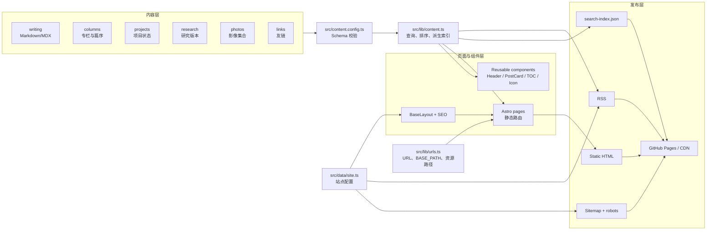
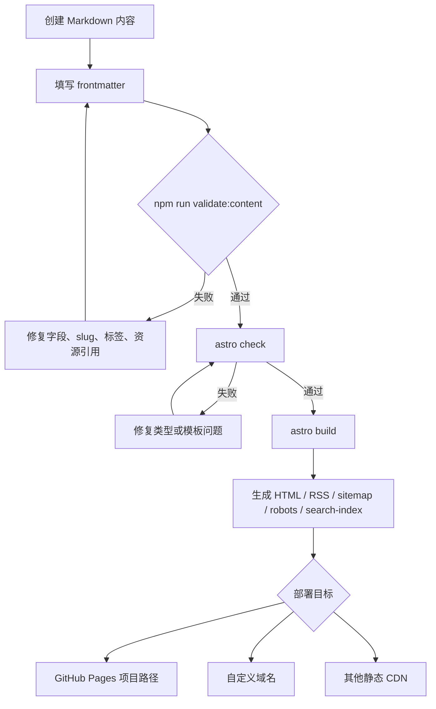
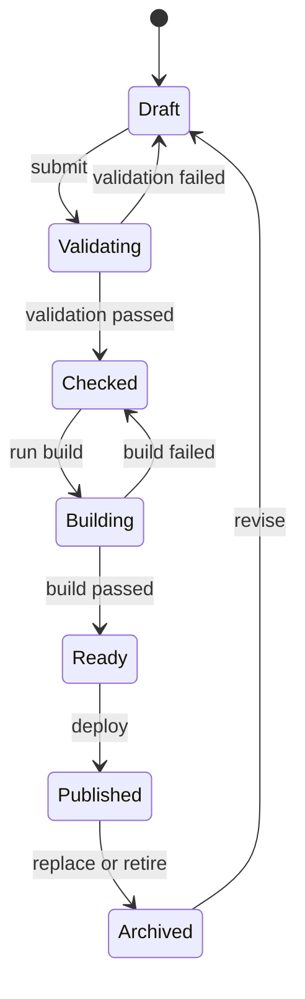

[在 GitHub 查看 Fourfold ↗](https://github.com/Liyuk/astro-fourfold)

## 项目定位

Fourfold 是一个面向独立作者、工程师、研究者和创作者的静态个人出版物 starter。

它要解决的不是“如何显示一篇 Markdown”，而是当个人内容开始积累后，如何让不同类型的作品仍然拥有清晰、可持续的关系：

- 写作按时间沉淀；
- 专栏按顺序组织学习；
- 标签提供横向发现；
- 项目和研究提供实践证据；
- 影像和友链表达作者的其他兴趣；
- 开始页帮助新读者找到入口；
- RSS、搜索和收藏支持长期回访。

## 灵感与抽象范围

本项目研究了一个公开的编辑型个人出版物站点。源站最值得抽象的是一套“个人出版物”信息架构，而不是视觉复制：

1. 内容类型与阅读方式分离：写作、项目、研究、影像是内容类型；专栏、标签、搜索和收藏是阅读方式。
2. 首页同时承担品牌介绍、精选、最近更新和内容分区导流。
3. 专栏是有篇序的阅读路径，不是普通分类。
4. 标签是跨年份、跨专栏的横向索引。
5. 项目有状态，研究有版本，内容类型拥有符合自身语义的元数据。
6. 编辑感来自留白、编号、横线和文字层级，而不是装饰性组件。
7. 静态 URL、RSS、sitemap 和长期归档让内容具备出版物的保存感。

本项目不包含源站的文章、图片、品牌、个人信息或内部实现推断；所有示例内容均为占位内容。

## 设计原则

### 1. 内容模型先于页面模型

页面是内容集合的不同投影。新增一个标签或年份不应该需要手写新页面；页面由 schema 和查询函数派生。

### 2. 专栏不等于分类

分类回答“它属于什么”，专栏回答“建议按什么顺序读”。因此文章可以有多个标签，但最多关联一个专栏及一个篇序。

### 3. 静态优先，交互有边界

构建期完成页面、RSS、sitemap、SEO 和搜索数据；浏览器端只负责主题、收藏、复制链接和轻量搜索。没有必要为了三个交互引入完整 SPA。

### 4. 外部能力可插拔

评论、邮件订阅、登录、云端收藏、分析、CMS 都不是核心模板的一部分。它们应该由配置或独立组件接入，不污染内容层和静态构建层。

### 5. 诚实的示例

模板示例只展示结构和能力，不模拟一个真实作者的经历、作品或社会关系。使用者开始发布前应该替换作者、域名、社交链接、许可证和示例内容。

## 用户模型

### 读者

- 第一次访问：需要“开始”页和清晰的内容定位。
- 想系统学习：需要专栏、篇序、目录和上下篇。
- 想按主题探索：需要标签和相关文章。
- 想快速定位：需要搜索标题、摘要、正文和标签。
- 想持续跟踪：需要 RSS 或邮件订阅。
- 想保存内容：需要收藏；默认可接受设备级本地存储。

### 作者

- 只想写 Markdown，不想维护数据库。
- 需要在一个站点里展示文章、项目和研究。
- 需要明确的草稿、精选、更新时间和标签规则。
- 需要能在未来接入评论、订阅和 CMS，而不是今天就承担它们。

## 非目标

当前版本不打算：

- 做成通用 CMS 或在线编辑器；
- 提供用户账号和权限系统；
- 提供跨设备同步收藏；
- 内置评论后端；
- 内置复杂的全文搜索服务；
- 做成社交网络或无限信息流；
- 复制任何具体站点的品牌和内容。

## 当前交付

- Astro 静态构建基础。
- 六种内容集合：writing、columns、projects、research、photos、links。
- 写作首页、分页、年份归档、文章详情和自动目录。
- 专栏、标签、项目、研究、影像、关于、友链、开始页。
- 支持 `?q=` 的浏览器端全文匹配、静态搜索索引、收藏、主题切换、复制链接。
- RSS、sitemap、动态 robots、404、Open Graph 与 `BlogPosting` JSON-LD。
- 内容一致性校验：必填字段、重复 translationKey/URL、专栏关联和资源引用。
- 统一 SVG Icon Design System、设计 token、运行时边界说明、截图、架构图、流程图和功能矩阵。
- README、内容 schema 和配置入口。

## 页面截图

以下截图来自本地开发服务器，展示的是中性示例内容，不包含任何真实作者资料：

### 首页


首页负责品牌定位、精选内容、最近更新和内容类型导流。

### 文章详情


文章页负责标题、摘要、日期、标签、收藏、复制链接、目录和正文阅读。

### 搜索页


搜索页支持标题、摘要、标签和正文匹配，并通过 `?q=` 保持可分享的搜索状态。

> 截图是模板运行时预览，不是生产站点截图；发布前替换示例内容即可得到自己的页面。

## 系统架构图



内容集合先经过 schema 校验，再由查询层排序并派生索引。页面和可复用组件消费同一份内容查询结果；站点配置与 URL 工具负责把页面发布到 GitHub Pages、CDN 或自定义域名。

## 内容发布流程图



## 内容状态机

发布流程的状态边界比页面本身更重要。草稿只有在内容校验、类型检查和构建都通过后，才会进入可发布产物：



`Draft`、`Checked` 和 `Published` 不是同一个概念：前者是作者工作状态，中间状态是工程检查结果，后者才是外部读者能够访问的发布结果。任何失败都回到可以修复的状态，而不是生成一个半成功的页面。

## 内容投影公式

Fourfold 把页面看成内容集合的投影，而不是一组彼此独立的手写页面。一个页面可以抽象为：

$$
\text{Page} = f(\text{Content},\ \text{Schema},\ \text{Query},\ \text{Layout},\ \text{URL})
$$

这意味着新增内容、标签或年份，原则上只需要修改 Markdown 和元数据；索引页、归档页、RSS、sitemap 和搜索数据由同一套 schema 与查询规则派生。页面的稳定性来自规则复用，而不是复制粘贴页面文件。

## 运行时能力边界

| 能力 | 发生位置 | 是否需要后端 | 说明 |
| --- | --- | --- | --- |
| Markdown 渲染 | 构建期 | 否 | 生成静态 HTML |
| 标签/年份/专栏索引 | 构建期 | 否 | 从内容集合自动派生 |
| RSS / sitemap / robots | 构建期 | 否 | 使用 `SITE_URL` 和 `BASE_PATH` |
| 搜索索引 | 构建期 | 否 | 输出 `/search-index.json` |
| 搜索交互 | 浏览器 | 否 | 当前为轻量匹配 |
| 主题切换 | 浏览器 | 否 | CSS variables + localStorage |
| 收藏 | 浏览器 | 否 | 当前仅保存在本地浏览器 |
| 复制链接 | 浏览器 | 否 | Clipboard API 可用时启用 |
| 评论 | 外部服务 | 通常是 | 当前未绑定供应商 |
| 邮件订阅 | 外部服务 | 是 | 当前未绑定供应商 |
| 跨设备收藏 | 外部 API | 是 | 当前明确不实现 |

Fourfold 的边界是“构建期尽可能完成，浏览器端保持轻量，外部能力通过接口接入”。这使部署可以保持静态，同时为评论、订阅或 CMS 留出未来的接入位置。

## 页面与功能矩阵

| 页面 | 内容来源 | 主要能力 | URL 形式 |
| --- | --- | --- | --- |
| 首页 | writing/projects/research | 品牌、精选、最近更新、分区导流 | `/` |
| 写作 | writing | 排序、年份、分页、标签 | `/writing/` |
| 文章 | writing | 目录、收藏、复制、相关文章、上下篇 | `/writing/YYYY/MM/slug/` |
| 专栏 | columns + writing | 连续阅读、篇序 | `/columns/slug/` |
| 标签 | writing | 横向主题索引 | `/tags/slug/` |
| 项目 | projects | 状态、类型、项目详情 | `/projects/YYYY/MM/slug/` |
| 研究 | research | 类型、版本、摘要 | `/research/YYYY/MM/slug/` |
| 影像 | photos | 画廊、图片 alt、封面 | `/photos/slug/` |
| 搜索 | writing | query、全文轻量匹配 | `/search/?q=...` |
| 收藏 | localStorage | 当前设备收藏列表 | `/favorites/` |

## Icon Design System

图标统一由 `src/components/chrome/Icon.astro` 提供，不再直接使用 `⌕`、`♡`、`→`、`↗` 等 Unicode 字符。

设计约束：

- 固定 `24 × 24` viewBox；
- 默认线宽 `1.7`；
- 统一 `round` linecap 和 linejoin；
- 颜色使用 `currentColor`，由父级状态控制；
- 尺寸只允许 `sm / md / lg` 三档；
- 交互按钮统一为 `2.25rem` 圆形 hit area；
- hover 使用 `--soft` 背景和 `--line` 边框；
- focus 复用全局 `:focus-visible` 规则；
- 不引入第三方图标字体或运行时图标库。

当前图标集合：

```text
search       搜索
bookmark     收藏入口
heart        文章收藏
copy         复制链接
theme        明暗主题
arrowLeft    上一页
arrowRight   下一页 / 继续阅读
arrowUpRight 外部链接
check        成功状态
close        空画廊占位
```

## 视觉 Token

视觉系统集中在 `src/styles/tokens.css`：

```text
--paper       页面背景
--ink         主文字
--muted       次要文字
--line        分隔线
--accent      强调色
--soft        控件和代码块背景
--icon-size-* 图标尺寸
```

所有页面和组件都应优先使用这些语义 token，而不是写入孤立的颜色值。

## Roadmap

### Phase 1 · 内容迁移

- 将真实作者信息放入 `src/data/site.ts`。
- 将现有文章迁移为 writing Markdown。
- 为长期主题补充 column 与 columnOrder。
- 清理示例数据，补充真实图片与 alt。

### Phase 2 · 出版质量（已完成）

- 增加自动检查：重复 slug、重复 translationKey、非法标签和外链。
- 为文章添加 JSON-LD `BlogPosting` 和基础 canonical/OG 元数据。
- 为搜索增加 `/search-index.json`、URL query 参数和空状态基础。
- 为写作索引增加静态分页。

### Phase 3 · 互动接入

- 可选接入 Giscus 评论。
- 可选接入邮件订阅服务。
- 根据需要增加隐私友好的访问统计。
- 如果确实需要跨设备收藏，再设计认证和 API，而不是直接改造 localStorage。

### Phase 4 · 双语与规模化

- 增加显式 `[locale]` 路由和语言切换。
- 用 translationKey 生成 hreflang 和关联文章入口。
- 文章规模增大后迁移到 Pagefind 或 MiniSearch。
- 需要编辑协作时接入 Git-based CMS。

## 发布验收标准

- `npm run check` 无错误。
- `npm run build` 成功。
- 真实域名下 RSS、sitemap、robots 和 canonical 正确。
- 草稿不出现在任何公开索引。
- 所有文章有 title、description、日期和可用 slug。
- 所有图片有有意义的 alt，外链明确标识。
- 深色和浅色主题下文字、链接、按钮均可读。
- 键盘可以完成导航、搜索、主题和收藏操作。
- 删除示例内容后，空集合不会导致构建崩溃。
- README 已能让另一个人只通过修改配置与内容启动自己的 blog。

## 一句话说明

> Fourfold 不是一个替你写作的博客，而是一套让长期写作更容易被组织、发现和继续阅读的个人出版物骨架。
