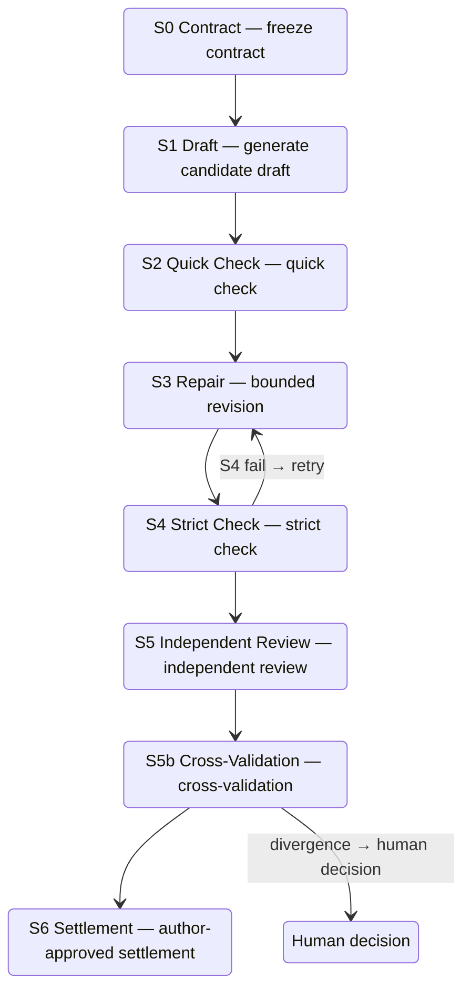

[View CanonLoom on GitHub ↗](https://github.com/Liyuk/canonloom)

CanonLoom is a command-driven, local workflow for human–AI collaboration on long-form novels. The author launches tasks with short commands, an Agent (Codex / Claude Code / OpenCode, etc.) reads task files and does the creation, Python scripts perform deterministic validation, and the author makes choices and approvals at every key checkpoint.

It is not GUI writing software, nor a black-box tool that "generates an entire novel from one sentence." The problem it solves is one of the most common failures in long-form novel writing: state drift across chapters — character motivations that become inconsistent, timelines that break, settings the model proposes that quietly become "story facts" without approval, and review feedback that cannot be traced back to concrete revision tasks.

The most essential point of the design: **the protocol lives in files, not in the model's memory**. Project state, plans, drafts, reviews, and approvals are all stored as readable files (Markdown / JSON / JSONL), so different Agents can work on the same file protocol and recover from the last valid artifact after an interruption.

| Role | Responsibility |
| --- | --- |
| Author | Type short commands, make choices, approve |
| Agent | Read the task file; responsible for creativity / planning / writing / revision / review explanation |
| Python | Deterministic checks, indexing, source tracking, stage gates, run logs |
| Files | Intent, canon, plan, draft, review, state, trace are all readable files |

## Why

The difficulty of long-form novel generation is not in single-chapter quality but in cross-chapter consistency. The usual "prompt + history text" approach hides state in the model context: when something goes wrong in chapter 7, it is hard to answer "what material does this passage rely on," "was this fact confirmed by the author or just now guessed by the model," or "has this review finding been addressed."

CanonLoom models writing as explicit state transitions. A chapter passes through the S0–S6 stage gates, and only after the author approves is it promoted to a formal state. In this way, states, decisions, and validation boundaries are made explicit, and problems can be located to a specific stage.

## Core design

### File protocol and the first boundary

The project structure generated after `init`:

```text
canonloom.json                     # project state + workflow config (state machine)
intent/author-setup.json           # author-confirmed genre / audience / viewpoint / boundaries (author decides)
intent/ai-recognition.json         # AI-recognized candidate characters / world / clues (AI can only propose)
intent/style-profile.json          # style constraints
intent/review-policy.md            # review policy
memory/narrative-state/            # optional narrative state layer: events / knowledge / reveals
tasks/current.md                   # current task (the Agent's entry point)
```

`author-setup.json` (author configuration) and `ai-recognition.json` (AI proposals) are stored separately: author configuration is not mixed with AI inference, and AI inference never automatically enters canon. This is the first boundary of the entire project.

`canonloom.json` records the current stage, the next action, the S0–S6 stage order, whether settlement requires author approval, the retry limit, and so on. The Agent always reads it and `tasks/current.md` first, follows `next_action`, and does not invent its own process.

### S0–S6 stage gates

A chapter's production is split into 7 stages, each with fixed artifacts and write boundaries:



Stages cannot be skipped: without author approval at S6, a draft cannot enter `manuscript/`; with unresolved BLOCKER/MAJOR review findings, it cannot enter S6; writing directly to canon is never allowed at any stage. Review findings are graded BLOCKER / MAJOR / MINOR / ADVISORY, with the first two blocking promotion.

To emphasize: the hard constraints restrict the **state boundaries**, not the sentence expression. A chapter contract can require "a certain choice causes an irreversible cost," but cannot dictate which sentence a character uses to say it.

### Chapter contract and context compilation

The chapter contract is not a summary. At minimum it requires:

```jsonc
{
  "id": "chapter-001",
  "objective": "chapter objective",
  "viewpoint": "viewpoint",
  "time": "time",
  "location": "location",
  "required_changes": ["changes that must happen"],
  "forbidden_changes": ["changes that are forbidden"],   // prevent over-resolution and overstepping
  "exit_state": "chapter exit state"                     // facts and open questions the next chapter can inherit
}
```

It serves simultaneously as generation input, review baseline, and experiment record. Context compilation bundles the material a chapter needs into a bounded package, recording each source file's SHA-256 fingerprint and the reason for inclusion; "excluded" material is not deleted, but simply should not be read for this task.

### Optional narrative state layer

When a work becomes complex enough to need it, three state files can be enabled: events (what happened), knowledge state (who knows what), and reveals and foreshadowing (when who learns what). Three modes are supported — `disabled / optional / required` — without forcing every project to adopt a complex knowledge graph from the start.

## Usage

The author's daily work only needs a short command set:

```sh
./bin/canonloom --root ~/my-novel status       # what stage am I in? what's next?
./bin/canonloom --root ~/my-novel continue     # continue along next_action (most common)
./bin/canonloom --root ~/my-novel idea         # start ideation: 2–5 candidate directions
./bin/canonloom --root ~/my-novel planning     # hierarchical planning
./bin/canonloom --root ~/my-novel work         # start one unit of work (one chapter)
./bin/canonloom --root ~/my-novel revision     # problem-driven revision
./bin/canonloom --root ~/my-novel review       # review
./bin/canonloom --root ~/my-novel diagnose     # check structure and state (run this first when something breaks)
./bin/canonloom --root ~/my-novel repair       # fix structural problems within the whitelist
```

One complete chapter production: `idea`/`work`/`continue` generates `tasks/current.md` → the Agent produces 2–5 creative options → the author chooses (`select / merge / edit / reject / defer`) and writes the reasoning → runs through the S0–S6 gates → settles into `manuscript/`. There are clear fallbacks when something goes wrong: an S4 failure returns to S3 for re-validation, an S5b divergence keeps both reports for a human decision, and reopening an already-settled chapter uses `retry S0` to keep the old artifacts and start a new run.

Three work modes are supported — `economy / standard / deep` — corresponding to different review intensities.

## Current status

**What is being validated now is "engineering reliability," not "the generated novel is of higher quality"**. Data that has not been measured is not treated as a result.

Already validated:

- 18 Python unit tests pass (commands, protocol, config precedence, state validation, and other core paths);
- the minimal-project smoke passes: the full `init → setup → idea → diagnose` chain runs end to end;
- local deterministic tooling measured at 183 ms (one chapter draft, 6 tool steps); the Python layer is usually far smaller than one model request;
- every run records a manifest (stage, tool calls, tokens, latency, retries), and the context package and chapter index carry source SHA-256 fingerprints.

Cross-architecture literary-quality comparison must wait for the controlled experiment in section 10 of the paper (fixed model/seed/chapter contract/budget, B0–B5 control groups, A1–A6 ablations). Until then, the positioning is "an auditable narrative production protocol," not "a verified-superior generation method."

The complete system design, research boundaries, and evaluation plan are in: [CanonLoom 0.2.0 system design paper ↗](https://github.com/Liyuk/canonloom/blob/main/docs/paper-0.2.0/paper.md).

## 5-minute run

No third-party packages required, Python 3.9+:

```sh
git clone https://github.com/Liyuk/canonloom
cd canonloom
./bin/canonloom init ~/my-novel --name "My Novel"
./bin/canonloom --root ~/my-novel setup --confirm   # confirm author configuration
./bin/canonloom --root ~/my-novel idea              # start ideation
./bin/canonloom --root ~/my-novel continue          # continue along next_action
```

The complete minimal chain can be run directly via the repo's bundled example (prints `MINIMAL PROJECT SMOKE: OK`):

```sh
examples/minimal-project/smoke.sh
```

## Project info

- **Repository**: [https://github.com/Liyuk/canonloom](https://github.com/Liyuk/canonloom)
- **License**: MIT
- **Dependencies**: Python standard library, no third-party dependencies
- **Version**: 0.2.1
