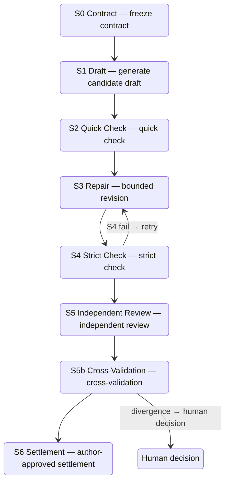

[在 GitHub 查看 CanonLoom ↗](https://github.com/Liyuk/canonloom)

CanonLoom 是一个命令驱动的、面向长篇小说人机协作的本地工作流。作者用短命令启动任务，Agent（Codex / Claude Code / OpenCode 等）读取任务文件执行创作，Python 脚本做确定性校验，作者在每个关键节点做选择和批准。

它不是 GUI 写作软件，也不是"一句话生成整本小说"的黑箱工具。它解决的问题是长篇小说写作里最常见的一类失败：跨章节的状态漂移——人物动机前后不一致、时间线断裂、模型提出的设定未经批准就悄悄变成"故事事实"、审查意见无法追溯成具体的修订任务。

设计上最本质的一点：**协议在文件里，不在模型的记忆里**。项目状态、计划、草稿、审查、批准全部存为可读文件（Markdown / JSON / JSONL），因此不同 Agent 可以在同一套文件协议上工作，中断后可以从最后一个合法产物恢复。

| 角色 | 职责 |
| --- | --- |
| 作者 | 敲短命令、做选择、批准 |
| Agent | 读任务文件，负责创意/规划/写作/修订/审查解释 |
| Python | 确定性校验、索引、来源追踪、阶段门禁、运行记录 |
| 文件 | 意图、canon、计划、草稿、审查、状态、trace 全是可读文件 |

## 为什么做

长篇小说生成的难点不在单章质量，而在跨章节的一致性。普通的"提示词 + 历史文本"方式把状态藏在模型上下文里：第 7 章出了问题，很难回答"这段依据了哪份材料""这个事实是作者确认的还是模型刚猜的""某条审查意见修了没有"。

CanonLoom 把写作建模为显式的状态转换，一章走完 S0–S6 阶段门禁，作者批准后才晋升为正式状态。这样状态、决策和验证边界被显式化，出问题可以定位到具体阶段。

## 核心设计

### 文件协议与第一条边界

`init` 之后生成的项目结构：

```text
canonloom.json                     # 项目状态 + 工作流配置（状态机）
intent/author-setup.json           # 作者确认的题材/受众/视角/边界（作者说了算）
intent/ai-recognition.json         # AI 识别出的候选人物/世界/线索（AI 只能提案）
intent/style-profile.json          # 文风约束
intent/review-policy.md            # 审查政策
memory/narrative-state/            # 可选叙事状态层：事件/知识/揭示
tasks/current.md                   # 当前任务（Agent 的入口）
```

`author-setup.json`（作者配置）和 `ai-recognition.json`（AI 提案）分开保存：作者配置与 AI 推断不混，AI 推断不会自动进入 canon。这是整个项目的第一条边界。

`canonloom.json` 记录当前阶段、下一步动作、S0–S6 阶段顺序、结算是否需要作者批准、重试次数上限等。Agent 永远先读它和 `tasks/current.md`，按 `next_action` 走，不自己发明流程。

### S0–S6 阶段门禁

一章的生产被拆成 7 个阶段，每个阶段有固定产物和写入边界：



阶段不能跳过：S6 没有作者批准，草稿进不了 `manuscript/`；有 BLOCKER/MAJOR 审查未解决就进不了 S6；任何阶段直接写 canon 都不允许。审查 Finding 分 BLOCKER / MAJOR / MINOR / ADVISORY 四级，前两级阻断晋升。

需要强调：强约束限制的是**状态边界**，不是句子表达。章契可以要求"某个选择造成不可逆代价"，但不能规定角色用哪句话说出来。

### 章契与上下文编译

章契（chapter contract）不是摘要，至少要求：

```jsonc
{
  "id": "chapter-001",
  "objective": "本章目标",
  "viewpoint": "视角",
  "time": "时间",
  "location": "地点",
  "required_changes": ["必须发生的变化"],
  "forbidden_changes": ["禁止发生的变化"],   // 防止过度解决、越权设定
  "exit_state": "章节出口状态"                // 下一章可继承的事实和开放问题
}
```

它同时是生成输入、审查基准和实验记录。上下文编译把本章需要的材料打成有边界的包，记录每份来源文件的 SHA-256 指纹和入选原因；"被排除"的材料不是删除，而是本次任务不该读。

### 可选叙事状态层

当作品复杂到需要时，可以启用三样状态文件：事件（发生了什么）、知识状态（谁知道什么）、揭示与伏笔（什么时候让谁知道什么）。支持 `disabled / optional / required` 三种模式，不强迫每个项目一开始就上复杂知识图谱。

## 使用

作者日常只需要一套短命令：

```sh
./bin/canonloom --root ~/my-novel status       # 现在处于什么阶段？下一步做什么？
./bin/canonloom --root ~/my-novel continue     # 按 next_action 继续（最常用）
./bin/canonloom --root ~/my-novel idea         # 开始创意：2–5 个候选方向
./bin/canonloom --root ~/my-novel planning     # 层级规划
./bin/canonloom --root ~/my-novel work         # 开始一个工作单元（一章）
./bin/canonloom --root ~/my-novel revision     # 问题驱动修订
./bin/canonloom --root ~/my-novel review       # 审查
./bin/canonloom --root ~/my-novel diagnose     # 检查结构和状态（出问题时先跑这个）
./bin/canonloom --root ~/my-novel repair       # 修复白名单内的结构问题
```

一次完整章节生产：`idea`/`work`/`continue` 生成 `tasks/current.md` → Agent 产 2–5 个创意选项 → 作者选择（`select / merge / edit / reject / defer`）并写理由 → 走 S0–S6 门禁 → 结算进 `manuscript/`。出错时有明确回退：S4 失败回 S3 再验证，S5b 分歧保留两份报告交给人工，已结算章节重开用 `retry S0` 保留旧产物开新 run。

支持 `economy / standard / deep` 三种工作模式，对应不同审查强度。

## 当前状态

**目前验证的是"工程可靠性"，不是"写出来的小说质量更高"**。没有实测的数据不会当成结果。

已验证的：

- 18 项 Python 单元测试通过（命令、协议、配置优先级、状态验证等核心路径）；
- 最小项目 smoke 通过：`init → setup → idea → diagnose` 全链路可跑通；
- 本地确定性工具实测 183 ms（一章草稿、6 个工具步骤），Python 层通常远小于一次模型请求；
- 每次运行记录 manifest（阶段、工具调用、token、延迟、重试），上下文包和章节索引带来源 SHA-256 指纹。

跨架构的文学质量对比需要等论文第 10 节的受控实验（固定模型/seed/章契/预算，B0–B5 对照组、A1–A6 消融）。在那之前，定位是"可审计的叙事生产协议"，而不是"已验证更优的生成方法"。

完整的系统设计、研究边界与评估方案见：[CanonLoom 0.2.0 系统设计论文 ↗](https://github.com/Liyuk/canonloom/blob/main/docs/paper-0.2.0/paper.md)。

## 5 分钟跑通

不依赖第三方包，Python 3.9+：

```sh
git clone https://github.com/Liyuk/canonloom
cd canonloom
./bin/canonloom init ~/my-novel --name "My Novel"
./bin/canonloom --root ~/my-novel setup --confirm   # 确认作者配置
./bin/canonloom --root ~/my-novel idea              # 开始创意
./bin/canonloom --root ~/my-novel continue          # 按 next_action 继续
```

完整最小链路可直接跑仓库自带示例（打印 `MINIMAL PROJECT SMOKE: OK`）：

```sh
examples/minimal-project/smoke.sh
```

## 项目信息

- **仓库**：[https://github.com/Liyuk/canonloom](https://github.com/Liyuk/canonloom)
- **协议**：MIT
- **依赖**：Python 标准库，无第三方依赖
- **版本**：0.2.1
