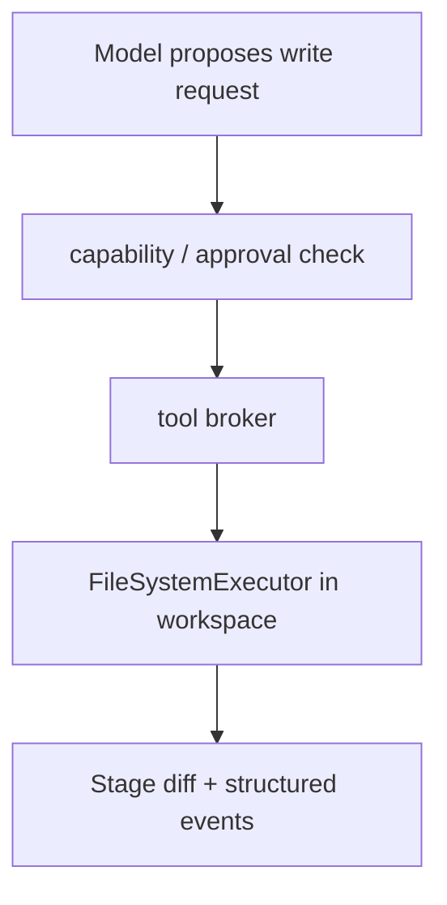
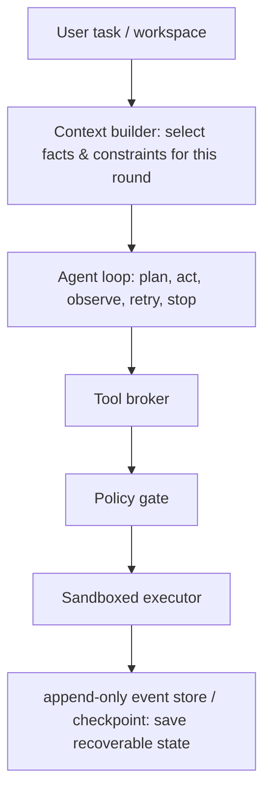

[View the project and learning notes on GitHub ↗](https://github.com/Liyuk/claude-code-harness-study)

Many coding agents start out the same straightforward way: the model reads a task, calls a shell or an editor, observes the output, and then decides the next step. That is enough for a demo; but once it enters a real repository, harder questions follow: who decides tool permissions? Why did a given change happen? How do budgets, denials, approvals, and failures leave an auditable record? And after an interruption, how do you continue without repeating side effects?

This project is not a clone of any product, and it does not rely on leaked source code, internal prompts, or unreleased features. Using public documentation, public repositories, and independently verifiable behavior as evidence, it incrementally builds a minimal coding-agent harness: the model may propose actions, but permissions, real side effects, and runtime state must be controlled by system boundaries.

## Completed: draw the boundaries first, then implement one restricted path

The learning portion has produced three publicly reviewable documents:

- [Architecture baseline](https://github.com/Liyuk/claude-code-harness-study/blob/main/learning/architecture-baseline.md): distinguishing the responsibilities of the agent loop, context, policy, executor, and state storage;
- [Landscape and evidence map](https://github.com/Liyuk/claude-code-harness-study/blob/main/learning/landscape-2026-08.md): organizing publicly reproducible projects, papers, evaluations, and security material;
- [Comparison of four harness architectures](https://github.com/Liyuk/claude-code-harness-study/blob/main/learning/harness-comparison-pi-codex-claude-deepseek.md): comparing the public boundaries and adoptable designs of Pi, Codex, Claude Code, and DeepSeek Harness.

The implementation already has a runnable vertical slice: an in-memory process / budget / policy gate / tool broker / event trace, plus the first real I/O adapter — a restricted file executor. It only allows access to a designated workspace; reading files produces no side effects, and writing files only generates a staged unified diff and never writes directly back to disk. Writing also requires a corresponding, scopeable capability and must pass human approval.

This is not an Agent that is "already able to develop autonomously"; it is a security boundary that can already be tested. Contract tests cover rejected over-privileged writes, no execution before approval, paths that must not escape the workspace or traverse symbolic links, and an executor that does not write to disk directly.

## The full model being studied

This diagram is the target model being validated, not a list of current features. The point is not to make each component big, but to make every boundary visible: the model handles judgment and generation; the system specifies what it may read, what it may write, which calls must be denied or confirmed, and when it must stop.

## Next step: make runs actually recoverable

Next, work will proceed according to the roadmap already written into the repository:

1. Replace the in-memory event trace with a persistent append-only event store, and implement checkpoint recovery;
2. Add a separate, approvable `apply_staged_write`, so a human can review the diff first and then decide whether to actually write it into the workspace;
3. Only after the contracts above are stable, consider restricted test commands and a context manager;
4. Leave the planner, verifier, sub-Agents, and plugin system to be evaluated only after the single-Agent baseline is replayable and recoverable.

The project separates learning discussion from implementation: `learning/` is for comparing architectures, recording evidence, and open questions; `kernel/` defines actual behavior through contracts, code, and tests. Every time a tool with side effects is added, its capability, approval policy, sandbox, event recording, and recovery semantics must be specified first, and only then the corresponding tests written.

## Current stage

The project is at the stage where "the safe execution boundary works end to end, while persistence and recovery are not yet implemented." Subsequent learning notes will unfold according to the milestones actually completed, rather than presupposing that multi-Agent, long-term memory, or a full plugin system is necessarily the answer.

This project shares a stance with CanonLoom: an Agent's capabilities should not be built on implicit memory and unexplainable automation. The difference is that CanonLoom is aimed at state production for long-form creative writing, while Coding Agent Harness Study is aimed at the coding loop inside real software repositories.
