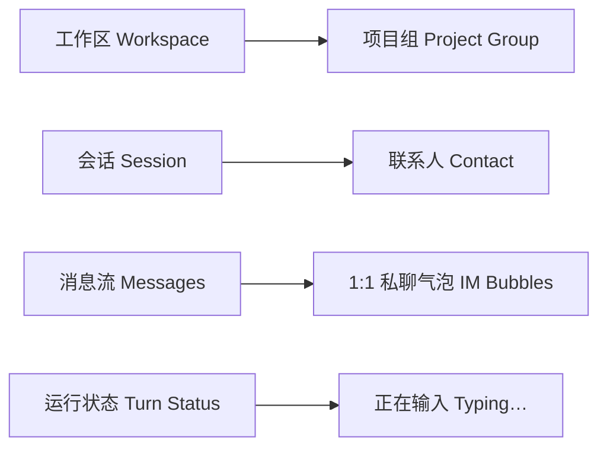
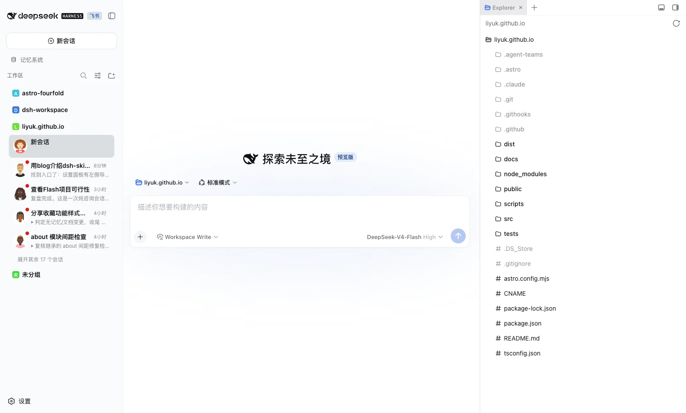
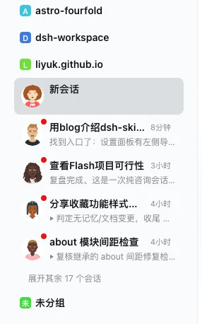
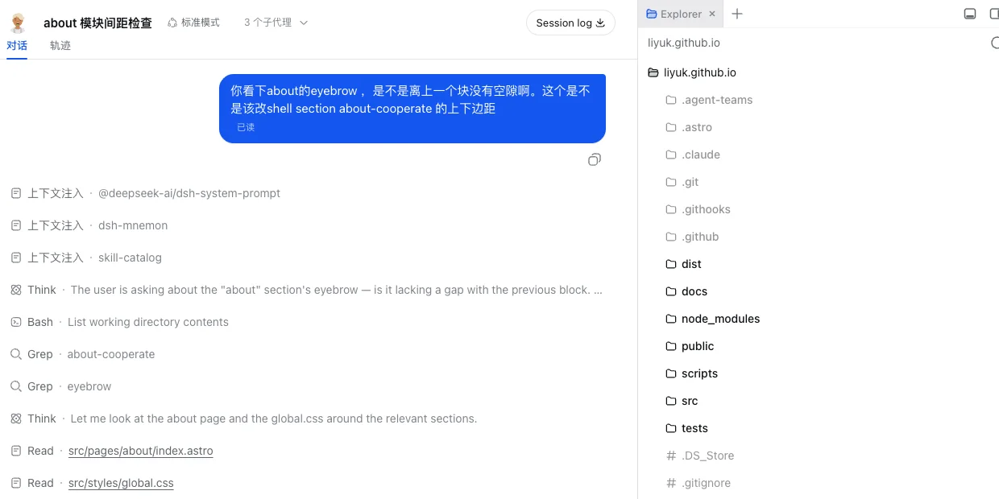
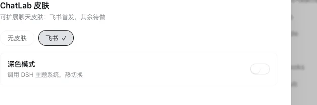
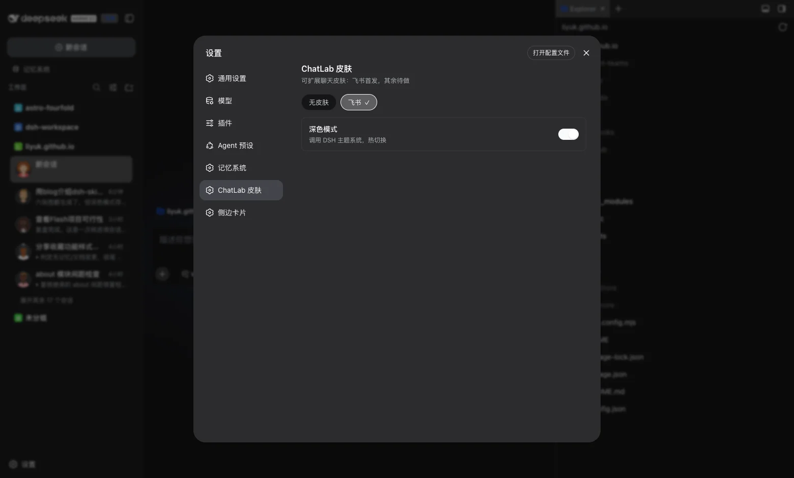

[View the project and installation guide on GitHub ↗](https://github.com/Liyuk/dsh-skin-chatlab)

In my daily work, conversations with coding agents have long reached the point where they can be counted as "chat history": meetings are sessions, debugging is a session, revising copy is a session. But the tool I use — the Web GUI of [DeepSeek Harness](https://github.com/deepseek-ai/deepseek-harness) — wears the face of a developer tool: workspaces, a session tree, and folder icons on the left; a message stream on the right. All the information is there, but the shape is not the IM I'm used to.

That's why dsh-skin-chatlab exists: an **extensible chat skin** for the DSH Web GUI. Only the Feishu skin exists so far: workspaces become project groups, sessions become contacts, and the chat window becomes a 1:1 private conversation. This post records the design trade-offs and a few key implementation constraints.

Three boundaries were set from the start:

1. **Independent plugin** — no changes to DSH's own code;
2. **No existing plugin is touched** — nothing depends on their presence;
3. **Switchable from settings** — switching back to "no skin" must fully restore the default look.

## Design mapping: translating a workbench into an IM

The whole skin rests on one metaphor: **an agent session is a contact in an IM app**.

| Workbench concept | Form in the Feishu skin |
| --- | --- |
| Workspace | Project group: colored rounded square + initial letter (Meego style) |
| Session | Contact: circular avatar + latest reply preview + unread dot |
| Chat window | 1:1 private chat: the other side in gray body text, your side in a blue bubble with a read mark |
| Session running state | "Typing…" with bouncing dots |
| Top bar | DeepSeek brand kept, with a skin-name badge added beside it |

Avatars are not random images: each session's seed derives from its session id (or title), so the same contact always looks the same — that's what makes it a "contact", not "a picture". Avatars use DiceBear's flat-people style, and the project-group square colors are likewise hashed from titles to fixed hues.



## Architecture: a base plus skin packages

The code is organized as a monorepo of three packages:

| Package | Role |
| --- | --- |
| `@liyuk/dsh-skin-chatlab-core` | Base: skin registry, switcher, decoration logic, preview/unread RPC, settings panel |
| `@liyuk/dsh-skin-feishu` | Feishu skin: design tokens + skin-specific CSS + brand badge, **pure appearance, zero logic** |
| `@liyuk/dsh-skin-chatlab` | Aggregator: depends on base + Feishu in one go |

Skins connect to the base through DSH's plugin service mechanism: the base exposes the registry via `ctx.provide("chatlab", skinRegistry)`, and a skin package injects it with `inject: ["chatlab"]` and registers itself:

```js
// core：暴露皮肤注册服务
ctx.provide("chatlab", skinRegistry);

// skin-feishu：注入服务并注册自己
inject: ["chatlab"],
apply(ctx) {
  ctx.chatlab.registerSkin({
    id: "feishu",
    name: "飞书",
    desc: "工作区=项目组 · 会话=联系人 · 气泡化聊天",
    ready: true,
    tokens: { light: {}, dark: {} },
    css: FEISHU_CSS
  });
}
```

Each skin's contract is only six fields:

| Field | Type | Description |
| --- | --- | --- |
| `id` | string | Unique localStorage key; also written to the `data-chatlab-skin` attribute |
| `name` | string | Name shown in the settings panel |
| `desc` | string | One-line description |
| `ready` | boolean | `false` = placeholder skin, grayed out and unselectable |
| `tokens` | `{light, dark}` | Overrides for `--dsw-alias-*` design tokens |
| `css` | string | Skin-specific rules |

"Adding a skin = creating a new npm package": copy `skin-feishu`, rename it, swap tokens and css, register it, done. Slack, WeChat, iMessage, and WhatsApp currently sit in the settings panel as `ready: false` placeholders.

## Key implementation constraints: decorating inside a React app

DSH's web client is a React application, which is the part of the implementation needing the most care. The decoration logic follows four iron rules:

- **Never use MutationObserver on the whole body** — any DOM change would trigger reconcile checks and drag down the entire UI;
- **Never clear React nodes with `innerHTML = ""`** and **never `insertBefore` in front of React nodes** — React's `removeChild` validation will crash outright;
- Decoration only **appends its own nodes**, with placement handled by CSS Grid / flex, without moving any of React's nodes;
- Dark mode is delegated to DSH's `ctx.theme` service — the plugin never manages light/dark switching itself.

Session rows were the hard part. DSH's session row component has **no per-row slot**, so "a different avatar per person" cannot be done by registering a slot; the whole row layout has to be taken over instead: CSS Grid rearranges the row into a two-row, three-column layout of "avatar | title + time | preview", where the avatar, preview, and unread dot are all nodes we append, positioned by the grid without touching React's title/time nodes.

```css
[class*="sessionRow"] {
  display: grid;
  grid-template-columns: 32px minmax(0, 1fr) auto auto;
  grid-template-rows: 20px 16px;   /* 标题行 / 预览行 */
}
.cl-avatar   { grid-column: 1; grid-row: 1 / span 2; }  /* 头像跨两行 */
.cl-preview  { grid-column: 2 / span 3; grid-row: 2; }  /* 预览占满第二行 */
```

For colors, the values were calibrated against Feishu's official design language (Lark design language): the brand blue is **#1456F0** — not the Douyin-family #3370FF; the two are far apart. Tokens go through `--dsw-alias-*` variables where possible, but token resolution turned out to be unreliable in the sidebar scope, so key colors like bubbles and folder icons hardcode the Feishu blue, scoped by the `data-chatlab-skin` attribute and cleaned up uniformly on skin switch or uninstall.

Two data features are worth mentioning:

**Latest-reply preview + unread dot.** Preview text and unread counts come from a loopback RPC (`/dsh-skin-chatlab`); the host reads session logs (live sessions in memory + cold sessions on disk) and the client pulls on demand. Read positions live in localStorage as `{ sessionId: lastSeq }` and advance automatically when a session is opened. The data layer and the skin layer are decoupled: preview is "data", the dot is "skin" — the Feishu skin draws them as an IM would, and another skin may draw them differently.

**"Typing…".** DSH natively shows turn states like "Deep diving..." as shimmer text, which CSS cannot rewrite at the text-node level. The trick: hide the original text with `font-size: 0` and strip the shimmer animation, then inject our own "typing + three bouncing dots" before the status clock. The dots reuse one staggered animation, reading exactly like an IM typing indicator.

## Installation and usage

The plugin installs as a DSH profile plugin, in two commands:

```sh
dsh plugin --profile web add @liyuk/dsh-skin-chatlab-core @liyuk/dsh-skin-feishu
```

Then add both packages to the `dsh.profile.bundles` list of your profile, restart DSH Web, and switch skins under Settings → ChatLab Skin. Alternatively, install the aggregator package `@liyuk/dsh-skin-chatlab` to pull in base + Feishu in one go.

## Dev loop: why changes still need a restart

One unavoidable snag during development: after editing `packages/*/src/` and running `npm run build` to produce `lib/client.js`, dsh web does not pick up the new code on its own — the host has already `require`d `lib/index.js`, and the browser has already loaded `lib/client.js`, each from its own cache. You have to restart dsh web and refresh the page for changes to take effect.

The restart itself is not painless either. dsh's built-in HMR ([`@deepseek-ai/cordis-plugin-hmr`](https://github.com/deepseek-ai/deepseek-harness/blob/master/docs/cordis-tutorial/06-composition-and-hmr.md)) only applies to local source files referenced directly in `cordis.yml`; it does not apply to plugins installed into `node_modules` via `dsh plugin add`, whose manifest, bundles, and client metadata are cached in-process. When developing locally with `link:` pointing at the repo directory, the old process also still holds port 3080, so starting another `dsh web` fails with `EADDRINUSE`. That's why the repo ships a `restart-web.sh`: kill the old process by port, wait for the port to free, then start again.

There is a ready-made community solution: [`dsh-hot-reload`](https://www.npmjs.com/package/dsh-hot-reload) watches the profile's `pnpm-lock.yaml` and hot-reloads a plugin in place on upgrade (invalidating the module cache, re-importing, rebuilding the fiber), rolling back to the old version on failure — no full restart needed:

```sh
dsh plugin --profile web add dsh-hot-reload
```

## The result

Below are actual running screenshots (same profile):











## Next: turning the placeholder skins into real ones

Four `ready: false` placeholder skins currently sit in the settings panel. Each IM has its own distinctive "platform vocabulary"; turning them into real skins one by one is the most natural next path:

| Platform | Platform vocabulary to port | Mapping onto DSH capabilities |
| --- | --- | --- |
| Slack | Channel feel, thread folding, emoji reactions | Workspaces as # channels; multi-turn conversations folded into threads; hover actions on messages (copy / regenerate) |
| WeChat | Green bubbles, timeline grouping, group avatars | Green bubbles; "Today / Yesterday" time separators in the message stream; nine-grid group avatars for multi-agent sessions |
| iMessage | Tailed bubbles, double checks, Tapback | Bubble tails and gradients; delivered/read double-check marks; tap-for-Tapback quick reactions |
| WhatsApp | Pinning, archiving, double blue checks | Session pinning / archiving; send-status animation; activity ring around the avatar (= whether a session is running) |

Beyond skins, the **shared capabilities** are worth doing before any single platform skin:

1. **Unread count badges** — today only a dot; the RPC already returns the latest sequence, so the client can compute the delta and upgrade the dot to a number;
2. **Session pinning / archiving** — not in DSH natively, yet among the most-used IM operations;
3. **Time separators** — inserting time groups into the message stream is one of the strongest "IM-feel" details;
4. **Notifications and sounds** — browser Notification + a new-message chime; right now you have to watch the red dots;
5. **Code block / attachment cards** — rendering code blocks in AI replies as dark cards, like Feishu's rich-text cards;
6. **Read-state transitions** — translating "AI is generating" into IM delivery semantics: generating = delivering, finished = read;
7. **Avatar status indicator** — a "busy" dot overlaid on the avatar while a session is running.

## Known boundaries

A few things are unfinished, or deliberate — stated plainly:

- **Selector stability.** Some styles depend on DSH's compiled internal class names (e.g. the bubble's `gdEzaW_bubble`), which may change when DSH upgrades. Migration to semantic anchors like `data-chat-flow-kind` is underway, but until it's complete, a visual regression pass is needed on each major DSH release.
- **The settings entry is deep.** The entry currently lives under Settings → left nav → ChatLab Skin, so discoverability is mediocre; a direct switch in the sidebar is planned.
- **Avatars depend on an online service.** Avatars are generated by DiceBear online; offline or intranet environments fall back to initial-letter blocks (there is a fallback, but it looks worse). Local generation is planned.
- **The tokens contract is reserved but unused by the Feishu skin.** The skin contract has a `tokens` field for overriding design tokens, but the Feishu skin currently expresses its visuals mostly in CSS; tokenization is on the roadmap.
- **AI replies are not wrapped in bubbles.** This is a deliberate choice mimicking Feishu bots: AI replies render as full-width body text, and only user messages are blue bubbles. If you expect two-sided bubbles with a back-and-forth feel, the iMessage skin will be the closer fit.

## Takeaways

The genuinely interesting part of this project is not "looking like Feishu" — it's **restyling within the plugin's boundary**: without changing React logic or touching any existing plugin's code, "register + decorate + CSS rearrangement" alone can translate a developer tool's UI into another product's shape. Three judgments worth reusing:

1. **Prefer CSS for restyling first, then "appending your own nodes", and consider touching logic last.** The first two never interfere with React's diffing, so the odds of breakage drop by an order of magnitude.
2. **Decouple data from skin.** Preview/unread is a data capability, bubbles are visual expression; one base provides the former uniformly, each skin draws it its own way, and adding a new skin doesn't mean rewriting the data logic.
3. **"Uninstallable" is a first-class citizen.** Supporting a full switch back to no-skin with complete cleanup (removing styles, nodes, and attribute markers) from day one is what lets the plugin be bold on appearance — you can always get back to the original.

Under this architecture, adding a skin means creating a package, registering it, and supplying tokens and css.
