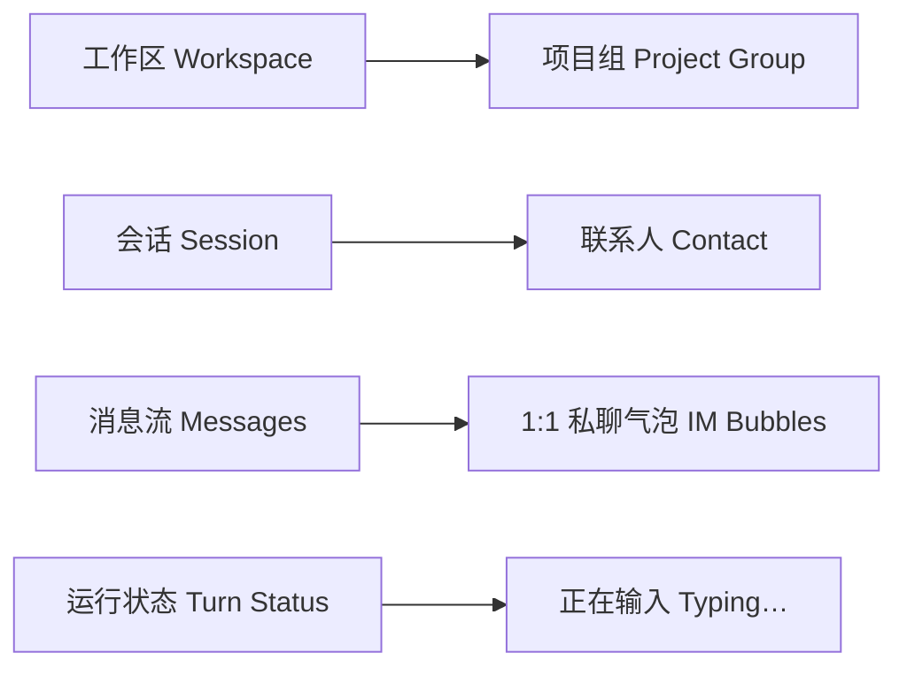

[在 GitHub 查看项目与安装说明 ↗](https://github.com/Liyuk/dsh-skin-chatlab)

每天的工作里，我和 coding agent 的对话已经多到可以按"聊天记录"来算了：开会是会话，调试是会话，改稿也是会话。但我用的工具（[DeepSeek Harness](https://github.com/deepseek-ai/deepseek-harness) 的 Web GUI）长着一张开发工具的脸——左侧是工作区、会话树和文件夹图标，右边是消息流。信息都在，但形态不像我熟悉的 IM。

于是有了 dsh-skin-chatlab：一套给 DSH Web GUI 的**可扩展聊天皮肤**。目前只有飞书这一套：工作区变成项目组，会话变成联系人，聊天窗口变成 1:1 私聊。本文记录它的设计取舍和几个关键实现约束。

先立三条边界：

1. **独立插件**，不改 DSH 本体代码；
2. **不动任何现有插件**，不依赖它们的存在；
3. **设置里可开关**，切回"无皮肤"要能彻底恢复默认外观。

## 设计映射：把工作台翻译成 IM

整个皮肤建立在一条隐喻上：**agent 会话就是 IM 里的联系人**。

| 工作台概念 | 飞书皮肤中的形态 |
| --- | --- |
| 工作区 | 项目组：彩色圆角方块 + 首字母（Meego 风格） |
| 会话 | 联系人：圆形头像 + 最近回复预览 + 未读红点 |
| 聊天窗口 | 1:1 私聊：对方灰色正文，自己蓝色气泡 + 已读标记 |
| 会话运行状态 | "正在输入…" + 三点跳动 |
| 顶栏 | 保留 DeepSeek 品牌，旁边追加皮肤名徽章 |

头像不是随机图：每个会话的 seed 由会话 id（或标题）决定，同一个联系人永远长一个样——这才是"联系人"，而不是"一张图"。头像用 DiceBear 的扁平小人风格，头像之外的项目组方块颜色也按标题哈希到固定色相。



## 架构：基座 + 皮肤包

代码组织成一个 monorepo，三个包：

| 包 | 作用 |
| --- | --- |
| `@liyuk/dsh-skin-chatlab-core` | 基座：皮肤注册表、切换器、装饰逻辑、预览/未读 RPC、设置面板 |
| `@liyuk/dsh-skin-feishu` | 飞书皮肤：设计 token + 专属 CSS + 品牌徽章，**纯外观，零逻辑** |
| `@liyuk/dsh-skin-chatlab` | 聚合包：一键依赖基座 + 飞书 |

皮肤与基座通过 DSH 的插件服务机制连接：基座 `ctx.provide("chatlab", skinRegistry)` 暴露注册表，皮肤包 `inject: ["chatlab"]` 注入后把自己注册进去：

```js
// core：暴露皮肤注册服务
ctx.provide("chatlab", skinRegistry);

// skin-feishu：注入服务并注册自己
inject: ["chatlab"],
apply(ctx) {
  ctx.chatlab.registerSkin({
    id: "feishu",
    name: "飞书",
    desc: "工作区=项目组 · 会话=联系人 · 气泡化聊天",
    ready: true,
    tokens: { light: {}, dark: {} },
    css: FEISHU_CSS
  });
}
```

每套皮肤的契约只有六个字段：

| 字段 | 类型 | 说明 |
| --- | --- | --- |
| `id` | string | localStorage 唯一 key，也写入 `data-chatlab-skin` 属性 |
| `name` | string | 设置面板里显示的名字 |
| `desc` | string | 一句话说明 |
| `ready` | boolean | `false` = 占位皮肤，置灰不可选 |
| `tokens` | `{light, dark}` | 覆盖 `--dsw-alias-*` 设计 token |
| `css` | string | 皮肤专属规则 |

"加一套皮肤 = 新建一个 npm 包"：复制 `skin-feishu`，改名字，换 tokens 和 css，注册进去，完事。Slack、微信、iMessage、WhatsApp 目前以 `ready: false` 的占位皮肤躺在设置面板里。

## 关键实现约束：在 React 应用里做装饰

DSH 的 Web 端是 React 应用，这是整个实现里最需要小心的地方。装饰逻辑（decorators）有四条铁律：

- **绝不用 MutationObserver 观察整个 body**——任何 DOM 变化都会触发 reconcile 检查，会拖垮整个界面；
- **绝不用 `innerHTML = ""` 清空 React 节点**，也**绝不 `insertBefore` 到 React 节点前面**——React 的 `removeChild` 校验会直接崩溃；
- 装饰只 **append 自己的节点**，位置靠 CSS Grid / flex 排布，不移动 React 的任何节点；
- 深色模式交给 DSH 的 `ctx.theme` 服务，插件自己不管明暗切换。

会话行是难点。DSH 的会话行组件**没有逐行插槽**，所以"每人一个头像"不能靠注册槽位实现，只能接管整行布局：CSS Grid 把行重排成「头像 | 标题+时间 | 预览」两行三列，头像、预览、未读红点都是我们 append 上去的节点，靠 grid 定位，不动 React 的 title/time 节点。

```css
[class*="sessionRow"] {
  display: grid;
  grid-template-columns: 32px minmax(0, 1fr) auto auto;
  grid-template-rows: 20px 16px;   /* 标题行 / 预览行 */
}
.cl-avatar   { grid-column: 1; grid-row: 1 / span 2; }  /* 头像跨两行 */
.cl-preview  { grid-column: 2 / span 3; grid-row: 2; }  /* 预览占满第二行 */
```

颜色部分用了飞书官方设计系统（Lark design language）校准的色值：品牌蓝是 **#1456F0**——不是抖音系那个 #3370FF，两者差很多。token 尽量走 `--dsw-alias-*` 变量，但实测 sidebar 作用域里 token 解析不稳定，所以气泡和文件夹图标这类关键颜色直接硬编码飞书蓝，靠 `data-chatlab-skin` 属性做作用域隔离，切皮肤/卸载时统一清理。

两个数据特性值得一提：

**最近回复预览 + 未读红点**。预览文本和未读数来自一个 loopback RPC（`/dsh-skin-chatlab`），宿主端读会话日志（内存中的 live 会话 + 落盘的冷会话），客户端按需拉取。已读位置存 localStorage，`{ sessionId: lastSeq }`，打开会话即自动推进。数据层和皮肤层解耦：预览是"数据",红点是"皮肤"，飞书皮肤把它们画成 IM 的样子，别的皮肤可以画成别的东西。

**"正在输入…"**。DSH 原生会用流光文字显示"Deep diving..."这类回合状态，CSS 改不了文本节点，所以做法是：用 `font-size: 0` 把原文字藏掉、去掉流光动画，再把我们自己的"正在输入 + 三点跳动"注入到状态时钟之前。三点复用同一个错峰动画，观感上就是 IM 的 typing indicator。

## 安装与使用

插件以 DSH 的 profile 插件方式安装，两行命令：

```sh
dsh plugin --profile web add @liyuk/dsh-skin-chatlab-core @liyuk/dsh-skin-feishu
```

然后把这两个包加进 profile 的 `dsh.profile.bundles` 列表，重启 DSH Web，打开「设置 → ChatLab 皮肤」即可切换。也可以只装聚合包 `@liyuk/dsh-skin-chatlab` 一键带上基座与飞书。

## 开发调试：改完代码为什么还要重启

开发期绕不开的一个坑：改完 `packages/*/src/`，`npm run build` 重新打包出 `lib/client.js`，但 dsh web 不会自动加载新代码——host 端已经 `require` 的 `lib/index.js`、浏览器已经加载的 `lib/client.js`，都在各自的缓存里。必须重启 dsh web 再刷新页面，改动才生效。

重启本身也不省心。dsh 自带的 HMR（[`@deepseek-ai/cordis-plugin-hmr`](https://github.com/deepseek-ai/deepseek-harness/blob/master/docs/cordis-tutorial/06-composition-and-hmr.md)）只对 `cordis.yml` 里直接引用的本地源码文件生效，对 `dsh plugin add` 装进 `node_modules` 的插件不生效——manifest、bundles、client 元数据都在进程内缓存。而本地开发用 `link:` 指向仓库目录时，旧进程还占着 3080 端口，直接再起一个 `dsh web` 会报 `EADDRINUSE`。项目里因此放了一个 `restart-web.sh`：按端口杀掉旧进程、等端口释放、再启动。

这个坑有现成的社区解：[`dsh-hot-reload`](https://www.npmjs.com/package/dsh-hot-reload) 监听 profile 的 `pnpm-lock.yaml`，插件升级时就地热重载（失效模块缓存、重新导入、重建 fiber），失败则回滚到旧版本，不必整体重启：

```sh
dsh plugin --profile web add dsh-hot-reload
```

## 效果

以下是实际运行效果（同一 profile 下截图）：


## 下一步：把占位皮肤做出来

设置面板里目前躺着四个 `ready: false` 的占位皮肤。每套 IM 都有自己独特的"平台语汇"，把它们逐个实现，是接下来最顺手的路线：

| 平台 | 可移植的平台语汇 | 对应到 DSH 里的能力 |
| --- | --- | --- |
| Slack | 频道感、线程折叠、emoji 反应 | 工作区 = # 频道；多轮对话折叠成 thread；消息 hover 出快捷操作（复制 / 重新生成） |
| 微信 | 绿气泡、时间线分组、群头像 | 绿色气泡；聊天流插入"今天 / 昨天"时间分隔条；九宫格群头像对应多 agent 会话 |
| iMessage | 带尾巴气泡、双勾、Tapback | 气泡尾巴与渐变；`已送达 / 已读` 状态双勾；点按消息出 Tapback 快捷反应 |
| WhatsApp | 置顶、归档、双蓝勾 | 会话置顶 / 归档；发送状态动画；头像外圈活跃度圆环（= 会话是否在运行） |

皮肤之外的**通用能力**，比单平台皮肤更值得先做：

1. **未读数字角标**——现在只有红点，RPC 已返回最新消息序号，客户端算出差值即可升级成角标；
2. **会话置顶 / 归档**——DSH 原生没有，却是 IM 里最高频的操作；
3. **时间分隔条**——在消息流中插入时间分组，是最能增强"IM 感"的细节之一；
4. **通知与声音**——浏览器 Notification + 新消息提示音，目前只能靠肉眼盯红点；
5. **代码块 / 附件卡片化**——AI 回复里的代码块套深色卡片，像飞书里的富文本卡片；
6. **已读状态流转**——把"AI 正在生成"翻译成 IM 的送达语义：生成中 = 送达中，生成完 = 已读；
7. **头像状态指示器**——会话运行时在头像上叠"忙碌"圆点。

## 已知边界

几个还没做完、或者有意为之的地方，先说清楚：

- **样式选择器稳定性**。部分样式依赖 DSH 内部组件的编译类名（如气泡的 `gdEzaW_bubble`），DSH 升级后类名可能变化。已在逐步迁移到 `data-chat-flow-kind` 这类语义锚点，但完整迁移完成前，DSH 大版本升级需要做一次视觉回归。
- **设置入口偏深**。目前入口在「设置 → 左侧导航 → ChatLab 皮肤」，可发现性一般，后续考虑在侧边栏直接放切换入口。
- **头像依赖在线服务**。头像由 DiceBear 在线生成，离线或内网环境会退化为首字母色块（已做 fallback，但观感打折），后续计划改为本地生成。
- **tokens 契约已预留、飞书皮肤暂未启用**。皮肤契约里有 `tokens` 字段用于覆盖设计 token，但飞书皮肤当前主要在 CSS 层表达视觉，token 化改造在路线图里。
- **AI 回复不套气泡**。这是仿飞书 bot 的刻意取舍：AI 回复是通栏正文，只有用户消息是蓝气泡。如果你期待"你来我往"的双边气泡，iMessage 皮肤会是更贴近的选择。

## 收获

这个项目真正有意思的地方不是"像飞书"，而是**在插件的边界内做改观**：不改 React 逻辑，不碰现有插件的代码，只通过"注册 + 装饰 + CSS 重排"就能把一个开发工具的界面翻译成另一种产品形态。三个可复用的判断：

1. **改外观优先走 CSS，其次走"只加自己的节点"，最后才考虑改逻辑。** 前两条都不会碰 React 的 diff，出问题的概率小一个数量级。
2. **数据与皮肤解耦。** 预览/未读是数据能力，气泡是视觉表达，一个基座统一提供，皮肤各自画法，加新皮肤时不用再写一遍数据逻辑。
3. **"可卸载"是一等公民。** 从第一天就支持切回无皮肤并完整清理（移除样式、节点、属性标记），这让插件敢在"外观"上大胆——反正随时能回到原样。

按这个架构，每加一套皮肤就是新建一个包、注册进去、交一份 tokens 和 css。
