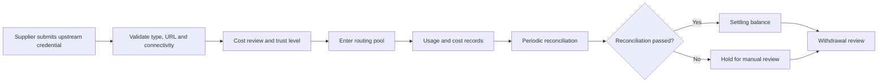
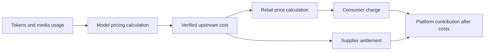
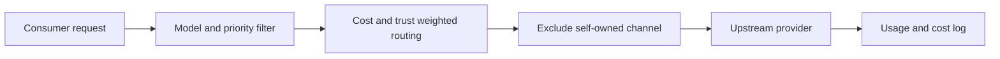

[View Neo Matrix on GitHub ↗](https://github.com/Liyuk/neo-matrix)

## What kind of project is this?

At first glance, Neo Matrix looks like a familiar AI relay: users receive a platform token and call the models offered by the platform; administrators configure channels in the backend, and the system forwards requests upstream.

But the project is not really trying to build one more model aggregation page. It also puts “who provides the capacity, who uses it, and how the money is split” inside the system:

- Consumers face one OpenAI-compatible entry point and do not need to manage keys from multiple upstream providers separately.
- Suppliers can host temporarily idle upstream keys as channels and let the platform schedule requests through them.
- The platform sets unified prices, records the retail price and channel cost for every call, and generates settlement orders by period.
- Administrators handle channel review, reconciliation exceptions, and withdrawals instead of looking only at request success rates.

The most accurate description is therefore: **an AI API relay platform with a revenue-sharing mechanism for suppliers**. It is not an open marketplace or a decentralized network. Consumers cannot choose a particular supplier, and suppliers cannot set prices with complete freedom; the platform controls admission, scheduling, accounting, and settlement.

The 12 demo settlement orders, roughly ¥123 in transaction flow, and one reconciliation exception awaiting verification on the settlement page represent the project's central problem: forwarding a request is only the beginning. The platform must also explain where the money came from, who should receive it, and how to stop when something goes wrong.

## Start with the product: three identities, three paths

### Consumer: one token, multiple models

Consumers receive a platform-issued `sk-` token, not an upstream credential from a supplier. The platform can assign a model allowlist to the token, and consumers call models through the standard `/v1/chat/completions` endpoint.


Consumers do not need to know which channel ultimately handles a request. The product value, from their perspective, is one stable and unified entry point; channel switching, retries, and cost selection are internal platform mechanisms.

### Supplier: turn an upstream key into a schedulable channel

Suppliers submit an upstream key and channel information in the backend. The platform first validates the type, address, and connectivity, then decides whether the channel can enter the pool. Keys must not be exposed to consumers, and the platform must take responsibility for least-privilege access, rotation, revocation, and auditing.


The supplier center shows withdrawable balance, balance under settlement, cumulative earnings, channels, and withdrawal records. These amounts come from demo data and do not represent real income; they show the accounting interface the platform would eventually need to provide.

### Administrator: maintain the supply pool and settlement order

Administrators manage users, channels, models, consumption logs, settlement orders, and withdrawals. They also handle two problems that cannot be fully automated: whether a supplier's declared cost is credible, and whether an abnormal transaction flow should enter the withdrawable balance.


From onboarding to withdrawal, a supplier's journey is not “submit a key and finish.” It is a sequence of state changes:



## How one call travels through the chain


Break one request down and the business path is fairly simple:

```text
Consumer token
      │
      ▼
Authentication and model permission
      │
      ▼
Priority group → cost/trust channel routing
      │
      ▼
Upstream request with supplier key
      │
      ├─ record retail amount
      ├─ record channel cost
      └─ write usage log
               │
               ▼
Settlement → reconciliation → supplier balance → withdrawal review
```

There are two keys here, and they must not be confused:

| Credential | Platform token | Upstream key |
|---|---|---|
| Holder | Consumer | Supplier or platform |
| Purpose | Proves that the consumer can call the platform | Lets the platform call the upstream model |
| Visible to the consumer? | Yes | No |
| Determines the channel? | No | Enters the candidate channel pool |

The platform's unified entry point solves the consumer's access problem; the channel pool and settlement system solve the platform's supply problem. Together, they are what distinguishes Neo Matrix from a relay used only by its owner.

## Cost accounting: informed by Sub2API, not a copy of its subscription model

The earlier approach wrote `cost_ratio` directly as “retail price multiplied by a factor.” That is too coarse to represent real costs, even if it can be used for channel pricing and routing order.

Sub2API's billing implementation offers a more useful separation: first calculate the actual cost of a call from model prices and request usage, then record the user's balance, subscription quota, API-key quota, and upstream-account quota separately. It also quantizes amounts consistently and uses the request ID to prevent the same request from being charged twice. [Official billing implementation ↗](https://github.com/Wei-Shaw/sub2api/blob/main/backend/internal/service/usage_billing.go)

If Neo Matrix is to make its financial model real, it should follow that idea while adding its own supplier revenue-sharing layer:

1. **Usage cost**: calculate the actual upstream cost from input tokens, output tokens, cached tokens, image or audio usage, and the model price table.
2. **Retail charge**: calculate what the consumer owes according to the platform's public price. It may differ from upstream cost, but it must be stable and explainable.
3. **Supplier settlement**: after the upstream cost has been verified, share the profit with the supplier according to the agreed terms.
4. **Platform contribution**: only after subtracting supplier settlement, payment fees, infrastructure, and the risk reserve from retail revenue is the amount left for the platform's actual contribution.



`RoutingCost` can still add a trust penalty to the actual cost for the purpose of choosing a channel, but the trust penalty should not be written into `UsageCost` or `SupplierSettlement`. Otherwise, the same call would produce different accounting costs depending on the routing strategy.

`cost_ratio` is therefore better defined as “the supplier's quote relative to a baseline cost,” rather than the only source of cost truth. It can participate in routing and quote review, but final settlement should preferably rely on explainable token-level costs, upstream bills, or an audited cost baseline.

## Scheduling is not random forwarding

There may be multiple channels behind the same model. The system first selects the highest-priority group, then uses cost and trust to perform weighted random selection within that group:

$$
\text{RoutingWeight} = \frac{1}{\text{CostRatio} \times \text{TrustPenalty}}
$$

The lower the cost and the higher the trust, the greater the channel's probability of receiving a request. New channels are not left with zero traffic; they enter the pool with a lower weight first. If the consumer is also the supplier of a channel, routing excludes that self-owned channel through `excludeOwnerId` to avoid the most direct form of self-dealing.




Trust level is a continuing feedback mechanism: a new channel starts at a low level, rises after normal reconciliation, and is down-weighted after an exception. It is not a complete service-quality system, because response speed, success rate, content quality, and upstream authorization have not all entered the weighting yet; but it is closer to real operations than granting a channel permanent traffic after one approval.

## Business model: what does the platform actually sell?

Neo Matrix does not sell consumers a specific upstream key. It sells a combination of three things:

1. A unified entry point for accessing models;
2. Scheduling, failover, and cost management for upstream channels;
3. Records and settlement for consumer usage and supplier earnings.

Suppliers provide upstream calling capacity that can be scheduled. The platform earns revenue from the spread or service fee generated by each call, while suppliers receive a share based on the cost and usage recorded by the platform.

Compared with a relay that uses only its own channels, this approach brings in more potential supply but also adds complexity: key custody, supplier admission, cost declarations, trust ramp-up, accounting disputes, and withdrawal review all have to exist. Neo Matrix chooses this path not because it is simpler, but because individuals' idle supply may itself become a source of channels.

## Financial estimate: first calculate what one call leaves behind

The following is an estimate, not Neo Matrix's realized revenue and not real operating data from the demo page. To avoid treating an aspiration as a result, start with the formulas:

$$
\text{GrossProfit} = \text{RetailCharge} - \text{VerifiedUpstreamCost}
$$

$$
\text{SupplierSettlement} = \text{VerifiedUpstreamCost} + \text{GrossProfit} \times (1 - \text{PlatformTakeRate})
$$

$$
\text{PlatformContribution} = \text{RetailCharge} - \text{SupplierSettlement} - \text{OperatingCost}
$$

Assume that the platform has ¥100,000 in monthly consumer transaction flow, verified upstream cost is 70% of revenue, and the platform takes 20% of profit:

| Item | Estimate |
|---|---:|
| Retail paid by consumers | ¥100,000 |
| Upstream cost | ¥70,000 |
| Gross profit | ¥30,000 |
| Supplier share | ¥94,000 |
| Platform gross retention | ¥6,000 |

The ¥6,000 is not profit yet. It must cover servers, monitoring, payment fees, support, abnormal losses, key security, development, and supplier operations. If fixed operating cost is ¥3,000 per month and ¥2,000 is reserved for refunds and reconciliation risk, the platform has only about ¥1,000 left. Fixed costs become easier to absorb when transaction flow grows tenfold; but as the flow grows, account suspension, data leaks, payment disputes, and insufficient supply also become more expensive.

### The current code's financial result is not ideal

The implementation status needs to be stated plainly. The current code still defines `cost = retail price × cost_ratio`, while limiting supplier-submitted `cost_ratio` to 1.0–3.0. Under that definition:

| `cost_ratio` | Accounting meaning | Current settlement result |
|---:|---|---|
| 1.0 | Cost equals retail price | The platform has no gross profit |
| Greater than 1.0 | Cost exceeds retail price | Supplier earnings are capped at the retail price, leaving 0 for the platform |
| Less than 1.0 | Cost is below retail price | There could theoretically be gross profit, but the current supplier interface rejects it |

So the 70% cost scenario above is a “commercial target estimate,” not a result that the current default rules can already produce. The project needs a product decision about the definition of the cost factor, approval exceptions below 1.0, and the platform take rate. Otherwise, even if the platform has transaction flow, it may have no revenue.

With a Sub2API-style separation, the direction becomes clearer: `UsageCost` records the actual usage cost, `RetailCharge` records the consumer price, and `SupplierSettlement` records the supplier share. `cost_ratio` handles quote validation and routing instead of pretending to be the entire financial truth.

## Accounting design: why reconciliation and idempotency matter

The project's most valuable engineering work is not the UI, but the three concrete problems that appear during settlement.

First, `used_quota` is a channel's cumulative usage and cannot be subtracted directly from logs for one period. The system needs to store a `used_quota_end` snapshot on each settlement order and calculate the period increment from adjacent snapshots.

Second, rerunning a historical period must not write the current cumulative usage back into an old settlement order, or it will corrupt the reconciliation baseline for the next period.

Third, background jobs, administrator verification, and reruns can happen at the same time. A settlement order must not increase a supplier's balance more than once, so the system uses unique constraints, transactions, and CAS conditional updates.

Settlement states must also remain separate: a new settlement order first enters the supplier's `settling_balance`; an abnormal settlement cannot become withdrawable immediately; only after administrator confirmation does the amount move into `withdraw_balance`.


This design reduces duplicate credits and incorrect payouts, but it still depends on the platform's own logs and configuration. It is not an independent financial audit system, nor does it mean that official upstream billing has already been integrated.

## Mock demo: what it shows and what it does not

The images on the site come from a Neo Matrix interface demo covering the administrator, consumer, and supplier perspectives. The demo contains 4 channels, 12 settlement orders, balances, and withdrawal records, plus one deliberately introduced `used_quota` offset to demonstrate exception verification.

These screenshots describe a product flow, not operating results:

- The pages use local mock data and do not call real models, real accounts, or real payment services.
- Actions in the browser reset after refresh and do not write to a production database.
- The demo users, amounts, keys, withdrawal accounts, and channel addresses are fictional.
- An online static page cannot prove that real upstream calls, real profit, or real withdrawals have been established.

## Risks and sunk costs

### Upstream authorization and account risk

Whether a supplier's key may be shared, proxied, or resold depends first on the upstream service's terms and the authorization of the credential holder. Being technically able to forward a request does not mean that the business has the right to do so. The public Sub2API repository also discusses upstream terms and the boundaries of commercialization in its README. [Read the public Sub2API notes ↗](https://github.com/Wei-Shaw/sub2api)

### Key and data risk

The platform handles suppliers' upstream credentials and may also handle consumer request content. A production system needs key encryption and rotation, least privilege, redacted request logs, access auditing, revocation, and a data-retention policy. One leak could erase a long period of fee revenue.

### Two-sided cold-start risk

Without enough suppliers, the consumer experience is unstable; without consumers, suppliers have no earnings and no reason to keep hosting keys. A routing algorithm can optimize existing supply, but it cannot solve a shortage of both supply and demand. Cold-start costs may exceed server costs by a wide margin, including supplier recruitment, manual review, support, and compensation for failed experiments.

### Financial and operational risk

Low-cost channels may be unreliable, cost declarations may be inaccurate, image and audio requests may not be fully metered, and upstream bills may differ from platform logs. The platform needs funds for refunds, bad debt, and abnormal withdrawals rather than budgeting only from an ideal gross margin.

### Sunk cost: building it does not mean it is worth launching

The project has already absorbed the cost of channel adapters, the supplier role, cost-aware routing, settlement tables, reconciliation snapshots, a withdrawal state machine, frontend mocks, and an end-to-end demo. These investments form a technical asset, but they may not translate into commercial value.

Before a real launch, further investment is still required:

- key custody and security audits;
- upstream authorization, supplier agreements, and compliance advice;
- real-bill verification, refunds, and dispute handling;
- monitoring, alerts, backups, job queues, and a highly available database;
- supplier recruitment, consumer acquisition, and support operations.

If the commercial rules ultimately cannot obtain upstream authorization, or the supplier base remains too small, most of this investment may leave only a runnable technical prototype. That is the sunk cost the project needs to acknowledge in advance.

## Project status

| Phase | Content | Status |
|---|---|---|
| P0 | Fork, module renaming, and branding | ✅ |
| P1 | Cost-aware routing and cost accounting in usage logs | ✅ Tested |
| P2 | Supplier role and pre-validation for hosted keys | ✅ End-to-end verified |
| P3 | Revenue-sharing settlement and reconciliation exceptions | ✅ End-to-end verified |
| P4 | Withdrawal applications, review, payment, and balance refunds after rejection | ✅ End-to-end verified |
| P5 | Subscription-to-API extension | Reserved; not yet a complete production capability |

Neo Matrix is currently better understood as a technical and business prototype for a platformized AI supply model: it connects the entry point, channels, routing, records, settlement, and demo. Whether it can become a business still depends on the financial rules, upstream authorization, real supply scale, and production security.
