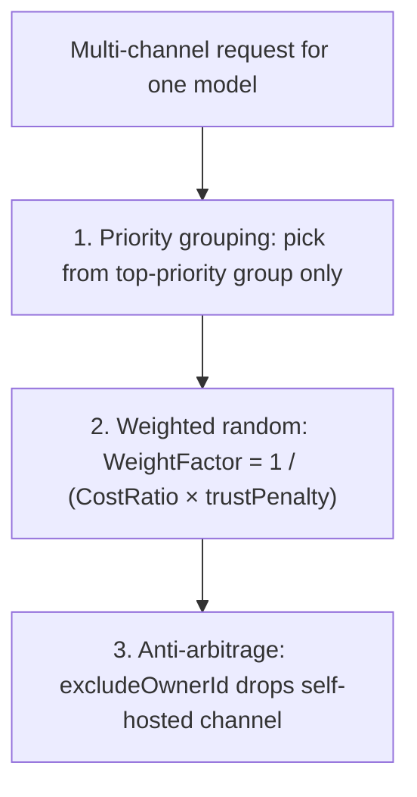
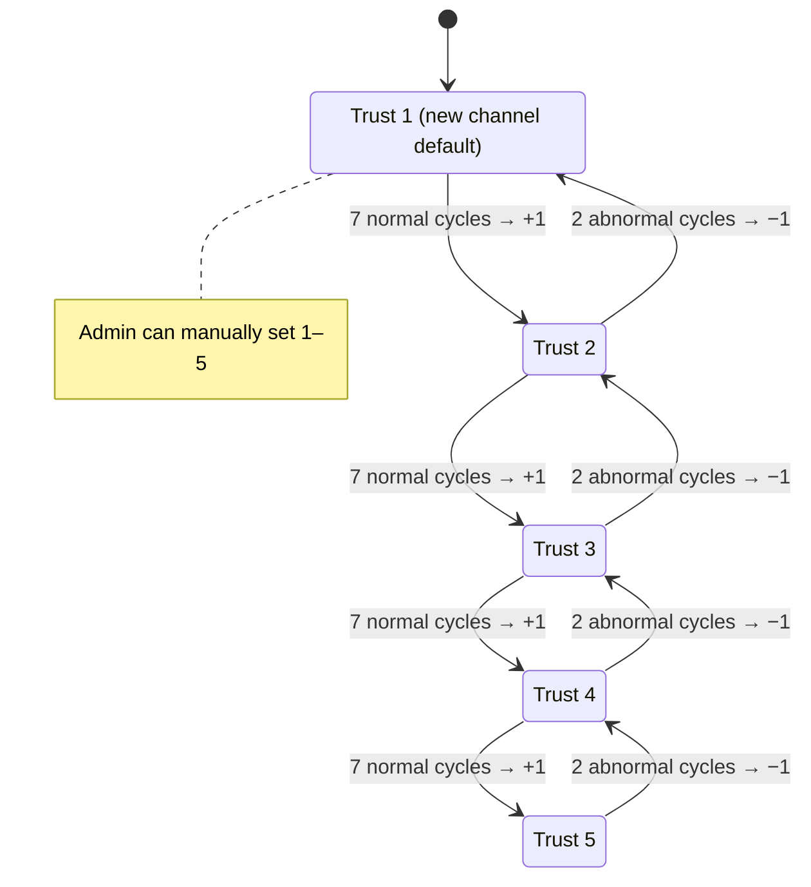

[View Neo Matrix on GitHub ↗](https://github.com/Liyuk/neo-matrix)

> An **OpenAI-compatible relay** built on one-api (MIT): consumers use a single `sk-` token to access the models the platform offers as usual; on top of that, this project adds a **supply side** — individuals can host their idle API keys as channels to join routing, earn a share of real usage, and withdraw. **The key mechanisms are the routing algorithm and settlement reconciliation — they decide how the money is split, who it goes to, and whether it is split wrong.**

The image above is the platform admin's settlement page: 12 settlement orders, ¥123 in flow, 6 recorded, and 1 flagged "reconciliation exception" awaiting verification. This article is about how it works — not the UI, but the **routing and settlement mechanisms behind it**.

## First, let's be clear: this is not "building another relay"

**The consumer-side main flow fully inherits the conventional relay (one-api) design**:

- The platform is an **OpenAI-compatible gateway** that exposes a set of model names (`gpt-4o`, `gpt-4o-mini`, `claude-*`…), and consumers access it with a single `sk-` token.
- Behind each **model** is a set of channels (upstream keys) serving traffic; requests are routed to a specific channel **by model** — `group2model2channels[group][model]`, not "one channel handles all models".
- Consumer pricing is set uniformly by the platform (`ModelRatio`, anchored to official public pricing) and does not vary by channel.
- A token can have a model whitelist (`token.Models`); requests for models not on the whitelist are rejected.

**This project only adds one layer on top of that main flow — a "supply side"**: individuals who hold idle keys (not just platform admins) act as **suppliers**, attach their keys as channels to join routing, and earn a share based on usage. This is what sets Neo Matrix apart from a typical relay.

## Why personal supply sources exist

The API keys people hold are usually scattered: OpenAI, DeepSeek, Gemini, various aggregation platforms… and many people's keys sit **idle** — monthly subscriptions go unused, or test keys gather dust.

Neo Matrix's idea is simple: **turn individuals' idle keys into supply the platform can route.**

- **Consumers**: pay by usage with a `sk-` token as usual; models, pricing, and routing are transparent to them.
- **Suppliers**: host their idle keys, earn a share of real usage, and can withdraw.
- **Platform**: when one model has multiple channels, automatically route through the cost-optimal channel and grow its margin.

What sets it apart from a typical relay is that **the money split is transparent and auditable** — how much the supplier gets and how much the platform keeps is determined precisely by the routing and settlement mechanisms, not by gut feeling.

## First, tell the two keys apart

| | Consumer token (issued by platform) | Upstream key (hosted by supplier) |
|---|---|---|
| Who holds it | Consumer (`sk-`, generated by platform) | Supplier (OpenAI official key, etc.) |
| Who issues it | Platform `/api/token` | Supplier "submits API Key" |
| What it does | Calls `/v1/chat/completions` | Platform uses it to call upstream |
| Who can see it | Only the holder | Platform admin |

**The key the consumer gets is a token issued by the platform, not any upstream key.** Once a request reaches the platform, **the routing algorithm decides by model which supplier's key handles it** — the consumer has no awareness of this and cannot choose which provider is used.

## Architecture: two paths — routing + settlement


Four modules collaborate on the platform: **cost-optimal routing** decides which channel a request goes to; **usage accounting** records both retail and cost prices; **revenue settlement** distributes profit to suppliers by period; **reconciliation + trust** keeps the books trustworthy and suppresses abnormal channels.

## Routing algorithm: how it differs from a typical relay

A typical relay (original one-api, etc.) routes by **random selection**: all available channels go into one pool and one is picked by priority-weighted random. It solves the load-balancing problem of "don't pile all requests onto one channel," but it **does not distinguish channels by cost or trustworthiness**.

Neo Matrix's routing weaves "self-interest" into the weights. When one model has multiple channels, it **neither dispatches at random nor picks only the cheapest**; instead it uses a weighted random with $1 / (\text{Cost Ratio} \times \text{Trust Penalty})$:

1. First group by **priority** and choose only within the highest-priority group.
2. Within the group, do a **weighted random** with $WeightFactor = 1 / (CostRatio \times trustPenalty)$:
   - Lower cost → higher score → higher selection probability (maximizing platform profit)
   - Higher trust → smaller penalty (trust 5 has no penalty; trust 1 magnifies cost 5×) → higher selection probability
   - **Low-trust channels keep a non-zero probability** — ensuring new channels can "climb the ramp"
3. **Anti-arbitrage guard**: if the consumer happens to be the supplier of a channel, routing **excludes that self-hosted channel** (`excludeOwnerId`), structurally eliminating "produce-and-sell-to-yourself" revenue farming.



| Dimension | Typical relay | Neo Matrix |
|---|---|---|
| Priority grouping | ✅ | ✅ |
| Random balancing | ✅ | ✅ (weighted random, low-trust keeps non-zero probability) |
| Channel cost | ❌ | ✅ $1/CostRatio$ |
| Channel trust | ❌ | ✅ $1/trustPenalty$ |
| Anti-arbitrage | ❌ | ✅ `excludeOwnerId` |

> **In one sentence**: a typical relay "scatters requests at random"; Neo Matrix "allocates by weighted 'who is cheaper + who is trusted,' while preventing produce-and-sell-to-yourself." The former solves "can it be used"; the latter solves "how to use it most economically without being farmed."

## Trust levels: low start, automatic climb, downgrade on anomaly

Each channel has a trust level of 1–5 that determines its weight in routing. **New channels default to trust 1** (cost is magnified 5×, so they only receive a small amount of "ramp-up" traffic). The up/down mechanisms:

- **Automatic climb**: 7 consecutive cycles of **normal reconciliation** → trust auto +1 (capped at 5). New channels automatically earn higher routing weight through real operation, without waiting for an admin to promote them manually. (`model/settlement.go upgradeChannelTrust`)
- **Admin manual cap/intervention**: during cost-declaration approval, a trust level (1–5) can be specified as well.
- **Automatic downgrade on anomaly**: 2 consecutive cycles of reconciliation anomalies → trust auto −1 (minimum 1), down only, never up. (`degradeChannelTrust`)

**Trust is a closed loop of "low start + automatic promotion through operation + automatic downgrade on anomaly"**: new channels prove themselves by climbing, abnormal channels are suppressed by negative feedback, and admins only intervene at key points.



Using the demo data as an example: for the same `gpt-4o-mini` request, the official direct connection (cost 1.0, trust 5) gets the largest share; the aggregation platform (cost 1.2, trust 4) comes second; and the subscription-to-API channel (cost 0.8 but trust 2, which carries a penalty) receives a small amount of ramp-up traffic.

## Settlement: how the money is split

Each charge records two numbers: the **retail amount** (what the consumer pays) and the **cost amount** (what is paid upstream). Settlement is per period:

$$
\text{Profit} = \text{Revenue} - \text{Cost}
$$

$$
\text{Supplier Share} = \text{Cost} + \text{Profit} \times (1 - \text{Platform Take Rate})
$$

$$
\text{Platform Retained} = \text{Revenue} - \text{Supplier Share}
$$

By default the platform takes 20% of profit, and $\text{Cost} = \text{Revenue} \times \text{Channel Cost Ratio}$. A cost ratio of 1.0 → profit 0, supplier recovers cost; > 1.0 → the platform takes a cut of profit; < 1.0 (requires approval) → the platform subsidizes to get low-cost supply.


### Three engineering challenges (pitfalls I hit)

This part is the most worth sharing from this development — every one of these was hit for real:

**Pitfall 1: `used_quota` is cumulative during reconciliation — you can't compare it directly.**

The first version directly compared "this period's `used_quota` increment" with "this period's total log volume." It sounds right, but `used_quota` is **a cumulative value since the channel was created**, not a per-period increment. Comparing directly never matches. The correct approach: each settlement order snapshots `used_quota_end`, and the increment is "current value − previous period's snapshot."

**Pitfall 2: rerunning historical periods pollutes the reconciliation baseline.**

If the background settlement loop falls behind, it backfills (re-runs periods that weren't settled before). When the first version reran, it updated `used_quota_end` to the **current** `used_quota` (including later periods' usage), which polluted the next period's increment baseline → consecutive false "reconciliation exception" flags → channels wrongly downgraded. Fix: **reruns do not update the snapshot**, only the aggregate value.

**Pitfall 3: concurrent double-counting of settlement orders.**

Reruns + admin manual confirmation + the background loop can all run at the same time. The first version's update branch didn't touch the balance, so after a rerun the balance drifted from the settlement orders; after switching to "sync the balance by the difference," it turned out two concurrent reruns would stack the difference on the same old value → **double-counting**. The final fix uses CAS: `UPDATE ... WHERE id=? AND status!=settled AND revenue_quota=old value`; if the condition doesn't match, give up. One WHERE clause solved the funds-consistency problem.

### How reconciliation exceptions are handled

A deviation exceeding the 20% threshold is judged a "reconciliation exception" → it gets flagged for admin verification (the orange "verify and record" button). **Better to flag it for manual verification than to let an anomalous flow quietly get recorded.** Consecutive exceptions trigger trust downgrades, forming negative feedback.

## Cost bidding: inherent risks and countermeasures

`cost_ratio` is the cost ratio **self-declared** by the supplier, constrained by the platform to `[1.0, MAX_COST_RATIO]` (default cap 3.0). This "self-declare + locked interval" mechanism has **three inherent risks** against malicious pricing:

| Risk | Nature | Current countermeasure | Recommended hardening |
|---|---|---|---|
| **Inflated declaration** | Declares the 3.0 cap to eat platform profit | Manual approval + trust penalty | Dynamic anchoring / bill spot-audit |
| **Low-price volume grab** | Declares 1.0 at the floor and lowers quality to cut real cost | Lock the 1.0 floor + reconciliation downgrade | Service quality enters routing weight |
| **No price discovery** | Fixed interval doesn't follow the market | Anchored to official price | Quote deviation enters weight |

> Conclusion: the current approach is the conservative "**self-declared cost + locked interval + trust negative feedback**" scheme, which blocks most malicious quotes but is not market bidding. True price discovery (real-time anchoring, dynamic intervals, service-quality weighting) is the direction for future evolution.

## UI overview

### I am a consumer

Create a token → call via the standard OpenAI interface:

```bash
curl http://localhost:3000/v1/chat/completions \
  -H "Authorization: Bearer sk-your-token" \
  -H "Content-Type: application/json" \
  -d '{"model":"gpt-4o-mini","messages":[{"role":"user","content":"Hello"}]}'
```

Price = the platform's unified retail price (`ModelRatio`, anchored to official public pricing). **For the same model, the consumer price stays the same regardless of which channel is used**:


### I am a supplier

Submit an API key → the platform auto-validates it → it joins routing → earn a share by usage → withdraw:


The supplier center shows the books at a glance: ¥54 withdrawable balance, ¥63 in settlement, 20% platform take.

### Channel management for admins


The 4 channels show different cost ratios and trust tiers. Note that "Subscription-to-API · Optimized routing" has cost 0.8 < 1.0 — anything below the official baseline must go through **cost-declaration approval**, to prevent "low-declare volume grabs."

## Where the demo data comes from

The screenshots above come from a **real end-to-end demo**: register a supplier + consumer, host 4 channels pointing to a local mock upstream, the consumer makes 120 real calls through the standard API (across 3 days), the system settles 12 orders totaling ¥123 — of which 6 are recorded, 1 is a reconciliation exception (a used_quota offset was deliberately injected to demo "verify and record"), and the supplier withdraws ¥4.2 pending review + ¥1.4 already paid. **The whole flow runs real HTTP + a local mock, with no manual database edits.**

## A few design points worth seeing in the code

- **Cost-optimal routing** (`model/cache.go`): within the same priority, weighted random by `1/(cost × trust penalty)` — low cost + high trust → higher probability, while low trust keeps a non-zero probability to climb.
- **Anti-arbitrage guard**: a supplier's self-operated channel is excluded from routing (`excludeOwnerId`).
- **Trust-climb closed loop**: consecutive normal periods auto +1 (capped at 5), anomalies auto −1 (minimum 1), down only, admins can intervene manually.
- **Idempotent settlement**: `UNIQUE(period_start, period_end, channel_id)` unique index + CAS balance sync — reruns don't double-record, concurrency doesn't double-count.
- **Reconciliation snapshot**: `used_quota_end` is the increment baseline; reruns don't pollute it.

## Project status

| Phase | Content | Status |
|---|---|---|
| P0 | fork + module rename + branding | ✅ |
| P1 | Cost-optimal routing + usage-log cost accounting | ✅ tested |
| P2 | Supplier role + key hosting pre-validation | ✅ end-to-end verified |
| P3 | Revenue settlement + supplier dashboard (idempotent, reconciliation-exception flagging) | ✅ end-to-end verified |
| P4 | Withdrawal loop (apply / pay / reject and refund balance) | ✅ end-to-end verified |
| P5 | Subscription-to-API extension reserved | ✅ verified |
