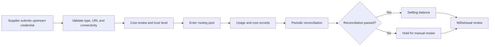
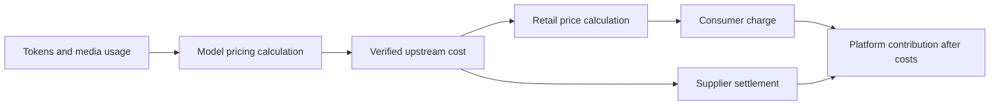
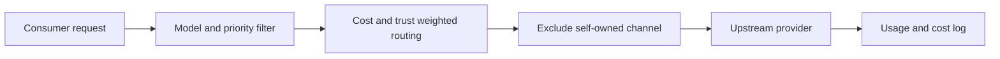

[在 GitHub 查看 Neo Matrix ↗](https://github.com/Liyuk/neo-matrix)

## 这是一个什么项目

如果只看页面，Neo Matrix 很像常见的 AI 中转站：用户拿一个平台令牌，调用平台提供的模型；管理员在后台配置渠道，系统把请求转发到上游。

但这个项目真正想尝试的，不是再做一个模型聚合页面，而是把“谁提供调用额度、谁使用、钱怎么分”也放进系统里：

- 消费者只面对一个 OpenAI 兼容入口，不需要分别管理多家上游 Key。
- 供给方可以把暂时闲置的上游 Key 托管成渠道，参与平台调度。
- 平台统一定价，记录每次调用的零售价和渠道成本，再按周期生成结算单。
- 管理员处理渠道审核、异常对账和提现，而不是只看请求成功率。

因此，Neo Matrix 可以被准确地称为：**一个带供给方分成机制的 AI API 中转平台**。它不是开放市场，也不是去中心化网络。消费者不能挑选具体供给方，供给方也不能完全自由定价；平台掌握准入、调度、记账和结算。

这张结算页里的 12 张演示结算单、约 ¥123 流水和一笔待核验异常单，代表了这个项目的核心问题：请求转发只是起点，平台还必须说明这笔钱从哪里来、应该给谁、出了差错怎么停下来。

## 先看产品：三种身份，三条路径

### 消费者：一个令牌调用多个模型

消费者拿到的是平台签发的 `sk-` 令牌，而不是供给方的上游凭证。平台可以给令牌设置模型白名单，消费者通过标准的 `/v1/chat/completions` 接口调用模型。


消费者不需要知道请求最终落到了哪条渠道。对他来说，产品价值是一个稳定、统一的调用入口；渠道切换、失败重试和成本选择属于平台内部机制。

### 供给方：把上游 Key 变成可调度渠道

供给方在后台提交上游 Key 和渠道信息，平台先做类型、地址和连通性校验，再决定是否让它进入渠道池。Key 不应该暴露给消费者，平台也需要承担密钥最小权限、轮换、撤销和审计责任。


供给方中心展示可提现余额、结算中余额、累计收益、渠道和提现记录。这里的金额来自演示数据，不代表真实收入；它展示的是未来平台应该提供的账目界面。

### 管理员：维护供给池和清算秩序

管理员管理用户、渠道、模型、消费日志、结算单和提现。管理员还要处理两类不能完全自动化的问题：供给方申报的成本是否可信，以及异常流水是否应该进入可提现余额。


供给方从接入到提现，不是“提交一个 Key 就结束”，而是一条带状态变化的流程：



## 一次调用如何走完这条链


把一次请求拆开，业务链路其实很朴素：

```text
Consumer token
      │
      ▼
Authentication and model permission
      │
      ▼
Priority group → cost/trust channel routing
      │
      ▼
Upstream request with supplier key
      │
      ├─ record retail amount
      ├─ record channel cost
      └─ write usage log
               │
               ▼
Settlement → reconciliation → supplier balance → withdrawal review
```

这里有两把 Key，不能混为一谈：

| 凭证 | 平台令牌 | 上游 Key |
|---|---|---|
| 持有者 | 消费者 | 供给方或平台 |
| 作用 | 证明消费者可以调用平台 | 让平台调用上游模型 |
| 消费者是否可见 | 是 | 否 |
| 是否决定渠道 | 否 | 进入候选渠道池 |

平台的统一入口解决了消费者的使用问题；渠道池和结算系统解决了平台的供给问题。两者加起来，才是 Neo Matrix 和普通自用型中转站的区别。

## 成本口径：参考 Sub2API，但不是照搬订阅模型

之前把 `cost_ratio` 直接写成“零售价乘一个倍率”，这个口径太粗了。它可以用来做渠道报价和路由排序，却不适合单独承担真实成本核算。

Sub2API 的计费实现提供了一个更值得借鉴的分层：先根据模型价格和请求用量计算本次调用的实际成本，再分别记录用户余额、订阅额度、API Key 配额和上游账号配额。它还把金额统一量化，并用请求 ID 保证同一请求不会重复扣费。[官方计费实现 ↗](https://github.com/Wei-Shaw/sub2api/blob/main/backend/internal/service/usage_billing.go)

Neo Matrix 如果要把财务模型做实，应该沿用这个思想，但增加自己的供给方分成层：

1. **Usage cost**：根据输入 token、输出 token、缓存 token、图片或音频用量，以及模型价格表，算出本次上游实际成本。
2. **Retail charge**：按照平台对消费者公开的价格计算消费者应付金额。它可以与上游成本不同，但必须稳定、可解释。
3. **Supplier settlement**：在经过验证的上游成本基础上，再按约定分享利润给供给方。
4. **Platform contribution**：零售额减去供给方结算、支付手续费、基础设施和风险准备金后，才是平台真正留下的钱。



`RoutingCost` 仍然可以在实际成本上叠加信任惩罚，用于“选哪条渠道”；但信任惩罚不应该写进 `UsageCost` 或 `SupplierSettlement`，否则同一次调用会因为路由策略不同而产生不同的账面成本。

因此，`cost_ratio` 更适合被重新定义为“供给方报价相对于基准成本的系数”，而不是唯一的成本来源。它可以参与路由和报价审核，但最终结算最好依赖可解释的 token-level 成本、上游账单或经过审核的成本基准。

## 调度不是随机转发

同一模型背后可能有多条渠道。系统先按 `priority` 选择最高优先级组，再在组内根据成本和信任等级做加权随机：

$$
\text{RoutingWeight} = \frac{1}{\text{CostRatio} \times \text{TrustPenalty}}
$$

成本越低、信任等级越高，渠道获得请求的概率越大；新渠道不会完全没有流量，只是先以较低权重进入池子。如果消费者本人也是某条渠道的供给方，调度会通过 `excludeOwnerId` 排除这条自有渠道，避免最直接的自产自销套利。




信任等级是一个持续反馈机制：新渠道从低等级开始，正常对账后逐步升高，异常对账则被降权。它不是完整的服务质量系统，因为响应速度、成功率、内容质量和上游授权状态还没有全部进入权重；但它比一次审核后永久获得流量更接近真实运营。

## 商业模式：平台到底卖什么

Neo Matrix 不是向消费者出售某一把具体的上游 Key。平台出售的是三件事的组合：

1. 一个统一的模型访问入口；
2. 对上游渠道的调度、故障切换和成本管理；
3. 对消费者用量和供给方收益的记录与结算。

供给方提供的是可调度的上游调用能力。平台从每次调用产生的价差或服务费中获得收入，供给方则根据平台记录的成本和用量获得分成。

这和只使用平台自有渠道的中转站相比，换来了更大的供给来源，也带来了额外的复杂度：Key 托管、供给方准入、成本申报、信任爬坡、账目争议和提现审核都必须存在。Neo Matrix 选择这条路，不是因为它更简单，而是因为“个人闲置供给”本身可能成为渠道来源。

## 财务估算：先算清楚一笔调用能留下多少钱

下面是一个估算模型，不是 Neo Matrix 已经实现的收入，也不是演示页面里的真实经营数据。为了避免把愿望当成结果，先把公式写出来：

$$
\text{GrossProfit} = \text{RetailCharge} - \text{VerifiedUpstreamCost}
$$

$$
\text{SupplierSettlement} = \text{VerifiedUpstreamCost} + \text{GrossProfit} \times (1 - \text{PlatformTakeRate})
$$

$$
\text{PlatformContribution} = \text{RetailCharge} - \text{SupplierSettlement} - \text{OperatingCost}
$$

假设平台每月有 ¥100,000 的消费者流水，真实上游成本是流水的 70%，平台从利润中抽取 20%：

| 项目 | 估算金额 |
|---|---:|
| 消费者支付的零售额 | ¥100,000 |
| 上游成本 | ¥70,000 |
| 毛利润 | ¥30,000 |
| 供给方获得 | ¥94,000 |
| 平台毛留存 | ¥6,000 |

这 ¥6,000 还不是利润。它要覆盖服务器、监控、支付手续费、客服、异常坏账、密钥安全、开发和供给方运营。如果每月固定运营成本为 ¥3,000，再预留 ¥2,000 处理退款和对账风险，平台最后只剩约 ¥1,000。流水翻十倍，固定成本才会摊薄；但流水变大以后，封号、数据泄露、支付争议和供给不足的损失也会一起放大。

### 当前代码的财务结果并不理想

这里必须把实现现状说清楚。当前代码仍把 `成本 = 零售价 × cost_ratio`，同时把供给方提交的 `cost_ratio` 限制在 1.0—3.0。按这个定义：

| `cost_ratio` | 账面含义 | 当前结算结果 |
|---:|---|---|
| 1.0 | 成本等于零售价 | 平台没有毛利润 |
| 大于 1.0 | 成本高于零售价 | 供给方收益被封顶到零售价，平台留存为 0 |
| 小于 1.0 | 成本低于零售价 | 理论上有毛利润，但当前供给方接口会拒绝 |

所以，上面的 70% 成本场景是“商业目标测算”，不是当前默认规则下已经可以直接跑出的结果。项目需要在“成本倍率定义、低于 1.0 的审批例外、平台抽成方式”之间做一次产品决策，否则平台即使有流水，也可能没有收入。

如果采用前面介绍的 Sub2API 式分层，解决方向会更清楚：`UsageCost` 记录真实用量成本，`RetailCharge` 记录消费者价格，`SupplierSettlement` 记录供给方分成；`cost_ratio` 只负责报价校验和路由，不再冒充全部财务事实。

## 账务设计：为什么要做对账和幂等

项目里最有价值的工程部分，不是页面，而是结算时遇到的三个具体问题。

第一，`used_quota` 是渠道的累计用量，不能直接拿来和某个周期的日志相减。系统需要保存每张结算单的 `used_quota_end` 快照，用相邻快照计算周期增量。

第二，历史周期补跑不能把当前累计用量写回旧结算单，否则会污染下一周期的对账基准。

第三，后台任务、管理员核验和重跑可能同时发生。同一结算单不能重复给供给方增加余额，所以系统使用唯一约束、事务和 CAS 条件更新。

结算状态也要分开看：新结算单会先进入供给方的 `settling_balance`；异常结算不能直接变成可提现余额；管理员确认后，金额才转入 `withdraw_balance`。


这套设计能减少重复入账和错误放款，但它仍然依赖平台自己的日志和配置。它不是独立的财务审计系统，也不等于已经接入了上游官方账单。

## Mock 演示：现在能看到什么，不能看到什么

站点里的图片来自 Neo Matrix 的界面演示，覆盖管理员、消费者和供给方三个视角。演示数据包括 4 个渠道、12 张结算单、余额和提现记录，另有一次人为制造的 `used_quota` 偏移，用来展示异常核验。

这些截图说明的是产品流程，不是经营结果：

- 页面使用本地 Mock 数据，不调用真实模型、真实账户或真实支付。
- 浏览器中的操作刷新后会恢复，不会写入生产数据库。
- 演示中的用户、金额、Key、提现账户和渠道地址都是虚构的。
- 在线静态页面不能证明真实上游调用、真实利润或真实提现已经成立。

## 风险与沉没成本

### 上游授权和账户风险

供给方的 Key 能不能共享、代理或转售，首先取决于上游服务条款和凭证持有人的授权。技术上能转发，不代表业务上有权转发。Sub2API 的公开仓库也把上游条款风险和商业化边界写在 README 中。[查看 Sub2API 公开说明 ↗](https://github.com/Wei-Shaw/sub2api)

### 密钥与数据风险

平台会接触供给方的上游凭证，也可能接触消费者请求内容。生产环境需要做密钥加密与轮换、最小权限、请求日志脱敏、访问审计、撤销机制和数据保留策略。一个泄露事件可能抵消很长时间的手续费收入。

### 双边冷启动风险

没有足够供给方，消费者体验不稳定；没有消费者，供给方没有收益，也没有理由长期托管 Key。调度算法只能优化已有供给，不能解决供给和需求都不足的问题。冷启动成本很可能比服务器成本更高，包括邀请供给方、人工审核、客服和赔付试错。

### 财务和运营风险

低价渠道可能质量不稳定，成本申报可能不准确，图片和音频等非文本请求可能没有完整计费，上游账单也可能与平台日志不同。平台需要准备退款、坏账和异常提现的资金，而不是只按理想毛利做预算。

### 沉没成本：做出来不等于值得上线

这个项目已经投入的成本包括：渠道适配、供应方角色、成本路由、结算表、对账快照、提现状态机、前端 Mock 和端到端演示。这些投入在技术上形成了资产，但不一定能转化成商业价值。

真正上线前还要继续投入：

- 密钥托管和安全审计；
- 上游授权、供给方协议和合规咨询；
- 真实账单校验、退款和争议处理；
- 监控、告警、备份、任务队列和高可用数据库；
- 供给方招募、消费者获客和客服运营。

如果商业规则最终无法获得上游授权，或者供给方规模不足，那么这些投入大部分只能留下一个可运行的技术样品。这就是项目最需要提前承认的沉没成本。

## 项目状态

| 阶段 | 内容 | 状态 |
|---|---|---|
| P0 | fork、模块重命名与品牌化 | ✅ |
| P1 | 成本感知路由与消费日志成本记账 | ✅ 已测试 |
| P2 | 供给方角色与 Key 托管预校验 | ✅ 已端到端验证 |
| P3 | 分成结算与异常对账 | ✅ 已端到端验证 |
| P4 | 提现申请、审核、打款与驳回退余额 | ✅ 已端到端验证 |
| P5 | 订阅转 API 扩展 | 预留，尚非完整生产能力 |

Neo Matrix 目前更适合作为一个“平台化 AI 供给”的技术和商业原型：它已经把入口、渠道、路由、记录、结算和演示串了起来；但财务规则、上游授权、真实供给规模和生产安全，仍然决定它能不能从一个项目变成一门业务。
