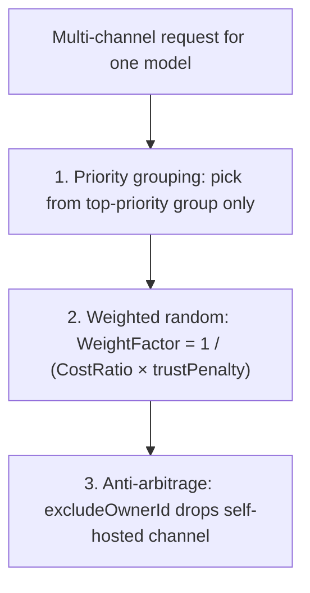
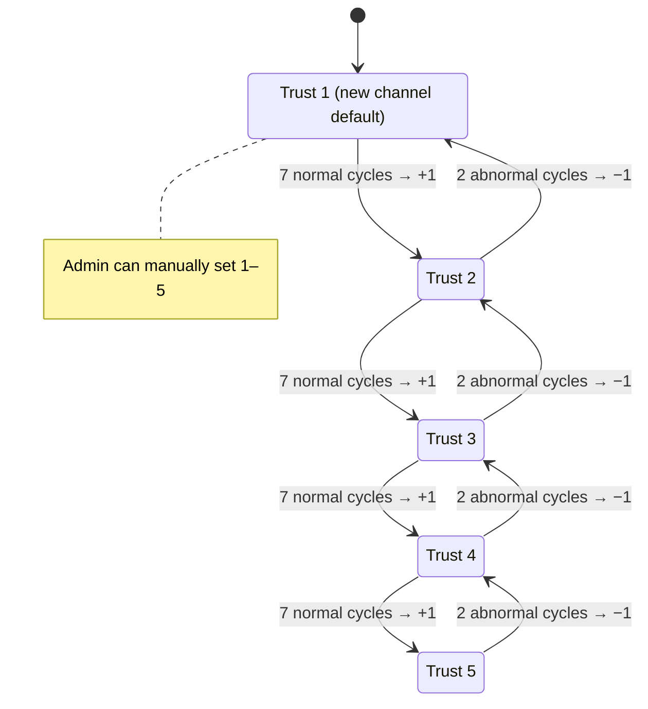

[在 GitHub 查看 Neo Matrix ↗](https://github.com/Liyuk/neo-matrix)

> 一个基于 one-api（MIT）改造的 **OpenAI 兼容中转站**：消费者照常用一个 `sk-` 令牌访问平台提供的各模型；在此基础上，本项目增加了**供给侧**——个人可以把闲置 API Key 托管成渠道参与调度，按真实用量分成、可提现。**关键机制是调度算法和结算对账，它们决定钱怎么分、分给谁、会不会分错。**

上面这张是平台管理端的结算页：12 张结算单、¥123 流水、6 张已入账、1 张"对账异常"等着核验。这篇文章讲它是怎么做到的——不是讲 UI，是讲**背后的调度与结算机制**。

## 先说清楚：这不是「再造一个中转站」

**消费者侧的主流程完全继承常规中转站（one-api）的设计**：

- 平台是一个 **OpenAI 兼容网关**，对外暴露一批模型名（`gpt-4o`、`gpt-4o-mini`、`claude-*`…），消费者用一个 `sk-` 令牌访问。
- 每个**模型**背后有一批渠道（上游 Key）在服务；请求按**模型**被调度到具体渠道——`group2model2channels[group][model]`，不是「一个渠道处理所有模型」。
- 消费者价格由平台统一定价（`ModelRatio`，锚定官方公开价），不随渠道浮动。
- token 可以有模型白名单（`token.Models`），不在白名单的模型请求会被拒绝。

**本项目在这个主流程之上，只加了一层「供给侧」**：让持有闲置 Key 的个人（而不是只有平台管理员）作为**供给方**，把自己的 Key 挂成渠道参与调度，并按用量获得分成。这才是 Neo Matrix 区别于一般中转站的地方。

## 为什么会有个人供给源

大家手里的 API Key 通常是分散的：OpenAI、DeepSeek、Gemini、各种聚合平台…… 而很多人的 Key 是**闲置**的——包月订阅用不完，或者测试 Key 吃灰。

Neo Matrix 的想法很简单：**把个人闲置的 Key，变成平台可调度的供给。**

- **消费者**：照常用 `sk-` 令牌按量付费，模型、价格、调度对他透明。
- **供给方**：闲置 Key 托管进来，按真实消耗分成，能提现。
- **平台**：同模型多渠道时自动走成本最优的渠道，把利润做大。

区别于一般中转站的，是**分钱是透明的、可对账的**——供给方拿多少、平台留多少，由调度和结算机制精确决定，而不是拍脑袋。

## 先分清两把钥匙

| | 消费者令牌（平台签发） | 上游 Key（供给方托管） |
|---|---|---|
| 谁持有 | 消费者（`sk-`，平台生成） | 供给方（OpenAI 官方 Key 等） |
| 谁签发 | 平台 `/api/token` | 供给方"提交 API Key" |
| 干什么 | 调 `/v1/chat/completions` | 平台拿去调上游 |
| 谁能见 | 只有持有者 | 平台管理端 |

**消费者拿到的 key，是平台发的令牌，不是任何上游的 key。** 请求打到平台后，**按模型走调度算法决定交给哪个供给方的 Key 去处理**——消费者无感知，也决定不了用哪家。

## 架构：调度 + 结算两条链路


平台上有四个模块在协作：**成本最优路由**决定请求走哪个渠道；**消费记账**同时记零售价和成本价；**分成结算**按周期把利润分给供给方；**对账 + 信任**保证账目可信、异常渠道被压制。

## 调度算法：和一般中转站有什么不同

一般中转站（one-api 原版等）的调度是**随机选路**：所有可用渠道放一个池子，按优先级加权随机挑一个。它解决的是"请求别都挤在一条渠道上"的负载均衡问题，**不区分渠道的成本和可信度**。

Neo Matrix 的调度把"利益"织进了权重。同模型多渠道时，**不是随机派发，也不是只挑最便宜的**，而是按 $1 / (\text{Cost Ratio} \times \text{Trust Penalty})$ 加权随机：

1. 先按**优先级**分组，只在最高优先级这一组里选。
2. 组内按 $WeightFactor = 1 / (CostRatio \times trustPenalty)$ **加权随机**：
   - 成本越低 → 分值越高 → 选中概率越大（平台利润最大化）
   - 信任越高 → 惩罚越小（信任 5 无惩罚，信任 1 成本放大 5 倍）→ 选中概率越大
   - **低信任渠道概率非零**——保证新渠道能"爬坡"
3. **反套利防线**：如果消费者正好是某渠道的供给方，调度会**排除他自己托管的渠道**（`excludeOwnerId`），从机制上杜绝"自产自销套分成"。



| 维度 | 一般中转站 | Neo Matrix |
|---|---|---|
| 优先级分组 | ✅ | ✅ |
| 随机均衡 | ✅ | ✅（加权随机，低信任概率非零） |
| 渠道成本 | ❌ | ✅ $1/CostRatio$ |
| 渠道信任 | ❌ | ✅ $1/trustPenalty$ |
| 反套利 | ❌ | ✅ `excludeOwnerId` |

> **一句话**：一般中转站是"随机把请求撒出去"；Neo Matrix 是"按『谁便宜 + 谁可信』加权分配，同时防自产自销"。前者解决"能不能用"，后者解决"怎么用最划算、且不会被人薅"。

## 信任等级：低起点，自动爬坡，异常降权

每个渠道信任等级 1-5，决定它在调度里的权重。**新渠道默认信任 1**（成本被放大 5 倍，只能分到少量爬坡流量）。升降机制：

- **自动爬坡**：连续 7 个周期**对账正常** → 信任自动 +1（封顶 5）。新渠道靠真实运营自动获得更高调度权重，不用等管理员手动提。（`model/settlement.go upgradeChannelTrust`）
- **管理员手动封顶/干预**：成本申报审批时可顺带指定信任等级（1-5）。
- **异常自动降权**：连续 2 个周期对账异常 → 信任自动 -1（最低 1），只降不升。（`degradeChannelTrust`）

**信任是"低起点 + 运营自动升 + 异常自动降"的闭环**：新渠道靠爬坡证明自己，异常渠道被负反馈压制，管理员只在关键节点干预。



用演示数据举例：同样的 `gpt-4o-mini` 请求，官方直连（成本 1.0，信任 5）份额最多；聚合平台（成本 1.2，信任 4）次之；订阅转API（成本 0.8 但信任 2 有惩罚）分到少量爬坡流量。

## 结算：钱怎么分

每笔消费记两个数：**零售额**（消费者付的）和**成本额**（付给上游的）。周期结算：

$$
\text{Profit} = \text{Revenue} - \text{Cost}
$$

$$
\text{Supplier Share} = \text{Cost} + \text{Profit} \times (1 - \text{Platform Take Rate})
$$

$$
\text{Platform Retained} = \text{Revenue} - \text{Supplier Share}
$$

其中默认平台抽 20% 利润，且 $\text{Cost} = \text{Revenue} \times \text{Channel Cost Ratio}$。成本倍率 1.0 → 利润 0，供给方拿回成本；> 1.0 → 平台有利润抽；< 1.0（需审批）→ 平台贴钱换低价供给。


### 三个工程难点（踩过的坑）

这部分是这次开发里最值得说的，每一个都是真实踩出来的：

**坑 1：对账时 `used_quota` 是累计值，不能直接比。**

第一版直接拿"本周期的 `used_quota` 增量"和"本周期日志总量"比对。听起来对，但 `used_quota` 是**从渠道创建以来的累计值**，不是周期增量。直接比永远对不上。正确做法：每张结算单快照 `used_quota_end`，用"当前值 − 上一周期快照"求增量。

**坑 2：重跑历史周期会污染对账基准。**

后台结算循环一旦落后会 backfill（补跑之前没结算的周期）。第一版重跑时把 `used_quota_end` 更新成**当前的** `used_quota`（含后续周期消费），导致下一周期的增量基准被污染 → 连续误判"对账异常" → 渠道被误降权。修复：**重跑不更新快照**，只更新聚合值。

**坑 3：结算单的并发双计入。**

重跑 + 管理员手动确认 + 后台循环可能同时跑。第一版 update 分支不碰余额，重跑后余额与结算单漂移；改成"按差额同步余额"后又发现两个并发重跑会基于同一旧值叠加差额 → **双计入**。最终用 CAS：`UPDATE ... WHERE id=? AND status!=settled AND revenue_quota=旧值`，条件不命中就放弃。一行 WHERE 解决了资金一致性问题。

### 对账异常怎么处置

偏差超过 20% 阈值即判"对账异常"→ 标记出来等管理员核验（橙色"核验入账"按钮）。**宁可标出来人工核验，也不让异常流水悄悄入账。** 连续异常会触发信任降权，形成负反馈。

## 成本竞价：固有的风险与对策

`cost_ratio` 是供给方**自报**的成本倍率，平台用 `[1.0, MAX_COST_RATIO]`（默认上限 3.0）约束。这套"自报 + 区间锁死"的机制在对抗恶意报价上有**三个固有风险**：

| 风险 | 本质 | 当前对策 | 推荐加固 |
|---|---|---|---|
| **虚报抬高** | 报到上限 3.0 吃平台利润 | 人工审批 + 信任惩罚 | 动态锚定 / 账单抽查审计 |
| **低价抢量** | 报 1.0 贴底价，靠降质压低真实成本 | 下限锁 1.0 + 对账降权 | 服务质量进调度权重 |
| **无价格发现** | 固定区间不随市场变 | 官方价锚定 | 报价偏离度进权重 |

> 结论：当前是"**自报成本 + 区间锁死 + 信任负反馈**"的保守方案，能挡大部分恶意报价，但不是市场竞价。真正的价格发现（实时锚定、动态区间、服务质量加权）是后续演进方向。

## 界面速览

### 我是消费者

创建令牌 → 用标准 OpenAI 接口调用：

```bash
export NEO_MATRIX_BASE_URL=http://your-neomatrix-host:3000
curl "${NEO_MATRIX_BASE_URL}/v1/chat/completions" \
  -H "Authorization: Bearer sk-你的令牌" \
  -H "Content-Type: application/json" \
  -d '{"model":"gpt-4o-mini","messages":[{"role":"user","content":"你好"}]}'
```

价格 = 平台统一零售价（`ModelRatio`，锚定官方公开价）。**同一模型无论走哪个渠道，消费者价格不变**：


### 我是供给方

提交 API Key → 平台自动校验 → 参与调度 → 按用量分成 → 提现：


供给方中心一眼看清账目：可提现余额 ¥54、结算中 ¥63、平台抽成 20%。

### 管理员的渠道管理


4 个渠道展示不同成本倍率与信任档位。注意"订阅转API · 优化路由"成本 0.8 < 1.0——低于官方基准必须走**成本申报审批**，防"低报抢量"。

## 演示数据怎么来的

以上截图来自一次**真实的端到端演示**：注册供给方 + 消费者，托管 4 个渠道指向本地 mock 上游，消费者通过标准 API 真实消费 120 次（跨 3 天），系统结算出 12 张单、共 ¥123，其中 6 张入账、1 张对账异常（人为制造一次 used_quota 偏移演示"核验入账"），供给方提现 ¥4.2 待审 + ¥1.4 已打款。**全流程走真实 HTTP + 本地 mock，没有手工改库。**

## 代码里值得一看的几处设计

- **成本最优路由**（`model/cache.go`）：同优先级按 `1/(成本×信任惩罚)` 加权随机，成本低信任高 → 概率大，低信任保留非零概率爬坡。
- **反套利防线**：供给方自营渠道在调度中被排除（`excludeOwnerId`）。
- **信任爬坡闭环**：连续正常周期自动 +1（封顶 5），异常自动 -1（最低 1），只降不升，管理员可手动干预。
- **幂等结算**：`UNIQUE(period_start, period_end, channel_id)` 唯一索引 + CAS 余额同步，重跑不重复入账、并发不双计入。
- **对账快照**：`used_quota_end` 是增量基准，重跑不污染。

## 项目状态

| 阶段 | 内容 | 状态 |
|---|---|---|
| P0 | fork + 模块重命名 + 品牌化 | ✅ |
| P1 | 成本最优路由 + 消费日志成本记账 | ✅ 已测试 |
| P2 | 供给方角色 + Key 托管预校验 | ✅ 已端到端验证 |
| P3 | 分成结算 + 供给方看板（幂等、对账异常标记） | ✅ 已端到端验证 |
| P4 | 提现闭环（申请 / 打款 / 驳回退余额） | ✅ 已端到端验证 |
| P5 | 订阅转 API 扩展预留 | ✅ 已验证 |
