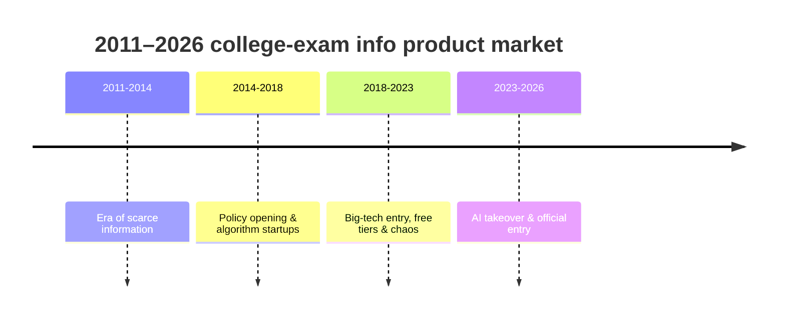

[View OurBook on GitHub ↗](https://github.com/weNKers/OurBook) · [www.wenkers.cn ↗](https://www.wenkers.cn)

> A public-interest project started by people from Nankai and carried on for over a decade: current students and graduates write down their real college experiences, helping gaokao applicants see a more three-dimensional picture of each university when filling in their preferences. The project was passed down for seven or eight years, with its content hosted for a time on a third-party platform; in 2018 I rebuilt it, brought the data back in-house on a self-built site, maintained it ever since, and finally closed it out and archived it. This article is half about the project itself and half about the industry it sits in—from 2011 to 2026, college-admissions information moved from "information scarcity" to "large AI models," while OurBook always stood on the opposite side of the market.

## A public-interest project that began in 2012

One evening in March 2012, two people from Nankai ran into each other in the Renmin University library and talked about how carelessly they had filled in their preferences back then. The remark "I wish I had known what I was getting into when I filled in my preferences" launched a project that would last more than a decade: get Nankai graduates to write down their real college experiences—not rankings, not admission scores, but "after a year at this school, this is what I found it to be like."

By 2018, the project had been passed down for seven or eight years—**seven cohorts of Nankai alumni, over 500 people** taking turns contributing, from Peking University and Tsinghua to universities across every province, with more than a million characters in total. The content kept circulating, and there was always a site to carry it, **but it was hosted on a third-party site-building platform** (the old site ran on Kuaizhan, `lovenk.kuaizhan.com`).

**In April 2018, we decided to rebuild the project and take the data back in-house on a self-built site.** On May 19, I created the GitHub repository `weNKers/OurBook`, migrated the submissions off the third-party platform in one piece, and built a self-hosted site with VuePress—still very new at the time—and www.wenkers.cn went live.

## What I did

The core work in that period really came down to two things: **taking over the data** and **rebuilding the self-hosted site**:

- **Data takeover**: the bulk of the submissions was originally hosted on a third-party site-building platform (Kuaizhan). I wrote a crawler to pull several hundred articles out in one go, organized them into Markdown grouped by school directory, and uniformly added frontmatter metadata—the project's core asset was back in our own hands for the first time.
- **Site rebuild**: rebuilt it with VuePress 0.9 + a custom theme, with two-level navigation "region → school → article"; `constants/univ.js` maintains the mapping between abbreviations and full Chinese names, and the sidebar is generated automatically by a script that scans the tree.
- **Search**: integrated Algolia full-text search, then turned off the service worker over size concerns and fell back to multi-keyword fuzzy matching based on titles and paths.
- **Comments and feedback**: switched from Disqus (too many ads) to laibili, then to self-hosted Cusdis—each time it was another long-term debt in the "comments module" component library.
- **Deployment**: GitHub Actions publishing GitHub Pages + a custom-domain CNAME.

A very "old-school" static site, yet it solved a few problems thoroughly: the articles are readable Markdown files, so anyone who opens the repository can see all of the content; the site is purely static, with almost zero operational cost; and the content belongs to the community, released under CC BY-NC-SA 4.0. That line in the commit history—"the fact that it still runs after four years is already a miracle"—is a shared portrait of this kind of old project.

In 2022 and 2026, I modernized it twice more: upgraded to VuePress 2 + Vite, added SEO/sitemap plugins, fixed the Cusdis comment lifecycle until it was stable, and added a full set of content-audit scripts to the repository—checking local assets, images, internal links, and frontmatter, with a single `npm run check` command before it goes onto CI.

## 2011-2026: The market for college-admissions information products

While writing about this project, I also went through the market it sits in. Over fifteen years, the same question—"how do you let applicants see real information when filling in their preferences"—has been answered by completely different product forms.

### 2011-2014: The era of information scarcity

In 2011, if an applicant's family wanted to learn about a university, they relied mainly on three things: the paper *Application Guide*, the experience of their homeroom teacher, and word of mouth from older students on forums. The Ministry of Education's "Sunshine Project" had long since built an official information platform offering admissions policies and basic institutional information, but it was almost blank on questions like "what does it actually feel like to study at this university."

This was exactly the backdrop when OurBook began—on that evening in 2012, what the two Nankai people lacked was precisely this kind of first-hand "subjective experience." And back then almost no one treated it as a business.

### 2014-2018: Policy opening and the algorithm startup wave

In September 2014, the State Council issued the *Implementation Opinions on Deepening the Reform of the Examination and Enrollment System*: no more division between humanities and sciences, pilot programs in Zhejiang and Shanghai, and the removal of bonus points for students with special talents. At the policy level, the new gaokao made filling in preferences unprecedentedly complex—subject selection, score conversion, and major groups turned "filling in preferences" from a single choice into a decision that required professional tools.

A wave of startups emerged on the back of this trend. YouZhiYuan was the most representative: it used historical admission data + algorithms to make "reach / match / safety" preference recommendations, and secured a tens-of-millions-yuan Series A round in 2016; the same track also had Wanmei Zhiyuan and a batch of other players. In 2017, Zhejiang and Shanghai held the first sitting of the new gaokao, and iiMedia Research released the first *Special Research Report on Gaokao Preference Filling*—the industry entered the public eye for the first time.

### 2018-2023: Big-tech entry, free tiers, and chaos

In 2019, Quark launched a special gaokao edition covering more than 2,600 universities and 1,500 majors—the first time a search-engine giant turned the gaokao into a complete information-service channel. In the years that followed, Quark stuck to "free and inclusive," serving tens of millions of applicant families for five consecutive years and pulling preference filling away from paid consulting toward free information.

At the same time, the consulting business was ballooning: in 2021, newly registered preference-filling companies grew 77% year over year, and the media began describing the track as a "hundred-billion-yuan market" (a figure that is quite disputed). Chaos followed—high-priced consulting, credential chaos around "preference planners," and hunger marketing. In June 2022, the Ministry of Education issued a document specifically banning training institutions from profiting off preference-filling consulting services and banning cooperation between schools and institutions. The same year, internet-celebrity admissions consulting in the style of Zhang Xuefeng began to blow up; by 2024 the media was even reporting that he "sold 200 million yuan of courses in 3 hours."

### 2023-2026: AI takeover and official entry

From 2023 on, AI became the protagonist of this track. In 2025 Quark released the "first large model for gaokao preferences," launching three major features—deep search, preference reports, and smart preference selection; Baidu's AI preference assistant integrated DeepSeek; and QQ Browser introduced "AI Gaokao Pass."

In 2024, the Ministry of Education launched the "Sunshine Preference" system—the first time the government offered a preference-filling information system for free, a direct response to high-priced consulting. In 2026, national gaokao registration reached 12.9 million; the same year, CCTV exposed the "chaos in the preference-filling services market": one parent spent 8,800 yuan on a preference-filling service and got back more than 20 pages of "AI nonsense." Official free tools plus AI-generated content were raising supply on one side while also exposing the opportunism in this industry on the other.

### Fifteen years at a glance

| Stage | Time | Information form | Landmark events |
| --- | --- | --- | --- |
| Information scarcity | 2011-2014 | Paper guides, teacher experience, forums | Ministry of Education's "Sunshine Project"; OurBook's origin in 2012 |
| Policy + algorithm startup wave | 2014-2018 | Data + algorithmic recommendations | 2014 new-gaokao opinions; 2016 YouZhiYuan tens-of-millions funding; 2017 first new-gaokao sitting in Zhejiang & Shanghai |
| Big-tech free tiers | 2018-2023 | One-stop information channels | 2019 Quark gaokao; 2021 enterprises up 77%; 2022 Ministry of Education regulatory notice |
| AI + official entry | 2023-2026 | AI generation, agents, official systems | 2024 Ministry of Education "Sunshine Preference"; 2025 Quark gaokao large model; 2026 CCTV exposes chaos |

## The divide between public-interest content and commercial products

Looking at OurBook across these fifteen years, its position is interesting—**from day one it stood on the opposite side of the market**.

**While the post-2014 startups were busy packaging preference filling with "algorithms" and "data," OurBook offered the subjective experience of a single person, written by hand.** No probabilities, no reach/match/safety—only "after a year at Peking University, this is what I found it to be like."

**In its information form, it was always a "person" rather than a "model."** A Peking University overview entered in 2012 opens with "Like many of you, I was intoxicated by her legend." This kind of information can't be computed by an algorithm, and a large model can't generate it either—it comes from a real person's overall memory of a university, carrying judgment, emotion, and bias, and bias is itself a part of what is real.

**It was also free—completely free.** From 2012 to today, the project has never taken ads, never sold consulting, never had a VIP tier. CC BY-NC-SA 4.0 means anyone is free to copy and distribute it. In what the media calls a "hundred-billion-yuan market," this is almost an anomaly.

**But time has also changed the thing itself.** Fifteen years on, the market has gone from paper guides to large AI models, and information has grown ever more "abundant." An applicant who wants to learn about a university now has short videos, livestreams, all kinds of apps, and large-model Q&A—far more channels for getting information than there were in 2012. **OurBook therefore no longer has the timeliness it once did**: a Peking University overview written and entered in 2012 still talks about the Peking University of that era; the people it helped were the successive cohorts of applicants of the information-scarcity era.

It was never commercialized into a "product" to keep itself alive, and no new submissions are circulating anymore. **It froze in place there, preserved as a piece of collective memory.**

## Epilogue

When I wrote this article (August 2026), the project had stopped updating and was preserved as an archive: 66 universities, more than 400 articles, and the site still runs on GitHub Pages, published automatically by GitHub Actions. It has no funding, no team, no business model—only a group of people who were once willing to write down their college lives.

And my role was one of the founders, and also the librarian who closed it out at the end: in 2018 I brought this collective memory back from a third-party platform, then returned again and again to polish its tech stack, until it went from "useful information" to "something that commemorates an era." Some projects end up not growing, but being well preserved—and this, perhaps, is the difference between a librarian and an author.
