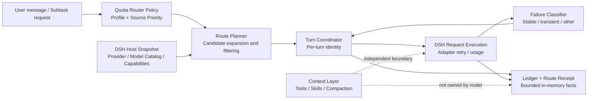
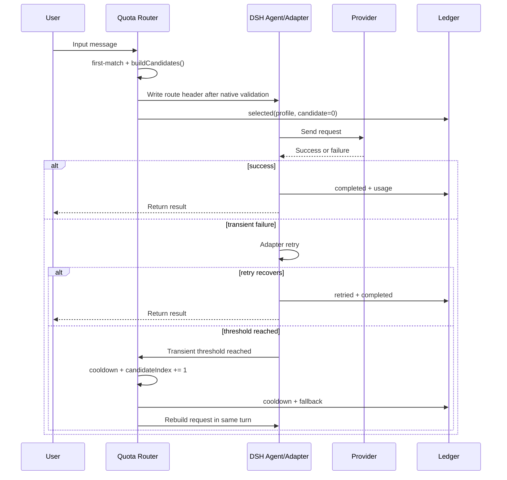
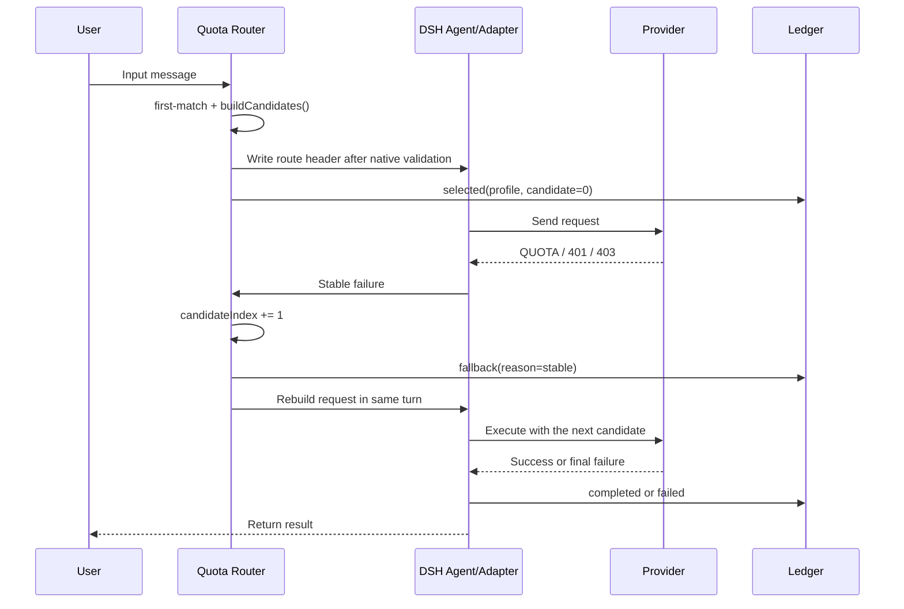
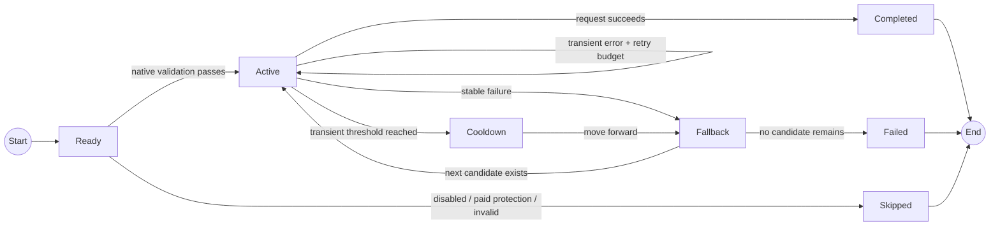

The hard part of multi-model, multi-provider routing is not merely switching models. It is preserving the answers to a set of operational questions:

- What task did this request originally belong to?
- Why was this candidate selected?
- Should this failure be retried, or should the route advance?
- Will a fallback preserve the original task policy?
- Does a cheaper model actually reduce cost, or did it only move the request to a cheaper endpoint?

`dsh-quota-router` turns those implicit decisions in hooks and error handlers into a configurable, testable, observable policy layer for DeepSeek Harness (DSH).

This article explains its engineering design and core algorithms. It is not a usage guide, and it does not present tool lazy-loading or context compaction as capabilities that the router does not currently implement.

## Overall architecture: four boundaries, two directions

Quota Router owns route decisions and route recovery. It reads host capabilities from DSH and writes model selection and recovery actions back to DSH. It does not take over providers, tools, or context management.



The key property is the direction of these edges:

- DSH's model catalog is the validation authority; the router does not register or guess model capabilities;
- the router is the single writer for route headers, fallback actions, and route receipts;
- DSH owns request execution, adapter retries, and usage events;
- a context layer can coexist with the router, but should not silently rewrite a locked route decision through tool schema or compaction state.

## 1. Separate source order from task model selection

The most fragile routing configuration puts everything into one global fallback chain:

```text
default model → backup model → paid model
```

That chain cannot express task-specific quality requirements. Ordinary coding and difficult coding may share a primary route while needing different fallbacks:

```text
ordinary coding:  fast-model → capable-model
hard coding:      fast-model → strong-model
```

Quota Router therefore uses two orthogonal dimensions:

```yaml
sources:
  - id: subscription
    provider: subscription-provider
    priority: 1
  - id: free-pool
    provider: free-provider
    priority: 2

profiles:
  - id: coding
    keywords: [write code, fix, bug]
    modelBySource:
      subscription: fast-model
      free-pool: capable-model
  - id: hard-coding
    keywords: [concurrency, deadlock]
    modelBySource:
      subscription: fast-model
      free-pool: strong-model
```

`sources` answers “which source comes first?” and `profiles` answers “which model does this task use at each source?” The runtime expands them into a candidate chain for each task.

The engineering payoff is that global cost/risk policy and task-quality policy do not overwrite one another. Users can reorder sources without duplicating every task configuration.

### A complete expansion example

| priority | source | tier | automatic | coding model | hard-coding model |
| ---: | --- | --- | --- | --- | --- |
| 1 | `subscription` | subscription | yes | `fast-model` | `fast-model` |
| 2 | `free-pool` | free | yes | `capable-model` | `strong-model` |
| 3 | `metered-api` | paid | explicit opt-in | `cheap-api-model` | `strong-api-model` |

For `coding`, the projected chain is:

```text
subscription/fast-model
    → free-pool/capable-model
    → metered-api/cheap-api-model (skipped by default)
```

For `hard-coding`, it is:

```text
subscription/fast-model
    → free-pool/strong-model
    → metered-api/strong-api-model (skipped by default)
```

Priority controls the global source order, but it does not replace a Profile's model mapping. Source order has one authority; task-to-model mapping has another.

## 2. First-match is a deterministic policy, not a classifier

Profile matching follows declaration order. The router checks enabled Profiles from top to bottom and stops at the first keyword match.

```text
Input message
  ↓
Profile 1: hard-coding keywords? — yes → use Profile 1
  ↓ no
Profile 2: coding keywords? — yes → use Profile 2
  ↓ no
Default path
```

This is not a runtime LLM classifier. The router should not call another model merely to decide which model to call next.

Deterministic matching gives three practical benefits:

1. the same input and configuration produce the same Profile;
2. an operator can explain exactly which rule matched;
3. classifier drift cannot silently change cost or fallback behavior.

The trade-off is that ordering matters: more specific Profiles should come before general ones.

## 3. Candidate-chain algorithm: expand first, filter second

For a Profile, the router roughly performs the following procedure:

```text
for source in sources sorted by priority:
    if source is disabled: skip
    if the Profile has no model for source: skip
    if source is not automatically eligible: skip
    if source is paid and paid fallback is not enabled: skip
    add candidate(source, model, reasoningEffort)
```

Candidates then pass DSH native validation: the provider must be registered, the model must exist, and the requested reasoning effort must be supported. An invalid candidate is never written into the request header.

```text
configured candidates
  → source policy filters
  → paid/manual/emergency protection
  → DSH native validation
  → executable candidate chain
```

The candidate builder can be treated as a pure function:

```text
buildCandidates(profile, sources, hostSnapshot, policy) -> Candidate[]
```

It depends only on its inputs. It does not write a request header, trigger a retry, or mutate the ledger:

```text
candidates = []

for source in sortByPriority(sources):
    model = profile.modelBySource[source.id]

    if source.enabled == false: continue
    if model is missing: continue
    if source.autoEligible == false: continue
    if source.tier in {manual, emergency}: continue
    if source.tier == paid and policy.allowPaidFallback == false: continue

    route = hostSnapshot.validate(source.provider, model, profile.reasoningEffort)
    if route.invalid: continue

    candidates.push(route)

return candidates
```

Separating candidate construction from execution lets configuration previews, runtime selection, and tests share the same deterministic model. A failed candidate construction should produce an explicit “no usable candidate” result, not a half-written request.

## 4. Why fallback needs per-turn identity

Looking only at the current request header creates a subtle bug.

Suppose two Profiles share the same primary:

```text
coding:      primary-A → fallback-B
hard-coding: primary-A → fallback-C
```

When the request fails, a router that reads only the header knows that the current route is `primary-A`, but not which Profile selected it. It can therefore send hard coding to the ordinary-coding fallback.

Quota Router stores at least this identity for each turn:

```text
sessionId
agentId
turnId
profileId
candidateIndex
candidateIdentity
routeDecisionFingerprint
```

Fallback does not infer the task from a mutable header. It advances along the original chain:

```text
current decision: Profile=hard-coding, candidateIndex=0
after failure:    Profile=hard-coding, candidateIndex=1
```

Per-turn identity turns “why did this request get here?” into explicit state.

## 5. Stable and transient failures need different algorithms

“Any error means switch models” is usually the wrong recovery rule.

### Stable failures: advance immediately

Quota exhaustion, insufficient balance, and 401/403 errors generally will not recover after one more immediate attempt. Retrying them wastes time and tokens:

```text
stable failure
  → record failure
  → move to the next candidate
  → ask DSH to rebuild the request in the same turn
```

### Transient failures: let DSH retry first

429, 5xx, timeouts, and transport interruptions can be short-lived. The router should not compete with DSH's adapter retry budget:

```text
transient failure
  → DSH retry
  → if recovered: keep the current candidate
  → if threshold is reached: cooldown and advance
```

### Other failures: do not pretend a model switch will fix them

Context overflow, semantic quality problems, or tool-call logic errors are not necessarily provider failures. Quota Router preserves DSH's original path instead of turning every error into a fallback.

### Request sequence



Stable failures enter the candidate-switching path:



“Rebuild in the same turn” means the user does not copy and resend the message. DSH continues the current turn with a new route.

## 6. Forward-only and cooldown prevent failure oscillation

Once a turn moves from candidate A to candidate B, it never returns to A during that turn:

```text
A fails → B
B has a transient failure → A
A fails → B
```

That oscillation is prevented by forward-only recovery. Across turns, repeated failures can place a candidate into cooldown. New turns skip it until the cooldown expires.

Cooldown is router health memory, not a provider balance query. It means “this process observed repeated recent failures,” not “the provider has definitively run out of quota.”



The state machine preserves two invariants:

1. a `Skipped` candidate is never silently written into a request;
2. `Fallback` can only choose a later candidate, never one that already failed.

## 7. Ledger and Receipt: observability is not a permanent bill

A routing system that only reports “success” or “failure” cannot answer cost questions. The router records structured events:

```text
selected
retried
fallback
cooldown
completed
failed
```

Events can be associated with session, agent, turn, Profile, candidate, source tier, and usage. Route Receipt projects those facts into a readable session timeline.

The current ledger is bounded and in memory:

- only a finite recent window is retained;
- replay is idempotent within that retained window;
- old records are not automatically restored after process restart;
- it is not a permanent billing system and does not promise cross-process exactly-once semantics.

This is an intentional boundary. The router produces immutable route facts; a future external durable-ledger adapter can persist them without making the router own another database lifecycle.

## 8. SubtaskRouter: explicit capability constraints instead of reclassification

Keyword routing works well for ordinary conversations. A Planner or workflow often already knows the structured constraints of a subtask. `SubtaskRouter` accepts fields such as:

```ts
{
  taskId,
  subtaskId,
  contractVersion,
  contractHash,
  taskClass,
  complexity,
  precision,
  allowedModels,
  preferredModel
}
```

It returns a model lease. Repeating the same `taskId + subtaskId + contractHash` returns the same lease rather than silently changing models.

The key security principle is narrowing, not escalation:

```text
allowedModels is the upper layer's boundary
the router chooses only inside that boundary
the router cannot expand the boundary through its own policy
```

If quality evaluation fails, the upper layer decides whether to review, repair, or replan. The router handles infrastructure failure, not semantic quality failure.

## 9. How to talk about savings rigorously

Route savings and context savings must be measured separately.

### What the router can measure directly

```text
route_cost = input_tokens
           + output_tokens
           + cache_read_tokens
           + cache_write_tokens
           + reasoning_tokens
```

The implementation aggregates these values by source tier and can further group them by provider, model, and Profile.

If reliable prices are available, an evaluation window can estimate route cost:

$$
C_{route} = \sum_{e \in E}
\left(
  p^{in}_{e} I_e +
  p^{out}_{e} O_e +
  p^{cr}_{e} CR_e +
  p^{cw}_{e} CW_e
\right) + C^{fixed}_{e}
$$

Here `I` and `O` are input/output tokens, `CR` and `CW` are cache read/write tokens, `p` is the provider/model price, and `E` is the set of usage events. If a provider exposes no reliable price or balance interface, the router should report tokens and route ratios rather than inventing monetary figures.

Useful ratios include:

```text
primary_share       = primary selections / all selections
fallback_rate       = fallback turns / all turns
recovery_rate       = completed fallback turns / fallback turns
paid_fallback_rate  = paid selections / all selections
```

### Do not look only at unit price

If a cheap model turns one task into three rounds of rework, a lower per-request price is not a lower total cost. Net savings require a baseline and quality outcomes:

```text
net_saving = baseline resources for equivalent accepted work
           - router resources for equivalent accepted work
```

“Equivalent work” needs accepted, quality-failed, needs-replan, or similar outcomes. Without quality results, report a route-cost change rather than net savings.

| Metric | Question | Source |
| --- | --- | --- |
| route cost | Which provider/model was used, and how many tokens did it consume? | Router ledger / DSH usage |
| fallback recovery | Did the request recover after fallback? | completed / accepted event |
| quality / rework | Did the cheaper model create more rework? | Upper-level evaluator |
| net saving | Was equivalent accepted work cheaper overall? | Baseline + the first three |

### Context optimization is a different layer

Tool lazy-loading, delayed tool-schema injection, skill search/load, and compaction reinjection belong to a context-visibility layer. They may reduce `context_cost`, but that is not automatically a reduction in Quota Router's `route_cost`.

```text
context_cost = tool schemas, prompts, cache, compaction
route_cost   = provider, model, input/output/reasoning tokens, fallback
```

Quota Router can coexist with `dsh-economizer`; the two should be joined offline through session/turn identifiers rather than mutating each other's internal state.

## 10. Design principles

The design can be summarized in six principles:

1. **Orthogonal configuration:** source order and task-model mapping stay separate;
2. **Host owns host capabilities:** DSH owns providers, credentials, model catalogs, and adapter retry;
3. **Explicit identity:** per-turn state preserves route context instead of inferring it from a mutable header;
4. **Failure classification:** stable failures advance, transient failures retry first, and unrelated failures keep the original path;
5. **One-way recovery:** forward-only movement and cooldown prevent oscillation;
6. **Facts before conclusions:** the ledger records route facts, while net savings and quality conclusions require a baseline and evaluator.

This keeps the router small but deep. It does not try to become a Planner, provider manager, tool optimizer, and billing system at once. It makes model selection and infrastructure recovery deterministic, explainable, and auditable.

## Related material

- [Quota Router 1.0 project overview](https://github.com/Liyuk/dsh-quota-router/blob/main/docs/PROJECT.md)
- [1.0.0 community release note](https://github.com/Liyuk/dsh-quota-router/blob/main/docs/RELEASE-1.0.0.md)
- [Configuration reference](https://github.com/Liyuk/dsh-quota-router/blob/main/docs/configuration.md)
- [Strategy guide](https://github.com/Liyuk/dsh-quota-router/blob/main/docs/strategy.md)
- [Task-aware routing plan](https://github.com/Liyuk/dsh-quota-router/blob/main/docs/task-aware-routing-plan.md)
- [dsh-economizer composition plan](https://github.com/Liyuk/dsh-quota-router/blob/main/docs/dsh-economizer-upgrade-plan.md)
