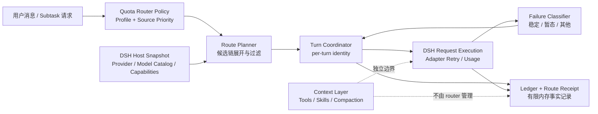
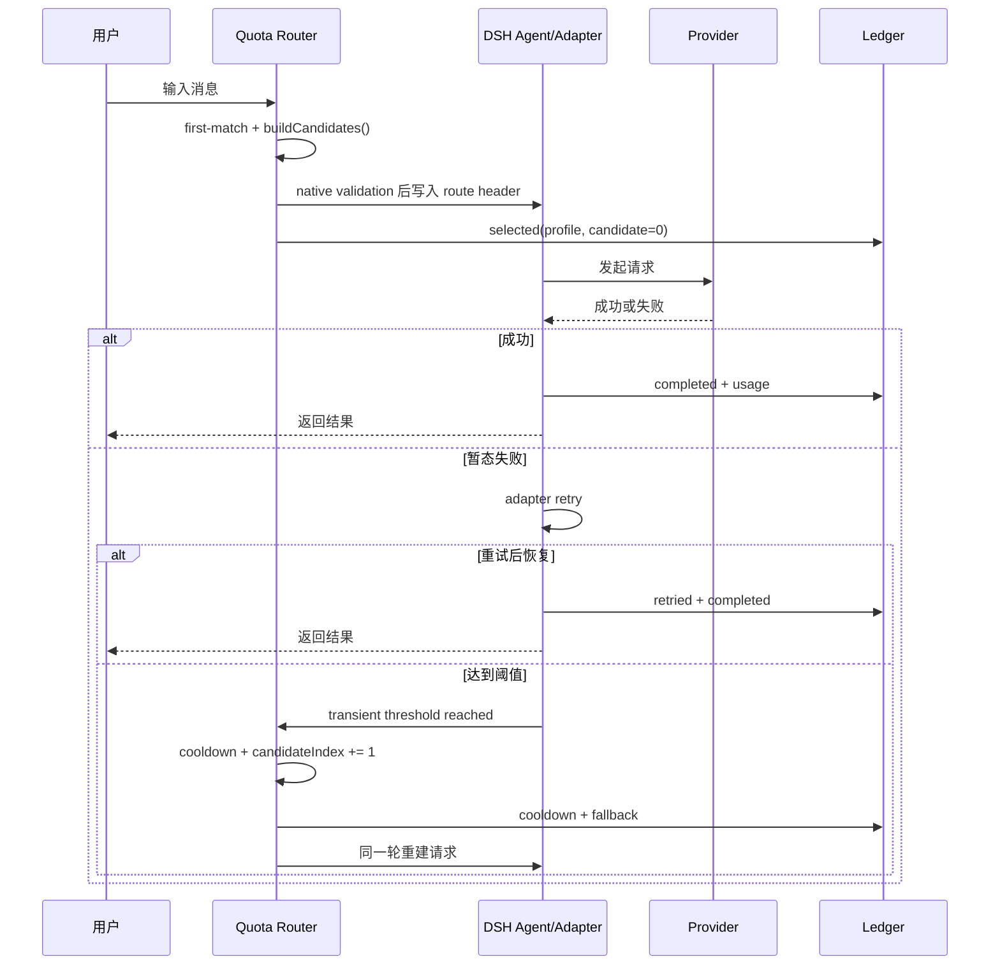
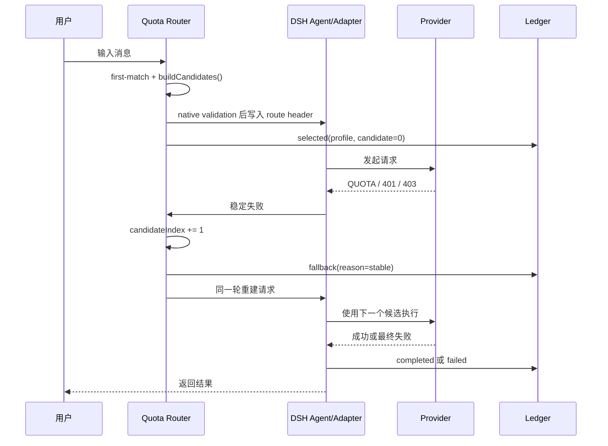
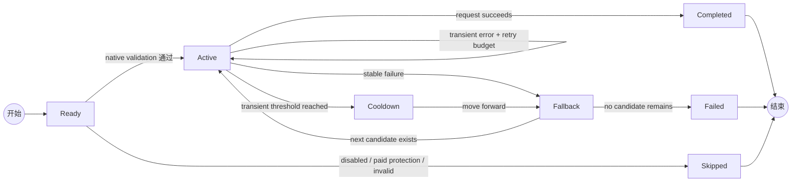

多模型、多 provider 的真正难点，通常不是“能不能切换模型”，而是切换之后是否仍然知道：

- 这个请求原本属于什么任务？
- 当前候选为什么被选择？
- 当前失败应该重试，还是应该换来源？
- 换模型之后，是否会丢失原来的任务策略？
- 所谓“省钱”，究竟是少花了钱，还是只是把请求放到了便宜模型上？

`dsh-quota-router` 的目标，是把这些隐含在 hook 和错误处理里的判断，收敛成一个可配置、可测试、可观察的 DSH 策略层。

本文介绍它的工程设计和核心算法。它不是使用说明，也不把尚未实现的工具按需加载或上下文压缩优化包装成现成功能。

## 总体架构：四条边界，两个方向

Quota Router 只拥有“路由决策”和“路由恢复”这条边界。它从 DSH 读取宿主能力，向 DSH 写入模型选择和恢复动作；它不反向接管 provider、工具或上下文系统。



这张图里最重要的不是模块数量，而是箭头方向：

- DSH 的模型目录是校验权威，router 不自行注册或猜测模型能力；
- router 是 route header、fallback action 和 route receipt 的唯一写入者；
- DSH 负责真正的请求执行、adapter retry 和 usage event；
- context layer 可以与 router 共存，但不应通过工具 schema 或 compaction 状态偷偷改写已锁定的 route decision。

## 一、先把两个问题分开：来源顺序和任务模型

最容易失控的路由配置，是把所有信息塞进一条全局 fallback 链：

```text
默认模型 → 备用模型 → 付费模型
```

这条链无法表达任务差异。例如，普通编码和高难编码可能共享同一个 primary，但 fallback 应该不同：

```text
普通编码：  fast-model → capable-model
高难编码：  fast-model → strong-model
```

因此 Quota Router 使用两个正交维度：

```yaml
sources:
  - id: subscription
    provider: subscription-provider
    priority: 1
  - id: free-pool
    provider: free-provider
    priority: 2

profiles:
  - id: coding
    keywords: [写代码, 修复, bug]
    modelBySource:
      subscription: fast-model
      free-pool: capable-model
  - id: hard-coding
    keywords: [并发, 死锁, concurrency]
    modelBySource:
      subscription: fast-model
      free-pool: strong-model
```

`sources` 回答“哪个来源优先”，`profiles` 回答“这个任务在每个来源使用什么模型”。运行时再把两者展开成每个任务自己的候选链。

这样做的工程收益是：全局成本策略和任务质量策略不会互相覆盖；用户可以调整来源顺序，而不必复制所有任务配置。

### 一个完整的展开例子

假设全局来源顺序如下：

| priority | source | tier | 自动候选 | coding 模型 | hard-coding 模型 |
| ---: | --- | --- | --- | --- | --- |
| 1 | `subscription` | subscription | 是 | `fast-model` | `fast-model` |
| 2 | `free-pool` | free | 是 | `capable-model` | `strong-model` |
| 3 | `metered-api` | paid | 需显式开启 | `cheap-api-model` | `strong-api-model` |

对 `coding`，配置投影得到：

```text
subscription/fast-model
    → free-pool/capable-model
    → metered-api/cheap-api-model（默认跳过）
```

对 `hard-coding`，得到：

```text
subscription/fast-model
    → free-pool/strong-model
    → metered-api/strong-api-model（默认跳过）
```

注意：priority 决定来源的全局顺序，但不会把 `hard-coding` 的第二跳改成 `coding` 的第二跳。模型映射属于 Profile，来源排序属于全局 policy，二者各自只有一个权威来源。

## 二、first-match 不是分类器，而是确定性策略

Profile 匹配采用声明顺序的 first-match：从第一个启用 Profile 开始，检查关键词是否命中，命中后停止。

```text
输入消息
  ↓
Profile 1：高难编码关键词？——是 → 使用 Profile 1
  ↓ 否
Profile 2：普通编码关键词？——是 → 使用 Profile 2
  ↓ 否
默认路径
```

这不是一个运行时 LLM 分类器，也不试图从语义上重新解释用户意图。原因很实际：路由器本身不应该为了决定“用哪个模型”再调用一次模型。

确定性匹配带来三个好处：

1. 同样的输入和配置得到同样的 Profile；
2. 排查时可以直接解释“命中了哪条规则”；
3. 不会因为分类模型漂移而改变成本和 fallback 行为。

代价是配置顺序很重要。更具体的 Profile 应放在更通用的 Profile 前面。

## 三、候选链算法：先展开，再过滤

对某个 Profile，router 大致执行以下过程：

```text
for source in sources 按 priority 升序：
    如果 source 未启用：跳过
    如果 Profile 没有为 source 配置模型：跳过
    如果 source 不允许自动候选：跳过
    如果 source 是 paid 且未显式允许付费 fallback：跳过
    加入 candidate(source, model, reasoningEffort)
```

随后，候选还要经过 DSH native validation：provider 是否注册、model 是否存在、reasoning effort 是否被该模型支持。没有通过校验的候选不会写入请求头。

因此“配置里写了一个模型”和“运行时会使用这个模型”是两件事：

```text
配置候选
  → source policy 过滤
  → paid/manual/emergency 保护
  → DSH native validation
  → 可实际使用的候选链
```

这是一种“先确定策略，再验证宿主能力”的边界设计。Quota Router 不注册 provider，也不猜测模型能力；模型目录的权威仍然属于 DSH。

可以把候选构造抽象成一个纯函数：

```text
buildCandidates(profile, sources, hostSnapshot, policy) -> Candidate[]
```

它只依赖输入，不写 request header、不触发 retry，也不修改 ledger。伪代码如下：

```text
candidates = []

for source in sortByPriority(sources):
    model = profile.modelBySource[source.id]

    if source.enabled == false: continue
    if model is missing: continue
    if source.autoEligible == false: continue
    if source.tier in {manual, emergency}: continue
    if source.tier == paid and policy.allowPaidFallback == false: continue

    route = hostSnapshot.validate(source.provider, model, profile.reasoningEffort)
    if route.invalid: continue

    candidates.push(route)

return candidates
```

把“构造候选”和“执行候选”分开，是为了让配置预览、运行时选择和测试共享同一个确定性模型。候选构造失败时，应该得到“没有可用候选”这一明确结果，而不是半写入一个不完整的请求。

## 四、为什么 fallback 必须保存 per-turn identity

只看当前 request header，会产生一个隐蔽 bug。

假设两个 Profile 都把同一个模型作为 primary：

```text
coding：      primary-A → fallback-B
hard-coding： primary-A → fallback-C
```

请求失败时，如果 router 只读取当前 header，就只能知道“现在是 primary-A”，却不知道它来自哪个 Profile。结果可能把高难编码错误地切到 fallback-B。

Quota Router 在每个 turn 保存至少这些身份信息：

```text
sessionId
agentId
turnId
profileId
candidateIndex
candidateIdentity
routeDecisionFingerprint
```

fallback 时不从当前 header 反推任务，而是沿着这个 turn 的原始候选链向前移动：

```text
当前决策：Profile=hard-coding, candidateIndex=0
失败后：  Profile=hard-coding, candidateIndex=1
```

这就是 per-turn identity 的价值：它把“这次请求为什么走到这里”变成显式状态，而不是依赖可变的 session header。

## 五、稳定失败和暂态失败不能用同一算法

错误处理最忌讳“一看到 error 就换模型”。不同故障的恢复策略不同。

### 稳定失败：立即前进

配额耗尽、余额不足、401/403 等错误通常不会因为马上再试一次就恢复。继续重试只会浪费时间和 token。

```text
stable failure
  → 记录失败
  → 跳到下一个候选
  → 请求 DSH 同轮重建请求
```

### 暂态失败：先交给 DSH retry

429、5xx、超时、传输中断可能只是短暂抖动。router 不应该和 DSH 的 adapter retry 互相竞争，而是先让宿主完成正常重试。

```text
transient failure
  → 交给 DSH retry
  → 如果恢复：继续当前候选
  → 如果累计达到阈值：进入 cooldown 并前进
```

### 其他失败：不要假装换模型能解决

上下文超限、语义质量不佳或工具调用逻辑错误，不一定是 provider 故障。Quota Router 保留 DSH 原始处理路径，不把所有错误都包装成模型 fallback。

### 一次请求的时序



稳定失败则进入候选切换路径：



这里的“同一轮重建请求”很关键：fallback 不是让用户重新发送一条消息，而是让 DSH 在当前 turn 内使用新的 route 继续执行。

## 六、forward-only 和 cooldown：防止故障震荡

候选链采用 forward-only 规则：一旦当前 turn 从候选 A 前进到候选 B，就不会在同一轮回到 A。

这避免了下面这种震荡：

```text
A 失败 → B
B 短暂失败 → A
A 失败 → B
```

对于跨 turn 的连续故障，router 为候选维护 cooldown。进入 cooldown 后，新的 turn 会跳过该候选，直到冷却结束。

注意 cooldown 是 router 的健康记忆，不是 provider 余额查询。它不会声称“这个来源真的没额度”，只表示“在本进程观察到它最近连续失败”。

### 候选状态机



状态机体现了两个不变量：

1. `Skipped` 候选不会被偷偷写入请求；
2. `Fallback` 只能选择候选链中更靠后的一项，不能回到已经失败的候选。

## 七、Ledger 和 Receipt：可观察性不是永久账单

路由系统如果只能输出“请求成功/失败”，很难回答成本问题。因此 router 记录结构化事件：

```text
selected
retried
fallback
cooldown
completed
failed
```

每个事件可以关联 session、agent、turn、Profile、候选、来源 tier 和 usage。Route Receipt 再把这些事件投影成用户能读懂的 session 时间线。

但当前 ledger 是 bounded in-memory ledger：

- 只保留最近的有限数量事件；
- 事件重放在保留窗口内幂等；
- 进程重启后不会自动恢复旧账本；
- 它不是永久账单系统，也不保证跨进程 exactly-once。

这是有意的接口边界。Router 负责产生不可变路由事实，未来可以由外部 durable ledger adapter 接管持久化，而不让路由器直接拥有另一套数据库生命周期。

## 八、SubtaskRouter：显式能力约束，而不是重新猜任务

关键词路由适合普通对话，但 Planner 或 workflow 往往已经知道子任务的结构化约束。`SubtaskRouter` 允许上层直接传入：

```ts
{
  taskId,
  subtaskId,
  contractVersion,
  contractHash,
  taskClass,
  complexity,
  precision,
  allowedModels,
  preferredModel
}
```

它返回一个模型 lease。相同的 `taskId + subtaskId + contractHash` 重复请求时，返回同一租约，而不是静默改模型。

这里有一个重要的“权限收紧”原则：

```text
allowedModels 是上层给出的边界
router 只能在边界内选择
router 不能因为自己的 policy 而扩大边界
```

如果质量验收失败，应该由上层决定 review、repair 或 replan。Router 只处理基础设施故障，不把语义质量问题伪装成普通 fallback。

## 九、如何严谨地谈“节省”

路由节省和上下文节省必须拆开计算。

### Router 能直接测量

```text
route_cost = input_tokens
           + output_tokens
           + cache_read_tokens
           + cache_write_tokens
           + reasoning_tokens
```

实际实现按 source tier 聚合这些用量，并可以继续按 provider/model/任务 Profile 分组。

如果 provider 有可靠的价格信息，可以进一步估算一个评估窗口的路由成本：

$$
C_{route} = \sum_{e \in E}
\left(
  p^{in}_{e} I_e +
  p^{out}_{e} O_e +
  p^{cr}_{e} CR_e +
  p^{cw}_{e} CW_e
\right) + C^{fixed}_{e}
$$

其中 `I`、`O` 是 input/output tokens，`CR`、`CW` 是 cache read/write tokens，`p` 是对应 provider/model 的价格，`E` 是 usage events。若 provider 没有可靠的价格或余额接口，router 不应该伪造金额，只报告 token 和路由比例。

还可以观察：

```text
primary_share       = primary selections / all selections
fallback_rate       = fallback turns / all turns
recovery_rate       = fallback 后完成的 turns / fallback turns
paid_fallback_rate  = paid selections / all selections
```

### 不能只看单价

如果便宜模型把一次任务做成了三次返工，单次价格下降不代表总成本下降。因此净节省需要 baseline 和质量结果：

```text
net_saving = baseline 完成同等任务的资源
           - router 完成同等任务的资源
```

“同等任务”至少需要能关联 accepted、quality-failed、needs-replan 或类似结果。没有质量结果时，应该说“route cost 变化”，不要说“净节省”。

一个严谨的评估表至少要区分四个问题：

| 指标 | 要回答的问题 | 数据来源 |
| --- | --- | --- |
| route cost | 实际用了哪些 provider/model，消耗多少 token？ | Router ledger / DSH usage |
| fallback recovery | fallback 后是否恢复并完成？ | completed / accepted event |
| quality / rework | 便宜模型是否造成更多返工？ | 上层 evaluator |
| net saving | 完成同等任务后是否真的更省？ | baseline + 前三项 |

所以社区报告应该区分“观察到的路由成本下降”和“经过质量校正的净节省”。前者是 router 事实，后者是需要实验设计支持的结论。

### 与工具/上下文优化的区别

工具按需加载、tool schema 延迟注入、skill search/load 和 compaction reinjection 属于上下文可见性层。它们可以减少 `context_cost`，但不等于 Quota Router 的 `route_cost` 下降。

```text
context_cost = 工具 schema、prompt、cache、compaction
route_cost   = provider、model、input/output/reasoning token、fallback
```

Quota Router 可以和 `dsh-economizer` 组合，但两者应使用 session/turn 标识离线关联，不应互相改写内部状态。

## 十、设计原则总结

Quota Router 的工程设计可以压缩成六条原则：

1. **正交配置**：来源顺序和任务模型映射分开，减少配置耦合；
2. **宿主能力归宿主**：provider、凭据、模型目录和 adapter retry 由 DSH 管理；
3. **身份显式化**：用 per-turn identity 保存决策上下文，不从可变 header 反推；
4. **失败分类**：稳定失败立即前进，暂态失败先重试，其他失败保留原路径；
5. **单向恢复**：forward-only 加 cooldown，避免故障震荡；
6. **事实和结论分离**：ledger 记录路由事实，净节省和质量结论交给上层 baseline/evaluator。

这套边界让 router 保持“小而深”：它不试图成为 Planner、provider 管理器、工具优化器和账单系统的总和，而是把模型选择与基础设施恢复这一件事做得确定、可解释、可审计。

## 相关资料

- [Quota Router 1.0 项目说明](https://github.com/Liyuk/dsh-quota-router/blob/main/docs/PROJECT.md)
- [1.0.0 社区更新说明](https://github.com/Liyuk/dsh-quota-router/blob/main/docs/RELEASE-1.0.0.md)
- [配置参考](https://github.com/Liyuk/dsh-quota-router/blob/main/docs/configuration.md)
- [策略指南](https://github.com/Liyuk/dsh-quota-router/blob/main/docs/strategy.md)
- [Task-aware 路由方案](https://github.com/Liyuk/dsh-quota-router/blob/main/docs/task-aware-routing-plan.md)
- [dsh-economizer 组合升级方案](https://github.com/Liyuk/dsh-quota-router/blob/main/docs/dsh-economizer-upgrade-plan.md)
