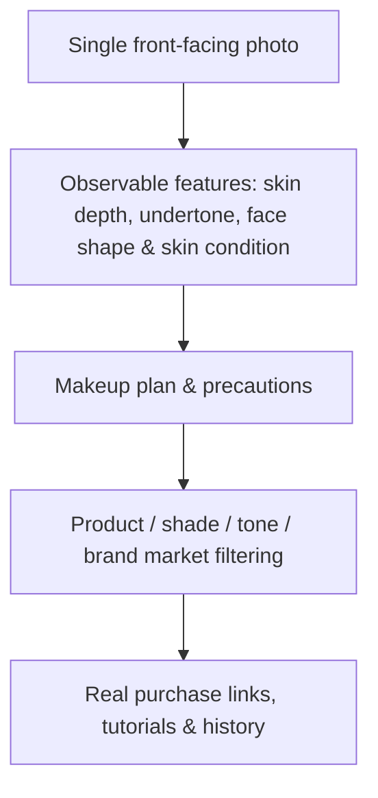

[View the project on GitHub ↗](https://github.com/Liyuk/veylumi) · [Try the static demo online ↗](https://liyuk.github.io/veylumi/)

> Want to try it right away? The **online demo** is already deployed at [liyuk.github.io/veylumi](https://liyuk.github.io/veylumi/): it is a zero-backend, purely static version. Data is stored in the visitor's browser localStorage, and the analysis results use fixed mock data that is clearly labeled (there is a "Static Demo" badge in the top-right corner of the page). The full version with real AI analysis still requires running the repository locally.

Many beauty recommendation products stop at "here are a few pretty reference images." Veylumi tries to solve the more complete decision chain: the user uploads a single front-facing photo and gets understandable facial and skin-tone observations, actionable makeup steps, products and shades matched to their market, and entry points to tutorials for further learning.

It does not describe its output as a diagnosis, nor does it promise absolute judgments about real skin tone, face shape, or try-on results. The product's focus is putting uncertainty, user choice, and real, purchasable information into the same experience.

## From Analysis to Action

V1's flow is not single-point image recognition, but a decision loop:

This means each step has to answer a different question. Image analysis needs to explain "what it saw"; recommendation needs to explain "why it fits"; the product layer has to handle brands, shades, and purchase paths across different regions; and tutorials need to give suggestions an actionable next step.

## Privacy Is Not an Add-On

Facial photos are the input this product must handle most carefully. That's why Veylumi treats the data lifecycle as part of the product design: by default it does not save user photos; it stores them short-term only when the user explicitly consents, for at most three days, and deletes them on expiry. Preview files use private storage with TTL cleanup, and the demo environment also has clear access boundaries.

This matters more than adding a paragraph to a privacy policy. For the user, "what happens after upload, how long it is kept, and whether it can be deleted" should be part of the experience, not a rule discovered after the fact.

## Real Products, Not Hallucinated Recommendations

Veylumi targets the Chinese and U.S. markets, and what it recommends is not fictional brands but product information with products, shades, skin types, markets, and real purchase links. V1.5 further reserves the ability to match nearby shades, alternative products, and tutorials by platform, region, language, makeup style, and difficulty.

The trade-offs here are explicit: rather than pretending "the latest models" are always accurate, it only marks freshness when there is a verified time; rather than promising precise virtual try-on and size recommendations, it leaves those to a V2 that has not yet been committed to.

## Design and Engineering Boundaries

The interface layer is built on accessible interaction components, while the brand layer separately maintains color, typography, and the product's visual language. The current repository is an MVP that can run locally: it includes mock login, local history, favorites, product filtering, tutorial entry points, and photo-lifecycle metadata. The repository also builds and publishes a **zero-backend static demo** (GitHub Pages), so you can experience the product loop directly without setting up an environment.

AI analysis supports local execution and clearly labeled simulated results; real authentication, production object storage, scheduled deletion jobs, and production product sync remain work for the next stage. Writing these boundaries out clearly is meant to make the prototype look like an honest product, rather than dressing up a future roadmap as already-delivered capability.
