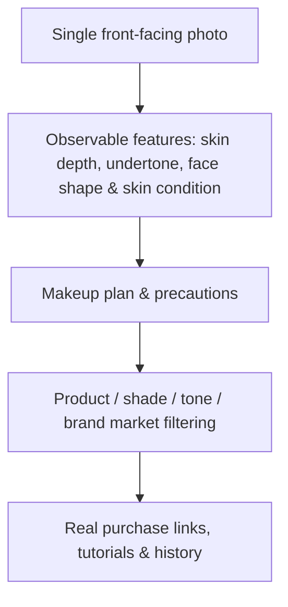

[在 GitHub 查看项目 ↗](https://github.com/Liyuk/veylumi)　·　[在线体验纯静态演示 ↗](https://liyuk.github.io/veylumi/)

> 想直接上手？**在线演示**已经部署在 [liyuk.github.io/veylumi](https://liyuk.github.io/veylumi/)：它是零后端纯静态版，数据存在访问者浏览器的 localStorage，分析结果使用明确标记的固定模拟数据（页面右上角有「静态演示」徽标）。带真实 AI 分析的完整版仍需本地运行仓库。

很多美妆推荐产品停在“给你几张好看的参考图”。Veylumi 试图解决的是更完整的决策链：用户上传一张单人正脸照片，得到可理解的面部与肤色观察、可以执行的妆容步骤、与所在市场匹配的商品和色号，以及继续学习的教程入口。

它不把输出描述为诊断，也不承诺对现实肤色、脸型或试妆效果做绝对判断。产品的重点是把不确定性、用户选择和真实可购买信息放在同一个体验里。

## 从分析到行动

V1 的流程不是单点图像识别，而是一个决策闭环：

这意味着每一步都要回答不同的问题。图像分析需要说明“看到了什么”；推荐需要说明“为什么适合”；商品层需要面对不同地区的品牌、色号与购买路径；教程则要让建议有可执行的下一步。

## 隐私不是附加功能

人脸照片是这个产品最需要谨慎处理的输入。因此 Veylumi 把数据生命周期作为产品设计的一部分：默认不保存用户照片；只有用户主动同意时才短期保存，最长三天，并在到期后删除。预览文件使用私有存储和 TTL 清扫，demo 环境也有明确的访问边界。

这比在隐私政策里补一段说明更重要。对用户而言，“上传后会发生什么、保留多久、能否删除”应该是体验的一部分，而不是事后才发现的规则。

## 真实产品，而不是幻觉式推荐

Veylumi 面向中国与美国市场，推荐的不是虚构品牌，而是带有产品、色号、肤质、市场与真实购买链接的商品信息。V1.5 进一步预留了相近色号、替代产品，以及按平台、地区、语言、妆容风格和难度匹配教程的能力。

这里的取舍很明确：与其假装“最新款”永远准确，不如只在有验证时间时标记时效性；与其承诺精确的虚拟试穿和尺码建议，不如把它们留在尚未承诺的 V2。

## 设计与工程边界

界面层以可访问的交互组件为基础，品牌层独立维护色彩、排版与产品视觉语言。当前仓库是可本地运行的 MVP：包含 mock 登录、本地历史、收藏、商品筛选、教程入口与照片生命周期元数据。仓库也构建并发布了**零后端的静态演示**（GitHub Pages），方便不搭建环境就直接体验产品闭环。

AI 分析支持本地运行与明确标记的模拟结果；真实认证、正式对象存储、定时删除任务和正式商品同步仍是下一阶段工作。把这些边界写清楚，是为了让原型看起来像一个诚实的产品，而不是把未来路线图伪装成已经交付的能力。
