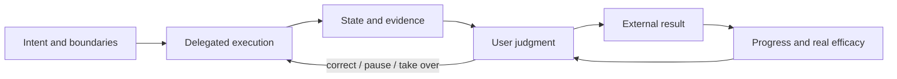
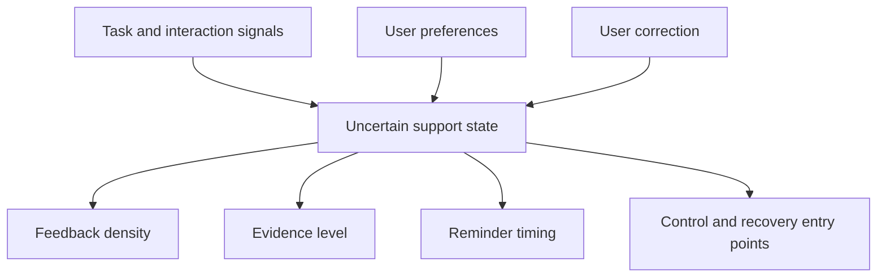
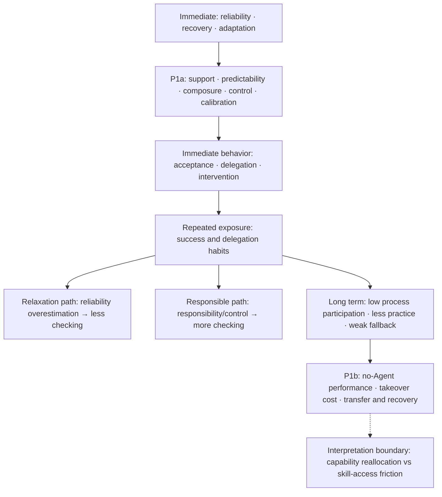

> **Version: 0.3 (preprint).** This is a project-driven conceptual framework and design study. The material comes from related theory, my Agent use records, and existing design materials; it reports design principles and implementable experimental protocols, not user-experiment data or results.

## Abstract

When I use an Agent for a long task, the first change I notice is not a sudden increase in efficiency. It is that I no longer need to watch every intermediate step: once the goal, boundaries, and acceptance conditions are clear, I can delegate execution and part of the coordination. This relief depends on one condition: I can still understand the key evidence and approve, pause, take over, or reject the work when needed.

This experience made me reconsider “emotional value.” It is not only excitement after completion. It also includes the trust and composure that come from handing over execution pressure, and the feeling that a person still has a place at critical judgment points. Emotional adaptation here does not mean that an Agent guesses or declares that a user is anxious, nor that it hides uncertainty behind comforting language. It means adapting state, evidence, pacing, and action entry points to task risk, runtime state, explicit preferences, and observable interaction difficulty, so that the user can regain predictability and agency. The other side also deserves attention: can repeated delegation reduce manual practice until a person discovers, when the Agent is unavailable, that returning to the execution layer has become difficult?

I organize this observation into three research propositions—P1a, P1b, and P2—and provide implementable protocols. The material comes from related theory, first-person observation, and existing design materials. This paper reports no user-experiment data or results; the “sweet trap” remains a hypothesis.

**Keywords:** Agent HCI; trust calibration; reliability; execution pressure; responsibility release; capability reallocation; cognitive offloading; takeover ability; observability

## 1. From model capability to human capability

### 1.1 The question is not whether an Agent can finish, but how people participate

When I use an Agent for a long task, I notice a quiet change before I notice how much code or text it has produced. When the task moves forward steadily, I do not need to maintain every intermediate step or repeatedly check whether it has stopped. Some execution pressure is removed, and attention can return to the goal, trade-offs, and final result.

It is easy to describe this as efficiency. For me it is also trust: I believe the Agent can keep moving, and I believe I can still understand, approve, take over, or reject it when necessary. That immediately raises two questions: what kind of stability deserves trust, and when is calm delegation justified rather than an illusion created by not seeing the process?

An Agent task can be described as a user providing a goal, a system generating a plan, calling tools, processing results, and returning an artifact. That describes system function but not the user’s experience. Does the user know that the task is running? Which assumptions did the Agent make? Can the user detect drift? After an error, can the user judge, pause, and correct, or can they only hand the problem to another automation loop?

Traditional software often asks people to decompose their own actions into operations. A long-running Agent hides part of the decomposition, sequencing, and recovery work inside the system. Hiding can reduce external load and create composure; it can also remove the user’s process model, failure-localization ability, and basis for attributing the result.

Agent HCI therefore has to answer three questions: does the user know what happened, can they intervene at critical points, and is trust calibrated to actual capability? Over longer use, it must also ask which abilities have been reallocated, become harder to retrieve, or genuinely degraded.

### 1.2 People cannot delegate “figuring out what matters”

I am willing to delegate execution, but I usually do not delegate three prior decisions: defining the problem, setting the boundary, and defining what counts as done. A person does not need to write every line or maintain every intermediate step, but these decisions determine whom the Agent is serving, toward which goal, and at what cost.

That is the difference between deep delegation and abandoning judgment. A person may stop watching every tool call, but cannot hand over an ambiguous goal and then treat the Agent’s chosen goal as their own. An Agent may design an execution path, but the human must retain responsibility for risk, scope, acceptance, and takeover.

### 1.3 Scope of this paper

This paper does not claim that Agents create a general emotional benefit, that chat-like presentation is always better than a workbench, or that delegation inevitably causes deskilling. It asks narrower questions: which feedback structures support appropriate relief and trust, what capabilities are reallocated, and how those claims could be tested without confusing design evidence with behavioral evidence.

## 2. Do not reduce “emotional value” to a score, and do not treat adaptation as mind-reading

### 2.1 “Omnipotence” as a description of experience

Sometimes I only need to make the intention clear and the Agent starts moving. I did not perform each step, yet the result still feels as if it began from my judgment. I call this experience “omnipotence” as an informal description, not as a validated scale. The observable tests are simpler: does the result match my intention, and can I change direction when necessary?

### 2.2 What it means for work to be delegable

What I mean is that execution, coordination, and part of the process burden can be handed over, but goal judgment, authorization, acceptance, and takeover cannot be handed over at the same time. A delegation should tell me what was delegated, how it will be accepted, who can intervene when it drifts, and how to return after failure. Otherwise relief is merely responsibility made invisible, not responsibility safely reallocated.

### 2.3 The same delegation has relief and cost

“Sweet” and “bitter” are two sides of one delegation, not opposite ends of a single score. Execution and coordination pressure may fall immediately; the cost of re-entering the execution layer may rise slowly. Both can happen at once. The question is not whether one interaction feels good or bad, but what it removed, what evidence it preserved, and whether I can return when the Agent is unavailable.

### 2.4 Emotional adaptation targets interaction support, not personality

Here, **emotional adaptation** means that a system adjusts its support according to uncertainty, waiting, failure, risk, and observable interaction difficulty in the current task. It does not label a person as anxious, lazy, or dependent, and it does not claim to have accurately read their inner state.

A more workable approach is to maintain an uncertain **interaction-support state** that the user can inspect and correct. It may combine task signals—long waits, plan drift, failed checks, or an approaching irreversible action—interaction signals—repeated views, ineffective retries, approval hesitation, or an explicit pause—and user preferences such as “notify me only when a decision is required,” “give me a short summary,” or “show complete evidence now.” The system should change feedback density, evidence level, reminder timing, available actions, and directness of wording—not decide that the user ought to feel calm.

The boundary has four parts:

1. **Refusable and correctable:** users can disable adaptation, change preferences, or deny the system’s inference;
2. **Evidence first:** risks, failures, and unverified parts must remain visible and cannot be diluted by reassuring language;
3. **Action first:** support should offer pause, evidence, scope reduction, human handoff, or recovery—not only sympathy;
4. **No medical inference:** task pressure, frustration, and calm are not diagnoses, and physiological, facial, or voice emotion data should not be collected without explicit consent.

## 3. Related theory and literature positioning

### 3.1 Progress, competence, and real efficacy

The progress principle connects positive work experience with visible small steps. Self-determination theory treats autonomy, competence, and relatedness as important intrinsic needs. Self-efficacy theory emphasizes that judgments about completing a task are shaped by prior success, feedback, and situational interpretation. These theories suggest that seeing intention become a result may produce not only “the system completed it,” but also “I can make this happen.”

Agent work adds an attribution problem. The user does not perform every intermediate action, yet may experience the result as an extension of their own action. Whether that attribution is warranted depends on traceability, alignment with intent, verifiability, and retained power at critical decisions. Real outcomes may therefore matter more than symbolic rewards, while also making mistaken attribution harder to notice.

### 3.2 Social presence and role framing

Social presence, common ground, and awareness in human collaboration show that people need to know whether a collaborator is present, whether the current state is mutually understood, and how common ground is formed. Chat bubbles, avatars, typing indicators, and read/unread positions may reduce the cost of understanding and provide continuity.

Familiar interfaces also change role attribution. An Agent presented as a tool, assistant, teammate, subordinate, or “a colleague working on something” may invite different expectations of responsibility and trust. A Feishu-like 1:1 ChatLab skin is useful design material, but it only shows that the expression can be implemented. Its psychological effects require separating interface familiarity, role framing, social presence, and objective Agent performance.

### 3.3 Cognitive offloading, automation bias, and skill maintenance

Cognitive offloading can reduce working-memory load, and automation can free people from repetitive execution. Automation research also highlights the other side: stable systems can invite automation bias, complacency, and out-of-the-loop problems. In Agent work, the hidden execution layer may reduce stress while also reducing opportunities to practice, explain, and recover manually.

The key distinction is not “automation good” versus “automation bad,” but whether the system preserves a usable model and a viable return path. Capability can be reallocated toward problem definition, planning, judgment, and acceptance without disappearing. A short-term feeling of being unable to start may be skill-access friction rather than skill loss.

### 3.4 Trust calibration and appropriate reliance

Trust in automation is not the same as positive sentiment. Appropriate reliance means using a system when it is likely to help and withholding reliance when it is likely to fail. An Agent that feels smooth but provides no evidence can generate over-trust; one that exposes uncertainty and offers recovery may create more accurate trust even when it fails occasionally.

Two competing paths should therefore remain open:

- **Relaxation path:** positive experience → overestimation of reliability → less acceptance checking;
- **Responsible path:** positive experience → greater responsibility and control → more acceptance checking.

## 4. Core mechanism: an intention–action–feedback–judgment loop

### 4.1 Structure of the loop

A useful abstraction is:

```text
intention → delegated action → state/evidence → user judgment → external result
    ↑                                                   ↓
    └────────────── correction, recovery, or continuation ┘
```

The loop is not complete because a message was displayed. It is complete when the user can connect intention to evidence, decide whether the result is acceptable, and intervene or continue when necessary.

Three changes are especially important:

- **Execution offloading:** the user does not maintain every intermediate step;
- **Responsibility release:** some coordination and execution burden can be handed over safely;
- **Judgment retention:** the user remains active at goal, authorization, acceptance, and takeover points.



**Figure 1.** The intended loop is not “prompt in, answer out,” but a recoverable connection between intention, action, evidence, judgment, and result. The diagram is a design model, not an empirical result.

### 4.2 Emotional adaptation: adapt feedback to task difficulty, not emotional performance

The system may use a support policy such as:

```text
support_t = f(task risk, uncertainty, waiting, failure, takeover cost, explicit preference)
```

The policy can adjust:

- **Information density:** quiet summaries, stage updates, or complete event evidence;
- **Timing:** when to wait, remind, or stop interrupting;
- **Control entry points:** inspect, pause, narrow scope, approve, reject, hand off, or recover from a checkpoint;
- **Expression:** facts, unverified parts, and optional actions rather than fluency or comfort as a proxy for reliability.



**Figure 2.** Adaptation is a user-correctable support policy, not an emotion detector.

### 4.3 A short loop is not transparency or control

| Loop type | What the user sees | Main result |
| --- | --- | --- |
| Black-box loop | Only start and end | Fast, but weak attribution and calibration |
| State loop | That the task is running and which stage it is in | Reduces uncertainty that the system has died |
| Evidence loop | Key actions, grounds, and result evidence | Supports judgment and trust calibration |
| Recoverable loop | Pause, modify, reject, roll back, or continue | Delegation becomes conditional rather than blind belief |

### 4.4 Real efficacy feedback and gamified feedback

Gamification is not one mechanism. Scores, levels, badges, streaks, progress bars, leaderboards, challenges, and immediate rewards create different psychological paths. Agent interfaces may also use progress percentages, completion counts, or streaks.

The narrower question is whether, when outcomes are attributable, verifiable, and important, real outcome feedback produces stronger agency and competence than symbolic rewards—and whether the same reality also creates stronger dependence, mistaken attribution, or failure costs.

Fast symbols can create rhythm but may reward easy tasks. Tests passing, a file being generated, or a task being delivered are closer to real outcomes but arrive later and may be harder to attribute. Error localization, checkpoints, and rollback turn failure into action information but add effort. The useful comparison is not which feedback is more stimulating, but which helps users judge outcomes, find errors, and continue without the Agent.

## 5. Capability costs of the same loop

### 5.1 From execution participation to result delegation

An Agent removes the need to perform every action. Execution pressure comes not only from volume, but from maintaining context, repeating operations, monitoring continuously, and reloading judgment between tasks. Stable delegation lets attention return to problem definition, solution design, and whether the result is worth accepting.

If a user only supplies goals and accepts results for a long time, the execution layer may leave everyday cognition. They may still know that a result is wrong while becoming less able to independently perform, explain, or repair the intermediate steps.

This is not simply laziness. It is shaped jointly by task division, feedback structure, and practice opportunities:

```text
repeated delegation → less process participation → less manual practice
→ fewer activation cues → higher skill-access threshold
→ sudden loss of capability when the Agent is unavailable
```

### 5.2 When the Agent was unavailable, the execution layer felt thin

Once an Agent ran out of tokens, several manual tasks that should have been easy became hard to start. I still knew where to investigate, how to ask questions, and how to judge whether a result was credible. What was difficult was producing the intermediate steps from a blank page.

This is one observation, not evidence that everyone will experience deskilling. It suggests separating two outcomes: the capability may remain while activation cues and fluency decline, or the person may simply be slow to switch from delegation mode back to execution mode. Evaluation should separately measure “can detect a problem” and “can repair it,” rather than naming one token-exhaustion episode skill loss.

### 5.3 The feeling of “being the boss” and the execution layer

I describe the role experience of sustained Agent use as “being the boss”: setting goals, splitting tasks, requesting feedback, and accepting results. This can be a productivity gain, but it may also reduce practice at the execution layer.

“Being the boss” should not be treated as a negative label. Complex work genuinely requires higher-level delegation and judgment. The questions are:

- Does the user still understand constraints in the execution layer?
- Are there opportunities to practice key manual skills?
- Can the user take over when the Agent fails?
- Do they know when to re-enter the execution layer?

The design goal is not to make people do everything themselves, but to preserve **judgment, explanation, and necessary execution fallback**.

## 6. Reliability: stability, recovery resilience, and task validity

### 6.1 Three dimensions, not one hierarchy

I treat execution stability, self-correction, and goal achievement as related but separable dimensions:

1. **Execution stability:** maintaining state, context, and original intent across multiple steps;
2. **Recovery resilience:** detecting, explaining, rolling back, retrying, or asking for help after drift;
3. **Task validity:** satisfying external goals, quality requirements, and responsibility boundaries.

A system can stably execute the wrong goal; a human can intervene to obtain a correct result from an unstable process; and a system can self-correct consistently without rechecking the goal. Stability is necessary infrastructure, not sufficient success.

### 6.2 How reliability shapes experience

```text
objective execution stability → predictable progress → composure and willingness to delegate
objective error/recovery ability → risk exposure → acceptance and intervention
feedback evidence quality → reliability calibration → appropriate reliance
task risk and responsibility → intervention threshold and willingness to own the result
```

Experience is not a mirror of objective reliability. A stable system without evidence can create false confidence; an occasionally failing system with explanation, rollback, and recovery can produce better-calibrated trust.

### 6.3 Observability as a conditional psychological guardrail

Observability includes progress, actions, evidence, errors, and recovery paths, but becomes a guardrail only when it is:

- **Understandable:** feedback can be connected to the task goal;
- **Actionable:** the user knows what can be done after seeing it;
- **Recoverable:** intervention does not require destroying the entire task and starting over.

More logs do not automatically mean better observability. Excessive information creates monitoring burden; too little creates an illusion of control; correct but non-actionable information can increase anxiety. Feedback density, granularity, interruption rate, and recovery ability should be manipulated in later work.

## 7. P1a, P1b, and P2: from immediate support to the sweet trap

### 7.1 P1a: stability, recovery, and immediate emotional support

**P1a:** When task goals, feedback speed, and interface are otherwise comparable, greater execution stability and recovery resilience, together with risk-matched and user-correctable adaptation, will increase predictability, delegability, composure, and appropriate willingness to delegate—provided the system also shows key evidence, unverified parts, and available actions instead of only reassurance.

P1a does not assume that more positive emotion is automatically better. Soft language that hides errors, delay, or risk can produce short-term calm with poor calibration. The comparison should be whether users can predict the task, identify when intervention is needed, and quietly leave when it is not.

A minimal design can manipulate:

- objective reliability: high / low;
- recovery: automatic recovery / expose error and wait for a human;
- feedback: result only / evidence and uncertainty / user-correctable adaptive feedback;
- participation: acceptance only / explanation of key judgments.

Primary outcomes should include immediate experience, predictability, calibration, and task behavior—not only duration or number of challenges.

### 7.2 P1b: long-term capability costs of delegation

**P1b:** When users lack process understanding, active practice, key evidence, and usable fallback paths, repeated low-friction delegation may push them toward acceptance without takeover and increase the cost of re-entering execution. This must be distinguished from capability reallocation and short-term skill-access friction, not immediately labeled deskilling.

P1b concerns delayed performance on no-Agent tasks. It requires baseline, transfer tasks, and longitudinal recovery, measuring manual time, accuracy, explanation quality, error type, and recovery time.

### 7.3 P2: the “sweet trap”

**P2:** After repeated stable, successful, low-friction Agent interactions create strong delegability and responsibility-release experiences, some users may mistake “this can be delegated” for “this requires no judgment,” reducing acceptance checks and weakening responsibility boundaries. The consequences should be larger in high-risk, low-observability, high-takeover-cost tasks.

The key question is not whether happiness causes blind obedience, but whether immediate experience reshapes reliability judgments. A time-series design should:

1. Randomize a period of success experience and feedback quality;
2. Allow users to form a stable impression of the system;
3. Introduce infrequent, detectable errors with different costs;
4. Compare objective reliability, perceived reliability, calibration error, acceptance, and error discovery;
5. Record trust repair and behavior in the next round.

The opposite path must also be tested: stronger agency may increase responsibility and checking. If supported, the sweet-trap version of P2 fails, while a more useful conclusion may remain—that agency, authorization, and evidence can strengthen supervision.

### 7.4 Causal identification and competing paths

```text
objective reliability → subjective predictability/evidence intelligibility → perceived reliability and agency
          │                                                   │
          └────────────────────→ task outcome ───────────────┘
                                                               ↓
                                                    acceptance, delegation, intervention, recovery
                                                               ↓
                                                    delayed no-Agent performance
```

Task risk, user experience, reversibility, and feedback quality should be moderators. Objective success and feedback presentation should be orthogonally manipulated where possible. P1a predicts immediate experience and behavior, P1b delayed no-Agent performance, and P2 repeated-exposure changes in calibration and acceptance. Only temporal order, objective reliability, and behavioral mediation can justify the “sweet trap” interpretation.



**Figure 3.** P1a concerns immediate experience and behavior, P1b delayed performance after repeated delegation, and P2 preserves competing paths. This is a testable causal structure, not a result supported by data.

### 7.5 Real efficacy feedback versus symbolic reinforcement

A narrower comparison asks whether real efficacy feedback and symbolic reinforcement affect agency, calibration, and no-Agent transfer differently when feedback delay, task importance, outcome attribution, and error cost are matched. Task value and feedback speed must be controlled; all differences between real and virtual tasks cannot be assigned to feedback type.

## 8. User, task, and interface differences

### 8.1 Novices and experts

Experience may change whether a user can predict failure, choose an intervention level, take over after failure, and distinguish interface familiarity from capability familiarity. These should be measured rather than assumed.

### 8.2 Task types

Low-risk, reversible, easily verified tasks may tolerate quiet delegation. Long, ambiguous, high-impact, or irreversible tasks require more evidence, explicit authorization, and a usable recovery path. The same feedback policy should not be applied to every task.

### 8.3 Role presentation and interface skins

Candidate manipulations include identical Agent behavior with different visual skins; chat versus workbench presentation; avatars, online and typing indicators; read/unread, reminders, and sound; and role descriptions such as tool, assistant, teammate, or subordinate. Interface effects must be separated from objective performance.

## 9. Methods and measures

### 9.1 First record real Agent use

Start with task diaries and run traces: what was delegated, what evidence was checked, where approval happened, when the user intervened, and how much effort it took to resume manually. These records generate hypotheses; they do not establish general effects.

### 9.2 Layered measures

| Dimension | Main measures | Interpretation caution |
| --- | --- | --- |
| Objective reliability | success, error, recovery, goal drift | Task evaluators and run logs |
| Perceived agency | agency, control, attribution, self-efficacy | Task-specific scales or combinations |
| Trust calibration | gap between perceived and objective reliability | Total trust is not automatically good |
| Acceptance behavior | evidence views, challenges, edits, rollback, approval | Define nodes that should be checked |
| Capability offloading | delegation, process participation, explanation, review | Delegation is not inherently negative |
| Capability maintenance | no-Agent time, accuracy, transfer, recovery | Baseline, delayed test, task battery |
| Task outcome | completion, quality, correctness, external impact, responsibility settlement | Processing complete is not goal complete |
| Experience/adaptation | emotion, load, calm, frustration, progress, acceptance/correction/disablement | Session length is not emotional value |

### 9.3 Operationalizing skill maintenance

Separate “can detect a problem,” “can explain it,” “can execute the repair,” and “can recover after a failed repair.” Test before repeated delegation, after exposure, and after a recovery period. Include transfer tasks rather than repeating the same workflow.

### 9.4 Design interventions

Useful interventions include:

- key evidence summaries alongside outcomes;
- periodic explanation or review of critical decisions;
- manual practice windows for high-frequency skills;
- choice at high-risk points instead of approval for every low-risk step;
- reviewable staged diffs and checkpoints;
- feedback density that changes with task risk;
- user-selectable “quiet summary / key reminders / full evidence,” with correction of the system’s reminder judgment;
- explicit uncertainty instead of continuous fluent reassurance.

### 9.5 Statistical and evidence standards

Do not use a single self-report or engagement metric as proof. Distinguish:

- **theoretical evidence:** existing theory supports a mechanism;
- **design evidence:** a system can implement feedback, state, or control;
- **behavioral evidence:** users show the predicted change in controlled or longitudinal tasks.

## 10. What can be claimed now

Three points are currently clear: delegation can reduce execution pressure while creating takeover risk; reliability must be judged with evidence and recovery; and emotional adaptation should restore understanding and action rather than hide risk with reassurance. First-person observation and design materials justify the questions, but cannot establish how often they hold or for whom.

The next sequence is to record authorization, acceptance, and re-entry cost in real tasks; compare manual tasks with a baseline; and only then study long-term skill change. The adjacent systems problem is how to make state, evidence, authorization, and recovery understandable and correctable; this paper treats them as design variables, not validated user effects.

## 11. Conclusion

The value of Agent interaction is not only that it completes more actions. It is that it can connect human intention to real outcomes more reliably. A short, clear feedback loop that adapts to task difficulty may support agency, competence, progress, and composure. But if adaptation hides process, evidence, practice, and recovery opportunities, the user receives a reassured sense of control rather than durable capability.

The goal is neither permanent monitoring nor returning all execution to the human. It is to let users avoid the full execution burden while retaining goal judgment, evidence understanding, risk intervention, and manual fallback. Mature Agent HCI does not make the person permanently the boss or the Agent permanently the worker; it allows roles to be reallocated as risk and human needs change.

The sweet trap asks not whether people like useful systems, but: **when a system makes people feel capable, does it also help them retain judgment and recovery ability?** That determines whether immediate emotional benefit can become long-term human capability.

## References and related materials

1. Bandura, A. (1997). *Self-Efficacy: The Exercise of Control*. W. H. Freeman.
2. Deci, E. L., & Ryan, R. M. (2000). The “what” and “why” of goal pursuits: Human needs and the self-determination of behavior. *Psychological Inquiry*.
3. Amabile, T. M., & Kramer, S. J. (2011). *The Progress Principle*. Harvard Business Review Press.
4. Dourish, P., & Bellotti, V. (1992). Awareness and coordination in shared workspaces. *CSCW*.
5. Clark, H. H., & Brennan, S. E. (1991). Grounding in communication. In *Perspectives on Socially Shared Cognition*.
6. Sweller, J. (1988). Cognitive load during problem solving: Effects on learning. *Cognitive Science*.
7. Calvo, R. A., & Peters, D. (2014). *Positive Computing*. MIT Press.
8. Parasuraman, R., Sheridan, T. B., & Wickens, C. D. (2000). A model for types and levels of human interaction with automation. *IEEE Transactions on Systems, Man, and Cybernetics*.
9. Lee, J. D., & See, K. A. (2004). Trust in automation: Designing for appropriate reliance. *Human Factors*.
10. This site, “Before Putting AI Capability into an Engineering Organization, Define These Boundaries First”: context, responsibility, authorization, and measurement boundaries.
11. This site, “Developer Productivity Is Not a Tool Catalog but a Feedback System”: trusted feedback, diagnosable failure, and recoverable loops.
12. This site, `dsh-skin-chatlab`: design material expressing Agent sessions, runtime, unread, and read state through a chat interface.
13. This site, `dsh-plugin-toolbox`: design records using state machines, tool traces, and sidebar observability to support Agent work.

## Author information and declarations

**Author:** Liyuk

**Competing interests:** The author declares no competing interests. This research received no commercial funding.

**Data availability:** This paper contains no new user-experiment data or results. First-person observations generate hypotheses; design materials and experimental protocols provide design evidence and planned behavioral evidence, and cannot substitute for one another.

## Glossary

| Term | Definition |
| --- | --- |
| Agency | The experience of attributing an outcome to one’s intention and believing one can change the task direction when necessary |
| Perceived control | The extent to which a user believes they can influence system state, actions, and outcomes |
| Real efficacy feedback | Feedback supplied by real task outcomes, tests, files, or business changes |
| Execution stability | Maintaining state, context, and original intent during multi-step execution |
| Recovery resilience | The ability to detect, explain, roll back, retry, or request help after drift |
| Capability reallocation | Moving capability from direct execution toward goal definition, judgment, acceptance, and coordination |
| Skill-access friction | A rise in the threshold for initiating or retrieving a skill; not necessarily skill loss |
| Sweet trap | A testable mechanism through which positive agency experience may reshape reliability judgments and reduce acceptance |
| Observability guardrail | Feedback structure that supports calibration and intervention under understandable, actionable, recoverable conditions |
| Emotional adaptation | Support that adjusts feedback density, timing, evidence, and action entry points to task and interaction signals, while allowing user correction; it is not emotion reading or diagnosis |
