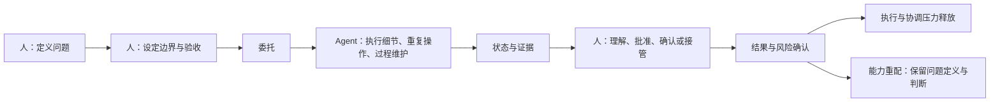
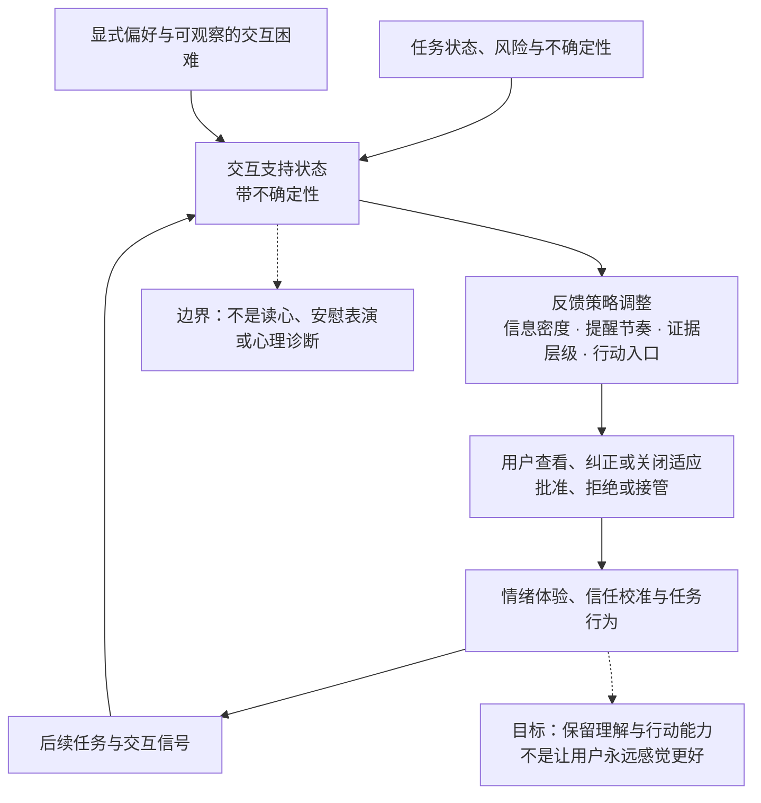
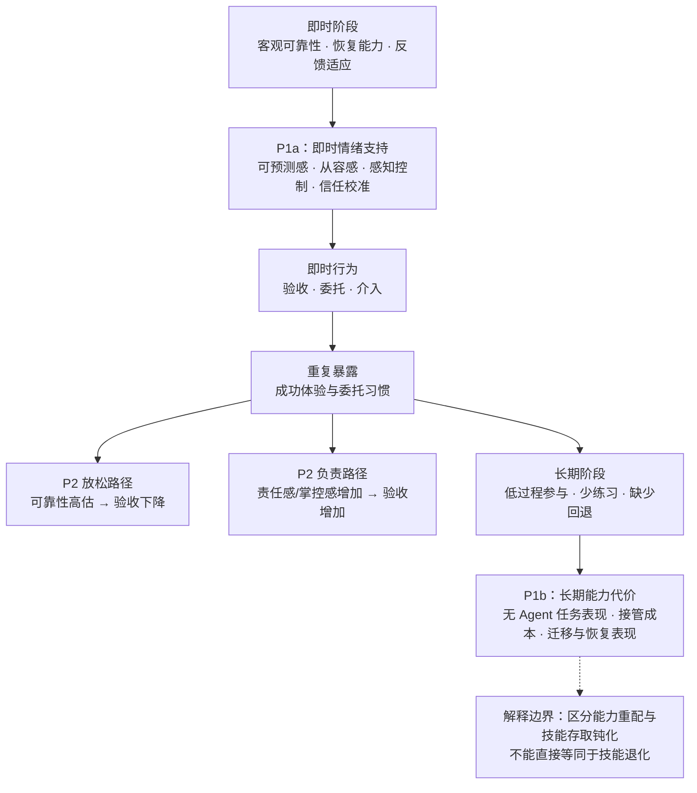

> **版本：v0.3（preprint）。** 这是一篇项目驱动的概念框架与设计研究。材料来自相关理论、我的 Agent 使用记录和已有设计材料；本文报告设计原则与可实施的实验协议，不报告用户实验数据或结果。

## 摘要

我在用 Agent 处理长任务时，最先感到的不是效率突然变高，而是不用再盯住每个中间步骤：只要目标、边界和验收条件先想清楚，我可以把执行和一部分协调交出去。这个轻松依赖一个前提——我仍能看懂关键证据，在需要时批准、暂停、接管或否定。

这种体验让我重新看待“情绪价值”：它不只是完成后的兴奋，也包括把执行压力交出去后的信任感和从容感，以及人在关键判断处仍然保有位置的感觉。这里的情绪适应不是让 Agent 猜测或宣告“你很焦虑”，更不是用安慰性语气掩盖不确定性；它是让系统依据任务风险、运行状态、用户明确偏好和可观察的交互困难，调节状态、证据、节奏与行动入口，使用户能恢复可预测感和可操作感。另一面也值得记录：重复委托会不会让人少练习手动执行，等到 Agent 不可用时才发现重新进入执行层很困难？

下面把这个观察整理成 P1a、P1b 与 P2 三个研究命题，并给出可实施的实验协议。材料来自相关理论、我的第一人称观察和已有设计材料；本文不包含用户实验数据或结果，“甜蜜陷阱”仍然只是一个假设。

**关键词：** Agent HCI；信任校准；可靠性；执行压力；责任释放；能力重配；认知卸载；接管能力；可观测性

## 1. 从模型能力转向人的能力

### 1.1 问题不是 Agent 能不能完成，而是人如何参与完成

我在使用 Agent 处理长任务时，最先注意到的并不是它替我写了多少代码、生成了多少文字，而是另一种更安静的变化：当任务能够稳定地往前走，我不必再亲自维护每一个中间步骤，也不必不断确认它是不是已经停了。执行层的压力被拿走了一部分，注意力可以回到目标、取舍和最后的结果上。

这种轻松很容易被说成“效率提升”，但对我来说还不止于此。它包含一种对 Agent 的信任：我相信它能把事情继续推进，也相信自己在必要时仍然可以看懂、批准、接管或否定它。问题也正从这里开始——什么样的稳定性值得信任？什么时候的放心是合理委托，什么时候只是因为没有看到过程而产生的错觉？

一个 Agent 任务可以被描述为：用户给出目标，系统生成计划，调用工具，处理结果，再把产物交回用户。这种描述适合说明系统功能，却没有说明用户在过程中经历了什么。用户是否知道任务正在进行？是否知道 Agent 采取了哪些关键假设？是否能发现它已经偏离目标？出现错误后，用户是继续判断、暂停和修正，还是只能重新把问题交给另一个自动化回路？

这些问题会改变交互的心理结构。传统软件通常要求人先把自己的动作拆成许多操作；长周期 Agent 则把一部分执行拆分、排序和复原工作隐藏在系统内部。隐藏可以减少外在负荷，也可以让用户感到从容；但隐藏同样可能使用户失去对过程的模型、对错误的定位能力和对结果的归因依据。

所以 Agent HCI 还得回答三件事：用户知不知道发生了什么，能不能在关键节点介入，信任是否与真实能力匹配；长期使用后，再看哪些能力被重配、变得难以调用或真的退化。

### 1.2 人不能把“想清楚”也委托出去

我愿意把执行交给 Agent，但有三件事通常不会直接交出去：先定义问题，先设定边界，先定义什么算完成。它们不一定需要人亲自写每一行代码或维护每个中间步骤，却决定了 Agent 到底在替谁、为哪个目标、以什么代价工作。

这也是深度委托和放弃判断的区别。人可以不盯着每一次工具调用，但不能把模糊目标原封不动地交出去，再把 Agent 选择的目标当成自己的目标；可以让 Agent 设计执行路径，但不能因此放弃对风险、范围和结果的定义。对我来说，Agent 最有价值的时刻不是替我决定“该做什么”，而是当我已经想清楚要做什么之后，替我承担大量重复执行、上下文维护和持续监控的压力。

### 1.3 这里讨论什么

我关心的是长时间、低监督、需要多次调用工具并可能改变外部状态的 Agent 任务。人—人协作和 Agent—Agent 协作只作为参照：前者帮助我理解共同进展与问责，后者帮助我看见反馈和目标漂移。它们不是技术发展的三个阶段，而是三种不同的交互安排。

我的判断先压成一句话：把执行交出去会减轻压力，但目标、证据和接管能力不能一起交出去。重复委托既可能帮助人完成重要工作，也可能减少检查和手动练习。问题不在于人要不要始终盯着系统，而在于什么风险需要人带着什么证据回来决定。

## 2. 不把“情绪价值”当一个分数，也不把情绪适应当读心

我先把观察分成三层。第一层看 Agent 实际做了什么：是否按目标推进，出了错能不能恢复，最后结果是否真的可用。第二层看人如何理解这些行为：我是否相信它、是否知道哪里需要检查、是否觉得自己仍能改变方向。第三层看长期代价：反复委托之后，我还是否能自己完成、解释和修复关键步骤。

“安心”“胜任感”“进展感”是第二层里可能出现的体验，不是一个可以包住所有结果的单一分数。比如我没有检查一次输出，可能是因为信任，也可能是因为没时间、不会检查，或者界面没有给我证据；单凭“没检查”不能判断信任。

### 2.1 “全能感”作为经验描述

有时我只要把意图说清楚，Agent 就开始推进；我没有亲手完成每个步骤，却仍觉得结果是从我的判断出发的。我曾把这种感受叫作“全能感”。这里保留它作为经验描述，不把它当作正式量表。下文只用两个可观察问题来检验它：结果是否符合我的意图，以及我在需要时能否改变方向。

### 2.2 什么叫可托付

我真正想说的是：执行、协调和一部分过程负担可以交出去，但目标判断、授权、验收和接管不能一起交出去。一次委托至少要让我知道交了什么、凭什么验收、偏了谁能介入、出了问题怎样回来。否则，轻松只是看不见责任，不是责任被安全地重新分配。

### 2.3 同一轮委托既有轻松，也有代价

“甜”与“苦”是同一轮委托的两面，不是一个从正到负的分数。马上减少的是执行和协调压力；可能慢慢增加的是重新进入执行层的成本。它们可以同时发生。真正要问的不是这轮交互让我舒服还是不舒服，而是：它让我少做了什么，替我保留了什么证据，以及下次没有 Agent 时我还能不能回来。

### 2.4 情绪适应的对象是交互支持，不是用户人格

本文所说的**情绪适应**，是系统根据当前任务中的不确定性、等待、失败、风险和用户可见的交互困难，调整支持方式的能力。它的对象不是给用户贴上“焦虑”“懒惰”或“依赖”的人格标签，也不是宣称系统已经准确读懂了人的内在情绪。

更可行的做法是维护一个可被用户查看和纠正的、带不确定性的**交互支持状态**。它可以综合三类信号：任务信号（例如等待过久、计划偏离、检查失败或不可逆动作临近），交互信号（例如反复查看、无效重试、批准迟疑或主动暂停），以及用户显式设置（例如“只在需要决定时提醒”“给我简短摘要”或“我现在要完整证据”）。系统据此改变的，应是反馈密度、证据层级、提醒时机、可用行动和措辞的直接程度，而不是替用户判断“你现在应该平静”。

这一定义有四条边界：

1. **可拒绝与可纠正**：用户可以关闭适应、修改偏好，也可以否认系统对当前困难的推断；
2. **证据优先**：风险、失败和未验证部分必须如实呈现，不能被安慰性语言稀释；
3. **行动优先**：好的支持要给出暂停、查看证据、缩小范围、转人工或恢复的入口，而不只是表达同情；
4. **不做医疗推断**：本文不把任务内的压力、挫败或安心当作心理诊断，也不主张在未经明确同意时收集生理、面部或语音情绪数据。

## 3. 相关理论与文献定位

### 3.1 进展、胜任与真实效能

进度原则把正向工作体验与“可见的小步进展”联系起来。自我决定理论将自主、胜任与关系视为重要的内在动机需求。自我效能理论则强调，个体对自己完成特定任务的判断，会受到过往成功经验、反馈和情境解释的影响。这些理论让我看到，用户看到任务从意图走向结果时，获得的并不只是“系统完成了”，还可能是“我能让事情发生”。

但 Agent 场景多了一层归因问题。用户并不亲自执行每一个中间动作，结果却可能仍被体验为自己的行动延伸。这个归因是否成立，取决于结果是否可追踪、是否符合意图、是否能被核验，以及用户是否在关键判断处保有权力。真实结果因此可能比纯符号奖励更有意义，但也可能让错误归因更难察觉。

### 3.2 社会存在与角色框架

人—人协作中的社会临场感、共同认知和在场感说明，用户需要知道协作者是否在场、彼此是否理解当前状态，以及如何形成共同认知。Agent 界面借用聊天气泡、头像、正在处理提示、已读和未读等模式，可能降低理解成本、提供连续性和在场感。

不过，熟悉的界面也会改变角色归因。一个 Agent 被呈现为工具、助手、队友、下属或“正在处理事情的同事”，用户可能因此改变对它的责任期待和信任方式。ChatLab 的飞书式 1:1 皮肤是一份有价值的设计材料，但它只能说明这种表达方式可以实现，不能说明它一定提升了能动性或信任。若要研究其心理作用，需要把界面熟悉度、角色呈现、社会临场感和 Agent 客观表现分开操纵。

### 3.3 认知卸载、自动化偏差与技能保持

认知卸载可以降低当前任务的工作记忆负担，自动化也可以把人从重复执行中解放出来。但自动化研究长期提醒我们另一面：系统稳定承担某个环节后，人可能减少监控、失去情境模型，等系统失效时才发现自己不容易接管。

这些概念不能直接推出“使用 Agent 必然导致技能退化”。至少要区分三种结果：

1. **能力重配**：执行交给系统，人的任务转向目标定义、判断、验收与协调；
2. **技能存取钝化**：能力并未消失，但启动和调用的门槛上升，短期手感变差；
3. **真实技能退化**：经过长期暴露和缺少练习后，手动任务的正确率、迁移表现或恢复能力持续下降。

只有纵向、带基线和迁移任务的研究，才能把第三种结论从前两种中区分出来。

### 3.4 信任校准与适当依赖

信任研究的核心不是让用户“更信任”系统，而是让信任与真实能力匹配。适当依赖意味着：Agent 擅长的地方可以交给它，明显不可靠的地方要保留判断。我更想追问的是：重复成功带来的轻松体验，会不会反过来改变可靠性判断。

这个反向路径仍是待验证的研究假设。高能动性体验也可能带来更多责任感和主动监控，而不是更少监控。P2 必须把两种相反机制都纳入实验：

- **放松路径**：正向体验 → 可靠性高估 → 验收减少；
- **负责路径**：正向体验 → 责任感与掌控感增加 → 验收增加。

## 4. 核心机制：情绪适应的意图—行动—反馈—判断闭环

### 4.1 闭环的结构

核心机制可以表示为：

```text
意图与边界 → 委托 Agent 行动 → 反馈与证据 → 用户判断/授权/接管 → 结果
```

早期体验中，用户可能把它感知为更短的：

```text
我说明要做什么 → 它替我推进 → 我在关键处验收
```

但真正有价值的短闭环不是把所有中间信息都删除，而是把与用户判断无关的执行细节压缩，同时保留使委托可理解、可核验、可撤回和可恢复的证据。这种结构可以叫作**信息充分的短闭环**。

短闭环带来三种可能收益：

- **执行卸载**：用户不必亲自维护所有中间步骤；
- **责任释放**：部分协调和执行负担可以被安全地交出去；
- **判断保留**：用户仍能在目标、授权、验收和接管节点发挥作用。



**图 1：深度委托中的人-Agent 分工。** 图中的“委托”不是把任务整体丢给 Agent，而是在人的问题定义、边界设定和验收标准已经明确之后，把执行层交出去。

### 4.2 情绪适应层：根据任务困境调节反馈，不用情绪表演替代控制

情绪适应应嵌入上述闭环，而不是另做一层会模仿关心的聊天人格。一个最小的适应过程可以写成：

```text
任务与交互信号 → 不确定的交互支持状态 → 可解释的反馈调整 → 用户选择/纠正 → 后续任务行为
```

例如，长时间等待但没有风险时，系统可以保持安静，只保留可回看的进度；出现失败或范围漂移时，应从“正在处理”切换为失败原因、影响范围、证据和可选恢复路径；当不可逆动作临近时，应降低自动化的安静程度，明确提示需要谁在何时作出什么决定。用户反复查看同一状态，最多可以触发“要看简短结论、完整证据，还是暂停？”这样的选择，而不是系统直接断言用户焦虑。

适应变量至少包括：

- **信息密度**：安静摘要、阶段反馈或完整事件证据；
- **时间节奏**：何时等待、何时提醒、何时停止打扰；
- **控制入口**：查看、暂停、缩小范围、批准、拒绝、转人工或从检查点恢复；
- **表达方式**：以事实、未验证部分和可选行动为主，避免用流畅或安慰的语气制造可靠性印象。

这里的成功标准不是让用户始终“感觉更好”，而是让用户在需要判断时有足够的理解和行动能力。某些任务中的警觉、紧张或不满意本来就是风险信息；系统不应把它们一律优化掉。



**图 2：情绪适应如何把任务困境转化为可纠正的反馈支持。** 该闭环不代表系统能够准确读取人的内在情绪；适应依据任务与交互证据以及用户偏好，并允许用户纠正或关闭。结果目标是帮助用户理解和行动，而不是用舒适感替代风险判断。

### 4.3 短闭环不等于透明，也不等于控制

如果系统只显示“任务完成”，用户得到的是一种确认感，却未必拥有理解、核验或改变结果的能力。这样的短闭环可能很顺畅，却是控制幻觉的温床。

闭环质量可以分成四类：

| 闭环类型 | 用户看到什么 | 主要结果 |
| --- | --- | --- |
| 黑箱闭环 | 只有开始和结束 | 快，但归因与校准弱 |
| 状态闭环 | 知道任务仍在运行以及所处阶段 | 减少“系统死了”的不确定感 |
| 证据闭环 | 能看到关键行动、依据和结果证据 | 支持判断与信任校准 |
| 可恢复闭环 | 还能暂停、修改、拒绝、回滚或继续 | 把委托从“我只能相信”变成“我知道何时可以交出去” |

因此，“可观测性”不能只理解为信息更多。它的价值在于能否帮助用户作出下一步正确决策。

### 4.4 真实效能反馈与游戏化反馈

游戏化并不是一个单一机制。分数、等级、徽章、连胜、进度条、排行榜、挑战匹配和即时奖励所产生的心理路径不同。Agent 交互也可能包含游戏化元素，例如进度百分比、完成计数和连续任务奖励。

我不再把“Agent 普遍强于游戏化”当作主张，因为这无法脱离任务重要性、反馈延迟、结果归因和错误代价来比较。更窄的问题是：

> 当结果可归因、可验证且对用户真正重要时，真实结果反馈可能比符号性奖励产生更强的能动性和胜任感；但同样的真实性也可能带来更强的依赖、错误归因和失败成本。

不必把每一种反馈都做成一张表。分数、等级、徽章和进度条来得快，也容易形成节奏，但可能奖励容易完成的任务；测试通过、文件生成和任务交付更接近真实结果，却可能更晚、更难归因，失败代价也更高；错误定位、检查点和回退能把失败变成行动信息，但会增加操作负担。真正需要比较的不是哪种反馈更刺激，而是哪种反馈让人更能判断结果、发现错误，并在没有 Agent 时继续完成任务。

## 5. 同一闭环的能力代价

### 5.1 从执行参与到结果委托

Agent 的价值之一是让用户不必亲自完成每个动作。对我来说，执行层的压力并不只来自“工作量大”，还来自四种持续消耗：维护上下文、反复执行、持续监控，以及在不同任务之间重新加载判断。一个任务真正稳定地交给 Agent 后，最明显的变化不是我可以什么都不做，而是我能把注意力重新放回问题定义、方案设计和结果是否值得。

但如果用户长期只提供目标、接受结果，执行层可能逐渐退出其日常认知活动。用户仍然可以判断“这个结果不对”，却越来越难以独立完成、解释或修复中间步骤。

这不是简单的“人变懒了”。它是任务分工、反馈结构和练习机会共同塑造的结果：

```text
重复委托 → 过程参与减少 → 手动练习减少
→ 启动线索减少 → 技能调用门槛上升
→ 在 Agent 不可用时感到能力突然消失
```

### 5.2 Agent 不可用时，我才发现执行层变薄

有一次 Agent token 用完，原本可以直接开始的几项手动工作突然很难启动。我仍然知道问题要往哪里查、应该怎样提问、怎样判断结果是否靠谱；真正卡住的是从空白开始把中间步骤做出来。那次经历让我把“能力消失”拆成两个更具体的问题：能力可能还在，但启动线索和调用手感变差；也可能只是我暂时没有从委托模式切回执行模式。

这只是我的一次观察，不能说明所有人都会技能退化。但它至少给出一个值得检查的方向：长期委托可能让人更擅长定义问题、分配工作和验收结果，却更不习惯从头执行。验证时，应把“看得出问题”和“能不能改好”分开测，不要把一次 token 耗尽后的“抓瞎”直接命名为技能退化。

### 5.3 “当老板感”与执行层

我把持续使用 Agent 的角色体验概括为“当老板”：提出目标、拆分任务、要求反馈、验收结果。这种角色转变可能是生产力提升，也可能让执行层的练习越来越少。

这里必须避免把“当老板”当作负面标签。复杂工作本来就需要更高层次的委托和判断。真正的问题是：

- 用户是否还理解执行层的约束？
- 是否还有机会练习关键手动技能？
- 是否能在 Agent 失败时接管？
- 是否知道何时应该重新进入执行层？

因此，设计目标不应是让人永远亲自做，而是保留**判断层、解释层和必要的执行回退能力**。

## 6. 可靠性：稳定性、恢复韧性与任务有效性

### 6.1 三个维度，而不是一条层级链

这里不把“稳定性、自我纠错和达成目标”写成严格的必要—充分层级，而把它们看作三个相关但可分离的维度：

1. **执行稳定性**：多步执行中是否维持状态、上下文和原始意图；
2. **恢复韧性**：偏离后是否能发现、解释、回滚、重试或请求帮助；
3. **任务结果有效性**：最终结果是否满足外部目标、质量要求和责任边界。

一个系统可以稳定地执行错误目标；可以通过人工介入从不稳定状态得到正确结果；也可以自我修正得很稳定但始终没有重新检查目标。因此，稳定性是重要基础，却不是成功的充分条件。

### 6.2 可靠性如何影响用户体验

可靠性通过至少四条路径影响用户：

```text
客观执行稳定性 → 进展可预测性 → 从容感与委托意愿
客观错误/恢复能力 → 风险暴露 → 验收与介入行为
反馈证据质量 → 可靠性校准 → 适当依赖
任务风险与责任强度 → 介入阈值与承担意愿
```

用户体验不是客观可靠性的镜像。一个稳定系统如果没有证据，可能产生虚假的高可靠性感知；一个偶尔失败但解释、回滚和恢复良好的系统，可能让用户形成更准确的信任。

### 6.3 可观测性是有条件的心理护栏

可观测性包括看到进度、行动、证据、错误和恢复路径，但只有满足三个条件时才成为护栏：

- **可理解**：用户能把反馈和任务目标联系起来；
- **可操作**：用户知道看到信息后能做什么；
- **可恢复**：用户的介入不会只能把任务完全推倒重来。

因此，更多日志不等于更好的可观测性。信息过密会制造监控负担，信息过少会制造控制幻觉，信息正确但不可操作则只会增加焦虑。后续可以操纵反馈密度、信息粒度、打扰频率与恢复能力，观察它们怎样影响信任和接管。

## 7. P1a、P1b 与 P2：从即时情绪支持到甜蜜陷阱

### 7.1 P1a：稳定性、恢复与即时的情绪支持

**P1a：** 在任务目标、反馈速度和界面基本相当的条件下，更高的执行稳定性与恢复韧性，以及与风险相称、可由用户纠正的反馈适应，会提高用户的可预测感、可托付感、从容感和适当的委托意愿；其前提是系统同时呈现关键证据、未验证部分和可用行动，而不是只提供安慰性确认。

P1a 不预测“情绪更积极”本身就是好结果。系统若用柔和语气掩盖错误、延迟或风险，短期安心可能与较差的信任校准并存。真正要比较的是：用户是否更能预测任务、识别需要介入的时刻，并在不需要时安静退出。

推荐的最小实验设计是：

- 客观可靠性：高 / 低；
- 恢复能力：自动恢复 / 暴露错误后等待人工；
- 反馈方式：仅结果 / 证据与不确定性 / 可由用户纠正的适应反馈；
- 任务参与：只验收 / 需要解释关键判断。

主要结果报告即时情绪与可预测感、信任校准和任务行为；不能只用“使用时长”或“质疑次数”代表结果。

### 7.2 P1b：委托的长期能力代价

**P1b：** 当用户缺少过程理解、主动练习、关键证据和可用回退路径时，重复的低摩擦委托可能把人的角色推向只验收、不接管，并提高重新进入执行层的成本；这种变化需要与能力重配和短期技能存取钝化区分，而不能直接称为技能退化。

P1b 关注的是延迟的无 Agent 任务表现，而非单次交互时的满意度。它需要有基线、迁移任务和恢复期的纵向设计，测量手动时间、正确率、解释质量、错误类型与恢复时间。

### 7.3 P2：“甜蜜陷阱”

**P2：** 当用户经过多次稳定、成功且低摩擦的 Agent 交互后形成较强的可托付感与责任释放体验时，部分用户可能把“可以委托”误认为“无需再判断”，减少验收、淡化责任边界；这一行为在高风险、低可观测性和高接管成本的任务中会带来更大的后果。

P2 的关键不是“快乐导致盲从”，而是**即时体验是否重塑了可靠性判断**。它需要时间序列设计，而不是一次性问卷：

1. 先随机操纵一段时间的成功体验与反馈质量；
2. 让用户形成对系统的稳定印象；
3. 在后续任务中引入低频、可检测但代价不同的错误；
4. 比较客观可靠性、感知可靠性、校准误差、验收率和错误发现率；
5. 记录发现错误后的信任修复和下一轮行为。

P2 同时必须检验相反的竞争性假设：高能动性感可能使用户更愿意承担责任并主动验收。如果数据支持后者，P2 的“甜蜜陷阱”版本不成立，但仍可能得到一个更有价值的结论：能动性体验在适当授权和证据支持下，能够促进而不是削弱监督。

### 7.4 因果识别与竞争路径

P1a、P1b 与 P2 需要用下面的因果结构区分：

```text
客观可靠性 ──→ 主观可预测性/证据可理解性 ──→ 感知可靠性与感知能动性
      │                                          │
      └──────────────→ 任务结果 ────────────────┘
                                                   ↓
                                      验收、委托、介入与恢复行为
                                                   ↓
                                       延迟的无 Agent 任务表现
```

任务风险、用户经验、动作可逆性与反馈质量应作为调节变量；客观成功率与反馈呈现应尽可能正交操纵，或在分析中单独控制。P1a 主要预测即时体验、可预测感和行为，P1b 检验延迟的无 Agent 表现，P2 才检验重复暴露后的信任校准与验收变化。两条路径可能相反：放松路径会让人因顺利体验而减少验收；负责路径则可能让人更愿意承担责任并主动验收。只有在时间顺序、客观可靠性和行为中介都得到支持时，才可以把结果解释为“甜蜜陷阱”。



**图 3：P1a、P1b 与 P2 的时间结构和竞争路径。** P1a 关注即时体验与行为，P1b 关注重复委托后的延迟表现，P2 同时保留“减少验收”和“增加负责性”两条竞争路径；图示是待检验的因果结构，不是已经得到数据支持的结果。

### 7.5 真实效能反馈与符号强化：一个待检验比较

更窄的问题是：在反馈延迟、任务重要性、结果可归因性和错误代价相匹配的条件下，真实效能反馈与符号强化是否会对能动性感、信任校准和无 Agent 迁移表现产生不同影响。这里的比较需要控制任务价值和反馈速度，不能把“真实任务”与“虚拟任务”的全部差异都归因于反馈类型。

## 8. 用户、任务与界面差异

### 8.1 新手与老手

新手可能更依赖可见过程、明确边界和逐步确认，因为他们还没有建立 Agent 能力的心理模型。老手可能更愿意委托，但不一定更盲从：他们可能把控制感放在目标、约束、验收和回滚，而不是每一个执行动作上。

因此，“老手更安全”或“新手更容易依赖”都不能直接假定。真正需要测量的是：

- 用户能否预测 Agent 在什么情况下会失败；
- 用户能否选择合适的介入层级；
- 用户能否在失败后接管；
- 用户是否把界面熟悉感误当成能力熟悉感。

### 8.2 任务类型

高频小任务适合压缩过程，减少打扰；低频大任务需要更多阶段性证据、检查点和责任确认。工程任务、文档任务和创意任务对“结果正确”的定义不同：代码可能有测试和 diff，文档需要来源与事实核查，创意工作则还要保护作者意图和不可替代的判断。

任务风险、错误可逆性和恢复成本应成为反馈和自动化程度的调节变量。低风险可逆动作不必每步请求批准；高风险不可逆动作不能只显示“进行中”。

### 8.3 角色呈现与界面皮肤

ChatLab 将工作区、会话和消息流映射为项目群、联系人和 1:1 对话，并用正在处理、未读和已读位置表达运行状态。这类设计可能带来熟悉感和连续性，也可能强化“Agent 是同事”或“Agent 是下属”的角色期待。

研究时需要区分：

- 相同 Agent 行为、不同视觉皮肤；
- 聊天界面与工作台界面；
- 有无头像、在线和 typing 提示；
- 有无未读、提醒和声音；
- 工具、助手、队友和下属等角色描述。

设计材料只是机制的载体，不是机制已经成立的证据。

## 9. 研究方法与指标

### 9.1 先记录自己的 Agent 使用

在进入多人实验之前，我先做轻量的第一人称记录。每次选择一个有明确目标的任务，记录四件事：

1. **任务与边界**：我想解决什么，哪些部分交给 Agent，哪些判断和设计由我保留；
2. **状态与介入**：Agent 处于什么状态，出现了哪些关键反馈，我在什么节点介入、批准、修改或接管；
3. **结果与验收**：最终结果是否满足预先定义的验收条件，是否返工，哪些证据让我相信或不相信它；
4. **压力与重新进入成本**：执行、上下文维护、重复监控的压力释放了多少；如果 Agent 不可用，我重新进入执行层需要付出什么代价。

这不是把每次使用写成完整日记，也不是事后给体验打一个漂亮分数。记录的重点是把“当时为什么放心”“什么时候开始不放心”“哪些信息改变了我的判断”留下来。可以用一次任务的事件顺序、关键截图、结果 diff 和一段短复盘组成最小记录。累积一段时间后，再区分稳定长任务、跑偏任务和 Agent 不可用任务，而不是只挑最有戏剧性的例子。

### 9.2 指标分层

| 维度 | 主要指标 | 解释注意 |
| --- | --- | --- |
| 客观可靠性 | 成功率、错误率、恢复率、目标偏离 | 由任务评估器和运行日志给出 |
| 主观能动性 | 能动性感、控制感、结果归因感、自我效能 | 采用任务特定量表或量表组合 |
| 信任校准 | 感知可靠性与客观可靠性的差异 | 不把信任总量当作好结果 |
| 验收行为 | 查看证据、提出质疑、修改、回滚、批准 | 需要定义“应当验收”的任务节点 |
| 能力卸载 | 委托比例、过程参与、主动解释与复盘 | 委托本身不是负面结果 |
| 能力保持 | 无 Agent 条件下的时间、正确率、迁移和恢复 | 需要前测、延迟测和任务电池 |
| 任务结果 | 任务完成、质量、正确性、外部影响；作者是否完成了必要的责任结算 | 不能把处理完成等同于目标完成 |
| 体验与情绪适应 | 正负情绪、负荷、安心、挫败、进展感，以及用户是否接受、纠正或关闭适应 | 不以会话时长代理情绪价值，也不把系统推断当作用户的真实情绪 |

“用户很少质疑”不能单独解释为信任；“会话时间变长”不能单独解释为心流；“回合数变少”不能单独解释为效率。每一个日志指标都必须预先定义分母、任务难度、证据可见性和可能的相反解释。

### 9.3 技能保持的操作化

对技能退化最小可行的设计是一个有基线的纵向任务电池：

1. 使用 Agent 前完成若干同类手动任务；
2. 在多次 Agent 协作后重复任务；
3. 在 Agent 暂停或不可用时进行延迟测验；
4. 加入迁移任务，判断是否只对原任务变慢；
5. 记录恢复期，区分永久性下降与短期启动困难。

测量应同时包含时间、正确率、错误类型、主观费力与解释质量。一次 token 耗尽后的“抓瞎”只能生成假设，不能直接命名为技能退化。

### 9.4 设计干预

研究不应只观察风险，也应测试如何保留收益、减少代价：

- 在结果之外提供关键证据摘要；
- 定期让用户解释或复盘关键决策；
- 为高频技能保留手动练习窗口；
- 在高风险节点要求选择而不是逐步批准；
- 提供可回看的暂存差异和检查点；
- 根据任务风险动态调整反馈密度；
- 允许用户选择“安静摘要 / 关键节点提醒 / 完整证据”，并纠正系统的提醒判断；
- 让 Agent 在不确定时主动暴露边界，而不是持续保持流畅语气。

### 9.5 统计与证据标准

第一人称观察适合发现体验结构、命名现象和生成假设，不支持总体因果结论。N=10 左右的样本可以用于可行性试做和测量修订，不能直接宣称验证 P1a、P1b 或 P2。正式研究需要根据主要结果、重复测量和预期交互效应进行样本量估计，并预先写清主要结果、排除标准和替代解释。

证据应分为三层：

- 理论证据：既有理论对机制的支持；
- 设计证据：设计材料能实现某种反馈、状态或控制；
- 行为证据：用户在受控或纵向任务中表现出预期变化。

目前主要有前两层。本文可以完整报告实验动机、材料、任务、操纵、测量与分析计划；在没有数据、结果和不确定性报告之前，不把这些协议表述为行为证据。

## 10. 目前能说到哪里

目前能说清三件事：委托可以同时减轻执行压力并制造接管风险；可靠性必须和证据、恢复能力一起判断；情绪适应应帮助人恢复理解与行动，而不能用安慰性表达掩盖风险。我的第一人称观察和已有设计材料支持这些问题值得研究，但还不能回答它们在多少人身上、什么任务中成立。

下一步先记录真实任务中的授权、验收和重新进入成本，再做带基线的手动任务比较，最后才讨论长期技能变化。研究顺序不能反过来。相邻的系统设计问题是：如何把状态、证据、授权和恢复做成可理解、可纠正的反馈架构；本文把这些当作情绪适应研究中的系统操纵变量，而不把它们当作已经验证的用户效果。

## 11. 结论

Agent 交互最有价值的地方，不只是替人完成更多动作，而是把人的意图更可靠地连接到现实结果。短而清楚、能随任务困境调节的反馈闭环可以带来能动性、胜任感、进展感与从容感；但如果适应只把过程、证据、练习和恢复机会一并隐藏，用户得到的可能只是被安抚的控制感，而不是可持续的能力。

我不主张让人始终盯着 Agent，也不主张把所有执行重新交还给人。更可行的目标是：让用户在不必承担全部执行负担的同时，保留目标判断、证据理解、风险介入和必要的手动回退能力。真正成熟的 Agent HCI，不是让人永远当老板，也不是让 Agent 永远替人做事，而是让角色可以随着任务风险和人的需要重新分配。

“甜蜜陷阱”最终要问的不是“人会不会喜欢好用的系统”，而是：**当系统让人感觉自己很有能力时，它是否也在帮助人保持判断和恢复能力？** 这个问题决定了 Agent 的即时情绪收益能否转化为长期的人类能力。

## 参考文献与相关材料

1. Bandura, A. (1997). *Self-Efficacy: The Exercise of Control*. W. H. Freeman.
2. Deci, E. L., & Ryan, R. M. (2000). The “what” and “why” of goal pursuits: Human needs and the self-determination of behavior. *Psychological Inquiry*.
3. Amabile, T. M., & Kramer, S. J. (2011). *The Progress Principle*. Harvard Business Review Press.
4. Dourish, P., & Bellotti, V. (1992). Awareness and coordination in shared workspaces. *CSCW*.
5. Clark, H. H., & Brennan, S. E. (1991). Grounding in communication. In *Perspectives on Socially Shared Cognition*.
6. Sweller, J. (1988). Cognitive load during problem solving: Effects on learning. *Cognitive Science*.
7. Calvo, R. A., & Peters, D. (2014). *Positive Computing*. MIT Press.
8. Parasuraman, R., Sheridan, T. B., & Wickens, C. D. (2000). A model for types and levels of human interaction with automation. *IEEE Transactions on Systems, Man, and Cybernetics*.
9. Lee, J. D., & See, K. A. (2004). Trust in automation: Designing for appropriate reliance. *Human Factors*.
10. 本站，《把 AI 能力放进工程组织前，先定义哪些边界》：上下文、职责、授权与度量边界。
11. 本站，《开发者生产力不是工具目录，而是一个反馈系统》：可信反馈、可诊断失败与可恢复回路。
12. 本站，`dsh-skin-chatlab`：以聊天式界面表达 Agent 会话、运行、未读与已读状态的设计材料。
13. 本站，`dsh-plugin-toolbox`：以状态机、工具轨迹和侧栏可观测性支撑 Agent 工作的设计记录。

## 作者信息与声明

**作者：** Liyuk

**利益冲突：** 作者声明无利益冲突。本研究未受商业机构资助。

**数据可用性：** 本文没有新的用户实验数据或结果。第一人称观察用于生成假设；设计材料和实验协议分别承担设计证据与待获得的行为证据的角色，不能互相替代。

## 术语表

| 术语 | 定义 |
| --- | --- |
| 能动性（agency） | 用户把结果归因于自己的意图，并相信自己在必要时能够改变任务方向的体验 |
| 感知控制 | 用户认为自己能够影响系统状态、行动和结果的程度 |
| 真实效能反馈 | 由现实任务结果、测试、文件或业务变化提供的反馈 |
| 执行稳定性 | 多步执行中维持状态、上下文和原始意图的能力 |
| 恢复韧性 | 偏离后发现、解释、回滚、重试或请求帮助的能力 |
| 能力重配 | 能力从直接执行转移到目标定义、判断、验收与协调 |
| 技能存取钝化 | 技能未必消失，但启动和调用的门槛上升 |
| 甜蜜陷阱 | 正向能动性体验可能重塑可靠性判断并减少验收的待验证机制 |
| 可观测性护栏 | 在可理解、可操作、可恢复条件下，帮助用户校准和介入的反馈结构 |
| 情绪适应 | 系统依据任务与交互信号、并允许用户纠正地调整反馈密度、节奏、证据和行动入口的支持方式；不等于读取或诊断用户情绪 |
