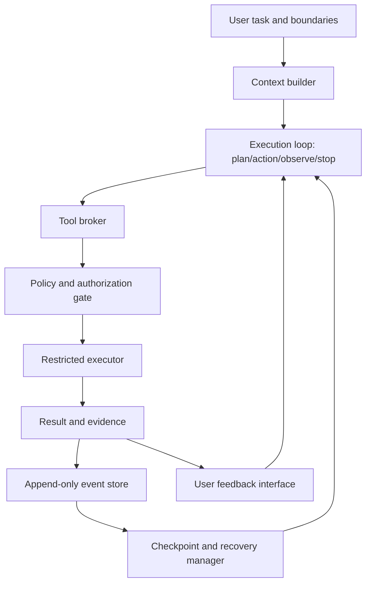
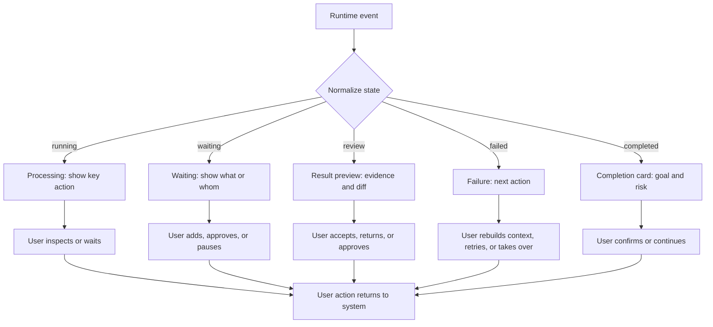

> **Version: 0.2 (preprint).** This is a project-driven conceptual architecture and design study. It organizes design experience from ChatLab, Coding Agent Harness Study, and CanonLoom, proposes a feedback architecture to be tested, and reports a follow-up experimental protocol; it does not report user-experiment data or results.

## Abstract

When I built ChatLab, I first used unread state, processing state, and read position to answer simple questions: is it still alive, where did I stop, and do I need to come back now? I later found that state cues were not enough. Users also need to know why an Agent acted, which results have evidence, which actions require approval, and whether work can continue after failure.

This paper therefore treats an Agent interface as a control surface rather than merely a chat transcript. A task contract defines the goal, state expresses progress, evidence explains grounds, authorization limits possible actions, and checkpoints determine where to continue after an error. Staged diffs, permission checks, and path-escape tests in Coding Agent Harness, together with the separation between candidate and formal states in CanonLoom, are two concrete references for this idea.

This is neither a systematic review nor a user study. It abstracts engineering slices from several projects into a feedback architecture that can be discussed, implemented, and ablated. These materials show only that the relevant boundaries can be designed and partly implemented; they do not show that users become faster, safer, or more satisfied. Follow-up work must validate error-localization time, pre-approval execution rate, recovery success, and user burden.

**Keywords:** Agent HCI; feedback architecture; observability; authorization; recoverability; state machine; human–AI collaboration; auditability; control loop

## 1. The problem: a chat transcript is not a control surface

Another paper in this research series examines the human experience after delegation: how execution pressure falls, how calm and delegability form, and whether emotional experience changes acceptance and takeover. This paper moves one step earlier: if that calm is to come from interaction that is understandable, actionable, and recoverable rather than from black-box smoothness, what must an Agent interface and runtime protocol express?

### 1.1 From answering questions to running tasks

When I built ChatLab, I was not primarily trying to decorate a workbench as a chat application. I wanted a long-running Agent to remain understandable, waitable, and askable—a collaborator that could still be queried. Unread state, typing state, read position, and conversation previews are small interface cues, but they answer practical questions: is it running, what did I miss, where did I stop, and does it need me now?

Those cues solve only part of “seeing state.” Users also need to know why the Agent acted, which outcomes have evidence, which actions need approval, and whether work can continue after failure. A chat skin is therefore an entry point to a feedback architecture, not the whole answer: it translates runtime state into language that people can understand quickly, then brings them back to evidence, authorization, and result judgment.

In single-turn question answering, the answer is the main feedback. The user only needs to judge whether it is useful. Agent tasks contain more states: the goal may need clarification, a plan may need decomposition, a tool may fail, an external resource may change, an action may have an irreversible side effect, and the system may be waiting for approval.

If all of these states are rendered as text messages, users must infer from message order:

- whether the task is still running;
- which step the Agent is executing;
- whether a result is a fact, hypothesis, or suggestion;
- whether a file was really written;
- whether an operation was sent or only prepared;
- whether failure came from the model, tool, permission, or environment;
- whether sending the request again will retry, repeat a side effect, or resume from a checkpoint.

This is not merely a visual-design problem. The control structure has not been made explicit. Users cannot control a runtime they cannot see, locate, pause, or recover.

### 1.2 The minimum loop for a long-running task

A sustainable Agent task needs at least this loop:

```text
task contract → plan/action → state and evidence → human judgment/authorization → external result
    ↑                                                                         ↓
    └──────────────────── correction, recovery, or continuation ──────────────┘
```

Feedback is not merely a status message; it turns a runtime result into an action the user can take next. If feedback cannot help the user judge, approve, correct, pause, or recover, it may only be decorative display.

### 1.3 Research questions

The concrete questions are: can users understand the task stage and know whether to return; how can feedback, evidence, authorization, and recovery remain distinct but connected; how can permissions and side-effect boundaries become system behavior rather than prompt text; and after failure, can users tell whether to rebuild context, approve, retry, or take over?

## 2. Concepts: four layers and two boundaries

### 2.1 Feedback, system observability, and human control are different

These concepts answer different questions: feedback lets a person see an expression; system observability lets maintainers reconstruct runtime state; diagnosability and traceability support localization and accountability; user control, authorized execution, and recoverability determine whether a person can change an action, whether the system can block overreach, and whether work can safely continue.

| Concept | Definition | Mainly serves |
| --- | --- | --- |
| Feedback | The system expresses state, result, or anomaly in a user-understandable form | Perception and next judgment |
| System observability | The system retains enough events and state to infer internal runtime state | Diagnosis and maintenance |
| User visibility | The interface shows what is happening, who is acting, and whether the user must decide | The user’s task model |
| Diagnosability | Evidence can locate where failure occurred and what inputs or actions relate to it | Attribution and repair |
| Traceability/auditability | The system can return to sources, versions, events, and responsible actors | Review, compliance, and accountability |
| User control | The user can pause, modify, approve, reject, or change an imminent action | Intervention |
| Authorized execution | The system enforces capability, scope, and approval rules before action | Policy and side-effect boundaries |
| Recoverability | After failure or interruption, the system can return to a valid checkpoint and continue in a controlled way | Recovery, rollback, and replay |

Feedback without observability is only a state narrative. Observability without user visibility cannot support judgment. Control without authorization boundaries can become destructive. Recovery without checkpoints and idempotency semantics merely repeats failure.

### 2.2 Two boundaries: facts and actions

An Agent system must maintain two boundaries.

The first is the **fact boundary**: what has happened, what is a candidate, and what still needs confirmation. Logs, tool output, model inference, user decisions, and final settlement cannot be placed into one source-less text pool.

The second is the **action boundary**: what may be suggested, drafted, executed in a restricted environment, or performed only after explicit authorization. Visibility is not authorization; a model proposing an action is not the same as the system executing it.

CanonLoom and Coding Agent Harness Study implement these boundaries differently: CanonLoom separates candidate and formal states; Coding Agent Harness uses capability permissions, approval, sandboxing, and staged diffs to control side effects. Together they show that state and permissions must be maintained by protocols and systems, not merely remembered by a model.

### 2.3 Task complete and user-visible complete

A background system may have finished processing while the user still lacks enough result and evidence to judge it. Conversely, an interface may show “complete” while an asynchronous job, index, or deployment is not stable. Four kinds of completion should be separated:

- **User-visible completion:** the user has enough result and evidence to decide what to do next;
- **System processing completion:** backend work has ended;
- **Task-goal completion:** external quality standards are satisfied;
- **Responsibility settlement:** decisions requiring human approval or ownership are settled.

These cannot be replaced by one `done` state. A reliable interface should say which kind of completion it means.

## 3. Design requirements

### 3.1 Task contract: define goal, boundary, and stop conditions first

Before acting, an Agent should receive a sufficiently clear task contract containing:

- task goal and expected artifact;
- what is out of scope;
- available context and tools;
- permission boundaries that cannot be crossed;
- quality or acceptance criteria;
- points requiring human decisions;
- abort, failure, and stop conditions.

A task contract does not prescribe every implementation step. It gives autonomous planning a goal, boundary, and completion semantics. A capable Agent may choose a plan, but it must not change the responsibility boundary on its own.

### 3.2 Explicit state: show where the system is

State should answer “what is happening now.” A minimal state set for a long task is:

```text
idle       no task is running
planning   goal and plan are being clarified
running    an authorized action is executing
waiting    waiting for a tool, resource, or user
review     candidate result and evidence are ready for judgment
recovering a checkpoint and recovery strategy are selected
completed  this processing round has ended
failed     the system cannot continue or has reached a stop condition
```

The same state needs three readings: system state, user action, and side-effect semantics. For example:

| State | Entry condition | User action | Side effect/retry | Terminal? |
| --- | --- | --- | --- | --- |
| `running` | Current step is authorized and starts | Inspect or pause | Depends on task permission | No |
| `waiting` | Waiting for tool, resource, or user | Add input, approve, or wait | Must not repeat a submitted action | No |
| `review` | Candidate result and evidence are ready | Compare, approve, or return | Formal side effect may not have happened | No |
| `recovering` | Checkpoint and strategy selected | Change strategy or abort | Only idempotent or explicitly compensating actions | No |
| `completed` | Processing round ended | Review acceptance and responsibility settlement | Does not imply the goal is complete | Usually |
| `failed` | Cannot continue or stop condition reached | Inspect, hand off, or end | Must not blindly retry | Usually |

### 3.3 Evidence and source: feedback must answer “why”

Feedback should show:

- which files, tools, inputs, or external events produced the result;
- which key actions the Agent took;
- which parts are facts and which are inferences or candidates;
- which task constraint the result addresses;
- which checks passed and which did not run;
- which version or time produced the result;
- which states and external objects the failure affected.

### 3.4 Risk-tiered authorization: human-in-the-loop does not mean approving every step

| Tier | Typical action | Minimum control |
| --- | --- | --- |
| Suggestion | Explanation, summary, investigation direction | Show grounds and uncertainty; user may ignore |
| Draft | Document, code, or test plan | Comparable result; retain version and change record |
| Restricted execution | Sandbox command, preview artifact, local file write | Least privilege, scope limit, cancellation, record |
| High-impact execution | Publish, external send, production data change | Explicit authorization, forced confirmation, audit, rollback or compensation |

### 3.5 Staging and reversibility: produce a candidate before settling a side effect

For file writes, publication, external sends, and state promotion, separate proposing a change from applying it. A staged diff lets an Agent propose a write, then allows capability and approval checks before real write-back.

This gives three benefits:

- users see a concrete change rather than an abstract promise;
- rejection or failure does not silently leave a real side effect;
- recovery can use a candidate version and last valid state rather than a transcript.

For external APIs, email, deployment, or production data changes, assume no universal rollback exists. Recovery means stopping further impact, retaining an external-result receipt, handing off to a human, or executing a tested compensating action. A resumable checkpoint should record submitted side effects and receipts, unsubmitted candidates, idempotency keys, authorization decisions, available recovery strategies, and whether replay is safe.

### 3.6 Rational quiet: feedback density should follow risk and uncertainty

High-frequency feedback is not automatically high-quality feedback. Low-risk, reversible, short tasks can use quiet state cues; long, high-risk, or abnormal tasks need finer-grained feedback and denser evidence. This is an ordinal design rule, not a validated formula:

> When risk, irreversibility, uncertainty, or recovery cost is high, increase evidence density and provide clear authorization or recovery entry points. When actions are low-risk, reversible, and easy to verify, feedback can be quieter. User experience is a moderator, not a predetermined direction.

## 4. Reference architecture: from intent to recovery

### 4.1 Overall data flow



**Figure 2.** This reference architecture describes responsibility boundaries; it does not mean all components have been completed in one project. ChatLab mainly covers state expression, Coding Agent Harness covers part of restricted execution, and CanonLoom covers part of long-lived state and settlement. Persistent events, general checkpoints, and external side-effect recovery still require separate implementation and tests.

Each component should have a narrow responsibility:

- **Context builder:** selects facts, constraints, and sources for the run and records exclusion reasons;
- **Execution loop:** plans, acts, observes, retries, and stops without owning all side-effect permissions;
- **Tool broker:** maps model-proposed actions to controlled tools;
- **Policy and authorization gate:** decides whether an action is allowed and whether human approval is required;
- **Restricted executor:** performs the real action within workspace, sandbox, and resource limits;
- **Result and evidence layer:** retains tool results, checks, and sources;
- **Append-only event store:** records a runtime trail that cannot be silently rewritten;
- **Checkpoint and recovery manager:** stores the last valid state and resumable input;
- **Interface:** presents state and action entry points according to role and risk.

### 4.2 Context builder: do not feed everything to the model

Context should be a reasoned selection function rather than a copy of the whole history:

```text
context_t = select(intent, approved_state, current_task, constraints, evidence)
```

A minimal record can be:

```json
{
  "task_id": "task-...",
  "run_id": "run-...",
  "included": [
    {"path": "...", "sha256": "...", "reason": "current_constraint"}
  ],
  "excluded": [
    {"path": "...", "reason": "out_of_scope"}
  ],
  "authority": ["approved-canon", "user-request"],
  "stale_after": "..."
}
```

This supports quality and safety: users can ask why the Agent relied on a source, and maintainers can decide whether an error came from the model or context selection. Excluded material should retain a reason too.

### 4.3 Execution loop: state before and after action

An observable execution loop should not retain only final text. It should emit structured events at least at these points:

```text
run_started
plan_proposed
action_requested
authorization_required
action_started
action_succeeded / action_failed
evidence_attached
checkpoint_created
recovery_started / recovery_failed
review_required
run_completed / run_failed
```

Events are facts that the system can replay, query, and evaluate, not reminder words for a model. Natural-language explanation can be one view of an event, but cannot replace the event itself.

### 4.4 Tool broker and policy gate

The tool broker separates “what the model wants to do” from “what the system permits.” It should check:

- tool name and parameters against a defined format;
- resource paths against the permitted scope;
- current task capability permissions;
- whether approval is required;
- whether the action is idempotent, revocable, or must be staged;
- whether retry could repeat an external side effect;
- whether the result needs sources and a state transition.

These checks must not live only in a system prompt. A prompt can help a model understand intent, but it cannot be the final permission boundary.

### 4.5 Event store and checkpoints

An append-only event store should retain at least:

- `task_id`: user task;
- `run_id`: one run;
- `step_id`: plan step;
- `event_id`: unique event ID;
- `state_before` and `state_after`;
- `actor`: user, model, tool, or system;
- `action` and parameter summary;
- `evidence` and sources;
- `retryable`, `requires_approval`, and `side_effect`;
- time, version, and related events.

A checkpoint is not simply a saved chat history. A resumable checkpoint says which actions were submitted, which are only candidates, which external side effects occurred, what input is needed next, and whether repeating the action is safe.

## 5. Feedback must turn state into the next action

In ChatLab I first used “processing,” unread state, and read position to answer whether the system was alive and where I had looked. These cues express state, not evidence or authorization. State feedback should say whether the system is running, waiting, seeking approval, or failed. If the interface only shows a busy animation, users cannot tell whether to keep waiting, add information, or return to handle a problem.

Process feedback need not expose every log. It should show actions that change judgment: which constraint was read, which check ran, which diff was generated, and which step was skipped. Ordinary users can see the current stage and conclusion first, then expand files, tool output, and full events when troubleshooting. This is layering for judgment, not hiding the process.

Result feedback cannot simply say “complete.” It should show the artifact, satisfied acceptance criteria, unchecked parts, deviation from the original goal, and whether the next action is approve, modify, continue, or stop. For code, tests, diffs, uncovered paths, and rollback are more useful than a completion sentence. For long-form production, candidate text, review issues, sources, and author approval must remain separate.

Uncertainty should appear even in successful results: assumptions, missing facts, checks not run, and actions chosen by the Agent. An uncalibrated confidence percentage creates false precision. Evidence, assumptions, impact, and suggested action are more useful together.

Feedback must end in an action entry point: pause, revise the goal, approve or reject a side effect, inspect and apply a staged diff, retry, roll back, change path, or hand off. Showing a production change is not approval; showing a plan is not permission to execute it.

## 6. On failure, ask why before deciding whether to retry

I first classify failure into three actionable types. If the grounds or goal are wrong, rebuild context or clarify the task. If a tool or environment is temporarily unavailable, retry with limits or change tools only after confirming that the action is safe to repeat. If permission or a user decision blocked the action, return to authorization rather than retry blindly.

For reversible side effects, roll back or execute an inverse action. For irreversible effects, stop further impact, retain the external receipt, and hand off or execute a tested compensation. Recovery is not better because it is more automatic; the key is knowing what happened, whether retry repeats it, and who decides next.

CanonLoom offers a direct distinction:

```text
model proposal ≠ candidate saved ≠ review passed ≠ formally effective
```

Code, data, and operational tasks need the same distinction. Users must know whether they are looking at a proposal or a change that has already altered reality.

## 7. Three design cases from ChatLab

The three projects provide three entry points: ChatLab asks whether a person can understand what the Agent is doing; Coding Agent Harness asks whether it has permission to do it; CanonLoom asks whether the change has formally taken effect. They are not one complete delivered system, but three comparable design slices.

### 7.1 ChatLab: translate state into familiar collaboration language

DSH ChatLab maps workspaces to project groups, Agent sessions to contacts, and message streams to 1:1 conversations, while expressing runtime as processing. Preview, unread state, local read position, and switchable skins answer the first questions when entering a workbench: is it running, where did I look, and do I need to return?

These designs show that the expression can be implemented, not that a chat skin improves trust, efficiency, or emotional value. The next step is to connect state to action:

| Interface mechanism | Should express | What the user can do | Current gap |
| --- | --- | --- | --- |
| Processing state | Agent is running or waiting | Inspect stage, wait, pause | Say whether the user needs to return, not only “busy” |
| Unread and preview | What changed since the last view | Open specific evidence from a summary | Unread should mean a pending judgment change, not only message count |
| Read position | Where the user is in the runtime trail | Continue understanding from the last position | Seen is not confirmed |
| Intervention prompt | Agent is waiting for approval, clarification, or takeover | Approve, edit, reject, or take over | Entry must include context and impact |
| Completion card | Result, evidence, unfinished parts, and next step | Accept, open artifact, continue, or finish | Completion cannot be only the last message |

If the interface says waiting, users should know what it awaits. If it says complete, they should know what completed. If it asks for intervention, they should decide before the side effect grows. This is the step from looking familiar to helping people secure the result.



**Figure 3.** Runtime events become ChatLab feedback and actions. The interface does not merely recolor events; it translates state into something the user can do next.

### 7.2 Coding Agent Harness: make permissions and side effects system boundaries

Coding Agent Harness has a restricted slice working: reading does not create a side effect; writing first creates a staged diff; only after capability and human approval checks can the real write-back occur.

This supports only the claim that a boundary can be implemented and tested. Persistent events and checkpoint recovery remain future work.

### 7.3 CanonLoom: make long-lived state and author approval explicit

CanonLoom separates candidate text, formal text, review results, sources, and author approval, and settles state through stage gates. It shows that long-task feedback must say not only “what was generated,” but also “is it still a candidate, which constraint failed, who must approve, and when does it take effect?”

The three cases provide design and engineering evidence, not evidence of user effects, literary quality, or long-term benefit.

## 8. Observability data model

### 8.1 Minimal event structure

A reviewable Agent event can be represented as:

```json
{
  "event_id": "evt-...",
  "task_id": "task-...",
  "run_id": "run-...",
  "step_id": "step-...",
  "type": "action_succeeded",
  "actor": "tool",
  "state_before": "running",
  "state_after": "review",
  "action": {
    "name": "run_check",
    "side_effect": "none",
    "requires_approval": false
  },
  "evidence": [
    {"source": "workspace/test-output.txt", "sha256": "..."}
  ],
  "retryable": false,
  "checkpoint_id": "cp-...",
  "created_at": "..."
}
```

Fields can be reduced for a smaller product, but these relations must remain: which task and run the event belongs to, the before and after state, who acted, what action occurred, its side-effect and approval semantics, and which evidence supports it.

### 8.2 Keep facts, hypotheses, decisions, and results separate

| Information type | Example | Can it be promoted automatically? |
| --- | --- | --- |
| Fact | Tool test result, file hash | Depends on source reliability |
| Hypothesis | Agent believes a file is the root cause | Should not directly become a formal fact |
| Suggestion | Proposed code change | Requires evaluation and authorization |
| Decision | User approved applying a diff | May enter the audit trail |
| Result | Change applied, deployment completed | Requires external evidence |

### 8.3 Metric layers

Separate metrics by object and denominator: task, run, step, event, user action, and external result are not interchangeable. A useful set includes state understanding, error localization, control quality, recovery, evidence quality, task result, and user experience. Do not turn event volume or message count into a proxy for quality.

## 9. Proposed evaluation plan and ablation experiments

### 9.1 Main questions

Measure whether users understand state, find errors, avoid unauthorized actions, recover without repeated side effects, and judge results with less unnecessary burden. Test the behavioral path rather than relying on preference alone.

### 9.2 Measures

| Goal | Measures |
| --- | --- |
| State understanding | State-identification accuracy; time from state to next action |
| Error localization | Attribution time; localization accuracy; invalid retries |
| Control quality | Unauthorized-action rate; pre-approval execution; effective interruption |
| Recovery | Recovery success; continuation success; recovery time; repeated side effects |
| Evidence quality | Event completeness; source coverage; state consistency |
| Task result | Goal completion; quality; rework; external error |
| User experience | Cognitive load, interruption, trust calibration, authorization burden, perceived control |

### 9.3 Minimum experiment specification

| Field | Must be explicit |
| --- | --- |
| Experimental unit | User, task, run, step, or event; denominators cannot be mixed |
| Manipulation | Feedback type, evidence density, authorization gate, checkpoint, or recovery option |
| Control | Chat text, result summary, or feature-equivalent baseline |
| Randomization | User-, task-, or run-level assignment and learning-effect handling |
| Primary outcome | One pre-specified primary outcome per stage; others secondary or guardrails |
| Manipulation check | Whether users actually saw state, evidence, or authorization |
| Statistical model | Repeated measures, task nesting, and multiple comparisons |
| Exclusion | Interruptions, tool failure, invalid input, and missing data |
| Retention | Rules for traces, sources, personal information, and deletion requests |

### 9.4 Ablation design

Possible ablations include:

- remove explicit state and retain only chat text;
- remove process evidence and retain only result summaries;
- remove uncertainty expression;
- remove staged diffs and approval gates;
- remove append-only event trails;
- remove checkpoints and permit only rerunning from the beginning;
- remove recovery options and provide only “retry”;
- remove context sources and exclusion reasons.

### 9.5 Method combination

Combine controlled experiments, task-log analysis, event replay, and first-person/design reflection. Each phase should define one main outcome before expanding scope.

## 10. Ethics and design boundaries

### 10.1 Do not treat dependence as emotional-value success

A user who checks less may be relaxed, overloaded, over-trusting, or simply unable to intervene. Reliance, session duration, and positive language cannot alone establish emotional benefit.

### 10.2 Responsibility for high-impact actions

High-impact decisions should retain an accountable human decision-maker. A system must not use adaptive language, a friendly role, or a completion badge to blur who authorized a side effect or who must settle its consequences.

## 11. What can be claimed now

The current material supports a narrower claim: state, evidence, authorization, and recovery can be designed as distinct but connected layers, and the three projects demonstrate implementable slices. It does not establish that the architecture improves speed, safety, satisfaction, or long-term recovery.

The next sequence is to use cognitive interviews to settle state vocabulary and the minimum event protocol; compare feedback and authorization interfaces on identical runtime traces; and measure takeover ability and repeated side effects under interruption, recovery, and long-term use. Each step should pre-specify one primary outcome.

## 12. Conclusion

The core problem of an Agent interface is not how many messages to display. It is how people retain understanding, authorization, judgment, and recovery ability in a stateful execution system. A complete feedback architecture should tell users what the task is, what the system is doing, what supports the result, which actions have happened, what requires their decision, and where to continue after failure. Participation does not mean supervising every step. It means having real information, authority, and responsibility at goal-setting, key approval, exception takeover, and result settlement points; low-risk execution can otherwise remain quiet.

Feedback is not log decoration. Observability is not information accumulation. Control is not clicking every step. Recovery is not a synonym for retry. Together they form a loop from task contract through state and evidence, authorization and reversible side effects, to checkpoints and recovery.

A good Agent interface neither forces people to watch forever nor removes them from the runtime. It stays quiet for low-risk, reversible, certain actions, and provides evidence and choices for high-risk, uncertain, irreversible actions. It lets the user pause, modify, reject, roll back, or continue when needed. **Mature interaction design does not make automation look more human; it preserves a place, evidence, authority, and a way back for human judgment while automation is working.**

## References and related materials

1. Parasuraman, R., Sheridan, T. B., & Wickens, C. D. (2000). A model for types and levels of human interaction with automation. *IEEE Transactions on Systems, Man, and Cybernetics*.
2. Lee, J. D., & See, K. A. (2004). Trust in automation: Designing for appropriate reliance. *Human Factors*.
3. Dourish, P., & Bellotti, V. (1992). Awareness and coordination in shared workspaces. *CSCW*.
4. Suchman, L. (2007). *Human-Machine Reconfigurations*. Cambridge University Press.
5. This site, “Before Putting AI Capability into an Engineering Organization, Define These Boundaries First”: context, responsibility, authorization, and measurement boundaries.
6. This site, “Developer Productivity Is Not a Tool Catalog but a Feedback System”: trusted feedback, failure diagnosis, and recovery loops.
7. This site, “Data Measurement Is Not a Dashboard but a Recomputable Organizational Collaboration Protocol”: task, state, event, and metric layers.
8. This site, `dsh-skin-chatlab`: IM semantics for Agent sessions, runtime, previews, unread, and read state.
9. This site, `dsh-plugin-toolbox`: working activity, sidebars, and event traces for Agent visibility.
10. Liyuk (2026). [Coding Agent Harness Study](https://github.com/Liyuk/claude-code-harness-study). Restricted execution, capability permissions, approval, staged diffs, and event traces.
11. Liyuk (2026). [CanonLoom](https://github.com/Liyuk/canonloom). Recoverable, auditable, author-approved long-form narrative state production.

## Author information and declarations

**Author:** Liyuk

**Competing interests:** The author declares no competing interests. This research received no commercial funding.

**Data availability:** This paper contains no new user-experiment data or results. ChatLab, Coding Agent Harness Study, and CanonLoom provide engineering and design evidence; this paper reports a reproducible evaluation plan, but user effects, long-term use, and cross-task recovery still require later experiments and logs.

## Glossary

| Term | Definition |
| --- | --- |
| Control surface | The Agent interaction layer through which people understand state, authorize actions, intervene, and recover |
| Feedback | The way a system expresses state, result, evidence, or anomaly to a person |
| System observability | Retaining enough events and state for maintainers or evaluators to infer internal runtime state |
| User visibility | The interface showing what is happening, who is acting, and whether the user must decide |
| Diagnosability | The ability to locate failure from evidence and connect it to inputs or actions |
| Traceability/auditability | The ability to return to sources, versions, events, and responsible actors |
| User control | The ability to pause, modify, approve, reject, or change an imminent action |
| Authorized execution | Enforcing capability, scope, and approval rules before an action happens |
| Staged diff | A comparable candidate change that can be approved before a real write |
| Checkpoint | The last valid, explainable, state-complete point from which work can resume |
| Recoverability | Continuing, rolling back, compensating, or handing off after failure without uncontrolled duplicate side effects |
| Feedback density | The amount of state, process, and evidence shown per unit time or task |
| Task contract | An operating agreement defining goal, non-goal, context, permissions, acceptance, and stop conditions |
