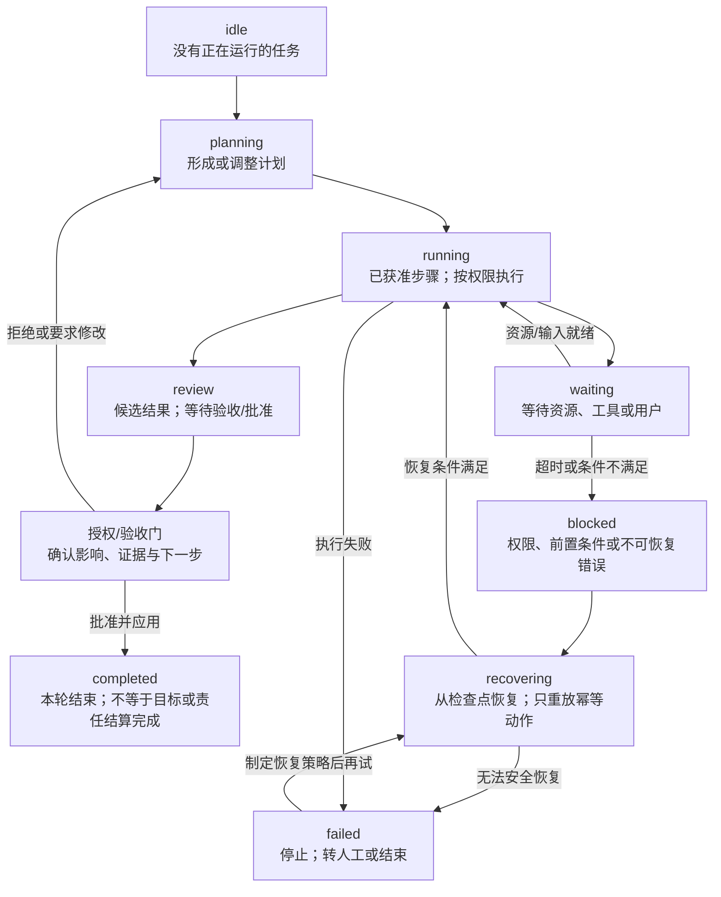
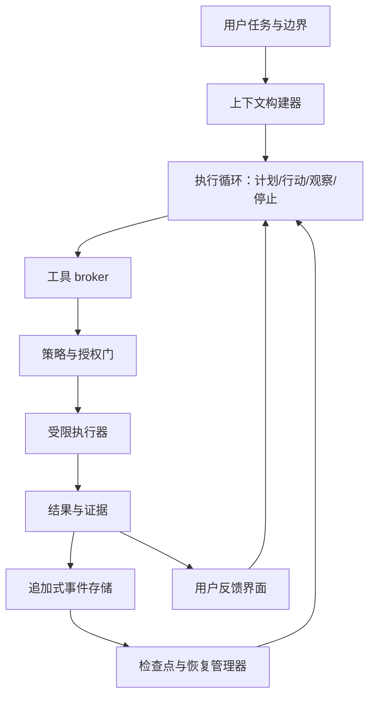
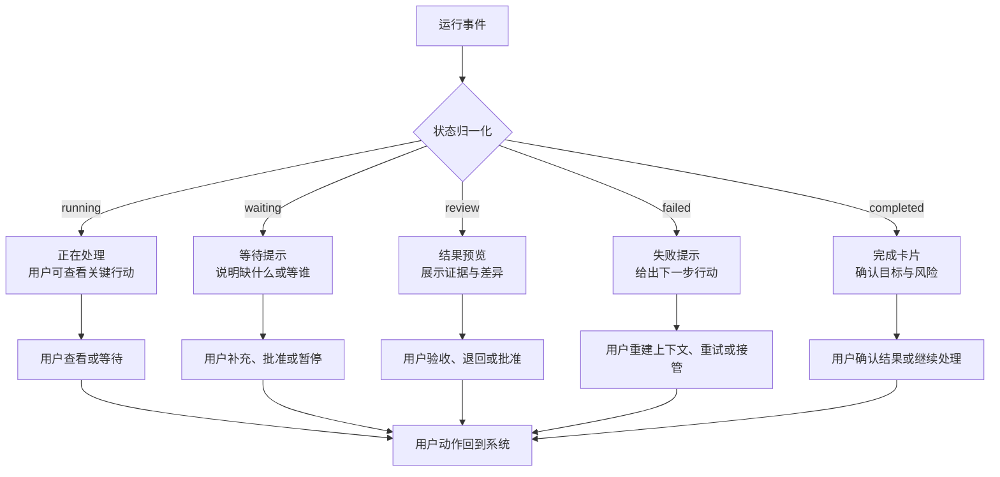

> **版本：v0.2（preprint）。** 这篇文章是一篇项目驱动的概念架构与设计研究，整理 ChatLab、Coding Agent Harness Study 与 CanonLoom 的设计经验，提出一套待验证的反馈架构，并报告后续实验协议；目前不报告用户实验数据或结果。

## 摘要

我做 ChatLab 时，先用未读、正在处理和已读位置回答几个很直接的问题：它还活着吗，我看到哪里，现在要不要回来？后来发现，状态提示还不够；用户还需要知道 Agent 为什么这样做、哪些结果有证据、哪些动作要批准，以及失败后能不能接着做。

所以这篇文章把 Agent 界面看成一个控制面，而不只是聊天记录。任务契约说清目标，状态说清进展，证据说明依据，授权划定可发生的动作，检查点决定出错后从哪里继续。Coding Agent Harness 的暂存差异、权限检查和路径逃逸测试，CanonLoom 的候选/正式状态分离，是这套想法的两个具体参照。

本文不是系统综述，也不是用户实验报告。它把多个项目中的工程切片抽象为可讨论、可实现、可消融的反馈架构：这些材料只能说明相关边界可以被设计和部分实现，不能说明用户因此更快、更安全或更喜欢。后续需要用错误定位时间、批准前执行率、恢复成功率和用户负担来验证。

**关键词：** Agent HCI；反馈架构；可观测性；授权；可恢复性；状态机；人机协作；审计；控制闭环

## 1. 问题：聊天记录不是控制面

同一研究系列中的另一个问题关注委托之后人的体验：执行压力如何下降，安心和可托付感如何形成，以及情绪体验是否会改变验收和接管。本文把问题往前推一步：如果希望这种安心来自可理解、可操作、可恢复的交互，而不是来自黑箱顺畅感，Agent 界面和运行协议至少要表达什么？

### 1.1 从“回答问题”到“运行任务”

我做 ChatLab 时，最先想解决的不是怎样把工作台装饰得像聊天软件，而是怎样让一个长时间运行的 Agent 看起来仍然是一个可以理解、可以等待、可以追问的协作者。未读、typing、已读位置和会话预览看起来都是很小的界面线索，但它们分别回答了几个实际问题：它还在运行吗？我错过了什么？我上次看到哪里？现在需要我回来吗？

后来我发现，这些线索只能解决“看见状态”的一部分。用户还要知道 Agent 为什么这样做、哪些结果已经有证据、哪些动作需要批准，以及失败后是否能接着做。聊天皮肤因此不是完整答案，而是反馈架构的入口：它把运行状态翻译成人能迅速理解的语言，再把人带回证据、授权和结果判断。

单轮问答的主要反馈是答案本身。用户只要判断答案是否有用，就可以结束交互。但 Agent 任务往往包含更多状态：目标需要澄清，计划需要拆解，工具可能失败，外部资源可能改变，某些动作可能产生不可逆副作用，系统还可能在等待人的批准。

如果这些状态都以文字消息呈现，用户必须从消息顺序中自行推断：

- 当前任务是否仍在运行；
- Agent 正在执行哪一步；
- 某个结果是事实、假设还是建议；
- 某个文件是否已经真正写入；
- 某项操作是否已经发出或只是准备中；
- 失败是模型问题、工具问题、权限问题还是环境问题；
- 重新发送请求会重试、重复副作用，还是从检查点继续。

这不是单纯的“界面不够好看”，而是控制结构没有被显式表示。用户无法控制自己看不见、无法定位、无法暂停或无法恢复的运行过程。

### 1.2 长任务中的最小闭环

一个可持续的 Agent 任务至少需要下面这条回路：

```text
任务契约 → 计划/行动 → 状态与证据 → 人的判断/授权 → 外部结果
    ↑                                                   ↓
    └────────────── 修正、恢复或继续 ───────────────────┘
```

其中“反馈”不只是告诉用户一个状态，而是把运行结果变成下一步可采取的行动。一个反馈若不能帮助用户判断、批准、修正、暂停或恢复，就可能只是显示层的装饰。

### 1.3 研究问题

我想回答几个具体问题：用户能不能从界面看懂任务到哪一步、下一步要不要回来；反馈、证据、授权和恢复怎样分开又接上；怎样把权限和副作用边界落成系统，而不是只写在提示词里；失败之后，用户能不能知道该重建上下文、批准、重试还是接管。

## 2. 概念定义：四个层次和两个边界

### 2.1 先分清反馈、系统可观测性和人的控制

这些词解决的是不同问题：反馈让人看见表达；系统可观测性让维护者还原运行状态；可诊断性和可追溯性帮助定位与问责；用户控制、授权执行和可恢复性则分别决定人能否改变动作、系统能否挡住越权，以及失败后能否安全继续。

| 概念 | 定义 | 主要面向 |
| --- | --- | --- |
| 反馈 | 系统把状态、结果或异常以用户可理解的形式表达出来 | 人的感知与下一步判断 |
| 系统可观测性 | 系统是否保留足够事件和状态，使维护者或评估器能够推断运行内部状态 | 运行诊断与系统维护 |
| 用户可见性 | 界面是否让用户知道正在发生什么、谁在行动以及是否需要自己决定 | 人的任务模型 |
| 可诊断性 | 能否根据证据定位失败发生在哪里、与哪些输入或动作有关 | 错误归因与修复 |
| 可追溯性/审计性 | 能否回到来源、版本、事件和责任主体 | 复查、合规与责任 |
| 用户控制 | 用户是否能够暂停、修改、批准、拒绝或改变即将发生的动作 | 用户介入 |
| 授权执行 | 系统在动作发生前强制执行能力权限、范围和批准规则 | 策略与副作用边界 |
| 可恢复性 | 失败或中断后是否能回到合法检查点，并以不重复或可控的方式继续 | 恢复、回滚与重放 |

没有可观测性的反馈只是状态叙事；没有用户可见性的可观测性仍不能支持判断；没有授权边界的控制可能变成破坏；没有检查点和幂等语义的恢复只能重复失败。

### 2.2 两个边界：事实与行动

Agent 系统至少需要同时维护两个边界。

第一是**事实边界**：什么已经发生，什么只是候选，什么仍然需要确认。日志、工具输出、模型推断、用户决定和最终结算不能放进同一个没有来源的文本池。

第二是**行动边界**：什么可以建议，什么可以生成草稿，什么可以在受限环境中执行，什么必须经过明确授权。信息可见不等于行动获准；模型提出动作不等于系统已经执行动作。

这两个边界在 CanonLoom 与 Coding Agent Harness Study 中有不同实现：CanonLoom 把候选状态和正式状态分开，Coding Agent Harness 用能力权限、批准、沙箱和暂存差异控制副作用。它们共同说明，状态和权限必须由协议与系统维护，不能只依赖模型记住规则。

### 2.3 任务完成与用户可见完成

后台系统可能已经完成处理，但用户还没有获得足以判断的结果；反过来，界面也可能显示“完成”，而异步任务、索引或部署其实尚未稳定。这里要分开四种完成：

- **用户可见完成**：用户获得了足以决定下一步的结果和证据；
- **系统处理完成**：后端工作已经结束；
- **任务目标完成**：外部质量标准满足；
- **责任结算完成**：需要人批准或承担的决定已经明确落定。

这四者不能用同一个 `done` 状态代替。一个可靠的界面应该告诉用户当前“完成”是哪一种完成。

## 3. 设计要求

### 3.1 任务契约：先定义目标、边界和停止条件

Agent 开始行动前，应能获得一个足够明确的任务契约。契约至少包含：

- 任务目标与期望产物；
- 不在范围内的事情；
- 可使用的上下文和工具；
- 不可越过的权限边界；
- 质量或验收标准；
- 需要人工决定的节点；
- 中止、失败与停止条件。

任务契约不是把所有实现步骤预先写死。它的作用是让 Agent 的自由行动仍然有目标、边界和结束语义。高质量的 Agent 可以自行选择计划，但不能自行改变任务的责任边界。

### 3.2 显式状态：让用户知道系统在哪里

状态应当能够回答“现在发生什么”。一个适用于长任务的最小状态集可以是：

```text
idle       没有正在运行的任务
planning   正在形成或调整计划
running    正在执行一个已批准的步骤
waiting    等待外部资源、工具或用户输入
blocked    因权限、前置条件或不可恢复错误暂停
review     已产生候选结果，等待验收或批准
recovering 正在从已知失败或检查点恢复
completed  本轮处理完成，但是否达到任务目标需另行判断
failed     已停止，失败原因和下一步已明确
```

这些词描述的是运行或审查状态，不是一个对象的全部生命周期。实现时至少要分开任务、运行、步骤、外部副作用和用户审查五种状态；还要为每种状态定义负责人、进入和退出条件、允许的副作用、能否重试以及是否终止。

| 状态 | 进入条件 | 用户动作 | 副作用/重试 | 是否终态 |
| --- | --- | --- | --- | --- |
| `running` | 当前步骤已获准并开始执行 | 查看、暂停 | 依任务权限而定 | 否 |
| `waiting` | 等待工具、资源或用户 | 补充输入、批准或等待 | 不应重复已提交动作 | 否 |
| `review` | 候选结果与证据已生成 | 比较、批准、退回 | 正式副作用尚未必发生 | 否 |
| `recovering` | 选定检查点和恢复策略 | 修改策略或中止 | 只允许幂等或明确补偿动作 | 否 |
| `completed` | 本轮处理结束 | 查看目标验收与责任结算状态 | 不代表目标一定完成 | 通常是 |
| `failed` | 无法继续或达到停止条件 | 查看原因、转人工或结束 | 不应盲目重试 | 通常是 |

事件实现还需要 `schema_version`、转移事件 ID、状态版本和因果关联，以处理重复、乱序与并发事件。这张表是拟议协议，不代表当前三个设计材料都已经完整实现。

状态名称不是越多越好。状态必须有稳定的进入和退出条件，并能映射到用户可以采取的动作。若 `waiting` 既表示网络等待，也表示等待用户批准，界面就无法告诉用户该做什么。



**图 1：Agent 任务的状态、授权与恢复路径。** `running` 表示步骤已经获得相应授权，`review` 是候选结果而不是自动生效；只有在检查点、幂等性和副作用边界明确时才允许恢复或重试。这里的 `completed` 仅表示本轮处理结束，不代表任务目标或责任已经结算。该图是拟议状态协议，不代表三个项目已经完整实现所有状态转换、持久化检查点和外部副作用恢复。

### 3.3 证据与来源：反馈要能回答“为什么”

一个结果若没有证据，用户只能根据语气和界面顺畅度判断可信度。可用证据至少包括：

- 结果来自哪些文件、工具、输入或外部事件；
- Agent 做过哪些关键动作；
- 哪些内容是事实，哪些是推断或候选；
- 结果对应哪一条任务约束；
- 哪些检查已通过，哪些没有运行；
- 哪个版本或时间点产生了这个结果；
- 失败影响了哪些状态和外部对象。

证据不意味着把全部事件轨迹倾倒给用户。系统可以把完整事件保存在审计层，把与当前判断有关的证据摘要呈现给用户，并为需要深入排查的人提供逐层展开。

### 3.4 风险分级授权：人在回路中不等于每步批准

统一的“人工在回路中”规则有两个极端：低风险任务被逐步卡住，高风险动作却只得到一个模糊的最终确认。更合理的做法是按副作用和不可逆程度分级：

| 等级 | 典型动作 | 最低控制 |
| --- | --- | --- |
| 建议 | 解释、摘要、排查方向 | 显示依据与不确定性；用户可忽略 |
| 草稿 | 文档、代码、测试计划 | 结果可比较；保留版本与变更记录 |
| 受限执行 | 沙箱命令、预览产物、局部文件写入 | 最小权限、范围限制、可取消、留痕 |
| 高影响执行 | 发布、外发、生产数据变更 | 明确授权、强制确认、审计、回滚或补偿 |

授权请求应该说明“将发生什么、影响什么、为什么需要现在决定、拒绝后怎样继续”。只显示一个“允许/拒绝”按钮，会把重要判断压缩成无上下文的点击。

### 3.5 暂存与可逆：先产生候选，再结算副作用

对于文件写入、发布、外发和状态晋升等动作，系统应尽可能把“提出变化”和“应用变化”分开。Coding Agent Harness 的暂存差异是一个具体模式：Agent 可以提出写入，系统先生成差异，经过能力和批准检查后才应用。

这条原则有三项好处：

- 用户看到的是具体变化，而不是抽象的“我会修改”；
- 失败或拒绝不会自动留下真实副作用；
- 恢复可以围绕候选版本和最后合法状态进行，而不是围绕一段聊天记录进行。

对于外部 API、邮件发送、部署或生产数据变更，不能假设存在通用的回滚。若动作不可逆，恢复的含义是停止继续扩大影响、保存外部结果凭证、转人工处理，或执行已经验证过的补偿动作。一个可继续的检查点至少要记录：已提交的外部副作用及返回凭证、尚未提交的候选动作、幂等键、当前授权决定、可用恢复策略，以及动作是否允许重放。

### 3.6 合理的安静：反馈密度应随风险和不确定性变化

高频反馈不等于高质量反馈。低风险、可逆、短时任务可以采用较安静的状态提示；长任务、高风险或存在异常时，需要提高反馈粒度和证据密度。这里不是一个经过验证的加减公式，而是一条序数设计规则：

> 当任务具有高风险、不可逆副作用、高不确定性或高恢复成本时，反馈应提高证据密度，并提供明确的授权或恢复入口；当动作低风险、可逆且结果容易验证时，反馈可以保持较安静。用户经验只作为调节变量，不预设其方向。

反馈架构应该解释为什么此时打扰用户，而不是把所有运行都渲染成同样的活动流。

## 4. 参考架构：从意图到恢复

### 4.1 总体数据流



**图 2：从任务契约到结果与恢复的参考架构。** 这张图说明系统的责任边界，不代表所有组件已经在同一个项目中完成。ChatLab 主要覆盖状态表达，Coding Agent Harness 覆盖受限执行的一部分，CanonLoom 覆盖长期状态与结算的一部分；持久化事件、通用检查点和外部副作用恢复仍需逐项实现与测试。

每个组件的责任应尽量单一：

- **上下文构建器**选择本轮事实、约束和来源，并记录排除理由；
- **执行循环**负责计划、行动、观察、重试与停止，但不拥有全部副作用权限；
- **工具 broker**把模型提出的动作映射到受控工具；
- **策略与授权门**判断动作是否被允许、是否需要人确认；
- **受限执行器**在工作目录、沙箱和资源范围内执行真实动作；
- **结果与证据层**保存工具结果、检查结果和来源；
- **追加式事件存储**记录不可静默修改的运行轨迹；
- **检查点与恢复管理器**保存最后合法状态和可继续的输入；
- **界面**根据用户角色和当前风险呈现状态与行动入口。

### 4.2 上下文构建器：不是“把所有东西都喂给模型”

上下文应当是一个带理由的选择函数，而不是整个历史的复制：

```text
context_t = select(intent, approved_state, current_task, constraints, evidence)
```

最小记录可以包含：

```json
{
  "task_id": "task-...",
  "run_id": "run-...",
  "included": [
    {"path": "...", "sha256": "...", "reason": "current_constraint"}
  ],
  "excluded": [
    {"path": "...", "reason": "out_of_scope"}
  ],
  "authority": ["approved-canon", "user-request"],
  "stale_after": "..."
}
```

这样的记录既支持质量，也支持安全：用户可以追问 Agent 为什么依据某份材料，维护者可以判断错误来自模型还是上下文选择。上下文不是把所有历史重新塞给 Agent，而是从目标、已批准事实、当前任务、约束和已有证据中选择本轮真正需要的材料；被排除的内容也应留下理由。

### 4.3 执行循环：行动前后都要有状态

一个可观察的执行循环不应只留下最终文本。至少需要在以下节点产生结构化事件：

```text
run_started
plan_proposed
action_requested
authorization_required
action_started
action_succeeded / action_failed
evidence_attached
checkpoint_created
recovery_started / recovery_failed
review_required
run_completed / run_failed
```

事件不是给模型看的“提醒词”，而是系统可以重放、查询和评估的事实。模型的自然语言解释可以作为事件的一个视图，但不能替代事件本身。

### 4.4 工具 broker 与策略门

工具 broker 把“模型想做什么”与“系统允许做什么”分开。它应该检查：

- 工具名称与参数是否符合预先定义的格式；
- 资源路径是否在允许范围；
- 当前任务是否拥有对应的能力权限；
- 动作是否需要用户授权；
- 动作是否幂等、可撤销或需要暂存；
- 重试是否可能重复外部副作用；
- 结果是否需要附带来源和状态变更。

这类检查不应只写在 Agent 的 system prompt 中。提示词能帮助模型理解意图，但不能成为最后一道权限边界。

### 4.5 事件存储与检查点

追加式事件存储至少要保存：

- `task_id`：用户任务；
- `run_id`：一次运行；
- `step_id`：计划中的步骤；
- `event_id`：事件唯一标识；
- `state_before` 与 `state_after`；
- `actor`：用户、模型、工具或系统；
- `action` 与参数摘要；
- `evidence` 与来源；
- `retryable`、`requires_approval` 与 `side_effect`；
- 时间、版本和关联事件。

检查点不是简单地保存一份聊天历史。一个可继续的检查点需要说明：哪些动作已经提交，哪些只生成候选，哪些外部副作用已经发生，下一步需要什么输入，以及重复执行是否安全。

## 5. 反馈要把状态变成下一步行动

我在 ChatLab 里先用“正在处理”、未读和已读位置回答“系统还在不在、我看到哪里”；但这些只能说明状态，不能说明证据和授权。状态反馈至少要让人知道它是在运行、等待、需要批准，还是已经出错。若界面一直显示忙碌动画，用户无法判断应该继续等、补充信息，还是回来处理问题。

过程反馈不需要把全部日志推给用户，只展示会改变判断的动作：读了哪份约束、跑了哪项检查、生成了什么差异、跳过了哪一步。普通用户先看到当前阶段和结论，需要排查时再展开文件、工具结果和完整事件。这样做不是为了隐藏过程，而是把过程按判断需要分层。

结果反馈不能只说“完成”。它至少要让我看到产物、已经满足的验收条件、没有检查的部分、与原始目标的偏差，以及下一步可以批准、修改、继续还是停止。对于代码任务，测试、差异、未覆盖路径和回退方式比一句完成更有用；对于长篇创作，候选正文、审查问题、来源和作者批准同样不能混在一起。

不确定性也应在成功结果里出现：结果依赖了哪些假设，哪些事实没有找到，哪些检查没有运行，哪些动作是 Agent 自己选择的。没有校准依据的置信度百分比只会制造虚假的精确。更实用的表达是把证据、假设、影响和建议行动放在一起。

反馈最终要连到行动入口：暂停，修改目标，批准或拒绝具体副作用，查看并应用暂存差异，选择重试、回退、换路径或转人工。让用户看到生产变更，不等于用户已经批准；让用户看到 Agent 的计划，也不等于计划可以自动执行。

## 6. 失败时先问原因，再决定是否重试

我会先把失败归到三种可操作的情况。依据或目标错了，就重建上下文或澄清任务；工具或环境暂时不可用，就在确认动作可以安全重试后限次重试或换工具；权限或用户决定挡住了动作，就回到授权节点，不能让模型盲目再试。

已经产生可逆副作用时，回滚或执行反向动作；不可逆时，先停止扩大影响，保存外部结果凭证，再转人工或执行已经验证过的补偿动作。恢复不是越自动越好，关键在于知道哪些动作已经发生、重试会不会重复，以及下一步由谁决定。

CanonLoom 对这里有一个很直接的启发：

```text
模型提出 ≠ 候选保存 ≠ 审查通过 ≠ 正式生效
```

代码、数据和运营任务也需要这样的区分。用户必须知道眼前只是提案，还是已经改变了现实。

## 7. 从 ChatLab 出发：三个设计案例

三个项目给了我三个不同的入口：ChatLab 处理“我能不能看懂它在做什么”，Coding Agent Harness 处理“它有没有权限做这件事”，CanonLoom 处理“这次变化有没有正式生效”。它们不是一套已经交付的完整系统，而是三个可以对照的设计切片。

### 7.1 ChatLab：把状态翻译成熟悉的协作语言

DSH ChatLab 将工作空间映射为项目群，将 Agent 会话映射为联系人，将消息流表达为 1:1 对话，并把运行状态表达为正在处理。预览、未读、本地已读位置和可切换皮肤，解决的是用户第一次进入工作台时最直接的问题：它还在运行吗，我看到哪里，现在需要我回来吗？

这些设计只证明表达方式可以实现，不证明聊天皮肤一定提高信任、效率或情绪价值。下一步更重要的是把状态和动作连起来：

| 界面机制 | 应该表达什么 | 用户能做什么 | 当前缺口 |
| --- | --- | --- | --- |
| 正在处理状态 | Agent 正在运行或等待某个步骤 | 查看阶段、等待、暂停 | 不能只显示“忙”，还要说明是否需要用户回来 |
| 未读与预览 | 自上次查看后发生了什么变化 | 从摘要进入具体证据 | 未读不应只代表消息数量，而应代表待判断变化 |
| 已读位置 | 用户看到运行轨迹的哪里 | 从上次位置继续理解 | “看过”不等于“确认结果” |
| 需要介入提示 | Agent 在等批准、澄清或接管 | 批准、修改、拒绝或接管 | 入口必须带上下文和影响范围 |
| 完成卡片 | 结果、证据、未完成项和下一步 | 验收、打开产物、继续或结束 | “完成”不能只由最后一条消息表示 |

如果界面显示等待，用户应该知道等什么；如果显示完成，用户应该能确认完成了什么；如果显示需要介入，用户应该能在副作用扩大前作出决定。这是 ChatLab 从“看起来熟悉”走向“帮助人确保结果”的关键一步。



**图 3：运行事件如何变成 ChatLab 的反馈和动作。** 界面不是把事件换一种颜色显示，而是把状态翻译成用户下一步能做的事情。

### 7.2 Coding Agent Harness：把权限与副作用变成系统边界

Coding Agent Harness 已经跑通一条受限切片：读取文件不产生副作用，写入先生成暂存差异；能力检查和人工批准通过后，才允许真正写回。合同测试覆盖越权写入、批准前执行、路径逃逸和执行器直接落盘。

这条材料支持的只是“边界可以被实现和测试”，不支持“完整的可恢复 Agent 已经交付”。持久化事件与检查点恢复仍然是后续工作。

### 7.3 CanonLoom：把长期状态和作者批准显式化

CanonLoom 把候选正文、正式正文、审查结果、来源和作者批准分开，并用阶段门结算状态。它让我看到，长任务的反馈不能只说“生成了什么”，还要说“现在仍是候选，哪条约束未过，谁需要批准，何时正式生效”。

三个案例提供的是设计和工程证据，不证明用户效果、文学质量或长期收益。

## 8. 可观测性数据模型

### 8.1 最小事件结构

一个可复查的 Agent 事件可以抽象为：

```json
{
  "event_id": "evt-...",
  "task_id": "task-...",
  "run_id": "run-...",
  "step_id": "step-...",
  "type": "action_succeeded",
  "actor": "tool",
  "state_before": "running",
  "state_after": "review",
  "action": {
    "name": "run_check",
    "side_effect": "none",
    "requires_approval": false
  },
  "evidence": [
    {"source": "workspace/test-output.txt", "sha256": "..."}
  ],
  "retryable": false,
  "checkpoint_id": "cp-...",
  "created_at": "..."
}
```

字段可以按产品规模缩减，但以下关系不能丢失：事件属于哪个任务和运行，发生前后状态是什么，谁触发了动作，动作是否有副作用，证据在哪里，失败能否重试，是否形成检查点。

### 8.2 事实、假设、决定和结果分开

界面可以把不同类型的信息用不同视图表达：

| 信息类型 | 例子 | 可否自动晋升 |
| --- | --- | --- |
| 事实 | 工具返回的测试结果、文件哈希 | 取决于来源可信度 |
| 假设 | Agent 认为某文件是根因 | 不应直接成为正式事实 |
| 建议 | 建议修改某段代码 | 需要评估和授权 |
| 决定 | 用户批准应用 diff | 可写入审计轨迹 |
| 结果 | 变更已应用、部署已完成 | 需要外部证据确认 |

这张表可以防止模型语言的确定语气替代真实的状态变化。

### 8.3 指标层级

指标分为四层：任务结果（目标完成、质量、正确性和外部影响）、体验护栏（负荷、打扰、理解度、信任校准和授权负担）、过程诊断（归因耗时、重试次数、等待时间、人工介入点和恢复时间），以及数据质量（事件轨迹完整度、事件关联率、来源覆盖率和状态一致性）。调用量、消息数量和 Agent 活跃时长可以作为诊断信号，但不能成为任务价值的代理。

## 9. 拟议评估计划与消融实验

### 9.1 主要评估问题

评估时我只关心五个结果：用户能否看懂关键证据，能否在副作用发生前作出授权，异常时能否介入或转人工，能否确认结果真的满足任务，以及新增的反馈负担是否值得。

### 9.2 指标

| 目标 | 指标 |
| --- | --- |
| 状态理解 | 状态识别正确率、从状态到下一步行动的时间 |
| 错误定位 | 归因耗时、定位准确率、无效重试次数 |
| 控制质量 | 越权动作率、批准前执行率、有效中断率 |
| 恢复能力 | 恢复成功率、成功继续率、恢复耗时、重复副作用率 |
| 证据质量 | 事件轨迹完整度、来源覆盖率、状态一致性 |
| 任务结果 | 目标完成率、质量、返工率、外部错误率 |
| 用户体验 | 认知负荷、打扰、信任校准、授权负担、主观可控感 |

“反馈越多越好”的判断必须同时检查这些指标。更多事件可能提高事件轨迹的完整度，也可能增加用户等待和阅读负担。

### 9.3 最小实验规格

目前给出的是研究计划，不是已经完成的实验结果。本文可以报告实验问题、操纵、任务、测量和分析计划，但在没有数据、结果和不确定性报告之前，不把这些协议表述为行为证据。为了让它成为可复现协议，后续每个研究阶段至少应预先填写以下字段：

| 字段 | 需要明确的内容 |
| --- | --- |
| 实验单位 | 用户、任务、运行、步骤或事件；不能混用分母 |
| 操纵变量 | 反馈类型、证据密度、授权门、检查点或恢复选项 |
| 对照条件 | 聊天文本、结果摘要或其他功能等价的基线 |
| 随机化单位 | 用户级、任务级或运行级随机化，以及学习效应处理 |
| 主要结果 | 每个研究阶段预先指定一个主要结果，其他指标作为次要或护栏 |
| 操纵检查 | 用户是否真的看见状态、证据或授权选项 |
| 统计模型 | 重复测量、任务嵌套和多重比较的处理方式 |
| 排除标准 | 中断、工具故障、无效输入和数据缺失如何处理 |
| 数据保留 | 运行轨迹、来源、个人信息和删除请求的保留规则 |

例如，F1 可以只把“从失败出现到用户正确定位原因的时间”作为主要结果，把任务完成率、主观负荷和信任评价作为次要结果与护栏；F3 可以把“从中断状态成功恢复且没有重复副作用的运行比例”作为主要结果。这样可以避免把一长串指标都称为同等重要的成功标准。

### 9.4 消融设计

可以从一个完整的反馈架构开始，逐项移除：

- 移除显式状态，只保留聊天文本；
- 移除过程证据，只保留结果摘要；
- 移除不确定性表达；
- 移除 暂存差异 和批准门；
- 移除追加式事件轨迹；
- 移除 检查点，只允许从头重跑；
- 移除恢复选项，只提供“重试”；
- 移除上下文来源与排除理由。

每次消融应观察状态理解、错误归因、任务质量、非法副作用、恢复成功和用户负担的变化。这样才能回答“哪一层真的重要”，而不是把所有设计一起上线后凭体验评价。

### 9.5 研究方法组合

后续可以用四种互补方法：

- **受控实验**：操纵反馈密度、证据、授权和恢复能力；
- **任务日志分析**：观察真实错误、等待、重试和介入点；
- **事件重放**：用同一运行轨迹比较不同界面表达；
- **第一人称与设计反思**：发现状态命名、角色呈现和工作节奏中的新现象。

四种方法的证据地位不同。日志可以说明系统发生了什么，实验可以支持某个设计变量的因果判断，访谈可以解释用户如何理解，第一人称观察可以生成值得研究的概念，但不能单独替代前三者。

## 10. 伦理与设计边界

### 10.1 不把依赖当作情绪价值成功

在 ChatLab 里，未读数变多并不等于用户更懂任务；在 Coding Agent Harness 里，一次调用成功也不等于写入安全。前者只能说明有状态变化，后者只能说明一次受限动作完成。真正需要看的，是用户能否看到关键证据、能否在副作用发生前作出决定，以及失败后能否回来。反馈设计因此不应只追求更长会话，也要允许用户安静退出、查看授权、复查轨迹和删除记录。

### 10.2 高影响动作的责任

对于发布、外发、生产数据变更和不可逆决策，系统不能把人降格为确认按钮。人需要看到足够的上下文、影响范围和证据，并拥有拒绝、延迟或转交责任的能力。高影响授权是责任关系的明确化，不是界面上多加一个弹窗。

## 11. 目前能说到哪里

目前能说到这里：Agent 界面需要从聊天记录变成能表达状态、证据、授权和恢复的控制面；这条边界可以在 ChatLab、Coding Agent Harness 和 CanonLoom 中分别找到实现切片。它们还没有证明用户一定更喜欢、更快或更安全，也没有证明所有案例都已有完整检查点恢复。本文的反馈架构为情绪适应问题提供系统层变量，但这些变量与用户情绪、信任和接管行为之间的关系仍需实验检验。

后续按三步走：先用认知访谈确定状态词和事件最小协议；再用相同运行轨迹比较不同反馈和授权界面；最后在中断、恢复和长期使用中测量接管能力与重复副作用。每一步都先定一个主要结果，再决定是否扩大。

## 12. 结论

Agent 界面的核心问题不是“应该显示多少消息”，而是“人如何在一个状态化执行系统中保持理解、授权、判断和恢复能力”。一个完整的反馈架构至少要让用户知道：任务要做什么，系统正在做什么，结果依据什么，哪些动作已经发生，什么需要自己决定，以及失败后从哪里继续。参与也不等于逐步监工。这里的参与，是在任务目标、关键批准、异常接管和结果结算处拥有真实的信息、权限与责任；其余低风险执行可以安静地交给系统。

反馈不是日志的美化，可观测性不是信息堆积，控制不是每步点击，恢复也不是简单重试。它们共同构成一条以任务契约为起点、以证据和状态为中间层、以授权和可逆副作用为边界、以检查点和恢复为终点的控制闭环。

好的 Agent 界面并不会让人永远盯着运行，也不会让人从运行中消失。它会在低风险、可逆和确定的地方保持安静，在高风险、不确定和不可逆的地方提供证据与选择，并让用户在需要时真正能够暂停、修改、拒绝、回滚或继续。**交互设计的成熟，不是让自动化看起来更像人在工作，而是让人的判断在自动化工作时仍然有位置、有证据、有权限，也有回来的一条路。**

## 参考文献与相关材料

1. Parasuraman, R., Sheridan, T. B., & Wickens, C. D. (2000). A model for types and levels of human interaction with automation. *IEEE Transactions on Systems, Man, and Cybernetics*.
2. Lee, J. D., & See, K. A. (2004). Trust in automation: Designing for appropriate reliance. *Human Factors*.
3. Dourish, P., & Bellotti, V. (1992). Awareness and coordination in shared workspaces. *CSCW*.
4. Suchman, L. (2007). *Human-Machine Reconfigurations*. Cambridge University Press.
5. 本站，《把 AI 能力放进工程组织前，先定义哪些边界》：上下文、职责、授权与度量边界。
6. 本站，《开发者生产力不是工具目录，而是一个反馈系统》：可信反馈、失败诊断与恢复回路。
7. 本站，《数据度量不是报表，而是一套可复算的组织协作协议》：任务、状态、事件与指标层级。
8. 本站，`dsh-skin-chatlab`：以 IM 语义表达 Agent session、运行、预览、未读和已读状态。
9. 本站，`dsh-plugin-toolbox`：以 working activity、侧栏和事件轨迹提高 Agent 工作的可见性。
10. Liyuk (2026). [Coding Agent Harness Study](https://github.com/Liyuk/claude-code-harness-study). 受限执行、能力权限、审批、暂存差异与事件轨迹。
11. Liyuk (2026). [CanonLoom](https://github.com/Liyuk/canonloom). 可恢复、可审计、作者批准的长篇叙事状态生产协议。

## 作者信息与声明

**作者：** Liyuk

**利益冲突：** 作者声明无利益冲突。本研究未受商业机构资助。

**数据可用性：** 本文没有新的用户实验数据或结果。ChatLab、Coding Agent Harness Study 和 CanonLoom 提供工程与设计证据；本文报告可复现的评估计划，但用户效果、长期使用和跨任务恢复仍需通过后续实验与日志验证。

## 术语表

| 术语 | 定义 |
| --- | --- |
| 控制面 | 让人理解状态、授权动作、介入运行并处理恢复的 Agent 交互层 |
| 反馈 | 系统向人表达状态、结果、证据或异常的方式 |
| 系统可观测性 | 保留足够事件和状态，使维护者或评估器能够推断运行内部状态 |
| 用户可见性 | 界面让用户知道正在发生什么、谁在行动以及是否需要自己决定 |
| 可诊断性 | 根据证据定位失败发生在哪里、与哪些输入或动作有关 |
| 可追溯性/审计性 | 回到来源、版本、事件和责任主体的能力 |
| 用户控制 | 用户暂停、修改、批准、拒绝或改变即将发生动作的能力 |
| 授权执行 | 系统在动作发生前强制执行能力权限、范围和批准规则 |
| 暂存差异 | 先生成可比较的候选变化，批准后才应用真实写入 |
| 检查点 | 可用于恢复的最后一个合法、可解释且状态完整的运行位置 |
| 可恢复性 | 失败或中断后不重复不可控副作用地继续、回滚、补偿或转人工的能力 |
| 反馈密度 | 单位时间或单位任务中向用户呈现的状态、过程和证据数量 |
| 任务契约 | 规定目标、非目标、上下文、权限、验收与停止条件的运行约定 |
