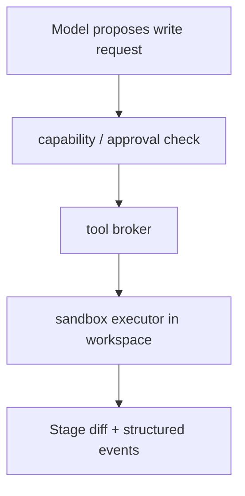

**Version:** 0.3 (preprint)
**Date:** 2026-08-14
**Type:** Position paper, based on the author's experience driving AI infrastructure and pilots in a real engineering organization, combined with a synthesis of public materials.

## Abstract

When a team introduces AI, the most common approach is to plug it in as a tool: choose a model, install an agent, connect a knowledge base, ship an editor. This approach assumes three questions have already been answered—what AI is allowed to touch, who is accountable for the results, and what counts as success. But in a real engineering organization, these are precisely the three questions that must be answered before AI turns from a "personal toy" into a "shared capability."

This paper is a position paper. Its material comes from the author's observations while driving AI infrastructure, knowledge bases, and "super-individual" pilots in a real engineering organization, rather than from new model experiments or performance data. It proposes that, before AI capability is brought into an engineering organization, four kinds of boundaries must first be defined—**context boundary** (where knowledge comes from, who maintains it, and when it expires), **responsibility boundary** (whose capability AI amplifies and who remains accountable for judgment), **authorization boundary** (actions of different risk require different gates), and **measurement boundary** (value is measured by verified outcomes, not by invocation volume). It then enters through small-scale, falsifiable pilots and turns the boundaries into a testable system (illustrated here with the author's minimal coding-agent harness).

This paper does not claim that this set of boundaries has already produced widespread gains. It only offers a set of questions to "think through before putting them into an organization," and shifts the discussion from "which agent is stronger" to "have we defined the boundaries well."

**Main contributions.** The contribution of this paper lies not in proposing new models or data, but in providing four kinds of actionable organizational boundaries, each paired with a checkable judgment:

1. **Context boundary**: Knowledge must be able to answer six questions—"applicable tasks, maintainer, update, expiration, access, and precedence in conflicts." Minimal necessary context is both a security principle and a quality principle.
2. **Responsibility boundary**: Cross-domain delivery expands scope, not responsibility; key judgments about data models, security, performance, availability, and so on must still be concluded by an accountable role.
3. **Authorization boundary**: Actions are divided by risk into four levels—suggestion / draft / restricted execution / high-impact execution—each with minimum controls, rather than a single uniform "human-in-the-loop" rule.
4. **Measurement boundary**: Metrics are separated into three categories—task outcomes, engineering quality, and organizational cost; invocation volume and generation volume serve only as diagnostic signals.

In addition, this paper provides a falsifiable pilot protocol and turns the boundaries into a minimal coding-agent harness with contract tests, as a demonstration that "boundaries can become a system."

**Keywords:** AI-assisted software engineering; engineering organization; context; responsibility; authorization; measurement; pilot

## 1. The Problem: Bringing AI into the Organization Stalls on "Which Boundaries to Define First"

When individual developers use AI to write summaries, drafts, and local investigations, the experience feels a lot like "plug in a tool and get stronger." This experience is easily mis-extrapolated: roll the same set of tools out to the whole team and efficiency will rise linearly.

But real engineering work depends on shared codebases, business rules, release constraints, professional review, and collaboration commitments. If these conditions do not change, localized generation speed merely pushes the problems downstream: reviews get more tiring, integration gets messier, troubleshooting gets harder, and maintenance gets more expensive. Worse, if AI is connected to a knowledge base and toolchain but no one defines what it can trust, what it can change, and who should verify it, then what it amplifies is the speed of existing processes—and also the chaos of existing processes.

Public research supports the same judgment: model capability cannot be discussed in isolation from its interface, context, and execution environment—SWE-agent emphasizes how the Agent-Computer Interface changes usable capability [1], and SWE-bench advances the task from "generating code" to "completing changes under real repository constraints" [2]. Therefore, the difficulty for an engineering organization lies not in the model, but in making these things bounded, accountable, and verifiable.

The question of this paper is not "Can AI help us write code?" but rather: **Before bringing AI into an engineering organization, which boundaries should we define first?** Below, based on the author's experience driving this work in a real team, we give four kinds of boundaries and one way to put them into practice.

## 2. Framework Background: The Relationship Between the Three-Layer Structure and the Four Boundaries

Before unfolding the four boundaries, let us first explain the organizational structure they rest on. When driving AI construction in the team, the author divided the investment into three layers: **AI infrastructure, technical capability, and agent automation**. It is not a maturity ladder, nor does it require strictly sequential construction; it describes three investments of different natures. Mixing the three into "one AI platform" often causes ownership, budget, data boundaries, and outcome evaluation to lose focus at the same time.

| Layer | Question to answer | Typical content | Primary owner | Common misconception |
| --- | --- | --- | --- | --- |
| AI infrastructure | How can agents work safely, reusably, and observably? | Model integration, tool protocols, sandboxed execution, identity and permissions, logging and evaluation | Platform / infrastructure team | Treating "heavy platform usage" as "high value" |
| Technical capability | Why can the team and the agent understand work in this domain? | Domain knowledge base, architectural constraints, interface contracts, business rules, runbooks | Domain owner | Treating "connecting all documents" as knowledge governance |
| Agent automation | How do humans and agents jointly complete and verify delivery? | Task breakdown, review, testing, release, rollback, retrospective | Delivery team and a named owner | Using automation to skip decisions and review |

**The three layers are a board; the four boundaries are the definitions to be made.** The three layers indicate where money, people, and responsibility should be invested; but whether each layer can become organizational capability depends on certain boundaries that must be defined clearly in advance. The four boundaries in Sections 3–6 fall in different places across the three layers: the context boundary falls in "technical capability" (where domain context comes from and who maintains it); the responsibility boundary and the authorization boundary fall mainly in "agent automation" (who drives the work and who can approve); the measurement boundary spans all three layers (what counts as success). To sum it up in one sentence: **the three layers allocate resources, and the four boundaries allocate trust.**

One lesson from the author's work in the team is that technical capability (especially domain context) is currently the biggest bottleneck—business rules live in people's heads, architectural decisions lie buried in documents, and lessons learned are scattered across code reviews. As a result, AI lacks business context and its output quality is constrained. Filling in the knowledge layer first is more effective than adding automation first. This is also why the context boundary is placed first below.

## 3. Boundary One: Context Boundary—Knowledge Has a Source, an Owner, and an Expiry

The most commonly underestimated thing in an organization is that "AI has no context." Feeding a codebase to a model is easy, but feeding it "why this is done this way, which constraints must not be touched, and whether this rule is still valid now" is hard. What first limits the quality of AI output is often not the model, but the absence of this layer.

**Definition of the context boundary.** Any knowledge that AI is to treat as a basis for judgment must at least be able to answer six questions: What task does it apply to? Who maintains it? When is it updated? When does it expire? Who may access it? What takes precedence when it conflicts with code, monitoring, or other material? "Knowledge" that cannot answer these, when plugged into a retrieval system, only makes the model cite outdated or wrong information more fluently.

Three things worth doing based on experience:

1. **Distinguish three kinds of information.** General engineering standards, domain rules, and the situational information of a single task differ in update frequency, permissions, and authority, and should not be mixed in one pool.
2. **Attach an owner and a change loop to critical knowledge.** When knowledge expires, at least let AI know it has expired, rather than letting it cite it confidently.
3. **Do not widen permissions just because "the model needs more context."** Minimal necessary context is both a security principle and a quality principle—the more irrelevant, expired, and conflicting material there is, the less likely a decision improves.

Retrieval research emphasizes the decisive role of "sufficient context" in outcomes [7]; meanwhile, the MCP 2026-07-28 specification moves session state out of the protocol core and lets the client rebuild context each time [3], which turns "who assembles context" into an application-layer decision—confirming the judgment above: context management is an organizational problem, not just a retrieval problem.

## 4. Boundary Two: Responsibility Boundary—AI Expands Delivery Scope, but Professional Responsibility Does Not Transfer

AI's biggest organizational dividend is that it lets one person cross ordinary capability boundaries. In the author's team's practice, engineers with AI assistance independently closed out routine requirements that would otherwise have crossed roles, and even led cross-domain projects—this really happened and brought efficiency. There is a premise here that many people overlook: **cross-domain delivery expands scope, not responsibility.**

**Definition of the responsibility boundary.** Three things must be made explicit: Who may drive routine implementation? Which key judgments must be made by an accountable person? Which operations must go through review or approval? Trade-offs involving data models, security, performance, availability, and user experience cannot automatically stand just because "the AI-generated code passed its tests"—because a patch that passes tests can still differ from human-written code in maintainability, edge-case handling, and long-term cost [5]. AI lets an engineer move faster, but moving faster does not mean all decisions should be made by the same person.

Worth noting from experience: at the pilot stage, what matters most is not "who is fastest," but "whether someone still bears responsibility on the critical path." The author's response is pilots first, no coercion, and tiering by capability, while keeping two-person review on the critical path—using mechanism to ensure that "AI amplifies capability" does not turn into "risk with no one accountable."

Large-scale surveys support this judgment too: DORA 2025 describes AI as an amplifier of existing processes, and adoption is not the same as effective use [4]—if boundaries are not well defined, what gets amplified is chaos.

## 5. Boundary Three: Authorization Boundary—Actions of Different Risk Need Different Gates

AI's influence jumps with the actions it can perform. Giving you a suggestion, versus being able to directly modify files, run commands, and ship releases, are two completely different systems. A wrong suggestion can be ignored; a wrong draft can be corrected by a human; a wrong restricted execution may have a bounded scope as a safety net; but a wrong production operation is irreversible. If all actions use the same "human-in-the-loop" rule, either all operations get blocked indiscriminately, or high-risk operations get let through indiscriminately.

**Definition of the authorization boundary.** Classify automation by risk, each with minimum controls:

| Automation level | Examples | Minimum controls |
| --- | --- | --- |
| Suggestion | Summaries, troubleshooting directions | Show evidence and uncertainty; easily ignorable or correctable |
| Draft | Documents, tests, code patches | Human review and automated checks; keep a change record |
| Restricted execution | Sandboxed commands, preview artifacts | Least privilege, scope limits, cancellable, logged |
| High-impact execution | Releases, outbound sends, production data changes | Explicit authorization, mandatory confirmation, audit, rollback-able |

Tool-connection protocols (such as MCP) allow capabilities to be composed, but they do not decide who is authorized to call what [3]—authorization remains something the organization must define itself.

Worth noting from experience: "AI writes the first draft, humans review" is not a slogan—it must be turned into mandatory code review, automated tests as a safety net, staged releases, and canary strategies. The author's team designs for quality risk as the top risk, rather than patching it up after launch.

## 6. Boundary Four: Measurement Boundary—Measure Value by Verified Outcomes, Not Invocation Volume

Invocation volume, suggestion acceptance rate, and lines of generated code all describe activity, not value. They may even rise in lockstep with rework and review burden—the more AI produces, the more tired human reviewers get, the better the metrics look, and the slower the organization becomes.

**Definition of the measurement boundary.** Separate metrics into three categories and look at each on its own:

- **Task outcomes**: completion or not, timeliness.
- **Engineering quality**: tests, defects, maintainability, recoverability.
- **Organizational cost**: review burden, cognitive load, training, operational cost.

Any single usage metric can only serve as a diagnostic signal, not a conclusion of success. The author's team's practice is to list "the outcomes the organization actually wants" separately from "the process signals used for diagnosis," so as to avoid mistaking "used a lot" for "done well." Open benchmarks in 2026 have begun reporting cost alongside resolution rate [6], and maintainability research separates "passing tests" from "long-term maintainability" [5]—both support "look at outcomes, not activity volume."

## 7. How to Put It into Practice: Start with Small-Scale Pilots, Record Counterevidence, Then Decide to Scale or Stop

Organization-level AI construction should start from falsifiable hypotheses, not from full-scale rollout. A pilot protocol suited to one well-defined task:

1. **Define the task and the counterfactual.** Write down the current approach, the quality baseline, the constraints, and what failure would harm; choose comparable historical or parallel samples as controls.
2. **Bound the capability.** List the context, tools, environment, write scope, and human gates the model may access; by default, deny capabilities not on the list.
3. **Define completion and stop conditions.** It must pass existing tests and review; if a certain kind of failure keeps recurring, review cancels out the savings, or permission overreach occurs, pause expansion.
4. **Record process evidence.** Beyond outcomes, record human intervention points, tool failures, missing context, rollbacks, and error types.
5. **A three-way decision.** Scale, modify, or stop. A pilot without evidence should not automatically become a long-term platform commitment just because the demo looked good.

The three-layer structure shows up here as a dependency: AI infrastructure is the foundation, technical capability (domain context) determines the ceiling of output quality, and agent automation requires the first two to be mature—so pilots should first shore up the weakest layer, not just add automation on top. The value of the pilot protocol is not to prove once and for all that "AI is useful," but to identify: on which tasks, under what context and permissions, and at what cost, AI can reliably produce net gains.

## 8. Turning Boundaries into a System: A Minimal Harness

If boundaries are not turned into a system, they remain mere wishes. The author implemented the "common capability" part of the boundaries above (authorization tiers, restricted execution, audit and recovery) as a minimal coding-agent harness: the model may propose actions, but permissions, real side effects, and runtime state are controlled by the system boundary.

The key design is: **writes do not land directly on disk**—they first produce a staged diff that is applied only after human approval; every call leaves an append-only event trail that can be re-examined and recovered. It does not claim to be a complete platform, only to demonstrate that boundaries such as "authorization, audit, recovery" can be put into practice with contract tests—unauthorized writes are rejected, nothing executes before approval, and paths cannot escape the workspace. [8]

For an organization, its significance is not this one tool, but this: **common capability can first be built as a testable vertical slice and then extended, rather than committing up front to a full-featured platform.** Going from "boundaries" to "system boundaries" is the last layer this paper wants to emphasize.

## 9. Threats to Validity and Research Boundaries

First, this paper's conclusions are based on the author's experience driving this work in a real engineering organization and on a synthesis of public materials; they do not represent the internal practice of any company, team, or product, nor do they claim that this set of boundaries has already produced widespread gains—whether it is effective must be verified or falsified in a specific team using the pilot protocol (Section 7). Second, the public studies cited are all used as mechanistic evidence; specific numbers and effects should be checked against the original sources, and benchmarks and large-scale surveys in particular must not be extrapolated into the outcomes of an individual organization. Third, this paper derives organizational recommendations from "experience + public materials"; the derivation itself is a position rather than data, and needs task data, code-review records, interviews, and security audits to strengthen it. Fourth, models, agent frameworks, and protocols change quickly; the description of the MCP specification here only represents materials accessible as of 2026-08-14.

It is a set of questions to "think through before putting them into an organization," not a platform blueprint and not a procurement ranking. The final question left to the reader is not "which agent is stronger," but: **Is the context trustworthy and authorized for use? Are actions appropriately authorized? Are outcomes genuinely verified? Can failures be located and recovered from?**

## References

1. Yang, J. et al. (2024). [SWE-agent: Agent-Computer Interfaces Enable Automated Software Engineering](https://arxiv.org/abs/2405.15793). NeurIPS 2024.
2. Jimenez, C. E. et al. (2024). [SWE-bench: Can Language Models Resolve Real-World GitHub Issues?](https://arxiv.org/abs/2310.06770). ICLR 2024.
3. Model Context Protocol. [Specification 2026-07-28](https://modelcontextprotocol.io/specification/2026-07-28/). This version changes the protocol core to be stateless.
4. DORA (2025). [The Impact of Generative AI in Software Development](https://dora.dev/ai/gen-ai-report/report/). Large-scale survey; this paper borrows only its conclusion structure, not unverified numbers.
5. [Is Agent Code Less Maintainable Than Human Code?](https://arxiv.org/abs/2606.21804) (2026). Mechanistic evidence used to show that "passing tests" is not the same as "long-term maintainability."
6. [vexp-swe-bench: Open benchmark for AI coding agents](https://github.com/Vexp-ai/vexp-swe-bench) (2026). An open benchmark that reports resolution rate, cost, and unique wins side by side.
7. Google Research (2025). [Deeper insights into retrieval augmented generation: The role of sufficient context](https://research.google/blog/deeper-insights-into-retrieval-augmented-generation-the-role-of-sufficient-context/).
8. Liyuk (2026). [Coding Agent Harness Study](https://github.com/Liyuk/claude-code-harness-study). The author's minimal implementation: capability/approval, sandboxed execution, staged diff, append-only event trail.

## Author Information and Declaration

**Author:** Liyuk

**Conflict of interest:** The author declares no conflict of interest. This research received no funding from any commercial organization; the public projects, industry reports, and coverage cited are used only as methodological or directional references.

**Data availability:** This is a position paper and does not report new experimental data from the author's team or organizational performance data. The public research, open benchmarks (SWE-bench, vexp-swe-bench), and large-scale surveys (DORA 2025) cited are used as mechanistic evidence; specific numbers and effects should be checked against the original sources. The author's minimal coding-agent harness implementation can be found at [Coding Agent Harness Study](https://github.com/Liyuk/claude-code-harness-study); its capability/approval, sandboxed execution, and event trail serve as a reproducible reference.

## Glossary

| Term | Definition |
| --- | --- |
| Context boundary | Knowledge must be able to answer six questions—"applicable tasks, maintainer, update, expiration, access, and precedence in conflicts." |
| Responsibility boundary | AI expands delivery scope, but key judgments about data models, security, performance, availability, and so on must still be concluded by an accountable role. |
| Authorization boundary | Actions are divided by risk into four levels—suggestion/draft/restricted execution/high-impact execution—each with minimum controls. |
| Measurement boundary | Metrics are separated into three categories—task outcomes, engineering quality, and organizational cost; invocation volume and generation volume serve only as diagnostic signals. |
| Minimal necessary context | Provide only trustworthy context relevant to the current task; both a security principle and a quality principle. |
| Pilot protocol | Small-scale, falsifiable, records counterevidence, then decides to scale/modify/stop. |
| harness | A minimal implementation that turns authorization, sandboxed execution, staged diff, and event trail into a testable system. |
