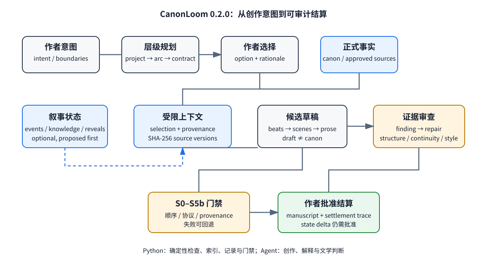
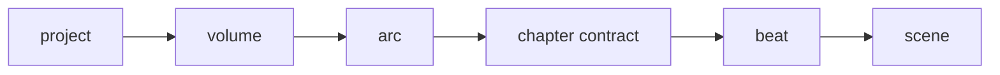
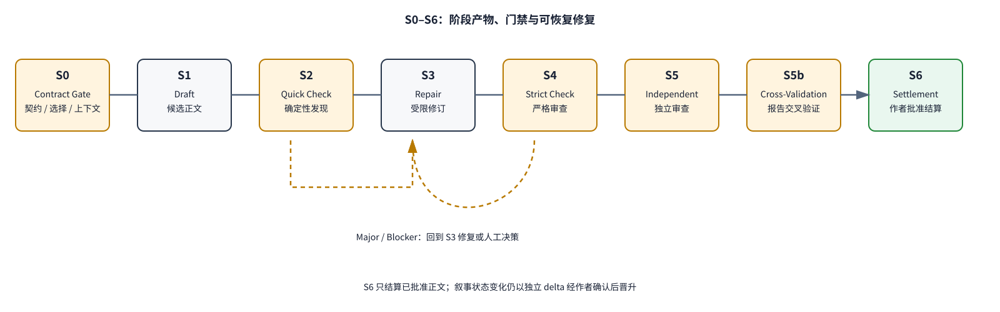
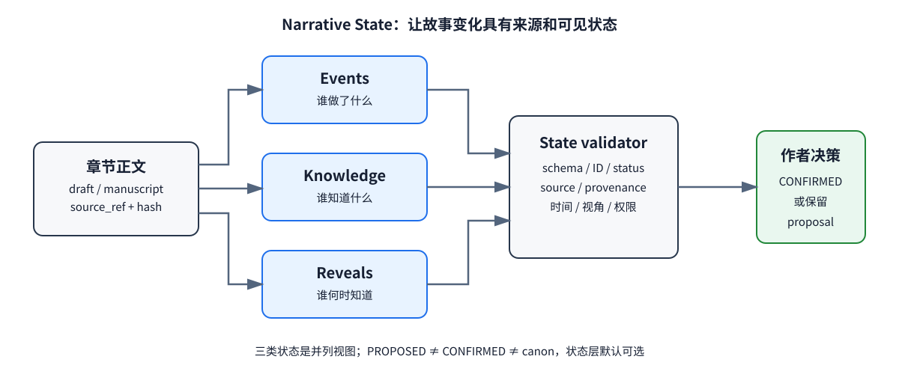
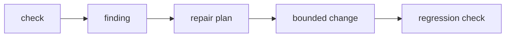

**Version:** CanonLoom 0.2.0 final

**Date:** 2026-08-03

**Document nature:** A system design paper; this paper reports engineering validation and proposes a controlled quality-evaluation scheme that has not yet been implemented.

**Research boundary:** This paper does not claim that CanonLoom's generation quality is already superior to other architectures; no data that was not actually collected is presented as numerical results.

## Abstract

Human-AI collaboration on long-form fiction is not simply a matter of handing ever-larger contexts to ever-larger language models. As a story spans more chapters, the system must simultaneously maintain author intent, hierarchical plans, chapter causality, character goals, local point of view, the order in which readers learn things, and candidate facts that the author has not yet confirmed. If this state is hidden inside one or more rounds of agent conversation, the generation process is usually hard to recover, review findings are hard to locate, and model suggestions can become canonical story facts without any explicit authorization.

This paper presents CanonLoom 0.2.0, a file-protocol-driven architecture for human-AI collaboration on long-form fiction. CanonLoom models writing as explicit state transitions: author intent is compiled, through hierarchical planning and chapter contracts, into bounded evidence contexts; generators produce candidate prose; structural, continuity, style, and reader-commitment reviewers produce evidence-backed Findings; the author approves, rejects, or defers at stage gates; and finally the prose and the state changes are settled separately. The system uses an S0–S6 stage protocol, a separation between candidate and canonical states, SHA-256 source fingerprints, review provenance, an optional narrative state layer, and a "single primary model + deterministic Python tools" default runtime strategy.

The contribution of this paper is not a new language model, nor a claim that automatic generation quality already exceeds other architectures. We first give a recoverable, auditable, cross-agent model for long-form narrative production; second, we define the boundaries among chapter contracts, Beats, context packages, review reports, and state settlement; third, we give a complete evaluation scheme covering consistency, causal changes, character agency, knowledge leakage, reveal control, tokens, latency, retries, and author burden; and finally, we report the engineering validation results of the current version and explicitly leave the comparison of literary quality to later controlled experiments. The goal of this work is to provide fiction authors with a workflow drivable by a small set of short commands, and to provide agent-systems research with a production protocol that can be replayed and recovered.

**Keywords:** long-form fiction generation; human-AI collaboration; agent workflow; narrative state; auditability; context compilation; consistency; author control

## 1. Introduction

"Writing a chapter of fiction" looks like a single text-generation task, but in long-form creation it is closer to an ongoing state-management problem. An author must first form an idea, then break it down into characters, conflicts, world rules, volume-level goals, chapter-level changes, and scene beats; during writing they must also control point of view, information asymmetry, foreshadowing, pacing, and language style; once a chapter is finished, the previous chapter's result becomes the constraint on the next. An implicit change at any one layer may surface several chapters later as a timeline conflict, motivation drift, or premature reveal.

Existing LLM-based writing practices often compress the task into "prompt + historical text + generation." This approach has a low startup cost but conflates several things of different natures: author ideas with model proposals, plans with what actually happened in the story, review comments with story facts, and temporary context with long-term memory. When the author or an agent needs to rerun a stage, the system can hardly answer these questions: What materials does this passage rely on? Which version of the chapter contract constrained it? Is a fact author-confirmed, or did the model just guess it? Has a review issue been fixed? If so, did the fix introduce new state changes?

CanonLoom 0.2.0 shifts from a "writing interface" to a "production protocol." It does not try to turn the author into an operator of a complex GUI, nor does it by default split the task among multiple models that share implicit context. The author only needs a small number of entry points, such as initialize the project, start an idea, start work, continue work, check, and settle; the system keeps the complexity in files, stage artifacts, and a readable trace. Agents can read from and write to the project through the same file protocol, so Codex, Claude, or any other agent that can access files and execute commands can participate, and the core state does not depend on any particular chat product.

This paper addresses four questions:

1. How can long-form narrative production be represented as recoverable, auditable state transitions?
2. How do chapter contracts, Beats, bounded contexts, and the S0–S6 gates jointly limit unauthorized state changes?
3. Under what conditions is a narrative state layer worth introducing, and how does it affect context cost and consistency?
4. How can we design reliable evaluation that does not mistake mechanical scores for literary value?

## 2. Background and Problem Definition

### 2.1 State in Long-Form Fiction

CanonLoom divides a work's runtime state into five categories:

* **Author intent:** genre, target audience, tone, boundaries, degree of automation, and non-negotiable creative principles.
* **Canon (confirmed facts):** characters, world rules, timelines, events, and relationships that the author has confirmed.
* **Plan state:** goals and constraints for volumes, arcs, chapters, and Beats.
* **Candidate state:** plot, facts, or revisions proposed by the model but not yet approved by the author.
* **Narrative runtime state:** whether events have happened, who knows which facts, and which reveals and foreshadowings are still open.

The key point is that candidate state and canonical facts cannot share the same container. Model output does not automatically gain canon authority just because it is written confidently; a review Finding does not become more than a pending suggestion even if it points out "this is how it should be." State enters canonical settlement only after the author explicitly approves it.

### 2.2 Four Common Failure Classes

**Context failure.** Stuffing the entire work into a prompt raises cost and brings material irrelevant to the current task into generation. Over-compression, on the other hand, can lose decisive evidence.

**State failure.** Character goals, resources, scope of knowledge, temporal position, and world rules drift across chapters. The model may remember a name yet forget that the name is not visible from the current point of view.

**Decision failure.** Model-proposed options, temporary choices made by agents, and author-approved decisions are not layered, so a "suggestion" gets treated as a "fact" in later contexts.

**Evaluation failure.** A reviewer gives an overall score but does not point out which sentence violates which constraint, nor turn the problem into a revisitable revision task. The generator may therefore repeat the same mistake, or break global state in order to fix a local problem.

### 2.3 Formal Description

Let the project state be $S_t$, the author's explicit decision at stage $t$ be $A_t$, the bounded context for the current task be $C_t$, the generation result be $D_t$, and the review result be $R_t$. CanonLoom does not allow generation results to overwrite canonical state directly; instead it requires:

$$
S_{t+1}=\operatorname{settle}(S_t, A_t, D_t, R_t)
$$

where `settle` may produce a canonical state change only after passing the gate and only in the presence of author approval. Candidate results can be saved, compared, and revised, but they cannot become $S_{t+1}$ directly through an ordinary generation action.

Context is not the entire history but a selection function with source annotation:

$$
C_t = f(I, K, P_t, N_t, X_t, Q_t)
$$

Here $I$ is intent, $K$ is the canon, $P_t$ is the current plan, $N_t$ is the narrative state, $X_t$ is workflow artifacts, and $Q_t$ is the current task and its permissions. The function's output must record included items, excluded items, selection reasons, and source hashes.

## 3. Design Goals and Non-Goals

### 3.1 Design Goals

CanonLoom has six goals of equal priority that also balance one another:

1. **Recoverable:** after an interruption, continue from the last valid artifact rather than re-depending on chat history.
2. **Auditable:** every candidate prose, review Finding, and state change carries source, version, and time information.
3. **Author-controlled:** the author holds final authority over canonical facts and state promotion.
4. **Cross-agent:** the core protocol consists of Markdown, JSON, JSONL, and ordinary directories, independent of any particular client.
5. **Low coupling:** deterministic checks are separated from language-model generation, with a single primary model plus Python tools as the default.
6. **Progressive enhancement:** start with the lightest plans and chapter contracts; enable narrative state, deep review, and adapters only when needed.

### 3.2 Non-Goals

CanonLoom is not a GUI novel editor, not an automatic publishing platform, not a new foundation model, and it does not promise to produce publishable work without human review. It does not treat "more agents," "a bigger graph database," or "higher automation" as necessarily improvements. Nor does the paper interpret fewer tokens, longer text, or a particular language model's preference score directly as literary quality.

## 4. Related Work and Design Position

Research on long story generation has repeatedly pointed out that a single prompt cannot reliably sustain long-range structure. DOC combines detailed outlines with generation control to maintain longer-range plot coherence [1]; StoryWriter separates outline, planning, and writing, and discusses history compression [4]; DOME focuses on dynamic hierarchical outlines, memory enhancement, and temporal conflict analysis [3]; STORYTELLER uses structured plot nodes and narrative entity knowledge representations [6]. Work on suspense emphasizes the iterative maintenance of reader questions, foreshadowing, and reveals [2]; work on story evaluation suggests that causal plausibility, character intent, dramatic conflict, and reader engagement cannot be replaced by any single surface metric [8, 9].

Another line of research introduces knowledge graphs, world models, or multi-agent critics to improve long-term memory and multi-dimensional evaluation. Collective Critics shows that different critical perspectives help surface problems of creativity, coherence, and reader experience [7]; recent directions such as Narrative World Model and MAGNET/ATLAS further emphasize narrative time, character knowledge, and world state [10, 11]; the combination of knowledge graphs with literary theory offers another structural means for maintaining consistency in long stories [5]; SuperWriter-Agent and Lost in Stories respectively point to the value of explicit planning, reflection, and long-story consistency diagnosis [12, 13]. These directions, however, also bring problems of state synchronization, retrieval explainability, and runtime cost. CanonLoom's choice is to first project the core concepts of these directions into a lightweight file protocol, and then keep databases, complex multi-agent setups, and automatic scoring as optional backends or future experimental variables.

Community projects offer a wealth of reusable practices: autonovel demonstrates an iterative pipeline from seed to finished book; creative-writing-skills, story-skills, and novel-creator-skill demonstrate agent skills, style files, continuity review, and gates; book-os emphasizes the layering of standards, novel state, and manuscript; authorclaw, inkos, and NovelWriter respectively demonstrate task logs, temporal memory, and batch review with multi-model backends. CanonLoom absorbs the parts of these practices that are easiest to inspect and roll back, while keeping a no-GUI, single-model-first, file-protocol core.

CanonLoom's position, therefore, is not to claim that it "writes better than all competitors," but to make explicit the state transitions and author-approval points that long-form writing usually leaves implicit. Related work provides component inspiration; this paper tries to give an operable composition boundary.

Paper and project links are given in the references at the end of this paper.

## 5. CanonLoom 0.2.0 System Architecture

Figure 1 shows the main data flow from author intent to the canonical manuscript. Solid lines are the production path; dashed lines are proposals or pending-approval changes.



**Figure 1.** CanonLoom layers intent, plan, state, context, candidate prose, review, and settlement. Review results and state changes cannot bypass the author-approval point.

### 5.1 Directories and Protocol

A project's core directory can be simplified to:

```text
intent/                 author intent, boundaries, style, and automation preferences
canon/                  confirmed characters, rules, timelines, and sources
plan/                   volumes, arcs, chapter contracts, Beats, and open questions
workspace/              current context packages, task packages, and intermediate artifacts
drafts/                 candidate prose and revision versions
reviews/                structure, continuity, style, and reader-commitment reviews
memory/narrative-state/ events, knowledge state, and reveal records (optional)
manuscript/             prose settled after author approval
traces/                 run manifests, provenance, handoff, and settlement traces
```

Markdown suits author reading and editing; JSON suits schema validation and tool reading; JSONL suits append-only events and state records; hashes and manifests are used to reproduce contexts. Directory names themselves are not implicit permissions; the real write boundaries are defined jointly by the stage protocol and command constraints.

### 5.2 Hierarchical Planning

The plan narrows layer by layer, from project, volume, arc, and chapter contract down to Beat:



High-level plans set direction and long-term commitments; chapter contracts specify the changes that must or must not happen in this chapter; Beats break the causal skeleton into generatable units; scenes preserve creative freedom at the level of language and action. Lower-level artifacts may propose deviations, but they cannot silently override higher-level constraints.

### 5.3 A Chapter Contract Is Not a Summary

A chapter contract should describe at least:

* the chapter's task and preconditions;
* the changes that must happen and the changes that are forbidden;
* the participating characters, actions, conflict, and exit of each Beat;
* causal changes: what condition leads to what result;
* character agency: who makes an irreplaceable choice;
* reader effect: the questions, tension, or emotional change that should arise;
* reveal updates: which information may be revealed, and which must stay hidden;
* the chapter's exit state: facts and open questions that the next chapter can inherit.

This makes the chapter contract simultaneously a generation input, a review benchmark, and an experiment record. It does not require the prose to restate the plan sentence by sentence, but it does require the prose to explain, from evidence, "whether the planned change actually happened."

### 5.4 Context Compilation

The context compiler builds a bounded context package from the materials the current task requires. The package records:

```json
{
  "task": "chapter-draft",
  "included": [{"path": "...", "sha256": "...", "reason": "..."}],
  "excluded": [{"path": "...", "reason": "out_of_scope"}],
  "authority": ["approved-canon", "selected-contract"],
  "narrative_state": "optional-state-snapshot"
}
```

"Being included" does not mean "being believed by the model," but rather that the input boundary is checkable; "being excluded" is not data deletion, but rather that this task should not read it. The system can evolve step by step from full-text context to directory retrieval, state queries, and prioritizing high-risk entries, but every upgrade should preserve the package's explainability.

### 5.5 Module Responsibilities and Permission Boundaries

CanonLoom can be divided into four layers by responsibility:

**Table 2.** CanonLoom's module responsibilities and permission boundaries.

| Layer | Main responsibility | What it can do | What it cannot do |
|---|---|---|---|
| Author & intent layer | Express creative goals, boundaries, and approvals | Confirm configuration, choose options, approve settlement and state promotion | Need not manually maintain all internal traces |
| Agent generation & judgment layer | Ideation, planning, prose, repair, and literary review | Read authorized context, propose candidates, produce Findings and repair plans | Cannot write candidates directly into canon or bypass S6 |
| Python protocol & validation layer | Schema, paths, hashes, indexes, stage transitions, and reports | Check structure, record provenance, block illegal transitions | Does not judge literary quality for the author, does not auto-approve facts |
| File state layer | Store intent, canon, plan, draft, review, state, and trace | Provide a readable, recoverable, portable carrier of facts | Does not treat any text in the directory as automatically canonical fact |

This layering embodies "AI decoupling," not "de-AI-ing." Agents still do a great deal of creative and interpretive work, but AI output is restricted to candidates, evidence, and suggestions; the project's canonical state, stage transitions, and approval records are controlled jointly by the file protocol, deterministic tools, and author decisions. This preserves the language model's creativity while avoiding a single model acting simultaneously as author, fact source, reviewer, and approver.

In terms of data flow, the system contains three distinct directions: the generation flow produces candidate prose from intent and context, the validation flow produces structured Findings from candidate prose, and the approval flow produces canonical settlement from author decisions. The three cannot substitute for one another: the validation flow cannot directly change the prose, the generation flow cannot directly change canon, and the settlement flow cannot reinvent content. This directional constraint is the core of the architecture's reliability.

## 6. The S0–S6 Strong-Constraint Production Protocol

Figure 2 shows the production stages and failure fallback actually implemented by the project. Preparation actions such as Beat generation and context compilation belong to S0's input preparation and do not occupy a separate stage number; each formal stage has its own input, output, and write boundary. On failure, return to the nearest valid artifact; do not overwrite evidence by regenerating.



**Figure 2.** S0–S5b handle preparation, generation, and evidence review; S6 handles settlement after author approval. Repair preferentially returns to the current stage or the nearest valid boundary.

**Table 1.** S0–S6 stage protocol, artifacts, and failure boundaries.

| Stage | Purpose | Main artifacts | Failure handling |
|---|---|---|---|
| S0 | Freeze and validate the chapter contract, selection, and context package | contract, selection, context package | Return to planning or ask the author to supply constraints; do not generate prose |
| S1 | Generate a candidate chapter from the passed contract and context | draft candidate, generation trace | Keep the failed version and rerun the same contract |
| S2 | Run deterministic quick checks | quick findings | Do not rewrite prose directly; route problems to S3 |
| S3 | Produce a bounded revision from Findings and evidence | revised draft, repair report | Must not introduce new canon through repair |
| S4 | Run strict structural and continuity checks | strict review | BLOCKER/MAJOR must be fixed or escalated to a human decision |
| S5 | Run an independent review perspective | independent review | Produce an independent report; do not reuse S4's review id/run |
| S5b | Cross-validate the two isolated reports | cross-validation report | Keep disagreements and hand them to a human decision |
| S6 | Author approves and settles prose and proposal state | manuscript, settlement trace | Approve, revise, defer, or reject |

### 6.1 What "Strong Constraint" Means

Strong constraint does not mean the model cannot write new details beyond the plan; it means new details must keep candidate status until the author decides whether they change canonical state. What the system enforces is boundaries: output formats, required fields, source existence, review evidence, state versions, approval records, and settlement targets. Novelty at the literary level remains an area for which the generator and the author are jointly responsible.

### 6.2 The Repair Loop

When review finds a problem, the system does not treat "rewrite it" as its only action. Instead it produces a repair task containing the following:

* the Finding's unique ID and severity level;
* the contract field or state constraint that was violated;
* the original-text evidence and its source;
* the allowed scope of repair;
* the existing changes that must not be broken;
* the Findings that must be re-validated after repair.

Repair can be executed by an agent, but the repair result is still candidate prose. If the problem comes from configuration, context, or the chapter contract, the system should fall back to the corresponding upstream stage rather than continuing to pile text onto a wrong input.

## 7. The Narrative State Layer

Figure 3 describes the minimal model of narrative state. CanonLoom does not treat the state layer as a default-required graph database, but as an optional layer that can be enabled as a work's complexity grows.



**Figure 3.** Event, knowledge, and reveal state respectively record "what happened," "who knows what," and "when to let whom know what"; validators only raise questions, and the author decides whether to promote.

### 7.1 Events

Events record actions that occurred and their effects, with typical fields including subject, action, object, temporal position, participating entities, source, and status. An event can be planned, proposed, confirmed, or rejected, but `proposed` does not mean it happened.

### 7.2 Knowledge State

Knowledge state records the facts accessible to a character, the reader, the narrator, or another entity at a given point in time. It prevents a viewpoint character from using information they have not yet obtained, and also helps the context compiler select material compatible with the current viewpoint.

### 7.3 Reveals and Foreshadowing

Reveals record stages such as setup, promise, reveal, and payoff. They do not decide for the author "how long the suspense should last"; instead they make delayed reveals a visible object, so a chapter review can point out that a secret was exposed too early or that a long-term promise has lost track.

### 7.4 Adoption Modes

The state layer supports three ways of use:

* **disabled:** use only chapter contracts, canon, and review reports; suited to lightweight tasks.
* **optional:** enable for high-risk chapters or when continuity problems appear.
* **required:** for projects with complex timelines, multi-viewpoint information asymmetries, or dense foreshadowing, state validation becomes part of the gate.

Even after an agent identifies state entries, they should still be marked `PROPOSED`; they enter `CONFIRMED` only upon author confirmation. Prose settlement and state promotion are two related but independent decisions, which avoids the author approving only the text while inadvertently approving all the facts the model inferred.

## 8. Runtime Strategy and Cross-Agent Use

### 8.1 Default Runtime: Single Primary Model + Python

CanonLoom recommends one primary model to take on planning, generation, and most review roles, with Python handling file scanning, schema checks, hashing, stage state, indexing, reporting, and command orchestration. A single primary model reduces prompt-style differences, context restatement, and implicit state synchronization across models; different review perspectives can still be labeled tasks of the same model, but they do not thereby gain independent state-write permissions.

Multiple models are not forbidden, but should be treated as isolated variables: each model reads the same frozen context and outputs candidate Findings marked with model and run identifiers, and cannot directly overwrite each other or modify canon. The extra cost is worth bearing only when the single-model baseline is already stable and the experimental question clearly requires a different model.

### 8.2 Codex, Claude, and Other Agents

The project's core interaction is files and commands, not a particular chat product. As long as an agent can:

1. read the project directory and entry files such as `AGENTS.md` and `CLAUDE.md`;
2. execute public commands and read command output;
3. obey artifact paths, formats, and approval boundaries;
4. hand tasks to Python tools when needed;

it can use the same architecture. Different clients may have different entry files, but should not have different sources of truth. When continuing work across clients, the handoff should point to the manifest, the context package, the current stage, the pending Findings, and the most recent author decision.

### 8.3 The Lightest Usage Path

The author does not need to learn every internal schema first. The minimal path is:

```bash
./bin/canonloom init --root ~/my-novel
./bin/canonloom start-idea --root ~/my-novel
./bin/canonloom start-work --root ~/my-novel
./bin/canonloom continue --root ~/my-novel
./bin/canonloom check --root ~/my-novel
./bin/canonloom settle --root ~/my-novel
```

The agent is responsible for turning natural-language input into the corresponding artifacts and giving guidance prompts at every point where a decision is needed. Advanced users can directly operate `status`, `query`, `repair`, `advanced`, and the low-level check commands, but ordinary authors need not touch the internal implementation.

## 9. Implementation Details

### 9.1 Sources and Provenance

Every run generates a manifest recording at least the run ID, stage, time, input paths, source hashes, model identifier, prompt version, output paths, and status. Review Findings must cite an evidence path or text location; if a Finding comes from model judgment, the corresponding run information should be preserved rather than saving only a sourceless natural-language conclusion.

### 9.2 Configuration Priority

Configuration is divided into author configuration, project constraints, and agent run parameters. The priority must be explicitly visible, and the model must not silently modify higher-priority author boundaries through natural-language output. At initialization, the author controls genre, target audience, style, language, automation level, and prohibitions; the agent can identify and propose character relationships, narrative viewpoint, pacing preferences, and potential state structures; proposals require author confirmation before they become project constraints.

### 9.3 Checks and Self-Repair

The system's "self-repair" is not unconditional automatic rewriting. It consists of diagnosis, a repair plan, bounded execution, and regression verification:



Deterministic problems — such as missing fields, bad references, duplicate IDs, hash mismatches, and illegal stage transitions — can be fixed by tools or flagged explicitly. Literary problems — such as insufficient motivation, loose pacing, and unstable tone — can only produce repair suggestions or candidate versions, and go through the same review chain and author approval.

### 9.4 Settlement

S6 produces two kinds of results: author-approved prose enters `manuscript/`; state changes are recorded as a separate settlement trace, proposed delta, or open issue. The current version does not automatically write generator-proposed events into canonical state, nor does it equate prose promotion with the promotion of all state.

## 10. Evaluation Methodology

### 10.1 The Boundary Between Current Engineering Validation and Future Quality Evaluation

What 0.2.0 can currently report is engineering reliability: whether tests pass, whether commands are runnable, whether artifacts conform to the protocol, whether stages are recoverable, and whether the public paths can complete a minimal smoke test. It cannot currently report "leading fiction quality" from this, because formal controlled experiments under identical models, tasks, contexts, and human blind review have not yet been completed.

This boundary matters greatly. A stricter gate may reduce errors, but it may also raise token cost and author waiting time; a shorter context may lower cost, but it may lose literary detail. Quality conclusions must be supported jointly by controlled experiments and human evaluation.

### 10.2 Study Subjects and Baselines

We recommend using fully original, copyright-independent short-long-form task sets. Each task contains an idea, a character sheet, world rules, a summary of preceding chapters, a chapter contract, and hidden validation labels. Fix the model, temperature, maximum output, random seed (if the interface supports it), input materials, and target word count.

We recommend comparing the following conditions:

**Table 3.** Comparison conditions for controlled experiments.

| Condition | Description |
|---|---|
| B0 single prompt | Idea, summary, and writing requirements placed in one prompt, generating the chapter directly |
| B1 outline path | Generate an outline first, then write according to it, with no formal gate |
| B2 structured single path | Chapter contract + Beat + bounded context, but no review loop |
| B3 CanonLoom-lite | Chapter contract, Beat, context package, one review, and simulated author approval |
| B4 CanonLoom-full | S0–S6, review repair, provenance, and the narrative state layer |
| B5 ablation group | Remove chapter contract, state layer, provenance, or repair regression one at a time |

"Competitor comparison" should compare measurable mechanisms and costs under the same protocol, rather than conflating different projects' default models, prompts, editor features, and author experience. Community projects can serve as design references; they should be implemented as strict baselines only when inputs, outputs, and runtime conditions can be fixed.

### 10.3 Metrics

#### Engineering Metrics

* Protocol pass rate: the proportion of runs that complete the required stages with structurally valid artifacts;
* Recovery success rate: the proportion that continue to completion from the nearest valid state after an interruption;
* Illegal-write rate: the number of times canon or manuscript is written without approval;
* Finding traceability rate: the proportion of Findings that can be located to a source and evidence;
* Repair regression rate: the proportion of repairs where the original problem disappears and no new higher-severity problem is introduced;
* Retry count, failed stage, and average recovery time.

#### Narrative Structure Metrics

* Chapter-contract adherence rate: human or semi-automated judgment of required changes, forbidden changes, and exit state;
* Beat coverage rate: whether the prose provides locatable evidence for each Beat;
* Causal consistency: whether events' causes and consequences hold;
* Character agency: whether key outcomes are driven by character choices rather than author convenience;
* The number of timeline conflicts and entity-relationship conflicts;
* Knowledge leakage rate: the proportion of cases where a character uses information they have not obtained;
* Reveal control: the proportion of premature secret reveals, lost promises, and missing payoffs.

#### Experience and Cost Metrics

* Input tokens, output tokens, total tokens;
* Wall-clock time, number of model calls, and number of tool calls;
* The number of gates the author must confirm;
* The number of author-edited characters and editing time;
* Coherence, readability, character credibility, suspense, and overall preference in blind review.

Total cost should be reported as:

$$
Cost = c_{in}T_{in}+c_{out}T_{out}+c_{tool}N_{tool}+c_{human}H
$$

where $T$ is tokens, $N_{tool}$ is the number of tool calls, and $H$ is the author's invested time; different model prices and the value of the author's time should be listed separately, rather than replaced with a single inexplicable total score.

### 10.4 Ablation Experiments

The most critical ablation is not "multi-agent versus single-agent," but removing the architectural constraints one by one:

**Table 4.** CanonLoom key-component ablations and their observed metrics.

| Ablation | What is removed | Main observation |
|---|---|---|
| A1 | No chapter contract, only a summary | Constraint adherence, causal errors, and revision volume |
| A2 | Chapter contract but no Beats | Chapter coverage and scene jumps |
| A3 | Beats but no context package | Input cost, source omissions, and state errors |
| A4 | No narrative state layer | Knowledge leakage, reveal errors, and recovery cost |
| A5 | No review regression | New errors after repair and final human edits |
| A6 | No provenance | Replay success rate and Finding credibility |

If a component only adds cost without improving the target metrics, its default level should be lowered, rather than forcing every author to use it merely because it exists in the architecture diagram.

### 10.5 Statistics and Human Review

The same task should use multiple random runs or multiple independent samples, reporting means, standard deviations, and confidence intervals; use an appropriate count model for error counts, and a mixed-effects model or paired non-parametric test for blind review. Human reviewers should be blind to the system condition and model name, and rate chapter-contract adherence, causality, character agency, information control, and language quality separately. At least two reviewers should jointly annotate a portion of the samples to report agreement.

LLM-as-a-judge can be used for screening and error localization, but it should not be the sole literary-quality metric; its prompt, model, temperature, and scoring rubric must be published with the experimental materials.

## 11. Current-Version Results and Case Analysis

### 11.1 Completed Engineering Validation

In the current repository, 0.2.0 has completed the following engineering-level checks:

* Python unit tests pass, covering core paths such as commands, protocol, configuration priority, state validation, and public surfaces; the current test suite has 18 items;
* Minimal-project smoke test passes, able to generate and check a basic project from the initialization path;
* Public check passes, able to discover user-facing documentation and entry issues;
* CLI default help is separated from advanced command entries, keeping the author path short;
* A chapter workflow in one external test project can pass through S0–S5b and produce state-validation and review artifacts.

These results prove that the protocol runs on the current samples and tools; they do not prove that the generated text is literarily better than B0–B2, nor that it will not drift across all models, genres, and long-form scales. The external test project's prose and specific fiction context are not research data of this project, and readers should not treat them as a public benchmark.

### 11.2 Explaining a Typical Run

In a normal run, the author first confirms the chapter's goals and forbidden changes; the agent prepares Beats and the context package; S0 freezes and validates the contract, selection, and context; S1 produces candidate prose; S2 runs quick checks; S3 repairs according to Findings; S4 runs strict checks; S5 produces an independent review; S5b cross-validates the review reports; finally the author decides which prose enters the manuscript and which state changes remain proposals.

The value of this process is not adding steps that "look professional," but giving errors a location: if S0 fails, check the contract, selection, or context; if S2 finds a problem, enter S3; if S4 or S5b fails, keep the reports and fall back to repair or a human decision; if the author disagrees with a state delta, there is no need to delete the whole text — just reject that delta and keep the prose candidate. This localization ability is the foundation of a long-form collaboration system running continuously.

### 11.3 Anticipated Analyses

Based on the architectural mechanisms, hypotheses can be proposed but not yet announced:

* H1: chapter contracts and Beats will reduce the proportion of chapter exit states inconsistent with the plan;
* H2: the context package will reduce irrelevant input tokens while improving source traceability;
* H3: the narrative state layer will reduce knowledge leakage and reveal-order errors, but increase state-maintenance cost;
* H4: provenance and regression review will improve repair reproducibility, but increase latency and call counts;
* H5: a single-primary-model path may have lower synchronization cost than multi-model shared implicit memory under the same context, but does not imply higher review capability on every dimension.

These hypotheses require the controlled experiments of Section 10 for verification. The paper must not write the soundness of the architectural design as an experimental conclusion.

## 12. Discussion: Reliability, Cost, and Creative Freedom

### 12.1 Constraint Does Not Mean Templating

Strong constraint should limit state boundaries, not dictate the expression of every sentence. A chapter contract can require "a certain choice carries an irreversible cost" without specifying which words the character uses to say it. A Beat can specify conflict and exit without replacing the action, sensory detail, and subtext in the scene. If constraints reach into every rhetorical decision, the system becomes a template engine and loses creative space.

### 12.2 Why Not Default to Multi-Model Cross-Checking

Multiple models can add critical perspectives, but they also bring extra input duplication, style conflicts, inconsistent knowledge versions, and mutual amplification of errors. CanonLoom's default recommendation is to first let one primary model complete the whole path on frozen context, and then treat multiple models as isolated review experiments. This preserves extensibility while avoiding mistaking "model count" for "reliability."

### 12.3 Why Not Adopt a Graph Database Immediately

A graph database is attractive for complex queries, but it introduces schema-migration, deployment, and debugging costs. The main problems of early projects are usually not query performance, but the fact that state definitions, sources, approval boundaries, and error classification are not yet stable. JSONL, indexes, and validation are sufficient for the first phase; when a public benchmark proves that queries have become the bottleneck, implement it as a replaceable backend rather than changing the protocol the author sees.

### 12.4 Author Burden Is a Core Metric

A system that reduces model errors but makes the author deal with a large number of confirmation cards every day may not actually improve the real experience. The number of gates, confirmation time, human-revision character count, and the author's adoption rate of suggestions must therefore be reported together with consistency. In the future, gates can be adjusted dynamically by risk: low-risk chapters take a lightweight path, and high-risk state changes trigger stronger review.

## 13. Limitations

This section distinguishes "the boundary of the current implementation" from "the boundary of this paper's evidence." These limitations do not negate CanonLoom's protocol design, but they limit the conclusions this paper can draw.

### 13.1 Limited Evidence Scope

What this paper currently reports is repository-level engineering validation, including protocol checks, CLI tests, and minimal-project smoke tests; the sample size is not sufficient to support quality conclusions across models, genres, or architectures. In particular, passing tests only shows that artifacts and stage transitions meet expectations, not that the generated text has higher literary quality. This paper therefore positions CanonLoom as "a runnable, auditable system design" rather than "a generation method already proven superior." Future work needs a pre-registered task set, fixed models and parameters, and additional independent samples with human blind review.

### 13.2 Metrics Cannot Fully Represent Literary Quality

Chapter-contract adherence rate, timeline conflicts, knowledge leakage, tokens, and latency are all useful engineering or structural metrics, but they are only proxies for literary quality. A chapter that strictly follows its Beats may still lack novelty, and a longer output is not necessarily more valuable. LLM-as-a-judge may also be influenced by prompts, model preferences, genre, and language. To reduce this risk, future evaluation should report deterministic checks, structural annotation, author burden, and anonymized human blind review separately, rather than compressing them into a single total score.

### 13.3 External Validity Across Genres and Languages

Narrative state and reveal metrics do not apply identically to multi-viewpoint suspense, linear coming-of-age stories, comedy, or stream-of-consciousness texts; Chinese and English tokenization, discourse structure, and style judgment may also produce different errors. The current architecture only provides generic fields and processes, and does not prove that every field is equally effective for every genre. Benchmarks should therefore be stratified by genre, viewpoint, language, and chapter length, and authors should be allowed to turn off state fields that do not suit their work.

### 13.4 Systematic Risks of State Extraction and the File Protocol

Narrative state itself is usually extracted from the prose by a model. If the extraction is wrong, the wrong state may be reused by the context compiler, forming "structured false memory"; the author-approval boundary can reduce the risk but cannot automatically discover all semantic misreadings. The file protocol is also not equivalent to full concurrency control, a permission system, or database transactions: simultaneous multi-person editing, cross-machine synchronization, and indexing many projects still require additional locks, version merging, and backend design. The current version uses JSONL, hashes, and stage checks, which are a lightweight auditable scheme, not a high-concurrency production database.

### 13.5 Cost, Latency, and Author Burden

Review, state validation, and repair regression increase model calls, input tokens, wall-clock time, and author confirmations. A single primary model reduces context-synchronization complexity, but does not guarantee the lowest cost on every task; a stronger gate may also turn the author into a frequent confirmer. Thus "increased reliability" cannot be evaluated apart from human time and the actual budget. In the future, gates should be enabled by risk tiering, and each confirmation's time, human-rewrite volume, and final adoption rate should be reported.

### 13.6 Client and Model Dependence

Cross-agent portability comes from the file protocol and command entries, but it still depends on whether each specific client can correctly read the project instructions, execute commands, and obey write boundaries. The current repository does not provide equally mature official adapters for every Codex, Claude, or other agent client; different models' context windows, tool-calling behavior, and instruction-following ability may also change results. "Cross-agent usable" should therefore be understood as protocol-level transferability, not as already-completed equivalence-performance verification on every client.

## 14. Ethics, Copyright, and Privacy

CanonLoom should use materials the author owns or has the right to process. Reference works may be used for research or style analysis only within the bounds of copyright, authorization, and platform rules; architecture documents should not carry the private context, unpublished manuscripts, or identifiable author information of specific fiction. Project logs may contain full prose and prompts; before publishing a repository, `.gitignore`, anonymization policy, and run traces must be checked.

The system should clearly label AI participation, avoiding presenting model-generated content as unedited human creation. For content involving real people, sensitive identities, or potential harm, the author still bears final judgment. Automatic repair must not bypass author approval, nor should it delete user data on its own just because a copyright or safety risk is detected; it should produce explainable warnings and recoverable suggestions.

## 15. Reproducibility Appendix

### 15.1 Code and Documentation

The project repository provides command-line entries, schemas, example projects, tests, and run instructions. The research draft corresponds to the current version `v0.2.0`; if experiments use later versions, the Git commit, configuration files, and model version should be recorded as well.

### 15.2 What Each Experiment Must Record

- repo_commit
- model_id
- model_parameters
- prompt_or_skill_version
- input_manifest_and_hashes
- chapter_contract
- random_seed_if_available
- token_usage
- wall_clock_time
- retry_count
- review_findings
- author_edits
- final_ratings

### 15.3 Reproduction Experiment Steps

1. Create an original test project and run `init`;
2. Fix author intent, canon, preceding-chapter summary, and chapter contract;
3. Choose one of the B0–B5 conditions;
4. Run generation with identical model parameters;
5. Save the manifest, candidate prose, review reports, and final approval results;
6. Run protocol checks and regression checks;
7. Conduct anonymized human review across all conditions;
8. Aggregate engineering, structural, cost, and experience metrics, and publish the aggregated results.

### 15.4 Result-Reporting Specification

This draft contains no quality or cost figures that lack an actual collection basis. A formal experiment report should provide, for each condition: protocol pass rate, timeline errors, knowledge leakage, chapter-contract adherence, input and total tokens, retry count, human-revision time, and blind-review quality, while also reporting sample size, model version, parameters, confidence intervals, and reviewer agreement. If a metric has not yet been collected, mark it "not collected" in the experiment report rather than filling in an estimated value or keeping a vague placeholder.

This paper is therefore a system design paper, not a quality benchmark paper; Section 10 gives a reproducible experiment protocol, and Section 11 reports only the engineering validation already completed.

## 16. Conclusion

CanonLoom 0.2.0 re-represents human-AI collaboration on long-form fiction from a one-off prompting activity into a recoverable production process. Its core is not adding more models or packing every complex component into the system at once, but establishing clear boundaries: author intent differs from model proposals, plans differ from prose, prose differs from canonical facts, review Findings do not equal story facts, and state changes must pass author approval. The S0–S6 stages, chapter contracts, Beats, bounded contexts, provenance, and the optional narrative state layer together constitute these boundaries.

The current version already has a runnable engineering skeleton and basic validation, but it has not yet completed a public controlled benchmark capable of supporting a conclusion of literary-quality superiority. The most important next step is not to keep stacking agents, but to build an original, reproducible long-form consistency dataset with human blind review, and to measure whether the reliability gains are worth the extra tokens, latency, and author burden. Only after these metrics are reported separately can CanonLoom grow from a structurally sound open-source workflow into a validated narrative production architecture.

This paper's empirical claims are limited to the current version's engineering runnability: the protocol, CLI, tests, and minimal-project path have been verified. Conclusions about literary quality, cross-architecture advantage, token gains, and author experience must wait for the controlled experiments described in Section 10; until those experiments are complete, CanonLoom should only be described as an auditable narrative production protocol and research framework.

## References and Related Projects

### Papers

1. [DOC: Improving Long Story Generation with Detailed Outline Control](https://aclanthology.org/2023.acl-long.190/).
2. [Creating Suspenseful Stories: Iterative Planning and Narrative Questions](https://aclanthology.org/2024.eacl-long.147/).
3. [DOME: Dynamic Outline, Memory Enhancement, and Temporal Conflict Analysis](https://aclanthology.org/2025.naacl-long.63/).
4. [StoryWriter: A Unified Framework for Long Story Generation](https://arxiv.org/abs/2506.16445).
5. [Long Story Generation via Knowledge Graph and Literary Theory](https://arxiv.org/abs/2508.03137).
6. [STORYTELLER: Structured Narrative Planning and Entity Knowledge](https://aclanthology.org/2025.findings-acl.1071/).
7. [Collective Critics: Multi-perspective Critique for Creative Generation](https://aclanthology.org/2024.emnlp-main.1046/).
8. [Can LLMs Generate Good Stories?](https://arxiv.org/abs/2506.10161).
9. [Text-to-Text Automatic Story Generation: A Survey](https://aclanthology.org/2026.eacl-srw.39/).
10. [Narrative World Model](https://arxiv.org/abs/2607.05577).
11. [MAGNET / ATLAS](https://arxiv.org/abs/2607.00918).
12. [SuperWriter-Agent](https://aclanthology.org/2026.findings-acl.428/).
13. [Lost in Stories](https://aclanthology.org/2026.findings-acl.410/).

### Community Projects

* [autonovel](https://github.com/NousResearch/autonovel)
* [creative-writing-skills](https://github.com/haowjy/creative-writing-skills)
* [story-skills](https://github.com/danjdewhurst/story-skills)
* [novel-creator-skill](https://github.com/leenbj/novel-creator-skill)
* [book-os](https://github.com/forsonny/book-os)
* [authorclaw](https://github.com/Ckokoski/authorclaw)
* [inkos](https://github.com/Narcooo/inkos)
* [NovelWriter](https://github.com/EdwardAThomson/NovelWriter)
* [GPTAuthor](https://github.com/dylanhogg/gptauthor)
* [agent-skills](https://github.com/jwynia/agent-skills)

## Full Paper and External Links

- [CanonLoom full paper (GitHub) ↗](https://github.com/Liyuk/canonloom/blob/main/docs/paper-0.2.0/paper.md)
- [CanonLoom project repository (GitHub) ↗](https://github.com/Liyuk/canonloom)

## Author Information and Statement

**Author:** Liyuk

**Conflict of interest:** The author declares no conflict of interest. This research was not funded by any commercial institution; the public projects, industry reports, and news cited in the paper are used only as methodological or directional references.

**Data availability:** This paper reports real engineering-validation data: the current test suite consists of 18 Python unit tests, plus a minimal-project smoke test, a public check, CLI-entry checks, and one external test project's chapter workflow passing through S0–S5b (see §11.1 for details). These results prove that the protocol runs on the current samples and tools, and do not constitute an evaluation of the generated text's literary quality. The comparison of generated text's literary quality and formal controlled experiments across models and genres have not yet been completed, so no related figures are reported. The implementation code and reproduction steps are in the CanonLoom repository.

## Glossary

| Term | Definition |
| --- | --- |
| Author intent | The author's expectations for the story, compiled through hierarchical planning and chapter contracts into a bounded context |
| Hierarchical planning | Breaking a long-form fiction into a manageable hierarchical structure (macro plan → chapter → Beat) |
| Chapter contract | A contract defining the boundary of a chapter, not a summary; it constrains what the chapter must / must not do |
| Beat | The smallest narrative unit within a chapter |
| Context compilation | Compiling author intent, plans, and chapter contracts into a bounded, sourced context package |
| Candidate prose | Text output by the generator that has not yet received author approval |
| Finding | A review opinion generated by the reviewer with evidence |
| Stage gate | The decision point in the S0–S6 protocol where the author approves, rejects, or defers |
| Settlement | Writing approved prose and state changes separately into canonical state |
| State settlement | The explicit persistence of events, knowledge state, reveals, and foreshadowing |
| Provenance | Source fingerprint (SHA-256), making every piece of state traceable to its source |
| Narrative state layer | An optional layer that explicitly records events, knowledge state, reveals, and foreshadowing |
| S0–S6 | The strong-constraint production protocol that separates candidates, review, repair, and approval |
