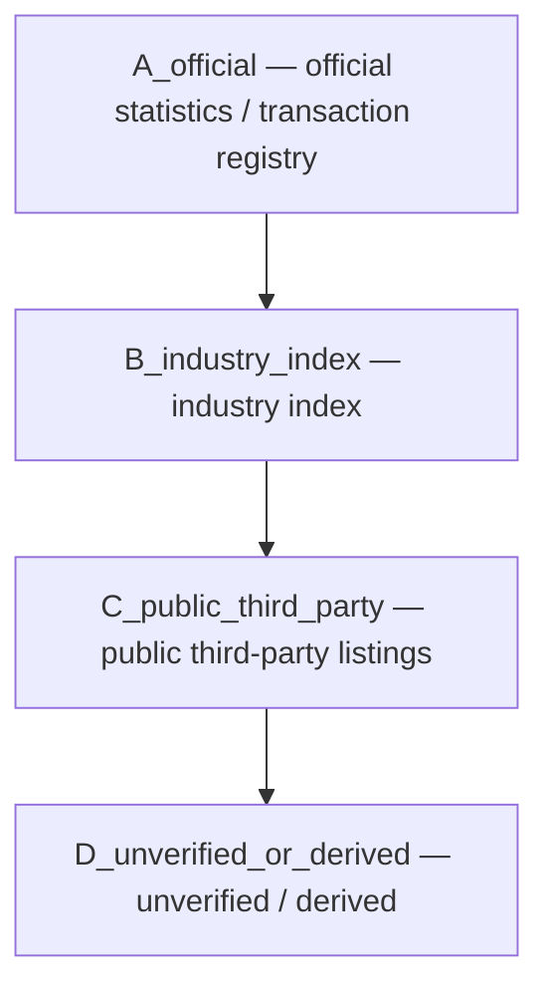

**Version:** 0.4 (preprint)
**Date:** 2026-08-15

## Abstract

China's urban housing price data is generally accessible at the public level, but its "measurable" boundary is far more complicated than it appears: the official 70-city index is a price index rather than a transaction unit price, district-level official data usually contains only transaction volume without transaction prices, and third-party listing samples belong to a different methodology altogether. This paper proposes a **source- and methodology-aware data construction method** that explicitly encodes "what the numbers can and cannot tell us" into the data itself.

Method highlights: source-tier labels (official / industry index / public third-party / derived), methodology-switch markers, temporal and spatial leakage control, and data cross-validation. On this basis we built a reproducible Chinese housing price data asset, comprising the official 70-city second-hand index (2019-01 through 2026-06, 90 consecutive months), the national macro panel (2023-02 through 2026-06), the LPR series (2019-08 through 2026-07), and Beijing district-level data. Cross-validation shows that the 70-city second-hand index from the China Institute of Real Estate Appraisers and Agents (CIREA) matches the National Bureau of Statistics (NBS) official index exactly across 3,990 overlapping units, indicating that the industry index is in fact a republication of the official data rather than an independent source — the boundary of independent verification is therefore "where there is no second source", not "how trustworthy the data is". The empirical analysis yields four findings: (1) Beijing's official second-hand year-over-year index forms a complete series after completion, peaking at 110.7 in 2021-07 and bottoming at 89.7 in 2024-09; (2) the national cumulative year-over-year growth of real estate development investment weakened from −9.4% in 2023-11 to −18.0% in 2026-06; (3) the direction of the official second-hand month-over-month index agreed with the district-level listing month-over-month changes in only 1 out of 5 sampled months — cross-methodology series do not necessarily move in the same direction; (4) the official district-level signed-contract data contains only transaction volume and no continuous transaction prices, so it cannot be joined to district-level prices as a panel. The methodological contribution lies in a protocol for declaring data boundaries, rather than in a predictive model.

**Keywords**: housing price index; statistical methodology; data source; reproducibility; source tiering; Beijing

## 1. Introduction

The topic of housing prices is naturally prone to being written up as "predicting next month's rise or fall." But before any modeling begins, one must first answer a more basic question: **what exactly are the numbers you hold in your hands?**

At least four kinds of "housing price" circulate in the Chinese market: the NBS 70-city price index (a fixed-base price index, not a unit price), industry indexes such as the CIREA index, listing average prices from third-party platforms, and the signed-contract transaction volume/area published by each city's housing and urban-rural development authority (usually without transaction prices). They all share the "price" label, yet their statistical methodologies, timing, and coverage differ from one another. Mixing all four into a single dataset yields a table whose numbers look complete but whose meanings are inconsistent — the most insidious failure mode of many public data projects.

This paper's core claim: **the measurable boundary of the data is an upstream constraint on what a model can express**. A baseline that explicitly states "what the model does not know" is usually more valuable than a high score achieved by mixing heterogeneous methodologies.

This paper's contributions:

1. **A source- and methodology-aware data construction framework** that encodes source tiering, methodology switching, and leakage control into the data itself (fields such as `source_tier` / `methodology` / `is_transaction_price`), rather than leaving them in documentation;
2. **A completed Chinese housing price data asset**: the official 70-city second-hand index for 90 consecutive months (2019-01—2026-06), the national macro panel for 35 months (2023-02—2026-06, with year-over-year figures), the complete LPR series for 84 months (2019-08—2026-07), the Beijing district-level listing average price monthly panel (2025-01—2026-06, 10 core districts × 18 months), the official district-level signed-contract cross-section (2025-10, 17 districts), and official annual transactions (2020—2024);
3. **Cross-methodology empirical analysis**: the directional agreement between the official index's month-over-month changes and the district-level listing month-over-month changes, a quantitative description of the national macro downtrend, and the gap in data linkage between district-level prices and official transaction volume.

This paper focuses on Beijing as the district-level case. Comparable data for cities such as Chongqing is even less open, and lies outside the empirical scope of this paper.

## 2. Related Work

Research on housing price measurement proceeds largely along two lines: first, **index construction methods**, and second, **data sources and methodologies**.

**Index construction and online data.** Wang, Li, and Wu (2020) use online listing information from China's second-hand residential market to construct housing price indexes covering 274 cities, and argue that — after handling duplicated and manipulated data — listing data offers a better trade-off between accuracy and feasibility than officially registered transaction information. That study demonstrates that online listing data can serve as a source of price indicators in cities where official coverage is inadequate (roughly 200 small and medium-sized cities), and shows that official and online methodologies differ systematically in coverage — consistent with this paper's position that district-level listings and the official index belong to different methodologies and must be handled separately. This paper, however, does not presuppose the direction or magnitude of the divergence between listings and official data, but lets the data speak for itself through field-level annotation.

**Data sources and official statistics.** Chivakul et al. (2015) analyze the supply, demand, and oversupply of China's residential real estate using multiple datasets, assess adjustment pressures by city tier, and point out that small cities and the northeastern region face more severe supply-demand dynamics. That study demonstrates the value of integrating multiple data sources for national- and city-level analysis, and also hints at the coverage limits of a single official series. Chen Hongyan (2010) early on pointed out that the national 70-city price index, compiled as a Laspeyres index, suffers from biases in four respects: individual versus aggregate, price collection, sample representativeness, and the computation model. Xu Yonghong and Zeng Wuyi (2012) compare the compilation practices of the NBS 70-city index and the U.S. Case-Shiller index, discussing the trade-offs between the repeat-sales model and the Laspeyres index.

This paper differs from the above work in that it proposes no new index construction method and does not repeat the critiques of the official index; instead, it makes the **explicit tiering of data sources and the explicit annotation of methodologies** the methodological contribution in itself, implementing them as an executable data asset through a reproducible field protocol (`source_tier` / `methodology` / `is_transaction_price`). This is in the same spirit as the "honest data" tradition: a dataset that explicitly states "what the data cannot tell us" has more research value than a polished panel that mixes heterogeneous methodologies.

## 3. Data Asset and Source Tiering

### 3.1 Overall Structure

All data uses `(region, month, market)` as the primary key, and each source retains three fields: `source_url`, `source_type`, and `methodology`. All datasets generate labeled copies carrying source-tier tags via `src/label_datasets.py`.

Sources are divided into four tiers (`source_tier`):

| Tier | Meaning | Instances in this paper |
|---|---|---|
| `A_official` | Official statistics or official transaction registry | NBS 70-city index; Beijing Municipal Commission of Housing and Urban-Rural Development district-level signed contracts and annual transactions |
| `B_industry_index` | Public index compiled by an industry body | CIREA second-hand residential index |
| `C_public_third_party` | Public third-party listing / market samples | China House Price (creprice) district-level listing average prices |
| `D_unverified_or_derived` | Insufficiently verified or derived estimates | Proxy baselines in district-level scenario forecasts |



`price_basis` further distinguishes the material basis of the numbers: `price_index` (an index, with no unit-price semantics), `listing_price` (a listing / market price), `transaction_volume_area` (transaction count / area, with no price), and `official_statistic` (an official statistic). `is_transaction_price` explicitly marks whether a field is a transaction unit price — in all datasets in this paper its value is `False`, because at the public level **no dataset provides a field that can be used directly as a "transaction unit price"**.

### 3.2 Data Inventory

| Dataset | Coverage | Rows | Tier | Purpose |
|---|---|---|---|---|
| 70-city official index panel `housing_indices_clean_v3.csv` | 2019-01—2026-06, 90 months, 70 cities | 9,030 | `A_official` | City-level target variable (second-hand YoY) and features |
| National macro panel `macro_features.csv` | 2023-02—2026-06, 35 months (cumulative methodology) | 35 | `A_official` | Real estate development investment, construction/new starts/completions, sales, inventory, funds in place, and YoY |
| LPR series `lpr_history.csv` | 2019-08—2026-07, 84 months | 84 | `A_official` | 1-year / over-5-year loan prime rate |
| Beijing district-level listing average price panel `creprice_beijing_district_prices.csv` | 2025-01—2026-06, 10 districts × 18 months | 180 | `C_public_third_party` | District-level price dimension (listing methodology) |
| Beijing official district-level signed contracts `beijing_official_district_secondhand_2025_10.csv` | 2025-10, 17 districts | 17 | `A_official` | District-level transaction activity cross-section |
| Beijing official annual transactions `beijing_annual_transactions.csv` | 2020—2024, new / existing | 10 | `A_official` | Annual market structure baseline |
| CIREA second-hand index `cirea_secondhand_*.csv` | 2019-01—2023-12 | — | `B_industry_index` | Same-source comparison for the official index (see 3.5) |

### 3.3 National Macro Data and LPR: A Second Methodology Chain

Besides the price index, there is a "volume" methodology chain at the national level: the NBS publishes the "National Real Estate Market Basic Situation" monthly, covering real estate development investment, construction/new-start/completion area, commercial housing sales area and value, unsold area, and enterprises' funds in place, all released on a **cumulative basis** (e.g., "January–June"), with most reports carrying year-over-year figures. This paper parses these into a 35-month macro panel (2023-02 through 2026-06), covering values and year-over-year figures.

Two points about the publication format of earlier reports are worth noting: first, the first half of 2023 used the heading "First Half" rather than "January–June"; second, before 2024 the reports used "commercial housing sales area" rather than "newly built commercial housing sales area". The collectors (`discover_real_estate_urls` and `src/macro_history.py`) handle both variants compatibly.

On the financing-cost side, this paper completes the full monthly LPR series (2019-08 through 2026-07, 84 months) from the central bank's announcement archive. The LPR is a monetary policy rate rather than a housing price, but it is a key financing-cost control variable in any housing price model. Some announcements before 2024 insert spaces inside the labels (e.g., "the 1-year LPR is 3.65%"), and the parser tolerates those spaces.

One important methodological reminder: **the cumulative methodology of the macro panel cannot be mixed directly with the monthly methodology of prices**. "Real estate development investment fell 18.0% year-over-year from January to June" is a cumulative figure and cannot be interpreted as the change in June alone. This forms a complementary but different measurement cadence from the price index (one year-over-year figure per month).

### 3.4 Handling Methodology Switches

Official data coverage contains methodology switches: from 2008 to 2010 the old "housing sales price index" methodology was used, and from 2011 onward the current Residential Sales Price Statistical Survey Program has been in effect. This paper preserves the `methodology` marker (`legacy`/`current`); any cross-methodology modeling must be evaluated separately, and a statistical methodology switch must not be misread as a change in market structure.

When completing all of 2024 and February–November 2025, some months come from the NBS archive path `xxgk/sjfb/zxfb2020`; these belong to the same index methodology as the releases under the current `sj/zxfb` path and can be merged into the same panel. October–December 2022 likewise come from the archive path. The earlier months of the macro panel (2023-01/02, etc.) also come from the `xxgk` archive; their heading formats differ from the current ones but the methodology is consistent. See `discover_urls` in `src/collector.py` and `src/macro_history.py` for the collection scripts and URL discovery logic.

### 3.5 Data Cross-Validation and Independence Testing

The convention in a data analysis paper is to bring in an **independent source** to cross-check the primary dataset. This paper initially expected the 70-city second-hand index published by the China Institute of Real Estate Appraisers and Agents (CIREA) to play that role — CIREA is an industry institute and should in theory be independently compiled. But the empirical test yielded the opposite conclusion:

Reconciling the CIREA second-hand index against the NBS 70-city second-hand index cell by cell across 3,990 overlapping (city, month) units:

- **The differences in both month-over-month and year-over-year figures are all zero** (the mean of NBS − CIREA is 0.000, with a maximum absolute difference of 0.000);
- The correlation coefficient r = 1.0000;
- Beijing alone, with a 57-month overlap period, is likewise perfectly identical.

This result is not positive evidence that "two independent sources agree closely"; rather, it reveals that **the two share the same origin**: CIREA's 70-city second-hand index is a republication/reorganization of the NBS official index, not an independent compilation. CIREA's official website, in its notes on the compiler and methodology, also confirms this.

This test has two implications for this paper. First, the so-called "independent industry index" is not actually independent at the current public level — the 70-city second-hand index has only one factual source, and any attempt to "verify" NBS using CIREA is merely self-comparison. Second, it reinforces the paper's central judgment: **the only independent public source of Beijing district-level "prices" is the third-party listing methodology (`C_public_third_party`); neither the official nor the industry side has an independent transaction price series at the district level.** The conclusion of data cross-validation is therefore not "the data is trustworthy", but "where the boundary of independent verification lies" — which is itself direct evidence of the "measurable boundary".

## 4. Method: The Honest Baseline Protocol

### 4.1 Layered Handling, Never Mixing

The Beijing district-level analysis handles the city-level official index and the district-level public market samples **separately**:

- City path: the official second-hand month-over-month index, covering 2019-01—2026-06, with rolling 12-month backtesting to select the long-term method;
- District path: listing average price samples, or proxy baselines explicitly marked with `low` confidence.

For areas without continuous district-level transaction price data, the results are explicitly marked with `low` confidence and are not disguised as official transaction average prices.

### 4.2 Leakage Control

The strict predictive model uses only information available before the target month, including monthly seasonality, city tier, and lagged indicators for new and second-hand housing. It avoids taking the target month's second-hand year-over-year directly as an input, and avoids overlap between the training and test sets along the city dimension, in order to reduce the risk of spatial leakage.

Such restraint often worsens the score, yet it makes the experiment more credible — this is exactly the "honest baseline" this paper advocates.

## 5. Empirical Analysis

### 5.1 National Level: A Quantitative Description of the Macro Downtrend

With the macro panel (35 months, 2023-02 through 2026-06, cumulative methodology) and the LPR series (84 months, 2019-08 through 2026-07) completed, the persistent downturn of national real estate can be described quantitatively. Key milestones:

| Period (cumulative through) | Real estate development investment (CNY 100 million) | Cumulative YoY | Commercial housing sales area (10,000 m²) | Cumulative YoY |
|---|---|---:|---:|---:|
| 2023-11 | 104,045 | −9.4% | 100,509 | −8.0% |
| 2024-06 | 52,529 | −10.1% | 47,916 | −19.0% |
| 2024-11 | 93,634 | −10.4% | 86,118 | −14.3% |
| 2025-06 | 46,658 | −11.2% | 45,851 | −3.5% |
| 2025-11 | 78,591 | −15.9% | 78,702 | −7.8% |
| 2026-06 | 38,074 | −18.0% | 40,140 | −11.6% |

The cumulative year-over-year growth of real estate development investment weakened steadily from −9.4% in 2023-11 to −18.0% in 2026-06, nearly doubling the decline within three years. The cumulative year-over-year growth of commercial housing sales value once fell sharply to −25.0% in 2024-06, briefly narrowed in 2025, and then widened again in 2026. On the inventory side, the unsold commercial housing area rose from 64,159 (10,000 m²) in 2023-06 to 76,948 (10,000 m²) in 2025-06, then fell back to 76,315 (10,000 m²) in 2026-06 (YoY −0.9%), showing that destocking is still ongoing.

On the LPR side, the over-5-year LPR (directly relevant to mortgages) fell through multiple rounds of cuts from 4.85% at its 2019-08 launch to 3.5% (effective 2025-05), and the 1-year LPR fell from 4.25% to 3.0%. Falling financing costs coexist with weakening housing prices — the interest rate is a policy variable and cannot explain price movements on its own, but it is a control variable that any national housing price model must include.

### 5.2 City Level: The Complete Official Second-Hand Index Series

After completion, Beijing's official second-hand residential year-over-year index forms a continuous 90-month series (2019-01—2026-06). Key milestones:

| Period | Year-over-year index |
|---|---:|
| 2019-01 | 98.6 |
| 2021-07 (peak) | 110.7 |
| 2022-12 | 103.9 |
| 2023-12 | 97.8 |
| 2024-09 (trough) | 89.7 |
| 2025-06 | 98.2 |
| 2025-12 | 91.5 |
| 2026-06 | 94.5 |

The series traces a complete market cycle: a rapid rise from the second half of 2020, a peak in 2021-07 (YoY +10.7%), a sustained decline thereafter, a trough in 2024-09 (YoY −10.3%), low-level fluctuations through 2025, and a modest recovery in the first half of 2026.

### 5.3 District Level: The Listing Average Price Monthly Panel

The Beijing district-level listing average price panel covers 2025-01—2026-06 (10 core districts × 18 months, `C_public_third_party`). The 2026-06 cross-section:

| District | Listing average price (CNY/m²) | MoM |
|---|---|---:|---:|
| Xicheng | 117,000 | +6.6% |
| Dongcheng | 88,700 | −0.4% |
| Haidian | 81,100 | −1.0% |
| Chaoyang | 61,200 | −1.1% |
| Fengtai | 46,000 | −3.6% |
| Shijingshan | 43,700 | +0.2% |
| Daxing | 37,400 | −1.3% |
| Changping | 36,300 | +3.3% |
| Shunyi | 34,300 | −0.5% |
| Mentougou | 34,200 | +4.2% |

The interval change from 2025-01 to 2026-06 shows clear inter-district divergence: Xicheng −4.9%, Chaoyang −12.2%, Tongzhou −17.4%. The core districts (Xicheng, Dongcheng, Haidian) fell markedly less than the outer districts, consistent in direction with the market perception — as reflected in the official index — that "core districts are more resistant to declines". Note, however, that this is the listing methodology, not the transaction methodology.

### 5.4 Official District-Level Signed Contracts: A Transaction Volume Cross-Section

The October 2025 existing-home signed-contract statistics published by the Beijing Municipal Commission of Housing and Urban-Rural Development cover 17 districts/development zones, totaling 13,595 units and 1,167,467 m². Transaction volume is highly concentrated: Chaoyang (22.1%), Haidian (10.8%), and Fengtai (9.9%) together account for over 40%; the top 5 districts account for 58.3%.

This is **transaction volume** data at the official level, not transaction prices. There is **no continuous linkage panel** between it and the district-level listing average prices — the official side does not publish continuous district-level transaction average prices, and the third-party listing samples cover only 10 core districts. This is exactly the data gap this paper emphasizes: an official continuous series of Beijing district-level "prices" does not exist at the public level.

### 5.5 Official Annual Transactions: Market Structure

Beijing's official annual transactions, 2020—2024 (10,000 units):

| Year | Existing homes | New-home signed contracts |
|---|---:|---:|
| 2020 | 16.46 | 6.81 |
| 2021 | 19.11 | 9.07 |
| 2022 | 14.09 | 6.81 |
| 2023 | 15.32 | 6.56 |
| 2024 | 17.32 | 5.11 |

Existing-home transaction volume is roughly 2–3 times that of new homes, and the existing-home transaction area is far larger than the new-home area (e.g., 1,558 vs 601 (10,000 m²) in 2024) — the Beijing market is dominated by second-hand homes, which mutually corroborates the choice of the official second-hand index as the target variable.

### 5.6 Cross-Methodology Comparison: Official MoM vs District-Level Listing MoM

For the months in which both the official second-hand month-over-month index and the district-level listing month-over-month changes (the mean of Xicheng/Dongcheng/Haidian/Chaoyang/Fengtai) are available, the directional agreement between the two:

| Month | Official second-hand MoM | Mean district listing MoM | Same direction |
|---|---|---:|---:|:---:|
| 2025-01 | 100.1 | −1.29% | ✓ |
| 2025-06 | 99.0 | −0.39% | ✗ |
| 2025-12 | 98.7 | −0.47% | ✗ |
| 2026-03 | 100.6 | +0.38% | ✗ |
| 2026-06 | 100.1 | +0.12% | ✗ |

In only 1 of the 5 sampled months do the two move in the same direction. This shows that **listing prices and the official transaction index do not necessarily move in the same direction**: listing prices reflect supply-side asking-price expectations, while the official index reflects changes in the transaction structure. Any attempt to use listing prices as a direct proxy for the official index must explicitly handle this systematic divergence. This is one of this paper's most important empirical findings.

It must be emphasized that this conclusion is based on 5 sampled months, with the district-level methodology taking the mean of 5 core districts; the sample is small and its statistical significance is limited — it reveals the **existence of directional disagreement** (its existence alone refutes the default assumption that "listings can safely proxy for the official index"), rather than a precise estimate of the divergence magnitude. Robustly quantifying the divergence magnitude would require a longer panel, which lies beyond the current public coverage of district-level data.

## 6. Discussion and Limitations

**Limitation 1: The new-home residential index is not fully covered.** The new-home series covers from 2022-10, January and August–December 2023, and after 2024-01; the new-home gap for February–July 2023 still needs to be filled from the historical archive pages. This paper chooses the second-hand year-over-year as the target variable precisely to prevent this gap from affecting the core conclusions.

**Limitation 2: District-level prices exist only in the listing methodology.** What Beijing publishes at the official level is district-level transaction count/area (without prices), and the third-party listing samples cover 10 core districts (not all 17 districts). The confidence of district-level "price" conclusions is therefore marked as `C_public_third_party` or `low`, and cannot be elevated to an official transaction price conclusion.

**Limitation 3: A single-month official signed-contract cross-section.** The current public page of the Beijing Municipal Commission of Housing and Urban-Rural Development discloses only the October 2025 district-level signed contracts; building a district-level official short panel would require month-by-month archiving or waiting for an open interface on the Beijing public data platform.

**Limitation 4: The publication cadence and boundary of the macro panel.** National macro data is published on a cumulative basis (January and December are folded into adjacent cumulative months), so the panel is not evenly spaced month by month; the early months before 2023-02 rely on the `xxgk` archive path, whose heading formats differ from the current ones. Macro indicators are "volume", not "price"; they complement the price index but cannot be mixed with it directly.

**Limitation 5: The sample size of the cross-methodology comparison.** The cross-methodology directional agreement in Section 5.6 is based on the mean of 5 sampled months and 5 core districts, a small sample. The finding is valid for refuting the default assumption that "listings can safely proxy for the official index", but is insufficient for precisely estimating the divergence magnitude.

**Limitation 6: The lack of an independent index verification source.** As Section 3.5 shows, the industry 70-city second-hand index is entirely same-source as the official one, and there is no independent transaction price series at the district level on the official side. This means the accuracy of this paper's primary data (the official index) can only be endorsed by the official source itself and cannot be cross-verified through a second independent source. This is an objective constraint of the public data environment, and part of the "measurable boundary".

## 7. Reproducibility and Data Statement

All collection, cleaning, labeling, and auditing steps can be reproduced via scripts (see the repository README):

```bash
.venv/bin/python -m src.creprice_sources --city 北京 --start 2025-01 --end 2026-06
.venv/bin/python -m src.beijing_sources --output ... --annual-output ...
.venv/bin/python -m src.macro_sources --lpr-history --start-year 2019 --end-year 2026
.venv/bin/python -m src.macro_history --urls ... --merge-output ...
.venv/bin/python -m src.clean
.venv/bin/python -m src.audit --data data/processed/housing_indices_clean_v3.csv
.venv/bin/python -m src.label_datasets
```

The data quality audit `reports/data_quality_v3.json` shows: 90/90 months complete, no month gaps, no duplicate keys, and full coverage of all 70 cities. All data files carry source-tier labels (`_labeled.csv` copies), and the `is_transaction_price` field is `False` for all data — this is this paper's most concise statement of "what this dataset can and cannot be used for".

## 8. Conclusion

This paper's central claim is not "we built a better housing price model", but rather: **the measurable boundary of housing price data should be explicitly encoded into the data itself**. Through the source- and methodology-aware construction method, we use three layers of Chinese data — from national to district level — to demonstrate: the official second-hand index can be completed into a gap-free continuous 90-month series that supports a description of a complete market cycle; completing the national macro panel and the LPR series makes the persistent decline in real estate development investment (cumulative YoY from −9.4% to −18.0%) a quantifiable fact; cross-validation shows that the industry 70-city second-hand index is entirely same-source as the official one, and independent verification is especially lacking at the district level; district-level listing prices do not move stably in the same direction as the official index on a monthly basis, so cross-methodology mixing would produce systematic bias; and official district-level data currently contains only transaction volume and no continuous transaction prices — this is a data-boundary issue, not an analytical-technique issue.

Data science does not automatically become rigorous just because it uses a model. Rigor often comes from the willingness to write "what this data cannot tell us" into the project itself — what this paper does is to put that principle into practice as reproducible fields and a protocol.

## References

**Academic literature**

[1] Wang, X., Li, K., & Wu, J. (2020). House price index based on online listing information: The case of China. *Journal of Housing Economics*, 50, 101715. <https://www.sciencedirect.com/science/article/abs/pii/S1051137720300516>

[2] Chivakul, M., Lam, W., Liu, X., Maliszewski, W., & Schipke, A. (2015). *Understanding Residential Real Estate in China*. IMF Working Paper No. 15/84. <https://www.imf.org/en/publications/wp/issues/2016/12/31/understanding-residential-real-estate-in-china-42873>

[3] Xu Yonghong, Zeng Wuyi. (2012). A comparative study of housing price index construction in China and the United States. *Statistical Research*, 29(12), 14–20. <https://tjyj.stats.gov.cn/CN/Y2012/V29/I12/14>

[4] Chen Hongyan. (2010). On the biases and improvement of the real estate price index. *Jiangxi Social Sciences*, 2010(06). <https://wap.cnki.net/touch/web/Journal/Article/JXSH201006016.html>

**Official data sources**

[5] National Bureau of Statistics. Changes in sales prices of commercial residential housing in 70 large and medium-sized cities (monthly release). <https://www.stats.gov.cn/sj/zxfb/index.html>

[6] National Bureau of Statistics. National real estate market basic situation (monthly release, cumulative methodology). <https://www.stats.gov.cn/sj/zxfb/index.html>

[7] People's Bank of China. Loan Prime Rate (LPR) announcements (monthly release). <https://www.pbc.gov.cn/zhengcehuobisi/125207/125213/125440/3876551/index.html>

[8] Beijing Municipal Commission of Housing and Urban-Rural Development. Real estate data statistics — existing-home online signed-contract statistics. <https://zjw.beijing.gov.cn/bjjs/fdcjy/wqht/fcsjtj/index.shtml>

[9] China Institute of Real Estate Appraisers and Agents (CIREA). 70-city second-hand residential price index (historical attachments). <https://www.cirea.org.cn/content/4773>

[10] China House Price (creprice.cn). Beijing real estate data report (monthly). <https://www.creprice.cn/report/bj.html>

## Author and Statement

**Author:** Liyuk

**Conflict of interest:** The author declares no conflicts of interest. This project received no funding from any commercial institution and does not constitute investment advice; the model's output does not constitute a prediction of, or commitment regarding, future housing prices.

**Data availability:** This project is based on real data: the residential price index for 70 large and medium-sized cities comes from the NBS's public monthly reports, and the collection, cleaning, training, auditing, and reporting code can all be reproduced in the GitHub repository ([cn-housing-price-training](https://github.com/Liyuk/cn-housing-price-training)). `yoy_secondhand` is the year-over-year index of second-hand residential sales prices, benchmarked at "the same month last year = 100", and is not equal to the transaction unit price. The project's modeling baseline, methodology-change markers (`methodology`), and leakage-prevention splits are all under version control.

## Further reading

- [Define the Measurement Before Arguing About Metrics](/en/writing/2021/03/define-the-measurement-before-arguing-about-metrics/)
- [Data Definitions Are Collaboration Interfaces](/en/writing/2021/03/data-definitions-are-collaboration-interfaces/)
- [Data Metrics Guide](/en/columns/data-metrics-guide/)
