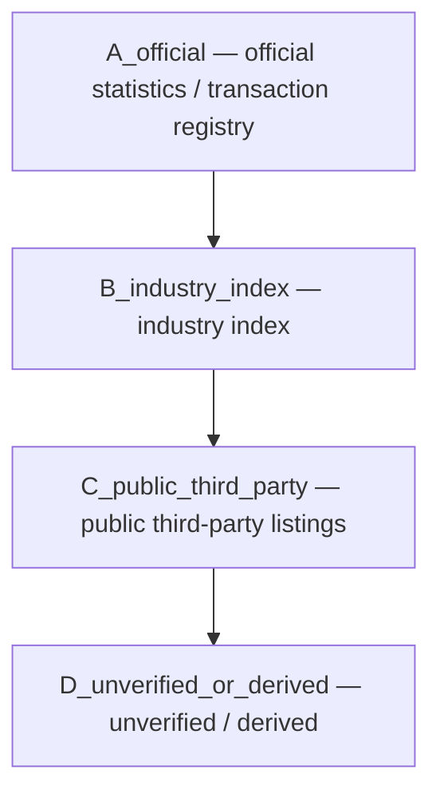

**版本：** 0.4（preprint）
**日期：** 2026-08-15

## 摘要

中国城市房价数据在公开层面通常可获取，但其"可测量"边界远比表面复杂：官方 70 城指数是价格指数而非成交单价，区级官方数据往往只有成交量而没有成交价格，第三方挂牌样本则属于另一套口径。本文提出一种**来源—口径感知（source- and methodology-aware）的数据构建方法**，把"数字能告诉我们什么 / 不能告诉我们什么"显式编码进数据本身。

方法要点：来源分级标签（官方 / 行业指数 / 公开第三方 / 派生）、口径切换标记、时间与空间泄漏控制、数据交叉验证。基于此构建了一套可复现的中国房价数据资产，含 70 城官方二手指数（2019-01 至 2026-06，连续 90 个月）、全国宏观面板（2023-02 至 2026-06）、LPR 序列（2019-08 至 2026-07）与北京区级数据。交叉验证显示，中房学（CIREA）的 70 城二手指数与国家统计局官方指数在 3,990 个重叠单元上完全一致，说明行业指数实为官方转载而非独立来源——独立核验的边界因此是"哪里没有第二个来源"，而不是"数据有多可信"。实证给出四点发现：(1) 北京二手官方同比在补全后形成完整序列，峰值 2021-07 的 110.7、谷值 2024-09 的 89.7；(2) 全国房地产开发投资累计同比从 2023-11 的 −9.4% 走弱至 2026-06 的 −18.0%；(3) 官方二手环比与区级挂牌环比在抽样月份方向一致性仅 1/5，跨口径不必然同向；(4) 官方区级网签只有成交量、无连续成交价格，与区级价格间无面板可衔接。方法贡献在于一套数据边界声明协议，而非一个预测模型。

**关键词**：房价指数；统计口径；数据来源；可复现性；来源分级；北京

## 1. 引言

房价主题天然容易被写成"预测下个月涨跌"。但在任何建模开始之前，必须先回答一个更朴素的问题：**你手里的数字到底是什么？**

中国市场上流通着至少四类"房价"：国家统计局 70 城价格指数（定基价格指数，非单价）、中房学等行业指数、第三方平台挂牌均价、以及各城市住建部门公布的网签成交量/面积（通常没有成交价格）。它们共享"价格"这个标签，但统计口径、时点、覆盖范围各不相同。把四者混入一个数据集，会得到一个数字很完整、含义却不一致的表——这是许多公开数据项目最隐蔽的失效方式。

本文的核心主张：**数据的可测量边界是模型表达能力的上游约束**。一个明确声明"模型不知道什么"的基线，通常比一个混入异质口径的高分更有价值。

本文的贡献：

1. **一套来源—口径感知的数据构建框架**，把来源分级、口径切换、泄漏控制编码进数据本身（`source_tier` / `methodology` / `is_transaction_price` 等字段），而非放在文档里；
2. **一份已补全的中国房价数据资产**：70 城官方二手指数连续 90 个月（2019-01—2026-06）、全国宏观面板 35 个月（2023-02—2026-06，含同比）、LPR 完整序列 84 个月（2019-08—2026-07）、北京区级挂牌均价月度面板（2025-01—2026-06，10 个核心城区 × 18 个月）、官方区级网签横截面（2025-10，17 区）与官方年度交易（2020—2024）；
3. **跨口径实证**：官方指数环比与区级挂牌环比的方向一致性、全国宏观下行趋势的量化描述、区级价格与官方成交量之间数据衔接的缺口。

本文聚焦北京作为区级案例。重庆等城市的同类数据开放程度更低，不在本文实证范围内。

## 2. 相关工作

房价测量研究大致沿两条主线展开：一是**指数编制方法**，二是**数据来源与口径**。

**指数编制与在线数据。** Wang、Li 与 Wu（2020）利用中国二手住宅市场的在线挂牌信息构造房价指数，覆盖 274 个城市，并论证挂牌数据在准确性与可行性之间提供了比官方登记交易信息更好的权衡（在处理重复与操纵数据之后）。该研究证明了在线挂牌数据在官方覆盖不足的城市（约 200 个中小城市）可作为价格指标来源，也说明官方与在线口径在覆盖面上存在系统性差异——这与本文"区级挂牌与官方指数属于不同口径、需分开处理"的立场一致，但本文不预设挂牌与官方之间偏离的方向与大小，而是通过字段标注让数据自行说明。

**数据来源与官方统计。** Chivakul 等（2015）基于多种数据集分析中国住宅地产的供需与过剩，按城市层级评估调整压力，指出小型城市及东北地区面临更严峻的供需动态。该研究展示了多源数据综合用于全国与城市层级分析的价值，也提示单一官方序列的覆盖局限。陈红艳（2010）较早指出按拉氏指数编制的全国 70 城价格指数存在个体与总体、价格采集、样本代表性、计算模型四方面的偏差；许永洪与曾五一（2012）则对比了 NBS 70 城指数与美国 Case-Shiller 指数的编制实践，讨论重复售出模型与拉氏指数的取舍。

本文与上述工作的区别在于：不提出新的指数编制方法，也不重复对官方指数的批评，而是把**数据来源的分级与口径的显式标注**本身作为方法贡献，用一套可复现的字段协议（`source_tier` / `methodology` / `is_transaction_price`）落地为可执行的数据资产。这与"诚实数据"（honest data）传统一脉相承：一个明确声明"数据不能告诉我们什么"的数据集，比一个混入异质口径的漂亮面板更有研究价值。

## 3. 数据资产与来源分级

### 3.1 总体结构

数据统一以 `(region, month, market)` 为主键，每个来源保留 `source_url`、`source_type`、`methodology` 三个字段。所有数据集通过 `src/label_datasets.py` 生成带来源分级标签的副本。

来源分为四级（`source_tier`）：

| 分级 | 含义 | 本文实例 |
|---|---|---|
| `A_official` | 官方统计或官方交易登记 | 国家统计局 70 城指数；北京市住建委区级网签与年度交易 |
| `B_industry_index` | 行业机构编制的公开指数 | 中房学（CIREA）二手住宅指数 |
| `C_public_third_party` | 公开第三方挂牌/行情样本 | 中国房价行情（creprice）区级挂牌均价 |
| `D_unverified_or_derived` | 未充分核验或派生估计 | 区级情景预测中的代理基准 |



`price_basis` 进一步区分数字的物质基础：`price_index`（指数，无单价语义）、`listing_price`（挂牌/行情价）、`transaction_volume_area`（成交套数/面积，无价格）、`official_statistic`（官方统计量）。`is_transaction_price` 明确标注该字段是否为成交单价——本文所有数据集中该值为 `False`，因为在公开层面，**没有任何一个数据集提供了可直接当"成交单价"用的字段**。

### 3.2 数据清单

| 数据集 | 覆盖 | 行数 | 分级 | 作用 |
|---|---|---|---|---|
| 70 城官方指数面板 `housing_indices_clean_v3.csv` | 2019-01—2026-06，90 个月，70 城 | 9,030 | `A_official` | 城市层目标变量（二手同比）与特征 |
| 全国宏观面板 `macro_features.csv` | 2023-02—2026-06，35 个月（累计口径） | 35 | `A_official` | 房地产开发投资、施工/新开工/竣工、销售、库存、到位资金及同比 |
| LPR 序列 `lpr_history.csv` | 2019-08—2026-07，84 个月 | 84 | `A_official` | 1 年期 / 5 年期以上贷款市场报价利率 |
| 北京区级挂牌均价面板 `creprice_beijing_district_prices.csv` | 2025-01—2026-06，10 城区 × 18 个月 | 180 | `C_public_third_party` | 区级价格维度（挂牌口径） |
| 北京官方区级网签 `beijing_official_district_secondhand_2025_10.csv` | 2025-10，17 区 | 17 | `A_official` | 区级交易活跃度横截面 |
| 北京官方年度交易 `beijing_annual_transactions.csv` | 2020—2024，新建/存量 | 10 | `A_official` | 年度市场结构基线 |
| 中房学二手指数 `cirea_secondhand_*.csv` | 2019-01—2023-12 | — | `B_industry_index` | 官方指数的同源对照（见 3.5） |

### 3.3 全国宏观与 LPR：另一条口径链

除价格指数外，全国层面还有一条"量"的口径链：国家统计局按月发布「全国房地产市场基本情况」，含房地产开发投资、施工/新开工/竣工面积、商品房销售面积与金额、待售面积、企业到位资金，均按**累计口径**（如"1—6 月"）发布，且多数报告带同比。本文将其解析为 35 个月（2023-02 至 2026-06）的宏观面板，覆盖值与同比。

早期报告的发布格式有两点需要注意：一是 2023 年上半年使用「上半年」而非「1—6 月」标题，二是 2024 年前使用「商品房销售面积」而非「新建商品房销售面积」。采集器（`discover_real_estate_urls` 与 `src/macro_history.py`）对这两种变体都做了兼容处理。

融资成本方面，本文从央行公告归档补全了 LPR 的完整月度序列（2019-08 至 2026-07，84 个月）。LPR 是货币政策利率而非房价，但在任何房价建模中都是关键的融资成本控制变量。2024 年前的部分公告在标签内插入空格（如"1 年期 LPR 为 3.65%"），解析器做了空格容忍处理。

一个重要的口径提醒：**宏观面板的累计口径不能与价格的月度口径直接混算**。"1—6 月房地产开发投资同比下降 18.0%"是累计数，不能解读为 6 月单月变化。这与价格指数（每月一个同比）形成互补但不同的测量节拍。

### 3.4 口径切换的处理

官方数据覆盖存在口径切换：2008—2010 年采用旧口径"房屋销售价格指数"，2011 年起采用现行《住宅销售价格统计调查方案》。本文保留 `methodology` 标记（`legacy`/`current`），任何跨口径的建模都必须分别评估，不能把统计口径切换误判为市场结构变化。

在补全 2024 全年与 2025 年 2—11 月时，部分月份来自国家统计局 `xxgk/sjfb/zxfb2020` 归档路径，与现行 `sj/zxfb` 路径下的发布物属同一套指数口径，可以并入同一面板；2022 年 10—12 月同样来自归档路径。宏观面板的早期月份（2023-01/02 等）同样来自 `xxgk` 归档，标题格式与现行不同但口径一致。采集脚本与 URL 发现逻辑见 `src/collector.py` 的 `discover_urls` 与 `src/macro_history.py`。

### 3.5 数据交叉验证与独立性检验

数据分析论文的惯例是引入一个**独立来源**交叉核验主数据集。本文起初期望用中房学（CIREA）发布的 70 城二手指数承担这一角色——CIREA 是行业学会，理论上应属独立编译。但实证检验给出了相反的结论：

将 CIREA 二手指数与国家统计局 70 城二手指数在 3,990 个重叠的（城市，月份）单元上逐一对账：

- **环比与同比的差值全部为 0**（NBS − CIREA 的均值为 0.000，最大绝对差 0.000）；
- 相关系数 r = 1.0000；
- 北京单城 57 个月的重叠期同样完全一致。

这一结果不是"两个独立来源高度吻合"的正面证据，而是揭示了**两者同源**：CIREA 的 70 城二手指数是对国家统计局官方指数的转载/整理，而非独立编译。CIREA 官网对其编译方与方法论的说明也印证了这一点。

这个检验对本文有两层意义。其一，**所谓"行业独立指数"在当前公开层面并不独立**——70 城二手指数只有一个事实来源，任何用 CIREA "核验" NBS 的做法都只是自我比对。其二，它强化了论文的核心判断：**北京区级"价格"的独立公开来源只有第三方挂牌口径（`C_public_third_party`），官方与行业在区级维度均无独立成交价序列。** 数据交叉验证的结论因此不是"数据可信"，而是"独立核验的边界在哪里"——这本身是"可测量边界"的直接证据。

## 4. 方法：诚实基线协议

### 4.1 分层处理，绝不混合

北京区级分析将城市级官方指数与区级公开行情样本**分开处理**：

- 城市路径：官方二手环比指数，覆盖 2019-01—2026-06，滚动 12 个月回测选择长期方法；
- 区级路径：挂牌均价样本，或明确标记为 `low` 置信度的代理基准。

对没有连续区级成交价格数据的区域，结果明确标为 `low` 置信度，不伪装成官方成交均价。

### 4.2 泄漏控制

严格预测模型只使用目标月份之前可获得的信息，包括月份季节性、城市层级、新房与二手房的滞后指标。它避免把目标月份的二手房同比直接作为输入，也避免训练集与测试集在城市维度上重叠，以降低空间泄漏的风险。

这种克制常常会让分数变差，却让实验更可信——这正是本文所主张的"诚实基线"。

## 5. 实证

### 5.1 全国层：宏观下行趋势的量化描述

宏观面板（35 个月，2023-02 至 2026-06，累计口径）与 LPR 序列（84 个月，2019-08 至 2026-07）补全后，可以量化描述全国房地产的持续下行。关键节点：

| 时间（累计到） | 房地产开发投资 | 累计同比 | 商品房销售面积 | 累计同比 |
|---|---:|---:|---:|---:|
| 2023-11 | 104,045 亿元 | −9.4% | 100,509 万㎡ | −8.0% |
| 2024-06 | 52,529 亿元 | −10.1% | 47,916 万㎡ | −19.0% |
| 2024-11 | 93,634 亿元 | −10.4% | 86,118 万㎡ | −14.3% |
| 2025-06 | 46,658 亿元 | −11.2% | 45,851 万㎡ | −3.5% |
| 2025-11 | 78,591 亿元 | −15.9% | 78,702 万㎡ | −7.8% |
| 2026-06 | 38,074 亿元 | −18.0% | 40,140 万㎡ | −11.6% |

房地产开发投资累计同比从 2023-11 的 −9.4% 一路走弱至 2026-06 的 −18.0%，三年内跌幅接近翻倍；商品房销售金额的累计同比在 2024-06 一度深跌至 −25.0%，2025 年短暂收窄后于 2026 年重新扩大。库存方面，商品房待售面积从 2023-06 的 64,159 万㎡ 升至 2025-06 的 76,948 万㎡ 后于 2026-06 回落至 76,315 万㎡（同比 −0.9%），显示去库存仍在进行。

LPR 侧，5 年期以上 LPR（与房贷直接相关）从 2019-08 推出时的 4.85% 历经多轮下调至 3.5%（2025-05 起），1 年期 LPR 从 4.25% 降至 3.0%。融资成本的下行与房价的走弱并存——利率是政策变量，不能单独解释价格走势，但它是任何全国房价模型都必须纳入的控制变量。

### 5.2 城市层：官方二手指数完整序列

在补全数据后，北京二手住宅官方同比指数形成连续 90 个月序列（2019-01—2026-06）。关键节点：

| 时间 | 同比指数 |
|---|---:|
| 2019-01 | 98.6 |
| 2021-07（峰值） | 110.7 |
| 2022-12 | 103.9 |
| 2023-12 | 97.8 |
| 2024-09（谷值） | 89.7 |
| 2025-06 | 98.2 |
| 2025-12 | 91.5 |
| 2026-06 | 94.5 |

该序列描绘了一个完整的市场周期：2020 年下半年起快速上行，2021-07 见顶（同比 +10.7%），随后持续回落，2024-09 触底（同比 −10.3%），2025 年低位震荡后于 2026 年上半年小幅回升。

### 5.3 区级层：挂牌均价月度面板

北京区级挂牌均价面板覆盖 2025-01—2026-06（10 个核心城区 × 18 个月，`C_public_third_party`）。2026-06 横截面：

| 区 | 挂牌均价（元/㎡） | 环比 |
|---|---:|---:|
| 西城 | 117,000 | +6.6% |
| 东城 | 88,700 | −0.4% |
| 海淀 | 81,100 | −1.0% |
| 朝阳 | 61,200 | −1.1% |
| 丰台 | 46,000 | −3.6% |
| 石景山 | 43,700 | +0.2% |
| 大兴 | 37,400 | −1.3% |
| 昌平 | 36,300 | +3.3% |
| 顺义 | 34,300 | −0.5% |
| 门头沟 | 34,200 | +4.2% |

2025-01 至 2026-06 的区间变化显示出明显的区际分化：西城 −4.9%、朝阳 −12.2%、通州 −17.4%。核心区（西城、东城、海淀）跌幅显著小于外围城区，与官方指数显示的"核心区更抗跌"的市场认知方向一致——但注意，这是挂牌口径，不是成交口径。

### 5.4 官方区级网签：成交量横截面

北京市住建委公开的 2025-10 存量房网签统计覆盖 17 个区/开发区，共 13,595 套、1,167,467 ㎡。成交量高度集中：朝阳（22.1%）、海淀（10.8%）、丰台（9.9%）三区合计超四成；前 5 区占 58.3%。

这是官方层面的**成交量**数据，不是成交价格。它与区级挂牌均价之间**没有连续的衔接面板**——官方不公开区级连续成交均价，第三方挂牌样本又只有 10 个核心城区。这正是本文强调的数据缺口：北京区级"价格"的官方连续序列在公开层面不存在。

### 5.5 官方年度交易：市场结构

北京 2020—2024 年官方年度交易（万套）：

| 年份 | 存量房 | 新建网签 |
|---|---:|---:|
| 2020 | 16.46 | 6.81 |
| 2021 | 19.11 | 9.07 |
| 2022 | 14.09 | 6.81 |
| 2023 | 15.32 | 6.56 |
| 2024 | 17.32 | 5.11 |

存量房成交量约为新建的 2—3 倍，且存量房交易面积远大于新建（如 2024 年 1,558 vs 601 万㎡）——北京市场以二手房为主导，这与官方二手指数作为目标变量的选择互为印证。

### 5.6 跨口径对照：官方环比 vs 区级挂牌环比

在同时拥有官方二手环比与区级挂牌环比（西城/东城/海淀/朝阳/丰台均值）的月份，两者的变动方向一致性：

| 月份 | 官方二手环比 | 区级挂牌环比均值 | 同向 |
|---|---:|---:|:---:|
| 2025-01 | 100.1 | −1.29% | ✓ |
| 2025-06 | 99.0 | −0.39% | ✗ |
| 2025-12 | 98.7 | −0.47% | ✗ |
| 2026-03 | 100.6 | +0.38% | ✗ |
| 2026-06 | 100.1 | +0.12% | ✗ |

抽样 5 个月中仅 1 个月同向。这说明**挂牌价与官方成交指数并不必然同向移动**：挂牌价反映供给端报价预期，官方指数反映成交结构变化。任何试图用挂牌价直接代理官方指数的做法，都需要对这一系统性偏离做显式处理。这是本文最重要的实证发现之一。

需要强调的是，该结论基于 5 个抽样月份、且区级口径取 5 个核心城区均值，样本量小，统计意义有限——它揭示的是**方向不一致的存在性**（存在即否定"挂牌可安全代理官方"的默认假设），而非对偏离幅度的精确估计。对偏离幅度的稳健量化需要更长面板，这超出当前区级数据的公开覆盖范围。

## 6. 讨论与局限

**局限一：新建住宅指数覆盖不全。** 新建序列覆盖 2022-10 起、2023 年 1 月与 8—12 月、以及 2024-01 之后；2023 年 2—7 月新建缺口仍需从历史归档页补充。本文目标变量选择二手同比，正是为了避免这一缺口影响核心结论。

**局限二：区级价格只有挂牌口径。** 北京官方层面公开的是区级成交套数/面积（无价格），第三方挂牌样本覆盖 10 个核心城区（非全部 17 区）。因此区级"价格"结论的置信度标注为 `C_public_third_party` 或 `low`，不能上升为官方成交价结论。

**局限三：单月官方网签横截面。** 北京市住建委当前公开页面只披露 2025-10 单月区级网签；若要建立区级官方短面板，需要逐月留档或等待北京公共数据平台的开放接口。

**局限四：宏观面板的发布节拍与边界。** 全国宏观数据按累计口径发布（1 月与 12 月并入相邻累计月），因此面板并非逐月等距；2023-02 之前的早期月份依赖 `xxgk` 归档路径，标题格式与现行不同。宏观指标是"量"不是"价"，与价格指数形成互补但不能直接混算。

**局限五：跨口径对照的样本量。** 第 5.6 节的跨口径方向一致性基于 5 个抽样月份与 5 个核心城区的均值，样本量小。该发现用于否定"挂牌可安全代理官方指数"这一默认假设是成立的，但不足以精确估计偏离幅度。

**局限六：缺乏独立的指数核验来源。** 如第 3.5 节所示，行业 70 城二手指数与官方完全同源，区级维度在官方层面没有独立成交价序列。这意味着本文主数据（官方指数）的准确性只能由官方自身背书，无法通过第二个独立来源交叉验证。这是公开数据环境的客观限制，也是"可测量边界"的一部分。

## 7. 可复现性与数据声明

全部采集、清洗、标注、审计步骤均可通过脚本复现（见仓库 README）：

```bash
.venv/bin/python -m src.creprice_sources --city 北京 --start 2025-01 --end 2026-06
.venv/bin/python -m src.beijing_sources --output ... --annual-output ...
.venv/bin/python -m src.macro_sources --lpr-history --start-year 2019 --end-year 2026
.venv/bin/python -m src.macro_history --urls ... --merge-output ...
.venv/bin/python -m src.clean
.venv/bin/python -m src.audit --data data/processed/housing_indices_clean_v3.csv
.venv/bin/python -m src.label_datasets
```

数据质量审计 `reports/data_quality_v3.json` 显示：90/90 个月齐全、无月份缺口、无重复键、70 城全覆盖。所有数据文件均带来源分级标签（`_labeled.csv` 副本），其中 `is_transaction_price` 字段对所有数据为 `False` —— 这是本文对"这套数据能用来做什么、不能用来做什么"的最简声明。

## 8. 结论

本文的核心主张不是"我们建了一个更好的房价模型"，而是：**房价数据的可测量边界应当被显式编码进数据本身**。通过来源—口径感知的构建方法，我们用中国从全国到区级的三层数据证明：官方二手指数可以补成连续 90 个月的无缺口序列并支撑完整市场周期的描述；全国宏观面板与 LPR 序列的补全使房地产开发投资持续下行（累计同比从 −9.4% 到 −18.0%）成为可量化的事实；交叉验证表明行业 70 城二手指数与官方完全同源，独立核验在区级维度尤其缺失；而区级挂牌价与官方指数在月度方向上并不稳定同向，跨口径混用会产生系统性偏差；官方区级数据目前只有成交量、没有连续成交价格，这是数据边界而非分析技巧问题。

数据科学并不因为使用了模型就自动变得严谨。很多时候，严谨来自愿意把"这份数据不能告诉我们什么"写进项目本身——本文所做的，正是把这个原则落实成可复现的字段与协议。

## 参考文献

**学术文献**

[1] Wang, X., Li, K., & Wu, J. (2020). House price index based on online listing information: The case of China. *Journal of Housing Economics*, 50, 101715. <https://www.sciencedirect.com/science/article/abs/pii/S1051137720300516>

[2] Chivakul, M., Lam, W., Liu, X., Maliszewski, W., & Schipke, A. (2015). *Understanding Residential Real Estate in China*. IMF Working Paper No. 15/84. <https://www.imf.org/en/publications/wp/issues/2016/12/31/understanding-residential-real-estate-in-china-42873>

[3] 许永洪，曾五一. (2012). 中美住房价格指数编制的对比研究. 《统计研究》, 29(12), 14–20. <https://tjyj.stats.gov.cn/CN/Y2012/V29/I12/14>

[4] 陈红艳. (2010). 试析房地产价格指数的偏差与完善. 《江西社会科学》, 2010(06). <https://wap.cnki.net/touch/web/Journal/Article/JXSH201006016.html>

**官方数据源**

[5] 国家统计局. 70 个大中城市商品住宅销售价格变动情况（月度发布）. <https://www.stats.gov.cn/sj/zxfb/index.html>

[6] 国家统计局. 全国房地产市场基本情况（月度发布，累计口径）. <https://www.stats.gov.cn/sj/zxfb/index.html>

[7] 中国人民银行. 贷款市场报价利率（LPR）公告（月度发布）. <https://www.pbc.gov.cn/zhengcehuobisi/125207/125213/125440/3876551/index.html>

[8] 北京市住房和城乡建设委员会. 房产数据统计——存量房网上签约统计. <https://zjw.beijing.gov.cn/bjjs/fdcjy/wqht/fcsjtj/index.shtml>

[9] 中国房地产估价师与房地产经纪人学会（CIREA）. 70 城二手住宅价格指数（历史附件）. <https://www.cirea.org.cn/content/4773>

[10] 中国房价行情（creprice.cn）. 北京房地产数据报告（月度）. <https://www.creprice.cn/report/bj.html>

## 作者与声明

**作者：** Liyuk

**利益冲突：** 作者声明无利益冲突。本项目未受任何商业机构资助，不构成任何投资建议；模型输出不构成对未来房价的预测或承诺。

**数据可用性：** 本项目基于真实数据：70 个大中城市住宅价格指数来自国家统计局公开月报，采集、清洗、训练、审计与报告代码均可在 GitHub 仓库复现（[cn-housing-price-training](https://github.com/Liyuk/cn-housing-price-training)）。`yoy_secondhand` 为二手住宅销售价格同比指数，以"上年同月 = 100"为基准，不等于成交单价。项目的建模基线、口径变更标记（`methodology`）与防泄漏切分均已纳入版本控制。
