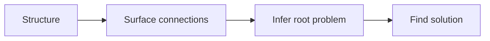
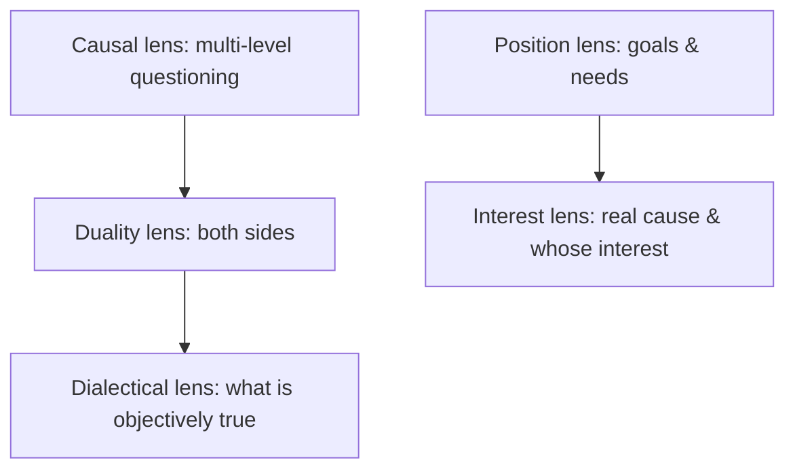

# The Five Lenses: Connection-Oriented Problem Location

**Version:** 0.1 (preprint)
**Date:** 2026-08-15
**Type:** Framework paper, and a position paper as well.

## Abstract

Many plans ultimately fail not because they were executed poorly, but because they answered a **surface problem** rather than a **root problem**. Structured thinking is commonly treated as an expression technique — conclusion first, mutually exclusive and collectively exhaustive — but its real value lies elsewhere: once structure makes thinking explicit, a person can then discover the connections between things, follow those connections to infer the root problem, and finally find a solution that genuinely targets it.

This paper proposes a **connection-oriented problem-location method (the Five Lenses)**: a four-stage main line — Structure → Surface connections → Infer root problem → Find solution — paired with a set of five perspective lenses (the five lenses: causal, duality, dialectical, position, interest). Structuring (the Pyramid Principle, MECE, induction and deduction) turns raw material into checkable propositions; the five lenses discover the connections in that material — the first three lenses look at the "thing" (causal = multi-level questioning, duality = both sides, dialectical = stepping outside both sides to see what is objective), and the last two look at the "person" (position = goals and needs, interest = the real cause and whose interest).

The method's claim can be tested this way: **rewriting a surface problem through the five lenses should produce a solution that differs from the original one and is better aligned with the underlying constraint; if the rewritten solution is unchanged, then either the problem does not live at the level of "connections" at all, or the wrong lens was applied.**

This paper is a framework paper and reports no new experimental data. It gathers the thinking tools scattered across the field (the Pyramid Principle, MECE, 2×2, decision matrix, 5W2H, SMART, STAR, 5 Whys / fishbone diagram, Golden Circle, Toulmin) together with the discipline of "no investigation, no right to speak," folds them into the four-stage main line, and makes explicit which step each tool serves, what problem it solves, and where its boundaries lie.

**Keywords:** structured thinking; problem location; five lenses; causal; dialectical; position; interest; decision-making

## 1. The problem: why solutions are often "correct but useless"

A familiar scene: a team pours great effort into a solution that is logically tight, well-argued, and executed without major mistakes — yet it fails to solve the problem. In the retrospective it often turns out that **the solution was internally consistent, but it was aimed at a different problem**.

I have made this mistake myself: seeing an engineer stop proactively suggesting improvements, my first reaction was "has he lost his drive?" I later realized the real reason was almost never about attitude — he no longer believed any promise would be kept. On the surface it was attitude; underneath it was the system.

Classic teaching of structured thinking mostly stops at the level of "saying things clearly": conclusion first, group and categorize, mutually exclusive and collectively exhaustive. This training makes a report easier to follow, but it does not necessarily help a person ask the right question. Because **structure only solves "making things explicit," not "what to make explicit"** — writing a wrong assumption into a neat table does not reduce the error; it only makes it harder to spot.

The problem this paper addresses is not "how to express things in an organized way," but this: **once a person has structured the material, how to go further and find the connections within it, infer the root problem, and aim the solution at it.** In other words, structuring is the means; location is the end.

## 2. Method overview: one main line, five lenses

The skeleton of the Five Lenses method is a four-stage main line:



| Stage | Action | Output | Tools responsible |
| --- | --- | --- | --- |
| 1 · Structure | Turn scattered material into checkable propositions | Four kinds of propositions: conclusion, evidence, assumption, next step | Pyramid Principle, MECE, induction/deduction, 5W2H, Golden Circle |
| 2 · Surface connections | Use the five lenses to bring out the relations in the material | Causal chains, both sides, objective facts, goals and needs, the real cause | The five lenses (core contribution) |
| 3 · Infer root problem | Distinguish surface from root | One refutable statement of the root problem | Toulmin argumentation |
| 4 · Find solution | Aim the solution at the underlying constraint | Verifiable, assignable actions | Decision matrix, trade-offs, SMART, no investigation no right to speak, STAR |

The five lenses are the core of the method. They are not five cards laid side by side; they are two groups with an internal structure:

- The first three lenses look at the "thing" in a progression: the Causal lens (multi-level questioning), the Duality lens (both sides), the Dialectical lens (stepping outside both sides to see what is objective). First find the cause, then look at both sides, and finally return to the facts.
- The last two lenses look at the "person": the Position lens (their goals and needs) and the Interest lens (the real cause and whose interest). The former looks at stated needs; the latter pursues the real motive.
- The Dialectical lens is the antidote to the Duality lens: the Duality lens lays out both sides, while the Dialectical lens steps outside both and asks "what is objectively true."



A criterion that runs through the whole paper: **whether the solution is aimed at the "underlying constraint."** The underlying constraint is the one cause or structural condition that explains and governs several surface symptoms; a solution aimed at it stays effective, while a solution aimed at the symptoms merely lets the problem reappear in a different form.

## 3. Stage 1 · Structure: turn material into checkable propositions

The sole purpose of structuring is **to make thinking jointly inspectable** — so that another person can point precisely at which cell they disagree with: "conclusion," "evidence," "assumption," or "next step." If it does not meet this standard, it is merely "organized-looking."

### 3.1 The Pyramid Principle: conclusion first, governed from above

The Pyramid Principle offers four steps: **conclusion first, governed from above, grouped into categories, logical progression**. In a managerial setting its most direct value is reporting upward and assigning downward: state the conclusion first, then the support, and finally what you need the other person to do.

Why the "conclusion + three supporting points" shape works has a frequently cited cognitive explanation: human working memory can only hold about 7±2 chunks at a time (Miller, 1956). Packing information into 3–4 chunks is what lets the other person hold it. Grouping is not aesthetics; it is a cognitive constraint. (This "7±2" claim remains debated in cognitive science; here it serves only as a lay explanation, not as a load-bearing argument.)

### 3.2 MECE: mutually exclusive, collectively exhaustive

The quality standard for decomposing a problem is MECE — **mutually exclusive, collectively exhaustive**: the parts do not overlap with each other (exclusive), and together they cover everything (exhaustive). Two counterexamples are most common: **overlap** ("poor user experience" decomposed into "slow loading," "hard to use," and "ugly page," where "hard to use" and "ugly" blur into each other), and **omission** (decomposing the "Q3 growth target" only into new-user acquisition and retention, leaving out win-back of old customers and average order value).

MECE solves "decompose completely," but it does not solve "after decomposing, which piece to check first." The dozens of pieces it produces need **hypothesis-driven** ordering: list the 1–2 most likely hypotheses and verify those first, rather than spreading effort evenly. This moves MECE from "decomposition" to "investigation."

### 3.3 Induction and deduction: the two legs of progression, and induction's trap

The Pyramid Principle speaks of "logical progression," but progression actually has two kinds: **deduction** (major premise → minor premise → conclusion, where the conclusion is necessary) and **induction** (generalizing from cases to a class, where the conclusion is only probable). Managers doing attribution — performance judgments, incident retrospectives — rely heavily on induction, and induction fears **small samples** most: "two quarters in a row below target, so this person is no good" directly turns a tiny sample into a rule. What structuring must do at this step is rewrite "this looks like a trend" back into "we currently have N samples, not yet enough to rule out chance."

### 3.4 Completeness checks: 5W2H and the Golden Circle

At the structuring stage, two tools handle "don't miss anything" and "don't put the cart before the horse":

- **5W2H** (What/Why/Who/When/Where/How/How much) is a completeness checklist, useful before starting to confirm the problem statement has no missing dimension. It is plain but useful — plain in that it produces no insight, useful in that it catches omissions.
- **The Golden Circle** (Why—How—What) forces "ask why before discussing how." When a manager assigns a task, explaining the meaning behind the goal (Why) first, then the path (How) and the deliverables (What), significantly reduces "finishing only to discover the direction was wrong."

The output of Stage 1 is a set of **checkable propositions**: what the conclusion is, which facts it depends on, which assumptions are still unverified, and what the reader should do next. If one of these cannot be written down, the right move is to gather more evidence or narrow the problem, not to write longer text.

## 4. Stage 2 · The five lenses: discovering connections in the material

After structuring, the material is explicit, but the connections have not yet been pointed out. The five lenses are five "ways of looking," each bringing one kind of connection to light.

### 4.1 The Causal lens: multi-level questioning

The core of the Causal lens is **multi-level questioning**. Its question is: "Why did this happen?" Then, for every answer, keep asking "why" again, digging down level by level until you reach a level you can dig no further. The tools paired with it are **5 Whys** (asking "why" five levels in a row) and the **fishbone / Ishikawa diagram** (listing possible causes along dimensions such as people, machine, material, method, and environment).

The misuse the Causal lens must guard against most is **treating correlation as causation**: two curves changing together only means it is worth investigating, not which causes which; temporal order is not causation either. In a retrospective, a manager should rewrite "it looks like A caused it" as "A is correlated with the outcome, but confounders have not been ruled out" — otherwise the attribution pollutes performance judgments and the next decision.

### 4.2 The Duality lens: what are the two sides

The Duality lens requires **laying out both sides**. Its question is: "What is the pro side of this matter? And what is the con side?" Seeing only one side makes the conclusion necessarily one-sided.

When an opposition can be placed on two dimensions, the Duality lens's most useful device is the **2×2 matrix**: take the two most important continuous dimensions, cross them at right angles, cut them into four cells, and force a judgment. "Urgent × Important" (the Eisenhower matrix) and "Gain × Loss" are two instances of the same device. **The 2×2 is itself a transferable meta-tool**: faced with a fuzzy ranking problem, first ask "what are the two most important dimensions affecting this judgment," then cross them — which of the four resulting cells is your default option is often the crux of the decision.

The misuse the Duality lens must guard against is **forced dichotomy** (false dichotomy): cutting a continuous spectrum into two essentially opposed categories and ignoring the middle ground. "Either fast or good" is often a false binary; the real answer often lies in between or depends on conditions.

### 4.3 The Dialectical lens: what is objectively true

The Dialectical lens requires **stepping outside both sides and asking what is objective**. Its question is: "Setting aside what each side says, what is the objective fact, really?"

The Dialectical lens is the antidote to the Duality lens: the Duality lens lays out pro and con, while the Dialectical lens steps outside both and returns to objective fact. The pro side says A is good, the con side says A is bad; objectively it is often "under what conditions A is good, and under what conditions it is bad." The dialectical judgment a manager needs most is **returning to the facts**: set the dispute over positions aside, confirm what the verifiable, reproducible objective part is, and only then discuss judgment.

The misuse the Dialectical lens must guard against is **using "dialectical unity" as a shield**: calling any conflict "both opposed and unified" is saying nothing at all. Dialectical judgment must land on **verifiable facts** — "what is objectively true" must point to specific, checkable facts, or it is just muddling through.

### 4.4 The Position lens: what are their goals and needs

The Position lens reveals **the goals and needs behind a judgment**. Its question is: "What is their goal? What is their need?"

For the same problem, different roles have different goals and needs: sales wants growth, finance wants costs under control, engineers want technical debt not to spiral — all of them may be telling the truth, yet they conflict with one another. The Position lens does not ask anyone to yield; it asks that **goals and needs be made explicit**: have each person state "in this position, what do I want to achieve and what am I afraid of losing." Many "disputes over facts" are at bottom two sides with different goals; once goals are on the table, the argument has a common coordinate system.

The misuse the Position lens must guard against is **turning position analysis into motive-guessing**: pointing out "what their goals and needs are" is useful, but guessing "what bad intentions they are hiding" usually just shuts the conversation down.

### 4.5 The Interest lens: the real cause and whose interest

The Interest lens reveals **the real cause and the attribution of interest behind the surface**. Its question is: "What is the real cause? Whose interest lies behind it?"

The Position lens asks "their goals and needs"; the Interest lens asks "the real cause and whose interest." A cross-department project stalls: on the surface it is "unclear responsibilities," but underneath it is usually misaligned interests — doing this gives department A extra workload, costs department B part of its budget, and strips department C of some say. The Interest lens corresponds to the intuition of **stakeholder analysis**: list the stakeholders and ask each in turn, "whose interest lies behind this, and what is the real cause?" Whether a solution actually lands is often not whether the solution itself is right, but whether it answers "why would the other party cooperate."

The misuse the Interest lens must guard against is **treating interest as the only reality**, sliding into the conspiracy theory that "everyone is calculating." Interest is one dimension that explains motive, not the whole; beyond interest there are also principle, inertia, and misunderstanding.

### 4.6 Combining the five lenses

The five lenses can be combined into one exercise: take a problem statement that has been structured, and ask in order —

1. Why did it happen? Keep asking down level by level. (Causal)
2. What are the pro and con sides? (Duality)
3. What is objectively true? (Dialectical)
4. What are their goals and needs? (Position)
5. What is the real cause? Whose interest? (Interest)

The output of the five lenses is not five observations standing side by side, but **one connection that has been identified**: typically "a certain underlying constraint that, through a certain mechanism, explains several surface symptoms at once."

## 5. Stage 3 · Infer the root problem: distinguishing surface from root

A surface problem is a **directly visible symptomatic statement** ("retention dropped," "the project is delayed," "communication is poor"); a root problem is **the constraint or root cause that explains and governs several surface symptoms**. The value of the five lenses is precisely to carry a person from the former to the latter.

A root problem usually appears in five forms, each corresponding to one of the five lenses:

| Form | What the root problem looks like | Corresponding lens |
| --- | --- | --- |
| Causal | The symptom is the result; the root is the root cause upstream in the chain | Causal lens |
| Structural | On the surface a dispute over countermeasures; underneath, the conditions under which each side actually holds | Duality lens |
| Objective | On the surface a dispute between pro and con; underneath, what the objective fact actually is | Dialectical lens |
| Perspective | On the surface a dispute over facts; underneath, two sides with different goals and needs | Position lens |
| Motive | On the surface a dispute over solutions; underneath, the real cause and the attribution of interest | Interest lens |

To judge whether a problem is surface or root, there are two operable tests:

- **The swap-the-solution test**: if you swap out the surface-level solution and the problem still exists, you have not reached the root yet.
- **The counter-question test**: for every "problem," keep asking "why is this a problem" (chasing causality), "what are their goals and needs" (chasing position), "the real cause and whose interest" (chasing interest). The level where you can ask no further is usually the root.

At this step one should also run a **Toulmin check**: decompose a conclusion into the five parts "claim — data — warrant — qualifier — rebuttal" and see which part collapses. If it collapses at "data," the evidence is insufficient; if at "warrant," the reasoning is flawed; if at "rebuttal," the counter-side was not seriously considered. It can pinpoint why an argument fails to stand, rather than vaguely saying "it's wrong."

The output of Stage 3 is **one refutable statement of the root problem**, not an assertion that "the root cause has been found." Refutable means it spells out "under what conditions I would admit this judgment is wrong."

## 6. Stage 4 · Find the solution: aim it at the underlying constraint

After the root problem is located, the work of the solution is to **aim at the underlying constraint**, not to keep optimizing symptoms. The tools at this step are decision and execution tools.

### 6.1 Decision matrix and weighted scoring: rank candidates explicitly

When there are multiple candidate solutions, use a **decision matrix** to score each on several dimensions, then weight by importance to get an explicit ranking. Its value is not in the scores themselves but in **forcing people to lay out the implicit criteria of "why I chose it"**: how the dimensions are chosen and how the weights are set are the decision-maker's real priorities. Weighted scoring is not an objective referee; it makes subjective judgment inspectable.

### 6.2 Trade-offs and opportunity cost: state what you gave up

**Trade-off** is decision discipline: explicitly saying "to get X, I gave up Y." Its rigorous form is **opportunity cost** — the cost of choosing A is not A's price, but the best thing among the B's you gave up. When managers make resource decisions, the real question is: "If we don't do this, what could the freed-up resources have done?" Writing that sentence into solution review filters out a great many solutions that are "correct but low priority." I have been stumped by this myself — after writing a "very complete" plan, when asked "why these and not some others," I could not state the basis of the trade-off.

### 6.3 SMART: bring the solution down to verifiable, assignable granularity

A solution must ultimately become actions, and actions must be verifiable. **SMART** (Specific, Measurable, Achievable, Relevant, Time-bound) rewrites an unverifiable statement like "improve user experience" into "raise the first-load completion rate from 82% to 95% before June, without increasing wait for the upper segments." This is the natural landing point of structured thinking in Stage 4 — the output of thinking must land at verifiable granularity.

### 6.4 No investigation, no right to speak

**"No investigation, no right to speak"** is a more fundamental discipline: before drawing a conclusion about a problem, go investigate the facts first, rather than adopting a position and then hunting for evidence. It fills in exactly the "which assumptions are unverified" slot among Stage 1's four questions — many solutions fail not because the solution itself is wrong, but because it rests on a premise that was never investigated yet was treated as fact. I once treated "just hold on a little longer" as a solution, until a late-night release incident made me realize that what was being overdrawn was not one person's willpower, but the gap in the capacity system.

### 6.5 STAR: make retrospectives and expression inspectable

**STAR** (Situation—Task—Action—Result) is used in retrospectives, promotion defenses, and interview answers; its essence is decomposing an experience into four inspectable cells: the situation at the time, the task you had to accomplish, the actions you took, and the results they produced. It is isomorphic to this paper's main line — rewriting a scattered narrative into a structure where "others can point out which cell they disagree with."

## 7. Falsifiable claims and research boundaries

The method-level claims of this paper can be written as several **testable predictions**. Each tries to give an executable criterion for judgment, rather than stopping at slogans:

1. **The rewrite test**: rewriting a surface problem through the five lenses should produce a solution different from the original and closer to the underlying constraint. Operationalized: take N real problems (N≥10 recommended), and have two managers who are unaware of the method independently judge "whether the root problem produced by the five lenses differs from the original statement and is closer to the constraint"; if at least 3/5 of the cases are judged "different and closer," the claim holds; otherwise, the five lenses do not apply in that problem domain.
2. **The location test**: after "Stage 3 discrimination," a team's discussion shifts from "which solution to pick" to "what the underlying constraint is." Operationalized: compare the share of time spent on "solution disputes" versus "constraint disputes" in discussion records of the same batch of problems, and the number of "rework episodes caused by misjudging the root cause"; both should decline with use.
3. **The structure test**: the mark of structure being in place is that another person can point precisely at which of "conclusion, evidence, assumption, next step" they disagree with. Operationalized: hand the structured output to someone who was not involved in the process and ask them to mark the "cell" they disagree with; if they can only say vaguely "this is wrong" without pointing to a cell, the structure has not met the standard.

These three predictions are **not yet verified by this paper** — Appendix C only demonstrates how the method runs and does not constitute evidence; they are the testing standards left for subsequent empirical work, not conclusions already measured.

**Research boundaries**, which must be stated honestly:

1. This paper is a framework paper and reports no new experimental data; the "testable predictions" above are method-level expectations, not conclusions already measured.
2. The five lenses are **heuristic lenses, not an algorithm**: they help you ask the right question, but they cannot answer domain facts for you.
3. **The five lenses make no claim to completeness** — there may be a sixth or seventh perspective; what this paper gives is the five most-used categories repeatedly validated in the author's practice, not a closed list.
4. The decoupling of the Five Lenses method from worldview: its validity rests only on falsifiable tests, not on any philosophical, religious, or political position.
5. No thinking method can replace domain knowledge and first-hand information: after the five lenses ask a good question, the answer still has to come from the facts.

### 7.1 This paper's method

This paper adopts the method of **practical induction + conceptual analysis + falsifiability**: the five lenses come from the convergence of the author's long-term reading (mainly history) and practical retrospectives; the paper draws explicit distinctions among concepts such as "surface/root," "connection," and "structuring"; the validity of the whole method is judged solely by the testable predictions of Section 7, not by any authority or worldview. This paper is therefore neither deduced from axioms nor the result of experimental measurement, but an operational framework that can be adopted and can also be overturned.

## 8. Relation to related work

The Five Lenses method is not a replacement for any existing system, but the enlistment and reordering of a set of mature concepts. The table below is for positioning, not endorsement:

| Concept / tool | Source | Position in the Five Lenses method |
| --- | --- | --- |
| Pyramid Principle | Minto (*The Pyramid Principle*) | Stage 1: the parent framework of structuring |
| MECE | McKinsey consulting practice | Stage 1: the quality standard of decomposition |
| Induction / deduction | Classical logic | Stage 1: the two legs of progression; beware of small-sample induction |
| Working memory 7±2 | Miller (1956) | Stage 1: explains why grouping works |
| 5W2H | Common management practice | Stage 1: completeness check |
| Golden Circle | Sinek (*Start With Why*) | Stage 1: ask Why first, then How/What |
| 5 Whys / fishbone diagram | Toyota Production System / Ishikawa | Stage 2: the Causal lens |
| 2×2 matrix (Eisenhower) | Time-management / prioritization practice | Stage 2: the Duality lens's meta-device |
| Toulmin model of argument | Toulmin (1958) | Stage 3: structural check of arguments |
| Stakeholder analysis | Management practice | Stage 2: the Interest lens |
| Decision matrix / weighted scoring | Decision-analysis practice | Stage 4: explicit ranking of candidates |
| Opportunity cost | Economics | Stage 4: the rigorous form of trade-offs |
| SMART | Doran (1981) | Stage 4: verifiable granularity of action |
| No investigation, no right to speak | Common research method | Stage 4: investigate facts before concluding |
| STAR | Behavioral-interview / retrospective practice | Stage 4: structure of retrospectives and expression |

Compared with the tools above, the Five Lenses method's incremental contribution lies not in the tools themselves but in **using one main line of "structure → connection → root → solution" to organize the scattered tools into a machine that has order, outputs, and falsifiability** — each tool is for the first time explicitly hung at the step where it belongs, with its boundaries spelled out. This is what distinguishes this paper from a "thinking-tools cheat sheet."

### 8.1 Correspondences of the five lenses in existing research

Taken individually, each of the five lenses has a mature correspondence in psychology and the social sciences; this paper's increment is packaging them into one operable problem-location checklist, together with a grouping and a progression. The key academic roots are as follows:

| Five lenses | Corresponding existing research | Relation to this paper |
| --- | --- | --- |
| Causal lens | Attribution theory (Heider 1958; Kelley 1967), causal inference (Pearl) | Operationalizes "finding the cause" into an executable chain of questioning |
| Duality lens | Structuralist binary oppositions, CBT's "all-or-nothing" cognitive distortion (Beck) | Makes both sides explicit; CBT also warns that "forced dichotomy" is a cognitive distortion |
| Dialectical lens | Naive dialecticism (Peng & Nisbett 1999), holistic cognition (Nisbett 2003), dialectical thinking (Basseches 1984) | "Step outside both sides to see what is objective" corresponds to East Asian cognition's tolerance of contradiction and "taking the middle" |
| Position lens + Interest lens | Negotiation theory positions vs interests (Fisher, Ury & Patton 1981), stakeholder theory (Freeman 1984) | The Position lens asks the stated goals and needs; the Interest lens pursues the real cause and whose interest — corresponding to the "don't stop at positions, ask about interests" distinction |

Among these, Beck ("all-or-nothing") and Basseches (dialectical thinking) serve as cross-disciplinary auxiliary references — used to show that these perspectives have already been touched in existing research, not as load-bearing arguments for this paper's validity; the Miller reference in 3.1 (working memory 7±2) is likewise only a lay explanation. In the Chinese management context, the Dialectical lens has a corresponding expression — Ren Zhengfei's idea of "grayness" (*Openness, Compromise, and Grayness*), the notion that "clear direction emerges from grayness"; it points the same way as "step outside both sides to see what is objective" ("gray cognition, black-and-white decision" is a later folk summary, not the original text).

Furthermore, the most famous precedent in management for "viewing the same object through multiple lenses" is Bolman & Deal's four frames (structural / human resources / political / symbolic), and de Bono's Six Thinking Hats is of the same kind; but they look at organizations or meetings, while the five lenses look at problems — a different granularity.

### 8.2 Methodological stance: decoupling method from worldview

The five lenses are angles for observing problems, not a philosophy or a faith. This paper advocates no philosophical, religious, or political position; **a reader who rejects every aspect of the author's worldview can still use the Five Lenses method** — its validity comes from the testable predictions of Section 7, not from any worldview.

### 8.3 Differences from full-process methods

A sharper question still needs answering: the market already has several full-process methods that go "from current state to root cause to solution." What does the Five Lenses method add, and what does it lack, relative to them? The table below aligns them one by one (sources for KT, TRIZ, and Senge are in the references, all verified; this is positioning comparison only, not endorsement):

| Framework | Its process | What the Five Lenses method adds | What the Five Lenses method lacks |
| --- | --- | --- | --- |
| Kepner-Tregoe (KT) | Situation appraisal → problem analysis → decision analysis → potential problem analysis | The five lenses give "problem analysis" an explicit layer of lenses (especially position/interest, which KT does not emphasize) | Lacks KT's "potential problem analysis (PPA)" |
| Toyota A3 | Current state → root cause → countermeasure → follow-up (one page) | Breaks "root cause" into five kinds of connection, rather than a single 5 Whys | Less convergent than A3 and less convenient for on-site execution |
| Six Sigma DMAIC | Define → measure → analyze → improve → control | Suits problems with insufficient data and that lean on people and judgment; DMAIC depends on data | Lacks DMAIC's statistical tools and quality control |
| TRIZ contradiction matrix | Technical/physical contradiction → inventive principles | Covers both "thing" and "person" connections; TRIZ handles only technical contradictions | Lacks TRIZ's library of inventive principles |
| Systems thinking (Senge, *The Fifth Discipline*, 1990) | Find feedback loops; find "structure," not "people" | Lighter; requires no modeling | Lacks the quantitative modeling power of system dynamics |
| Design thinking | Empathize → define → ideate → prototype → test | Locates the problem; design thinking mainly produces and iterates solutions | Lacks prototyping and user testing |
| First principles | Decompose to basic facts that can be broken down no further | Adds a layer of "connection," not just decomposition | Less direct than first principles for physics/engineering problems |

Positioning in one sentence: **the Five Lenses method does not replace these full processes; it patches the one link they share as a weakness — at the "analysis" step, making connections (causal/duality/dialectical/position/interest) explicit and landing them in a single actionable question.** For data-rich, quantifiable problems, DMAIC or A3 is more appropriate; for problems that lean on people and judgment and lack data, the Five Lenses method is lighter and more general.

## 9. Conclusion

Structured thinking is not "the look of being organized," but making thinking jointly inspectable. Yet inspection is only the starting point: once structure makes thinking explicit, the real value lies in surfacing connections, inferring the root problem, and finding a solution aimed at it.

The Five Lenses method combines these four steps into one repeatable path: first structure (separate conclusion, evidence, assumption, and next step), then use the five lenses to bring out connections (causal, duality, dialectical, position, interest), then distinguish surface from root, and finally aim the solution at the underlying constraint. This path does not guarantee a correct answer — no method can — but it guarantees this: when you arrive at a wrong answer, others can point out which cell the error sits in, and you yourself know which step to return to and redo.

This paper is the "argument" version of the method; readers who just want to apply it can see the practical version, [*Structured Thinking in Practice*](/writing/2026/08/structured-thinking-practice/).

## References

> This section is a collation of concept attribution and public sources. The main sources (KT, TRIZ, Senge, Peng & Nisbett, Fisher & Ury, Ren Zhengfei's "grayness") have been verified; classic concepts such as Minto, Miller, and Beck are cited per common practice, and those without a stable public URL are given by original book/text.

1. Minto, B. (1987). *The Pyramid Principle: Logic in Writing and Thinking*. Source of the Pyramid Principle for structured expression.
2. Miller, G. A. (1956). "The Magical Number Seven, Plus or Minus Two: Some Limits on Our Capacity for Processing Information." *Psychological Review*, 63(2). The classic study of working-memory capacity and chunking.
3. Toulmin, S. (1958). *The Uses of Argument*. Source of the "claim—data—warrant—qualifier—rebuttal" structure of argument.
4. Doran, G. T. (1981). "There's a S.M.A.R.T. Way to Write Management's Goals and Objectives." *Management Review*. Source of the SMART goal criteria.
5. Sinek, S. (2009). *Start With Why*. Source of the Golden Circle (Why—How—What).
6. Ishikawa, K. The Ishikawa diagram (fishbone/cause-and-effect diagram) for causal attribution in quality management.
7. Ohno, T. / Toyota Production System. 5 Whys as an on-site method for tracing root causes.
8. McKinsey consulting practice. MECE (mutually exclusive, collectively exhaustive) and hypothesis-driven problem decomposition.
9. The Eisenhower matrix. A common practice of dividing priorities with an "Urgent × Important" 2×2 (often attributed to Eisenhower and spread through Covey).
10. Heider, F. (1958). *The Psychology of Interpersonal Relations*. The founding work of attribution theory.
11. Kelley, H. H. (1967). Attribution theory in social psychology. The covariation model of attribution.
12. Peng, K., & Nisbett, R. E. (1999). [Culture, Dialectics, and Reasoning About Contradiction](https://www.semanticscholar.org/paper/Culture,-dialectics,-and-reasoning-about-Peng-Nisbett/073c71e1972025e05eb69f0e992b28aa68bfc7b1). *American Psychologist*, 54(9), 741–754. Naive dialecticism: East Asian cognition's tolerance of contradiction and "taking the middle."
13. Nisbett, R. E. (2003). *The Geography of Thought*. East-West differences in holistic vs analytic cognition.
14. Basseches, M. (1984). *Dialectical Thinking and Adult Development*. Dialectical thinking in adult cognitive development.
15. Fisher, R., Ury, W., & Patton, B. (1981). *Getting to Yes: Negotiating Agreement Without Giving In*. The positions vs interests distinction in negotiation theory.
16. Freeman, R. E. (1984). *Strategic Management: A Stakeholder Approach*. Stakeholder theory.
17. Bolman, L. G., & Deal, T. E. *Reframing Organizations*. The four frames for viewing organizations through multiple lenses (structural / human resources / political / symbolic).
18. Beck, A. T. *Cognitive Therapy and the Emotional Disorders*. The source of "all-or-nothing" (dichotomous thinking) as a cognitive distortion.
19. Liyuk (2023). [When resources are short, how to keep the team from running on overdraft](https://github.com/Liyuk/liyuk.github.io/blob/main/src/content/writing/2023/03/working-under-resource-constraints/zh.md). Writing on this site; the original source of the full Appendix C case "slow support team response."
20. Liyuk (2023). [When a person loses motivation, what can a manager do](https://github.com/Liyuk/liyuk.github.io/blob/main/src/content/writing/2023/03/when-a-team-member-loses-motivation/zh.md). Writing on this site; the original source of the second example at the end of Appendix C.
21. Senge, P. M. (1990). *The Fifth Discipline: The Art & Practice of the Learning Organization*. Currency Doubleday. The classic source of systems thinking and the learning organization.
22. Altshuller, G. TRIZ (Theory of Inventive Problem Solving): technical/physical contradictions, the contradiction matrix, and the 40 inventive principles, developed from the 1940s onward.
23. Kepner, C. H., & Tregoe, B. B. The four Kepner-Tregoe steps of problem solving and decision making: situation appraisal (SA) → problem analysis (PA) → decision analysis (DA) → potential problem analysis (PPA).
24. Ren Zhengfei. *Openness, Compromise, and Grayness*. The source of the "grayness" management idea ("clear direction emerges from grayness").

## Appendix A: tool quick-reference

| Tool | Which step it belongs to | What it solves | Common misuse |
| --- | --- | --- | --- |
| Pyramid Principle | Stage 1 | Conclusion first, grouping, logical progression | Applying the shape only, without supplying evidence |
| MECE | Stage 1 | Decomposition that is mutually exclusive and collectively exhaustive | Decomposed fully but no idea which piece to check first |
| Induction/deduction | Stage 1 | The two logics of progression | Treating small-sample induction as a rule |
| 5W2H | Stage 1 | Completeness of the problem statement | Universal but plain, diluting the main line |
| Golden Circle | Stage 1 | Why first, then How/What | Only stating Why, never How |
| 5 Whys / fishbone diagram | Stage 2 · Causal lens | Tracing the causal chain | Correlation as causation, temporal order as causation |
| 2×2 matrix | Stage 2 · Duality lens | Crossing two dimensions into four cells | Forced dichotomy, ignoring the continuous spectrum |
| Toulmin argumentation | Stage 3 | Checking claim—data—warrant—rebuttal | Treating it as rhetoric only, not doing the structural check |
| Decision matrix / weighted scoring | Stage 4 | Explicit ranking of candidates | Treating subjective weights as objective scores |
| Trade-off / opportunity cost | Stage 4 | Stating what was given up | Listing only benefits, never the items given up |
| SMART | Stage 4 | Landing action at verifiable granularity | Goal measurable but not aimed at the root |
| No investigation, no right to speak | Stage 4 | Investigate facts before concluding | Position first, then evidence |
| STAR | Stage 4 | Retrospectives and expression made inspectable | Only actions, no results |

## Appendix B: minimum deliverables checklist

To start using the Five Lenses method from scratch, four minimal deliverables are enough:

```text
1. 结构化命题卡（结论 / 证据 / 假设 / 下一步，四格）
2. 五镜问句清单（因果 / 二元 / 辩证 / 立场 / 利益，各一句）
3. 底层问题陈述（一条可反驳的陈述，含"什么条件下我承认错了"）
4. 对准检查（方案是否对准底层约束，而非表层症状）
```

You do not need to use every tool at once. Start from a real, scattered problem description and run one small closed loop of "Structure → five lenses → distinguish surface/root → aim the solution," which is usually more valuable than finishing an entire book of tools.

## Appendix C: a complete worked example

> The case comes from the author's already-published practical article *When resources are short, how to keep the team from running on overdraft* [19], walked through here in full with the Five Lenses method. It demonstrates how the method runs and does not constitute evidence of validity (consistent with Section 7's "no experimental data reported").

**Original statement (before)**

> A partner complained that the support team "responds slowly"; the on-duty person was asked to "reply faster."

**Stage 1 · Structure**

| Cell | Content |
| --- | --- |
| Conclusion | The support team "responds slowly" |
| Evidence | The partner's complaint (a statement, no data yet) |
| Assumption | The "slowness" is because the on-duty person processes slowly |
| Next step | First record a week of actual requests, then conclude |

Note that "assumption" and "next step" are separate: the conclusion is left hanging, without rushing to attribute it to a person.

**Stage 2 · The five lenses**

1. **Causal lens (multi-level questioning)**: Why "slow"? — After recording for a week, it turned out most requests were not processed slowly, but lacked necessary information at submission, and back-and-forth clarification took half the time. Why so much clarification? — The submission entry point did not require complete information.
2. **Duality lens (both sides)**: The pro side says "the on-duty person should reply faster"; the con side says "the submitter should provide complete information first." The two sides oppose each other, but neither is at the root.
3. **Dialectical lens (what is objectively true)**: The objective fact is that week's data — "most requests were not processed slowly; clarification took half the time." Return to the data, not to either side's impression.
4. **Position lens (goals and needs)**: The complainant wants "fast"; the support team wants "complete information before we can be fast." Both goals are valid; the conflict is at the entry point, not in the people.
5. **Interest lens (real cause / whose interest)**: The real cause is a defect in the entry point and the triage rules; what is sacrificed is both sides' efficiency, and what benefits is the inertia of "keeping things as they are."

**Stage 3 · Infer the root problem**

- Surface problem: "The support team responds slowly" (a judgment about the team).
- **Swap-the-solution test**: if we only "require faster replies," the problem remains — with incomplete information, no matter how fast, there will still be back-and-forth clarification, so it has not reached the root.
- Root problem: the submission entry point lacks necessary information and there is no triage rule, so the cost of clarification gets charged to "response."

**Stage 4 · A solution aimed at the root**

- **Trade-off**: fix the entry point (require complete information at submission) + establish triage rules; give up "adding staff" and "urging faster."
- **SMART**: reduce "the share of requests missing necessary information" to a target value within two weeks, and track the time from "first response to resolution."
- **No investigation, no right to speak**: the premise on which the whole case stands is that "one week of recording" — investigate first, then conclude.

**The structure test**

After the revision, a reader can point precisely at which cell they disagree with: whether it is the "evidence" (one week's sample is not enough), the "assumption" (it may not be an entry-point problem), or the "next step" (fix the entry point first). This is what "jointly inspectable" means.

**Another instance of the same pattern**: the author's other article *When a person loses motivation, what can a manager do* [20] has the same structure — on the surface the engineer "avoids new tasks and looks irresponsible"; underneath, "promises keep being pushed aside by urgent incidents, and he no longer believes any promise will be kept." The two sides are "he lacks drive" vs "the environment let him down"; the objective fact is "the last three tasks were all completed on time; he just rarely suggests improvements." On the surface it is a judgment about attitude; underneath it is a problem of the system.

## Author information and declarations

**Author:** Liyuk

**Conflicts of interest:** The author declares no conflicts of interest. This research received no funding from any commercial institution; the frameworks and tools cited serve only as methodological or directional reference, and do not constitute endorsement of any commercial product or consulting firm.

**Data availability:** This paper is a framework paper and reports no new experimental data. All tool names, attributions, and sources cited are a collation of public concepts; the main sources have been verified, and classic concepts are given by original book/text.

## Glossary

| Term | Definition |
| --- | --- |
| Structuring | Explicitly separating conclusion, evidence, assumption, and next step so that thinking can be jointly inspected |
| Connection | An identifiable causal, two-sided, objective-fact, goals-and-needs, or interest relation between things |
| Five lenses | The five perspective lenses: causal, duality, dialectical, position, interest |
| Surface problem | A directly visible symptomatic statement |
| Root problem | The constraint or root cause that explains and governs several surface symptoms |
| Underlying constraint | The one cause or structural condition that explains and governs several surface symptoms |
| Five Lenses method | A connection-oriented problem-location method: Structure → surface connections → infer root problem → find solution |
| Joint inspection | Another person can point precisely at whether they disagree with the conclusion, the evidence, the assumption, or the next step |
