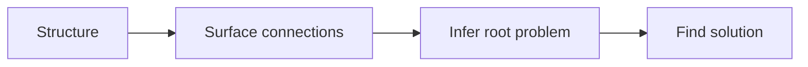
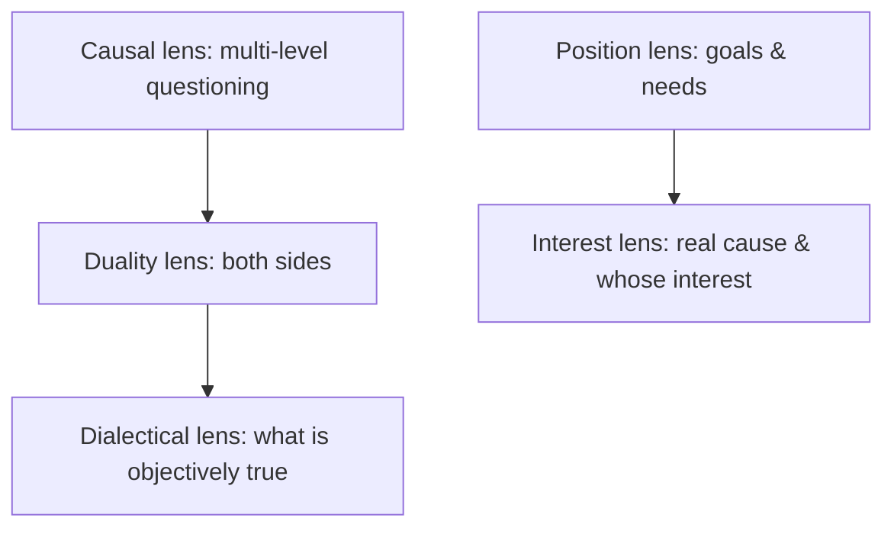

# 五镜法：联系导向的问题定位

**版本：** 0.1（preprint）
**日期：** 2026-08-15
**类型：** 方法框架论文（framework paper），兼立场论文

## 摘要

很多方案最终失效，不是因为执行得不够好，而是因为它回答的是一个**表层问题**，而不是**底层问题**。人们普遍把结构化思维当作表达技巧——结论先行、不重不漏——但它真正的价值在于：结构把思考显式化之后，人才能进一步发觉事物之间的联系，顺着联系推论出底层问题，进而找到真正针对它的解决方案。

本文提出一种**联系导向的问题定位方法（五镜法）**：一条四阶段主线——结构化 → 发觉联系 → 推论底层问题 → 找到解决方案——与一套五视角透镜（五镜：因果、二元、辩证、立场、利益）。结构化（金字塔、MECE、归纳与演绎）负责把材料变成可检查的命题；五镜负责从材料中发现联系——前三镜看"事"（因果＝多层追问、二元＝正反两面、辩证＝跳出两面看客观），后两镜看"人"（立场＝目的与需求、利益＝真正原因与谁的利益）。

方法的主张可以这样检验：**用五镜重写一个表面问题，应当产出与原方案不同、且更对准底层约束的解决方案；若重写后方案不变，则要么问题本就不在"联系"这一层，要么视角用错了。**

本文是一篇方法框架论文，不报告新的实验数据。它把市面上散落的思维工具（金字塔、MECE、2×2、决策矩阵、5W2H、SMART、STAR、5 Whys/鱼骨图、黄金圈、图尔敏）与"没有调查就没有发言权"的纪律，收编进四阶段主线，并明确每个工具服务于哪一步、解决什么问题、边界在哪里。

**关键词：** 结构化思维；问题定位；五镜；因果；辩证；立场；利益；决策

## 1. 问题：为什么方案常常"正确但没用"

一个常见的场景：团队花了很多力气做出的方案，逻辑严密、论证充分、执行也没出大错，最后却没有解决问题。复盘时往往发现，**方案本身是自洽的，但它对准的是另一个问题**。

我自己就犯过这类错：看到一个工程师不再主动提改进，第一反应是"他是不是不上进了"。后来发现，真实原因几乎从不在态度上——是他不再相信任何承诺会被兑现。表面是态度，底层是机制。

结构化思维的经典教法，大多停留在"把话说清楚"这一层：结论先行、归类分组、不重不漏。这些训练能让一份汇报更容易被听懂，却不一定能让一个人问对问题。因为**结构只解决"显式化"，不解决"往哪里显式"**——把错误的假设写成一页漂亮的表格，错误并不会变少，只是变得更难发现。

本文要处理的问题不是"如何表达得有条理"，而是：**当一个人已经把材料结构化之后，怎样进一步从材料里找出联系、推论出底层问题，并让解决方案对准它。** 换句话说，结构化是手段，定位才是目的。

## 2. 方法总览：一条主线，五面透镜

五镜法的骨架是一条四阶段主线：

| 阶段 | 动作 | 产物 | 负责的工具 |
| --- | --- | --- | --- |
| 一 · 结构化 | 把散乱材料变成可检查的命题 | 结论、证据、假设、下一步四类命题 | 金字塔、MECE、归纳/演绎、5W2H、黄金圈 |
| 二 · 发觉联系 | 用五镜照出材料之间的关联 | 因果链、正反两面、客观事实、目的与需求、真正原因 | 五镜（核心贡献） |
| 三 · 推论底层问题 | 区分表层与底层 | 一条可反驳的底层问题陈述 | 图尔敏论证 |
| 四 · 找到解决方案 | 让方案对准底层约束 | 可验证、可分配的行动 | 决策矩阵、取舍、SMART、没有调查就没有发言权、STAR |

五镜是这套方法的核心。它们不是并列的五张牌，而是有内部结构的两群：

- 前三镜看"事"，是一个递进：因果镜（多层追问）、二元镜（正反两面）、辩证镜（跳出两面看客观）。先找原因，再看两面，最后回到事实。
- 后两镜看"人"：立场镜（他的目的与需求）、利益镜（真正原因与谁的利益）。前者看明面的需要，后者追真实的动机。
- 辩证镜是二元镜的解药：二元镜把正反两面摆出来，辩证镜跳出两面，问"客观是怎样的"。

一个贯穿全篇的判断标准：**方案是否对准了"底层约束"。** 底层约束是解释并支配多个表层症状的那一个原因或结构性条件；对准它的方案才会持续有效，对准症状的方案只是让问题换个样子再出现。

## 3. 阶段一 · 结构化：把材料变成可检查的命题

结构化的唯一目的是**让思考可被共同检查**——即他人能精确指出，他不同意的是"结论"、"证据"、"假设"还是"下一步"中的哪一格。达不到这个标准，就只是"看起来有条理"。

### 3.1 金字塔：结论先行，以上统下

金字塔原理给出四步：**结论先行、以上统下、归类分组、逻辑递进**。管理者场景里，它最直接的价值是向上汇报和向下布置：先说结论，再给支撑，最后给出需要对方做的事。

为什么"结论—三点论据"这种形状有效，有一个常被引用的认知解释：人的工作记忆一次只能扛住约 7±2 个组块（Miller, 1956）。把信息打成 3~4 个组块，对方才扛得住。归类分组不是审美，是认知约束。（这一"7±2"说法在认知科学里仍有争议，此处只作通俗解释，不作承重论据。）

### 3.2 MECE：不重、不漏

拆解问题的质量标准是 MECE——**相互独立、完全穷尽**：拆出来的各部分之间不重叠（独立），合起来覆盖全部（穷尽）。两个反例最常见：**有重叠**（"用户体验不好"拆成"加载慢""功能难用""页面丑"，其中"难用"和"丑"边界不清），**有遗漏**（拆"Q3 增长目标"只拆了拉新和留存，漏了老客召回与客单价）。

MECE 解决"拆得全"，但它不解决"拆完全之后先查哪一块"。拆出来的几十片需要**假设驱动**来排序：先列出最可能的 1~2 个假设去验证，而不是平均用力。这一条把 MECE 从"拆解"推进到"排查"。

### 3.3 归纳与演绎：递进的两条腿，以及归纳的坑

金字塔说"逻辑递进"，递进其实有两条：**演绎**（大前提→小前提→结论，结论必然）和**归纳**（从个案概括到一类，结论只具有或然性）。管理者做归因——绩效判断、事故复盘——大量依赖归纳，而归纳最怕**小样本**："连续两个季度没达标，所以这个人不行"，就是把极小的样本直接推成规律。结构化这一步要做的事，是把"这看起来是个趋势"改写回"目前有 N 个样本，还不足以排除偶然"。

### 3.4 完整性检查：5W2H 与黄金圈

在结构化阶段，有两个工具负责"别漏"和"别本末倒置"：

- **5W2H**（What/Why/Who/When/Where/How/How much）是一张完整性检查表，适合在启动前确认问题陈述没有缺维。它平庸但有用——平庸在它不产生洞察，有用在它能兜住遗漏。
- **黄金圈**（Why—How—What）强制"先问为什么再谈怎么做"。管理者布置任务时，先讲目标背后的意义（Why），再讲路径（How）与交付物（What），能显著减少"做完才发现方向不对"。

阶段一的产物是一组**可检查的命题**：结论是什么、依赖哪些事实、哪些假设还没验证、对方看完该做什么。如果其中一项写不出来，正确的动作是补证据或缩小问题，而不是先把文字写长。

## 4. 阶段二 · 五镜：从材料中发现联系

结构化之后，材料是显式的，但联系还没有被指出。五镜是五个"怎么看"，每一镜把一种联系照出来。

### 4.1 因果镜：多层追问

因果镜的核心是**多层追问**。它的问句是："这件事为什么会发生？"然后对每一个答案继续追问"为什么"，一层一层往下挖，直到挖到不能再挖的那一层。与之配套的工具是 **5 Whys**（连续追问五层"为什么"）和**鱼骨图/石川图**（按人、机、料、法、环等维度列出可能原因）。

因果镜最需要防的误用是**把相关当成因果**：两条曲线同时变化，只能说明值得调查，不能说明谁导致谁；时间先后也不等于因果。管理者在复盘时，应当把"看起来是 A 导致的"改写成"A 与结果相关，但尚未排除混杂因素"，否则归因会污染绩效判断与下一步决策。

### 4.2 二元镜：正反两面各是什么

二元镜要求**把正反两面都摆出来**。它的问句是："这件事的正方观点是什么？反方观点又是什么？"只看到一面，结论必然片面。

当对立可以落到两个维度上时，二元镜最有用的手法是 **2×2 矩阵**：把两个最重要的连续维度正交，切成四个格子，逼人下判断。"紧急×重要"（艾森豪威尔矩阵）和"收益×损失"是同一个手法的两个实例。**2×2 本身是可迁移的元工具**：面对一个模糊的排序问题，先问"影响这个判断的最重要的两个维度是什么"，再把它们正交——切出来的四格里，哪一格是你的默认选项，往往就是决策的关键。

二元镜要防的误用是**强行二分**（false dichotomy）：把连续谱硬切成本质对立的两类，忽略了中间地带。"要么快要么好"常是假二元，真实解常落在中间或取决于条件。

### 4.3 辩证镜：客观是怎样的

辩证镜要求**跳出正反两面，问客观是怎样的**。它的问句是："抛开正方和反方各自的说法，客观事实到底是什么？"

辩证镜是二元镜的解药：二元镜把正方、反方摆出来，辩证镜跳出双方，回到客观事实。正方说 A 好、反方说 A 坏，客观往往是"A 在什么条件下好、什么条件下坏"。管理者最需要的辩证判断是**回到事实**：把立场之争先放一边，确认其中可验证、可复现的客观部分是什么，再谈判断。

辩证镜要防的误用是**用"辩证统一"当挡箭牌**：把任何冲突都说成"既对立又统一"，等于什么都没说。辩证判断必须落到**可验证的事实**——"客观是怎样的"要能指出具体、可检查的事实，否则只是和稀泥。

### 4.4 立场镜：他的目的与需求是什么

立场镜揭示**判断背后的目的与需求**。它的问句是："他的目的是什么？他的需求是什么？"

同样一个问题，不同角色的目的和需求不同：销售要增长、财务要成本可控、工程师要技术债不失控，他们说的可能都是真的，却互相冲突。立场镜不要求谁让谁，而要求**把目的与需求显式化**：让每个人说出"在这个位置上，我想达成什么、怕失去什么"。很多"事实之争"，本质是双方目的不同；目的摆上桌面，争论才有共同坐标。

立场镜要防的误用是**把立场分析变成动机揣测**：指出"他的目的和需求是什么"是有用的，猜测"他藏着什么坏心思"通常只会关掉对话。

### 4.5 利益镜：真正的原因与谁的利益

利益镜揭示**表面背后的真正原因与利益归属**。它的问句是："真正的原因是什么？背后是谁的利益？"

立场镜问"他的目的和需求"，利益镜问"真正的原因和谁的利益"。一个跨部门项目推不动，表面是"职责不清"，底层往往是利益没有对齐：做这件事，A 部门多出工作量、B 部门少一块预算、C 部门失去某个话语权。利益镜对应的是**利益相关者分析**的直觉：把相关方列出来，逐个问"这件事背后是谁的利益、真正的原因是什么"。方案要落地，往往不是方案本身对不对，而是有没有回答"对方为什么要配合"。

利益镜要防的误用是**把利益当成唯一的真实**，滑向"所有人都在算计"的阴谋论。利益是解释动机的一个维度，不是全部；利益之外还有原则、惯性、误解。

### 4.6 五镜的合成

五镜可以合成一段练习：拿到一个结构化之后的问题陈述，依次问——

1. 为什么会发生？一层一层追问下去。（因果）
2. 正方和反方各是什么？（二元）
3. 客观是怎样的？（辩证）
4. 他的目的和需求是什么？（立场）
5. 真正的原因是什么？谁的利益？（利益）

五镜的产物不是五段并列的观察，而是**一条被指认出来的联系**：通常是"某个底层约束，通过某个机制，同时解释了多个表层症状"。

## 5. 阶段三 · 推论底层问题：表层与底层的判别

表层问题是**直接可见的症状性表述**（"留存掉了""项目延期""沟通不畅"）；底层问题是**解释并支配多个表层症状的约束或根因**。五镜的价值正在于把人从前者带到后者。

底层问题通常以五种形态出现，分别对应五镜：

| 形态 | 底层问题的样子 | 对应镜 |
| --- | --- | --- |
| 因果型 | 症状是结果，底层是链条上游的根因 | 因果镜 |
| 结构型 | 表面是对策之争，底层是正反两面各自成立的条件 | 二元镜 |
| 客观型 | 表面是正反之争，底层是客观事实究竟是什么 | 辩证镜 |
| 视角型 | 表面是事实之争，底层是双方目的与需求不同 | 立场镜 |
| 动机型 | 表面是方案之争，底层是真正的原因与利益归属 | 利益镜 |

判别一个问题是表层还是底层，有两个可操作的测试：

- **换方案测试**：如果换掉表层的解决方案，问题仍然存在，说明还没到底层。
- **反问测试**：对每个"问题"追问"为什么这是问题"（追因果）、"他的目的和需求是什么"（追立场）、"真正的原因和谁的利益"（追利益）。追问到不能再问的一层，通常就是底层。

这一步还应该做一次**图尔敏论证检查**：把一个结论拆成"断言—数据—担保—限定—反驳"五件，看哪一件塌了。塌在"数据"，是证据不足；塌在"担保"，是推理逻辑有问题；塌在"反驳"，是没有认真考虑反面。它能精确指出一个论证为什么站不住，而不是笼统地说"讲得不对"。

阶段三的产物是**一条可反驳的底层问题陈述**，而不是一句断言"根因已找到"。可反驳，意味着它写明了"在什么条件下我会承认这个判断错了"。

## 6. 阶段四 · 找到解决方案：让方案对准底层约束

底层问题定位之后，解决方案的工作是**对准底层约束**，而不是继续优化症状。这一步的工具是决策与执行工具。

### 6.1 决策矩阵与加权评分：把候选方案显式排序

当有多个候选方案时，用**决策矩阵**给每个方案在若干维度上打分，再按权重加权，得到一个显式的排序。它的价值不在分数本身，而在**逼人把"我为什么选它"的隐含标准摆出来**：维度怎么选、权重怎么定，就是决策者的真实优先级。加权评分不是客观裁判，是让主观判断变得可检查。

### 6.2 取舍与机会成本：明说你放弃了什么

**取舍**是决策纪律：明确说出"为了得到 X，我放弃了 Y"。它的严格说法是**机会成本**——选 A 的代价不是 A 的价格，而是你放弃的 B 里最好的那个。管理者做资源决策时，真正要问的是："不做这件事，腾出来的资源本可以做什么？"把这句话写进方案评审，能过滤掉大量"正确但优先级低"的方案。我自己就被问住过——写完一份"很全"的规划，面对"为什么是这些、不是另一些"时，说不清取舍的根据。

### 6.3 SMART：把方案落到可验证、可分配的颗粒

方案最终要变成行动，行动要能被验证。**SMART**（具体、可衡量、可达成、相关、有时限）把"提升用户体验"这种不可验证的表述，改写成"把首次加载完成率在 6 月前从 82% 提到 95%，且不增加高分段等待"。这是结构化思维在阶段四的自然落点——思考的产出，要落到可验证的颗粒。

### 6.4 没有调查就没有发言权

**"没有调查就没有发言权"**是一条更根本的纪律：在对一个问题下结论之前，先去调查事实，而不是先有立场再找证据。它正好补上阶段一"四问"里的"哪些假设没验证"——很多方案的失败，不是方案本身错，而是方案建立在一个没有调查过、却被当成事实的前提上。我自己就曾把"再坚持一下"当过解法，直到一次深夜的发布事故让我意识到，透支的不是某个人的意志，是容量系统的缺口。

### 6.5 STAR：让复盘与表达可检查

**STAR**（情境—任务—行动—结果）用于复盘、晋升答辩和面试表达，本质是把一段经历拆成可检查的四格：当时的情境、你要完成的任务、你采取的行动、带来的结果。它和本文主线同构——把一段散乱的叙述，改写成"别人能指出不同意的是哪一格"的结构。

## 7. 可否证声明与研究边界

本文方法层面的主张，可以写成几条**可检验预测**。每条都尽量给出可执行的判定标准，而不是停在口号：

1. **重写测试**：用五镜重写一个表面问题，产出的解决方案应与原方案不同、且更贴近底层约束。可执行化：取 N 个真实问题（建议 N≥10），由两位不知情的管理者独立判定"五镜产出的底层问题是否与原表述不同、是否更贴近约束"；若至少 3/5 的案例被判定为"不同且更贴近"，主张成立；反之，五镜在该问题域不适用。
2. **定位测试**：经过"阶段三判别"后，团队讨论会从"选哪个方案"转向"底层约束是什么"。可执行化：比较同一批问题讨论记录里"方案之争"与"约束之争"的时间占比，以及"因根因误判而返工"的次数；两者应随使用下降。
3. **结构测试**：结构到位的标志是，他人能精确指出不同意的是"结论、证据、假设、下一步"中的哪一格。可执行化：把结构化产物交给一位不参与过程的人，请他标出不同意的"格"；若他只能笼统说"讲得不对"却指不出格，说明结构未达标。

这三条预测目前**尚未被本文验证**——附录 C 只演示方法如何运转，不构成证据；它们是留给后续实证工作的检验标准，而非已测得的结论。

**研究边界**，必须诚实声明：

1. 本文是方法框架论文，不报告新的实验数据；上述"可检验预测"是方法层面的预期，不是已测得的结论。
2. 五镜是**启发式透镜，不是算法**：它帮助你问对问题，不能替你回答领域事实。
3. **五镜不声称完备**——可能存在第六、第七视角；本文给出的是在作者实践中反复验证最常用的五类，而非封闭清单。
4. 五镜法与世界观的解耦：有效性只依赖可否证测试，不依赖任何哲学、宗教或政治立场。
5. 任何思维方法都不能替代领域知识与一手信息：五镜问出好问题之后，答案仍然要由事实来给。

### 7.1 本文的方法

本文采用**实践归纳 + 概念分析 + 可否证化**的方法：五镜来自作者长期阅读（以史书为主）与实践复盘的收敛；文中对"表层/底层""联系""结构化"等概念做了显式区分；整套方法的有效性以第 7 节的可检验预测为唯一标准，而非任何权威或世界观。因此本文不是从公理演绎出来的，也不是实验测量的结果，而是一套可被采用、也可被推翻的操作框架。

## 8. 与相关工作的关系

五镜法不是对某个现成体系的替代，而是对一批成熟概念的收编与重新排序。下表用于定位，而非背书：

| 概念/工具 | 来源 | 在五镜法中的位置 |
| --- | --- | --- |
| 金字塔原理 | Minto（《金字塔原理》） | 阶段一：结构化的母框架 |
| MECE | 麦肯锡咨询实践 | 阶段一：拆解的质量标准 |
| 归纳 / 演绎 | 经典逻辑学 | 阶段一：递进的两条腿，警惕小样本归纳 |
| 工作记忆 7±2 | Miller (1956) | 阶段一：解释归类分组为何有效 |
| 5W2H | 通用管理实践 | 阶段一：完整性检查 |
| 黄金圈 | Sinek（《Start With Why》） | 阶段一：先问 Why，再谈 How/What |
| 5 Whys / 鱼骨图 | 丰田生产系统 / Ishikawa | 阶段二：因果镜 |
| 2×2 矩阵（艾森豪威尔） | 时间管理/优先级实践 | 阶段二：二元镜的元手法 |
| 图尔敏论证模型 | Toulmin (1958) | 阶段三：论证的结构性检查 |
| 利益相关者分析 | 管理学实践 | 阶段二：利益镜 |
| 决策矩阵 / 加权评分 | 决策分析实践 | 阶段四：候选方案的显式排序 |
| 机会成本 | 经济学 | 阶段四：取舍的严格说法 |
| SMART | Doran (1981) | 阶段四：行动的可验证颗粒 |
| 没有调查就没有发言权 | 通用研究方法 | 阶段四：下结论前先调查事实 |
| STAR | 行为面试/复盘实践 | 阶段四：复盘与表达的结构 |

与上述工具相比，五镜法的增量贡献不在工具本身，而在于**用一条"结构化→联系→底层→方案"的主线，把散落的工具组织成一台有先后、有产物、可否证的机器**——每个工具第一次被明确地挂到它该在的那一步，并写明了它的边界。这是本文与一份"思维工具速查表"的区别。

### 8.1 五镜在既有研究中的对应

五镜作为单镜，每一镜在心理学与社会科学里都有成熟对应；本文的增量在于把它们打包成一张可操作的问题定位清单，并给出分组与递进。关键的学术根系如下：

| 五镜 | 既有研究对应 | 与本文的关系 |
| --- | --- | --- |
| 因果镜 | 归因理论（Heider 1958；Kelley 1967）、因果推断（Pearl） | 把"找原因"操作化为一条可执行的追问链 |
| 二元镜 | 结构主义的二元对立、CBT 的"非黑即白"认知扭曲（Beck） | 把正反两面显式化；CBT 同时警示"强行二分"是认知扭曲 |
| 辩证镜 | 朴素辩证主义（Peng & Nisbett 1999）、整体认知（Nisbett 2003）、辩证思维（Basseches 1984） | "跳出两面看客观"对应东亚认知对矛盾与"取中"的容忍 |
| 立场镜 + 利益镜 | 谈判学 positions vs interests（Fisher, Ury & Patton 1981）、利益相关者理论（Freeman 1984） | 立场镜问明面目的与需求，利益镜追真正原因与谁的利益——对应"别停在立场，去问利益"的区分 |

其中 Beck（"非黑即白"）与 Basseches（辩证思维）属跨领域的辅助参照——用于说明这些视角在既有研究中已被触及，而非本文有效性的承重论据；3.1 引用的 Miller（工作记忆 7±2）同理，只作通俗解释。在中文管理语境里，辩证镜还有一个对应的表达——任正非的"灰度"理念（《开放，妥协与灰度》），所谓"清晰的方向从灰度中产生"；它与"跳出正反两面看客观"同向（"灰度认知、黑白决策"是后来的民间概括，非原文）。

此外，管理学里"多镜头看同一对象"的最著名先例是 Bolman & Deal 的四框架（结构/人力资源/政治/象征），de Bono 的六顶思考帽也属同类；它们看的是组织或会议，五镜看的是问题，粒度不同。

### 8.2 方法论立场：方法与世界观的解耦

五镜是观察问题的角度，不是一套哲学或信仰。本文不主张任何哲学、宗教或政治立场；**读者完全不认同作者的任何世界观，仍然可以使用五镜法**——五镜的有效性来自第 7 节的可检验预测，而不是来自某种世界观。

### 8.3 与完整流程方法的区别

还需要回答一个更尖锐的问题：市面上已有若干"从现状到根因到方案"的完整流程方法，五镜法比它们多了什么、少了什么。下表逐一对齐（KT、TRIZ、Senge 的出处见参考文献，均已核验；此处仅作定位对比，不作背书）：

| 框架 | 其流程 | 五镜法相对它的增量 | 五镜法相对它的不足 |
| --- | --- | --- | --- |
| Kepner-Tregoe (KT) | 情境评估→问题分析→决策分析→潜在问题分析 | 五镜给"问题分析"一层显式透镜（尤其立场/利益，KT 不强调） | 没有 KT 的"潜在问题分析（PPA）" |
| 丰田 A3 | 现状→根因→对策→跟进（一页纸） | 把"根因"拆成五类联系，而非一句 5 Whys | 不如 A3 收敛、便于现场执行 |
| Six Sigma DMAIC | 定义→测量→分析→改进→控制 | 适合数据不足、偏人与判断的问题；DMAIC 依赖数据 | 没有 DMAIC 的统计工具与质量控制 |
| TRIZ 矛盾矩阵 | 技术矛盾/物理矛盾→发明原理 | 覆盖"事＋人"两类联系，TRIZ 只管技术矛盾 | 没有 TRIZ 的发明原理库 |
| 系统思考（Senge《第五项修炼》1990） | 找反馈回路、找"结构"不找"人" | 更轻、不要求建模 | 没有系统动力学那种量化建模能力 |
| 设计思维 | 同理心→定义→构思→原型→测试 | 定位问题；设计思维主要产出并迭代方案 | 没有原型与用户测试环节 |
| 第一性原理 | 拆到不可再拆的基本事实 | 多一层"联系"，不只是拆解 | 不如第一性原理对物理/工程问题直接 |

一句话定位：**五镜法不取代这些完整流程，而是补它们共同薄弱的一环——在"分析"这一步，把联系（因果/二元/辩证/立场/利益）显式化，并落到一句可执行的问句。** 对数据充足、可量化的问题，DMAIC 或 A3 更合适；对偏人、偏判断、数据不足的问题，五镜法更轻、更通用。

## 9. 结论

结构化思维不是"有条理的样子"，而是让思考可被共同检查。但检查只是起点：结构把思考显式化之后，真正的价值在于发觉联系、推论底层问题、找到对准它的解决方案。

五镜法把这四步合成一条可重复的路径：先结构化（结论、证据、假设、下一步分开），再用五镜照出联系（因果、二元、辩证、立场、利益），然后区分表层与底层，最后让方案对准底层约束。这条路径不保证得到正确的答案——没有方法能保证——但它保证：当你得到错误答案时，别人能指出错在哪一格，你自己也知道该回到哪一步重来。

本文是这套方法的"立论"版本；只想照做的读者，可看它的实践版[《结构化思维实践》](/writing/2026/08/structured-thinking-practice/)。

## 参考文献

> 本节为概念归属与公开出处的整理。主要出处（KT、TRIZ、Senge、Peng & Nisbett、Fisher & Ury、任正非"灰度"）已核验；Minto、Miller、Beck 等经典概念按通行引用标注，无公开稳定 URL 者以原书/原文为准。

1. Minto, B. (1987). *The Pyramid Principle: Logic in Writing and Thinking*. 结构化表达的金字塔原理来源。
2. Miller, G. A. (1956). "The Magical Number Seven, Plus or Minus Two: Some Limits on Our Capacity for Processing Information." *Psychological Review*, 63(2). 工作记忆容量与组块的经典研究。
3. Toulmin, S. (1958). *The Uses of Argument*. 论证的"断言—数据—担保—限定—反驳"结构来源。
4. Doran, G. T. (1981). "There's a S.M.A.R.T. Way to Write Management's Goals and Objectives." *Management Review*. SMART 目标标准来源。
5. Sinek, S. (2009). *Start With Why*. 黄金圈（Why—How—What）来源。
6. Ishikawa, K. 石川图（鱼骨图/因果图）用于质量管理的因果归因。
7. Ohno, T. / 丰田生产系统。5 Whys 作为追根因的现场方法。
8. 麦肯锡咨询实践。MECE（相互独立、完全穷尽）与假设驱动问题拆解。
9. 艾森豪威尔矩阵。以"紧急 × 重要"对优先级做 2×2 划分的常见实践（常归功于 Eisenhower，并经 Covey 传播）。
10. Heider, F. (1958). *The Psychology of Interpersonal Relations*. 归因理论的开创之作。
11. Kelley, H. H. (1967). Attribution theory in social psychology. 归因的共变模型。
12. Peng, K., & Nisbett, R. E. (1999). [Culture, Dialectics, and Reasoning About Contradiction](https://www.semanticscholar.org/paper/Culture,-dialectics,-and-reasoning-about-Peng-Nisbett/073c71e1972025e05eb69f0e992b28aa68bfc7b1). *American Psychologist*, 54(9), 741–754. 朴素辩证主义：东亚认知对矛盾与"取中"的容忍。
13. Nisbett, R. E. (2003). *The Geography of Thought*. 整体 vs 分析认知的东西方差异。
14. Basseches, M. (1984). *Dialectical Thinking and Adult Development*. 成人认知发展中的辩证思维。
15. Fisher, R., Ury, W., & Patton, B. (1981). *Getting to Yes: Negotiating Agreement Without Giving In*. 谈判学 positions vs interests 的区分。
16. Freeman, R. E. (1984). *Strategic Management: A Stakeholder Approach*. 利益相关者理论。
17. Bolman, L. G., & Deal, T. E. *Reframing Organizations*. 多镜头看组织的四框架（结构/人力资源/政治/象征）。
18. Beck, A. T. *Cognitive Therapy and the Emotional Disorders*."非黑即白"（dichotomous thinking）作为认知扭曲的出处。
19. Liyuk (2023). [资源不足时，怎样不让团队靠透支运转](https://github.com/Liyuk/liyuk.github.io/blob/main/src/content/writing/2023/03/working-under-resource-constraints/zh.md). 本站写作；附录 C 完整案例"支持团队响应慢"的原始出处。
20. Liyuk (2023). [当一个人失去动力，管理者能做什么](https://github.com/Liyuk/liyuk.github.io/blob/main/src/content/writing/2023/03/when-a-team-member-loses-motivation/zh.md). 本站写作；附录 C 末尾第二实例的原始出处。
21. Senge, P. M. (1990). *The Fifth Discipline: The Art & Practice of the Learning Organization*. Currency Doubleday. 系统思考与学习型组织的经典来源。
22. Altshuller, G. TRIZ（发明问题解决理论）：技术矛盾/物理矛盾、矛盾矩阵与 40 个发明原理，20 世纪 40 年代起发展。
23. Kepner, C. H., & Tregoe, B. B. Kepner-Tregoe 问题解决与决策四步：情境评估（SA）→问题分析（PA）→决策分析（DA）→潜在问题分析（PPA）。
24. 任正非. 《开放，妥协与灰度》."灰度"管理理念的来源（"清晰的方向从灰度中产生"）。

## 附录 A：工具速查表

| 工具 | 属于哪一步 | 解决什么 | 常见误用 |
| --- | --- | --- | --- |
| 金字塔 | 阶段一 | 结论先行、归类分组、逻辑递进 | 只套形状，不补证据 |
| MECE | 阶段一 | 拆解不重不漏 | 拆全了但不知道先查哪块 |
| 归纳/演绎 | 阶段一 | 递进的两种逻辑 | 小样本归纳当规律 |
| 5W2H | 阶段一 | 问题陈述完整性 | 万能但平庸，冲淡主线 |
| 黄金圈 | 阶段一 | 先 Why 后 How/What | 只讲 Why 不讲 How |
| 5 Whys/鱼骨图 | 阶段二·因果镜 | 追因果链 | 相关当因果、时间先后当因果 |
| 2×2 矩阵 | 阶段二·二元镜 | 两维正交切四格 | 强行二分、忽视连续谱 |
| 图尔敏论证 | 阶段三 | 检查断言—数据—担保—反驳 | 只当修辞，不做结构检查 |
| 决策矩阵/加权评分 | 阶段四 | 候选方案显式排序 | 把主观权重当客观分数 |
| 取舍/机会成本 | 阶段四 | 明说放弃了什么 | 只列好处，不列放弃项 |
| SMART | 阶段四 | 行动落到可验证颗粒 | 目标可衡量但不对准底层 |
| 没有调查就没有发言权 | 阶段四 | 下结论前先调查事实 | 先有立场，再找证据 |
| STAR | 阶段四 | 复盘与表达可检查 | 只有行动没有结果 |

## 附录 B：最小产物清单

从零开始用五镜法，可以用四件最小产物启动：

1. 结构化命题卡（结论 / 证据 / 假设 / 下一步，四格）
2. 五镜问句清单（因果 / 二元 / 辩证 / 立场 / 利益，各一句）
3. 底层问题陈述（一条可反驳的陈述，含"什么条件下我承认错了"）
4. 对准检查（方案是否对准底层约束，而非表层症状）

不需要一次用完所有工具。从一段真实的、散乱的问题说明开始，按"结构化 → 五镜 → 判别表层/底层 → 对准方案"走一遍小闭环，通常比读完一本工具书更有价值。

## 附录 C：一个完整案例（运行示例）

> 案例出自作者已公开的实践文章《资源不足时，怎样不让团队靠透支运转》[19]，此处按五镜法完整走一遍。它演示方法如何运转，不构成有效性证据（与第 7 节"不报告实验数据"一致）。

**原始表述（before）**

> 合作方投诉，说支持团队"响应慢"；值班的人被要求"更快回复"。

**阶段一 · 结构化**

| 格 | 内容 |
| --- | --- |
| 结论 | 支持团队"响应慢" |
| 证据 | 合作方的投诉（一个表述，暂无数据） |
| 假设 | "慢"是因为值班的人处理慢 |
| 下一步 | 先记录一周实际请求，再下结论 |

注意"假设"与"下一步"是分开的：结论先挂着，不急着归因到人。

**阶段二 · 五镜**

1. **因果镜（多层追问）**：为什么"慢"？——记录一周后发现，大部分请求并非处理慢，而是提交时缺少必要信息，来回澄清占去一半时间。为什么澄清多？——提交入口没有要求填全信息。
2. **二元镜（正反两面）**：正方说"值班的人要更快回复"；反方说"提交方要先给全信息"。两面对立，但都不在根上。
3. **辩证镜（客观是怎样的）**：客观事实是那一周的数据——"大部分请求并非处理慢，而是澄清占时一半"。回到数据，而不是双方印象。
4. **立场镜（目的与需求）**：投诉方要的是"快"；支持团队要的是"信息完整才能快"。双方目的都成立，冲突在入口，不在人。
5. **利益镜（真正原因/谁的利益）**：真正原因是入口与分级规则缺陷；被牺牲的是双方效率，得利的是"维持现状"的惯性。

**阶段三 · 推论底层问题**

- 表层问题："支持团队响应慢"（对团队的判断）。
- **换方案测试**：如果只"要求更快回复"，问题仍在——信息不全，再快也要来回澄清，所以没到底层。
- 底层问题：提交入口缺少必要信息，且没有分级规则，导致澄清成本被记在"响应"头上。

**阶段四 · 对准底层的方案**

- **取舍**：改入口（提交时要求填全信息）+ 建立分级规则；放弃"加人"和"催更快"。
- **SMART**：把"缺少必要信息的请求占比"在两周内降到目标值，并跟踪"首次响应到解决"的时长。
- **没有调查就没有发言权**：整个案例能成立的前提，是那"记录一周"——先调查，后下结论。

**结构测试**

改完之后，读者能精确指出不同意的是哪一格：是"证据"（一周样本不够）、"假设"（未必是入口问题）、还是"下一步"（先改入口）。这就是"可被共同检查"。

**同一个模式的另一实例**：作者另一篇《当一个人失去动力，管理者能做什么》[20] 里是同样的结构——表面是工程师"回避新任务、看起来不负责"，底层是"承诺一再被紧急事故顶掉、他不再相信任何承诺会兑现"；正反两面是"他不上进"vs"环境让他失望"，客观事实是"最近三个任务都按时完成、只是很少提改进"。表面是态度判断，底层是机制问题。

## 作者信息与声明

**作者：** Liyuk

**利益冲突：** 作者声明无利益冲突。本研究未受任何商业机构资助；文中引用的框架与工具均作方法或方向参考，不构成对任何商业产品或咨询机构的背书。

**数据可用性：** 本文是方法框架论文，不报告新的实验数据。文中所有工具名称、归属与出处均为公开概念的整理，主要出处已核验，经典概念以原书/原文为准。

## 术语表

| 术语 | 定义 |
| --- | --- |
| 结构化 | 把结论、证据、假设、下一步显式分开，让思考可被共同检查 |
| 联系 | 事物之间可被指认的因果、正反、客观事实、目的与需求、利益关系 |
| 五镜 | 因果、二元、辩证、立场、利益五类视角透镜 |
| 表层问题 | 直接可见的症状性表述 |
| 底层问题 | 解释并支配多个表层症状的约束或根因 |
| 底层约束 | 解释并支配多个表层症状的那一个原因或结构性条件 |
| 五镜法 | 联系导向的问题定位方法：结构化→发觉联系→推论底层问题→找到解决方案 |
| 共同检查 | 他人能精确指出不同意的是结论、证据、假设还是下一步 |
