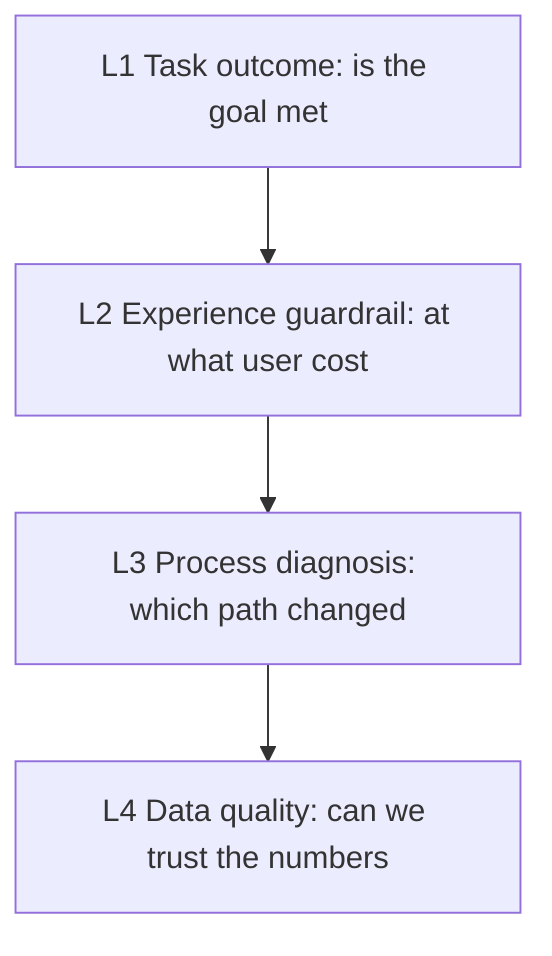

# Data Measurement as Organizational Protocol: Definitions, Measurement, Tiering, and Retrospectives

**Version:** 0.1 (preprint)
**Date:** 2026-08-14
**Type:** Research design / protocol paper

## Abstract

Many data arguments look, on the surface, like a dispute over whether a number is right, but they are actually about two different things. When someone says "errors have increased," they may mean the total number of error events; someone else cares about the number of people affected; a third wants to know whether a single failure blocks a user from completing their task. All three numbers can be correct, yet none can substitute for the others. Without shared definitions, the more precise the discussion becomes, the deeper the misunderstanding grows.

This paper reframes data measurement as an **organizational protocol**: a system of definitions that lets different roles make judgments about the same object and recompute results independently. It does not answer "what should go on the dashboard," but "how can a number be trusted, compared, and used for decisions." To that end, the paper proposes four groups of minimal mechanisms: **definition** (a metric contains at least the measured object, event definition, calculation method, time range, and usage boundary); **measurement units** (requests, sessions, users, and tasks each have their uses, with tasks closest to user outcomes); **metric tiering** (four layers — task outcome, experience guardrail, process diagnosis, and data quality — paired with core / observed / on-demand lists); and **dictionary and retrospectives** (turning definitions into a recomputable collaboration interface and turning changes into verifiable actions).

This paper is a research-design and protocol paper and reports no new experimental data. It organizes "look at outcomes rather than activity volume," "first confirm the data is trustworthy, then explain the cause," and "write actions as verifiable hypotheses" into a protocol that a team can adopt and that can be falsified.

**Keywords:** data measurement; definitions; measurement; metric tiering; data quality; retrospectives; collaboration

## 1. The problem: why "make the metric go up" is not a clear requirement

When a team asks to "make the metric go up" or "add a few more charts," what remains unsolved is not the number of charts but three upstream questions: **What object are we measuring? How is this number computed? Once it changes, who should do what?** Whether a request succeeds describes a single system response; whether a user is affected describes a person's experience; whether a task is completed describes an outcome. Mixing them together often yields a number that looks precise but cannot be interpreted.

The question of this paper is not "what should the metric be," but: **What is the minimal set of organizational mechanisms needed for a set of numbers that different roles can jointly trust, recompute, and use for decisions?**

The value of these mechanisms is clearest during data disputes: a "1% completion rate" only becomes meaningful once the definition is completed — is it failed requests divided by all requests, or deduplicated users who encountered an error divided by active users? Once the denominator and event boundary change, the number may describe a completely different phenomenon. A definition is therefore not a footnote at the end of a report, but an interface in collaboration.

## 2. Protocol one: definition — a metric contains at least five parts

A usable metric should contain at least:

| Part | Question it answers |
| --- | --- |
| Measured object | Is it a request, session, device, user, or task being measured? |
| Event definition | What counts as one occurrence, one success, one failure? |
| Calculation method | Sum, average, percentile, ratio, or deduplicated by user? |
| Time and scope | Which time window, versions, platforms, or regions are counted? |
| Usage boundary | What judgments can this metric support, and what conclusions can it not support? |

**Why this is a protocol, not a note.** If any of the five parts is omitted, the number can be misread. For example, "average latency decreased" does not automatically mean the experience improved: slower samples may not have been recorded, or a change to the task entry may mean fewer people completed it. In that case, one should check coverage, sample size, completion rate, and tail latency together, rather than cherry-picking a more flattering average.

**Testable prediction.** If a team completes the five-part definition for every core metric, metric arguments should shift from "whose data is real" to "what goals and trade-offs we are pursuing"; the rate of wrong decisions caused by metric misuse should fall.

## 3. Protocol two: measurement units — put the metric into the task, not into an isolated chart

The same event can have several legitimate measurement units: request success rate reflects service response, affected-user share reflects coverage, task completion rate reflects user outcomes, and high-percentile latency reflects the experience of those who wait longest. Do not force one metric to answer every question.

| Measurement unit | Question it suits | Common misuse |
| --- | --- | --- |
| Request | Does an interface or resource respond promptly and correctly? | Using request volume as a proxy for user impact. |
| Session | Is a continuous period of use smooth? | Confusing background activity with real usage. |
| User | How many people encountered a problem? | Ignoring how severely the same user is repeatedly affected. |
| Task | Did the user accomplish the goal? | Looking only at page or interface success, not whether the outcome was achieved. |
| Device / version | Is the problem concentrated in a specific environment? | Treating correlation directly as root cause. |

**Mechanism: the three views — absolute volume, ratio, and experience.** The same problem has at least three legitimate ways of being observed, each answering a different question: **absolute volume** answers "how much happened" (failed requests, crash counts, feedback counts), useful for estimating load and spotting bursts, but it moves with traffic and usage scale; **ratio** answers "how widespread" (request error rate, affected-user share, task completion rate), useful for comparing across periods and samples, but the denominator must be stated to avoid mistaking small-sample fluctuation for a trend; **experience** answers "what the user actually went through" (perceptible wait per user per minute, jank, visible timeouts), closer to felt experience than raw system signals, but its start/end points and deduplication rules must be defined. Do not pick only one — when total volume rises while the ratio falls, it may simply be traffic growth rather than declining quality.

**Mechanism: task definition card.** For each core task, first write a card no longer than one page: task name, target user, start point, end point, success, failure, exclusions, and key risks. It separates "the save endpoint returns 200" from "the user actually owns a recoverable draft" — the endpoint is an implementation detail, while the task outcome is the object to protect.

**Mechanism: state–event table.** Metrics can only be computed from events. Before instrumenting, first draw the states a task is allowed to pass through and the states that must not occur, covering success, failure, cancellation, and timeout; then map each state transition to an event, and carry a task ID through all of a task's events. Without a task ID, it is hard to tell "ten users each tried once" from "one user tried ten times in a row."

**A key distinction.** Real systems often have cases where "the user first waits until timeout, then the backend succeeds later." Two metrics can be kept side by side: **user-visible completion rate** (the share of tasks where the user clearly received a successful result within the agreed window) and **final processing success rate** (the share of tasks the system ultimately processed successfully). A gap between the two is exactly the sign of a disconnect between system outcome and user experience.

## 4. Protocol three: metric tiering — let data serve the most important decisions first

A dashboard can hold dozens of metrics, but human attention cannot. Without tiering, a team is easily drawn to the most conspicuous and fastest-moving number while ignoring the signal that truly determines user outcomes.

**Mechanism: the four-layer tiering model.** Tiering does not rank metrics; it answers two working questions: How close is this metric to the user goal? If it changes, can different actions be taken?

| Layer | Question it answers | Typical metrics | Primary use |
| --- | --- | --- | --- |
| L1: Task outcome | Did the user accomplish what they wanted? | Completion rate, conversion, retention, successful task count | Judging whether the goal was met. |
| L2: Experience guardrail | Did the user pay an undue price along the way? | Visible wait, timeout rate, jank, affected-user share | Preventing optimizing the outcome number alone at the cost of experience. |
| L3: Process diagnosis | Which path or condition might have caused the change? | Step conversion, error category, version distribution | Narrowing the search and validating hypotheses. |
| L4: Data quality | Can these numbers themselves be trusted? | Event coverage, duplication rate, latency, state-closure rate | Preventing actions driven by bad data. |

The four layers are not a one-way causal chain. The value of tiering lies in the order: first check whether the outcome changed, then use guardrails to judge the user cost, finally use diagnostic metrics to find evidence, while retaining a data-quality check at all times.

**Mechanism: the core / observed / on-demand three lists.** Beyond the four layers, one must also decide on monitoring frequency. The core list should be very short, and every core metric should have a definition card, a baseline, a paired guardrail, and a data-quality check; if you cannot state who does what when it changes, it should generally be demoted to observed or on-demand.

**Testable prediction.** After adopting tiering, team discussions should move from "all metrics fluctuate together" to "first confirm the outcome, then check the guardrail, then look at diagnostics"; the rate of ineffective confirmations (reacting to a number that does not change any action) should fall.

## 5. Protocol four: dictionary and retrospectives — turn definitions into a recomputable interface, and changes into verifiable actions

The same "completion rate" often has different denominators in different people's hands. Without a metric dictionary, definitions drift apart across meetings, SQL, and dashboards.

**Mechanism: metric dictionary.** Every core metric uses the same definition card, with key fields including: name, one-sentence purpose, tier, measured object, events and source, formula (numerator / denominator / aggregation), success and failure definitions, deduplication and attribution, exclusions, breakdown dimensions, data freshness and quality, companion metrics, interpretation boundary, and change log. The fields need not be written as paragraphs; a table or YAML works too; the key is that the same team uses the same structure and does not omit the denominator, exclusions, data source, or interpretation boundary. The dictionary's maintenance rules include: write the definition card before writing the query when adding a core metric; record the version when a definition changes and, if necessary, break the historical trend; and periodically delete metrics that no one uses, that cannot lead to action, or that have lost credibility.

**Mechanism: anomaly record.** When a fluctuation is spotted, first open a one-page anomaly record that separates "confirmed facts" from "hypotheses to verify." The principle of the retrospective is: to solve the problem, not to assign blame; data records help people reconstruct conditions and take action, rather than disguising uncertainty as a settled conclusion.

**Mechanism: action hypothesis card.** Write the analytical conclusion as a verifiable hypothesis: observation, hypothesis, action, expectation, verification, risk guardrail. The key here is to write the "expectation" as a set of metrics, not just "the experience is better" — if a change raises completion but adds errors or duplicate content, the guardrail exposes that cost in time.

**Mechanism: seven questions for metric review.** Whenever a core metric is added or changed, run it through seven questions: Which user task or decision does it serve? Is the measured object a request, session, user, or task? What are the numerator, denominator, deduplication rule, and exclusions? Where does the data come from, and what are its coverage, latency, and known gaps? By which dimensions should it be broken down, and which dimensions should not be collected? What are its companion guardrails and diagnostic metrics? Once the value changes, which action will change with it? **If the last question has no answer, the metric is only recording, not entering the decision.**

**Mechanism: observation cadence.** Different metrics need different observation frequencies; not every number needs to be real-time. The key is not "how often to look" but "whether there is still a chance to act when it changes." Before release, check that key events cover success, failure, timeout, and cancellation, and walk through real tasks; after release, watch in the short term whether new changes introduce obvious blocking or collection gaps; daily / on workdays, watch the trend of core outcomes and guardrails, and only write an anomaly page when something is abnormal — a normal day needs no long report; weekly, keep a comparable one-line window stating the task, definition version, denominator, and conclusion; monthly or at the end of a stage, review the metric system itself — are the goals still correct, and which metrics or mechanisms should be adjusted. The cadence should match user impact, recovery cost, and data freshness, rather than fixing thresholds or fixed meetings "to look professional."

**Five-question troubleshooting.** When a chart fluctuates, the correct order is: ① Is the data itself complete? ② When did the change start? ③ Where is the impact concentrated? ④ What is the user cost? ⑤ Which hypothesis can be reproduced or falsified? The output of this step should not be "the root cause has been identified," but a statement that can be refuted.

## 6. Three meta-principles

Running through the four protocol groups are three independently testable meta-principles:

1. **Look at outcomes, not activity volume.** Call volume, generation volume, and request volume all describe activity, not value. Data-quality metrics must prevent mistaking "missing instrumentation" for "task volume declined."
2. **First confirm the data is trustworthy, then explain the cause.** Until coverage, latency, denominator, and version changes have been checked, any explanation may be attribution to bad data.
3. **Write actions as verifiable hypotheses.** The endpoint of a value change is not an observation, but a set of actions with expectations, guardrails, and re-testability.

**Testable prediction.** Teams that adopt the three meta-principles should show less "reacting to numbers that change no action," less "treating observation as conclusion," and more "actions that come back with verification."

**Six common misreadings.** The specific misreadings the meta-principles guard against most often appear in six forms in practice: **mistaking total volume for quality** (when traffic grows, total errors can rise while the error rate falls — the two do not conflict); **mistaking the average for everyone** (average latency can improve while some users still wait longer — look at percentiles and the distribution); **mistaking correlation for causation** (two curves moving together only means it is worth investigating — also check versions, traffic structure, experiments, or other evidence); **mistaking missing data for no problem** (missing collection, insufficient samples, or users bypassing a path can all make a problem disappear from the chart); **mistaking final success for no friction** (automatic retries, repeated clicks, and long waits can produce a successful outcome while already exhausting the user's patience); **mistaking external comparisons for absolute ranking** (with devices, networks, task scripts, content scale, and account status differing, performance comparisons can only provide hypotheses, not substitute for independent verification). All six can serve as a checklist for tiering review and retrospectives.

## 7. Relationship to related work

This paper's protocol is not an endorsement of any particular tool or framework, but a synthesis of engineering methodology: its footing is "what fields a metric itself consists of," rather than "which industry metrics to pick." In engineering, there are several mature frameworks for "how metrics should be defined," but they respectively answer "which dimension to measure," "which delivery outcomes to measure," and "whether the page experience is good," and rarely reach the level of "the five-part definition, denominator, and exclusions of a single metric" — Google's large-scale continuous testing research provides mechanism evidence that "feedback lag grows with scale" [1], the SPACE framework gives a multi-dimensional view of developer productivity [2], DORA's delivery metrics focus on throughput and stability [3], and Core Web Vitals gives concrete thresholds for page experience [4]. The table below is for positioning, not a substitute:

| Framework | Source and year | Measured object | Relationship to this protocol |
| --- | --- | --- | --- |
| SPACE [2] | Forsgren et al. (2021) | Developer productivity | Provides a multi-dimensional view and rejects a single-metric proxy; does not give recomputable metric definitions |
| DORA software delivery metrics [3] | DORA (2024, current) | Software delivery performance | Provides five metrics across delivery throughput and instability; explicitly warns against treating metrics as goals (Goodhart) |
| Core Web Vitals [4] | Google web.dev (2024, current) | Web page user experience | Provides three concrete metrics with thresholds (LCP / INP / CLS); notes that "standards evolve," with FID replaced by INP |
| Google large-scale continuous testing [1] | Memon et al. (2017, ICSE) | Software testing feedback | Provides mechanism evidence that "feedback lag grows with scale"; measurement should serve the loop being improved |

These frameworks relate to this paper complementarily: this paper borrows only their constraint that "measurement should serve the loop being improved, look at outcomes rather than activity volume," and does not treat any framework's specific metrics as unverifiable givens — the definitions and thresholds of specific metrics should be checked against public standards for currency (for example, Web Vitals is currently LCP ≤ 2.5s, INP ≤ 200ms, CLS ≤ 0.1).

This is complementary to the site's "Developer Productivity Is Not a Tool Catalog, but a Feedback System" [5]: that piece discusses the feedback loop of a productivity system, while this paper discusses how to make the "number" itself a trustworthy collaboration interface; and to "Before Putting AI Capability into an Engineering Organization, Define the Boundaries First" [6]: that piece's "measurement boundary" argues for "looking at verified outcomes rather than call volume," and this paper provides its operational organizational mechanism.

### 7.1 Relationship to the author's earlier writing

This paper is a protocol-form consolidation of the author's 2021 "Data Measurement Working Guide" series [7][8][9][10][11]. The series unfolds the same system progressively as "working guides": the first piece defines data definitions as an interface for organizational collaboration, giving the five-part structure of a metric, the absolute-volume / ratio / experience three views, and baseline principles [7]; the second provides a public dictionary of measurement objects such as request, user, and task [8]; the third gives the metric tiering model and four-dimensional ranking [9]; the fourth gives the metric dictionary template and maintenance rules [10]; the fifth discusses periodic statistics and retrospectives, writing conclusions as verifiable actions [11].

This paper's relationship to the series: it converges the mechanisms scattered across the five pieces into a single set of protocols (the five-part definition, measurement units, metric tiering, dictionary and retrospectives), and adds two things the series had not expanded — a **falsifiable statement** for each mechanism (testable predictions), and an explicit definition of metric tiering as the four layers "task outcome, experience guardrail, process diagnosis, data quality," ready for a team to adopt directly. The series' examples (search tasks, completion rate, error and latency metrics) and detailed templates remain in the originals and are not repeated here; readers who need templates and examples should return to the original pieces.

## 8. Threats to validity and research boundaries

First, this paper is a protocol paper and reports no new experimental data; it organizes the author's team and public engineering practice into a protocol whose validity must be tested in specific teams. Second, metric definitions evolve with standards, and use should defer to public standards: for example, Web Vitals replaced FID with INP (Interaction to Next Paint) as the third core metric in 2024, currently LCP ≤ 2.5s, INP ≤ 200ms, CLS ≤ 0.1, measured at the 75th percentile separately for mobile and desktop — any statement that follows the old version (still using FID) is outdated. Third, all "testable predictions" in this paper are protocol-level expectations, not measured conclusions. Fourth, no metric protocol can replace understanding of users, systems, and context — numbers are observations, not verdicts.

## 9. Conclusion

Good metrics make problems easier to see and judgments easier to review; they do not replace understanding of users, systems, and context. Before each discussion begins, spend one minute confirming the measured object, event definition, and denominator. Many seemingly intractable metric arguments will, at this step, turn into a more concrete, more productive collaboration.

The value of data measurement lies not in covering more pages or generating more elaborate dashboards, but in whether it helps people make the next judgment. When these questions can be supported by the same set of definitions, discussions no longer have to start from "whose data is real."

## References

1. Memon, A., Nguyen, B., Nickell, E., Micco, J., Dhanda, S., Siemborski, R., & Gao, Z. (2017). [Taming Google-Scale Continuous Testing](https://research.google/pubs/taming-google-scale-continuous-testing/). *ICSE 2017: Proceedings of the 39th International Conference on Software Engineering*. Paper on large-scale continuous testing and feedback lag.
2. Forsgren, N., Storey, M.-A., Maddila, C., Zimmermann, T., Houck, B., & Butler, J. (2021). [The SPACE of Developer Productivity: There's More to It Than You Think](https://www.microsoft.com/en-us/research/publication/the-space-of-developer-productivity-theres-more-to-it-than-you-think/). *ACM Queue*, 19(1). Multi-dimensional framework for developer productivity.
3. DORA. (2024). [DORA's software delivery performance metrics](https://dora.dev/guides/dora-metrics/). Current five metrics: change lead time, deployment frequency, failed deployment recovery time, change failure rate, deployment rework rate; the official warning that treating metrics as goals triggers the Goodhart effect.
4. Google. (2020, updated 2024). [Web Vitals](https://web.dev/articles/vitals). Core Web Vitals: LCP ≤ 2.5s, INP ≤ 200ms, CLS ≤ 0.1; INP replaced FID in 2024.
5. Liyuk (2026). [Developer Productivity Is Not a Tool Catalog, but a Feedback System](https://github.com/Liyuk/liyuk.github.io/blob/main/src/content/research/2026/08/developer-productivity-feedback-loops/zh.md). Sister paper on this site.
6. Liyuk (2026). [Before Putting AI Capability into an Engineering Organization, Define the Boundaries First](https://github.com/Liyuk/liyuk.github.io/blob/main/src/content/research/2026/08/ai-engineering-capability-boundaries/zh.md). Sister paper on this site.
7. Liyuk (2021). [Data Measurement Working Guide (1): Data Definitions Are an Interface for Organizational Collaboration](https://github.com/Liyuk/liyuk.github.io/blob/main/src/content/writing/2021/04/data-definitions-are-collaboration-interfaces/zh.md). Writing series on this site; the five-part structure of data definitions as a collaboration interface, the absolute-volume / ratio / experience three views, and baseline principles.
8. Liyuk (2021). [Data Measurement Working Guide (2): Define the Measurement Object Before Arguing About Metrics](https://github.com/Liyuk/liyuk.github.io/blob/main/src/content/writing/2021/04/define-the-measurement-before-arguing-about-metrics/zh.md). Writing series on this site; a public dictionary of measurement objects such as request, session, user, and task.
9. Liyuk (2021). [Data Measurement Working Guide (3): Metric Tiering — Let Data Serve the Most Important Decisions First](https://github.com/Liyuk/liyuk.github.io/blob/main/src/content/writing/2021/04/metric-tiers-prioritize-decisions/zh.md). Writing series on this site; the metric tiering model and four-dimensional ranking.
10. Liyuk (2021). [Data Measurement Working Guide (4): The Metric Dictionary Template — Turning Definitions into a Recomputable Collaboration Interface](https://github.com/Liyuk/liyuk.github.io/blob/main/src/content/writing/2021/04/metric-dictionary-template/zh.md). Writing series on this site; the metric dictionary template and six categories of public examples.
11. Liyuk (2021). [Data Measurement Working Guide (5): Periodic Statistics and Retrospectives — Turning Numbers into the Next Action](https://github.com/Liyuk/liyuk.github.io/blob/main/src/content/writing/2021/04/periodic-metrics-and-retrospectives/zh.md). Writing series on this site; periodic statistics, anomaly records, and data retrospective templates.

## Appendix: minimal artifact checklist as a protocol

The value of a protocol lies in being adoptable. A team starting from scratch can begin with five minimal artifacts:

1. Task definition card (one page per core task)
2. State–event table (covering success / failure / cancel / timeout)
3. Metric definition card (five-part definition + denominator + exclusions)
4. Core / observed / on-demand lists (with guardrails and data quality)
5. Action hypothesis card (observe → hypothesize → act → expect → verify → guardrail)

There is no need to build all metrics at once. Start from one key user task and complete a small loop in the order "define the task → draw the states → collect events → build the metric group → investigate changes → verify the action"; this is usually more valuable than spreading out dozens of charts.

## Author information and declaration

**Author:** Liyuk

**Conflict of interest:** The author declares no conflict of interest. This research received no funding from any commercial organization; the public projects, industry reports, and coverage cited are used only as methodological or directional reference.

**Data availability:** This paper is a protocol paper and reports no new experimental data. The quantitative thresholds cited come from third-party public standards (such as Web Vitals' LCP ≤ 2.5s, INP ≤ 200ms, CLS ≤ 0.1) and public frameworks (DORA software delivery metrics); specific numbers and thresholds should be checked against the public standards for currency and should not be treated as measurement results produced by this protocol; "1% completion rate" and "average latency decreased" are illustrative examples used to explain definitions.

## Glossary

| Term | Definition |
| --- | --- |
| Definition | A metric contains at least five parts: measured object, event definition, calculation method, time range, and usage boundary |
| Measurement unit | Request, session, user, task; task is closest to user outcome |
| Metric tiering | Four layers — task outcome, experience guardrail, process diagnosis, data quality — paired with core / observed / on-demand lists |
| Dictionary | Turning metric definitions into a recomputable collaboration interface |
| Retrospective | Turning definition changes and action hypotheses into verifiable actions |
| Recomputable | The same object, under the same definition, yields consistent results independently across different roles |
| Leakage | Using information that only becomes available after the target month for prediction |
