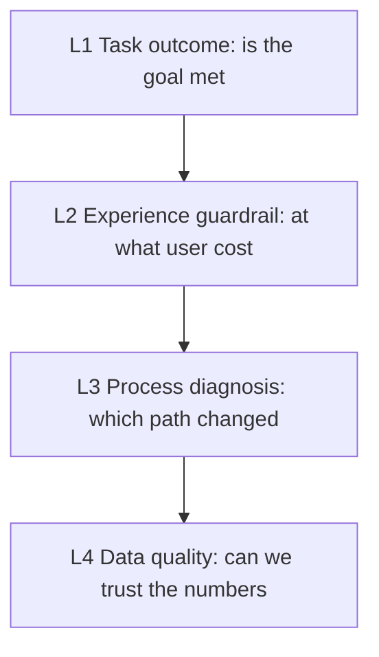

# 数据度量作为组织协议：口径、测量、分级与复盘

**版本：** 0.1（preprint）
**日期：** 2026-08-14
**类型：** 研究设计与协议论文（research design / protocol paper）

## 摘要

很多数据争论，表面上是在争一个数字对不对，实际上是在说两件不同的事。有人说"错误变多了"，指的是错误事件总量；有人关心受影响人数；还有人想知道一次失败是否阻断用户完成任务。三个数字都可能正确，却不能互相替代。没有共同定义时，讨论越精确，误解反而越深。

本文把数据度量重构为一种**组织协议**：一套让不同角色围绕同一对象做判断、且能独立复算的口径系统。它不回答"看板上应该放什么"，而回答"一个数字怎样才能被信任、被比较、被用于决策"。为此，本文提出四组最小机制：**口径定义**（一个指标至少包含测量对象、事件定义、计算方法、时间范围与使用边界）；**测量单位**（请求、会话、用户、任务各有用途，任务最能贴近用户结果）；**指标分级**（任务结果、体验护栏、过程诊断、数据质量四层，配合核心/观察/按需三张清单）；**字典与复盘**（把定义变成可复算的协作接口，把变化变成可验证的行动）。

本文是一篇研究设计与协议论文，不报告新的实验数据。它把"看结果而非看活动量""先确认数据可信，再解释原因""把行动写成可验证假设"整理成一套可被团队采用、也可否证的协议。

**关键词：** 数据度量；口径；测量；指标分级；数据质量；复盘；协作

## 1. 问题：为什么"把指标做上去"不是明确的要求

团队提出"把指标做上去"或"多放几张图"时，真正没解决的不是图表数量，而是三个前置问题：**我们在测量什么对象？这个数字怎样算出来？它变化了之后，谁应该做什么？** 请求是否成功，描述的是系统一次响应；用户是否受影响，描述的是人的经历；任务是否完成，描述的是结果。把它们混在一起，常会得到一个看似精确、实际无法解释的数字。

本文的问题不是"指标应该是什么"，而是：**一组能被不同角色共同信任、复算、用于决策的数字，需要什么样的最小组织机制？**

这套机制的价值在数据争吵时最明显：当"完成率 1%"只有在补全定义后才有意义——它究竟是失败请求数除以全部请求数，还是出现过错误的去重用户数除以活跃用户数？分母和事件边界一变，数字描述的就可能是完全不同的现象。口径因此不是报表末尾的一行注释，而是协作中的接口。

## 2. 协议一：口径定义——一个指标至少包含五部分

一个可用的指标，至少应包含：

| 部分 | 要回答的问题 |
| --- | --- |
| 测量对象 | 测量的是请求、会话、设备、用户，还是一项任务？ |
| 事件定义 | 什么算一次发生、一次成功、一次失败？ |
| 计算方法 | 是求和、平均、分位数、比例，还是按用户去重？ |
| 时间与范围 | 统计哪个时间窗、哪些版本、哪些平台或地区？ |
| 使用边界 | 这个指标可以支持什么判断，不能推出什么结论？ |

**为什么这是协议而非注释。** 五部分中任何一项被省略，数字都可能被误读。例如"平均耗时下降"并不自动表示体验变好：可能是较慢样本没有被记录，也可能是任务入口改动后，完成它的人变少了。此时应同时检查覆盖率、样本量、完成率与长尾耗时，而不是只挑一个更好看的平均值。

**可检验预测。** 若一个团队为每个核心指标补齐五部分定义，指标争论会从"谁的数据是真的"转向"我们追求的目标与取舍"；以指标误用导致错误决策的比例应下降。

## 3. 协议二：测量单位——把指标放进任务，而不是放进孤立的图表

同一件事可以有多个合法测量单位：请求成功率反映服务响应，受影响用户占比反映覆盖范围，任务完成率反映用户结果，高分位耗时反映等待最久的一批体验。不要强迫一个指标回答所有问题。

| 测量单位 | 适合回答的问题 | 常见误用 |
| --- | --- | --- |
| 请求 | 某个接口或资源是否及时、正确地响应？ | 用请求量代替用户影响。 |
| 会话 | 一段连续使用过程中是否顺畅？ | 把后台活动和真实使用混为一谈。 |
| 用户 | 有多少人遇到过问题？ | 忽略同一用户被反复影响的程度。 |
| 任务 | 用户是否完成了目标？ | 只看页面或接口成功，不看结果是否达成。 |
| 设备 / 版本 | 问题是否集中在特定运行环境？ | 把相关性直接当作根因。 |

**机制：绝对量、比例与体验三分。** 同一个问题至少有三种合法的观察方式，各自回答不同的问题：**绝对量**回答"发生了多少"（失败请求数、崩溃次数、反馈数），适合估算处理量与观察突发，但会随流量与使用规模一起变化；**比例**回答"有多普遍"（请求错误率、受影响用户占比、任务完成率），适合跨时段与跨样本比较，但必须写明分母，避免把小样本波动误读成趋势；**体验**回答"用户实际经历了什么"（每用户每分钟可感知等待、卡顿、可见超时），比纯系统信号更接近感受，但要定义起止点与去重规则。不要只挑其中一种——总量上升而比例下降时，可能只是流量增长，而不是质量变差。

**机制：任务定义卡。** 每项核心任务先写一张不超过一页的卡：任务名称、目标用户、起点、终点、成功、失败、不纳入项与关键风险。它把"保存接口 200"与"用户真的拥有可恢复的草稿"区分开——接口是实现细节，任务结果才是要保护的对象。

**机制：状态-事件表。** 指标只能从事件中计算。埋点之前，先画出任务允许经过的状态和不允许发生的状态，覆盖成功、失败、取消和超时；再把每个状态转移对应到一个事件，让任务 ID 贯穿一次任务的全部事件。若没有任务 ID，就很难区分"十个用户各试一次"和"一个用户连续试十次"。

**一个关键区分。** 真实系统常有"用户先等到超时，后台后来又成功"的情况。可同时保留两个指标：**用户可见完成率**（用户在约定窗口内明确得到成功结果的任务占比）与**最终处理成功率**（系统最终处理成功的任务占比）。两者出现差距，恰恰说明系统结果与用户体验之间存在断层。

## 4. 协议三：指标分级——让数据先服务最重要的决策

一张看板放得下几十项指标，但人的注意力放不下。没有分级时，团队容易被最显眼、变化最快的数字吸走，却忽略真正决定用户结果的信号。

**机制：四层分级模型。** 分层不把指标分等级，而是回答两个工作问题：这项指标离用户目标有多近？一旦变化，能否采取不同行动？

| 层级 | 回答的问题 | 典型指标 | 主要用途 |
| --- | --- | --- | --- |
| L1：任务结果 | 用户是否完成了想做的事？ | 完成率、转化率、留存、成功任务数 | 判断目标是否实现。 |
| L2：体验护栏 | 完成过程中是否付出不应有的代价？ | 可见等待、超时率、卡顿、受影响用户占比 | 防止只优化结果数字而伤害体验。 |
| L3：过程诊断 | 哪一段路径或条件可能造成变化？ | 某步骤转化、错误类别、版本分布 | 缩小排查范围、验证假设。 |
| L4：数据质量 | 这些数字本身能相信吗？ | 事件覆盖率、重复率、延迟、状态闭环率 | 防止以坏数据推动行动。 |

四层不是单向因果链。分层的价值在于顺序：先看结果是否改变，再用护栏判断用户代价，最后用诊断指标找证据，任何时候都保留对数据质量的检查。

**机制：核心 / 观察 / 按需三张清单。** 在四层之外，还需决定监控频率。核心清单应当很短，每个核心指标都要有定义卡、基线、配套护栏与数据质量检查；若无法说明它变化时谁做什么，它通常应降为观察或按需指标。

**可检验预测。** 采用分级后，团队讨论会从"所有指标一起波动"转向"先确认结果、再查护栏、最后看诊断"；无效确认（对不改变行动的数字做出反应）的比例应下降。

## 5. 协议四：字典与复盘——把定义变成可复算的接口，把变化变成可验证的行动

同一个"完成率"，在不同人手里经常有不同分母。没有指标字典，数据口径会在会议、SQL 和看板之间逐渐分叉。

**机制：指标字典。** 每个核心指标用同一张定义卡，关键字段包括：名称、一句话目的、层级、测量对象、事件与来源、公式（分子/分母/聚合）、成功与失败定义、去重与归因、排除项、切分维度、数据时效与质量、配套指标、解释边界、变更记录。字段不必写成段落，表格或 YAML 也可以；关键是同一团队采用相同结构，且不能省略分母、排除项、数据来源和解释边界。字典的维护规则包括：新增核心指标前先写定义卡再写查询；修改口径必须记录版本，必要时断开历史趋势；定期删除无人使用、无法行动或失去可信度的指标。

**机制：异常记录。** 发现波动后，先建立一页异常记录，把"已确认事实"与"待验证假设"分开。复盘的原则是：为解决问题，不为找人背责；数据记录帮助人还原条件、做出行动，而不是把不确定性伪装成确定结论。

**机制：行动假设卡。** 把分析结论写成可验证假设：观察、假设、行动、预期、验证、风险护栏。这里的关键是把"预期"写成一组指标，而不是只写"体验更好"——如果改动提高了完成率却增加了错误或重复内容，护栏会及时暴露这种代价。

**机制：指标评审七问。** 每次新增或改动一个核心指标，先用七个问题过一遍：它服务于哪个用户任务或决策？测量对象是请求、会话、用户还是任务？分子、分母、去重规则与排除项分别是什么？数据从何而来，覆盖率、延迟与已知缺失是什么？需要按哪些维度切分，哪些维度不应采集？它的配套护栏与诊断指标是什么？数值变化后，哪种行动会随之改变？**如果最后一个问题没有答案，这个指标只是在记录，而没有进入决策。**

**机制：观察节奏。** 不同指标需要不同观察频率，不必所有数字都实时。关键不是"看得多频繁"，而是"它变化时仍有机会采取行动"。发布前检查关键事件是否覆盖成功、失败、超时、取消，并走查真实任务；发布后短期观察新改动是否引入明显阻断或采集缺失；每日/工作日看核心结果与护栏的趋势，异常时才记录一页异常，正常时无需长报告；每周保留一行可比窗口，写明任务、口径版本、分母与结论；月度或阶段结束时复盘指标体系本身——目标是否仍正确、哪些指标或机制应调整。节奏应与用户影响、恢复成本与数据时效匹配，而不是为了"看起来专业"固定阈值或固定会议。

**五问排查法。** 图表波动时，正确顺序是：①数据本身完整吗？②变化从何时开始？③影响集中在哪里？④用户代价是什么？⑤哪个假设能被复现或证伪？这一步的产物不应是"根因已经确定"，而是一条可以被反驳的陈述。

## 6. 三项元原则

贯穿四组协议的，是三条可以独立检验的元原则：

1. **看结果，不看活动量。** 调用量、生成量、请求量都只描述活动，不描述价值。数据质量指标要防止把"埋点缺失"误读成"任务量下降"。
2. **先确认数据可信，再解释原因。** 覆盖率、延迟、分母、版本变更未核对之前，任何解释都可能是对坏数据的归因。
3. **把行动写成可验证假设。** 数值变化的终点不是一篇观察，而是一组有预期、有护栏、可复测的行动。

**可检验预测。** 采用三条元原则的团队，应表现出更少"对不改变行动的数字做出反应"、更少"把观察当结论"、更多"行动带回验证"。

**六种常见误读。** 元原则要防的具体误读，在实践中最常以六种形式出现：**把总量当成质量**（流量增加时错误总量上升而错误率下降，两者并不冲突）；**把平均值当成所有人**（平均耗时变快仍可能有用户等待更久，要看分位数与分布）；**把相关性当成因果**（两条曲线同时变化只能说明值得调查，还要查版本、流量结构、实验或其他证据）；**把没有数据当成没有问题**（采集缺失、样本不足、用户绕开路径都可能让问题从图表上消失）；**把最终成功当成没有摩擦**（自动重试、重复点击与长时间等待可能让结果成功，却已消耗用户耐心）；**把外部对照当成绝对排名**（设备、网络、任务脚本、内容规模与账户状态不同，性能对照只能提供假设，不能直接替代独立验证）。这六种误读都可以作为分级评审与复盘时的检查清单。

## 7. 与相关工作的关系

本文的协议不是对某个工具或框架的背书，而是工程方法论的综合：它的立足点是"指标本身由哪些字段构成"，而不是"该选哪套行业指标"。在工程界，"指标该怎么定义"已有若干成熟框架，但它们分别回答"度量什么维度""度量哪些交付结果""页面体验好不好"，很少落到"单个指标的口径五部分、分母、排除项"这一层——Google 的大规模持续测试研究提供了"反馈滞后随规模增长"的机制证据 [1]，SPACE 框架给出了开发者生产力的多维度视角 [2]，DORA 的交付指标关注吞吐与稳定性 [3]，Core Web Vitals 给出了网页体验的具体阈值 [4]。下表用作定位，而非替代：

| 框架 | 来源与年份 | 度量对象 | 与本协议的关系 |
| --- | --- | --- | --- |
| SPACE [2] | Forsgren 等 (2021) | 开发者生产力 | 提供多维度视角，反对单一指标代理；不给出可复算的指标口径 |
| DORA 软件交付指标 [3] | DORA (2024，现行) | 软件交付绩效 | 提供交付吞吐与不稳定两类共五项指标；明确提醒勿把指标当目标（Goodhart） |
| Core Web Vitals [4] | Google web.dev (2024，现行) | 网页用户体验 | 提供 LCP / INP / CLS 三项具体指标与阈值；说明"标准会演进"，FID 已由 INP 取代 |
| Google 大规模持续测试 [1] | Memon 等 (2017, ICSE) | 软件测试反馈 | 提供"反馈滞后随规模增长"的机制证据；度量应服务正在改善的回路 |

这些框架与本文的关系是互补的：本文只借用它们"度量要服务于正在改善的回路、看结果而非活动量"的约束，而不把任何一套的具体指标当作无需核验的既定事实——具体指标的口径与阈值，都应按公开标准核验其时效（例如 Web Vitals 当前为 LCP ≤ 2.5s、INP ≤ 200ms、CLS ≤ 0.1）。

这与本站《开发者生产力不是工具目录，而是一个反馈系统》[5] 互补：那篇讨论生产力系统的反馈回路，本文讨论如何让"数字"本身成为可信的协作接口；与《把 AI 能力放进工程组织前，先定义哪些边界》[6] 互补：该文的"度量边界"主张"看验证过的结果而非调用量"，本文给出其可操作的组织机制。

### 7.1 与作者此前写作的关系

本文是作者 2021 年《数据度量工作指南》系列 [7][8][9][10][11] 的协议化总结。该系列以"工作指南"形式逐步展开同一个体系：第一篇把数据口径定义为组织协作的接口，给出指标的五部分构成、绝对量/比例/体验三分与基线原则 [7]；第二篇提供请求、用户、任务等测量对象的公开词典 [8]；第三篇给出指标分级模型与四维排序 [9]；第四篇给出指标字典模板与维护规则 [10]；第五篇讨论周期统计与复盘，把结论写成可验证的行动 [11]。

本文与系列的关系是：把分散在五篇里的机制收敛为一组协议（口径五部分、测量单位、指标分级、字典与复盘），并补上两类此前没有展开的内容——对每个机制的**可否证表述**（可检验预测），以及把指标分级明确定义为"任务结果、体验护栏、过程诊断、数据质量"四层，供团队直接采用。系列里的示例（搜索任务、完成率、错误与等待指标）与细节模板在原文中，本文不重复；读者需要模板与示例时，应回到系列原文。

## 8. 有效性威胁与研究边界

第一，本文是一篇协议论文，不报告新的实验数据；它把作者团队与公开工程实践整理为协议，协议的有效性需要在具体团队中检验。第二，指标定义会随标准演进，使用时应以公开标准为准：例如 Web Vitals 于 2024 年以 INP（Interaction to Next Paint）取代 FID 作为第三项核心指标，当前为 LCP ≤ 2.5s、INP ≤ 200ms、CLS ≤ 0.1，且按移动端与桌面端分别取 75 分位测量——任何沿用旧版（如仍以 FID 为准）的表述都已过时。第三，文中所有"可检验预测"均为协议层面的预期，不是已测得的结论。第四，任何指标协议都不能替代对用户、系统与场景的理解——数字是观察，不是裁决。

## 9. 结论

好的指标让问题更容易被看见，也让判断可以被复查；它不替代对用户、系统和场景的理解。每次开始讨论前，先花一分钟确认测量对象、事件定义和分母。很多看似棘手的指标争论，会在这一步变成一场更具体、更有结果的协作。

数据度量的价值不在于覆盖更多页面或生成更复杂的仪表盘，而在于它能否帮助人做出下一步判断。当这些问题能由同一套定义支撑，讨论就不必从"谁的数据是真的"开始。

## 参考文献

1. Memon, A., Nguyen, B., Nickell, E., Micco, J., Dhanda, S., Siemborski, R., & Gao, Z. (2017). [Taming Google-Scale Continuous Testing](https://research.google/pubs/taming-google-scale-continuous-testing/). *ICSE 2017: Proceedings of the 39th International Conference on Software Engineering*. 关于大规模持续测试与反馈滞后的论文。
2. Forsgren, N., Storey, M.-A., Maddila, C., Zimmermann, T., Houck, B., & Butler, J. (2021). [The SPACE of Developer Productivity: There's More to It Than You Think](https://www.microsoft.com/en-us/research/publication/the-space-of-developer-productivity-theres-more-to-it-than-you-think/). *ACM Queue*, 19(1). 开发者生产力的多维度框架。
3. DORA. (2024). [DORA's software delivery performance metrics](https://dora.dev/guides/dora-metrics/). 当前五指标：变更前置时间、部署频率、失败部署恢复时间、变更失败率、部署返工率；指标当目标即触发 Goodhart 效应的官方提醒。
4. Google. (2020, updated 2024). [Web Vitals](https://web.dev/articles/vitals). Core Web Vitals：LCP ≤ 2.5s、INP ≤ 200ms、CLS ≤ 0.1；2024 年 INP 取代 FID。
5. Liyuk (2026). [开发者生产力不是工具目录，而是一个反馈系统](https://github.com/Liyuk/liyuk.github.io/blob/main/src/content/research/2026/08/developer-productivity-feedback-loops/zh.md). 本站姊妹论文。
6. Liyuk (2026). [把 AI 能力放进工程组织前，先定义哪些边界](https://github.com/Liyuk/liyuk.github.io/blob/main/src/content/research/2026/08/ai-engineering-capability-boundaries/zh.md). 本站姊妹论文。
7. Liyuk (2021). [数据度量工作指南（一）：数据口径是组织协作的接口](https://github.com/Liyuk/liyuk.github.io/blob/main/src/content/writing/2021/04/data-definitions-are-collaboration-interfaces/zh.md). 本站写作系列；数据口径作为协作接口的五部分构成、绝对量/比例/体验三分与基线原则。
8. Liyuk (2021). [数据度量工作指南（二）：指标争论之前，先定义测量对象](https://github.com/Liyuk/liyuk.github.io/blob/main/src/content/writing/2021/04/define-the-measurement-before-arguing-about-metrics/zh.md). 本站写作系列；请求、会话、用户、任务等测量对象的公开词典。
9. Liyuk (2021). [数据度量工作指南（三）：指标分级，让数据先服务最重要的决策](https://github.com/Liyuk/liyuk.github.io/blob/main/src/content/writing/2021/04/metric-tiers-prioritize-decisions/zh.md). 本站写作系列；指标分级模型与四维排序。
10. Liyuk (2021). [数据度量工作指南（四）：指标字典模板，把定义变成可复算的协作接口](https://github.com/Liyuk/liyuk.github.io/blob/main/src/content/writing/2021/04/metric-dictionary-template/zh.md). 本站写作系列；指标字典模板与六类公开示例。
11. Liyuk (2021). [数据度量工作指南（五）：周期统计与复盘，让数字变成下一次行动](https://github.com/Liyuk/liyuk.github.io/blob/main/src/content/writing/2021/04/periodic-metrics-and-retrospectives/zh.md). 本站写作系列；周期统计、异常记录与数据复盘模板。

## 附录：作为协议的最小产物清单

协议的价值在于可被采用。一个团队从零开始，可以用五件最小产物启动：

1. 任务定义卡（每项核心任务一页）
2. 状态-事件表（覆盖成功/失败/取消/超时）
3. 指标定义卡（五部分口径 + 分母 + 排除项）
4. 核心/观察/按需三张清单（含护栏与数据质量）
5. 行动假设卡（观察 → 假设 → 行动 → 预期 → 验证 → 护栏）

不需要一次性建设所有指标。从一条关键用户任务开始，按"定义任务 → 画出状态 → 采集事件 → 建立指标组 → 调查变化 → 验证行动"做完一个小闭环，通常比铺开几十张图更有价值。

## 作者信息与声明

**作者：** Liyuk

**利益冲突：** 作者声明无利益冲突。本研究未受任何商业机构资助；文中引用的公开项目、行业报告与报道均仅作方法或方向参考。

**数据可用性：** 本文是协议论文，不报告新的实验数据。文中引用的量化阈值来自第三方公开标准（如 Web Vitals 的 LCP ≤ 2.5s、INP ≤ 200ms、CLS ≤ 0.1）与公开框架（DORA 软件交付指标），具体数字与阈值应回到公开标准核验时效，不能当作本协议产出的测量结果；"完成率 1%""平均耗时下降"等为说明口径的示意示例。

## 术语表

| 术语 | 定义 |
| --- | --- |
| 口径 | 一个指标至少包含测量对象、事件定义、计算方法、时间范围与使用边界五部分 |
| 测量单位 | 请求、会话、用户、任务；任务最贴近用户结果 |
| 指标分级 | 任务结果、体验护栏、过程诊断、数据质量四层，配合核心/观察/按需三张清单 |
| 字典 | 把指标定义变成可复算的协作接口 |
| 复盘 | 把口径变化与行动假设变成可验证的行动 |
| 可复算 | 同一对象按同一口径能由不同角色独立得到一致结果 |
| 泄漏 | 将目标月份之后才可获得的信息用于预测 |
