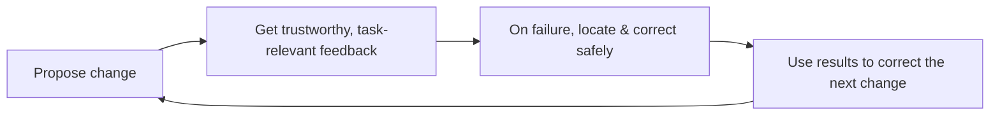

**Version:** 0.1 (preprint)
**Date:** 2026-08-14
**Type:** Research synthesis / position paper

## Abstract

"Improving engineering efficiency" often starts with procuring a batch of tools: a new CI, code scanning, a release platform, a knowledge base, an AI assistant. Each tool may be valuable on its own, but lining them up side by side in a workflow does not automatically form a productivity system. This paper proposes an alternative view: **developer productivity is a feedback system, not a tool catalog.** Its goal is not to make people "busier," but to continuously shorten a loop — propose a change, get trustworthy and task-relevant feedback, locate and correct failures quickly and safely, and use the results to calibrate the next change.

This paper synthesizes public software engineering research (Google's large-scale continuous testing, the SPACE framework, static analysis infrastructure), the latest practice of AI-assisted development, and the industry quantitative data from DORA 2026 and DX 2026 to form four claims: first, define the loop to shorten before choosing a platform; second, productivity has multiple dimensions and cannot be proxied by a single number; third, the value of a tool lies in entering the default path and becoming a trustworthy capability, not in adding entry points; fourth, failure should be designed as diagnosable, recoverable feedback rather than noise or blockage. The paper ends with a lightweight, falsifiable pilot protocol.

This paper reports no new model experiments or organizational performance data. It is a position and synthesis that separates "tool integration" from "capability building," and argues: the standard for evaluating an internal tool is whether it makes a feedback loop faster, more reliable, and easier to recover from — not how many times it is used.

**Keywords:** developer productivity; feedback loops; platform engineering; developer experience; measurability

## 1. The Problem: Why "Integrating Tools" Does Not Yet Constitute a Productivity System

When a team faces "low efficiency," the most common response is to inventory gaps, procure tools, and set up dashboards. But the real constraint is usually not the number of tools: after a developer finishes a change, how long does it take to get **trustworthy, actionable, task-relevant** feedback? On failure, can they locate and correct it quickly and safely? If the answer is no, then however many entry points and dashboards exist, they only spread the waiting, guessing, and rework across more pages.

This explains why "efficiency projects" often look busy yet produce outcomes that are hard to verify: they optimize activity volume, not the loop. DORA 2025's large-scale survey gives the same judgment in another phrasing: AI and tools are **amplifiers** of existing processes, and adoption does not equal effective use. [1] A team that has not clearly defined its loop amplifies the speed of its existing processes — including the mess in them.

Therefore, the research question of this paper is not "which tools do we need," but: **how do we build a team's developer productivity into a continuously shortening, verifiable feedback loop?**

## 2. Method and Materials

This paper adopts a focused literature and position synthesis. Material selection follows three criteria: the subject of study directly involves real software engineering tasks; the paper or practice is publicly accessible; and the material helps distinguish the two ways of building productivity — "integrating tools" versus "establishing a feedback loop." The main materials include:

- Google's large-scale continuous testing research, showing how feedback lag emerges as test scale grows, and why "providing quality information related to the change while the developer is still writing code" matters [2];
- Microsoft's SPACE framework, showing that productivity is multidimensional and cannot be proxied by a single number [3];
- Google's public summary of its static analysis infrastructure, showing that "usable infrastructure + default integration + voluntary fixes" is more effective than a checklist of rules [4];
- Google's public retrospective on AI-assisted software engineering, showing that offline metrics are only a rough proxy for user value and that rapid online iteration and direct feedback are needed [5];
- the DORA 2025 report, as large-scale evidence for "adoption vs. effective use" and "AI is an amplifier" [1];
- the DORA 2026 report on the ROI of AI-assisted software development, providing the latest large-scale evidence for "value realization follows a J-curve," the "verification tax," and "AI is an amplifier" [6];
- the DX 2026 industry benchmarks, providing the quantitative observation that "AI-generated code is rising sharply while developer experience metrics stay flat" and that "review throughput is becoming a new bottleneck" [7].

These materials serve only as mechanistic evidence; specific numbers and effects should be verified against their original sources. This paper does not treat them as a purchasing ranking. The two 2026 quantitative materials ([6][7]) are used to calibrate judgment and pilot thresholds, not to prove causation: they describe cross-sectional correlational phenomena across the industry, and whether the thresholds apply to your team returns to the baseline protocol in §5 for verification.

## 3. Four Claims

### Claim One: Define the Loop to Shorten First, Not the Platform to Choose

Different teams have different bottlenecks. Some spend time on local environments and dependencies, some are stuck on long and unstable verification, some can merge quickly but cannot judge release risk, and some must collect context from scratch on every incident. Grouping all of these as "low efficiency" induces a platform plan that looks comprehensive but actually lacks priorities.

**Mechanism.** A better starting point is to pick one class of high-frequency task and draw its timeline: from when the developer starts modifying, to when they receive feedback sufficient to decide the next step, what waiting, context switching, manual confirmation, and repeated operations occur in between. What should be measured here is the **end-to-end experience**, not the single-point time of any tool. Reducing CI from 30 minutes to 10 minutes (illustrative numbers) is of course important; but if failure information still takes half a day to be attributed manually, or developers keep rerunning because they do not trust the results, what is shortened is only machine time, not problem-solving time. [2]

The two 2026 industry materials give consistent cross-sectional evidence on this point. DORA 2026's ROI model finds that most organizations experience a period of productivity decline after introducing AI (a J-curve), caused not by the tools themselves but by learning costs, the "verification tax" — the time spent reviewing AI-generated code — and the adaptation of downstream processes (testing, change approval) [6]; DX 2026's benchmarks show that the share of AI-generated code rose sharply year over year, while the developer experience index stayed flat and the innovation share declined, and review throughput and incremental delivery actually fell — precisely because AI generates more code and the review volume grows faster than the team's adaptation speed [7]. Together these are the classic symptom of "optimizing activity volume rather than the loop": tools and output are both increasing, and the only thing that has not gotten faster is the segment "from change to a trustworthy conclusion."

**Testable prediction.** If a productivity project explicitly targets a loop (shortening time-to-first-valid-feedback, shortening recovery time, raising feedback trustworthiness), then under the same conditions the loop's end-to-end time and manual intervention points should show measurable improvement; if it only states "integrate some tool," not necessarily. Here "measurable" is implemented according to the baseline protocol in §5: whether the improvement holds and is worth scaling is judged against two weeks of baseline data collected with the same method, not against a single before-and-after point comparison.

**Organizational implication.** Every productivity project should be able to answer: which feedback loop does it make faster, more reliable, or easier to recover from? If it cannot answer, it should not start.

### Claim Two: Productivity Has Multiple Dimensions and Cannot Be Proxied by a Single Number

Commit counts, merge counts, lines of code, and closed-ticket counts are all easy to obtain, and therefore the most easily misused. They record activity, but cannot tell whether the activity produces maintainable value; once they become goals, they may also encourage splitting meaningless changes, avoiding hard problems, or trading speed for quality.

**Mechanism.** The SPACE framework understands developer productivity along five dimensions — satisfaction and well-being, performance, activity, communication and collaboration, and efficiency and flow — and explicitly rejects summarizing it with a single metric. [3] This does not require all teams to build a complex "total score," but a reminder: measurement must serve the loop being improved. A sufficiently small metric set usually contains three layers:

| Layer | Question to answer | Candidate signals |
| --- | --- | --- |
| Process | Are feedback and delivery getting faster? | Time from commit to first valid result; time from confirmed failure to recovery. |
| Quality | Is speed coming at the cost of risk? | Regression rate, revert rate, retry count after failure, post-change runtime signals. |
| Experience | Do developers actually complete tasks more easily? | Periodic short interviews, task success rate, feedback on result trustworthiness and interruption. |

**Testable prediction.** If a capability genuinely improves the developer experience, one should simultaneously observe lower loop times, no deterioration in quality signals, and improved subjective feedback on "result trustworthiness"; improving only activity metrics (commits, lines) while everything else stays flat does not constitute success.

**Organizational implication.** Do not rank teams horizontally across the organization, and do not expose all data down to the individual level. Metrics are suited to identifying system friction and verifying intervention effects, not to replacing judgment about task difficulty, technical debt, and collaboration context.

### Claim Three: A Tool's Value Lies in Becoming a Trustworthy Capability in the Default Path

Developers should not have to remember a list of entry points, copy context, or wait for an expert to become free just to get basic feedback. Mature engineering capabilities usually embed themselves into the critical path as "available by default": new projects have a working starting point, changes trigger appropriate checks, failure results explain the next step, the release process retains traceable state, and incidents can trace back from runtime signals to the relevant changes.

**Mechanism.** Google's static analysis summary does not describe the analyzer as a mere rule set, but emphasizes the combination of usable infrastructure, default integration, and voluntary fixes by developers; the goal is to catch problems before they enter the codebase, in a way developers can accept. [4] Whether a tool can be trusted often matters more than its feature list — false positives, slowness, hard-to-understand advice, and unexplained blocking all train developers into bypass habits; once bypassing becomes the norm, the platform is useless no matter how correct it is.

**Testable prediction.** When a capability is provided as a "default path" (rather than an extra entry point), adoption and correct usage should rise; when a tool frequently false-positives or blocks without explanation, the bypass rate should rise.

**Organizational implication.** The value of a platform is closer to **paving the common roads while keeping controlled side roads**: provide self-service templates and automation for repetitive tasks; provide clear extension points and responsibility boundaries for differentiated needs; provide stability commitments for the platform itself; and hand usage data back to the platform team to decide the next investment from actual failure modes — but here "usage data" serves the platform's investment decisions, not horizontal ranking of individuals or teams (see Claim Two).

### Claim Four: Design "Failure" as Diagnosable, Recoverable Feedback

A productivity system does not aim for "never fail." Builds, tests, releases, and operations all fail; what matters is whether the failure leaves enough clues for a person to decide what to do at low cognitive cost.

**Mechanism.** Actionable feedback should include at least four things: which step the failure occurred in, which changes or environment it relates to, where the evidence is, and who handles the next step. It does not have to give the root cause at once, but it should not leave only a red status and a log detached from context. This is also why "run all checks" is not always better: if feedback arrives late enough, the developer has already switched tasks; if it is noisy enough, the team loses trust. Checks should be combined by risk and change scope — fast checks, asynchronous deep verification, and post-release observation — and the conclusions of the later layer (e.g. post-release observation) should feed back into the earlier layer (e.g. the in-development check strategy), to calibrate the next round of checks and gates.

**Testable prediction.** After improving failure feedback, the developer's cognitive burden from seeing a failure to making a judgment (measurable as attribution time, retry count, and subjective rating of result trustworthiness) should drop, rather than just the number of notifications rising.

**Organizational implication.** One can improve one class of common failure sequentially: first count failure types and waiting times, distinguishing real problems, environment problems, and flaky checks; add context, reproduction steps, and an ownership path for the most common failures; establish an explicit policy for issues that can be auto-retried or isolated, to avoid dressing noise up as a quality gate; after the change, look back at whether developers reach conclusions faster, rather than seeing more notifications.

## 4. AI Is an Evaluable Link in the Feedback Loop, Not a Reason to Skip Verification

This paper's four claims are especially relevant in AI-assisted development. AI should become an evaluable link in the feedback loop: the acceptance rate of suggestions, the volume of generated code, or the number of calls do not by themselves indicate value; one must also see whether it reduces rework, whether it increases review burden, whether it is reliable on critical tasks, and whether developers can understand and correct it when uncertain. [5]

This complements the site's "Define the Boundaries Before Putting AI Capabilities into an Engineering Organization" [8]: that piece discusses four kinds of boundaries — context, responsibility, authorization, and measurement — that must be defined before AI enters an engineering organization; this piece expands the "measurement boundary" and "end-to-end workflow" of that discussion onto developer productivity — treating AI as a feedback loop to be shortened and verified, rather than a tool that is done once integrated.

## 5. A Lightweight, Falsifiable Pilot Protocol

If a team is just starting this work, it need not first set up a huge "efficiency program." Pick one high-frequency pain point that is perceptible across teams, such as "after a test failure, it is hard to tell whether it relates to this change."

1. **Define the loop and the baseline.** Spend two weeks collecting a baseline: time-to-first-valid-feedback, failure classification, retry behavior, and short interviews with a dozen or so developers.
2. **Limit the scope of change.** Change only the single most concentrated friction point, and make clear which loop it affects; by default, do not do a big-and-comprehensive platform overhaul.
3. **Define success and stop conditions.** First write a one-sentence hypothesis ("shortening X will lower time-to-first-valid-feedback"), then set success conditions (e.g. time-to-first-valid-feedback down ≥30%, retry rate down), while also setting guardrails (regression rate does not rise, trustworthiness rating does not fall). Thresholds are set by the team according to baseline and business impact, and use the same collection method as the baseline so the hypothesis can be verified afterward.
4. **Record process evidence.** Besides outcomes, record the distribution of failure types, manual intervention points, bypass behavior, and trustworthiness feedback.
5. **Make a three-way decision.** Against the hypothesis and guardrails from step 3, choose one of three: if a guardrail is breached, or the hypothesis is not supported by the data, stop or revise the hypothesis; only if the hypothesis holds, generalize the pattern to adjacent loops. A conclusion of "no improvement" is kept too — it identifies a loop not worth further investment.

This protocol does not aim to prove "efficiency gains" in one shot. What it identifies is: which loop is worth shortening, at what cost, and under what conditions it improves stably — turning engineering productivity from an "ever-expanding tool list" into "a system that keeps learning."

## 6. Validity Threats and Research Boundaries

First, this paper's materials are mainly public research and cannot represent regulated, legacy, or highly sensitive domains. Second, frameworks such as SPACE are descriptive, and moving from framework to team decision requires verification in the specific context. Third, this paper derives organizational recommendations from technical mechanisms, and the derivation itself needs to be strengthened in specific teams with task data, code review records, and interviews. Fourth, the AI and tool ecosystem changes quickly, and the descriptions of Google's practices here represent only the materials accessible as of 2026-08-14; all citations serve as mechanistic evidence and do not constitute a ranking of any product or method.

## 7. Conclusion

The best developer infrastructure is often unobtrusive: it makes common tasks involve less waiting and less guessing, and returns failures more quickly to the people who can act. It does not promise to make every developer write faster; it makes the organization more consistently convert changes into verified results.

By moving the focus from "what tools are we still missing" to "which feedback loop is most worth shortening," teams can avoid mistaking engineering productivity for an activity-volume contest, and begin accumulating delivery capability that is genuinely reusable.

## References

1. DORA (2025). [The Impact of Generative AI in Software Development](https://dora.dev/ai/gen-ai-report/report/). Large-scale survey; this paper only borrows its conclusion structure of "adoption vs. effective use" and "AI is an amplifier."
2. Google (2019). [Taming Google-Scale Continuous Testing](https://research.google/pubs/taming-google-scale-continuous-testing/). Paper on large-scale continuous testing and feedback lag.
3. Forsgren, N., Storey, M.-A., et al. (2021). [The SPACE of Developer Productivity: There's More to It Than You Think](https://www.microsoft.com/en-us/research/publication/the-space-of-developer-productivity-theres-more-to-it-than-you-think/). A multidimensional framework for developer productivity.
4. Google (2016). [Lessons from Building Static Analysis Tools at Google](https://research.google/pubs/lessons-from-building-static-analysis-tools-at-google/). Public lessons from static analysis infrastructure.
5. Google (2025). [AI in software engineering at Google: Progress and the path ahead](https://research.google/blog/ai-in-software-engineering-at-google-progress-and-the-path-ahead/). A public retrospective on embedding AI capabilities into the development workflow and iterating on online feedback.
6. DORA (2026). [DORA ROI of AI-assisted Software Development](https://cloud.google.com/resources/content/dora-roi-of-ai-assisted-software-development). 2026 annual report; provides the ROI expansion of "AI is an amplifier," the value-realization J-curve, and the "verification tax" concept, usable as mechanistic evidence.
7. DX (2026). [2026 DX Benchmarks](https://getdx.com/blog/2026-dx-benchmarks-are-now-available/). Industry quantitative benchmarks; provide the cross-sectional observation that "the share of AI-generated code is rising while the developer experience index stays flat and review throughput declines."
8. Liyuk (2026). [Define the Boundaries Before Putting AI Capabilities into an Engineering Organization](https://github.com/Liyuk/liyuk.github.io/blob/main/src/content/research/2026/08/ai-engineering-capability-boundaries/zh.md). A sister paper on this site.

## Author Information and Statement

**Author:** Liyuk

**Conflict of interest:** The author declares no conflict of interest. This research received no funding from any commercial organization; the public projects, industry reports, and articles cited are used only as methodological or directional references.

**Data availability:** This is a synthesis and position paper and reports no new model experiments or organizational performance data. The quantitative sources cited are third-party public data: the DORA 2025/2026 reports and the DX 2026 industry benchmarks provide large-scale observations (e.g. "the share of AI-generated code is rising while the developer experience index stays flat"), and their specific numbers should be verified against the original sources; the CI times in this paper (e.g. "from 30 minutes to 10 minutes") are illustrative numbers used to explain what is being measured, and do not represent measured values from any organization.

## Glossary

| Term | Definition |
| --- | --- |
| Feedback loop | Propose a change → get trustworthy, task-relevant feedback → locate and correct failures quickly and safely → use results to calibrate the next change |
| Trustworthy feedback | Feedback that is task-relevant, timely, able to locate problems, and actionable for correction |
| Default path | A tool entering the daily workflow and becoming a capability used without thought, rather than an extra entry point |
| Verification tax | The extra review and confirmation cost paid to verify AI output |
| Multidimensional productivity | Productivity cannot be proxied by a single number and must be described by multiple metrics together |
| Falsifiable pilot | A small-scope, controlled trial that records disconfirming evidence and can decide to scale, revise, or stop |
