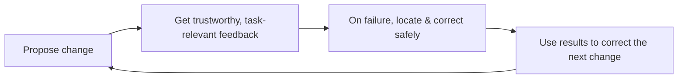

**版本：** 0.1（preprint）
**日期：** 2026-08-14
**类型：** 研究综述与立场论文（research synthesis / position paper）

## 摘要

"提升工程效率"很容易从采购一批工具开始：新的 CI、代码扫描、发布平台、知识库、AI 助手。工具各自都可能有价值，但把它们并排放进工作流，并不会自动形成生产力系统。本文提出一个替代视角：**开发者生产力是一个反馈系统，而不是工具目录。** 它的目标不是让人"更忙"，而是持续缩短一条回路——提出改变、获得可信且与任务相关的反馈、在失败时快速定位并安全修正、用结果校正下一次改变。

本文综合公开的软件工程研究（Google 大规模持续测试、SPACE 框架、静态分析基础设施）、AI 辅助开发的最新实践，以及 DORA 2026 与 DX 2026 的行业量化数据，形成四个主张：第一，先定义要缩短的回路，而不是先选平台；第二，生产力有多个维度，不能由一个数字代理；第三，工具的价值在于进入默认路径、成为可信能力，而不是增加入口；第四，失败应被设计为可诊断、可恢复的反馈，而不是噪声或阻断。本文最后给出一个轻量、可否证的试点协议。

本文不报告新的模型实验或组织绩效数据。它是一份立场与综述，把"工具接入"与"能力建设"分开，并主张：衡量一个内部工具的标准，是它是否让某一条反馈回路更快、更可靠、更容易恢复，而不是它被用了多少次。

**关键词：** 开发者生产力；反馈回路；平台工程；开发者体验；可度量性

## 1. 问题：为什么"接入工具"还不构成生产力系统

一个团队面对"效率低"，最常见的回应是盘点缺口、采购工具、搭建看板。但真实约束通常不是工具数量：开发者完成一次改动后，多久能得到**可信、可行动、与当前任务相关**的反馈？失败时，能否快速定位并安全修正？如果答案是否定的，再多的入口和仪表盘，也只是把等待、猜测和重复劳动分散到更多页面。

这解释了为什么"效率项目"常常看起来很忙、产出却难验证：它们优化的是活动量，而不是回路。DORA 2025 的规模化调查给出了同一个判断的另一种表述：AI 与工具是既有流程的**放大器**，采纳不等于有效使用。[1] 一个没有定义清楚回路的团队，放大的是既有流程的速度，也包括既有流程的混乱。

因此，本文的研究问题不是"我们需要哪些工具"，而是：**如何把一个团队的开发者生产力，建成一条持续缩短、可被验证的反馈回路？**

## 2. 方法与材料

本文采用聚焦式文献与立场综述。材料选择遵循三个标准：研究对象直接涉及真实软件工程任务；论文或实践可公开访问；材料能帮助区分"接入工具"与"建立反馈回路"这两种生产力建设方式。主要材料包括：

- Google 大规模持续测试研究，说明反馈滞后如何随测试规模增长而出现，以及"在开发者仍在编写代码时提供与改动有关的质量信息"为何重要 [2]；
- Microsoft 的 SPACE 框架，说明生产力是多维的、不能由一个数字代理 [3]；
- Google 静态分析基础设施的公开总结，说明"可用基础设施 + 默认集成 + 自愿修复"比规则清单更有效 [4]；
- Google 对 AI 辅助软件工程的公开复盘，说明离线指标只是用户价值的粗略代理，需要快速在线迭代与直接反馈 [5]；
- DORA 2025 报告，作为"采纳 vs 有效使用"与"AI 是放大器"的规模化证据 [1]；
- DORA 2026 关于 AI 辅助软件开发的 ROI 报告，提供"价值实现呈 J 曲线""验证税"与"AI 是放大器"的最新规模化证据 [6]；
- DX 2026 行业基准，提供"AI 生成代码大幅上升而开发者体验指标持平""审查吞吐成为新瓶颈"的量化观察 [7]。

这些材料只作为机制证据，具体数字与效果应回到原始出处核验。本文不把它们当作采购排名。两份 2026 年的量化材料（[6][7]）用于校准判断与试点阈值，不用于证明因果：它们描述的是行业横截面的相关现象，阈值是否适用于你的团队，仍回到 §5 的基线协议验证。

## 3. 四条主张

### 主张一：先定义要缩短的回路，而不是先选平台

不同团队的瓶颈并不相同。有人在本地环境和依赖上耗时，有人卡在漫长且不稳定的验证，有人能快速合并却无法判断发布风险，也有人每次故障都要从零收集上下文。把它们统称为"效率低"，会诱导出一个看似全面、实际缺乏优先级的平台计划。

**机制。** 一个更好的起点是选定一类高频任务，画出其时间线：从开发者开始修改，到收到足以决定下一步的反馈，中间经历了哪些等待、切换、人工确认和重复操作。这里应测量的是**端到端体验**，而非某个工具的单点耗时。CI 从 30 分钟降到 10 分钟（示意数字）固然重要；但若失败信息仍需半天才能由人工归因，或开发者因结果不可信而反复重跑，缩短的只是机器时间，不是问题解决时间。[2]

2026 年的两份行业材料在这一点上给出了一致的横截面证据。DORA 2026 的 ROI 模型发现，多数组织在引入 AI 后先经历一段生产力下降（J 曲线），原因不是工具本身，而是学习成本、"验证税"——审查 AI 生成代码的时间——以及下游流程（测试、变更批准）的适配 [6]；DX 2026 的基准显示，AI 生成代码占比同比大幅上升，同时开发者体验指数持平、创新占比下降，而审查吞吐与增量交付反而下滑——原因正是 AI 生成更多代码、审查量增长快于团队适应速度 [7]。这两条合起来，正是"优化活动量而非回路"的典型症状：工具与产出都在增加，唯一没变慢的是"从改动到可信结论"这一段。

**可检验预测。** 若一个生产力项目明确针对某条回路（缩短首个有效反馈时间、缩短恢复时间、提高反馈可信度），在同样条件下，该回路端到端耗时与人工介入点应发生可测改善；若只写"接入某工具"，则未必。这里的"可测"按 §5 的基线协议落实：改善幅度是否成立、值不值得扩大，都以两周基线采集的同类数据判断，而不是以接入前后各跑一次的单点对比为准。

**组织含义。** 每个生产力项目都应能回答：它让哪一条反馈回路更快、更可靠，或更容易恢复？回答不了，就不该开工。

### 主张二：生产力有多个维度，不能由一个数字代理

提交数、合并数、代码行数、工单关闭数都容易获得，因此也最容易被误用。它们记录了活动，却无法判断活动是否带来可维护的价值；一旦成为目标，还可能鼓励拆分无意义改动、回避困难问题，或以速度交换质量。

**机制。** SPACE 框架把开发者生产力放在满意度与福祉、表现、活动、协作与沟通、效率与心流五个维度理解，并明确反对用单一指标概括。[3] 这不是要求所有团队建立复杂的"总分"，而是提醒：度量必须服务于正在改善的回路。一套足够小的度量组合通常包含三层：

| 层次 | 要回答的问题 | 可选信号 |
| --- | --- | --- |
| 流程 | 反馈和交付是否变快？ | 从提交到首个有效结果的时间、从确认失败到恢复的时间。 |
| 质量 | 速度是否以风险为代价？ | 回归率、撤回率、失败后重试次数、变更后的运行信号。 |
| 体验 | 开发者是否真的更容易完成任务？ | 定期短访谈、任务成功率、对结果可信度与打断程度的反馈。 |

**可检验预测。** 若一个能力真正改善开发体验，应同时观察到回路时间下降、质量信号不恶化、且开发者对"结果可信度"的主观反馈改善；只改善活动指标（提交数、行数）而其他不变，不构成成功。

**组织含义。** 不要跨团队横向排名，也不要把所有数据公开到个人层面。指标适合识别系统摩擦、验证干预效果，不适合替代对任务难度、技术债和协作上下文的判断。

### 主张三：工具的价值在于成为默认路径中的可信能力

开发者不应为了得到基本反馈而记住一串入口、复制上下文或等待某位专家空闲。成熟的工程能力通常以"默认可用"的方式嵌入关键路径：新项目有可工作的起点，改动会触发恰当的检查，失败结果能解释下一步，发布过程保留可追溯的状态，故障时能从运行信号回到相关变更。

**机制。** Google 的静态分析总结并不把分析器描述成单纯的规则集合，而强调可用基础设施、默认集成与开发者自愿修复之间的结合；目标是在问题进入代码库前就以开发者能接受的方式发现它。[4] 工具能否被信任，往往比功能列表更关键——误报、缓慢、难懂的建议和无法解释的阻断，都会让开发者建立绕过习惯；一旦绕过成为常态，平台再正确也失去作用。

**可检验预测。** 当能力以"默认路径"提供时（而非额外入口），采纳率与正确使用率应上升；当工具频繁误报或阻断而无法解释时，绕过率应上升。

**组织含义。** 平台的价值更接近**铺好常用道路，同时保留受控的岔路**：为重复任务提供自助式模板与自动化；为差异化需求提供清晰扩展点和责任边界；对平台本身提供稳定性承诺；把使用数据交回平台团队，用实际失败模式决定下一个投资点——但这里的"使用数据"服务于平台的投资决策，不是对个人或团队的横向排名（见主张二）。

### 主张四：把"失败"设计为可诊断、可恢复的反馈

生产力系统不以"永不失败"为目标。构建、测试、发布和运行都会失败；重要的是失败是否留下足够线索，让人用较低的认知负担判断该做什么。

**机制。** 可行动的反馈至少应包含四件事：失败发生在哪一步、与哪些改动或环境有关、证据在哪里、下一步由谁处理。它不一定一次给出根因，但不应只留下红色状态和一段脱离上下文的日志。这也是为什么"全量检查"不总是更好：反馈若足够晚，开发者已切换任务；若噪声过大，团队会失去信任。应按风险和改动范围组合快速检查、异步深度验证与发布后的观测，并让后一层（如发布后的观测）的结论能反馈回前一层（如开发期的检查策略），用于校准下一轮的检查与门禁。

**可检验预测。** 改造失败反馈后，开发者从看到失败到做出判断的认知负担（可测为归因耗时、重试次数、对结果可信度的主观评价）应下降，而不只是通知数量上升。

**组织含义。** 可以用一个顺序改造一类常见失败：先统计失败类型与等待时间，区分真实问题、环境问题和不稳定检查；为最常见失败补齐上下文、复现方式和负责路径；对可自动重试或隔离的问题建立明确策略，避免把噪声伪装成质量门槛；改造后回看开发者是否更快得到结论，而不是看到更多通知。

## 4. AI 是反馈回路中的可评估环节，而不是绕开验证的理由

本文的四个主张在 AI 辅助开发场景中格外相关。AI 应成为反馈回路中的一个可评估环节：建议被接受的比例、生成的代码量或调用次数都不足以说明价值；还要看它是否减少返工、是否增加审查负担、是否在关键任务中可靠，以及开发者在不确定时能否理解和纠正它。[5]

这与本站《把 AI 能力放进工程组织前，先定义哪些边界》[8] 形成互补：那篇讨论 AI 进入工程组织需要先定义上下文、职责、授权与度量四类边界；本文讨论其中"度量边界"与"端到端工作流"在开发者生产力上的展开——把 AI 当作一条待缩短、可验证的反馈回路，而不是一个接入即完成的工具。

## 5. 一个轻量、可否证的试点协议

如果团队刚开始做这件事，不必先成立庞大的"效能项目"。选择一个高频且跨团队可感知的痛点即可，例如"测试失败后难以判断是否与本次改动有关"。

1. **定义回路与基线。** 用两周收集基线：首个有效反馈时间、失败分类、重试行为，以及十来位开发者的短访谈。
2. **限定改动范围。** 只改一个最集中的摩擦点，明确它影响哪一条回路；默认不做大而全的平台改造。
3. **定义成功与停止条件。** 先写下一句话的假设（"缩短 X 会降低首个有效反馈时间"），再设成功条件（例如首个有效反馈时间下降 ≥30%、重试率下降），同时设护栏（回归率不上升、可信度评价不下降）。阈值由团队按基线与业务影响自定，并与基线用同一套采集口径，以便事后验证假设。
4. **记录过程证据。** 除结果外，记录失败类型分布、人工介入点、绕过行为与可信度反馈。
5. **三选一决策。** 对照步骤 3 的假设与护栏做三选一：护栏被突破，或假设未获数据支持，则停止或修改假设；若假设成立，才把模式推广到相邻回路。没有改善的结论同样保留——它明确了一条不值得再投入的回路。

该协议不追求一次性证明"效率提升"。它识别的是：哪条回路值得缩短、以什么代价、在什么条件下稳定改善——并把工程生产力从"永远扩张的工具清单"变成"一套能不断学习的系统"。

## 6. 有效性威胁与研究边界

第一，本文的材料以公开研究为主，无法代表受监管、遗留系统或高度敏感领域。第二，SPACE 等框架是描述性的，从框架到团队决策需要回到具体上下文验证。第三，本文从技术机制推导组织建议，推导本身需要在具体团队中用任务数据、代码审查记录与访谈补强。第四，AI 与工具生态变化很快，文中对 Google 实践的描述只代表截至 2026-08-14 可访问的材料；所有引用均作为机制证据，不构成对任何产品或方法的排名。

## 7. 结论

最好的开发者基础设施往往不显眼：它让常见任务更少等待、更少猜测，也让失败更快回到能够行动的人手中。它不承诺让每一位开发者写得更快，而是让组织更稳定地把改变转化为经过验证的结果。

把焦点从"我们还缺什么工具"移到"哪条反馈回路最值得缩短"，团队才能避免把工程生产力误解为活动量竞赛，并开始积累真正可复用的交付能力。

## 参考文献

1. DORA (2025). [The Impact of Generative AI in Software Development](https://dora.dev/ai/gen-ai-report/report/). 规模化调查；本文只借用其"采纳 vs 有效使用"与"AI 是放大器"的结论结构。
2. Google (2019). [Taming Google-Scale Continuous Testing](https://research.google/pubs/taming-google-scale-continuous-testing/). 关于大规模持续测试与反馈滞后的论文。
3. Forsgren, N., Storey, M.-A., et al. (2021). [The SPACE of Developer Productivity: There's More to It Than You Think](https://www.microsoft.com/en-us/research/publication/the-space-of-developer-productivity-theres-more-to-it-than-you-think/). 开发者生产力的多维度框架。
4. Google (2016). [Lessons from Building Static Analysis Tools at Google](https://research.google/pubs/lessons-from-building-static-analysis-tools-at-google/). 静态分析基础设施的公开经验总结。
5. Google (2025). [AI in software engineering at Google: Progress and the path ahead](https://research.google/blog/ai-in-software-engineering-at-google-progress-and-the-path-ahead/). 关于把 AI 能力嵌入开发工作流、以线上反馈迭代的公开复盘。
6. DORA (2026). [DORA ROI of AI-assisted Software Development](https://cloud.google.com/resources/content/dora-roi-of-ai-assisted-software-development). 2026 年度报告；提供"AI 是放大器"在 ROI 上的展开、价值实现 J 曲线与"验证税"概念，可作为机制证据。
7. DX (2026). [2026 DX Benchmarks](https://getdx.com/blog/2026-dx-benchmarks-are-now-available/). 行业量化基准；提供"AI 生成代码占比上升而开发者体验指数持平、审查吞吐下滑"的横截面观察。
8. Liyuk (2026). [把 AI 能力放进工程组织前，先定义哪些边界](https://github.com/Liyuk/liyuk.github.io/blob/main/src/content/research/2026/08/ai-engineering-capability-boundaries/zh.md). 本站姊妹论文。

## 作者信息与声明

**作者：** Liyuk

**利益冲突：** 作者声明无利益冲突。本研究未受任何商业机构资助；文中引用的公开项目、行业报告与报道均仅作方法或方向参考。

**数据可用性：** 本文是综述与立场论文，不报告新的模型实验或组织绩效数据。文中引用的量化来源为第三方公开数据：DORA 2025/2026 报告与 DX 2026 行业基准提供规模化观察（如"AI 生成代码占比上升而开发者体验指数持平"），其具体数字应回到原始出处核验；本文中的 CI 耗时（如"从 30 分钟降到 10 分钟"）为示意数字，用于说明测量对象，不代表任何组织的实测值。

## 术语表

| 术语 | 定义 |
| --- | --- |
| 反馈回路 | 提出改变 → 获得可信且与任务相关的反馈 → 失败时快速定位并安全修正 → 用结果校正下一次改变 |
| 可信反馈 | 与任务相关、及时、能定位问题、可据以修正的反馈 |
| 默认路径 | 工具进入日常流程、成为无需思考即使用的能力，而不是额外入口 |
| 验证税 | 为验证 AI 产出所付出的额外审查与确认成本 |
| 多维度生产力 | 生产力不能由一个数字代理，需多指标共同描述 |
| 可否证试点 | 小范围、有对照、记录反证、能决定扩大/修改/停止的试验 |
