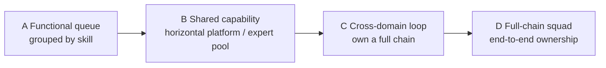

**Version:** 0.1 (preprint)
**Date:** 2026-08-14
**Type:** Position paper, based on the author's practice in engineering organizations and a synthesis of public materials.

## Abstract

Functional lines are not inherently wrong. When professional capability was highly specialized, they unified standards, accumulated deep knowledge, and made the system's gears turn more efficiently. But organizational structure should not be locked permanently to historical rationality. When AI and automation tools lower many workflow barriers, the weaknesses of any single function become easier to fill in, and the capability that matters begins to shift from "doing one link to the extreme" toward understanding and running a complete end-to-end business: seeing the problem, organizing resources, completing delivery, and taking responsibility for the outcome.

This paper is a position paper. It does not declare that specialization is useless — expertise remains the foundation of quality and judgment; what changes is that expertise must ultimately serve business outcomes rather than become an identity isolated from the business. This paper proposes a judgment framework: whether a functional line should be turned into a shared capability serving the business depends on the relative changes among three factors — **skill barriers, coordination cost, and context scarcity** — rather than on any single uniform organizational prescription. It is not a binary choice of "functional lines vs business lines," but a continuous spectrum — from functional queue, to shared capability, to cross-domain loop, to full-chain squad — and an organization should choose the form that matches its own bottleneck.

At the industry-comparison level, this paper's spectrum resonates strongly with the four team types in *Team Topologies* and Netflix's full-cycle developer practice, but it also fills a gap that each of them leaves uncovered: **how AI, as a variable that actively changes "skill barriers," triggers an organization to move along the spectrum** — rather than merely offering a static "what should be." This paper further distinguishes two organizational starting points, Chinese and American (functional lines still the default vs already substantially loosened), and on that basis discusses **what talent the future needs**: not "everyone must be full-stack," but cross-domain deliverers, shared experts, and boundary designers each finding their proper place.

This paper reports no organizational performance data and does not claim that any structure is necessarily superior. It provides a mechanistic explanation, a spectrum of organizational forms, a set of judgment signals, and a path that can be tested through pilots.

**Keywords:** organizational design; functional lines; business lines; AI; end-to-end capability; division of labor; super-individual

## 1. The problem: organizational structure should not be locked to historical rationality

Functional lines (frontend, backend, client, testing, design…) were efficient in an era of highly specialized professional capability: they unified standards, accumulated deep knowledge, and kept the gears turning efficiently. But once an organization takes shape structurally, it easily mistakes "once reasonable" for "always reasonable."

AI changes this premise. When AI and automation tools substantially lower workflow barriers — letting one engineer cross, faster, the routine boundaries that once required different roles — the weaknesses of any single function become easier to fill in. And so the truly scarce capability begins to shift from "doing one link to the extreme" toward "understanding and running a complete end-to-end business": seeing the problem, organizing resources, completing delivery, and taking responsibility for the outcome.

The question this paper asks is not "should functional lines exist," but: **once tools have lowered workflow barriers, what signal indicates that an organization should shift toward end-to-end business capability instead of clinging to historical division of labor?** And further: even when the direction is clear, which form should the organization choose, rather than picking between two extremes? Section 8 will compare this judgment with industry frameworks and practices such as Team Topologies and Netflix to test where it stands; Sections 9–10 further discuss the two Chinese and American starting points, and how this change affects future talent needs.

## 2. The mechanism: how falling barriers change the economics of organizational division of labor

Functional lines emerged because specialization lowers costs: standardization, depth, reuse. Its price is coordination: cross-functional demands must be scheduled back and forth among multiple queues, and every change in the problem forces a re-queue. For a long time this price was offset by the benefits of specialization.

**The mechanism.** When tools lower the cost of "mastering another function," three edges change at once:

1. **Skill barriers fall**: the range of functions one person can cover widens, and the necessity of "each person does only one link" imposed by specialization declines.
2. **Coordination cost rises to become the bottleneck**: when a single link gets faster, waiting, switching, joint debugging, and queuing become the main time sinks, and the relative cost of cross-functional coordination rises.
3. **Context becomes the scarce good**: people who can understand the whole picture of the business and translate it into executable judgment become scarcer than pure specialists.

Together these three show that the bottleneck of organizational efficiency shifts from "some link is not specialized enough" to "the whole chain is not coherent enough." If functional lines remain independent end-points at this stage, they become artificial friction that fixes coordination cost into the process.

**Relationship to the AI capability-boundaries paper.** In "Before Putting AI Capability into an Engineering Organization, First Define the Boundaries" [1], the "responsibility boundary" argues: AI expands the scope of delivery, but professional responsibility does not transfer — key judgments involving data models, security, performance, and user experience must still be made by a role that is accountable. This paper is one concrete organizational form of that boundary: when AI lets one person cover a larger range, how does the organization divide the responsibility units of "who pushes forward, who reviews, who approves." AI is not the protagonist here but a catalytic variable: it magnifies the "coordination cost vs specialized reuse" contradiction, bringing to the surface problems that were previously hidden by the benefits of specialization.

## 3. The spectrum of organizational forms: not a binary choice, but a continuous spectrum

The "functional lines vs business lines" dichotomy conceals the real space of choices in organizational design. A more accurate description is a continuous spectrum, in which each form has its own conditions for viability:

| Form | Responsibility unit | Conditions for viability | Bottleneck |
| --- | --- | --- | --- |
| A. Functional queue | Grouped by skill; cross-functional work relies on queue handoffs | Skill barriers high, depth valuable, tasks standardizable | Coordination cost, loss of context |
| B. Shared capability | Function becomes a horizontal platform / expert pool serving business loops | Standard work automated, experts still have deep value | Insufficient closeness to the business |
| C. Cross-domain loop | Members jointly own a complete chain; experts act as shared support | Tools significantly lower barriers; chain coherence is the main bottleneck | Reduced coverage in deep domains |
| D. Full-chain squad | The squad independently owns end-to-end outcomes, with almost no cross-team handoff | High value, high frequency, clear responsibility boundaries | Loss of reuse and standardization |

**The key insight.** Most teams do not need to jump between A and D; they move along the spectrum: when the signals change, shift the responsibility unit one notch toward the business-facing end, rather than restructuring completely. Over-restructuring (jumping straight to D) often produces a failure symmetric to "clinging to functional lines" — loss of professional depth, loss of reuse, with limited improvement in delivery.

## 4. Judgment signals: when it is worth moving, and in which direction

Functional lines should not be abolished indiscriminately. The more of the following signals appear, the more it is worth considering moving the responsibility unit toward the business-facing end:

1. **Cross-functional collaboration has become the main cost.** The time spent waiting, joint-debugging, and queuing begins to significantly exceed the time spent "doing one link."
2. **People who can understand the whole business deliver better than pure specialists.** This is not a difference in talent, but tools having made skill barriers no longer an insurmountable boundary.
3. **Tools have significantly lowered the original skill barriers.** For example, standard work has been automated, and the remaining bottleneck is judgment rather than operation.
4. **Cost and output pressure demand shorter decision and execution chains.** Merging only makes sense when the cost of "one more handoff layer" exceeds the benefit of "one less layer of specialized reuse."

**Judging the direction.** That the signals hold does not mean jumping straight to D. Use three axes to judge which notch to move to:

- **How high do the skill barriers remain?** If high (security, data models, complex architecture), keep experts as shared support (B/C) rather than abolishing specialization.
- **How much of total delivery is coordination cost?** If it has become the main time sink, it is worth moving toward a cross-domain loop (C).
- **How scarce is business context?** If people who can understand the whole picture are few and irreplaceable, it is better to let a few people run the full chain (C/D) than to roll out a sweeping, all-encompassing transformation.

## 5. Testable claims

**Claim one.** In organizations where the signals hold, moving the responsibility unit to a cross-domain loop (C) while keeping experts as shared support should complete end-to-end delivery faster than maintaining a functional queue, without increasing missed reviews on high-risk links.

**Claim two.** In organizations where the signals do not hold (skill barriers still high, coordination cost not the main bottleneck), forcibly merging functional lines will reduce professional depth while improving delivery only marginally — a failure mode symmetric to "clinging to functional lines."

**Claim three.** After the transition, specialization turns from an "identity" into a "shared capability serving the business": experts are still called upon (as shared support), but no longer interpose in routine delivery through a "scheduling queue"; missed reviews on key judgments (security, data models, performance) do not increase.

**Claim four (on AI's role).** AI's correct role in this process is to lower the threshold for "mastering another function," not to cancel responsibility. In a pilot, routine implementation completed cross-domain may increase, but the review path for high-risk changes should remain explicit — this is precisely the testable meaning of the responsibility boundary.

## 6. Boundaries: what is the opposite of this organizational judgment

This kind of division has several clear opposites that organizational judgment must avoid:

- **It is not declaring specialization useless.** Expertise remains the foundation of quality and judgment; what changes is that expertise ultimately serves business outcomes rather than becoming an identity isolated from the business.
- **It is not merging for merging's sake.** The goal is stronger end-to-end execution; if merging only removes one step without improving the chain, it is meaningless.
- **It is not abolishing functional lines indiscriminately.** In domains with high skill barriers that require depth, functional lines may still be the better form of organization. This is a signal-based judgment, not an ideology.
- **It is not turning "end-to-end" into the disappearance of responsibility.** Cross-domain delivery expands scope, not responsibility — judgments about data models, security, performance, and user experience still need someone accountable. If "end-to-end" only means interfaces disappearing from the org chart, it leaves a nobody-is-accountable void on the risk side.

## 7. How to land it: a small-scope, falsifiable pilot

Organizational redesign should not begin with a full restructuring. A pilot path suited to one clearly defined business chain:

1. **Define one chain and its counterfactual.** Choose a high-frequency chain where the cost of cross-functional collaboration is tangible; record the current end-to-end delivery time, the manual intervention points, and the distribution of queuing.
2. **Choose one notch to move.** Do not jump to D. If the signals have only just emerged, first move to B or C: turn some function into a shared capability, or have members jointly own one chain.
3. **Set the boundaries.** Make explicit who may push routine implementation forward, who must review, and who may approve; the escalation path for high-risk changes stays unchanged during the pilot.
4. **Define success and stop conditions.** End-to-end delivery time falls and missed high-risk reviews do not increase; if professional depth visibly declines or delivery does not improve, roll back.
5. **Record process evidence.** Record queue waiting time, manual intervention points, the way experts are called upon, missed reviews, and quality signals.
6. **A three-way decision.** Expand, modify, or stop. A redesign without evidence should not automatically become a long-term organizational commitment just because the demo looked good.

This protocol does not aim to prove once and for all that "functional lines should be abolished." What it identifies is: on this chain, which responsibility unit better matches the current bottleneck, and at what cost.

## 8. Comparison with industry frameworks and practices

This paper's spectrum is not an isolated view. It resonates strongly with other organizational-design frameworks, but it also points out the one link each of them leaves uncovered: **how AI, as a variable that actively changes "skill barriers," triggers an organization to move along the spectrum.**

### 8.1 Team Topologies: restating "functional vs business" as four team types

Skelton and Pais's *Team Topologies* replaces the traditional functional/business dichotomy with four team types: **stream-aligned teams** (responsible end-to-end for one business stream), **platform teams** (providing capability to the layers above), **enabling teams** (helping other teams master capability), and **complicated-subsystem teams** (reserved for extremely deep domains). [2][3] It emphasizes that organizations should be designed for "fast flow of value," and it takes Conway's law as a constraint — a system's structure will mirror the organization's communication structure. [4]

The correspondence is clear: this paper's A (functional queue) ≈ functional teams, B (shared capability) ≈ platform/enabling teams, and C/D (cross-domain loop, full-chain squad) ≈ stream-aligned teams. **So this paper's spectrum is essentially a projection of Team Topologies onto the single "functional vs business" axis.** One of its direct corollaries agrees with Team Topologies: even if most teams should lean toward stream alignment, platform/enabling teams are always needed to carry expert depth — this is another way of stating this paper's Claim three, "specialization turns from identity into shared capability."

**This paper's increment.** Team Topologies' team types are a static "what should be"; what this paper gives is the **trigger mechanism for moving** — how the three edges of skill barriers, coordination cost, and context scarcity change with the tools, and why "shifting one notch along the spectrum" is safer than "jumping to stream alignment." It does not replace Team Topologies, but fills in the link it develops less: "what signal triggers movement."

### 8.2 Netflix: a practical precedent of the full-cycle developer

Netflix has long practiced "full-cycle developers" — developers responsible for the entire chain, from writing code to deployment, operations, and on-call. [5] This is the industry precedent for C/D (cross-domain loop, full-chain squad). It is worth noting that Netflix's organizational culture is precisely "few processes, high freedom, accountability for outcomes," which points in the same direction as this paper's judgment of "letting the few people who can understand the whole business run the full chain."

**This paper's increment.** Netflix is a success case of stream alignment / full-chain under a high-freedom culture, but it cannot be copied directly: it demands extremely high engineer capability and trust, and not all teams have that cultural premise. This paper's spectrum acknowledges this — the conditions for D (full-chain squad) to be viable are precisely "high value, high frequency, clear responsibility boundaries," not a default solution for all organizations. Netflix proves the path can work; this paper explains **under what conditions it should be taken.**

### 8.3 Community discussion of "organizational form after AI acceleration"

Most public discussion of AI's impact on team structure falls into two positions: one predicts that "AI vastly raises individual productivity, functional barriers disappear, and organizations should turn entirely toward stream alignment"; the other warns that "AI will dilute professional depth, so functions and platforms must be preserved." This paper rejects both extremes. It argues: what AI changes is **the skill-barrier edge**, while organizational movement still depends on the other two edges — coordination cost and context scarcity — so the correct answer is not a binary choice, but to move one notch along the spectrum while keeping shared capability to carry expert depth.

This distinguishes it from the popular "in the AI era everyone must be full-stack" narrative: not everyone must become full-stack; rather, the organization should let **the few people who can understand the whole business** run the full chain, while experts continue to exist in the form of shared capability.

### 8.4 Summary of this paper's position

Compared with the frameworks above, this paper's distinctive contribution can be summarized in three points:

1. **A continuous spectrum rather than a dichotomy**: functional lines vs business lines are not two options but an A→D spectrum; organizations should move, not jump.
2. **A three-edge trigger mechanism**: skill barriers, coordination cost, and context scarcity together determine the direction of movement — AI changes only one of the edges.
3. **Preserving specialization rather than eliminating it**: after the transition, specialization exists as shared capability rather than disappearing; this is structurally consistent with Team Topologies' platform/enabling teams and Netflix's expert teams.

### 8.5 The currency and boundaries of the industry frameworks

The industry frameworks cited above are not static truths. The table below marks each framework's source, currency, and boundaries, to remind the reader: every framework has questions it answers and questions it cannot, and when citing one you should verify its version and its conditions of applicability (as of 2026-08-14):

| Framework / practice | Source and year | Question it answers | Mechanism it provides | Currency status and boundaries |
| --- | --- | --- | --- | --- |
| This paper: A→D spectrum | Liyuk (2026) | Should functional lines turn toward business lines? Which notch to move to? | Three-edge trigger mechanism (skill barriers, coordination cost, context scarcity), continuous spectrum, judgment signals | This paper; a position paper, not an empirical conclusion |
| Team Topologies | Skelton & Pais (2019; 2nd ed. 2025) | How should organizations design for fast value flow? | Four team types (stream-aligned / platform / enabling / complicated-subsystem); a lean toward stream alignment | 2nd ed. published 2025-09, adding practical cases; a static "what should be," with less on "what signal triggers movement" |
| Conway's law | Conway (1968) | How does organizational structure affect system structure? | The observation that "systems mirror communication structure" | Proposed in 1968; a constraining background for organizational design, not a prescription |
| Netflix Full-cycle | Netflix (2018) | One practice of full-chain responsibility | Developers responsible end-to-end | A 2018 blog post; a success case of a high-freedom culture, not directly copyable |
| Reports on Chinese organizational change | Several large Chinese tech companies (2025–26) | How are Chinese tech organizations restructuring for AI? | Directional signals of "functional lines loosening / being abolished" | Public reports, not primary research; concrete implementations vary widely and must be verified against primary sources |

What the table is meant to remind the reader of is not "which one to adopt," but: **every framework has its own starting point and boundaries.** Team Topologies assumes functional lines still exist and asks whether to stream-align; Netflix assumes a high-freedom culture; the Chinese reports show a different starting point altogether. This paper's spectrum tries to provide a map of movement among these frameworks, rather than competing with them.

## 9. Two starting points, China and the US: the loosening of functional lines and how specialization survives

Section 1 implies a baseline: functional lines are the status quo, and organizations are considering whether to move. This baseline is closer to the American context — there, functional lines are still the default, and frameworks such as Team Topologies discuss "whether to stream-align." But at least in China's tech industry, this baseline has already changed: many organizations have already abolished, or are abolishing, functional lines; middle managers are pushed down to the front line, teams are reorganized around business/platform, and specialization no longer has "functional lines" as its default carrier.

This is not two ways of stating one proposition, but **two different starting points**:

| | American starting point | Chinese starting point |
| --- | --- | --- |
| State of functional lines | Still the default; organizations are considering whether to move | Already substantially loosened / abolished; organizations are deconstructing them |
| Core question | Should I move from functional lines to business lines? | Functional lines are already gone; how do I avoid losing control and preserve specialization? |
| AI's role | A catalyst that makes moving more worthwhile | Already infrastructure, forcing organizational structure to change |
| Main tension | Professional depth vs coordination cost | How specialization survives after "de-functionalization" (without following individuals) |

**This paper's spectrum holds under both the Chinese and American starting points, but is used differently.** Under the American starting point it is a map of "whether to move and where to move"; under the Chinese starting point it is an anchor of "how to pull back when the move has gone too far, and how to keep specialization from following individuals" — after an organization has abolished functional lines and let members run the full chain, this paper's B (shared capability) is exactly where "specialization" is carried: experts no longer exist as units of functional lines, but are called upon in the form of platforms, shared capability, and deep consultation.

It should be noted that "functional lines have been substantially abolished in China" is here an **observation to be verified**, not a conclusion. It is based on reading public reports — several large Chinese tech companies restructuring their organizations in the name of AI, removing some management layers, and pushing middle managers down to the front line [6][7] — these are directional signals of organizational change in 2025–26, but the concrete implementation varies widely from company to company and team to team, and "abolishing functional lines" should not be treated as a universal fait accompli. This paper takes it as one of the two starting points, not as a definitive description of Chinese organizations.

**Implication for the Chinese starting point.** If functional lines have already loosened, the spectrum of Section 3 and the judgment signals of Section 4 still apply, but one pull-back judgment must be added: when "de-functionalization" has gone too far and professional depth begins to drain systematically (experts leave, deep domains have no one accountable, reuse and standardization are lost), the organization should not rebuild the functional walls, but return to the B notch of the spectrum — rebuilding specialization as shared capability. This fits the "move, don't jump" principle better than returning to A (functional queue): it is not retreating to the old structure, but fitting specialization into the new structure.

## 10. What talent the future needs

Changes in organizational form ultimately land on talent needs. This paper's spectrum points to a relatively clear set of capability combinations — not "everyone must be full-stack," but several roles each with a distinct emphasis:

**1. People who can run the full chain (cross-domain deliverers).** Corresponding to C/D on the spectrum. They need not be proficient at everything, but can understand the whole business, organize resources, complete delivery, and take responsibility for outcomes. AI lowers the threshold for "crossing functional boundaries," making such people a scarce resource — what is scarce is not coding ability, but the ability to **translate business problems into executable judgment**. Public discussion corroborates this direction: industry demand for talent is turning toward the compound "algorithm + application + agent" capability [8], and compound AI talent is increasingly favored by companies [9].

**2. Deeply specialized people (shared experts).** Corresponding to B on the spectrum. In domains such as data models, security, performance, and complex architecture, professional depth remains irreplaceable. After functional lines loosen, such people no longer exist as units of functional lines, but are called upon in the form of platforms, shared capability, and deep consultation. The review responsibility for key judgments falls on them — this is precisely the talent-side meaning of "specialization turns from identity into shared capability."

**3. People who judge and design (organizational and boundary designers).** Corresponding to this paper's methodology. Who decides which notch of the spectrum the organization should move to? Who can judge whether the signals hold? This role turns observations of "skill barriers, coordination cost, context scarcity" into organizational decisions, and holds the boundaries after the move (who pushes forward, who reviews, who approves).

**This paper's position: not "everyone full-stack," but "everyone in their proper place."** This differs from the popular "in the AI era everyone must be full-stack" narrative: let the few people who can understand the whole business run the full chain, let experts exist as shared capability, and let a few people take charge of organizational and boundary design. The proportion of the three varies by organization, but all three must exist — because among the three edges (skill barriers, coordination cost, context scarcity), none will ever go to zero.

**Boundaries of the talent judgment.** The above is an organizational-level judgment about talent structure, not career advice for individuals; it does not predict whether any specific position will disappear, nor does it promise that any particular capability combination will necessarily bring better individual career outcomes. Specific figures in public reports, such as "compound talent is more favored" and "AI+ positions pay higher," need to be verified against the original reports, and this paper does not cite them as established conclusions.

## 11. Threats to validity and research boundaries

First, this paper is a position paper, based on the author's practice in engineering organizations and public materials; it does not represent any company or product, nor does it claim that any structure is universally superior. Second, the "testable claims" in this paper are predictions awaiting pilot verification, not measured conclusions. Third, organizational design depends heavily on the skill structure, market stage, and team size of the specific business; this paper offers a judgment framework and a path of movement, not a prescription. Fourth, AI tools change quickly, and the description of "falling barriers" here represents only the trends observable as of 2026-08-14. Fifth, "functional lines have been substantially abolished in China" and "industry talent demand is turning toward compound capability" are observations based on the direction of public reports; the specific facts must be verified against primary sources.

## 12. Conclusion

The reason functional lines existed was once the cost advantage of specialization; when tools lower skill barriers, the relative weight of that advantage falls, and coordination cost becomes the new bottleneck. This is not "specialization is useless," but that specialization must be repositioned: from an identity isolated from the business to a shared capability serving the business loop.

Organizations should watch the signals, not chase slogans. Has cross-functional collaboration become the main cost? Do people who can understand the whole business deliver better? Have tools significantly lowered the skill barriers? Does cost pressure demand shorter chains? When the signals hold, the organization should move along the spectrum — shift the responsibility unit one notch toward the business-facing end, rather than jumping between the two extremes, and still less clinging to historical division of labor. The goal is always stronger end-to-end execution, not merging for merging's sake.

## References

1. Liyuk (2026). [Before Putting AI Capability into an Engineering Organization, First Define the Boundaries](https://github.com/Liyuk/liyuk.github.io/blob/main/src/content/research/2026/08/ai-engineering-capability-boundaries/zh.md). A sister paper on this site, discussing the four kinds of boundaries when AI enters an organization.
2. Skelton, M., & Pais, M. (2019; 2nd ed. 2025). *Team Topologies: Organizing Business and Technology Teams for Fast Flow*. IT Revolution Press. Proposes the four team types: stream-aligned, platform, enabling, and complicated-subsystem. [Official introduction](https://teamtopologies.com/). This paper cites its team types and its "fast flow of value" organizational principle.
3. Skelton, M., & Pais, M. (2025). [Team Topologies, 2nd Edition: Real-World Lessons from the Global Business Community](https://itrevolution.com/articles/team-topologies-2nd-edition-real-world-lessons-from-the-global-business-community/). Published September 2025; adds a large number of practical cases.
4. Conway, M. E. (1968). *How Do Committees Invent?*. Conway's law: a system's structure mirrors the organization's communication structure. [Overview](https://github.com/gmkzwwg/cs-learning-atlas/blob/master/collections/_engineering/7.3.software-process-delivery-iteration-and-coordination.md). This paper uses it as the constraining background of "organizational structure affects system structure."
5. Netflix (2018). [Full Cycle Developers at Netflix](https://netflixtechblog.com/full-cycle-developers-at-netflix-a08c31f83249). The industry precedent for full-cycle developers; this paper cites its "responsible for the entire chain" organizational model.
6. [Alibaba Establishes ATH, Rebuilding the Organizational Engine of the AI Era with Tokens](http://www.nbd.com.cn/rss/sohu/articles/4294437.html). 2026. A public report on Chinese tech organizations restructuring for AI; a directional signal for the "Chinese starting point."
7. [Tencent Abolishes Directors and Team Leads — Management Turns from "Identity" to "Role"](https://www.hrloo.com/dk/76794?blog_id=14786826). 2026. A public report on Chinese tech organizations removing management layers.
8. [Tsinghua Experts Interpret New AI Talent Trends: Industry Demand Turns to the Compound "Algorithm + Application + Agent" Capability](https://news.bjd.com.cn/2026/06/22/11820068.shtml). 2026. A public interpretation of the direction of Chinese AI talent demand.
9. [*The AI-Era Skills Trend Report* Released: Compound AI Talent Is Increasingly Favored by Companies](https://society.yunnan.cn/system/2026/06/23/034053679.shtml). 2026. A public report on demand for compound AI talent.

> Note: References 6–9 are public reports from 2025–26, pointing to the directions of "loosening of functional lines in China" and "demand for compound talent"; the specific facts and figures must be verified against primary sources. This paper does not treat "abolishing functional lines" as a universal fait accompli.

## Author information and declarations

**Author:** Liyuk

**Conflicts of interest:** The author declares no conflicts of interest. This research received no funding from any commercial institution; the public projects, industry reports, and news reports cited serve only as methodological or directional reference.

**Data availability:** This paper is a position paper and reports no organizational performance data. The cases and figures cited come from third-party public materials: Netflix's full-cycle developer practice (a 2018 blog post), Team Topologies (2nd ed. 2025), and public reports from 2025–26 on the restructuring of Chinese tech organizations; these specific facts and figures must be verified against primary sources, and this paper does not treat any single case as a universal fait accompli.

## Glossary

| Term | Definition |
| --- | --- |
| Functional line | Organization by professional specialization (frontend, backend, testing, etc.), unifying standards and accumulating deep knowledge |
| Business line | Organization by end-to-end business capability, responsible for end-to-end outcomes |
| Skill barrier | The threshold of professional capability required to complete one link |
| Coordination cost | The cost of communication and alignment required for cross-functional collaboration |
| Context scarcity | Whether access to end-to-end business information is scarce |
| Spectrum of organizational forms | The continuous spectrum from functional queue, shared capability, cross-domain loop to full-chain squad, rather than a binary choice |
| Cross-domain deliverer | A person who can cross routine functional boundaries to complete delivery |
| Boundary designer | The person who decides how functional/business lines are re-divided and where the interfaces lie |
