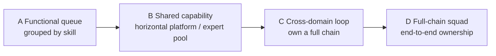

**版本：** 0.1（preprint）
**日期：** 2026-08-14
**类型：** 立场论文（position paper），基于作者在工程组织的实践与公开材料的综合判断

## 摘要

职能线不是天然错误。专业能力高度分工时，它能统一标准、积累深度知识，让系统的齿轮更高效地运转。但组织结构不应被历史合理性永久锁定。当 AI 和自动化工具降低了许多工作流壁垒，单一职能的短板更容易被补齐，重要的能力开始从"只把某一环做到极致"转向理解并跑通一条全链路业务：看见问题、组织资源、完成交付、对结果负责。

本文是一篇立场论文。它不宣布专精无用——专业仍然是质量和判断的基础；变化在于专业最终要服务于业务结果，而不是成为与业务隔离的身份。本文提出一个判断框架：职能线是否应转成服务业务的共享能力，取决于**技能壁垒、协调成本、上下文稀缺**三者的相对变化，而不是某种统一的组织结构处方。它不是"职能线 vs 业务线"的二选一，而是一条连续谱系——从职能队列、共享能力、跨域闭环到全链路小队，组织应选择与自身瓶颈匹配的形态。

在行业对比层面，本文的谱系与 *Team Topologies* 的四种团队类型、Netflix 的全周期开发者实践高度共鸣，但也补上它们各自没有覆盖的一环：**AI 作为一个主动改变"技能壁垒"的变量，如何触发组织在谱系上移动**——而不是仅仅提供一个静态的"应该是什么"。本文进一步区分中美两种组织起点（职能线仍是默认 vs 已大量松动），并据此讨论**未来需要什么人才**：不是"人人都要全栈"，而是跨域交付者、共享专家与边界设计者三者各归其位。

本文不报告组织绩效数据，也不声称某种结构必然更优。它提供一套机制解释、一个组织形态谱系、一组判断信号，和一条可被试点检验的路径。

**关键词：** 组织设计；职能线；业务线；AI；全链路能力；分工；超级个体

## 1. 问题：组织结构不应被历史合理性锁定

职能线（前端、后端、客户端、测试、设计……）在专业能力高度分工的时代是高效的：它统一标准、积累深度知识、让齿轮高效运转。但组织一旦形成结构，就容易把"曾经合理"误当成"永远合理"。

AI 改变了这个前提。当 AI 和自动化工具大幅降低工作流壁垒——让一个工程师能更快跨越原本要跨角色的常规边界——单一职能的短板更容易被补齐。于是，真正稀缺的能力开始从"把某一环做到极致"转向"理解并跑通一条全链路业务"：看见问题、组织资源、完成交付、对结果负责。

本文的问题不是"职能线该不该存在"，而是：**当工具降低了工作流壁垒，什么信号说明组织应转向全链路业务能力，而不是固守历史分工？** 更进一步：即使方向明确，组织应当选择哪种形态，而不是在两个极端之间二选一？第 8 节将把这一判断与 Team Topologies、Netflix 等行业框架和实践对比，检验它的位置；第 9–10 节进一步讨论中美两种组织起点，以及这种变化对未来人才需求的影响。

## 2. 机制：壁垒降低如何改变组织分工的经济性

职能线之所以出现，是因为专业分工能降低成本：标准化、深度、复用。它的代价是协调：跨职能的需求要在多个队列间来回排期，问题一变就重新排队。这个代价长期被专业化的收益抵消。

**机制。** 当工具降低了"掌握另一项职能"的成本，三条边同时变化：

1. **技能壁垒下降**：一个人能覆盖的职能范围变宽，专业分工带来的"每个人只做一环"的必要性下降。
2. **协调成本上升为瓶颈**：当单环节变快，等待、切换、联调、排队成为主要耗时，跨职能协调的相对成本上升。
3. **上下文成为稀缺品**：能理解业务全貌、并把它翻译成可执行判断的人，比纯粹分工者更稀缺。

这三条共同说明：组织效率的瓶颈从"某一环不够专业"转向"整条链路不够连贯"。职能线此时若仍是独立终点，会变成把协调成本固定在流程里的人为摩擦。

**与 AI 能力边界论文的关系。** 在《把 AI 能力放进工程组织前，先定义哪些边界》[1] 中，"职责边界"主张：AI 扩大交付范围，但专业责任不转移——涉及数据模型、安全、性能、用户体验的关键判断仍需有责任的角色作出。本文是这条边界的一个具体组织形态：当 AI 让一个人能覆盖更大范围，组织如何划分"谁推进、谁审查、谁批准"的责任单元。AI 不是这里的主角，而是催化变量：它放大"协调成本 vs 专业复用"这对矛盾，使原本被专业化的收益掩盖的问题浮出水面。

## 3. 组织形态谱系：不是一个二选一，而是一条连续谱

"职能线 vs 业务线"的二分法掩盖了真实组织设计的选择空间。更准确的描述是一条连续谱系，每种形态都有其成立的条件：

| 形态 | 责任单元 | 成立条件 | 瓶颈 |
| --- | --- | --- | --- |
| A. 职能队列 | 按技能分组，跨职能靠排队交接 | 技能壁垒高、深度价值大、任务可标准化 | 协调成本、上下文丢失 |
| B. 共享能力 | 职能转为横向平台/专家池，为业务闭环服务 | 标准工作被自动化，专家仍有深度价值 | 业务贴近度不足 |
| C. 跨域闭环 | 成员围绕一条完整链路共同负责，专家作为共享支持 | 工具显著降低壁垒、链路连贯是主要瓶颈 | 深度领域的覆盖下降 |
| D. 全链路小队 | 小队独立对端到端结果负责，几乎无需跨队交接 | 高价值、高频、责任边界清晰 | 复用与标准化的损失 |

**关键洞察。** 多数团队不需要在 A 和 D 之间跳变，而是在这条谱系上移动：当信号变化，把责任单元往更贴近业务的一端挪一格，而不是彻底重构。过度重构（直接跳到 D）常带来与"固守职能线"对称的失败——专业深度下降、复用丧失，而交付改善有限。

## 4. 判断信号：什么情况下值得移动，往哪移动

职能线不应无差别取消。以下信号出现得越多，越值得考虑把责任单元往更贴近业务的一端移动：

1. **跨职能协作已成为主要成本。** 等待、联调、排队的时间开始显著超过"做某一环"的时间。
2. **能理解业务全貌的人，比纯粹分工者更能完成交付。** 这不是天赋差异，而是工具已经让技能壁垒不再构成不可逾越的边界。
3. **工具已经显著降低原本的技能壁垒。** 例如标准工作被自动化，剩下来的瓶颈是判断而非操作。
4. **成本与产出压力要求更短的决策与执行链路。** 当"多一层交接"的代价高过"少一层专业复用"的收益时，合并才有意义。

**方向判断。** 信号成立，不代表直接跳到 D。用三轴判断该移到哪一格：

- **技能壁垒还剩多高？** 如果高（安全、数据模型、复杂架构），保留专家作为共享支持（B/C），而不是取消专业。
- **协调成本占总交付多少？** 如果已成为主要耗时，值得往跨域闭环移动（C）。
- **业务上下文有多稀缺？** 如果能理解全貌的人极少且不可替代，更应让少数人跑通全链路（C/D），而不是铺开大而全的改造。

## 5. 可检验主张

**主张一。** 在信号成立的组织中，把责任单元移到跨域闭环（C）、保留专家作为共享支持，应比维持职能队列更短地完成端到端交付，且不增加高风险环节的审查缺失。

**主张二。** 在信号不成立的组织（技能壁垒仍然很高、协调成本不是主要瓶颈）中，强行合并职能线，会使专业深度下降而交付改善有限——这是与"固守职能线"对称的失败模式。

**主张三。** 转变后，专业从"身份"变成"服务业务的共享能力"：专家仍被调用（作为共享支持），但不再通过"排期队列"介入常规交付；关键判断（安全、数据模型、性能）的审查缺失不增加。

**主张四（关于 AI 的角色）。** AI 在此过程中的正确角色是降低"掌握另一项职能"的门槛，而不是取消责任。试点中，跨域完成的常规实现可以增加，但高风险变更的审查路径应保持明确——这正是职责边界的可检验含义。

## 6. 边界：什么是这种组织判断的反面

这种划分有几个明确的反面，组织判断必须避开：

- **不是宣布专精无用。** 专业仍然是质量和判断的基础；变化在于专业最终服务于业务结果，而不是成为与业务隔离的身份。
- **不是为"合并"而合并。** 目标是更强的全链路执行；若合并只是取消了一道工序而没有改善链路，它就没有意义。
- **不是无差别取消职能线。** 高技能壁垒、需要深度的领域，职能线仍可能是更优的组织方式。这是信号判断，不是意识形态。
- **不是把"端到端"变成责任消失。** 跨域交付扩大的是范围，不是责任——数据模型、安全、性能、用户体验的判断仍需有人负责。所谓端到端若只是在组织图上消失接口，在风险上留下无人负责的空白。

## 7. 怎么落地：一个小范围、可否证的试点

组织再设计不应以全面重构开始。一条适用于一个明确业务链路的试点路径：

1. **定义一条链路与反事实。** 选一条高频、跨职能协作成本可感的链路；记录当前的端到端交付时间、人工介入点、排队的分布。
2. **选一格移动。** 不要跳到 D。若信号刚成立，先移到 B 或 C：把某个职能转成共享能力，或让成员围绕一条链路共同负责。
3. **限定边界。** 明确谁可推进常规实现、谁须审查、谁可批准；高风险变更的升级路径在试点期间保持不变。
4. **定义成功与停止条件。** 端到端交付时间下降、高风险审查缺失不增加；若专业深度明显下降或交付未改善，则回退。
5. **记录过程证据。** 记录排队的等待时间、人工介入点、专家被调用的方式、审查缺失与质量信号。
6. **三选一决策。** 扩大、修改或停止。没有证据的再设计，不因演示效果好就自动成为长期组织承诺。

该协议不追求一次性证明"职能线该取消"。它识别的是：在这条链路上，哪种责任单元更匹配当前瓶颈，以什么代价。

## 8. 与行业框架和实践的对比

本文的谱系不是孤立的观点。它与其他组织设计框架高度共鸣，但也指出了它们各自没有覆盖的一环：**AI 作为一个主动改变"技能壁垒"的变量，如何触发组织在谱系上移动。**

### 8.1 Team Topologies：把"职能 vs 业务"重新表述为四种团队类型

Skelton 与 Pais 的 *Team Topologies* 用四种团队类型取代了传统的职能/业务二分：**流对齐团队**（stream-aligned，对一个业务流端到端负责）、**平台团队**（platform，为上层提供能力）、**使能团队**（enabling，帮助其他团队掌握能力）、以及**复杂的子系统团队**（complicated-subsystem，为极高深领域保留）。[2][3] 它强调组织要"面向价值的快速流动"设计，并以康威定律为约束——系统的结构会镜像组织的沟通结构。[4]

对应关系很明显：本文谱系的 A（职能队列）≈ 职能型团队，B（共享能力）≈ 平台/使能团队，C/D（跨域闭环、全链路小队）≈ 流对齐团队。**所以本文谱系基本是 Team Topologies 在"职能 vs 业务"这条单轴上的投影。** 它的一个直接推论与 Team Topologies 一致：即使大多数团队应倾向流对齐，也总需要平台/使能团队承载专家深度——这就是本文主张三"专业从身份变成共享能力"的另一种表述。

**本文的增量。** Team Topologies 的团队类型是静态的"应该是什么"；本文给出的是**移动的触发机制**——技能壁垒、协调成本、上下文稀缺三条边如何随工具变化，以及为什么"沿谱系挪一格"比"跳到流对齐"更稳妥。它不是取代 Team Topologies，而是补上它较少展开的"什么信号触发移动"这一环。

### 8.2 Netflix：全周期开发者的实践先例

Netflix 长期实践"full-cycle developers"——开发者从写代码到部署、运维、on-call，对整条链路负责。[5] 这是 C/D（跨域闭环、全链路小队）的行业先例。值得注意的是，Netflix 的组织文化恰恰是"少流程、高自由、对结果负责"，这与本文"让少数能理解业务全貌的人跑通全链路"的判断方向一致。

**本文的增量。** Netflix 是流对齐/全链路在高自由度文化下的成功案例，但它不能直接照搬：它对工程师能力与信任要求极高，且不是所有团队都具备这种文化前提。本文的谱系承认这一点——D（全链路小队）的成立条件正是"高价值、高频、责任边界清晰"，而不是所有组织的默认解。Netflix 证明这条路走得通；本文说明它**在什么条件下才该走**。

### 8.3 社区对"AI 加速后组织形态"的讨论

关于 AI 对团队结构影响的公开讨论，大多落在两种立场：一种预言"AI 让个人产能大幅提升，职能壁垒消失，组织应全面转向流对齐"；另一种警告"AI 会稀释专业深度，必须保留职能与平台"。本文反对这两种极端。它主张：AI 改变的是**技能壁垒这条边**，而组织移动仍取决于协调成本与上下文稀缺另外两条边——所以正确的答案不是二选一，而是沿谱系移动一格，且保留共享能力承载专家深度。

这使它区别于"AI 时代人人都要全栈"的流行叙事：不是每个人都要变全栈，而是组织应让**少数能理解业务全貌的人**跑通全链路，同时让专家以共享能力的形式继续存在。

### 8.4 本文立场小结

与上述框架对比，本文的独特贡献可以概括为三点：

1. **连续谱系而非二分**：职能线 vs 业务线不是两个选项，而是一条 A→D 谱系，组织应移动而非跳变。
2. **三条边的触发机制**：技能壁垒、协调成本、上下文稀缺共同决定移动方向——AI 只改变其中一条边。
3. **保留专业而非消灭专业**：转变后专业以共享能力存在，而不是消失；这与 Team Topologies 的平台/使能团队、Netflix 的专家团队在结构上是一致的。

### 8.5 行业框架的时效与边界

上文引用的行业框架并非静态真理。下表标明每个框架的出处、时效与边界，提醒读者：任何框架都有它回答的问题和回答不了的问题，引用时应核对其版本与适用条件（截至 2026-08-14）：

| 框架 / 实践 | 来源与年份 | 回答的问题 | 提供的机制 | 时效状态与边界 |
| --- | --- | --- | --- | --- |
| 本文：A→D 谱系 | Liyuk (2026) | 职能线是否应转向业务线？往哪一格移动？ | 三条边触发机制（技能壁垒、协调成本、上下文稀缺）、连续谱系、判断信号 | 本文；立场论文，非实证结论 |
| Team Topologies | Skelton & Pais (2019; 第 2 版 2025) | 组织如何面向价值流动设计？ | 四种团队类型（流对齐/平台/使能/复杂子系统）；面向流对齐的倾向 | 第 2 版 2025-09 出版，补充落地案例；是静态"应该是什么"，较少展开"什么信号触发移动" |
| Conway 定律 | Conway (1968) | 组织结构如何影响系统结构？ | "系统镜像沟通结构"的观察 | 1968 年提出；作为组织设计的约束背景，不是处方 |
| Netflix Full-cycle | Netflix (2018) | 全链路责任的一种实践 | 开发者对端到端负责 | 2018 年 blog；高自由度文化的成功案例，不能直接照搬 |
| 中国组织变革报道 | 多家中国大型科技公司 (2025–26) | 中国科技组织如何为 AI 重组？ | "职能线松动/取消"的方向性信号 | 公开报道，非一手研究；具体落地千差万别，需回到一手来源核验 |

表格要提醒的不是"该采用哪套"，而是：**每个框架都有其成立的起点和边界。** Team Topologies 假设职能线仍存在、讨论要不要流对齐；Netflix 假设高自由度文化；中国报道则显示起点已经不同。本文的谱系试图在这些框架之间提供一个移动的地图，而不是与它们竞争。

## 9. 中美两种起点：职能线松动与专业如何存活

第 1 节隐含了一个基线：职能线是现状，组织在考虑要不要移动。这个基线更接近美国语境——在那里，职能线仍是默认，Team Topologies 等框架讨论的是"要不要流对齐"。但至少在中国科技行业，这个基线已经变了：大量组织已经或正在取消职能线，中层管理者下沉、团队向业务/平台重组，专业不再以"职能线"为默认载体。

这不是一个命题的两种表述，而是**两种不同的起点**：

| 维度 | 美国起点 | 中国起点 |
| --- | --- | --- |
| 职能线的状态 | 仍是默认，组织在考虑要不要移动 | 已大量松动/取消，组织在解构它 |
| 核心问题 | 我该不该从职能线移向业务线？ | 职能线已经没了，我怎样避免失控、保住专业？ |
| AI 的角色 | 催化剂，让移动更划算 | 已是基建，倒逼组织结构 |
| 主要张力 | 专业深度 vs 协调成本 | 专业在"去职能化"后如何存活（不跟人走） |

**本文的谱系在中美两种起点下都成立，但用法不同。** 在美国起点下，它是"要不要移动、往哪移动"的地图；在中国起点下，它是"移动过头了怎么往回拉、专业怎么不跟人走"的锚点——当组织取消了职能线、让成员跑通全链路后，本文的 B（共享能力）正是承接"专业"的地方：专家不再以职能线为单位存在，而是以平台、共享能力、深度咨询的形式被调用。

需要说明的是，"中国职能线已大量取消"在这里是一个**待核验的观察**，而非定论。它基于对公开报道的阅读——多家中国大型科技公司以 AI 之名重组组织、取消部分管理层级、让中层下沉一线 [6][7]——这些是 2025–26 的组织变动的方向性信号，但具体到某个企业、某个团队的落地方式千差万别，不应把"取消职能线"当成普遍既成事实。本文把它作为两种起点中的一种，而不是对中国组织的确定描述。

**对中国起点的含义。** 若职能线已经松动，本文第 3 节的谱系和第 4 节的判断信号仍然适用，但要加一条回拉的判断：当"去职能化"走得太远、专业深度开始系统性流失时（专家退出、深度领域无人负责、复用与标准化丧失），组织不应重新砌回职能墙，而应回到谱系的 B 格——把专业重建为共享能力。这比回到 A（职能队列）更符合"移动而非跳变"的原则：不是退回旧结构，而是把专业装进新结构。

## 10. 未来需要什么人才

组织形态变化最终会落到人才需求上。本文的谱系指向一组相对明确的能力组合——不是"人人都要全栈"，而是几种角色各有侧重：

**1. 能跑通全链路的人（跨域交付者）。** 对应谱系的 C/D。他们不一定样样精通，但能理解业务全貌、组织资源、完成交付并对结果负责。AI 让"跨越职能边界"的门槛下降，使这样的人成为稀缺资源——稀缺的不是代码能力，而是**把业务问题翻译成可执行判断**的能力。公开讨论也印证了这个方向：行业对人才的需求正转向"算法 + 应用 + 智能体"的复合能力 [8]，复合型 AI 人才更受企业青睐 [9]。

**2. 深度专业的人（共享专家）。** 对应谱系的 B。数据模型、安全、性能、复杂架构等领域，专业深度仍然不可替代。在职能线松动后，这类人不再以职能线为单位存在，而是以平台、共享能力、深度咨询的形式被调用。关键判断的审查责任落在他们身上——这正是"专业从身份变成共享能力"的人才含义。

**3. 判断与设计的人（组织与边界设计者）。** 对应本文的方法论。谁来决定组织该往谱系的哪一格移动？谁能判断信号是否成立？这类角色负责把"技能壁垒、协调成本、上下文稀缺"的观察转成组织决策，并在移动后守住边界（谁推进、谁审查、谁批准）。

**本文的立场：不要"人人都全栈"，要"人人各归其位"。** 这与流行的"AI 时代人人都要全栈"叙事不同：让少数能理解业务全貌的人跑通全链路，同时让专家以共享能力存在，再让少数人负责组织与边界的设计。三者的比例因组织而异，但三者都需要存在——因为三条边（技能壁垒、协调成本、上下文稀缺）中，没有一条会归零。

**人才判断的边界。** 上述是组织层面的人才结构判断，不是对个体的职业建议；它不预测某个具体岗位是否消失，也不承诺某种能力组合必然带来更好的个人职业结果。公开报告中"复合型人才更受青睐""AI+ 职位薪资更高"等具体数字，需要回到原始报告核验，本文不将其作为既定结论引用。

## 11. 有效性威胁与研究边界

第一，本文是立场论文，基于作者在工程组织的实践与公开材料，不代表任何企业或产品，也不声称某种结构普遍更优。第二，文中的"可检验主张"是待试点验证的预测，不是已测得的结论。第三，组织设计高度依赖具体业务的技能结构、市场阶段与团队规模，本文提供的是判断框架与移动路径，而非处方。第四，AI 工具变化很快，文中对"壁垒降低"的描述只代表截至 2026-08-14 可观察到的趋势。第五，"中国职能线已大量取消"与"行业人才需求转向复合能力"是基于公开报道方向的观察，具体事实需回到一手来源核验。

## 12. 结论

职能线的存在理由曾经是专业分工的成本优势；当工具降低了技能壁垒，这个优势的相对权重会下降，协调成本会成为新的瓶颈。这不是"专精无用"，而是专业要重新定位：从与业务隔离的身份，变成服务业务闭环的共享能力。

组织应观察信号，而不是追逐口号。跨职能协作是否已成为主要成本？能理解业务全貌的人是否更能完成交付？工具是否已显著降低技能壁垒？成本压力是否要求更短的链路？信号成立时，组织应沿谱系移动——把责任单元往更贴近业务的一端挪一格，而不是在两个极端之间跳变，更不是固守历史分工。目标始终是更强的全链路执行，而不是为了"合并"而合并。

## 参考文献

1. Liyuk (2026). [把 AI 能力放进工程组织前，先定义哪些边界](https://github.com/Liyuk/liyuk.github.io/blob/main/src/content/research/2026/08/ai-engineering-capability-boundaries/zh.md). 本站姊妹论文，讨论 AI 进入组织的四类边界。
2. Skelton, M., & Pais, M. (2019; 第 2 版 2025). *Team Topologies: Organizing Business and Technology Teams for Fast Flow*. IT Revolution Press. 提出流对齐、平台、使能、复杂子系统四种团队类型。[官方介绍](https://teamtopologies.com/)。本文引用其团队类型与"面向价值流动"的组织原则。
3. Skelton, M., & Pais, M. (2025). [Team Topologies, 2nd Edition: Real-World Lessons from the Global Business Community](https://itrevolution.com/articles/team-topologies-2nd-edition-real-world-lessons-from-the-global-business-community/). 2025 年 9 月出版；补充了大量落地案例。
4. Conway, M. E. (1968). *How Do Committees Invent?*. 康威定律：系统的结构会镜像组织的沟通结构。[综述](https://github.com/gmkzwwg/cs-learning-atlas/blob/master/collections/_engineering/7.3.software-process-delivery-iteration-and-coordination.md)。本文作为"组织结构影响系统结构"的约束背景。
5. Netflix (2018). [Full Cycle Developers at Netflix](https://netflixtechblog.com/full-cycle-developers-at-netflix-a08c31f83249). 全周期开发者的行业实践先例；本文引用其"对整条链路负责"的组织模式。
6. [阿里成立 ATH，以 Token 重构 AI 时代组织引擎](http://www.nbd.com.cn/rss/sohu/articles/4294437.html). 2026. 中国科技组织为 AI 重组的公开报道；作为"中国起点"的方向性信号。
7. [腾讯取消总监、组长——管理从"身份"变"角色"](https://www.hrloo.com/dk/76794?blog_id=14786826). 2026. 中国科技组织取消管理层级的公开报道。
8. [清华专家解读 AI 人才新趋势：行业需求转向"算法 + 应用 + 智能体"复合能力](https://news.bjd.com.cn/2026/06/22/11820068.shtml). 2026. 关于中国 AI 人才需求方向的公开解读。
9. [《AI 时代技能趋势报告》发布 复合型 AI 人才更受企业青睐](https://society.yunnan.cn/system/2026/06/23/034053679.shtml). 2026. 关于复合型 AI 人才需求的公开报告报道。

> 注：参考文献 6–9 为 2025–26 年的公开报道，指向"中国职能线松动"与"复合型人才需求"的方向，具体事实与数字需回到一手来源核验。本文不把"取消职能线"当作普遍既成事实。

## 作者信息与声明

**作者：** Liyuk

**利益冲突：** 作者声明无利益冲突。本研究未受任何商业机构资助；文中引用的公开项目、行业报告与报道均仅作方法或方向参考。

**数据可用性：** 本文是立场论文，不报告组织绩效数据。文中引用的案例与数字来自第三方公开资料：Netflix 全周期开发者实践（2018 博客）、Team Topologies（第 2 版 2025）、以及 2025–26 年关于中国科技组织重组的公开报道；这些具体事实与数字需回到一手来源核验，且本文不把任何单一案例当作普遍既成事实。

## 术语表

| 术语 | 定义 |
| --- | --- |
| 职能线 | 按专业分工组织（前端、后端、测试等），统一标准、积累深度知识 |
| 业务线 | 按全链路业务能力组织，对端到端结果负责 |
| 技能壁垒 | 完成某一环节所需专业能力的门槛 |
| 协调成本 | 跨职能协作所需的沟通与对齐代价 |
| 上下文稀缺 | 对全链路业务信息的接触机会是否稀缺 |
| 组织形态谱系 | 从职能队列、共享能力、跨域闭环到全链路小队的连续谱，而非二选一 |
| 跨域交付者 | 能跨越常规职能边界完成交付的人 |
| 边界设计者 | 决定职能/业务如何重新划分、接口在哪的人 |
