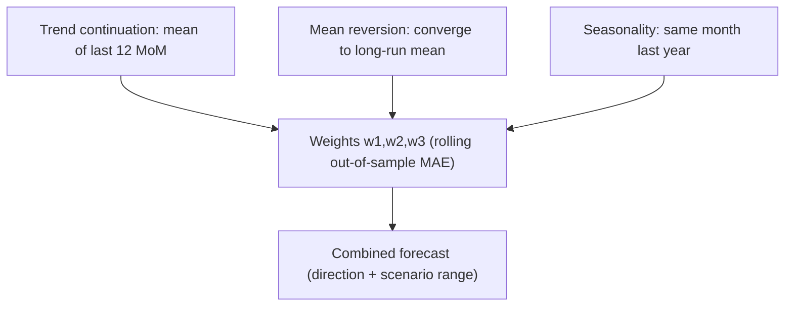

**Version:** 0.2 (preprint)
**Date:** 2026-08-15

## Abstract

Long-term house price forecasting is widely regarded in the academic literature as inherently difficult (Rapach & Strauss, 2009), yet long-term forecasts are precisely what policymakers and households need most. Based on the National Bureau of Statistics' official second-hand residential price indices for 70 cities (2019-01 to 2026-06, 90 consecutive months with no gaps), this paper proposes an **interpretable three-component combination forecast**: a weighted combination of three components — trend continuation, mean reversion, and seasonality — where the weights are not assumed by hand but selected by **rolling out-of-sample validation** (using only the history up to each decision point, to avoid data snooping). **The weights are themselves the explanation** — the model lets the data decide "whether this market is a trend market or a mean-reversion market," and a cut-point sensitivity test confirms the robustness of the conclusion.

In the 2026–2030 five-year outlook, the data automatically selects: the 70 cities nationwide as a **downward trend market** (trend weight 1.0), and Beijing as a **mean-reversion market** (mean-reversion weight 0.5). Under the baseline scenario, the nation's five-year cumulative change is about −22%, and Beijing's about −4.6%. However, this paper emphasizes that the baseline is a pure price-momentum extrapolation and **does not represent a strong judgment about future house prices**: the data simultaneously shows clear bottoming leading signals (nationwide MoM has improved for two consecutive years; Beijing's MoM has already turned positive), so this paper provides an alternative "if the bottom holds" scenario — the nation's five-year cumulative decline narrows to −5.4% to −2.6%, and Beijing turns positive. On balance, the more likely five-year range for the nation is −5% to −22%, and for Beijing −5% to +5%, depending on the strength of policy support.

**Keywords**: house price forecasting; mean reversion; interpretability; scenario ranges; China; bottoming

## 1. Introduction

"What will happen to house prices over the next five years?" is a question of shared concern to policymakers, households, and researchers. But long-term house price forecasting has an intrinsic difficulty: **long-term point-forecast ability is inherently limited** (Rapach & Strauss, 2009 use US state-level data to show that house price predictability varies across regions and that macro variables only add value at longer forecast horizons). Therefore, an honest long-term forecast should not output a spuriously precise single value, but should instead give **direction + range + scenarios**, and state explicitly the assumptions the method relies on.

This paper's positioning is not "we guessed the future," but rather to propose an **interpretable** forecasting framework: every forecast number can be decomposed into a weighted sum of several understandable components, and the weights are chosen by the data itself in rolling validation. This makes the forecast both usable for decision-making and auditable — when reality deviates from the forecast, one can trace back to which component and which assumption failed.

This paper focuses on China's second-hand residential market, based on the official second-hand indices for 70 cities. The data and methodological details build on the author's previous work (Author, 2026a); this paper does not repeat the data construction process and directly uses the continuous panel it produced.

**Contributions of this paper:**
1. Propose an interpretable three-component combination forecasting method, with weights automatically selected by rolling out-of-sample validation;
2. Provide five-year (2026–2030) forecasts for the 70 cities nationwide and Beijing (direction + scenario ranges);
3. Combine measured bottoming signals to give an alternative "if the bottom holds" scenario, avoiding mistaking trend extrapolation for a strong judgment.

## 2. Related Work

Research on house price dynamics and forecasting has a clear main line: **short-term momentum + long-term mean reversion**.

**The micro-foundations of momentum.** Case & Shiller (1989) use US repeat-sales indices to show that house prices exhibit intertemporal persistence (inertia); the market is not efficient in the short run, and past gains can predict short-term future gains — this is the originating literature for "momentum only in the short run." Piazzesi & Schneider (2009) use survey evidence to show that a large number of home buyers form price expectations by "extrapolative expectations," explaining from a micro-behavioral perspective why the cycle of "short-term momentum → subsequent reversal" arises.

**Long-term mean reversion.** Capozza, Hendershott, Mack & Mayer (2002) estimate momentum and reversion toward long-term equilibrium simultaneously within an error-correction framework, finding that the long-term equilibrium is determined by construction costs and income, and that the speed of reversion varies with city characteristics. This is the most classic empirical source for "long-term forecast = convergence to fundamental equilibrium." Glaeser & Nathanson (2017) formalize extrapolative expectations, unifying the explanation of the swing between momentum and long-term reversion.

**Forecastability and fundamentals.** Rapach & Strauss (2009) show that US state-level house prices are not highly predictable, that predictability varies by state, and that macro fundamental variables only add value at longer forecast horizons. The IMF's Geng (2018) uses a 20-country panel cointegration to estimate the relationship between long-term equilibrium house prices and income, real interest rates, and supply, and measures the "valuation gap" — this is the modern quantitative template for "how far prices are from fundamentals and whether they will revert."

**China's particularities.** Fang, Gu, Xiong & Zhou (2015) construct their own 120-city price index and find that China's decade-long surge in house prices was largely explained by income growth (except in first-tier cities), and that mortgage down payments were generally above 35%, so the short term did not necessarily trigger financial risk. Wu, Gyourko & Deng (2012) use fundamentals such as construction costs and income to evaluate house prices in major Chinese cities, providing the basis for the idea that "the fundamental residual = policy and sentiment." The panel cointegration test of Dreger & Zhang (2013) suggests that house prices in major Chinese cities contain a component that deviates from fundamentals.

The difference between this paper and the above work: instead of re-estimating fundamental elasticities (the macro sample is only 3.5 years, insufficient to identify them separately), we adopt an **interpretable combination of pure price time series**, and let the data decide in rolling validation "whether mean reversion should be used" — the nation is selected as a trend market and Beijing as a mean-reversion market, consistent with Capozza et al.'s conclusion that "the speed of reversion varies by market."

## 3. Data and Methods

### 3.1 Data

We use the National Bureau of Statistics' official second-hand residential price index for 70 cities, in monthly month-over-month (MoM) series (2019-01 to 2026-06, 90 months, no gaps). The national series is the mean of the 70 cities' monthly MoM changes; Beijing uses the single-city series. Details of the data construction are in the author's previous work (Author, 2026a).

### 3.2 Interpretable Three-Component Combination

At each forecast point, the three components each produce a forecast:

| Component | Meaning | Formula |
|---|---|---|
| **Trend continuation** | Continue the mean MoM of the last 12 months | $\mathrm{mean}(\mathrm{mom}[-12:])$ |
| **Mean reversion** | Converge toward the long-run mean (AR(1) speed) | $\mathrm{long\_mean} + (\mathrm{anchor} - \mathrm{long\_mean})(1-\rho)$ |
| **Seasonality** | The MoM of the same month last year | $\mathrm{mom}[-12+i]$ |

The three components are linearly combined with weights to produce the forecast:

$$
\hat{y}_{t+h} = w_1\,T_{t+h} + w_2\,R_{t+h} + w_3\,S_{t+h}, \qquad w_1 + w_2 + w_3 = 1,\ w_i \ge 0
$$

where $T$, $R$, and $S$ are respectively the trend continuation, mean reversion, and seasonality components in the table above.

The weights $w_1, w_2, w_3$ are selected by grid search over the unit simplex (step size 0.25), minimizing the **rolling 12-month out-of-sample MAE**:

$$
\text{MAE} = \frac{1}{n}\sum_{i=1}^{n} |\hat{y}_i - y_i|
$$

To avoid data snooping, the weights are selected using only about the first 3/4 of the history before each forecast point, and the remaining 1/4 is used for confirmation.

**Weight sensitivity** (the key test of the method's robustness). The weight selection depends on the "training cut-point ratio" (frac, default 0.75); it must be verified that the conclusion does not drift with this hyperparameter. A sensitivity test over frac ∈ {0.55, 0.6, 0.7, 0.75, 0.8, 0.9}:

| Cut-point frac | Nationwide weights (trend/reversion/season) | Beijing weights (trend/reversion/season) |
|---|---:|---:|
| 0.55 | 0 / 0 / 1 | 0 / 0.75 / 0.25 |
| 0.6 | 1 / 0 / 0 | 0 / 0.75 / 0.25 |
| 0.7 | 1 / 0 / 0 | 0 / 0.75 / 0.25 |
| **0.75 (default)** | **1 / 0 / 0** | **0.25 / 0.50 / 0.25** |
| 0.8 | 1 / 0 / 0 | 1 / 0 / 0 |
| 0.9 | 1 / 0 / 0 | 0.50 / 0.50 / 0 |

**Interpretation**: The nation stably selects trend (1/0/0) when frac ≥ 0.6, so the conclusion is robust; Beijing's mean reversion dominates (0.5–0.75) at most cut-points (0.55–0.7, 0.9), flipping to pure trend only at 0.8. Therefore, the **qualitative conclusion that "the nation is a trend market and Beijing is a mean-reversion market" is broadly robust to the cut-point**, but Beijing's **specific weight values** are sensitive to the cut-point (floating between 0.5 and 0.75) and should be treated as a range rather than exact values.

### 3.3 Scenario Ranges

The baseline path is the combination forecast. The low/high scenarios are anchored by the **actual cumulative fluctuation of the past 5 years** (nationwide −22.9%, Beijing −8.9%), rather than mechanically accumulating monthly shifts. This makes the range reflect "how large a fluctuation has actually occurred in reality," rather than being arbitrarily set.

## 4. Results

### 4.1 Weights automatically selected by the data (the core interpretability result)

| Metric | 70 cities nationwide | Beijing |
|---|---|---|
| Weights (trend/mean reversion/season) | **1.0 / 0 / 0** | **0.25 / 0.50 / 0.25** |
| 12-month training MAE (index points) | 0.297 | 0.614 |
| AR(1) coefficient $\rho$ | 0.958 | 0.695 |
| Half-life | 16.1 months | 1.9 months |
| Long-run mean MoM | 99.80 | 100.04 |

The half-life is converted from $\rho$ by $h = \ln(0.5) / \ln(\rho)$: the nation's $\rho=0.958$ corresponds to about 16 months, and Beijing's $\rho=0.695$ to about 2 months — the faster the reversion, the more quickly the deviation from the long-run mean is "absorbed."

**Interpretation**: The nation is selected by the data as a trend market (trend weight 1.0) — because it has been continuously declining over the past 5 years, the mean-reversion assumption does not hold; Beijing is selected as a mean-reversion market (reversion weight 0.5) — because its long-run mean is slightly above 100, and the current level is close to that mean. This is consistent with Capozza et al.'s conclusion that "the speed of reversion varies by market": different markets should use different methods, and this paper lets the data choose for itself.

### 4.2 Five-Year Forecast (Baseline Scenario)

| Scenario | Nationwide 5-year cumulative | Beijing 5-year cumulative |
|---|---:|---:|
| Low | −33.5% | −9.0% |
| **Baseline** | **−22.1%** | **−4.6%** |
| High | −10.6% | −0.1% |

The nationwide baseline continues the trend (MoM of about 99.5), with a 5-year cumulative of about −22%, close to the actual −22.9% of the past 60 months. Beijing's baseline is dominated by mean reversion, about −4.6% over 5 years, relatively resilient. The low/high scenarios are anchored around the baseline by the historical 5-year fluctuation (±11.4 percentage points nationwide, ±4.4 percentage points for Beijing), reflecting "how large a fluctuation has actually occurred in reality."

### 4.3 The possibility of a bottom and alternative scenarios

The model is a pure price time-series model and **cannot endogenously predict a "bottom"** — the 2019–2026 sample never contains a complete "sustained decline → long-term turn to gains" reversal, so the model has no reference. But the data provides clear bottoming leading signals:

| Signal | Nationwide | Beijing |
|---|---|---|
| Annual MoM trend | 2024 (99.30) → 2025 (99.48) → 2026 (99.66), **improving for two consecutive years** | 2025 bottom (99.28) → 2026 (100.22), **MoM turned positive** |
| Months with MoM > 100 in the last 24 months | 0/24 | 10/24 |
| Drawdown from peak | −23% | −15% |
| Momentum acceleration (last 6 months − previous 6 months) | +0.30 | +1.37 |

**The "if the bottom holds" scenarios** (MoM converges to 100 within 12–24 months):

| Scenario | Nationwide 5-year | Beijing 5-year |
|---|---:|---:|
| Model baseline (no bottom) | −22% | −4.6% |
| 24-month bottom | −5.4% | −5.2% |
| 12-month bottom | −2.6% | −2.5% |
| Mild recovery after bottom | — | +8.7% |

**Overall judgment**: The more likely 5-year range for the nation is **−5% to −22%** (between "gradual stabilization" and "sustained drift down"), and for Beijing **−5% to +5%**. The stronger the bottoming signals and the more active the policy, the closer to the upper end of the range (the smaller the decline). Trigger conditions (exogenous judgment, not model output): relaxation of purchase restrictions, implementation of government purchases of housing stock, LPR cuts, and other policy support.

## 5. Discussion and Limitations

**Limitation 1: the sample covers only about one and a half cycles.** The 90 months cover 2019–2026, including the 2021 peak and the post-2022 adjustment, but are insufficient to robustly estimate long-term fundamental elasticities. The confidence intervals for the reversion speed and the long-run mean are wide.

**Limitation 2: pure price time series, with no fundamentals incorporated.** The macro panel is only 3.5 years, insufficient to separately identify the long-term relationships from income, inventory, and interest rates to house prices. This paper uses the index's own long-run mean as the anchor, without fundamentals. Incorporating fundamentals would require a longer macro sample (one could refer to Geng 2018's cointegration framework).

**Limitation 3: policy is unobservable.** Purchase restrictions, loan restrictions, government purchases of housing stock, and land finance are not included in the point forecast, but are reflected only indirectly through the scenario ranges. A policy shock could push the actual path outside the range — this is precisely why the "bottom" scenario exists.

**Limitation 4: the ranges are not probabilities.** The low/high scenarios are anchored by the historical 5-year fluctuation and do not represent an actual probability distribution. This paper's "overall range" (nationwide −5% to −22%) is the union of the "bottom" and "no bottom" cases, without giving the probability of each — this is a dual constraint of the data sample (no complete historical reversal) and the model (pure time series), not an oversight. Readers should understand the range as "the scope of possible outcomes," not a "probability distribution."

**Limitation 5: Beijing's long-run mean may be overestimated.** The estimate that Beijing's long-run mean MoM is 100.04 > 100 relies on a 7-year sample that includes the 2020–2022 upswing. If the upswing is anomalous in the long run, then the "mild long-term appreciation" judgment may be overestimated, and the "Beijing is more resilient" conclusion should be discounted.

**Limitation 6: district-level scenarios are low-confidence.** This paper only forecasts the national and Beijing official indices; the Beijing district-level listing average price scenarios (see the project report) are all labeled `low` confidence because the sample is only 18 months and non-official, and are not used as conclusions of this paper.

## 6. Conclusion

This paper proposes an interpretable three-component combination forecast, with weights automatically selected by rolling out-of-sample validation, and confirms via a cut-point sensitivity test that the core conclusions (nationwide trend market, Beijing mean-reversion market) are broadly robust. In the 2026–2030 outlook, the data judges the nation as a trend market (continuing decline, baseline −22%) and Beijing as a mean-reversion market (roughly flat with a slight decline, −4.6%). But combining the measured bottoming signals, this paper emphasizes that the baseline is the worst but not inevitable case: if the bottom holds, the nation's 5-year cumulative narrows to around −5%, and Beijing turns positive. **On balance, the nation's 5-year is more likely between −5% and −22%, and Beijing's between −5% and +5% — this range is the union of the two cases and contains no probability information.**

The value of a forecast lies not in guessing a single number, but in making clear "which assumptions, which data, and which signals this conclusion depends on." This paper's interpretable framework allows every forecast to be decomposed and audited — when reality deviates from the forecast, we know which step's assumption failed.

## References

[1] Capozza, D., Hendershott, P., Mack, C., & Mayer, C. (2002). Determinants of Real House Price Dynamics. *Journal of Real Estate Finance and Economics*, 24. https://www.nber.org/papers/w9262

[2] Case, K., & Shiller, R. (1989). The Efficiency of the Market for Single-Family Homes. *American Economic Review*, 79(1). https://www.nber.org/papers/w2506

[3] Dreger, C., & Zhang, Y. (2013). Is There a Bubble in the Chinese Housing Market? *Urban Policy and Research*. https://www.diw.de/de/diw_01.c.457346.de/publikationen/externe_referierte_aufsaetze/2013_0001/is_there_a_bubble_in_the_chinese_housing_market.html

[4] Fang, H., Gu, Q., Xiong, W., & Zhou, L.-A. (2015). Demystifying the Chinese Housing Boom. NBER Working Paper 21112; *NBER Macroeconomics Annual* 30. https://www.nber.org/papers/w21112

[5] Geng, N. (2018). Fundamental Drivers of House Prices in Advanced Economies. *IMF Working Paper* WP/18/164. https://www.imf.org/~/media/Files/Publications/WP/2018/wp18164.ashx

[6] Glaeser, E., & Nathanson, C. (2017). An Extrapolative Model of House Price Dynamics. *Journal of Financial Economics*, 126(1). https://www.nber.org/papers/w21037

[7] Author. (2026a). The Measurable and the Unmeasurable: A Source-and-Caliber-Aware Construction Method for China's Housing Price Data (A Beijing District-Level Case Study). preprint, v0.4.

[8] Piazzesi, M., & Schneider, M. (2009). Momentum Traders in the Housing Market: Survey Evidence and a Search Model. *American Economic Review*, 99(2), 406–411. https://benny.aeaweb.org/articles?id=10.1257/aer.99.2.406

[9] Rapach, D., & Strauss, J. (2009). Differences in Housing Price Forecastability Across US States. *International Journal of Forecasting*, 25(2), 351–372. https://www.sciencedirect.com/science/article/abs/pii/S0169207009000119

[10] Wu, J., Gyourko, J., & Deng, Y. (2012). Evaluating Conditions in Major Chinese Housing Markets. *Regional Science and Urban Economics*, 42(3), 531–543. https://ideas.repec.org/r/eee/regeco/v42y2012i3p531-543.html

## Author and Statement

**Author:** Liyuk

**Conflicts of interest:** The author declares no conflicts of interest. This project received no funding from any commercial institution and does not constitute investment advice; the forecast output does not constitute a commitment to or guarantee of future house prices.

**Data availability:** All collection, cleaning, and modeling code can be reproduced in the GitHub repository ([cn-housing-price-training](https://github.com/Liyuk/cn-housing-price-training)). The model output is a scenario range rather than a point forecast, and explicitly notes that "policy is an unobservable exogenous variable and is not included in the point forecast." The forecast is based on the 2019–2026 official indices, the sample covers only about one and a half cycles, and the confidence interval for the reversion-speed estimate is wide; please interpret with caution.
