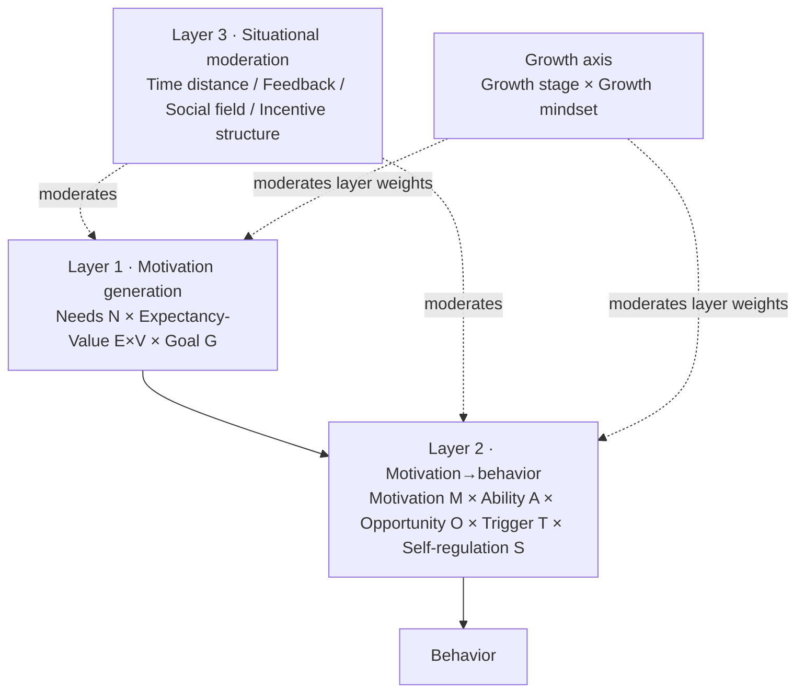

**Version:** 0.1 (preprint)
**Date:** 2026-08-15
**Type:** Theoretical synthesis, conceptual model, and application framework

## Abstract

In everyday life, "motivation" is almost always treated as a question of attributes: does this person have drive, is this team slacking off, and will a reward or a pep talk get them moving. This paper argues that this very way of asking is one of the reasons motivation keeps failing. Motivation is not a fixed attribute that can be measured once, nor a simple "external reward → behavior" switch; it is a situated process that also evolves along developmental stages — **whether motivation is generated, whether it can be converted into behavior, and whether it can be sustained in time — each obeying different conditions, and all three are moderated by "which stage of growth this person is in and how they view their own growth."**

This paper integrates self-determination theory (SDT), expectancy-value theory, goal-setting theory, self-efficacy theory, behavior models, and temporal motivation theory (TMT), and brings in perspectives from developmental psychology, business management, and organizational and occupational psychology to propose a three-layer **Situational Motivation Model** (SMM) with a "growth axis." The model's skeleton is a general three-layer structure — **motivation generation** (need satisfaction × expectancy × value × goal properties), **the conversion of motivation into behavior** (ability·efficacy × opportunity × trigger × self-regulation), and **situational moderation** — plus a **growth axis** (growth stage × growth mindset) running through them. In the workplace context, this paper concretizes "situation" into six components — **task design, goal system, incentive system, feedback system, development path, and leadership & relationships** — connects the model's endpoint to **work engagement, organizational commitment, performance, burnout, turnover intention, and "legacy" exits such as mentorship/succession**, and distinguishes two channels: "removing negatives" (eliminating dissatisfaction) and "adding positives" (creating drive). It further treats the **four stages of the enterprise life cycle** (startup, growth, maturity, decline) and the **"enterprise–manager–employee" layering** as macro-level moderating dimensions.

On this basis, the paper compresses the model into nine falsifiable "laws of motivation": situationality, necessity-but-insufficiency, motivation quality, reward context, conversion (volition), temporal decay, growth fit, fairness, and stage fit — and maps them onto five HR actions: measure, match, shore up, watch, and verify. This paper reports no new experimental data and offers no checklist of manipulation for "how to make anyone comply"; it is a theoretical synthesis, conceptual model, and application framework whose aim is to turn "motivation" from an overused catchphrase into a model that can be tested, falsified, and used to guide observation and intervention.

**Keywords:** motivation; motive; behavior; self-determination theory; growth mindset; work design; organizational behavior; contextualization

## 1. The Problem: Why "Motivation" Keeps Failing

When faced with "lack of drive," the two most common responses are: passing an attribute judgment on the person ("he's not ambitious," "this generation of young people can't take hardship"), or applying an external lever (more pay, awards, praise, pressure). Both responses point to the same implicit assumption: **motivation is a stable attribute of a person, and it can be turned up with an external stimulus.** But this assumption conflicts with a large body of evidence.

First, motivation is highly variable across situations. The same person can lose themselves in one task and procrastinate until the last minute on another; can take initiative in one team and coast in another. If motivation were a stable attribute, within-situation consistency should far exceed between-situation differences, but the opposite is the case. Lewin wrote this into an equation as early as 1936: behavior is a function of person and environment, $B = f(P, E)$[1]. It is not a slogan but a methodological directive: **to talk about motivation without the situation is to talk about meaning without context.**

Second, motivation also changes with time and developmental stage. The things that ignite a person at twenty, thirty-five, and fifty are usually not the same. The "prove I can do it" that thrilled someone early in their career may have gone numb by mid-career; the "sense of stagnation" that discourages someone mid-career is often not an "attitude problem" but a natural proposition of the developmental stage. Misreading "people at different stages have different drive" as "this person has changed and slacked off" is one of the most common misdiagnoses in management.

Third, rewards are not always "additive." A meta-analysis of 128 experiments by Deci, Koestner, and Ryan shows that certain extrinsic rewards — especially those tied to task performance and perceived as controlling — systematically undermine intrinsic motivation[9]. This is called the overjustification effect: when a person attributes their effort to "doing it for the money," the reason "I wanted to do it anyway" gets crowded out. The issue is not that rewards are ineffective but that they can produce negative effects.

Fourth, motivation does not automatically equal behavior. New Year's resolutions, fitness plans, reading lists — the list of things people "really want to do" but "never get around to doing" can be infinitely long. Between motivation and behavior lies a whole stretch of distance that must be crossed: whether ability suffices, whether opportunity exists, whether there is a reminder, and whether one can execute the plan in the face of temptation. Heckhausen and Gollwitzer distinguished motivational processes from volitional processes precisely to show that **the state of wanting to do and the state of doing obey two different sets of psychological mechanisms[11].**

Therefore, this paper's research question is not "how to make people more motivated," but: **can motivation be redescribed as a situated process that also evolves along developmental stages — how motivation is generated, how it is converted into behavior, how it is sustained — and can falsifiable laws be derived from it?**

This paper reports no new experimental data, provides no clinical diagnosis, and constitutes no prescription for "how to manipulate subordinates or others." It borrows the **descriptive** claims of established theories while explicitly rejecting any prescriptive portion that treats people as objects of leverage.

**What this paper proposes, and what it does not.** What this paper proposes is a **descriptive model** (SMM) and nine falsifiable **laws of motivation**, not a set of manipulation techniques, a set of "positive-energy talking points," or a "personality assessment." Its input is "a person (at some developmental stage) + a task + a situation (a management system in the workplace)," and its output is an explanation of "which layer motivation is stuck at" together with testable predictions — not a verdict on "whether this person is not ambitious enough." Whether it holds depends on whether the testable predictions in Section 5 can be falsified — not on whether it sounds agreeable.

## 2. Theoretical Resources and Boundaries

### 2.1 Seven Classic Sources of Motivation

This paper invents no new motivation concepts; instead it integrates seven independent theories, often cited separately, into a single situational map. Each answers a different question, and only together do they cover the full chain of "generation–conversion–sustaining."

| Perspective | Question answered | Contribution to SMM | Boundary |
| --- | --- | --- | --- |
| Lewin field theory $B=f(P,E)$[1] | Why can't motivation be separated from the situation? | Meta-proposition of situationality | A descriptive framework, not a computable equation |
| Self-determination theory (SDT)[2][3] | Under what conditions does motivation appear and persist "spontaneously"? | Need satisfaction (autonomy, competence, relatedness); motivation quality (autonomous vs controlled) | Does not claim "extrinsic motivation is always bad," but distinguishes controlling vs informational |
| Expectancy-value theory[4] | How does rational weighing produce motivation? | $\text{Expectancy} \times \text{Instrumentality} \times \text{Valence}$ | Suited to tasks with clear outcomes; weak explanatory power for habitual and emotional behavior |
| Goal-setting theory[5] | How do goals guide and sustain effort? | Goals that are specific, difficult, and committed to | Goal difficulty must stay within the boundary of ability; a goal is not a reward |
| Self-efficacy theory[6] | Why is "feeling you can do it" so critical? | The entry point of ability and belief | Efficacy ≠ ability, and ≠ blind optimism |
| Behavior model, Fogg B=MAP[7] | Why does behavior still fail to appear when motivation exists? | $\text{Motivation} \times \text{Ability} \times \text{Trigger}$ | A heuristic model; a trigger is not control |
| Temporal motivation theory (TMT)[8] | Why does temporal distance "dilute" motivation? | $\text{Value} \div (\text{Delay} \times \text{Impulsiveness})$ | An integrative model; parameters are hard to measure directly |
| Motivation–volition two-stage [11][12] | After the decision, how is action sustained? | Implementation intentions and self-regulation | The volitional stage produces no new motivation; it only protects existing motivation |

### 2.2 Motivation Quality: Why "Quantity" Is Not Enough

The most central — and most easily misread — point of self-determination theory is its distinction between the **quantity** and **quality** of motivation. By degree of autonomy, motivation can be arranged on a continuous spectrum: **amotivation → external regulation → introjected regulation → identified regulation → integrated regulation → intrinsic motivation**. Within extrinsic motivation, "identified regulation" ("I identify with the value of this") and "introjected regulation" ("I would feel ashamed not to do it") may both look "motivated," yet they predict completely different outcomes[2][3]; for this distinction's development in the work context, see Gagné & Deci's review of work motivation[15].

Four decades of meta-analysis give this distinction empirical weight: Cerasoli et al. found that **intrinsic motivation better predicts the "quality" of performance, while extrinsic incentives better predict the "quantity" of performance** — each predicts a different type of outcome, rather than one being better and the other worse[10]. This directly rejects the naive claim that "the stronger the motivation the better": what to ask is not "does he have motivation," but "what kind of motivation does he have, facing what kind of task."

### 2.3 The Three Pieces Added by Three Disciplines

Bring in developmental psychology, business management, and organizational and occupational psychology, and the three missing pieces of the model come into view. Each contributes one component:

- **Developmental psychology → the growth axis.** Growth mindset determines whether "difficulty and failure" are read as challenge or as verdict[17]; the zone of proximal development (ZPD) gives "task difficulty" a calibration criterion — "current ability + a bit," rather than the harder the better[16]; career-stage theory shows that the dominant needs and dominant sources of frustration differ across early, middle, and late career[19][20]. Taken together, the model needs a **growth axis** running throughout: `growth stage × growth mindset`.

- **Business management → situation concretization + two channels.** Managers cannot create motivation; they can only design the scene in which motivation arises. The "situation" employees face is almost entirely a management system, which should be concretized into six components: task design, goal system, incentive system, feedback system, development path, and leadership relationships[21]. At the same time, Herzberg's two-factor theory reminds us: hygiene factors (pay, systems, environment, fairness) can only remove dissatisfaction, while motivator factors (achievement, growth, recognition, responsibility) create drive — "removing negatives" and "adding positives" are two different channels[22]. Adams's equity theory further points out that the **perceived fairness** of the input-return ratio is a strong moderating variable running through the whole process[23]. Moreover, the life-cycle stage of the enterprise determines which of the six components can be mobilized and which exist in name only, making it a second, enterprise-level moderating variable[29].

- **Organizational and occupational psychology → the outcome layer + measurement.** Motivation is not the endpoint; it must land on measurable outcomes such as work engagement, organizational commitment, performance, burnout, and turnover intention[24][25]. Organizational psychology has long measured these variables with engagement/pulse surveys and the JD-R model, which exactly supplies the measurement handle for the paper's weakest link — falsifiability.

### 2.4 Boundary Statement

First, this paper borrows only the **descriptive** parts of each theory. SDT describes that "controlling rewards undermine intrinsic motivation," which is a testable finding; but "therefore managers should grant only autonomy and never apply rewards" is a prescription, which this paper does not issue. Second, "intrinsic motivation" and "extrinsic motivation" are not moral labels: a repetitive, low-interest job sustained by extrinsic incentives is the norm, not a defect; the question is whether such work can be redesigned or have its reward boundaries clearly defined. Third, growth mindset is a descriptive moderating variable: its intervention effect sizes are small and highly context-dependent[18], so this paper uses it only to "explain why the same difficulty means different things to different people," and does not prescribe "cultivate a growth mindset and motivation will follow." Fourth, all nine laws are **statistical** regularities — they describe "what is more likely to happen under what conditions," not a determinate prediction about any single person.

## 3. The Situational Motivation Model (SMM)

This paper unfolds "motivation" into a three-layer structure with a growth axis. The model's overall equation is:

$$
B = f(\text{Motivation}\ M \times \text{Ability}\ A \times \text{Opportunity}\ O \times \text{Trigger}\ T \times \text{Self-regulation}\ S)
$$

$$
M = f(\text{Need-satisfaction}\ N,\ \text{Expectancy}\times\text{Value}\ (E\times V),\ \text{Goal}\ G)
$$

Every arrow is moderated by two layers of variables: the growth axis $G = \{\text{Growth Stage},\ \text{Growth Mindset}\}$; and the situational variables $Z = \{\text{Time Distance},\ \text{Feedback},\ \text{Social Field},\ \text{Incentive Structure}\}$.

> Terminological note: in this paper the two Chinese words for "situation" (情景 and 情境) are treated as equivalent, both referring to the immediate setting in which motivation is generated and converted — task, environment, time, and social field. The model's name keeps 情景激励模型 (Situational Motivation Model), while the main text uses 情境 consistently.

The three layers correspond to three different questions, and to three different kinds of failure; above them, the growth axis determines "which layer matters more to this person at this moment."

### 3.1 The Growth Axis: Growth Stage × Growth Mindset

The growth axis is developmental psychology's greatest contribution to the model. It answers a question the three layers cannot: **why does the same situation produce completely different drive in different people, or in the same person at different life stages?** It consists of two multipliers:

- **Growth stage.** The core proposition of early career is **building competence and identity** ("can I be competent, can I become someone"), and the dominant need is competence and growth; mid-career shifts toward **meaning and legacy** (Erikson's "generativity vs stagnation" — whether what I do matters to others and to the next generation), and the dominant need is autonomy and meaning; late career shifts toward **legacy and belonging** (handing over what one has accumulated, being needed, being remembered)[19][20]. Different dominant needs come with different dominant sources of frustration: early career fears "not learning anything," mid-career fears "stagnation and meaninglessness," late career fears "being marginalized."

- **Growth mindset.** It determines how the "ability × difficulty" term is read: for a person with a growth mindset, difficulty is a challenge where "ability can be trained"; for a person with a fixed mindset, difficulty is a verdict of "I really can't do it"[17]. The same challenge converts into engagement in the former and into avoidance and defensiveness in the latter — even when both have identical objective ability.

The growth axis's role is to **moderate the weights of the three layers**, not to replace them: in the early stage, "competence/growth" carries the highest weight in the generation layer; in the middle stage, "autonomy/meaning" and "valence within expectancy × value" gain weight; in the late stage, "belonging/legacy" and the "trigger and opportunity" in the conversion layer (whether there is an exit for handing over the baton) gain weight. It also directly derives the seventh law (growth fit).

### 3.2 Layer 1: Motivation Generation — Needs, Expectancy, and Goals

Motivation does not appear out of thin air. SMM attributes its generation to three sources:

- **Need satisfaction N (autonomy, competence, relatedness).** Autonomy is the experience that "my actions originate from myself"; competence is the experience that "I am capable and improving"; relatedness is the experience that "I am connected to people who matter." When all three are satisfied, motivation is more autonomous and more easily internalized; when they are thwarted, motivation degenerates into control or disappears[2][3]. The growth axis determines which need takes priority at the moment (§3.1).

- **Expectancy × Value (E × V).** Vroom's expectancy theory decomposes motivation into three multipliers: **expectancy** (if I try, can I do it), **instrumentality** (if I do it, will it bring about that result), and **valence** (do I actually want that result)[4]. If any multiplier approaches zero, the product approaches zero — this is the formalization of the two common dead ends, "trying is useless" and "doing it brings no return."

- **Goal properties G.** Whether the goal is **specific**, whether it is **difficult yet attainable**, whether it is **self-concordant** (i.e., consistent with my real values), and the person's **regulatory focus** (promotion-oriented pursuit of "gaining" vs prevention-oriented pursuit of "not losing") all change the strength and stability of motivation[5][13][14].

The three sources are related by **multiplication**, not addition: needs satisfied but expectancy zero ("I can't do it"), or expectancy high but goals at odds with the self ("even if I do it, I don't want it") — in either case motivation cannot be generated. This explains why "giving more money to someone who doesn't identify with the task" is often ineffective — money only moves the valence inside V, not N and G.

### 3.3 Layer 2: Converting Motivation into Behavior — Ability, Opportunity, Trigger, and Volition

Once generated, motivation does not automatically become behavior. SMM's second layer takes up Fogg's behavior model: $\text{Behavior} = \text{Motivation} \times \text{Ability} \times \text{Trigger}$[7], and adds Heckhausen and Gollwitzer's volitional stage: between "deciding to do" and "doing," **self-regulation** is needed to protect motivation from being interrupted by distractions[11].

- **Ability A.** This refers not only to objective skill but more so to **self-efficacy** — the belief that "I am sure I can execute this path"[6]. When efficacy is too low, even with high motivation, a person will avoid the task or give up too early.

- **Opportunity O.** Whether the environment really contains an executable, affordable path: is there time, tools, authority, room for error. A missing opportunity is not an attitude problem but a structural problem.

- **Trigger T.** Behavior usually needs a "now, here, at this moment" cue (a reminder, an environmental signal, a deadline) to start. Without a trigger, even high motivation can sit indefinitely in "getting ready to do it"[7].

- **Self-regulation S.** After starting, one must still deal with temptation, distraction, and emotional ups and downs. Implementation intentions ("if situation X arises, I will do Y") are a cheap and stable self-regulation tool[12].

This is the layer where "motivation failure" is most often misdiagnosed: managers see "not doing," so they raise the dose of layer one (more rewards, more pep talks), while what actually broke is layer two — no ability, no opportunity, no trigger, or no plan to turn the decision into execution.

### 3.4 Layer 3: Situational Moderation — Time, Feedback, Social Field, and Incentive Structure

None of the arrows in the first two layers runs in a vacuum. SMM lists separately the four most stable situational moderating variables:

- **Time distance.** Temporal motivation theory (TMT) divides valence by $\text{Delay} \times \text{Impulsiveness}$: the more distant and abstract the reward, the weaker its driving force on immediate behavior[8]. This is precisely the mechanism of procrastination: distant high value is repeatedly defeated by nearby, low-value, immediate gratification.

- **Feedback.** The **timing** of feedback (whether it is timely and connected to the current action) and its **quality** (whether it is informational rather than judgmental) determine whether it calibrates behavior or produces defensiveness[9]. Goal-setting theory repeatedly stresses that without feedback, goals lose their directional function[5].

- **Social field.** Psychological safety, norms, and the modeling and expectations of others amplify or suppress the probability that motivation converts into behavior. A field where "raising objections gets punished" converts motivation into silence[27].

- **Incentive structure.** Whether an extrinsic reward is **controlling** or **informational** determines whether it undermines or enhances intrinsic motivation[9]; intrinsic motivation and extrinsic incentives each predict quality and quantity respectively[10].

### 3.5 Organizational Extension 1: The Six Components of the Situation

These four abstract variables are almost entirely realized through management systems in the workplace. Concretizing "situation" into six components gives the model its business-management operability:

| Component | Management source | What it determines | Common failure |
| --- | --- | --- | --- |
| Task design | Job characteristics model[21] | Skill variety, task identity, task significance, autonomy, feedback → sense of intrinsic meaning | Cutting work into meaningless fragments; leaving only execution with no feedback |
| Goal system | MBO/OKR/KPI | Whether goals are clear, aligned, and verifiable | Vague goals, dilution layer by layer, measuring only quantity |
| Incentive system | Compensation, promotion, recognition | Valence V and instrumentality, plus perceived fairness | Return decoupled from effort; incentives perceived as control |
| Feedback system | Performance reviews, 1:1s | The timing and quality of feedback | Once a year, judgmental, no action loop |
| Development path | Career ladder | The material carrier of the growth axis | Promises not honored, path invisible |
| Leadership & relationships | Psychological safety[27] | Whether the social field is safe and trust holds | Letting "speaking up" be empirically punished |

These six components are not parallel options but six diagnosable, modifiable **situation-design variables**. What managers can directly change is them, not "employees' attitudes."

Here we must distinguish one more pair of terms: the **mode versus the form** of motivation. The mode — SMM's three layers and growth axis — does not change across levels or stages: frontline, middle, and senior all obey the same mechanisms of need satisfaction, expectancy × value, and goals. The form — the concrete carriers of the six components — switches substantially by level and stage: frontline mostly uses cash, immediate recognition, and promotion; above the middle level, money gradually retreats into a hygiene factor, and courses/EMBA programs, equity, participation in decision-making, and access to information become the new carriers. The "course" for mid-to-senior levels is especially typical: its value often lies not in "learning" (competence) but in **the exchange of resources, information, and interests** — a single course simultaneously delivers relatedness/connection (a circle), a competence signal (identity and title), and valence (exchangeable resource information), a bundle of "one form, multiple needs." This is the same mode dressed in different forms at different levels, and it also explains why, in senior people's incentive lists, cash is replaced by long-term equity, reputation, and social capital.

### 3.6 Organizational Extension 2: The Outcome Layer and the Two Channels of "Removing Negatives / Adding Positives"

Motivation is not the endpoint in an organization. The model connects the endpoint to a set of measurable outcomes:

- **Positive**: work engagement, organizational commitment, job satisfaction, well-being → performance, retention, organizational citizenship behavior[24];
- **Negative**: burnout, turnover intention, silence → signals of the high-demands–low-resources imbalance[25][26];
- **Transitional**: mentorship, advising, succession transitions, knowledge sedimentation — the healthy endpoint of the "late stage" (the growth axis's legacy and belonging), which should not be misread as silence or turnover.

This outcome chain provides the measurement handle for the nine laws (§5). At the same time, one key management distinction must be written into the model structure: **"removing negatives" and "adding positives" are two channels.** Missing hygiene factors (pay, systems, environment, fairness) produce dissatisfaction, but topping them up will not produce drive; only motivator factors (achievement, growth, recognition, responsibility) create drive[22]. This means that removing dissatisfaction (removing negatives) cannot automatically buy autonomous motivation (adding positives); the two must be handled with different actions. Herzberg's two factors cannot always be cleanly split into two groups in the data, so this paper keeps only its most robust insight: **"not making him dissatisfied" and "making him motivated" are two goals — don't chase both with the same action.**

### 3.7 Organizational Extension 3: The Enterprise Life Cycle

The six components do not float in the air; they are embedded in an enterprise at a particular life-cycle stage. Enterprise stage is an **enterprise-level moderating variable**: it determines which of the six components can be mobilized and which exist in name only, and it also determines which law is most pressing at the moment. Greiner's classic model describes organizational growth as an alternation of "evolution and revolution" — each stable period is supported by a set of management practices, until that very set becomes the crisis of the next stage[29]. This paper borrows only its coarsest stage division, trimming it into four stages for the purpose of matching employee motivation (startup, growth, maturity, decline) — a division "tailored for employee motivation," not a faithful reproduction of the corporate financial life cycle — and aligns it to SMM:

| Enterprise stage | Most heavily weighted components (available incentive channels) | Dominant need (growth axis) | Typical failure risk | Most relevant laws |
| --- | --- | --- | --- | --- |
| Startup | Task design (vision and meaning), incentive system (equity/options), leadership relationships (autonomy) | Autonomy + competence/growth | Unclear valence, burnout, incentives perceived as control | 1, 3, 4, 6 |
| Growth | Goal system, incentive system (performance/promotion), development path | Competence + growth (path realization) | Bureaucratization, goal dilution, fairness imbalance | 5, 7, 8 |
| Maturity | Incentive system (profit sharing/stable returns), development path (internal mobility/second curve), leadership relationships (meaning and legacy) | Meaning (generativity vs stagnation) + stability | Career plateau, stagnation, loss of intrinsic motivation | 3, 7, 8 |
| Decline | Leadership relationships (candid communication/psychological safety), feedback system (transparency), incentive system (fair retention and orderly exit) | Belonging + safety | Job insecurity, cynicism, controlling pressure | 4, 6, 8 |

The key judgment in this table is that **differentiation is not determined by the single variable of "enterprise stage" but by the fit of "enterprise stage × employee growth stage."** The startup equity story is high-valence to a young person at the "prove I can do it" stage, but can be near-zero-valence to a mid-career backbone who has moved past risk appetite and needs stability and legacy; if a mature enterprise cannot give growth-stage employees a visible development path, the career plateau[30] becomes a structural motivation killer; in decline, "job insecurity" is itself a stressor independent of specific events[31], and at this point any controlling pressure amplifies rather than repairs the loss of drive. **Transition is not a fifth stage but a mode that can be overlaid**: it can occur proactively in maturity (seeking a second curve) or reactively in decline (survival), and its motivational signature is "future narrative + psychological safety + fair retention." One more caution: these four stages are not a strict linear ladder, and decline can be reversed; reading them as four "motivational regimes" is more accurate than reading them as a one-way ladder.

### 3.8 Organizational Extension 4: Who Needs Motivation — the Layering of Enterprise, Managers, and Employees

Conflating "the enterprise" with "the person" is the most common category error in motivation design. Here the three are separated along two axes: one is the **level of the system**, the other is the **subject being motivated**.

- **The enterprise is the supplier of the situation, not the object being motivated.** The enterprise has no "drive" to speak of; what it has is the configuration of the six components and its life-cycle stage — these are the environments that make people motivated or unmotivated, not the state of "the enterprise as a person." Asking "does the enterprise have motivation" is a category error; what should be asked is "is this six-component configuration, at this stage, making people motivated or unmotivated." But the "supplier" is not by default always present: in the startup stage these components are often not yet built (low maturity of situational supply), and in decline the supply capacity runs dry (no money, no path, no safety). The model assumes "the situation exists and is adjustable," and it fails in organizations with zero structure or exhausted supply — there the bottleneck moves up from "moderation failure" to "generation and co-construction," and HR's action shifts from "tuning parameters" to "building infrastructure."

- **Managers have a "dual identity."** A manager is first an **employee** — the three layers of generation, conversion, and situation apply to him equally; he too needs motivation and can burn out (middle-manager burnout is often overlooked). At the same time a manager is a **situation designer**: he directly controls his subordinates' goals, feedback, development path, and leadership relationships. Therefore a manager's motivation **transmits downward** — a motivated manager, through the situation he designs, amplifies the team's motivation; a burned-out manager, even with intact systems, transmits controlling pressure downward. This transmission can be written as a cascade: **situation-design quality = f(the designer's own need satisfaction, motivation quality, and the boundary of design authority).** A manager with low autonomy (for example, whose delegation has been tightened) is more inclined to impose controlling incentives on subordinates (the negative branch of Law 4); and a middle manager in a mature bureaucracy often has "the name of design without the power of design" — he cannot control the incentive system or the promotion path, yet he is held responsible for subordinates' motivation. So one cannot simply "motivate employees"; one must first see whether the manager himself is motivated and whether he actually holds design authority.

- **Employees are the direct subjects of motivation.** The model's three layers + growth axis are written first and foremost for employees.

Here **retention** and **motivation** must be separated once more. HR practice commonly uses the "management vs employees" dichotomy — a **retention-and-compensation** perspective: whose departure is costly, who has equity/golden handcuffs, who is hardest to replace. SMM, by contrast, is a **motivation** perspective: under what situation does any given person generate, convert, and sustain motivation. The two are orthogonal: a middle manager can "not leave" (anchored by equity, salary, and tenure) yet be "completely unmotivated," even transmitting his burnout to the whole team. The practical assumption that "middle managers will stay on their own," even if true, answers only retention and not motivation — and a burned-out middle manager who stays is, precisely because of his dual identity, the most expensive kind of motivation risk in the organization. Managers are also not a homogeneous bucket: frontline, second-line, third-line, and senior managers face different motivational situations, and the middle (second-line, third-line) is often the zone that fits neither end of the "management vs employees" dichotomy and is most easily missed. This does not overturn "managers need motivation"; rather, it shows that the layer of managers most worth examining separately is exactly the one most often missed.

This layering fulfills an implicit promise of the model: **motivation is not "the enterprise dispensing drive to employees," but "the enterprise provides the situation, the manager is both a situation designer and a motivated party, and employees generate and convert motivation within the designed situation."** It also marks "manager burnout" as an independent risk source — mirroring "risk from above" in the *Workplace Interpersonal Risk Analysis Protocol*.

### 3.9 How the Model Works: Diagnosing an Episode of "No Motivation"

The model's value lies not in precise calculation but in **locating the break point**. Faced with "this person / this task has no motivation," first confirm the enterprise's life-cycle stage (which determines which of the six components can be mobilized and what the dominant failure risk is), then confirm the person's stage along the growth axis, and question layer by layer:

1. Growth axis: Is he in early/middle/late career? What is his dominant need? Is he growth-minded or fixed-minded?
2. Generation layer: Are his needs being satisfied? Which multiplier in expectancy × value is near zero? Is the goal specific, difficult, and self-concordant?
3. Conversion layer: Do ability and efficacy suffice? Are opportunity and tolerance for error present? Is there a trigger and an execution plan?
4. Moderation layer (the six workplace components): task design, goals, incentives, feedback, development path, leadership relationships — which component has broken?
5. Outcome layer: Are engagement, commitment, and satisfaction declining, or are burnout and turnover intention rising?

The three layers (and the six components) each call for different interventions: if the generation layer breaks, change task design and value; if the conversion layer breaks, add ability, opportunity, trigger, and plan; if the moderation layer breaks, change the six situational components. **Mismatched intervention — raising layer-one rewards when layer two is broken, swapping incentive schemes when the growth axis is wrong, or copying someone else's incentive approach while ignoring enterprise stage — is the most common operational error in motivation failure.** Perceived fairness (Law 8) runs through the whole process, and any layer's unfairness takes effect before other factors; enterprise stage (Law 9) determines which layer is most pressing at the moment.

## 4. The Nine Laws of Motivation

Compress SMM into nine laws. Each is given its **mechanism**, **testable prediction**, and **boundary**, making it a falsifiable proposition rather than an aphorism.

### Law 1 (Situationality): Motivation is a function of situation and person, not a fixed attribute of the person

*Mechanism.* $B = f(P, E)$: the same person's motivation fluctuates across different tasks, environments, and time points, and the amplitude of this fluctuation often exceeds the differences in "average motivation" between people[1]. In organizational behavior this is concretized as person-environment fit research[28]. *Testable prediction.* The variance of the same person's motivation measured across situations should significantly exceed the test-retest variance of a personal trait (such as conscientiousness) within the same situation; in other words, "who does what in what situation" is more predictive than "who is a motivated person." *Boundary.* This does not deny that stable individual differences exist, only that they are the sole source of motivation.

### Law 2 (Necessary but Not Sufficient): Motivation is a necessary but not sufficient condition for behavior

*Mechanism.* Behavior additionally requires ability, opportunity, trigger, and self-regulation[7][11]. *Testable prediction.* When ability, opportunity, or trigger is missing, the actual behavior rate of the high-motivation group is not significantly higher than that of the low-motivation group; only when all three conditions are simultaneously present does motivation correlate strongly with behavior. *Boundary.* "Necessary" means that in intentional action motivation is usually one of the starting points; habitual and reflexive behavior can bypass high-intensity motivation.

### Law 3 (Quality): Motivation quality predicts persistence and complex-task performance better than quantity

*Mechanism.* Autonomous motivation (intrinsic, identified, integrated) predicts long-term persistence, well-being, and quality on complex/creative tasks; controlled motivation predicts short-term compliance and quantity[2][3][10]. *Testable prediction.* People driven mainly by autonomous motivation should show significantly higher quality and persistence on complex, open tasks than people with equally strong but controlled motivation; on simple, repetitive, quantity-oriented tasks, the difference between the two should shrink or even reverse. *Boundary.* Quality and quantity are not moral ranks; the goal of intervention is to match motivation to task type.

### Law 4 (Reward Context): The effect of extrinsic rewards depends on whether they are perceived as control or information

*Mechanism.* Rewards tied to performance and perceived as controlling undermine intrinsic motivation; feedback perceived as information about competence enhances it[9]. *Testable prediction.* For an intrinsically interesting task, after applying a controlling reward of "complete it and get paid," voluntary engagement once the reward is removed should be lower than in a no-reward group; "progress information" feedback should not produce this effect. *Boundary.* For low-interest, repetitive tasks, extrinsic incentives are legitimate and effective; this law targets the negative effect of "using rewards to crowd out intrinsic motivation," not the rejection of all rewards.

### Law 5 (Conversion/Volition): Getting from motivation to behavior requires self-regulation

*Mechanism.* A volitional stage lies between decision and execution; implementation intentions bind "I want to do it" to "when X occurs, I will do Y," thereby triggering automatically at the critical moment[11][12]. *Testable prediction.* At equal motivation intensity, groups that form implementation intentions should show significantly higher behavior initiation and persistence rates than groups with only goal intentions; the gap is larger under temptation or distraction. *Boundary.* Self-regulation protects existing motivation and does not create new motivation; for a goal with zero identification, no plan, however detailed, will help.

### Law 6 (Temporal Decay): Incentive effects decay with temporal distance and delay discounting

*Mechanism.* Valence is divided by "delay × impulsiveness": the more distant and abstract the reward, the weaker its driving force on present behavior[8]. *Testable prediction.* For equal rewards, the task engagement of an immediate-payout group should be higher than that of a delayed-payout group; the longer the delay and the higher the individual's impulsiveness, the larger the gap. *Boundary.* Those with strong self-regulation can resist discounting by "binding distant value" and similar means, but the resistance itself consumes willpower resources and does not change the discounting curve.

### Law 7 (Growth Fit): Motivation depends on the fit between the challenge and the current growth stage

*Mechanism.* Zone of proximal development: task difficulty should fall at "current ability + a bit"; too hard leads to avoidance, too easy to boredom[16]; growth mindset determines whether difficulty is read as challenge or verdict[17]; career stage determines the dominant need of the moment[19][20]. *Testable prediction.* The distance between task difficulty and the person's current ability has an inverted-U relationship with engagement/flow (peaking at "ability + a bit"); at the same difficulty, growth-mindset individuals show significantly higher engagement than fixed-mindset individuals; for the same task, people in the career stage whose dominant need corresponds to that task show significantly higher engagement. *Boundary.* Growth-mindset interventions have small and heterogeneous effect sizes[18]; this law is used for explanation, not as an intervention prescription. It is a **conditional law**: when an organization prioritizes "survival" over "growth" (such as leapfrog promotion in a startup or survival transformation in decline), difficulty may intentionally exceed "ability + a bit," but only on the condition that a "safety net" is provided — recoverable failure, mentor backstop, incremental trial-and-error; for a super-hard task with no safety net, this law resumes effect.

### Law 8 (Fairness): Perceived input-return inequity overrides other sources of motivation

*Mechanism.* Adams's equity theory: people continuously compare their input-return ratio with others' (or with their past selves'); when perceived inequity arises, tension is produced, and balance is restored preferentially by adjusting input, distorting cognition, or exiting the relationship[23]. *Testable prediction.* When employees perceive their input-return ratio as significantly lower than a reference target's, their engagement, commitment, and citizenship behavior should decline faster than, and independently of, the explanatory power of other factors such as ability/goals; perceived inequity is a strong predictor of turnover intention. *Boundary.* Fairness is a **perception**, not an objective quantity; the same objective compensation can produce different fairness judgments against different reference frames; it is closer to the "removing negatives" channel — eliminating inequity can prevent the loss of drive but does not itself create autonomous motivation.

### Law 9 (Stage Fit): The fit between incentive methods and the enterprise life-cycle stage (and employee growth stage) determines incentive effectiveness

*Mechanism.* The enterprise's life-cycle stage determines which of the six situational components can be mobilized and which exist in name only (a startup has no mature development path, a mature enterprise has no high-growth equity narrative, and a declining one lacks even the "future narrative")[29]; the employee's growth stage determines the dominant need of the moment. A mismatch between the two — telling the startup equity story to a mid-career backbone who needs stability, or leaving a mature enterprise's growth-stage employees with no visible development path — simultaneously depresses need satisfaction in the generation layer and opportunity in the conversion layer, and amplifies structural risks such as the career plateau[30] and job insecurity[31]. *Testable prediction.* The effectiveness of the same incentive scheme (equity / promotion path / profit sharing) should differ significantly between enterprises at different life-cycle stages; controlling for other variables, the fit of "enterprise stage × employee growth stage" should independently predict work engagement and turnover intention, with greater predictive power than either single stage variable. *Boundary.* The life-cycle model is a heuristic framework; stage boundaries are unclear, and enterprises are often in mixed stages; this law is used to explain differences and does not prescribe that "an enterprise must mechanically swap incentives by stage," still less is it used to predict any single enterprise's success or failure. A more important precision issue: enterprise stage is a single scalar, but within an enterprise multiple stages usually coexist (a growth-stage company's sales may already be mature, its new business still startup, its loss-making line already declining), so the granularity of matching should descend from "enterprise × employee" to "unit/function × employee," and multi-valued stage overlap should be allowed — applying a single-stage incentive structure to the whole company will systematically mismatch across heterogeneous units.

## 5. Application and Falsifiability Tests

### 5.1 Diagnostic Checklist

Operationally, SMM and the nine laws land on a three-layer diagnostic checklist unfolded along the growth axis. It does not output "whether this person should be motivated"; it only outputs "which layer motivation is stuck at." This is consistent with the article *What Can a Manager Do When Someone Loses Motivation* on this site: first distinguish whether the cause comes from environment, role, return, or personal state, then decide on intervention — rather than attributing everything to an attitude problem.

| Axis/Layer | Diagnostic question | Corresponding law | Intervention direction |
| --- | --- | --- | --- |
| Enterprise stage | Which stage is the enterprise in — startup/growth/maturity/decline? Which of the six components can be mobilized? | 9 | Match incentive channels by stage; don't copy others' schemes |
| Growth axis | What career stage is he in? What is his dominant need? Is his mindset growth or fixed? | 7 | Match challenge difficulty, adjust the value narrative |
| Generation | Are the needs (autonomy/competence/relatedness) being satisfied? | 3 | Restore choice, match difficulty, build connection |
| Generation | Which of expectancy, instrumentality, valence is near zero? | 1 | Add ability/credible returns/value connection |
| Generation | Is the goal specific, difficult, and self-concordant? | 3 | Rewrite the goal: more specific, attainable, aligned with values |
| Conversion | Do ability and efficacy suffice? Are opportunity and tolerance for error present? | 2 | Add skills, break down the path, lower barriers |
| Conversion | Is there a trigger and an execution plan? | 5 | Set reminders, write if-then plans |
| Moderation (six components) | Task design, goals, incentives, feedback, development path, leadership relationships — which has broken? | 4/6/8 | Shorten feedback cycles, switch to informational feedback, calibrate fairness, add development paths |
| Outcome layer | Is engagement/commitment/satisfaction declining, or burnout/turnover rising? | All | Track results, verify whether intervention actually changed behavior and state |

### 5.2 An HR Perspective: Five Actions

The model's implication for HR can be compressed into one sentence: **HR's job is not "to spark drive" but "to design and maintain the situation in which motivation arises."** In the model's order, it lands on five actions:

1. **Measure: measure "retention" and "motivation" separately.** Most of what HR holds today are retention rulers (turnover rate, retention rate, replacement cost). Add motivation rulers — engagement, burnout, need satisfaction, perceived fairness — and in particular **measure the middle layer (second-line, third-line) separately**, so they don't hide in the gap of the "management vs employees" dichotomy (§3.8). If you can't see it, you can't manage it.
2. **Match: match forms by "unit stage × level × growth stage" (rather than one-size-fits-all across the whole enterprise).** HR does not invent motivation; it only designs carriers. Use the four stages of §3.7 and the mode/form distinction of §3.5: for startup, match vision, equity, and autonomy; for maturity, match internal mobility, meaning, and profit sharing; for decline, match candor, fairness, and psychological safety. For the frontline, match cash and immediate recognition; for the middle, match courses, decision participation, and information rights (while guarding against "course = resource-information exchange" sliding into pure relationship trading); for senior, match long-term equity, reputation, and legacy. **Mode is unified; form varies by scene.**
3. **Shore up: make fairness and hygiene solid.** Fairness (Law 8) and hygiene factors can only "remove negatives," but removing negatives is the foundation for adding positives — if it is not solid, all motivator factors are in vain. First ensure that compensation, process, and system fairness do not collapse, then do motivation; much "motivation failure" is actually "fairness collapsed first." When supply runs dry in decline, money and promotion can't be adjusted, so the only resort is two zero-cost levers — **narrative (meaning reconstruction) and role redesign (mentor/advisor/knowledge handover)** — which complement "removing negatives": the less money there is, the more fairness and meaning must not collapse.
4. **Watch: watch the middle layer's dual identity; don't assume "middle managers will stay on their own."** Retention is not motivation (§3.8). Middle-manager burnout is multiplicative — a burned-out middle manager transmits controlling pressure down the whole line. Actions: a separate dashboard for the middle layer, identify those who "stay but have no drive," and give middle managers autonomy and tolerance for error.
5. **Verify: turn every action into a falsifiable pilot.** Follow the research plan of §5.3: first write the hypothesis, take a baseline, set guardrails, then choose among three options by evidence (expand / revise / stop), rather than "launch a program and see what happens."

### 5.3 Research Plan

Version 0.2 should turn SMM from a conceptual model into an evaluable research prototype, rather than directly launching a "motivation assessment":

1. **Operationalization.** Define measurable indicators for each of "need satisfaction, expectancy × value, goal properties, growth stage, growth mindset, ability/efficacy, opportunity, trigger, self-regulation, the six components, perceived fairness, engagement/commitment/burnout/turnover," preferentially reusing established scales (SDT need-satisfaction scale, work engagement scale, JD-R scales, etc.).
2. **Situational sampling validation.** Use experience sampling (multiple times within a day, across days) to measure the same people's motivation fluctuations and test Law 1 (within-situation variance vs between-situation variance).
3. **Conversion-gap experiment.** In a controlled task, manipulate ability, opportunity, and trigger (Law 2), and compare an implementation-intention group with a goal-intention group (Law 5).
4. **Reward and fairness experiments.** Replicate the differential effects of controlling rewards versus informational feedback (Law 4), the discounting of delayed payout (Law 6), and the motivational erosion of input-return inequity (Law 8).
5. **Growth-fit test.** Use the inverted-U hypothesis to test Law 7: does the difficulty-engagement relationship peak at "ability + a bit," and is it moderated by growth mindset and career stage.
6. **Stage-fit test.** Use a cross-enterprise sample to test Law 9: does the effectiveness of the same incentive scheme (equity / promotion path / profit sharing) vary with the enterprise life-cycle stage, and does the "enterprise stage × employee growth stage" fit independently predict engagement and turnover intention.
7. **Validity and boundaries.** Test the stability of each law's effect sizes across different task types (simple vs complex, interesting vs repetitive) and different samples (industry, enterprise stage, career stage); any falsified item means the corresponding law needs revision.

### 5.4 Summary of the Nine Laws' Testable Predictions

| Law | Core prediction | What it means if falsified |
| --- | --- | --- |
| 1 Situationality | Within-situation variance > between-situation variance (relative to stable traits) | Motivation is closer to a trait; the situational model must be downgraded |
| 2 Necessary but not sufficient | When ability/opportunity/trigger are missing, motivation and behavior decouple | Motivation can directly drive behavior; the conversion layer is redundant |
| 3 Quality | Autonomous motivation predicts quality and persistence, controlled predicts quantity | Motivation only needs quantity; the quality dimension is redundant |
| 4 Reward context | Controlling rewards undermine, informational feedback enhances intrinsic motivation | The overjustification effect does not hold; the reward model must be rewritten |
| 5 Conversion | Implementation-intention groups show significantly higher behavior initiation/persistence | The volitional stage can be merged into the motivational stage |
| 6 Temporal decay | Delayed payout lowers engagement, worsening with delay and impulsiveness | TMT's discounting structure needs revision |
| 7 Growth fit | Difficulty-engagement inverted U (peaking at "ability + a bit"; can be exceeded with a safety net), moderated by mindset and stage | The growth axis is redundant; the developmental-psychology perspective must be downgraded |
| 8 Fairness | Perceived inequity overrides other motivation sources and independently predicts turnover intention | Fairness can be folded into expectancy-value; no need to list it separately |
| 9 Stage fit | Incentive-scheme effectiveness varies by unit/enterprise stage; "unit stage × employee stage" fit independently predicts engagement/turnover | Enterprise stage can be folded into situational variables; no need to list it separately |

## 6. Relationship to Related Work

This paper shares a set of judgments with several of the author's earlier writings and studies, but with a different division of labor:

- *What Can a Manager Do When Someone Loses Motivation* offers practical principles for frontline managers — "distinguish the cause before intervening; don't attribute everything to attitude." This paper formalizes the mechanism behind it: the four categories of cause listed in that article (unclear direction, monotonous role, unfair environment/missing feedback, difficult personal state) fall respectively into SMM's generation layer (goal properties), moderation layer (task design), moderation layer (incentive/feedback system, corresponding to Law 8), and growth axis/generation layer (need satisfaction).
- *A Sense of Achievement Is Not a Reward* is an experiential unfolding of Law 3 (motivation quality) and Law 4 (reward context): the sense of achievement comes from fulfilling commitments, identifying with one's profession, helping others, and believing in meaning — not from outcome rewards — which is consistent with SDT's autonomy/competence/relatedness needs and with "controlling rewards undermine intrinsic motivation."
- *Workplace Interpersonal Risk Analysis Protocol* uses the job demands-resources model (JD-R) and psychological safety to describe occupational mental health; this paper's "outcome layer" reuses the same framework (references 25–27), treating burnout and engagement as the endpoint signals of motivation failure. The two are upstream and downstream of each other: that one deals with "risk in relationships and power structures," this one with "motivation in tasks and situations."

## 7. Threats to Validity and Research Boundaries

First, the theories integrated here mostly originate from Western samples and laboratory settings, and there is distance in transferring them to Chinese workplace, education, and life scenarios; the effect sizes of the nine laws must be reproduced in local samples. Second, SMM is a **descriptive** model; between "describing the mechanism" and "designing the intervention" lies another layer of translation that requires empirical support — the model can locate break points but does not automatically guarantee that interventions will work. Third, this paper compresses the complex motivational process into "growth axis + three layers + six components + enterprise stage + outcome layer," which may omit the moderation of motivation by cultural variables (such as relational self, face, and fairness reference frames under collectivism) and emotional variables. Fourth, there is method variance between self-report measures (need satisfaction, efficacy, valence, perceived fairness) and behavioral measures; tests of the laws must use multiple methods (self-report + behavior + observation) in triangulation. Fifth, growth-mindset intervention effect sizes are small and heterogeneous[18], and Herzberg's two-factor split is not always reproducible in data[22]; this paper limits its use of both to the level of descriptive insight and issues no prescription. Sixth, this paper provides no manipulation technique: any use of the nine laws to "make people compliant" exceeds this paper's descriptive boundary and is also prone to backfiring through the erosion of trust on both the user's and the target's sides. Seventh, the nine laws are neither additive nor always compatible: under a specific "enterprise stage × employee growth stage" they can conflict (such as the fairness conflict in growth stage between "difficulty = ability + a bit" and "senior employees give more and get less"), and this paper arbitrates by "which layer the break is in" rather than assigning each law a weight; when the enterprise is in a stage-overlap state (maturity + transition), two sets of goals and assessments must be explicitly separated, otherwise the incentive structure's contribution to motivation can be negative. Furthermore, in threat situations survival/safety needs override the autonomy-competence-relatedness triad, and high motivation does not guarantee a constructive direction; the return uncertainty (variance) and "role compression" (one person, multiple roles) of the startup stage, and the "promotion reachability hitting zero" of the maturity stage (instrumentality structurally zeroed rather than temporally decayed), are boundaries exposed by deduction but not elaborated in this paper.

## 8. Conclusion

The difficulty of motivation lies not in turning up a person's drive, but in seeing clearly which layer it is stuck at and which segment of the growth axis it sits on: whether it was never generated, was generated but not converted, or was converted but not sustained — and what need matters most to him at this moment. Replace "does this person have drive" with "at which situation, which layer, which growth stage does motivation break," and motivation goes from an overused catchphrase to a question that can be observed, tested, and falsified.

This is still an unfinished conceptual model. It must undergo operationalization, situational sampling, and experimental testing before it earns the right to move from "model" to "validated law." But even before that, it can already do one thing: make people stop explaining everything with "he's not ambitious" and instead ask — **which segment of growth he is in, whether his needs are satisfied, which multiplier in expectancy × value has hit zero, whether ability, opportunity, and trigger are present, which of the six situational components has broken, whether it is fair, and which direction engagement, burnout, and legacy are heading.** These questions can be answered and falsified, which is precisely what qualifies them to be called "the laws of human motivation."

## References

1. Lewin, K. (1936). *Principles of Topological Psychology*. New York: McGraw-Hill. Proposes $B = f(P, E)$; this paper bases its "situationality" meta-proposition on it, borrowing only its descriptive framework.
2. Deci, E. L., & Ryan, R. M. (1985). *Intrinsic Motivation and Self-Determination in Human Behavior*. New York: Plenum. The foundational work of self-determination theory; this paper uses it to distinguish motivation quality.
3. Ryan, R. M., & Deci, E. L. (2000). [Self-determination theory and the facilitation of intrinsic motivation, social development, and well-being](https://doi.org/10.1037/0003-066X.55.1.68). *American Psychologist*, 55(1), 68–78. Gives the three needs of autonomy/competence/relatedness and the autonomy-control spectrum; this paper uses it to build the motivation generation layer.
4. Vroom, V. H. (1964). *Work and Motivation*. New York: Wiley. Expectancy theory (expectancy × instrumentality × valence); this paper uses it to formalize "if any of the three multipliers hits zero, motivation hits zero."
5. Locke, E. A., & Latham, G. P. (2002). [Building a practically useful theory of goal setting and task motivation: A 35-year odyssey](https://doi.org/10.1037/0003-066X.57.9.705). *American Psychologist*, 57(9), 705–717. Goal specificity, difficulty, and the directional function of feedback; this paper uses it to build the goal-properties component.
6. Bandura, A. (1977). [Self-efficacy: Toward a unifying theory of behavioral change](https://doi.org/10.1037/0033-295X.84.2.191). *Psychological Review*, 84(2), 191–215. Self-efficacy's role in behavioral choice, effort, and persistence; this paper uses it to distinguish "ability" from "efficacy belief."
7. Fogg, B. J. (2009). A behavior model for persuasive design. *Proceedings of the 4th International Conference on Persuasive Technology*, Article 40. B = motivation × ability × trigger; this paper uses it to build the minimally sufficient conditions of the conversion layer.
8. Steel, P., & König, C. J. (2006). [Integrating theories of motivation](https://doi.org/10.5465/amr.2006.22527462). *Academy of Management Review*, 31(4), 889–913. Temporal motivation theory (TMT): valence ÷ (delay × impulsiveness); this paper uses it to propose the temporal-decay law.
9. Deci, E. L., Koestner, R., & Ryan, R. M. (1999). [A meta-analytic review of experiments examining the effects of extrinsic rewards on intrinsic motivation](https://doi.org/10.1037/0033-2909.125.6.627). *Psychological Bulletin*, 125(6), 627–668. A meta-analysis showing controlling rewards undermine intrinsic motivation; this paper uses it to propose the reward-context law.
10. Cerasoli, C. P., Nicklin, J. M., & Ford, M. T. (2014). [Intrinsic motivation and extrinsic incentives jointly predict performance: A 40-year meta-analysis](https://doi.org/10.1037/a0035661). *Psychological Bulletin*, 140(4), 980–1008. Intrinsic motivation predicts quality, extrinsic incentives predict quantity; this paper uses it to establish the motivation-quality law.
11. Heckhausen, H., & Gollwitzer, P. M. (1987). [Thought contents and cognitive functioning in motivational versus volitional states of mind](https://doi.org/10.1007/BF00990238). *Motivation and Emotion*, 11(2), 101–120. The distinction between motivational and volitional stages (the Rubicon model); this paper uses it to build the conversion layer.
12. Gollwitzer, P. M. (1999). [Implementation intentions: Strong effects of simple plans](https://doi.org/10.1037/0003-066X.54.7.493). *American Psychologist*, 54(7), 493–503. The effect of implementation intentions (if-then plans) on behavior initiation and persistence; this paper uses it to propose the conversion law.
13. Higgins, E. T. (1997). [Beyond pleasure and pain](https://doi.org/10.1037/0003-066X.52.12.1280). *American Psychologist*, 52(12), 1280–1300. Regulatory focus theory (promotion/prevention); this paper uses it to supplement the goal-properties component.
14. Sheldon, K. M., & Elliot, A. J. (1999). [Goal striving, need satisfaction, and longitudinal well-being: The self-concordance model](https://doi.org/10.1037/0022-3514.76.3.482). *Journal of Personality and Social Psychology*, 76(3), 482–497. Self-concordant goals predict more persistent pursuit and higher well-being; this paper uses it to define "whether a goal is self-concordant."
15. Gagné, M., & Deci, E. L. (2005). [Self-determination theory and work motivation](https://doi.org/10.1002/job.322). *Journal of Organizational Behavior*, 26(4), 331–362. The development of SDT in work contexts; this paper uses it to show how "work motivation" enters SMM's motivation-quality dimension.
16. Vygotsky, L. S. (1978). *Mind in Society: The Development of Higher Psychological Processes*. Cambridge, MA: Harvard University Press. The zone of proximal development (ZPD); this paper uses it to calibrate "task difficulty" as "current ability + a bit."
17. Dweck, C. S. (2006). *Mindset: The New Psychology of Success*. New York: Random House. Growth vs fixed mindset; this paper uses it to make "how difficulty is read" one of the growth axis's multipliers.
18. Yeager, D. S., Hanselman, P., Walton, G. M., et al. (2019). [A national experiment reveals where a growth mindset improves achievement](https://doi.org/10.1038/s41586-019-1466-y). *Nature*, 573(7774), 364–369. Growth-mindset interventions have small effect sizes that are highly context-dependent; this paper uses it to restrict growth mindset to descriptive rather than prescriptive use.
19. Erikson, E. H. (1950). *Childhood and Society*. New York: W. W. Norton. Stages of psychosocial development, especially "generativity vs stagnation"; this paper uses it to characterize the meaning proposition of mid-career.
20. Super, D. E. (1980). [A life-span, life-space approach to career development](https://doi.org/10.1016/0001-8791(80)90056-1). *Journal of Vocational Behavior*, 16(3), 282–298. Career development stages; this paper uses it to build the growth axis's "growth stage."
21. Hackman, J. R., & Oldham, G. R. (1976). [Motivation through the design of work: Test of a theory](https://doi.org/10.1016/0030-5073(76)90016-7). *Organizational Behavior and Human Performance*, 16(2), 250–279. The job characteristics model (skill variety, task identity, task significance, autonomy, feedback); this paper uses it to build the "task design" component.
22. Herzberg, F. (1968). One more time: How do you motivate employees? *Harvard Business Review*, 46(1), 53–62. Two-factor theory (hygiene vs motivators); this paper keeps only its descriptive insight that "removing negatives ≠ adding positives" and notes that its two-factor split is not always reproducible in data.
23. Adams, J. S. (1963). [Towards an understanding of inequity](https://doi.org/10.1037/h0040968). *Journal of Abnormal and Social Psychology*, 67(5), 422–436. Equity theory; this paper uses it to propose the fairness law.
24. Kahn, W. A. (1990). [Psychological conditions of personal engagement and disengagement at work](https://doi.org/10.5465/256287). *Academy of Management Journal*, 33(4), 692–724. The psychological conditions of work engagement; this paper uses it to build the positive end of the outcome layer.
25. Demerouti, E., Bakker, A. B., Nachreiner, F., & Schaufeli, W. B. (2001). [The job demands-resources model of burnout](https://doi.org/10.1037/0021-9010.86.3.499). *Journal of Applied Psychology*, 86(3), 499–512. The JD-R model; this paper uses it to build the negative end of the outcome layer (burnout).
26. Bakker, A. B., & Demerouti, E. (2016). [Job demands–resources theory: Taking stock and looking forward](https://doi.org/10.1037/ocp0000056). *Journal of Occupational Health Psychology*, 22(3), 273–285. An updated review of JD-R theory; this paper uses it to explain that "high demands–low resources" is a burnout signal.
27. Edmondson, A. C. (1999). [Psychological safety and learning behavior in work teams](https://doi.org/10.2307/2666999). *Administrative Science Quarterly*, 44(2), 350–383. Psychological safety; this paper uses it to explain how the social field converts motivation into engagement or silence.
28. Kristof-Brown, A. L., Zimmerman, R. D., & Johnson, E. C. (2005). [Consequences of individuals' fit at work: A meta-analysis of person-job, person-organization, person-group, and person-supervisor fit](https://doi.org/10.1111/j.1744-6570.2005.00672.x). *Personnel Psychology*, 58(2), 281–342. A meta-analysis of person-environment fit; this paper uses it to express Law 1 (situationality) in the workplace as a "fit" problem.
29. Greiner, L. E. (1972). Evolution and revolution as organizations grow. *Harvard Business Review*, 50(4), 37–46. A classic model of organizational growth stages (evolution–revolution); this paper uses it to treat "enterprise life-cycle stage" as an enterprise-level moderating variable, borrowing only its descriptive stage division and not its prescriptive conclusions.
30. Yang, W.-N., Niven, K., & Johnson, S. (2018). [Career plateau: A review of 40 years of research](https://doi.org/10.1016/j.jvb.2018.11.005). *Journal of Vocational Behavior*, 110, 286–302. A review of the career plateau; this paper uses it to explain that "stagnation" in a mature enterprise is a structural motivation risk.
31. Cheng, G. H.-L., & Chan, D. K.-S. (2007). [Who suffers more from job insecurity? A meta-analytic review](https://doi.org/10.1111/j.1464-0597.2007.00312.x). *Applied Psychology*, 57(2), 272–303. A meta-analysis of job insecurity; this paper uses it to explain the motivation risk of enterprises in decline (including the transition mode).

## Author Information and Statement

**Author:** Liyuk

**Conflicts of interest:** The author declares no conflicts of interest. This study received no funding from any commercial institution and used no private data involving real individuals' motivation or behavior records for training or evaluation.

**Data availability:** This paper is a theoretical synthesis, conceptual model, and application framework, and reports no new experimental data. The meta-analyses and experimental findings cited in the text all come from published research; specific effect sizes should be verified against their original sources. This paper constitutes no judgment about whether any specific individual "has motivation."

## Glossary

| Term | Definition | Role in this paper |
| --- | --- | --- |
| Motivation | The source of behavior's energy and direction | SMM Layer 1 (generation) |
| Motivation quality | The degree of autonomy of motivation (autonomous vs controlled), not its strength | Core variable of Law 3 |
| Need satisfaction | The degree of satisfaction of the three basic psychological needs — autonomy, competence, relatedness | One source of motivation generation |
| Expectancy | The subjective probability that "if I try, can I do it" | One multiplier of expectancy × value |
| Instrumentality | The perception that "if I do it, will it bring about that result" | One multiplier of expectancy × value |
| Valence | "How much I want that result" | One multiplier of expectancy × value |
| Self-efficacy | The belief that "I can execute this path" | The ability component of the conversion layer |
| Trigger | The "here and now" cue that initiates behavior | One of the minimally sufficient conditions of the conversion layer |
| Implementation intention | The execution plan "if X occurs, I will do Y" | The self-regulation tool of the conversion layer |
| Growth axis | Growth stage × growth mindset, moderating the three layers throughout | The cross-cutting dimension developmental psychology gives the model |
| Growth stage | Early/middle/late career (building competence-identity → meaning-legacy → legacy-belonging) | Determines the dominant need and dominant source of frustration of the moment |
| Growth mindset | The belief that "ability can be trained" (vs fixed) | Determines whether difficulty is read as challenge or verdict |
| Zone of proximal development | The optimal task difficulty of "current ability + a bit" | The calibration criterion of Law 7 (growth fit) |
| The six situational components | Task design, goal system, incentive system, feedback system, development path, leadership relationships | The concretization of "situation" in the workplace |
| Removing negatives / adding positives | Eliminating dissatisfaction (hygiene/fairness) vs creating drive (motivators) | Two channels that cannot substitute for each other |
| Perceived fairness | The perception of whether the input-return ratio is equitable relative to a reference target | Core variable of Law 8 |
| Work engagement | The psychological state of "full engagement" in one's work | The positive end of the outcome layer |
| Burnout | Exhaustion and disengagement caused by prolonged high demands–low resources | The negative end of the outcome layer |
| Controlling reward | A reward perceived as exerting control and tied to performance/completion | A situational variable that undermines intrinsic motivation |
| Informational feedback | Feedback perceived as information about competence and as non-judgmental | A situational variable that enhances intrinsic motivation |
| Temporal discounting | The decay of a reward's value with delay and impulsiveness | The mechanism of Law 6 |
| Situation (情景/情境) | The immediate setting in which motivation is generated and converted (task, environment, time, social field) | SMM Layer 3 |
| Enterprise life cycle | Four stages of startup/growth/maturity/decline (transition as an overlaid mode), determining which of the six components can be mobilized and the dominant risks | An enterprise-level moderating variable (Law 9) |
| Manager's dual identity | The manager is both a "motivated employee" and the designer of subordinates' situations | Key concept of the §3.8 layering |
| Retention risk vs motivation risk | "Will they leave" (compensation/equity/replacement cost) and "do they have drive" are two orthogonal questions | Key distinction of §3.8 |
| Motivation mode vs motivation form | The mode (three layers + growth axis) is invariant across levels; the form (the carriers of the six components) switches with level and stage | The distinction of §3.5 |
| Career plateau | The perception of long-term stagnation in promotion or growth | A motivation risk of mature enterprises |
| Job insecurity | A persistent stressor of worrying about losing one's job | A motivation risk of enterprises in decline (including the transition mode) |
| Legacy / role transition | The healthy endpoint of the "late stage" such as mentorship, advising, succession transition, knowledge sedimentation | The third exit of the outcome layer (§3.6) |
| Situation supplier | The enterprise as the provider of the situation; supply maturity (low in startup) and supply capacity (exhausted in decline) constrain available incentive channels | A layering concept of §3.8 |
| Situation-design quality | The quality of the effect that a manager's designed situation has on subordinates' motivation = f(the designer's own need satisfaction, motivation quality, design authority) | The cascade mechanism of §3.8 |
| Unit stage | The life-cycle stage each business/functional unit within the enterprise is at (multi-valued overlap allowed) | The matching granularity of Law 9 |
