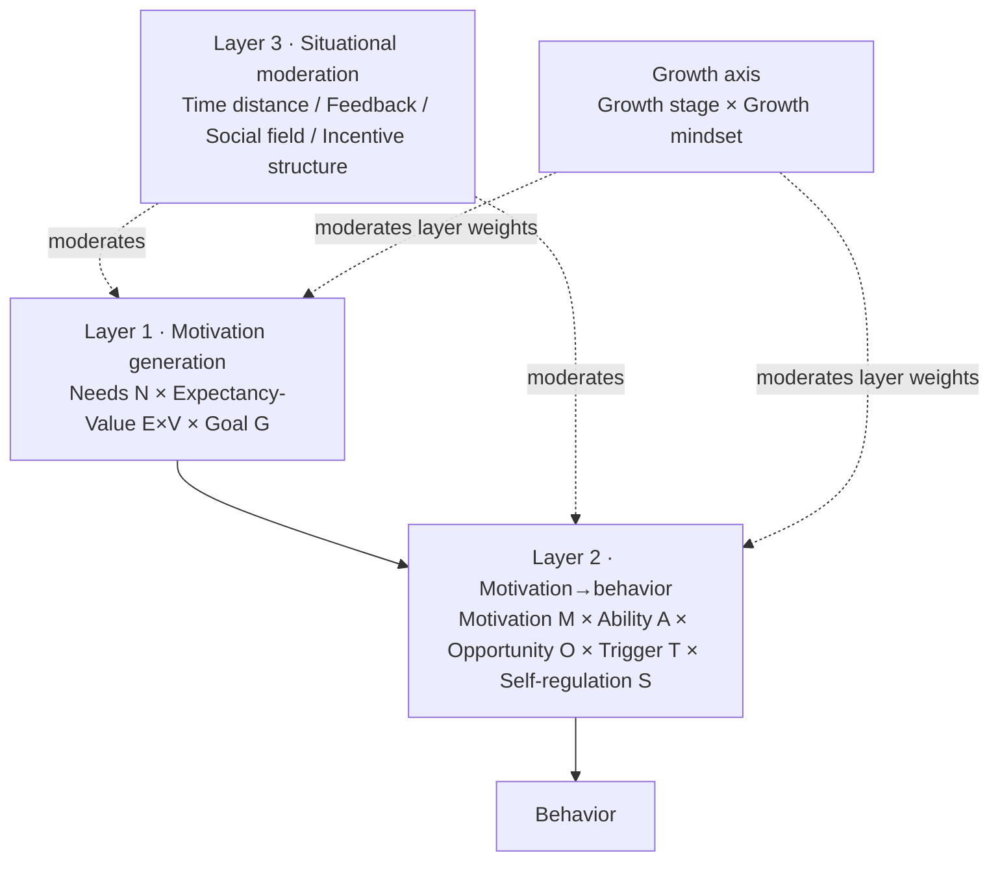

# 人的激励法则：情景激励模型

**版本：** 0.1（preprint）
**日期：** 2026-08-15
**类型：** 理论综述、概念模型与应用框架（theoretical synthesis / conceptual model / application framework）

## 摘要

"激励"在日常里几乎总被当成一个属性问题：这个人有没有动力、这个团队是不是懈怠了、给点奖励或打点鸡血能不能让他动起来。本文主张，这种问法本身就是激励反复失效的原因之一。动机不是一个可以被一次测量的固定属性，也不是"外部奖励—行为"的简单开关；它是一个情境化的、且沿成长阶段演化着的过程——**动机是否生成、能否转化为行为、能否在时间中维持，三者各自服从不同的条件，并且都受"这个人正处在成长的哪个阶段、怎样看待自己的成长"调节。**

本文综合自我决定理论（SDT）、期望-价值理论、目标设定理论、自我效能理论、行为模型与时间动机理论（TMT），并引入发展心理学、企业管理与组织员工心理学的视角，提出一个带"成长轴"的三层**情景激励模型**（Situational Motivation Model, SMM）。模型的骨架是通用的三层——**动机生成**（需要满足 × 期望×价值 × 目标性质）、**动机到行为的转化**（能力·效能 × 机会 × 触发 × 自我调节）、**情境的调节**——外加一条贯穿的**成长轴**（成长阶段 × 成长型思维）。在职场场景中，本文把"情境"具象化为**任务设计、目标系统、激励系统、反馈系统、发展通道、领导与关系**六个组件，把模型的终点接到**工作投入、组织承诺、绩效、倦怠、离职倾向，以及导师/继任等"传承"出口**上，并区分"去负"（消除不满）与"增正"（制造动力）两条通道；再以**企业生命周期四阶段**（初创、成长、成熟、衰退）与**"企业—管理者—员工"分层**作为宏观调节维度。

在此基础上，本文把模型压缩成九条可证伪的"激励法则"：情境性、必要不充分、动机质量、奖励情境、转化（意志）、时间衰减、成长匹配、公平与阶段匹配，并把它们落到 HR 的五个动作——测、配、托、盯、验。本文不报告新的实验数据，也不提供"如何让任何人听话"的操纵清单；它是一份理论综述、概念模型与应用框架，目的是把"激励"从一个被滥用的口头禅，变成一个可以被检验、被证伪、也能指导观察与干预的模型。

**关键词：** 激励；动机；行为；自我决定理论；成长型思维；工作设计；组织行为；情境化

## 1. 问题：为什么"激励"总是不灵

人们面对"没动力"，最常见的两个动作是：给人下一个属性判断（"他不上进""这届年轻人吃不了苦"），或者给一个外部杠杆（加钱、发奖、表扬、施压）。这两个动作指向同一个隐含假设：**动机是人的一种稳定属性，可以用一个外部刺激把它调高。** 但这个假设与大量证据相冲突。

第一，动机在情境间高度可变。同一个人可以在一个任务上废寝忘食，在另一个任务上拖延到最后一刻；可以在一个团队里主动，在另一个团队里应付。若动机是稳定属性，这种情境内的一致性应远高于情境间的差异，但事实恰恰相反。勒温（Lewin）早在 1936 年就把这一点写成一个方程：行为是人与环境的函数，$B = f(P, E)$[1]。它不是一句口号，而是一个方法论指令：**离开情境谈动机，等于离开上下文谈语义。**

第二，动机还会随时间与成长阶段改变。同一个人二十岁、三十五岁、五十岁时，被点燃的东西通常不是同一件。职业早期让人亢奋的"证明自己能行"，到了中期可能已经麻木；中期让人失落的"停滞感"，往往不是"态度问题"，而是发展阶段的自然命题。把"不同阶段的人动力不同"误读成"这个人变了、懈怠了"，是管理里最常见的误诊之一。

第三，奖励并不总是"加法"。德西、克斯特纳与瑞安（Deci, Koestner, & Ryan）对 128 项实验的元分析显示，某些外在奖励——尤其是与任务表现挂钩的、被感知为控制的奖励——会系统性地削弱内在动机[9]。这被称为"过度理由效应"（overjustification effect）：当一个人把自己的投入归因于"为了那笔钱"时，"我本来就想做"的理由反而被挤出。奖励不是失效的问题，而是可能产生负效应的问题。

第四，动机并不自动等于行为。新年决心、健身计划、读书清单——人们"很想做"却"一直没做"的清单可以无限长。动机和行为之间隔着一整段需要跨越的距离：能力够不够、机会在不在、有没有被提醒、能不能在诱惑面前执行计划。黑克豪森与戈尔维策（Heckhausen & Gollwitzer）把动机过程与意志过程区分开来，正是为了说明：**想做的状态和做的状态，服从的是两套不同的心理机制[11]。**

因此，本文的研究问题不是"如何让人更有动力"，而是：**能否把激励重新描述为一个情境化、且沿成长阶段演化的过程——动机如何生成、如何转化为行为、如何维持——并从中得出可证伪的法则？**

本文不报告新的实验数据，不提供临床诊断，也不构成"如何拿捏下属或他人"的处方。它借用成熟理论的**描述性**论点，明确拒绝任何把人当作杠杆对象的处方性部分。

**本文提出的是什么，不是什么。** 本文提出的是一套**描述性模型**（SMM）与九条可证伪的**激励法则**，而非一套操纵技术、一套"正能量话术"或一个"性格测评"。它的输入是"一个人（处在某个成长阶段）+ 一项任务 + 一个情境（在职场中是一套管理系统）"，输出是对"动机卡在哪一层"的解释与可检验预测，而不是对"这个人是不是不够上进"的判定。它能否成立，取决于第 5 节的可检验预测能否被证伪——而不是取决于它读起来是否顺耳。

## 2. 理论资源与边界

### 2.1 动机的七类经典资源

本文不发明新的动机概念，而是把七类彼此独立、常常被分开引用的理论整合进同一张情境地图。它们各自回答一个不同的问题，合起来才覆盖"生成—转化—维持"的完整链条。

| 视角 | 回答的问题 | 给 SMM 的部件 | 边界 |
| --- | --- | --- | --- |
| 勒温场论 $B=f(P,E)$[1] | 动机为什么不能脱离情境？ | 情境性的元命题 | 描述性框架，不是可计算方程 |
| 自我决定理论（SDT）[2][3] | 什么条件下动机会"自发"地出现并维持？ | 需要满足（自主、胜任、归属）；动机质量（自主 vs 控制） | 不主张"外在动机一定坏"，而是区分控制性 vs 信息性 |
| 期望-价值理论[4] | 理性权衡如何产生动机？ | $\text{Expectancy} \times \text{Instrumentality} \times \text{Valence}$ | 适合有明确结果的任务，对习惯与情绪性行为解释力弱 |
| 目标设定理论[5] | 目标如何引导与维持努力？ | 明确、困难、被承诺的目标 | 目标困难度须在能力边界内；目标不是奖励 |
| 自我效能理论[6] | 为什么"觉得能做成"如此关键？ | 能力与信念的入口 | 效能≠能力，也≠盲目乐观 |
| 行为模型 Fogg B=MAP[7] | 行为为何在动机存在时仍不出现？ | $\text{Motivation} \times \text{Ability} \times \text{Trigger}$ | 启发式模型，触发不等于控制 |
| 时间动机理论（TMT）[8] | 时间距离为何会"稀释"动机？ | $\text{Value} \div (\text{Delay} \times \text{Impulsiveness})$ | 整合模型，参数不易直接测量 |
| 动机-意志两阶段[11][12] | 决定之后，行动如何被维持？ | 实施意图与自我调节 | 意志阶段不产生新动机，只保护既有动机 |

### 2.2 动机的质量：为什么"数量"不够

自我决定理论最核心、也最容易被误读的一点，是它区分了动机的**数量**与**质量**。按照自主程度，动机可以被排成一条连续光谱：**无动机（amotivation）→ 外部调节 → 内摄调节 → 认同调节 → 整合调节 → 内在动机**。外在动机内部的"认同调节"（"我认同这件事的价值"）与"内摄调节"（"我不做会羞愧"）虽然看起来都"有动机"，却预测完全不同的结果[2][3]；这一区分在工作场景的展开，见 Gagné & Deci 对工作动机的综述[15]。

四十年的元分析给出了这一区分的实证重量：塞拉索利等人（Cerasoli et al.）发现，**内在动机更能预测绩效的"质量"，而外在激励更能预测绩效的"数量"**——两者各自预测不同类型的结果，而非一个更好、一个更坏[10]。这直接否决了"动机越强越好"的朴素说法：要问的不是"他有没有动机"，而是"他有什么样的动机，在面对什么类型的任务"。

### 2.3 三个学科补上的三块

把发展心理学、企业管理、组织员工心理学放进来，模型缺的三块就显形了。它们各自补一个部件：

- **发展心理学 → 成长轴。** 成长型思维（growth mindset）决定"困难与失败"被解读成挑战还是判决[17]；最近发展区（ZPD）给"任务难度"一个校准判据——"当前能力 + 一点"，而非越难越好[16]；生涯阶段理论说明职业早、中、后期的主导需要与主导挫败源不同[19][20]。三者合起来，模型需要一根贯穿的**成长轴**：`成长阶段 × 成长型思维`。

- **企业管理 → 情境具象化 + 两条通道。** 管理者造不了动机，只能设计动机产生的场景。员工面对的"情境"几乎全是管理系统，应具象化为任务设计、目标系统、激励系统、反馈系统、发展通道、领导关系六个组件[21]。同时，赫茨伯格的双因素理论提醒：保健因素（工资、制度、环境、公平）只能消除不满，激励因素（成就、成长、认可、责任）才制造动力——"去负"与"增正"是两条不同的通道[22]。亚当斯的公平理论进一步指出：投入-回报的**感知公平**是一个贯穿全程的强调节变量[23]。此外，企业所处的生命周期阶段决定这六个组件里哪些可被调用、哪些名存实亡，是企业级别的第二层调节变量[29]。

- **组织员工心理学 → 结果层 + 测量。** 动机不是终点，它要落到工作投入、组织承诺、绩效、倦怠与离职倾向这些可测量的结果上[24][25]。组织心理学长期用敬业度/脉冲调查与 JD-R 模型测量这些变量，正好给论文最弱的一环——可证伪性——补上测量抓手。

### 2.4 边界声明

第一，本文只借用各理论的**描述性**部分。SDT 描述"控制性奖励会削弱内在动机"，这是可检验的发现；但"因此管理者应该只给自主、永不施加奖励"是处方，本文不下。第二，"内在动机"与"外在动机"不是道德标签：一项重复性、低趣味的工作靠外在激励维持是常态，不构成缺陷；问题是这类工作能否被重新设计或清楚界定回报边界。第三，成长型思维是描述性调节变量：它的干预效应量偏小且高度依赖情境[18]，本文只把它用于"解释为什么同一次困难对不同人的意义不同"，不主张"培养成长型思维即可激励"的处方。第四，九条法则都是**统计性**规律——它们描述"在什么条件下更可能发生什么"，而不是对任何单个人的确定预言。

## 3. 情景激励模型（SMM）

本文把"激励"展开成一个带成长轴的三层结构。模型的总方程是：

$$
B = f(\text{Motivation}\ M \times \text{Ability}\ A \times \text{Opportunity}\ O \times \text{Trigger}\ T \times \text{Self-regulation}\ S)
$$

$$
M = f(\text{Need-satisfaction}\ N,\ \text{Expectancy}\times\text{Value}\ (E\times V),\ \text{Goal}\ G)
$$

每一条箭头都被两层变量调节：成长轴 $G = \{\text{Growth Stage},\ \text{Growth Mindset}\}$；情境变量 $Z = \{\text{Time Distance},\ \text{Feedback},\ \text{Social Field},\ \text{Incentive Structure}\}$。

> 术语说明：本文的"情景"与"情境"等价，均指动机赖以产生与转化的即时处境——任务、环境、时间与社会场。模型名沿用"情景激励模型"，正文统一用"情境"。

三层分别对应三个不同的问题，也对应三种不同的失效；成长轴则在三层之上，决定"此刻哪一层对这个人更重要"。

### 3.1 成长轴：成长阶段 × 成长型思维

成长轴是发展心理学给模型的最大贡献。它回答一个三层回答不了的问题：**同一个情境，为什么不同的人、或同一个人在不同人生阶段，动力完全不同？** 它由两个乘数构成：

- **成长阶段。** 职业早期的核心命题是**建立能力与认同**（"我能不能胜任、我能不能成为谁"），主导需要是胜任与成长；中期转向**意义与传承**（埃里克森所说的"生育感 vs 停滞"——我做的这件事对别人、对下一代有没有意义），主导需要是自主与意义；后期转向**传承与归属**（把积累交出去、被需要、被记得）[19][20]。主导需要不同，主导挫败源也不同：早期怕"学不到东西"，中期怕"停滞与无意义"，后期怕"被边缘化"。
- **成长型思维。** 它决定"能力 × 难度"这一项如何被解读：对成长型思维的人，困难是"能力可以被练出来"的挑战；对固定型思维的人，困难是"我果然不行"的判决[17]。同一个挑战，前者转化为投入，后者转化为回避与防御——即使两者的客观能力相同。

成长轴的作用是**调节三层的权重**，而非替代它们：早期阶段，生成层里"胜任/成长"的权重最高；中期阶段，"自主/意义"与"期望×价值里的效价"权重上升；后期阶段，"归属/传承"与转化层里的"触发与机会"（是否有可交棒的出口）权重上升。它也直接派生第七条法则（成长匹配）。

### 3.2 第一层：动机生成——需要、期望与目标

动机不是凭空出现的。SMM 把它的生成归为三个来源：

- **需要满足 N（自主、胜任、归属）。** 自主是"我的行动源于我自己"的体验，胜任是"我能胜任、且在进步"的体验，归属是"我与在意的人相连"的体验。三者被满足时，动机更自主、更易内化；三者被阻挠时，动机退化为控制或消失[2][3]。成长轴决定此刻哪个需要更优先（§3.1）。
- **期望 × 价值（E × V）。** 弗鲁姆（Vroom）的期望理论把动机拆成三个乘数：**期望**（我做了能不能做到）、**工具性**（做到了能不能带来那个结果）、**效价**（那个结果我到底想不想要）[4]。任何一个乘数接近零，乘积就接近零——这正是"努力了也没用"和"做到了也没回报"这两种常见死局的形式化。
- **目标性质 G。** 目标是否**明确**、是否**困难而可达成**、是否**自我一致**（self-concordant，即与我真正的价值一致）、以及人的**调节定向**（趋向型追求"得到" vs 防御型追求"不失去"），都会改变动机的强度与稳定性[5][13][14]。

三个来源是**乘数**关系，不是加法：需要满足但期望为零（"我做不到"），或期望很高但目标与自我背离（"做到了也不想要"），动机都生成不了。这解释了为什么"给一个不认同这件事的人加钱"常常无效——钱只动了 V 里的效价，动不了 N 和 G。

### 3.3 第二层：动机到行为的转化——能力、机会、触发与意志

动机生成后，并不自动变成行为。SMM 的第二层承接了 Fogg 的行为模型：$\text{Behavior} = \text{Motivation} \times \text{Ability} \times \text{Trigger}$[7]，并补上黑克豪森与戈尔维策的意志阶段：从"决定做"到"正在做"之间，需要**自我调节**来保护动机不被干扰打断[11]。

- **能力 A。** 不仅指客观技能，更指**自我效能**——"我确信我能执行这条路径"的信念[6]。效能过低，即使动机很高，人也会回避任务或过早放弃。
- **机会 O。** 环境里是否真的存在可执行、可承担的路径：有没有时间、工具、权限、容错空间。机会缺失不是态度问题，而是结构问题。
- **触发 T。** 行为通常需要一条"现在、此时、这里"的线索（提醒、环境信号、截止时间）来启动。没有触发，高动机也能无限期地停在"准备做"里[7]。
- **自我调节 S。** 启动之后，还需要应对诱惑、分心与情绪起伏。实施意图（"如果情境 X 出现，我就做 Y"）是一个便宜而稳定的自我调节工具[12]。

这一层是"激励失效"最常被误诊的地方：管理者看见的是"不做"，于是加大第一层的剂量（更多奖励、更多打气），而真正断裂的是第二层——没有能力、没有机会、没有触发，或没有把决定变成执行计划。

### 3.4 第三层：情境的调节——时间、反馈、社会场与激励结构

前两层的每一条箭头都不是在真空中运行的。SMM 把最稳定的四个情境调节变量单独列出：

- **时间距离。** 时间动机理论（TMT）把效价除以 $\text{Delay} \times \text{Impulsiveness}$：奖励越远、越抽象，它对即时行为的驱动力就越弱[8]。这正是拖延的机制：远期的高价值被近期的低价值即时满足反复击败。
- **反馈。** 反馈的**时机**（是否及时、是否与当前行动相连）与**质量**（是否信息性而非评判性）决定了它是在校准行为，还是在制造防御[9]。目标设定理论反复强调：没有反馈，目标就失去方向功能[5]。
- **社会场。** 心理安全、规范、他人的示范与期望会放大或抑制动机转化为行为的概率。一个"提出异议会被惩罚"的场，会把动机转化为沉默[27]。
- **激励结构。** 外在奖励是**控制性**还是**信息性**，决定它是削弱还是增强内在动机[9]；内在动机与外在激励各自预测质量与数量[10]。

### 3.5 组织化扩展一：情境的六个组件

这四个抽象变量在职场里几乎全部由管理系统实现。把"情境"具象化为六个组件，模型就获得了企业管理的操作性：

| 组件 | 管理学来源 | 决定什么 | 常见失效 |
| --- | --- | --- | --- |
| 任务设计 | 工作特征模型[21] | 技能多样性、任务完整性、任务重要性、自主性、反馈性 → 内在意义感 | 把工作切成无意义碎片；只留执行、不留反馈 |
| 目标系统 | MBO/OKR/KPI | 目标是否清晰、对齐、可核验 | 目标模糊、层层稀释、只考核数量 |
| 激励系统 | 薪酬、晋升、认可 | 效价 V 与工具性，以及公平感 | 回报与付出脱钩；激励被感知为控制 |
| 反馈系统 | 绩效面谈、1:1 | 反馈的时机与质量 | 一年一次、评判性、无行动闭环 |
| 发展通道 | 职业阶梯 | 成长轴的物质载体 | 承诺不兑现、通道不可见 |
| 领导与关系 | 心理安全[27] | 社会场是否安全、信任是否成立 | 让"发声"被经验性地惩罚 |

这六个组件不是并列的选项，而是六个可诊断、可改造的**情境设计变量**。管理者能直接改的是它们，而不是"员工的态度"。

这里要再区分一对词：**激励的模式与形式。** 模式——SMM 的三层与成长轴——跨层级、跨阶段不变：一线、中层、高层，都服从同样的需要满足、期望×价值与目标机制。形式——六组件的具体载体——则随层级与阶段大幅切换：一线多用现金、即时认可与晋升；中层以上，货币逐渐退为保健因素，课程/EMBA、股权、参与决策、信息接触权成为新的载体。中高层的"课程"尤其典型：它的价值往往不在"学"（胜任），而在**资源、信息与利益的互换**——一个课程同时交付归属/联结（圈子）、胜任信号（身份与头衔）与效价（可交换的资源信息），是"一形式、多需要"的打包。这是同一套模式在不同层级换上不同形式的表现，也解释了为什么高层的激励清单里，现金的位置被长期股权、声誉与社会资本取代。

### 3.6 组织化扩展二：结果层与"去负 / 增正"两条通道

动机在组织里不是终点。模型把终点接到一组可测量的结果上：

- **正向**：工作投入（engagement）、组织承诺、工作满意、幸福感 → 绩效、留存、组织公民行为[24]；
- **负向**：倦怠（burnout）、离职倾向、沉默 → 高要求-低资源的失衡信号[25][26]；
- **转化**：导师、顾问、继任过渡、知识沉淀——"后期"（成长轴的传承与归属）的健康终点，不应被误判为沉默或离职。

这条结果链给九条法则提供了测量抓手（§5）。同时，管理学的一个关键区分必须写进模型结构：**"去负"与"增正"是两条通道。** 保健因素（工资、制度、环境、公平）缺失会产生不满，但补满也不会产生动力；激励因素（成就、成长、认可、责任）才制造动力[22]。这意味着——消除不满意（去负）不能自动换来自主动机（增正），两者要用不同的动作去处理。赫茨伯格的两因素在数据上并非总能干净地分成两类，本文只保留它最稳健的洞见：**"不让他不满"和"让他有动力"是两个目标，别用同一个动作同时追求。**

### 3.7 组织化扩展三：企业生命周期

六个组件并非悬浮在空中，它们嵌在一家处于特定生命周期阶段的企业里。企业阶段是一个**企业级调节变量**：它决定六个组件里哪些可以被调用、哪些名存实亡，也决定此刻哪条法则最吃紧。格赖纳（Greiner）的经典模型把组织成长描述为"演进—革命"的交替——每个稳定期都由一套管理方式支撑，直到这套方式本身成为下一阶段的危机[29]。本文只借用它最粗的阶段划分，并为企业激励匹配裁剪成四个阶段（初创、成长、成熟、衰退）——这是"为员工激励而裁"的划分，不是对企业财务生命周期的忠实复刻——把它对齐到 SMM：

| 企业阶段 | 六组件里最吃重的（可用激励渠道） | 主导需要（成长轴） | 典型失效风险 | 最相关法则 |
| --- | --- | --- | --- | --- |
| 初创期 | 任务设计（愿景与意义）、激励系统（股权/期权）、领导关系（自主） | 自主 + 胜任/成长 | 效价不清、燃尽、激励被感知为控制 | 一、三、四、六 |
| 成长期 | 目标系统、激励系统（绩效/晋升）、发展通道 | 胜任 + 成长（通道兑现） | 官僚化、目标稀释、公平失衡 | 五、七、八 |
| 成熟期 | 激励系统（利润分享/稳定回报）、发展通道（内部流动/第二曲线）、领导关系（意义与传承） | 意义（生育感 vs 停滞）+ 稳定 | 职业高原、停滞、内在动机流失 | 三、七、八 |
| 衰退期 | 领导关系（坦诚沟通/心理安全）、反馈系统（透明度）、激励系统（公平留任与善后） | 归属 + 安全 | 职业不安全感、犬儒、控制性压力 | 四、六、八 |

这张表的关键判断是：**差异化不是"企业阶段"一个变量决定的，而是"企业阶段 × 员工成长阶段"的匹配。** 初创期的股权故事，对处在"证明自己能行"阶段的年轻人是高效价，对已过风险偏好、需要稳定与传承的中年骨干则可能接近零效价；成熟期企业若不能给成长期员工提供可见的发展通道，职业高原[30]就会成为结构性的动机杀手；衰退期里，"职业不安全感"本身就是一个独立于具体事件的压力源[31]，此时任何控制性施压都会放大而非修复动力流失。**转型不是第五个阶段，而是一种可叠加的模式**：它可以主动发生在成熟期（找第二曲线），也可以被动发生在衰退期（求生），其激励特征是"未来叙事 + 心理安全 + 公平留任"。还需注意：这四个阶段不是严格的线性阶梯，衰退也可能被逆转；把它们读作四种"动机气候"（motivational regime），比读作一条单向阶梯更准确。

### 3.8 组织化扩展四：谁需要激励——企业、管理者与员工的分层

把"企业"和"人"混为一谈，是激励设计里最常见的类别错误。这里把三者按两条轴分开：一条是**系统的层级**，一条是**被激励的主体**。

- **企业是情境的供给方，不是被激励的对象。** 企业没有"动力"可言，它有的是六组件的配置与生命周期阶段——这些是让人有动力或没动力的环境，而不是"企业这个人"的状态。问"企业有没有动力"是类别错误；该问的是"这套六组件配置、在这个阶段，正在让人有动力还是无动力"。但"供给方"并非默认恒在：初创期这些组件往往尚未建成（情境供给成熟度低），衰退期供给容量又会枯竭（没钱、没通道、没安全）。模型默认"情境存在且可调"，在零结构或供给枯竭的组织里会失效——那时瓶颈从"调节失灵"上移到"生成与共建"，HR 的动作也从"调参"变成"补基础设施"。
- **管理者是"双身份"。** 管理者首先是**员工**——生成、转化、情境三层对他同样适用，他也需要被激励，也会倦怠（中层倦怠常被忽略）。同时管理者是**情境设计者**：他直接控制下属的目标、反馈、发展通道与领导关系。因此管理者的动力会**向下传导**——一个被激励的管理者，会通过他设计的情境放大团队的动机；一个倦怠的管理者，即便制度完好，也会把控制性压力传导下去。这条传导可以写成一条级联：**情境设计质量 = f(设计者自身的需要满足度、动机质量、设计权边界)。** 一个自身低自主的管理者（例如授权被收紧），更倾向于对下属施加控制性激励（法则四的负支）；而成熟科层里的中层常"有设计之名、无设计之权"——他控制不了激励系统与晋升通道，却要为下属的动机负责。所以不能只"激励员工"，还得先看管理者自己是不是被激励的、手里有没有设计权。
- **员工是激励的直接主体。** 模型的三层 + 成长轴，首先是为员工写的。

这里还需把**留存**与**动机**再分开一次。人力资源实务常用"管理层 vs 员工"的二分——它是一个**留存与薪酬**的视角：谁离职代价高、谁有股权/金手铐、谁最难替换。SMM 则是一个**动机**视角：任何一个人在什么情境下生成、转化并维持动机。两者正交：一个中层管理者可以"不会走"（被股权、薪资、年限锚住）却"完全没动力"，甚至正在把他的倦怠传导给整个团队。实务里"中层自己会留下来"的假设，即便成立，也只回答了留存，没有回答动机——而一个留下来的倦怠中层，恰恰因为他的双身份，是组织里最昂贵的一类动力风险。管理者也不是一个同质的桶：一线、二线、三线与高层的被激励处境各不相同，中层（二线、三线）常常是"管理层 vs 员工"二分里两头都不沾、最容易被漏掉的区间。这并不推翻"管理者需要被激励"，反而说明管理者里最该被单独看的一层，恰恰最常被漏掉。

这个分层补上模型的一个隐含承诺：**激励不是"企业给员工发动力"，而是"企业提供情境，管理者既是情境设计者又是被激励者，员工在被设计的情境里生成并转化动机"。** 它也把"管理者倦怠"标成一个独立的风险源——这与《职场人际风险分析协议》里"来自上方的风险"互为镜像。

### 3.9 模型如何工作：一次"没动力"的诊断

模型的价值不在精确计算，而在**定位断裂点**。面对"这个人/这件事没动力"，先确认企业所处的生命周期阶段（它决定六组件里哪些可调用、主导失效风险是什么），再沿成长轴确认他的阶段，逐层追问：

1. 成长轴：他处在职业早期/中期/后期？主导需要是什么？他是成长型还是固定型思维？
2. 生成层：需要是否被满足？期望×价值里哪个乘数接近零？目标是否明确、困难而自我一致？
3. 转化层：能力与效能是否够？机会与容错在不在？有没有触发与执行计划？
4. 调节层（职场六组件）：任务设计、目标、激励、反馈、发展通道、领导关系，哪个组件断裂？
5. 结果层：投入、承诺、满意在下降，还是倦怠、离职倾向在上升？

三层（及六组件）各自给出不同的干预：生成层断，改任务设计与价值；转化层断，补能力、机会、触发与计划；调节层断，改六个情境组件。**错位干预——在第二层断时继续加大第一层的奖励、在成长轴错了时继续换激励方案、或无视企业阶段照搬别人的激励方式——是激励失效最常见的操作错误。** 公平感（法则八）贯穿全程，任何一层的不公都会先于其他因素起作用；企业阶段（法则九）则决定此刻最吃紧的是哪一层。

## 4. 九条激励法则

把 SMM 压缩成九条法则。每条都给出**机制**、**可检验预测**与**边界**，使它成为可被证伪的命题而非格言。

### 法则一（情境性）：动机是情境与人的函数，不是人的固定属性

*机制。* $B = f(P, E)$：同一人的动机在不同任务、不同环境、不同时点之间波动，波动幅度常常大于人与人之间"平均动机"的差异[1]。在组织行为学里，这被具体化为"人-环境匹配"（person-environment fit）研究[28]。*可检验预测。* 同一个人在跨情境的动机测量中的方差，应显著大于其个人特质（如尽责性）在同一情境下的重测方差；换言之，"谁在什么情境下做什么"比"谁是积极的人"更有预测力。*边界。* 这不否认稳定的个体差异存在，只否认它们是动机的唯一来源。

### 法则二（必要不充分）：动机是行为的必要但不充分条件

*机制。* 行为还需要能力、机会、触发与自我调节[7][11]。*可检验预测。* 当能力、机会或触发任一缺失时，高动机组的实际行为率不显著高于低动机组；只有三个条件同时存在时，动机才与行为强相关。*边界。* "必要"指在有意行动中动机通常是起点之一，习惯与反射行为可绕过高强度动机。

### 法则三（质量）：动机的质量比数量更能预测持续性与复杂任务绩效

*机制。* 自主型动机（内在、认同、整合）预测长期坚持、幸福感与复杂/创造性任务的质量；控制型动机预测短期顺从与数量[2][3][10]。*可检验预测。* 以自主型动机为主的人在复杂、开放任务上的质量与坚持，应显著高于同等强度但控制型动机的人；在简单、重复、数量型任务上，两者的差异应缩小甚至反转。*边界。* 质量与数量不是道德高下；干预目标是让动机与任务类型匹配。

### 法则四（奖励情境）：外在奖励的作用取决于它被感知为控制还是信息

*机制。* 与表现挂钩、被感知为控制的奖励削弱内在动机；被感知为能力信息的反馈则增强[9]。*可检验预测。* 对原本有趣的任务，施加"完成即得钱"的控制性奖励后，撤去奖励时的自愿投入应低于无奖励组；而"进步信息"型反馈不应产生此效应。*边界。* 对低趣味、重复性任务，外在激励是正当且有效的；本法则针对的是"用奖励挤掉内在动机"的负效应，而非否定一切奖励。

### 法则五（转化/意志）：从动机到行为需要自我调节

*机制。* 决定与执行之间隔着意志阶段；实施意图把"我想做"绑定到"当 X 出现时我就做 Y"，从而在关键时刻自动触发[11][12]。*可检验预测。* 相同动机强度下，形成实施意图的组在行为启动率与坚持率上应显著高于仅有目标意图的组；差距在诱惑或分心情境下更大。*边界。* 自我调节保护的是既有动机，不制造新动机；对认同度为零的目标，计划再细也无济于事。

### 法则六（时间衰减）：激励效果随时间距离与延迟折扣而衰减

*机制。* 效价被"延迟 × 冲动性"除：越远、越抽象的回报，对当下行为的驱动力越弱[8]。*可检验预测。* 等值奖励的即时兑现组的任务投入应高于延迟兑现组；延迟越长、个体冲动性越高，差距越大。*边界。* 有强自我调节者可用"绑定远期价值"等手段抵抗折扣，但抵抗本身消耗意志资源，不改变折扣曲线。

### 法则七（成长匹配）：动机取决于挑战与当前成长阶段的匹配

*机制。* 最近发展区：任务难度应落在"当前能力 + 一点"，过难则回避、过易则无聊[16]；成长型思维决定困难被解读为挑战还是判决[17]；生涯阶段决定此刻的主导需要[19][20]。*可检验预测。* 任务难度与个人当前能力的距离，和投入/心流呈倒 U 关系（峰值在"能力 + 一点"）；同一难度下，成长型思维者的投入显著高于固定型思维者；同一任务，处于"该任务对应其主导需要"生涯阶段的人，投入显著更高。*边界。* 成长型思维的干预效应量偏小且异质[18]，本法则用于解释而非作为干预处方。它是一条**条件法则**：当组织以"生存"优先于"成长"（如初创期的跃迁式拔人、衰退期的求生转型）时，难度可有意超过"能力 + 一点"，但前提是配"安全网"——可回收的失败、导师兜底、增量试错；没有安全网的超难任务，本法则恢复生效。

### 法则八（公平）：感知到的投入-回报不公，会压过其他动机来源

*机制。* 亚当斯的公平理论：人持续比较自己与他人（或与过去自己）的投入-回报比，感知不公时会产生张力，并优先通过调整投入、扭曲认知或退出关系来恢复平衡[23]。*可检验预测。* 当员工感知到投入-回报比显著低于参照对象时，其投入、承诺与公民行为的下降应快于、且独立于能力/目标等其他因素的解释力；不公平感是离职倾向的强预测因子。*边界。* 公平是**感知**而非客观量，同一客观报酬对不同参照系可能产生不同公平判断；它更接近"去负"通道——消除不公能防止动力流失，但本身不制造自主动机。

### 法则九（阶段匹配）：激励方式与企业生命周期阶段（及员工成长阶段）的匹配决定激励效能

*机制。* 企业所处的生命周期阶段决定六个情境组件里哪些可以被调用、哪些名存实亡（初创期无成熟的发展通道，成熟期无高增长的股权叙事，衰退期则连"未来叙事"都稀缺）[29]；员工成长阶段决定此刻的主导需要。两者错配——把初创期的股权故事讲给需要稳定的中年骨干、或让成熟期企业的成长期员工看不到发展通道——会同时压低生成层的需要满足与转化层的机会，并放大职业高原[30]与职业不安全感[31]等结构性风险。*可检验预测。* 同一激励方案（股权 / 晋升通道 / 利润分享）的效能，在处于不同生命周期阶段的企业之间应显著不同；控制其他变量后，"企业阶段 × 员工成长阶段"的匹配度应独立预测工作投入与离职倾向，且预测力高于任一单一阶段变量。*边界。* 生命周期模型是启发式框架，阶段边界并不清晰，企业也常处于混合阶段；本法则用于解释差异，不主张"企业必须按阶段机械换激励"，更不用于预测单个企业的成败。更重要的精度问题：企业阶段是单一标量，但企业内部通常多阶段并存（成长期公司的销售已成熟、新业务仍初创、亏损线已衰退），因此匹配粒度应从"企业 × 员工"下沉到"单元/职能 × 员工"，并允许阶段多值叠加——给全公司套用单一阶段的激励结构，会在异质单元上系统性错配。

## 5. 应用与可证伪检验

### 5.1 诊断清单

SMM 与九法则落到操作上，是一张沿成长轴展开的三层诊断清单。它不输出"这个人该不该被激励"，只输出"动机卡在哪一层"。这与本站文章《当一个人失去动力，管理者能做什么》一致：先分辨原因来自环境、角色、回报还是个人状态，再决定干预——而不是把一切归为态度问题。

| 轴/层 | 诊断问题 | 对应法则 | 干预方向 |
| --- | --- | --- | --- |
| 企业阶段 | 企业处在初创/成长/成熟/衰退哪个阶段？六组件里哪些可调用？ | 九 | 按阶段匹配激励渠道，不照搬他人方案 |
| 成长轴 | 他处在生涯哪个阶段？主导需要是什么？思维是成长型还是固定型？ | 七 | 匹配挑战难度、调整价值叙事 |
| 生成 | 需要（自主/胜任/归属）是否被满足？ | 三 | 恢复选择权、匹配难度、建立联结 |
| 生成 | 期望、工具性、效价哪个接近零？ | 一 | 补能力/可信回报/价值连接 |
| 生成 | 目标是否明确、困难而自我一致？ | 三 | 重写目标：更具体、可达成、与价值对齐 |
| 转化 | 能力与效能是否够？机会与容错在不在？ | 二 | 补技能、拆路径、降障碍 |
| 转化 | 有没有触发与执行计划？ | 五 | 设提醒、写 if-then 计划 |
| 调节（六组件） | 任务设计、目标、激励、反馈、发展通道、领导关系，哪个断裂？ | 四/六/八 | 缩短反馈周期、改信息性反馈、校准公平、补发展通道 |
| 结果层 | 投入/承诺/满意在降，还是倦怠/离职在升？ | 全 | 追踪结果、验证干预是否真的改了行为与状态 |

### 5.2 HR 视角：五个动作

模型对 HR 的含义可以压缩成一句话：**HR 的工作不是"激发动力"，而是"设计并维护动机产生的情境"。** 按模型的顺序，落到五个动作：

1. **测：把"留存"和"动机"分开量。** 现在 HR 手里大多是留存尺子（离职率、留存率、替换成本）。要补动机尺子——投入、倦怠、需要满足、公平感——尤其要**单独给中层（二线、三线）测**，别让他们藏在"管理层 vs 员工"二分的缝隙里（§3.8）。看不见，就没法管。
2. **配：按"单元阶段 × 层级 × 成长阶段"配形式（而非按整个企业一刀切）。** HR 不发明动机，只设计载体。用 §3.7 的四阶段和 §3.5 的模式/形式区分：初创期配愿景、股权、自主；成熟期配内部流动、意义、利润分享；衰退期配坦诚、公平、心理安全。一线配现金与即时认可，中层配课程、决策参与、信息权（同时警惕"课程 = 资源信息互换"滑成纯关系交易），高层配长期股权、声誉、传承。**模式统一，形式分场景。**
3. **托：把公平与保健做扎实。** 公平（法则八）与保健因素只能"去负"，但去负是增正的地基——它不牢，一切激励因素都白搭。先保证薪酬、程序、制度公平不塌，再做激励；很多"激励失灵"，其实是"公平先塌了"。衰退期供给枯竭时，钱和晋升都调不动，只能退而用两个零成本杠杆——**叙事（意义重建）与角色再设计（导师/顾问/知识交接）**——它们与"去负"互补：钱越少，公平和意义越不能塌。
4. **盯：盯中层双身份，别默认"中层会自己留下来"。** 留存不等于动机（§3.8）。中层倦怠是乘法——一个倦怠的中层会把控制性压力传导给整条线。动作：中层单独看板、识别"留下来但没动力"的人、给中层自主权与容错。
5. **验：把每个动作做成可否证的试点。** 沿用 §5.3 的研究计划：先写假设、采基线、设护栏，再按证据三选一（扩大 / 修改 / 停止），而不是"发个方案看效果"。

### 5.3 研究计划

0.2 版应把 SMM 从概念模型变成可评估的研究原型，而不是直接上线"激励测评"：

1. **操作化。** 为"需要满足、期望×价值、目标性质、成长阶段、成长型思维、能力/效能、机会、触发、自我调节、六组件、公平感、投入/承诺/倦怠/离职"各定义可测量指标，优先复用成熟量表（SDT 需要满足量表、工作投入量表、JD-R 量表等）。
2. **情境采样验证。** 用经验采样法（一天内多次、跨多天）测量同一批人的动机波动，检验法则一（情境内方差 vs 情境间方差）。
3. **转化缺口实验。** 在受控任务中操纵能力、机会与触发（法则二），比较实施意图组与目标意图组（法则五）。
4. **奖励与公平实验。** 复现控制性奖励与信息性反馈的差异化效应（法则四）、延迟兑现的折扣（法则六）、投入-回报不公的动机侵蚀（法则八）。
5. **成长匹配检验。** 用倒 U 假设检验法则七：难度-投入关系是否在"能力 + 一点"处达峰，且被成长型思维与生涯阶段调节。
6. **阶段匹配检验。** 用跨企业样本检验法则九：同一激励方案（股权 / 晋升通道 / 利润分享）的效能是否随企业生命周期阶段而变，且"企业阶段 × 员工成长阶段"的匹配度是否独立预测投入与离职倾向。
7. **效度与边界。** 检验各法则的效应量在不同任务类型（简单 vs 复杂、有趣 vs 重复）与不同样本（行业、企业阶段、生涯阶段）中的稳定性；任何一项被否证，都意味着对应法则需要修改。

### 5.4 九条法则的可检验预测汇总

| 法则 | 核心预测 | 若被否证意味着 |
| --- | --- | --- |
| 一 情境性 | 情境内方差 > 情境间方差（相对稳定特质） | 动机更接近特质，情境模型需降级 |
| 二 必要不充分 | 能力/机会/触发缺失时，动机与行为脱钩 | 动机可直接驱动行为，转化层冗余 |
| 三 质量 | 自主型动机预测质量与坚持，控制型预测数量 | 动机只需谈数量，质量维度冗余 |
| 四 奖励情境 | 控制性奖励削弱、信息性反馈增强内在动机 | 过度理由效应不成立，奖励模型需重写 |
| 五 转化 | 实施意图组行为启动/坚持显著更高 | 意志阶段可并入动机阶段 |
| 六 时间衰减 | 延迟兑现降低投入，随延迟与冲动性加剧 | TMT 的折扣结构需修正 |
| 七 成长匹配 | 难度-投入倒 U（峰值在"能力+一点"；有安全网时可超），被思维与阶段调节 | 成长轴冗余，发展心理学视角需降级 |
| 八 公平 | 不公感压过其他动机来源，独立预测离职倾向 | 公平可并入期望-价值，无需单列 |
| 九 阶段匹配 | 激励方案效能随单元/企业阶段而变；"单元阶段×员工阶段"匹配度独立预测投入/离职 | 企业阶段可并入情境变量，无需单列 |

## 6. 与相关工作的关系

本文与作者此前的几篇写作与研究共享一组判断，但分工不同：

- 《当一个人失去动力，管理者能做什么》给出了一线管理者的实践原则——"先分辨原因再干预，不要把一切归为态度"。本文把它背后的机制形式化：那篇文章列举的四类原因（方向不清、角色单调、环境不公平/反馈缺失、个人状态困难），分别落在 SMM 的生成层（目标性质）、调节层（任务设计）、调节层（激励/反馈系统，对应法则八）与成长轴/生成层（需要满足）。
- 《成就感不是奖励》是法则三（动机质量）与法则四（奖励情境）的经验式展开：成就感来自完成承诺、认同职业、帮助他人与相信意义，而非来自结果奖励——这与 SDT 的自主/胜任/归属需要，以及"控制性奖励削弱内在动机"一致。
- 《职场人际风险分析协议》用工作要求-资源模型（JD-R）与心理安全描述职业心理健康；本文的"结果层"复用同一框架（参考文献 25–27），把倦怠与投入作为激励失效的终点信号。两篇互为上下游：那篇处理"关系与权力结构里的风险"，这篇处理"任务与情境里的动机"。

## 7. 有效性威胁与研究边界

第一，本文整合的理论多源自西方样本与实验室情境，向中文职场、教育与生活场景迁移存在距离；九条法则的效应量须回到本土样本复现。第二，SMM 是**描述性**模型，从"描述机制"到"设计干预"之间还隔着一层需要实证的转化——模型能定位断裂点，不自动保证干预有效。第三，本文把复杂动机过程压缩为"成长轴 + 三层 + 六组件 + 企业阶段 + 结果层"，可能遗漏文化变量（如关系型自我、面子、集体主义下的公平参照）与情绪变量对动机的调节。第四，自陈测量（需要满足、效能、效价、公平感）与行为测量之间存在方法方差，法则的检验须用多方法（自陈 + 行为 + 观察）交叉。第五，成长型思维的干预效应量偏小且异质[18]，赫茨伯格两因素的划分在数据上并不总能复现[22]，本文对两者的使用都限制在描述性洞见层面，不作处方。第六，本文不提供操纵技术：任何把九法则用于"让人顺从"的用法，都已超出本文的描述性边界，也容易被使用者与对象双方的信任损耗所反噬。第七，九条法则并非加性、也非总是兼容：在特定"企业阶段 × 员工成长阶段"下它们会互斥（如成长期"难度=能力+一点"与"老员工投入多回报少"的公平冲突），本文以"断裂在哪一层"作为仲裁，而非给每条法则赋权重；当企业处于阶段叠加态（成熟+转型），须显式分离两套目标与考核，否则激励结构对动机的贡献可为负。此外，威胁情境下生存/安全需要会压过自主-胜任-归属三元，高动机也不保证建设性方向；初创期的回报不确定性（方差）与"角色压缩"（一人多格）、成熟期"晋升可达性归零"（工具性结构性归零而非时间衰减），都是推演暴露、本文未展开的边界。

## 8. 结论

激励的困难，不在于把一个人的动力调高，而在于看清它卡在哪一层、处在成长轴的哪一段：是没有生成，是生成了没转化，还是转化了没维持——以及此刻对他最重要的需要是什么。把"这个人有没有动力"换成"动机在哪个情境、哪一层、哪个成长阶段断裂"，激励就从一个被滥用的口头禅，变成一个可以被观察、被检验、被证伪的问题。

这仍是一个未完成的概念模型。它需要经过操作化、情境采样与实验检验，才有资格从"模型"变成"经过验证的法则"。但在那之前，它已经可以做到一件事：让人停止用"他不上进"解释一切，转而追问——**他处在成长的哪一段、需要是否被满足、期望×价值里哪个乘数归零、能力机会触发是否在场、六个情境组件哪个断了、公不公平、投入、倦怠与传承在往哪个方向走。** 这些问题可被回答、可被证伪，也因此才配被称作"人的激励法则"。

## 参考文献

1. Lewin, K. (1936). *Principles of Topological Psychology*. New York: McGraw-Hill. 提出 $B = f(P, E)$；本文据此确立"情境性"元命题，仅借用其描述性框架。
2. Deci, E. L., & Ryan, R. M. (1985). *Intrinsic Motivation and Self-Determination in Human Behavior*. New York: Plenum. 自我决定理论的奠基之作；本文据此区分动机质量。
3. Ryan, R. M., & Deci, E. L. (2000). [Self-determination theory and the facilitation of intrinsic motivation, social development, and well-being](https://doi.org/10.1037/0003-066X.55.1.68). *American Psychologist*, 55(1), 68–78. 给出自主/胜任/归属三需要与自主—控制光谱；本文据此构建动机生成层。
4. Vroom, V. H. (1964). *Work and Motivation*. New York: Wiley. 期望理论（期望 × 工具性 × 效价）；本文据此形式化"三个乘数任一归零则动机归零"。
5. Locke, E. A., & Latham, G. P. (2002). [Building a practically useful theory of goal setting and task motivation: A 35-year odyssey](https://doi.org/10.1037/0003-066X.57.9.705). *American Psychologist*, 57(9), 705–717. 目标明确度、困难度与反馈的方向功能；本文据此构建目标性质部件。
6. Bandura, A. (1977). [Self-efficacy: Toward a unifying theory of behavioral change](https://doi.org/10.1037/0033-295X.84.2.191). *Psychological Review*, 84(2), 191–215. 自我效能对行为选择、努力与坚持的作用；本文据此区分"能力"与"效能信念"。
7. Fogg, B. J. (2009). A behavior model for persuasive design. *Proceedings of the 4th International Conference on Persuasive Technology*, Article 40. B = 动机 × 能力 × 触发；本文据此构建转化层的最小充分条件。
8. Steel, P., & König, C. J. (2006). [Integrating theories of motivation](https://doi.org/10.5465/amr.2006.22527462). *Academy of Management Review*, 31(4), 889–913. 时间动机理论（TMT）：效价 ÷（延迟 × 冲动性）；本文据此提出时间衰减法则。
9. Deci, E. L., Koestner, R., & Ryan, R. M. (1999). [A meta-analytic review of experiments examining the effects of extrinsic rewards on intrinsic motivation](https://doi.org/10.1037/0033-2909.125.6.627). *Psychological Bulletin*, 125(6), 627–668. 控制性奖励削弱内在动机的元分析；本文据此提出奖励情境法则。
10. Cerasoli, C. P., Nicklin, J. M., & Ford, M. T. (2014). [Intrinsic motivation and extrinsic incentives jointly predict performance: A 40-year meta-analysis](https://doi.org/10.1037/a0035661). *Psychological Bulletin*, 140(4), 980–1008. 内在动机预测质量、外在激励预测数量；本文据此确立动机质量法则。
11. Heckhausen, H., & Gollwitzer, P. M. (1987). [Thought contents and cognitive functioning in motivational versus volitional states of mind](https://doi.org/10.1007/BF00990238). *Motivation and Emotion*, 11(2), 101–120. 动机阶段与意志阶段的区分（Rubicon 模型）；本文据此构建转化层。
12. Gollwitzer, P. M. (1999). [Implementation intentions: Strong effects of simple plans](https://doi.org/10.1037/0003-066X.54.7.493). *American Psychologist*, 54(7), 493–503. 实施意图（if-then 计划）对行为启动与坚持的效应；本文据此提出转化法则。
13. Higgins, E. T. (1997). [Beyond pleasure and pain](https://doi.org/10.1037/0003-066X.52.12.1280). *American Psychologist*, 52(12), 1280–1300. 调节定向理论（趋向/防御）；本文据此补充目标性质部件。
14. Sheldon, K. M., & Elliot, A. J. (1999). [Goal striving, need satisfaction, and longitudinal well-being: The self-concordance model](https://doi.org/10.1037/0022-3514.76.3.482). *Journal of Personality and Social Psychology*, 76(3), 482–497. 自我一致目标预测更持久的追求与更高幸福感；本文据此界定"目标是否自我一致"。
15. Gagné, M., & Deci, E. L. (2005). [Self-determination theory and work motivation](https://doi.org/10.1002/job.322). *Journal of Organizational Behavior*, 26(4), 331–362. SDT 在工作场景的展开；本文据此说明"工作激励"如何进入 SMM 的动机质量维度。
16. Vygotsky, L. S. (1978). *Mind in Society: The Development of Higher Psychological Processes*. Cambridge, MA: Harvard University Press. 最近发展区（ZPD）；本文据此把"任务难度"校准为"当前能力 + 一点"。
17. Dweck, C. S. (2006). *Mindset: The New Psychology of Success*. New York: Random House. 成长型 vs 固定型思维；本文据此把"困难如何被解读"作为成长轴的乘数之一。
18. Yeager, D. S., Hanselman, P., Walton, G. M., et al. (2019). [A national experiment reveals where a growth mindset improves achievement](https://doi.org/10.1038/s41586-019-1466-y). *Nature*, 573(7774), 364–369. 成长型思维干预效应量偏小且高度依赖情境；本文据此限制成长型思维的使用为描述性而非处方。
19. Erikson, E. H. (1950). *Childhood and Society*. New York: W. W. Norton. 心理社会发展阶段，尤其"生育感 vs 停滞"；本文据此刻画职业中期的意义命题。
20. Super, D. E. (1980). [A life-span, life-space approach to career development](https://doi.org/10.1016/0001-8791(80)90056-1). *Journal of Vocational Behavior*, 16(3), 282–298. 生涯发展阶段；本文据此构建成长轴的"成长阶段"。
21. Hackman, J. R., & Oldham, G. R. (1976). [Motivation through the design of work: Test of a theory](https://doi.org/10.1016/0030-5073(76)90016-7). *Organizational Behavior and Human Performance*, 16(2), 250–279. 工作特征模型（技能多样性、任务完整性、任务重要性、自主性、反馈性）；本文据此构建"任务设计"组件。
22. Herzberg, F. (1968). One more time: How do you motivate employees? *Harvard Business Review*, 46(1), 53–62. 双因素理论（保健 vs 激励）；本文只保留其"去负 ≠ 增正"的描述性洞见，并标注其两因素划分在数据上并不总能复现。
23. Adams, J. S. (1963). [Towards an understanding of inequity](https://doi.org/10.1037/h0040968). *Journal of Abnormal and Social Psychology*, 67(5), 422–436. 公平理论；本文据此提出公平法则。
24. Kahn, W. A. (1990). [Psychological conditions of personal engagement and disengagement at work](https://doi.org/10.5465/256287). *Academy of Management Journal*, 33(4), 692–724. 工作投入（engagement）的心理学条件；本文据此构建结果层的正向端。
25. Demerouti, E., Bakker, A. B., Nachreiner, F., & Schaufeli, W. B. (2001). [The job demands-resources model of burnout](https://doi.org/10.1037/0021-9010.86.3.499). *Journal of Applied Psychology*, 86(3), 499–512. JD-R 模型；本文据此构建结果层的负向端（倦怠）。
26. Bakker, A. B., & Demerouti, E. (2016). [Job demands–resources theory: Taking stock and looking forward](https://doi.org/10.1037/ocp0000056). *Journal of Occupational Health Psychology*, 22(3), 273–285. JD-R 理论的更新综述；本文据此说明"高要求-低资源"是倦怠信号。
27. Edmondson, A. C. (1999). [Psychological safety and learning behavior in work teams](https://doi.org/10.2307/2666999). *Administrative Science Quarterly*, 44(2), 350–383. 心理安全；本文据此说明社会场如何把动机转化为投入或沉默。
28. Kristof-Brown, A. L., Zimmerman, R. D., & Johnson, E. C. (2005). [Consequences of individuals' fit at work: A meta-analysis of person-job, person-organization, person-group, and person-supervisor fit](https://doi.org/10.1111/j.1744-6570.2005.00672.x). *Personnel Psychology*, 58(2), 281–342. 人-环境匹配的元分析；本文据此把法则一（情境性）在职场中表达为"匹配"问题。
29. Greiner, L. E. (1972). Evolution and revolution as organizations grow. *Harvard Business Review*, 50(4), 37–46. 组织成长阶段（演进—革命）的经典模型；本文据此把"企业生命周期阶段"作为企业级调节变量，仅借用其描述性阶段划分，不采用其处方性结论。
30. Yang, W.-N., Niven, K., & Johnson, S. (2018). [Career plateau: A review of 40 years of research](https://doi.org/10.1016/j.jvb.2018.11.005). *Journal of Vocational Behavior*, 110, 286–302. 职业高原综述；本文据此说明成熟期企业的"停滞"是结构性的动机风险。
31. Cheng, G. H.-L., & Chan, D. K.-S. (2007). [Who suffers more from job insecurity? A meta-analytic review](https://doi.org/10.1111/j.1464-0597.2007.00312.x). *Applied Psychology*, 57(2), 272–303. 职业不安全感元分析；本文据此说明衰退期（含转型模式）企业的动机风险。

## 作者信息与声明

**作者：** Liyuk

**利益冲突：** 作者声明无利益冲突。本研究未受任何商业机构资助，未使用任何涉及真实个人动机或行为记录的隐私数据进行训练或评估。

**数据可用性：** 本文是理论综述、概念模型与应用框架，不报告新的实验数据。文中引用的元分析与实验结论均来自已发表研究，具体效应量应回到原始出处核验；本文不构成对任何具体个人"是否有动力"的判断。

## 术语表

| 术语 | 定义 | 在本文中的角色 |
| --- | --- | --- |
| 动机 | 行为的能量与方向来源 | SMM 第一层（生成） |
| 动机质量 | 动机的自主程度（自主 vs 控制），而非强弱 | 法则三的核心变量 |
| 需要满足 | 自主、胜任、归属三种基本心理需要的满足程度 | 动机生成的来源之一 |
| 期望 | "我做了能不能做到"的主观概率 | 期望 × 价值 的乘数之一 |
| 工具性 | "做到了能不能带来那个结果"的感知 | 期望 × 价值 的乘数之一 |
| 效价 | "那个结果我有多想要" | 期望 × 价值 的乘数之一 |
| 自我效能 | "我能执行这条路径"的信念 | 转化层的能力部件 |
| 触发 | 启动行为的"此时此地"线索 | 转化层的最小充分条件之一 |
| 实施意图 | "如果 X 出现，我就做 Y"的执行计划 | 转化层的自我调节工具 |
| 成长轴 | 成长阶段 × 成长型思维，贯穿调节三层 | 发展心理学给模型的贯穿维度 |
| 成长阶段 | 生涯早/中/后期（建立能力认同 → 意义传承 → 传承归属） | 决定此刻的主导需要与主导挫败源 |
| 成长型思维 | "能力可以被练出来"的信念（vs 固定型） | 决定困难被解读为挑战还是判决 |
| 最近发展区 | "当前能力 + 一点"的最优任务难度 | 法则七（成长匹配）的校准判据 |
| 情境六组件 | 任务设计、目标系统、激励系统、反馈系统、发展通道、领导关系 | 职场中"情境"的具象化 |
| 去负 / 增正 | 消除不满（保健/公平） vs 制造动力（激励因素） | 两条不能互相替代的通道 |
| 公平感 | 投入-回报比相对参照对象是否对等的感知 | 法则八的核心变量 |
| 工作投入 | 个人在工作中"全情投入"的心理状态 | 结果层的正向端 |
| 倦怠 | 长期高要求-低资源导致的耗竭与脱离 | 结果层的负向端 |
| 控制性奖励 | 被感知为施加控制、与表现/完成挂钩的奖励 | 削弱内在动机的情境变量 |
| 信息性反馈 | 被感知为能力信息、非评判性的反馈 | 增强内在动机的情境变量 |
| 时间折扣 | 回报价值随延迟与冲动性而衰减 | 法则六的机制 |
| 情境（情景） | 动机赖以产生与转化的即时处境（任务、环境、时间、社会场） | SMM 的第三层 |
| 企业生命周期 | 初创/成长/成熟/衰退四阶段（转型为可叠加模式），决定六组件里哪些可调用与主导风险 | 企业级调节变量（法则九） |
| 管理者双身份 | 管理者既是"被激励的员工"，又是下属情境的设计者 | §3.8 分层的关键概念 |
| 留存风险 vs 动机风险 | "会不会走"（薪酬/股权/替换成本）与"有没有动力"是两个正交的问题 | §3.8 的关键区分 |
| 激励模式 vs 激励形式 | 模式（三层+成长轴）跨层级不变；形式（六组件的载体）随层级与阶段切换 | §3.5 的区分 |
| 职业高原 | 晋升或成长长期停滞的感知 | 成熟期企业的动机风险 |
| 职业不安全感 | 担忧失去工作的持续压力源 | 衰退期（含转型模式）企业的动机风险 |
| 传承 / 角色转化 | 导师、顾问、继任过渡、知识沉淀等"后期"的健康终点 | 结果层的第三个出口（§3.6） |
| 情境供给方 | 企业作为情境的提供者；供给成熟度（初创期低）与供给容量（衰退期枯竭）约束可用的激励渠道 | §3.8 的分层概念 |
| 情境设计质量 | 管理者设计的情境对下属动机的作用质量 = f(设计者自身需要满足、动机质量、设计权) | §3.8 的级联机制 |
| 单元阶段 | 企业内部不同业务/职能单元各自所处的生命周期阶段（可多值叠加） | 法则九的匹配粒度 |
