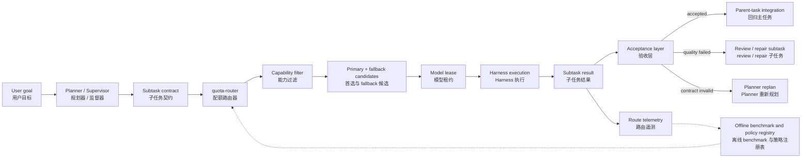
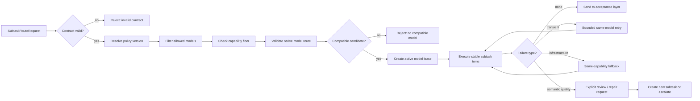
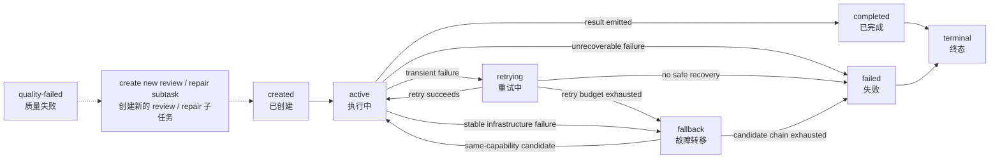
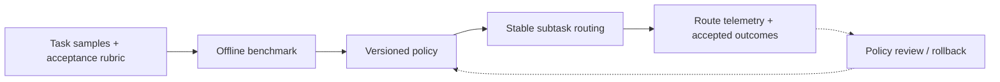
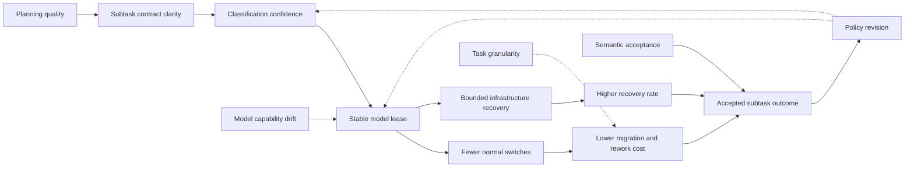

> **Version: 0.6 (preprint).** This is an engineering theory and design review, not a report of a controlled user experiment. It distinguishes a complete theoretical Agent scheduler from the engineering boundary of `dsh-quota-router`: the Planner decomposes work, quota-router selects a model for an already-defined subtask and performs bounded fallback, and the upper layer handles context regression, acceptance, and replanning. Context compression is treated as a related boundary and will be developed separately.

## Abstract

When an Agent task combines research, coding, writing, and review, the central scheduling question is not always which model should handle the next turn. It may be whether the task was decomposed at the beginning into subtasks with clear boundaries, acceptance conditions, and handoff contracts. Once a subtask exists, model switching should not be an ordinary per-turn optimization; it should primarily serve controlled retry and fallback.

This paper proposes a layered working hypothesis: **the Planner decomposes the task into subtasks; the model router selects an execution model from the subtask's task class, complexity, precision requirement, and available model set; a subtask normally keeps a stable model lease; and an upper-layer acceptance component decides whether the result is acceptable or requires review or replanning.** Benchmarks should form a task-class—capability-tier—candidate-model—fallback policy offline rather than running inside every request. At the same time, recent Agent-routing work is expanding toward trajectory-aware and step-level dynamic routing. “Stable” therefore means a default lease boundary under a contract, not a ban on structured escalation or dynamic switching.

The complete theory still involves task decomposition, context regression, multiple Harnesses, and quality acceptance, but these responsibilities do not all belong inside `dsh-quota-router`. The engineering slice is:

```text
SubtaskSpec
  → capability / policy classification
  → ordered model candidates
  → subtask-stable model lease
  → bounded retry / fallback
  → route telemetry
```

The central claim is therefore not that a router should plan everything. It is that planning happens before routing, model selection happens at the subtask boundary, and model switching is constrained by the subtask contract and fallback policy.

**Keywords:** task decomposition; model scheduling; subtask routing; RouteLease; Harness; Agent orchestration; quota routing; failover; observability; cost-quality trade-off

## 0. Research position and evidence boundary

This is an engineering theory and design review. It does not report a new controlled user experiment, model leaderboard, or production gain. Its material comes from public work on task planning, Agent orchestration, model routing, and context; the local engineering and test boundary of `dsh-quota-router`; and falsifiable engineering hypotheses about multi-model execution.

The paper separates three kinds of evidence:

| Evidence    | Can support                                                     | Cannot support                                     |
| ----------- | --------------------------------------------------------------- | -------------------------------------------------- |
| Theoretical | A plausible mechanism or explanation                            | Effectiveness on every task                        |
| Design      | A boundary can be represented by interfaces, state, and events  | Users will necessarily be faster or happier        |
| Behavioral  | A difference was observed under defined experimental conditions | Generalization from one team to every organization |

The paper therefore uses “propose,” “suggest,” “testable,” and “may reduce.” Diagrams, formulas, and local implementation details are not presented as experimental results. The formulas describe constraints and cost structures rather than fitted empirical equations; the research-model diagrams are proposed mechanisms, not causal estimates.

### 0.1 Contributions and non-contributions

The contributions are:

1. Turning “decompose first, schedule second, stay stable within a subtask” into task contracts, model leases, acceptance events, and state invariants;
2. Assigning Planner quality, classification errors, semantic failures, over-decomposition, and capability drift to their proper system layers instead of pushing them all into quota-router;
3. Proposing benchmark and telemetry designs that distinguish routing gains, infrastructure recovery, and semantic quality.

This paper does not contribute a new model, routing-learning algorithm, context-compression algorithm, or cross-Harness state-transfer protocol. It does not claim to have proved that a fixed model is better than a dynamic model. The testable claim is: **when subtask boundaries, acceptance conditions, and structured handoff information are clear, does plan-first plus subtask-stable routing produce lower context-migration cost and rework than per-turn switching?**

## 1. Research question: does scheduling happen too late?

### 1.1 Define the task before selecting the model

A long task usually includes understanding the goal, gathering material, editing files, running tools, verifying results, handling exceptions, and reporting back. These activities differ in model capability, tool permission, context length, failure cost, and acceptance criteria.

The complete system should normalize and decompose the task before handing a concrete `SubtaskSpec` to the model router:

```text
User goal
  ↓
Planner / Supervisor: normalize and decompose
  ↓
SubtaskSpec: class, complexity, precision, capabilities, acceptance
  ↓
quota-router: choose primary and fallback
  ↓
Harness: execute one subtask
  ↓
Acceptance layer: accept, review, repair, or replan
```

This separates two problems:

1. **Task compilation:** which subtasks exist, what their dependencies are, and how they hand off results;
2. **Model routing:** which model satisfies the lower-bound capability requirements of an already-defined subtask.

The first belongs to the Planner or orchestration layer; the second is quota-router's core responsibility.

### 1.2 Core proposition

The paper addresses seven related questions: whether decomposition should precede dispatch; whether switching should be restricted after dispatch; how models differ from Harnesses; where context compression belongs; how a scheduler can demonstrate benefit; which compression state must cross this boundary; and whether quota-router is a request router, task scheduler, or policy layer between the two.

The provisional answer is:

> **First decompose the task into work units that can be accepted. Then choose a stable execution route for each unit. Switch only at explicit failure boundaries, and return structured results and evidence to the parent task.**

This does not mean “never switch models.” It makes switching an exception path and keeps planning separate from execution recovery.

## 2. Conceptual boundaries: model, Harness, task, and context

### 2.1 A model is not the whole executor

Here, a **model** is an LLM endpoint that generates the next judgment or action, including provider, model, and reasoning-effort parameters. A **Harness** is the external execution-control layer, including system prompts, tools and schemas, the agent loop, sessions, memory, files, browsers, terminals, sandboxes, retry, cancellation, approval, concurrency, timeouts, events, and parent-child agent relationships.

Thus `gpt-X + Harness-A` and `gpt-X + Harness-B` are different executors. One may have a terminal and file writes while the other has only search; one may preserve the complete tool history while the other injects summaries; one may run its own loop while the other is advanced by an external state machine. Comparing model names while ignoring Harness differences confuses environment effects with model capability.

### 2.2 A task is not a turn, and a turn is not a request

| Level     | Definition                                                              | Scheduling meaning                                               |
| --------- | ----------------------------------------------------------------------- | ---------------------------------------------------------------- |
| `task`    | The user's overall goal                                                 | Unit for quality, cost, and final acceptance                     |
| `subtask` | A work unit that can be described, executed, and accepted independently | Main unit for a route lease and context boundary                 |
| `turn`    | One round of Agent behavior inside a Harness                            | Current implementation boundary for model selection and recovery |
| `request` | One LLM request sent to a provider                                      | Lowest-level unit for usage, retries, and HTTP errors            |

The current `dsh-quota-router` stores profile, candidate index, and selection at the `turn` level. For long tasks, the identity that should be locked is closer to `task/subtask`: repeated keyword matching can change a profile when new words appear, and replanning after every failure can confuse recovery with decomposition.

### 2.3 Context is part of the route

An executable context package contains more than recent messages:

```text
context envelope =
  system contract
  + task contract
  + plan slice
  + durable facts
  + evidence references
  + working memory
  + tool state
  + prior outputs
  + compression lineage
```

When a model changes, copying only the raw conversation produces a text history, not a resumable execution state. Task contracts, tool state, verified facts, and failure causes must be represented explicitly.

## 3. Why decomposition may matter more than switching during execution

### 3.1 Decomposition determines the information structure

Decomposition decides which work can be parallel, which results are facts or hypotheses, which tools have side effects, which subtasks need long context, which steps require a strong model or reliable Harness, which steps can use a cheaper model, and what counts as completion or escalation.

Under a valid contract and controlled coordination cost, decomposition can reduce the set of feasible next actions:

$$
|\mathcal{A}_{\mathrm{after\ plan}}|
\leq
|\mathcal{A}_{\mathrm{before\ plan}}|
$$

Here $\mathcal{A}$ is the set of feasible candidate actions in the current state. This is an explanatory condition, not an empirical law. If decomposition adds too much handoff, coordination, or rework state, the overall execution space and cost may grow instead.

```text
Whole task
  ↓ compile
Subtask role + dependency + acceptance contract
  ↓
Smaller candidate space + clearer context boundary + explicit checkpoints
```

### 3.2 The real cost of switching

Switching model or Harness during a subtask can introduce cold-start cost, context-projection cost, semantic drift, tool-contract cost, verification cost, and attribution cost. A cheaper call may therefore increase task-level cost. Coding, research, browser operations, and multi-step file changes often keep state in files, tools, processes, events, and implicit working memory rather than in one transcript.

### 3.3 Parent task—subtask—regression

The proposed execution model sends a planned subtask to a separate route and returns a structured result rather than appending the entire child transcript:

```ts
type SubtaskResult = {
  subtaskId: string;
  status: 'accepted' | 'needs-replan' | 'failed';
  summary: string;
  facts: Array<{ claim: string; evidenceRef?: string }>;
  artifacts: Array<{ kind: string; ref: string; checksum?: string }>;
  decisions: string[];
  unresolved: string[];
  nextContract?: string;
  route: { model: string; harness: string; contextVersion: string };
};
```

The parent should receive status, conclusions, evidence, artifact references, unresolved questions, and the next contract. It can retrieve details through `evidenceRef` when necessary. This keeps specialized child work from polluting the parent context, preserves parent ownership of the overall acceptance decision, and separates child-route telemetry from parent-route telemetry. Context regression should therefore be a state protocol, not a free-form summary.

### 3.4 Stability is not an absolute rule

Switches can be classified as:

| Type                         | Allowed?  | Example                                                  | Requirement                                               |
| ---------------------------- | --------- | -------------------------------------------------------- | --------------------------------------------------------- |
| Same-route retry             | Yes       | Temporary timeout or occasional 5xx                      | Preserve the contract and plan                            |
| Same-role failover           | Yes       | Quota exhaustion or provider outage                      | Preserve subtask identity and transfer a context envelope |
| Role or Harness reassignment | Carefully | Tool environment is unsupported or the plan is falsified | Record the override and re-accept the boundary            |

The engineering form is:

> **Once a subtask receives a route lease, `model + harness + context policy` remain stable by default. Only a pre-defined failure class or an explicitly approved replan may change them.**

## 4. A minimal layered design

### 4.1 Complete system and quota-router boundary



The diagram expresses responsibility and state boundaries, not a claim that every module already exists. Planner/Supervisor owns task structure; quota-router owns capability-constrained leases; Harness owns execution; Acceptance owns semantic quality. The dashed feedback is offline policy governance, not runtime online learning.

### 4.2 Minimal `SubtaskRouteRequest`

```ts
type SubtaskRouteRequest = {
  taskId: string;
  subtaskId: string;
  taskClass:
    'default' | 'simple' | 'coding' | 'planning' | 'analysis' | 'research' | 'writing' | 'review';
  complexity: 'low' | 'medium' | 'high';
  precision: 'normal' | 'high' | 'critical';
  allowedModels?: string[];
  preferredModel?: string;
  fallbackMode?: 'auto' | 'manual' | 'none';
  policyVersion?: string;
};
```

The priority is explicit `preferredModel` or `allowedModels`, then Planner classification, then router policy, then the default model. If `allowedModels` is absent, treat $A$ as all authorized models. If the policy and allowed set have no intersection, return `no-compatible-model` rather than silently selecting an unauthorized model:

$$
C_{\mathrm{eligible}} = A \cap P(\pi) \cap K(\kappa) \cap V
$$

Here $P(\pi)$ is the ordered policy candidate set, $K(\kappa)$ is the set satisfying capability contract $\kappa$, and $V$ is the currently available set that passes native provider/model validation. The formula defines a filtering boundary, not a classifier that infers capability from model names.

### 4.3 From task class to candidate models

Use a four-step mapping rather than binding a task class directly to one model:

```text
taskClass + complexity + precision
  → capability profile
  → ordered model candidates
  → eligible candidates
  → primary + fallback chain
```

An initial capability scale can be `economy`, `balanced`, `strong`, and `critical`. Benchmarking should form a versioned policy offline; runtime only executes the policy. A strategy example is:

| Type                          | Primary                              | Automatic fallback          | Meaning                   |
| ----------------------------- | ------------------------------------ | --------------------------- | ------------------------- |
| Default                       | `opencode-go/mimo-v2.5`              | Default chain               | Conservative entry point  |
| Simple task                   | `opencode/mimo-v2.5-free`            | `token-share/gpt-5.4-mini`  | Economy, cost first       |
| Ordinary coding               | `opencode-go/mimo-v2.5`              | `token-share/gpt-5.6-luna`  | Balanced                  |
| Planning/analysis             | `opencode-go/deepseek-v4-flash/high` | `token-share/gpt-5.6-luna`  | Balanced reasoning        |
| Deep research/critical review | `token-share/gpt-5.6-terra`          | None automatically          | Protect the quality floor |
| Documentation/writing         | `opencode-go/deepseek-v4-flash`      | `token-share/gpt-5.6-luna`  | Writing                   |
| Difficult coding              | `opencode-go/mimo-v2.5`              | `token-share/gpt-5.6-terra` | Escalate after failure    |

Model names should not encode capability by convention. The policy or capability directory must declare the tier and the allowed fallback relation.

The routing process has four explicit stopping boundaries: reject an incomplete contract; do not cross the capability floor; use bounded recovery only for infrastructure failures; and send semantic-quality failures to the acceptance layer.



### 4.4 Stable subtask lease and bounded fallback

After a primary model is selected, later turns inherit it by default. A switch is permitted only for a predefined boundary:

```text
same-model retry: transient infrastructure failure
same-subtask fallback: current model unavailable and next model meets the same floor
review / repair: upper layer creates a new subtask
replan: upper layer changes the plan or contract
```

```ts
type SubtaskModelLease = {
  taskId: string;
  subtaskId: string;
  policyId: string;
  selectedModel: string;
  fallbackModels: string[];
  fallbackIndex: number;
  status: 'active' | 'fallback' | 'completed' | 'failed';
  lockedAt: string;
};
```



`completed` and `failed` are terminal. A terminal lease cannot be silently resumed or have its contract changed. A semantic quality failure creates a new review, repair, or escalation subtask; it does not advance the old lease.

### 4.5 Router does not judge semantic quality

```text
infrastructure failure → router retry/fallback
semantic quality failure → upper-layer review/repair
plan or contract invalid → Planner replan
```

The router may record `accepted`, `quality-failed`, and `needs-replan` when the upper layer sends them back, but it does not create those judgments.

### 4.6 Five risks and their extension points

Planner quality determines whether routing input is trustworthy; model stickiness determines whether a wrong classification persists; semantic acceptance determines whether a normal response is actually complete; task granularity determines whether decomposition benefits exceed handoff cost; and capability drift determines whether the policy remains valid.

The router can add contract validation, capability floors, confidence metadata, leases, escalation interfaces, policy versions, and telemetry. The upper layer or later research must own plan validation, granularity optimization, semantic acceptance, context compression, and capability benchmarks.

The resulting invariants are:

```text
incomplete contract → do not route
uncertain classification → do not silently route with false confidence
infrastructure failure → bounded recovery
semantic failure → explicit upper-layer handling
policy change → versioned and replayable
```

### 4.7 Four objects and six invariants

The minimal theory consists of `SubtaskSpec`, versioned `RoutePolicy`, `ModelLease`, and upper-layer `RouteOutcome`:

```text
SubtaskSpec
  → RoutePolicy
  → ModelLease
  → Harness execution
  → RouteOutcome
```

The six invariants are: model choice occurs at the subtask boundary; a lease preserves the task contract; fallback cannot cross the capability floor; availability and semantic acceptance are separate; routing decisions are replayable; and decomposition is a reversible optimization rather than a truth that every task must be split.

> **Minimal definition:** quota-router is a policy layer that selects and maintains a model execution lease under a defined subtask contract and capability constraints. It keeps normal execution stable, permits bounded infrastructure recovery, accepts upper-layer outcomes for measurement and governance, and does not silently absorb semantic judgment, replanning, or context orchestration.

## 5. Multiple models and Harnesses: the difference is state migration

| Combination                          | Main change                        | Benefit                           | Risk                                         |
| ------------------------------------ | ---------------------------------- | --------------------------------- | -------------------------------------------- |
| One model + one Harness              | Parameter and quota governance     | Simple and easy to attribute      | Limited capability and resources             |
| Multiple models + one Harness        | Model changes within one protocol  | Practical fallback and cost tiers | Different tool styles and context windows    |
| One model + multiple Harnesses       | Different tools, loops, and memory | Different execution abilities     | Hidden state and permission changes          |
| Multiple models + multiple Harnesses | Both dimensions can change         | Broadest coverage                 | Highest migration and attribution complexity |

`dsh-quota-router` currently belongs mainly to the second category: within the DSH Harness it selects provider/model candidates and performs source-chain fallback. It should not automatically combine model switching with Harness switching until a stable Harness capability directory and context adapter exist.

Changing models within one Harness can usually reuse the context envelope, but still requires validation of context window, tokenizer, reasoning effort, tool-call format, and provider accounting. Changing the Harness requires a capability manifest:

```ts
type HarnessCapabilityManifest = {
  id: string;
  version: string;
  tools: Array<{ name: string; schemaHash: string; sideEffects: string[] }>;
  contextFormat: string;
  supports: { streaming: boolean; approval: boolean; resume: boolean };
  stateExport: string[];
};
```

If the target Harness cannot recover file state, tool state, approval state, or parent-child relationships, it should not be switched automatically. Create a review subtask and treat the old result as evidence instead of pretending to resume seamlessly.

## 6. Context boundary: compression is related, not quota-router's ownership

Compression may use structured summaries, retrieval, folded tool results, semantic compression, or checkpoint reconstruction. Simple truncation is cheap but can remove negations, failure causes, and evidence provenance. For code and research, the compressed context must preserve why a path was rejected and what supports a conclusion.

Compression should be a versioned artifact:

```text
raw events / transcript
  ↓ compressor(version, policy, budget)
context artifact
  ├─ retained facts
  ├─ dropped spans
  ├─ evidence refs
  ├─ unresolved questions
  ├─ source checksum
  └─ quality/sample score
```

Routing-before compression, routing-after compression, and switch-time compression have different contracts. The last one should create an explicit recovery contract rather than assume that a new model can infer state from a transcript. `dsh-quota-router` not rewriting DSH history and leaving compaction to DSH is a reasonable ownership boundary. The missing integration is shared metadata such as `taskId`, `subtaskId`, `contextVersion`, `compressionId`, and `routeDecision`, not a second compaction engine inside the router.

## 7. Industry and comparison points

Agent workflow research emphasizes choosing a control flow—prompt chaining, routing, parallelization, orchestrator-workers, or evaluator-optimizer—before choosing individual model calls. Gateway routers such as LiteLLM Router, OpenRouter Provider Routing, and Portkey focus on provider availability, price, latency, retries, and fallback. Quality-cost routers such as RouteLLM treat routing as a data-driven model-selection problem. Context-engineering work such as LLMLingua and Lost in the Middle shows that token reduction and effective context use are separate concerns.

These systems solve different segments:

| System type              | Decision unit        | Main goal                             | Understands task graph? | Typical switch           |
| ------------------------ | -------------------- | ------------------------------------- | ----------------------- | ------------------------ |
| Provider/gateway router  | request              | Availability, price, latency          | Usually no              | Endpoint fallback        |
| Model quality router     | request              | Quality-cost trade-off                | Usually no              | Strong/weak model choice |
| Workflow/orchestrator    | task/subtask         | Complete a task                       | Yes                     | Node dispatch            |
| Multi-Agent framework    | agent/node           | Division and collaboration            | Yes                     | Handoff/manager          |
| DSH model-router         | turn/rule            | Deterministic selection               | Limited                 | Rule-triggered switch    |
| Current dsh-quota-router | turn/profile/source  | Quota, fallback, attribution          | Not complete            | Same-profile fallback    |
| Target dsh-quota-router  | subtask/policy/lease | Capability match and bounded recovery | Upper layer provides it | Same-capability fallback |

Recent routing benchmarks and Agent orchestration work also show that trajectory-level and step-level dynamic routing are legitimate research directions. The conclusion is not that switching is bad. It is that switching needs a contract, capability evidence, failure signal, and acceptance boundary. A lease is a default execution and attribution boundary, not a prohibition on explicit escalation.

## 8. The minimal engineering slice of `dsh-quota-router`

The router should solve task-class routing, candidate constraints, subtask stability, bounded infrastructure recovery, and explainable telemetry. It should not solve Planner decomposition, DAG execution, parent-child context merging, context compression, cross-Harness migration, semantic judging, automatic replanning, Receipt/Ledger, or end-to-end business accounting.

The current profile, candidate chain, native-model validation, transient/stable error classification, cooldown, ordered fallback, and usage ledger can remain. The abstraction should evolve from:

```text
keyword/profile → turn routing
```

to:

```text
SubtaskSpec → policy profile → candidate chain → stable subtask lease
```

The current implementation has verified profile identity, candidate fallback, cooldown, native model validation, and a usage ledger. It does not yet provide `SubtaskRouteRequest`, `SubtaskModelLease`, `RouteOutcome`, or an independent acceptance layer. Those are migration targets and research design, not delivered plugin capabilities. Likewise, local token-share measurements are short black-box transport/latency observations, not model capability rankings or router benefit evidence.

The proposed evolution is:

1. v0.2: explicit task class, complexity, precision, allowed models, and versioned policies;
2. v0.3: `taskId/subtaskId` and a stable subtask lease;
3. v0.4: primary/retry/fallback/recovery/outcome telemetry and replay;
4. v0.5: separate retry, same-capability fallback, semantic repair, and replan, while recognizing dynamic routing as a complementary research direction.

Planner, context compression, cross-Harness migration, Receipt/Ledger, and automatic replanning remain out of scope.

## 9. Measuring scheduler benefit

The router can measure whether routing followed policy, whether fallback recovered an execution, and the resource and latency profile of each policy. End-to-end quality requires upper-layer acceptance events.

Useful metrics include `primary_selection_rate`, `primary_success_rate`, `retry_rate`, `fallback_rate`, `fallback_recovery_rate`, `no_compatible_model_rate`, `model_usage`, `policy_distribution`, and—when an outcome is returned—`accepted_rate`.

$$
\mathrm{FRR} =
\frac{N_{\mathrm{fallback\ subtask\ succeeded}}}
{N_{\mathrm{fallback\ subtask}}}
$$

FRR means that execution recovered after fallback; it does not mean that semantic acceptance succeeded. To measure normal switching, use:

$$
\mathrm{Stability} = 1 -
\frac{N_{\mathrm{normal\ model\ switches}}}
{N_{\mathrm{eligible\ turn\ transitions}}}
$$

`eligible turn transitions` counts adjacent transitions within one subtask where model comparison is permitted. Legitimate failure fallback is not normal re-selection. Single-turn subtasks have no transition and should be excluded from this denominator.

Benchmark governance can be represented as:

$$
\mathcal{B}_{v_b}
\xrightarrow{\text{task samples + acceptance rubric}}
\mathcal{P}_{v_p}
\xrightarrow{\text{runtime telemetry}}
\mathcal{O}
\xrightarrow{\text{offline review}}
\mathcal{P}_{v_p+1}
$$

This is a governance loop, not runtime online learning. A policy whose primary frequently falls back in real tasks should be reviewed rather than hidden by unlimited dynamic switching.



Because resource, latency, handoff, and rework have different units, normalize them against fixed baselines or budgets before combining them:

$$
J = \alpha C_{\mathrm{resource}}
  + \beta C_{\mathrm{latency}}
  + \gamma C_{\mathrm{handoff}}
  + \delta C_{\mathrm{rework}}
$$

$$
J_{\mathrm{per\ accepted}} =
\frac{J}{N_{\mathrm{accepted}}}
$$

The weights must be fixed before the experiment. Without a paired baseline and explicit acceptance rubric, using a cheaper model is not itself evidence of benefit.

## 10. Event model

The router should record decisions, not complete reasoning traces:

```text
route-requested
route-selected
route-retried
route-fallback
route-completed
route-failed
outcome-linked (optional)
```

```ts
type RouteTelemetry = {
  eventId: string;
  at: string;
  taskId?: string;
  subtaskId?: string;
  turnId?: string | number;
  policyId?: string;
  policyVersion?: string;
  taskClass?: string;
  complexity?: 'low' | 'medium' | 'high';
  precision?: 'normal' | 'high' | 'critical';
  model?: string;
  candidateIndex?: number;
  transition?: 'initial' | 'retry' | 'fallback' | 'complete' | 'failed';
  reason?: string;
  failureCode?: string;
  inputTokens?: number;
  outputTokens?: number;
  latencyMs?: number;
  outcome?: 'accepted' | 'quality-failed' | 'needs-replan' | 'failed';
};
```

Prompt text, full reasoning, and complete tool traces should not be recorded by default. The model needs structured subtask results; the router needs structured routing events.

## 11. Falsifiable hypotheses and experiment design

The paper proposes, rather than proves, the following hypotheses:

- **H1:** For medium and long tasks, planned subtasks with stable model leases have fewer normal switches and less rework than per-turn routing.
- **H2:** Task class, complexity, and precision form a more stable policy than per-turn keyword matching.
- **H3:** A fallback chain that preserves the capability floor recovers more reliably than unconstrained model changes.
- **H4:** Preventing automatic downgrade for critical tasks may reduce availability but reduce low-quality results being counted as success.
- **H5:** Policy version, fallback reason, and outcome linkage are required to distinguish routing benefit from task difficulty.
- **H6:** Contract validation reduces invalid routing caused by missing output, acceptance, or handoff definitions.
- **H7:** Conservative or ambiguous handling of low-confidence classifications reduces expensive “stable but wrong” selections.
- **H8:** Accepted subtasks are a better benefit unit than successful model requests.
- **H9:** Decomposition has a nonlinear relationship with end-to-end cost; over-decomposition eventually increases cost and rework.
- **H10:** A versioned benchmark-policy-outcome loop detects capability drift earlier than a static policy table.

The key experimental comparison is fixed default model versus per-turn dynamic routing versus subtask-stable plan-pinned routing. Task families should include closed tasks, coding, research, and writing; evaluation should use task-specific acceptance rubrics. Report accepted subtask rate, resource per accepted subtask, rework rate, context migration cost, infrastructure errors, and semantic failures. Keep task input, rubric, tool contract, and pairing/randomization conditions fixed, and distinguish task, subtask, turn, and request denominators.



## 12. Conclusion

The complete theory is:

```text
Planner decomposes the task
  → define subtask class, complexity, precision, and acceptance
  → router selects a capability-compatible model
  → keep the model stable within the subtask
  → apply bounded retry / fallback on infrastructure failure
  → upper layer integrates results, reviews, and replans
```

`dsh-quota-router` is not a Planner or complete Supervisor. It is a **capability-constrained model router for already-decomposed subtasks**:

```text
SubtaskSpec
  → taskClass / complexity / precision
  → capability policy
  → ordered model candidates
  → model lease
  → bounded fallback
  → route telemetry
```

Its value is not guessing a new model on every turn. It turns one explicit subtask choice into an explainable, reusable, measurable policy while protecting continuity during execution.

> **Engineering judgment:** task decomposition determines the input structure for model selection; quota-router should perform stable, explainable, bounded model routing on that structure.

## References and engineering points of comparison

The following sources establish concepts and comparison coordinates. No single product's public positioning is treated as an experimental result. Access date: 2026-08-19.

1. Wang et al., [Plan-and-Solve Prompting: Improving Zero-Shot Chain-of-Thought Reasoning by Large Language Models](https://arxiv.org/abs/2305.04091).
2. Yao et al., [Tree of Thoughts: Deliberate Problem Solving with Large Language Models](https://arxiv.org/abs/2305.10601).
3. Yao et al., [ReAct: Synergizing Reasoning and Acting in Language Models](https://arxiv.org/abs/2210.03629).
4. Anthropic, [Building effective agents](https://www.anthropic.com/research/building-effective-agents).
5. OpenAI, [Agents SDK: Handoffs](https://openai.github.io/openai-agents-python/handoffs/) and [Tracing](https://openai.github.io/openai-agents-python/tracing/).
6. LangChain, [Subagents](https://docs.langchain.com/oss/python/langchain/multi-agent/subagents).
7. LangChain, [Router](https://docs.langchain.com/oss/python/langchain/multi-agent/router).
8. Liu et al., [AgentBench: Evaluating LLMs as Agents](https://arxiv.org/abs/2308.03688).
9. RouteLLM Authors, [RouteLLM: Learning to Route LLMs with Preference Data](https://arxiv.org/abs/2406.18665).
10. AWS, [Intelligent Prompt Routing](https://docs.aws.amazon.com/bedrock/latest/userguide/intelligent-prompt-routing.html).
11. LiteLLM, [Router](https://docs.litellm.ai/docs/routing).
12. OpenRouter, [Provider Routing](https://openrouter.ai/docs/guides/routing/provider-routing).
13. Portkey, [Load Balancing](https://portkey.ai/docs/product/ai-gateway/load-balancing).
14. Jiang et al., [LLMLingua: Compressing Prompts for Accelerated Inference of Large Language Models](https://arxiv.org/abs/2310.05736).
15. Jiang et al., [LongLLMLingua: Accelerating and Enhancing Long-Context LLMs with Question-Aware Compression](https://arxiv.org/abs/2310.06839).
16. Liu et al., [Lost in the Middle: How Language Models Use Long Contexts](https://arxiv.org/abs/2307.03172).
17. Local engineering reference: `dsh-quota-router` requirements, strategy, source, ledger, and tests, together with `dsh-model-router` architecture and configuration documentation.
18. Li et al. (2026), [LLMRouterBench: A Massive Benchmark and Unified Framework for LLM Routing](https://aclanthology.org/2026.findings-acl.1881/).
19. Yang et al. (2026), [TwinRouterBench: Fast Static and Live Dynamic Evaluation for Realistic Agentic LLM Routing](https://arxiv.org/abs/2605.18859).
20. AWS, [Implement task-appropriate model selection strategies](https://docs.aws.amazon.com/wellarchitected/latest/agentic-ai-lens/agentperf02-bp02.html).
21. Chen et al. (2026), [OrchestraBench: Evaluating Multi-Agent Orchestration Failure Modes, Recovery, and Decomposition Quality](https://arxiv.org/abs/2608.05263).
22. [AgentRouter: Heterogeneous Model Routing for Cost-Optimal Multi-Step Agentic Workflows](https://openreview.net/pdf?id=nu3GPfkyJV).
