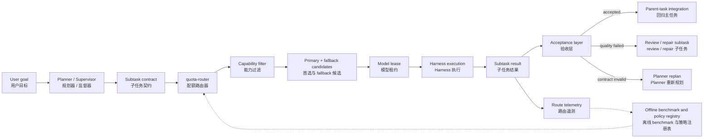
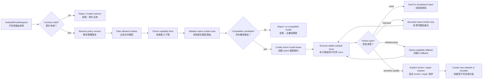
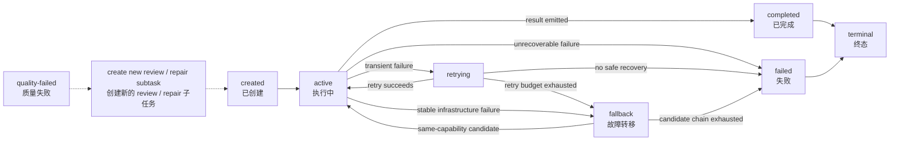
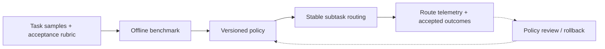
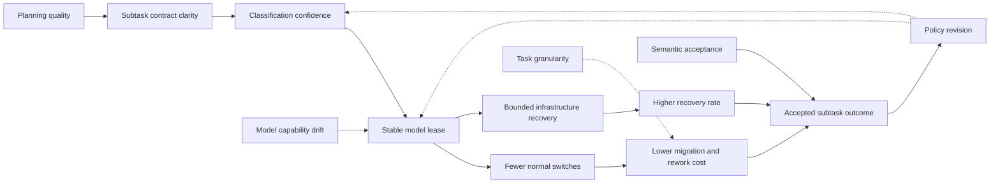

> **版本：preprint v0.6。** 这是一篇面向工程设计的研究综述，不报告新的受控用户实验。本文讨论完整的 Agent 调度问题，但明确区分“理论上的完整调度系统”和 `dsh-quota-router` 的工程边界：Planner 负责拆解，quota-router 负责为已拆分的 subtask 选择模型并执行有界 fallback，上层负责上下文回归、验收和 replan。上下文压缩只作为相关边界，完整方法另行展开。

## 摘要

当一个 Agent 任务包含研究、编码、写作和审查等不同工作时，最重要的调度问题不一定是每一轮调用哪个模型，而是任务开始时是否已经被拆成了边界清晰、可验收、可交接的子任务。子任务一旦确定，模型切换就不应成为普通的即时优化动作，而应主要用于受控的 retry 和 fallback。

本文提出一个分层工作假设：**Planner 负责把任务拆成 subtask；模型路由器负责根据 subtask 的任务类型、复杂度、精度要求和可用模型范围选择执行模型；一个 subtask 内默认保持模型稳定；上层验收器负责判断结果是否可接受，以及是否需要 review 或 replan。** Benchmark 不在每次请求时现场运行，而是用于离线形成“任务类型—能力档位—候选模型—fallback 链”的策略。本文同时承认近期 Agent routing 研究正在向 trajectory-aware 和 step-level dynamic routing 扩展，因此“模型稳定”被定义为契约条件下的默认 lease 边界，而不是禁止结构化升级或动态切换。

本文讨论的完整理论仍涉及任务拆解、上下文回归、多 Harness 和质量验收，但不把这些职责全部归入 `dsh-quota-router`。本文将 quota-router 收缩为一个工程切片：

```text
SubtaskSpec
  → capability / policy classification
  → ordered model candidates
  → subtask-stable model lease
  → bounded retry / fallback
  → route telemetry
```

因此，本文的核心命题不是“路由器应该自己规划一切”，而是：**任务规划发生在路由之前；模型选择发生在子任务边界；模型切换受到子任务契约和 fallback 策略约束。**

**关键词：** 任务拆解；模型调度；子任务路由；RouteLease；Harness；Agent 编排；配额路由；故障转移；可观测性；成本—质量权衡

## 0. 研究定位与证据边界

本文是一篇工程理论与设计综述，不报告新的受控用户实验、模型排行榜或线上收益结果。论证材料来自三类来源：公开的任务规划、Agent 编排、模型路由和上下文研究；本地 `dsh-quota-router` 的工程设计与测试边界；以及围绕多模型执行的可证伪工程假设。

本文把证据分为三层：

| 证据层   | 能支持的判断                       | 不能支持的判断               |
| -------- | ---------------------------------- | ---------------------------- |
| 理论证据 | 某种机制具有合理的解释路径         | 该机制在所有任务上有效       |
| 设计证据 | 某种边界可以被接口、状态和事件实现 | 用户一定因此更快或更满意     |
| 行为证据 | 在明确实验条件下观察到结果差异     | 将一个团队结果外推到所有组织 |

因此，本文使用“提出”“建议”“可检验”“可能降低”等表述，不把架构图、公式和本地工程实现误写成实验结果。文中的公式是约束和成本结构的形式化表达，不是已经拟合出的经验方程；科研模型图是待验证的机制图，不是因果结果图。

## 0.1 本文的贡献与非贡献

本文的贡献集中在三个方面：

1. 将“先拆解、后调度、子任务内稳定”写成可操作的任务契约、模型租约、验收事件和状态不变量；
2. 将 Planner 质量、分类错误、语义质量失败、过度拆分和模型能力漂移分别放回正确的系统层，而不是全部塞进 quota-router；
3. 提出一套可以区分路由收益、基础设施恢复和语义质量的 benchmark 与 telemetry 设计。

本文不贡献新的模型、路由学习算法、上下文压缩算法或跨 Harness 状态迁移协议，也不声称已经证明固定模型优于动态模型。真正待验证的命题是：**在子任务边界清晰、验收条件明确且交接信息可结构化时，plan-first + subtask-stable routing 是否比 per-turn switching 具有更低的上下文迁移成本和返工率。**

## 1. 研究问题：调度发生得太晚了吗？

### 1.1 从“选模型”转向“先定义任务，再选择模型”

一个长任务通常包含几种不同性质的工作：理解目标、收集资料、修改文件、运行工具、验证结果、处理异常、向用户汇报。它们对模型能力、工具权限、上下文长度、失败代价和验收标准的要求并不相同。

完整系统应该先完成任务规范化和拆解，再把一个明确的 `SubtaskSpec` 交给模型路由器：

```text
User goal
  ↓
Planner / Supervisor: normalize and decompose
  ↓
SubtaskSpec: class, complexity, precision, capabilities, acceptance
  ↓
quota-router: choose primary and fallback
  ↓
Harness: execute one subtask
  ↓
Acceptance layer: accept, review, repair, or replan
```

这里需要区分两个问题：

1. **任务编译问题**：这个任务应该拆成哪些子任务、依赖是什么、如何交接；
2. **模型路由问题**：已经确定的这个子任务，应该交给哪个满足能力下限的模型。

前者属于 Planner 或 Agent 编排层，后者才是 quota-router 的核心。这样既保留了“先拆解、后调度”的理论，也避免把 quota-router 变成一个完整的任务编译器。

### 1.2 本文的核心命题

本文讨论七个相互关联的问题：

1. **任务拆解是否应先于模型派发？** 什么信息必须在第一轮确定？
2. **派发后是否应禁止模型切换？** 哪些切换属于合法故障转移，哪些切换会破坏任务连续性？
3. **模型和 Harness 的差异是什么？** 同一个模型换 Harness、同一个 Harness 换模型，会分别损失什么？
4. **上下文压缩应放在哪里？** 压缩是否会改变路由判断、子任务契约和结果可验证性？
5. **调度器如何证明收益？** 只统计 token 和价格，为什么不足以说明调度有效？
6. **上下文压缩在这一层的边界是什么？** 哪些状态必须回传，哪些压缩工作应留给宿主？
7. **quota-router 应该承担哪一层？** 它是请求级路由器、任务级调度器，还是二者之间的策略层？

本文给出的暂时答案是：

> **先把任务拆成可以验收的工作单元，再为工作单元选择稳定的执行路由；执行中只在明确定义的故障边界上切换；子任务完成后，把结构化结果和证据回归主任务链路。**

这不是“永远不切换模型”，而是把模型切换从默认行为降级为异常处理，并将任务规划和执行恢复分开。

## 2. 概念边界：模型、Harness、任务、上下文

### 2.1 模型不是执行者的全部

本文把**模型**定义为负责生成下一步判断或动作的 LLM endpoint，包括 provider、model、reasoning effort 等参数。它决定推理风格、工具调用倾向、输出能力、上下文窗口和成本，但不单独决定任务如何执行。

把模型放进不同 Harness 后，执行行为可能完全不同。本文把 **Harness** 定义为模型外部的执行控制层，至少包括：

- system prompt 和角色约束；
- 工具注册、工具 schema、工具结果格式；
- agent loop：一次调用、循环调用、计划—执行—检查，还是 evaluator—optimizer；
- 会话、记忆、文件系统、浏览器、终端和沙箱；
- 重试、取消、审批、并发、超时和事件协议；
- 子代理创建方式、父子会话关系和结果回传方式。

所以，`gpt-X + Harness-A` 与 `gpt-X + Harness-B` 不是同一个执行器。前者可能拥有终端和文件读写，后者可能只有搜索工具；前者把工具结果加入完整历史，后者只给模型一个摘要；前者允许模型自行循环，后者要求外部状态机推进。只比较模型名而忽略 Harness，会把环境差异误认为模型能力差异。

### 2.2 任务不是 turn，turn 也不是 request

为调度和统计，至少需要区分四层身份：

| 层级      | 定义                             | 调度意义                           |
| --------- | -------------------------------- | ---------------------------------- |
| `task`    | 用户希望完成的整体目标           | 质量、成本和最终验收的统计单位     |
| `subtask` | 可独立描述、执行和验收的工作单元 | route lease 和上下文边界的主要单位 |
| `turn`    | Harness 中的一轮 agent 行为      | 当前实现可挂载模型选择和失败恢复   |
| `request` | 发给 provider 的一次 LLM 请求    | usage、重试和 HTTP 错误的底层单位  |

`dsh-quota-router` 当前已经在 `turn` 级保存 profile、candidate index 和 selection，这解决了“同一个主模型对应不同 fallback”这一类身份丢失问题。但对于长任务，真正需要锁定的身份可能是 `task/subtask`：如果每一轮都重新关键词匹配，调度器可能在同一任务中因为新出现的词而改变 profile；如果每次失败都重新规划，模型也可能把故障恢复误当成任务重拆解。

### 2.3 上下文是 route 的一部分

上下文不只是“最近几条消息”。一个可执行的上下文包至少包含：

```text
context envelope =
  system contract
  + task contract
  + plan slice
  + durable facts
  + evidence references
  + working memory
  + tool state
  + prior outputs
  + compression lineage
```

同样的用户文本，放在不同 Harness 的上下文包里可能有不同含义。模型切换时，如果只复制原始对话，而不复制任务契约、工具状态、已验证事实和失败原因，新模型得到的是“文字历史”，不是“可继续执行的状态”。因此，模型调度和上下文压缩不能完全分开设计。

## 3. 为什么“开始时拆解”可能比“执行中切换”更重要

### 3.1 任务开始阶段决定了后续信息结构

任务拆解不是把一句话改写成几条待办，而是决定：

- 哪些工作可以并行，哪些必须串行；
- 哪些结果是事实，哪些只是候选假设；
- 哪些工具操作有副作用；
- 哪些子任务需要长上下文，哪些只需局部证据；
- 哪些步骤必须使用强模型或高可靠 Harness；
- 哪些步骤可以使用低价模型；
- 什么条件下算完成，什么条件下必须回退或升级。

一旦这些边界确定，后续模型选择就从“开放式搜索”变成“在一个已知工作单元内执行”。这会降低调度器的状态空间，也让失败恢复有清晰的接口。

可以把任务拆解看成一次缩小后续执行选择空间的编译。这里不把“整体任务”和“子任务描述”当成可以直接比较的随机变量，也不要求运行时估计真实熵；更稳妥的解释是：在拆解契约有效且协调成本受控时，后续每一步需要考虑的候选动作集合通常会缩小：

$$
|\mathcal{A}_{\mathrm{after\ plan}}|
\leq
|\mathcal{A}_{\mathrm{before\ plan}}|
$$

其中 $\mathcal{A}$ 表示在当前状态下仍然可行的候选动作集合。这个关系只是有前提的解释性框架，不是经验定律：如果拆解增加了交接、协调和返工状态，实际执行空间和总成本反而可能变大。拆解的价值在于把影响后续路由的变量显式化：

```text
Whole task
  ↓ compile
Subtask role + dependency + acceptance contract
  ↓
Smaller candidate space + clearer context boundary + explicit checkpoints
```

如果拆解没有减少不确定性，反而增加了交接和协调状态，那么它就没有产生足够的调度收益。

### 3.2 执行中切换的真实成本

在子任务执行中切换模型或 Harness，至少有六类成本：

1. **冷启动成本**：新模型需要重新理解任务和当前状态；
2. **上下文投影成本**：原 Harness 的隐含状态要变成新 Harness 可理解的显式输入；
3. **语义漂移成本**：新模型可能重新解释目标、优先级和完成标准；
4. **工具契约成本**：工具名、参数 schema、权限和返回格式可能不同；
5. **验证成本**：切换后需要确认之前的中间产物仍然可信；
6. **统计归因成本**：同一个任务的结果变成多条不可比较的模型调用，难以知道收益来自路由还是来自重试。

因此，动态切换有时节省了单次调用成本，却增加了任务级成本。尤其是编码、研究、浏览器操作和多步文件修改，任务状态通常不在一条对话文本里，而分散在文件、工具结果、进程、会话事件和模型的隐式工作记忆中。

### 3.3 用户提出的“主任务—子任务—回归”模型

本文采用一个更具体的执行模型来讨论 quota-router：主任务先形成任务计划，再把子任务派发给不同模型；子任务在自己的 route 上完成工作，最后以结构化结果回归主任务链路。这个模型是合理的，而且比“多个模型共享一个不断变化的会话”更容易保持边界和归因。

但“回归上下文”不应理解为把子模型的完整 transcript 原样拼回主链路。更可靠的回归对象应是一个 `SubtaskResult`：

```ts
type SubtaskResult = {
  subtaskId: string;
  status: 'accepted' | 'needs-replan' | 'failed';
  summary: string;
  facts: Array<{ claim: string; evidenceRef?: string }>;
  artifacts: Array<{ kind: string; ref: string; checksum?: string }>;
  decisions: string[];
  unresolved: string[];
  nextContract?: string;
  route: { model: string; harness: string; contextVersion: string };
};
```

主任务只接收完成状态、结论、证据、产物引用、未决问题和下一步契约；必要时再按 `evidenceRef` 拉取细节。这样做有三个好处：

- 子任务可以使用专门模型，但不会把它的内部推理和全部噪声污染主上下文；
- 主任务仍然掌握整体目标、依赖关系和最终验收，不会被子模型的局部目标接管；
- 上层可以把“子任务 route”与“主任务 route”分别记录；quota-router 只需要记录 subtask 的模型选择和 fallback，不把每次模型切换都当成一次新任务。

我对这个模型的判断是：**方向正确，但需要把“上下文回归”定义成状态协议，而不是自然语言摘要。** 子任务应该回归的是可验证的工作成果；主任务是否继续、接受、重试或重新拆分，则由 acceptance criteria 决定。只有当子任务结果不满足契约时，主任务才触发 replan，而不是因为每次请求都想换一个更强模型。

### 3.4 “不切换”不是绝对规则

本文建议把切换分成三类：

| 类型                  | 是否允许 | 例子                                | 要求                                                 |
| --------------------- | -------- | ----------------------------------- | ---------------------------------------------------- |
| 同路由重试            | 允许     | 短暂超时、偶发 5xx                  | 不改变任务契约，不产生新计划                         |
| 同角色故障转移        | 允许     | 配额耗尽、鉴权失败、provider 不可用 | 保留 subtask identity，复制压缩后的 context envelope |
| 角色或 Harness 重派发 | 谨慎允许 | 原工具环境不支持、计划本身被证伪    | 必须记录 override 原因，重新验收任务边界             |

“派发的时候模型就不要再切换了”的工程化表达，应该是：

> **一个 subtask 获得 route lease 后，默认保持 `model + harness + context policy` 不变；只有符合预先定义的 failure class 或人工批准的 replan 才能改变。**

这比“禁止切换”更可实现，也比“每次请求都重新择优”更容易审计。

## 4. 从任务拆解到模型路由：一个最小分层设计

### 4.1 完整系统与 quota-router 的职责边界

完整的 Agent 系统可以包含多个层次，但 quota-router 不需要实现全部层次。图 1 用实线表示正常执行路径，用虚线表示反馈或离线治理路径：



**图 1。** 该架构表达的是责任和状态边界，而不是“所有模块都已经实现”。Planner / Supervisor 负责任务结构，quota-router 负责能力约束下的模型租约，Harness 负责执行，Acceptance layer 负责语义验收；虚线反馈用于离线策略治理，不表示运行时自动学习。

各组件的最小职责如下：

- **Planner / Supervisor**：定义目标、拆解任务、建立依赖和验收条件；
- **Subtask contract**：声明输入、输出、边界、工具权限、交接内容和完成条件；
- **quota-router**：过滤候选、选择 primary、建立 lease，并对基础设施失败执行有界恢复；
- **Capability filter**：检查候选是否满足能力下限和调用契约；
- **Harness**：负责 prompt、工具、循环、文件、事件和执行状态；
- **Acceptance layer**：判断结果是否满足语义质量和业务验收，不由 router 静默替代；
- **Route telemetry**：记录路由事实、失败、切换和 outcome 关联；
- **Offline benchmark and policy registry**：离线形成和版本化策略，不在每个请求现场跑 benchmark。

### 4.2 最小的 SubtaskRouteRequest

上层不需要把完整 transcript 交给 quota-router，而是传递最小的路由元数据：

```ts
type SubtaskRouteRequest = {
  taskId: string;
  subtaskId: string;
  taskClass:
    'default' | 'simple' | 'coding' | 'planning' | 'analysis' | 'research' | 'writing' | 'review';
  complexity: 'low' | 'medium' | 'high';
  precision: 'normal' | 'high' | 'critical';
  allowedModels?: string[];
  preferredModel?: string;
  fallbackMode?: 'auto' | 'manual' | 'none';
  policyVersion?: string;
};
```

这里的 `taskClass` 不是模型名称的别名，而是一个工作类别；`complexity` 描述任务难度，`precision` 描述质量下限和失败代价，`allowedModels` 则允许调用方缩小候选范围。

推荐的优先级是：

```text
显式 preferredModel / allowedModels
  > 上层 Planner 提供的分类
  > quota-router 默认策略
  > default model
```

如果策略候选与 `allowedModels` 没有交集，应返回 `no-compatible-model`，而不是静默使用未授权模型。更完整的候选集合可以写成：

$$
C_{\mathrm{eligible}} = A \cap P(\pi) \cap K(\kappa) \cap V
$$

其中：

- $A$ 是调用方声明的 `allowedModels`；如果未提供该字段，则 $A$ 表示全部已授权模型；
- $P(\pi)$ 是 `policyVersion = \pi` 产生的有序策略候选；
- $K(\kappa)$ 是满足能力契约 $\kappa$ 的候选集合；
- $V$ 是已经通过 provider/model 原生校验且当前可用的候选集合。

这个式子表达的是过滤边界，不是一个根据模型名称自动推断能力的分类器。只要交集为空，路由器就应停止并把缺口交给上层处理。

### 4.3 从任务类型到模型候选

不建议把策略写成“任务类型直接绑定一个模型”，而建议使用四步映射：

```text
taskClass + complexity + precision
  → capability profile
  → ordered model candidates
  → eligible candidates
  → primary + fallback chain
```

能力档位可以先保持简单：

```text
economy  ：低复杂度、低成本优先
balanced  ：常规任务的成本—能力平衡
strong    ：高复杂度或高精度任务
critical  ：关键研究、审查和不可轻易降级的任务
```

Benchmark 的职责是离线建立这张映射，而不是每个请求现场重新测试模型：

```text
benchmark
  → policyVersion
  → taskClass / complexity / precision 的候选链
```

运行时只执行策略，不把 benchmark 的推理逻辑嵌入路由器。策略是否有效，再通过真实任务的验收结果和路由统计验证。

路由决策可以被写成一个确定性的流程。图 2 的实线是正常路由和执行路径，虚线是只在基础设施失败时进入的恢复路径；语义质量失败不沿 fallback 链静默推进。



**图 2。** 该流程图强调四个停机边界：契约不完整时不路由；没有能力兼容候选时不越权；基础设施失败只进行有界恢复；语义质量失败交给验收层。图中没有表示自动 Planner、自动 Judge 或运行时在线学习。

### 4.4 模型策略示例

下面的策略只是一个可配置的初始版本，不是对模型能力的永久判断：

| 类型              | primary                              | 自动 fallback               | 策略含义                 |
| ----------------- | ------------------------------------ | --------------------------- | ------------------------ |
| 默认              | `opencode-go/mimo-v2.5`              | 按默认链                    | 没有明确分类时的保守入口 |
| 简单任务          | `opencode/mimo-v2.5-free`            | `token-share/gpt-5.4-mini`  | economy，成本优先        |
| 普通编码          | `opencode-go/mimo-v2.5`              | `token-share/gpt-5.6-luna`  | balanced                 |
| 普通规划/分析     | `opencode-go/deepseek-v4-flash/high` | `token-share/gpt-5.6-luna`  | balanced reasoning       |
| 深度研究/关键审查 | `token-share/gpt-5.6-terra`          | 不自动 fallback             | critical，保护质量下限   |
| 文档/普通写作     | `opencode-go/deepseek-v4-flash`      | `token-share/gpt-5.6-luna`  | writing                  |
| 高难编码          | `opencode-go/mimo-v2.5`              | `token-share/gpt-5.6-terra` | 失败后升级能力           |
| Claude 专项       | `starchasing/claude-sonnet-5`        | 手动选择                    | 不进入自动 fallback      |
| 最终灾备          | `starchasing/gpt-5.6-terra`          | 手动选择                    | 紧急路径                 |

这张表应存为策略配置，并通过 `policyVersion` 追踪。模型名称不应被 quota-router 用来推断能力；模型是否属于某个能力档位，应由配置或上层能力目录声明。

### 4.5 子任务内稳定与有界 fallback

一个 subtask 获得 primary model 后，后续 turn 默认继承同一个模型。切换只允许发生在预先定义的边界内：

```text
同模型 retry：暂时性基础设施失败
同 subtask fallback：当前模型不可用，且下一模型满足同一能力下限
review / repair：上层创建新的子任务
replan：上层改变计划或契约
```

因此，quota-router 只需要一个轻量的模型租约，而不是完整的任务计划租约：

```ts
type SubtaskModelLease = {
  taskId: string;
  subtaskId: string;
  policyId: string;
  selectedModel: string;
  fallbackModels: string[];
  fallbackIndex: number;
  status: 'active' | 'fallback' | 'completed' | 'failed';
  lockedAt: string;
};
```

`subtaskId` 不因 fallback 改变；但如果任务目标、验收标准、角色或工具契约改变，就不再是同一个 fallback，而应由上层创建新的 subtask。

模型租约不是一个“永远不变”的模型选择，而是一个带边界的执行状态。其最小状态机如下：



**图 3。** `completed` 和 `failed` 是终态；终态 lease 不能自动恢复或修改契约。`quality-failed` 不在 lease 内部直接推进状态，而应由上层创建 review、repair 或 escalation subtask。该状态机是设计约束，不是当前 v0.1 实现已经提供的公开 API。

### 4.6 quota-router 不做质量判断

模型没有报错但结果质量很差时，quota-router 不应无限换模型。正确的边界是：

```text
基础设施失败 → quota-router retry/fallback
语义质量失败 → 上层验收器 review/repair
计划或契约失效 → Planner replan
```

如果上层把验收结果回传，quota-router 可以记录 `accepted`、`quality-failed` 或 `needs-replan` 作为统计事件，但不负责产生这些判断。

### 4.7 五个风险：它们是补丁入口，也是理论延展

前面的分层设计并不消除系统风险，而是把风险放到了更准确的位置。以下五个风险不应被理解为“quota-router 设计失败”，而应被理解为从静态路由走向闭环调度时必须面对的边界条件：

```text
Planner 质量
  → 决定路由输入是否可信

模型粘性
  → 决定错误分类是否会持续

语义验收
  → 决定正常响应是否真的完成

任务粒度
  → 决定拆解收益是否超过交接成本

模型能力漂移
  → 决定策略是否仍然有效
```

这五类问题可以分成两层：

```text
quota-router 内部可以做的补丁：
  置信度、能力下限、模型租约、升级接口、策略版本、遥测

上层或后续研究负责的机制：
  计划校验、子任务粒度优化、语义验收、上下文压缩、能力 benchmark
```

关键原则是：**补丁要提高路由的安全性和可观测性，但不能把所有上层职责偷偷塞回 quota-router。**

#### 4.7.1 Planner 质量：从“相信计划”到“验证任务契约”

`quota-router` 无法判断 Planner 是否真正理解了用户目标，但可以要求 Planner 产出的 `SubtaskSpec` 满足最低契约。一个合格的 subtask 至少需要定义：

```text
目标：要完成什么
输入：允许依赖哪些上下文和产物
输出：必须生成什么结果或 artifact
验收：什么条件下算完成
交接：主任务需要接收哪些事实、证据、未决问题
边界：什么情况不能在当前 subtask 内自行处理
```

因此，第一个补丁不是让 quota-router 自己重新规划，而是增加 **subtask contract validation**：

```text
SubtaskSpec
  → 契约完整性检查
  → 能力路由
```

检查可以是确定性的：缺少目标、验收条件或输出格式时拒绝路由，返回 `invalid-subtask-contract`；对于“目标看起来不合理”这类语义问题，则只记录 `planner-confidence` 或交给上层审查，不由 router 自行判定。

这形成第一个理论延展：

> **Contract-first planning：模型选择的稳定性首先取决于子任务契约是否完整，而不是路由器是否足够聪明。**

#### 4.7.2 分类错误：从“固定选择”到“带置信度的模型租约”

模型粘性会放大错误分类：一旦高难任务被标成普通任务，router 可能稳定地选择错误模型。因此“subtask 内稳定”需要和“分类可信度”配套，而不是无条件执行。

建议在路由元数据中增加：

```ts
classificationConfidence?: number
classificationSource?: 'user' | 'planner' | 'rule' | 'inferred'
uncertaintyPolicy?: 'conservative' | 'manual' | 'default'
```

第一版可以采用简单规则：

```text
高置信度 + 正常任务
  → 按策略选择 primary

低置信度 + 高精度任务
  → 选择更保守的能力档位，或要求上层确认

分类冲突
  → 返回 ambiguous，不静默覆盖显式约束
```

这里的“保守”不是自动开启语义判断，而是选择满足更高能力下限的候选，或者暂停等待上层确认。后续如果验收器发现模型能力不足，可以发起显式的 `escalation` 或创建新的 `review/repair subtask`；不建议 router 在每个 turn 内自行切换。

因此可以把模型租约理解为：

```text
默认稳定
  + 允许显式失效
  + 允许同能力故障转移
  + 允许上层能力升级
```

这形成第二个理论延展：

> **Confidence-aware stickiness：模型粘性不是盲目坚持，而是在路由置信度和能力下限约束下保持稳定。**

#### 4.7.3 语义质量失败：从“路由器兜底”到“验收闭环”

基础设施成功只说明模型返回了响应，不说明 subtask 完成。为了避免把 quota-router 变成隐式 Judge，系统应该把路由和验收分成两个控制面：

```text
路由控制面：选择谁来执行、如何恢复调用
质量控制面：结果是否满足验收、是否需要修复或升级
```

上层可以回传结构化 outcome：

```ts
type RouteOutcome = {
  taskId: string;
  subtaskId: string;
  leaseId?: string;
  status: 'accepted' | 'quality-failed' | 'needs-replan' | 'failed';
  reason?: string;
  rework?: boolean;
};
```

quota-router 不产生这个判断，但可以用它完成三件事：

1. 将结果关联到 `policyVersion`、primary/fallback 和模型；
2. 统计不同策略的 accepted rate、repair rate 和 replan rate；
3. 为下一版离线策略提供数据。

这形成第三个理论延展：

> **Acceptance-coupled routing：路由策略的评价单位不是“模型调用成功”，而是“满足验收的 subtask 成功”。**

它不意味着 runtime router 必须自己做质量判断，而是意味着路由系统必须能接收质量结果，否则无法证明便宜模型真的带来收益。

#### 4.7.4 过度拆分：从“任务越细越好”到“子任务粒度经济学”

任务拆解不是免费的。每增加一个 subtask，通常会增加：

```text
planning + context preparation + handoff + acceptance
+ scheduling + recovery + merge cost
```

因此拆解是否值得，不应只看局部任务是否更容易，而应比较拆解收益和系统新增成本。用 $G_{\mathrm{split}}$ 表示能力匹配、隔离和并行收益，用 $C_{\mathrm{split}}$ 表示新增成本，可以写成一个决策判据：

$$
\text{split} \iff G_{\mathrm{split}} = G_{\mathrm{capability}} + G_{\mathrm{isolation}} + G_{\mathrm{parallelism}}
> C_{\mathrm{split}} = C_{\mathrm{planning}} + C_{\mathrm{handoff}} + C_{\mathrm{coordination}} + C_{\mathrm{rework}}
$$

这个式子不是要求 Planner 精确预测每一项金额，而是提醒系统不要把“模型能力匹配”当成唯一收益。

```text
允许不拆
允许合并相邻 subtask
允许以低成本方式试拆，失败后回退为整体任务
```

可以定义一个最小子任务判据：

```text
可独立验收
上下文边界可描述
交接信息可结构化
失败不会污染其他 subtask
使用专门模型确实有收益
```

如果这些条件大部分不满足，就不应该为了调用不同模型而强行拆分。

这形成第四个理论延展：

> **Granularity economics：任务拆解的最佳粒度由能力匹配收益与规划、交接、协调和返工成本共同决定。**

这是 Planner 的理论，不应在 quota-router 内部实现，但它决定了 quota-router 的输入是否值得存在。

#### 4.7.5 模型能力漂移：从“静态策略表”到“版本化策略生命周期”

模型策略不是永久真理。模型版本、上下文窗口、工具调用能力、延迟、价格和 provider 行为都可能变化。因此策略必须被视为可发布、可回滚的配置产物：

```text
能力 benchmark
  → policyVersion
  → 小流量/影子验证
  → 线上 outcome
  → 策略更新或回滚
```

最小生命周期可以是：

```text
candidate
  → canary
  → active
  → deprecated
  → rolled-back
```

策略版本至少关联：

```text
policyVersion
benchmarkVersion
model capability snapshot
createdAt
supersedes
```

在没有足够数据时，不要让 router 现场训练或现场改变候选链。线上统计的作用是发现漂移和触发策略评审，而不是让每个任务都产生不可复现的路由决策。

这形成第五个理论延展：

> **Policy lifecycle：模型路由不是一次性的配置，而是由 benchmark、线上验收和版本治理共同维护的策略生命周期。**

### 4.8 最小补丁集与后续理论的边界

为了保持 quota-router 的工程边界，建议把补丁分为“现在加入”和“之后研究”两组。

| 问题         | 现在加入 quota-router 的最小补丁                                     | 后续理论/上层机制                            |
| ------------ | -------------------------------------------------------------------- | -------------------------------------------- |
| Planner 质量 | `SubtaskSpec` 契约字段、确定性完整性校验、`invalid-subtask-contract` | 计划正确性、依赖验证、自动 Planner 评估      |
| 分类错误     | `classificationConfidence`、来源、ambiguous/manual/conservative 策略 | 学习型分类器、主动澄清、风险校准             |
| 语义质量失败 | `RouteOutcome` 接口、显式 escalation/review 请求、结果关联统计       | Judge、repair、semantic cascade、自动 replan |
| 过度拆分     | 不在 router 拆分；接受上层的 `subtaskId` 和契约                      | 粒度经济学、动态合并、并行收益模型           |
| 模型能力漂移 | `policyVersion`、`benchmarkVersion`、候选能力档位、遥测              | 在线学习、canary、策略自动优化、能力目录     |

因此，第一版不需要增加一个“自动调度大脑”。它需要增加的是几个可验证的接口和不变量：

```text
契约不完整 → 不路由
分类不确定 → 不静默自信路由
基础设施失败 → 有界恢复
语义质量失败 → 显式交给上层
策略变化 → 版本化、可回放
```

这五条不变量可以作为 quota-router 理论基础的核心补丁。

### 4.9 quota-router 理论基础：四个对象与六个不变量

到这里，quota-router 的理论基础可以被压缩成四个对象：

```text
SubtaskSpec       ：任务契约，描述要做什么以及如何验收
RoutePolicy       ：能力档位和候选模型的版本化策略
ModelLease        ：subtask 内当前模型及有界恢复状态
RouteOutcome      ：上层验收后回传的结果事件
```

它们之间的关系是：

```text
SubtaskSpec
  → RoutePolicy
  → ModelLease
  → Harness execution
  → RouteOutcome
```

这不是一个让 router 自己完成闭环推理的结构，而是一个**分层闭环**：Planner 提供任务契约，router 提供模型决策，Harness 执行，验收器提供结果反馈，策略系统再离线更新。运行时的 quota-router 不直接根据结果重写任务；它只负责让结果能够被归因到一次明确的路由决策。

由此可以得到六个理论不变量。

#### 不变量一：决策边界不低于 subtask

正常模型选择必须发生在 subtask 创建或启动时，而不是每个 turn 重新发生：

```text
route(subtask, policy, constraints) → lease
execute(lease, turn₁ ... turnₙ)
```

如果每个 turn 都重新选择，`taskClass`、上下文关键词、模型状态和失败原因会混在一起，最终无法区分：是任务定义变了，还是路由器在抖动。因此，subtask 是默认的模型稳定边界；task 是业务统计边界；turn 是 Harness 内部执行边界。

#### 不变量二：模型租约保持任务契约不变

只要以下内容没有改变，模型租约就应保持有效：

```text
目标
输入范围
输出格式
验收条件
工具/权限契约
```

同一个 subtask 内切换模型，必须被解释为故障恢复或显式升级，而不能只是“当前模型看起来不够好”。如果契约已经改变，正确动作不是修改旧 lease，而是创建新的 subtask 或新的 repair subtask。

#### 不变量三：fallback 不得穿透能力下限

路由策略可以给出候选顺序，但候选顺序必须受到 subtask 的能力下限约束：

```text
allowedModels
  ∩ policyCandidates
  ∩ capabilityCompatibleCandidates
```

对于普通任务，可以允许兼容能力模型之间的 fallback；对于高精度任务，可以只允许同能力故障转移；对于 critical 任务，可以禁止自动能力降级。这样，fallback 的含义是“恢复同一个契约的执行”，而不是“无论如何都返回一个响应”。

#### 不变量四：可用性判断与语义验收分离

quota-router 可以判断：

```text
timeout
rate limit
provider unavailable
invalid model
transport failure
```

但它不应在内部判断：

```text
研究结论是否正确
代码是否真正修好
计划是否完整
文档是否满足用户意图
```

后者属于上层验收。只有这样，`fallback_recovery` 和 `quality_repair` 才不会被混成一个指标，调度收益也才具有可解释性。

#### 不变量五：路由决策必须可回放

每次路由至少要能够回答：

```text
当时的 SubtaskSpec 是什么？
使用了哪个 policyVersion？
候选链是什么？
为什么选择 primary？
为什么发生 retry/fallback？
最终是否 accepted？
```

因此，策略版本、模型能力快照、租约状态和 outcome 关联是理论要求，而不是可有可无的日志字段。没有可回放性，就无法比较不同策略，也无法判断是 Planner、分类、模型还是 provider 导致了失败。

#### 不变量六：拆解不是前提真理，而是可撤销的优化选择

任务只有在拆解收益可能超过拆解成本时才值得拆。一个整体耦合任务可以合法地保持为一个 subtask；一个子任务也可以在验收后产生新的 review/repair subtask。换言之：

```text
plan-first ≠ split-everything
model-sticky ≠ never-upgrade
fallback ≠ semantic-repair
```

这六个不变量构成 quota-router 的理论底座。它们将“先拆解、后调度”从口号转化为可以在接口、状态和事件上验证的工程约束。

#### 一个可操作的定义

综合前述内容，可以给出 quota-router 的最小定义：

> **quota-router 是一个在已定义的 subtask contract 和能力约束上，选择并维护模型执行租约的策略层。它保证正常执行期间的路由稳定，允许有边界的基础设施恢复，接收上层验收结果用于统计和策略治理，但不把语义判断、任务重规划或上下文编排隐式纳入自身。**

这个定义也给出了清晰的扩展顺序：

```text
先保证契约完整
  → 再保证路由稳定
  → 再保证故障边界
  → 再接入验收反馈
  → 最后做策略优化
```

## 5. 多模型与多 Harness：差异不在名称，而在状态迁移

### 5.1 四种常见组合

| 组合                | 主要变化               | 典型收益                | 主要风险                       |
| ------------------- | ---------------------- | ----------------------- | ------------------------------ |
| 单模型 + 单 Harness | 只做参数/配额治理      | 简单、稳定、易归因      | 能力和资源受限                 |
| 多模型 + 单 Harness | 在同一执行协议内换模型 | 便于 fallback、成本分层 | 工具调用风格和上下文窗口不同   |
| 单模型 + 多 Harness | 换工具、循环和记忆系统 | 获得不同执行能力        | 隐含状态、权限和事件协议变化   |
| 多模型 + 多 Harness | 模型与执行环境都可切换 | 任务覆盖面最大          | 状态迁移、归因和安全复杂度最高 |

`dsh-quota-router` 当前主要位于第二种：在 DSH 原生 Harness 内，针对不同 profile 选择不同 provider/model，并按 source chain 做失败转移。这是一个重要而正确的边界：在没有稳定的 Harness 能力目录和跨环境 context adapter 之前，不应该把“换模型”和“换 Harness”混成一个自动策略。

### 5.2 同一个 Harness 换模型

优点是工具 schema、事件模型、session 结构和审批路径大致不变，故障转移相对可控。代价主要来自：

- 上下文窗口或 tokenizer 不同；
- 推理强度和工具调用格式不一致；
- 新模型对之前输出的信任程度不同；
- provider 对 cache、reasoning token、流式事件的计量不同。

因此，同 Harness 的 fallback 仍需要验证模型目录、reasoning effort 和调用契约，但通常可以复用同一个 `context envelope`。

### 5.3 同一个模型换 Harness

这类切换更容易被低估。Harness 可能改变 system prompt、工具集合、循环控制和上下文拼接顺序。即使模型 endpoint 不变，模型接收到的有效任务也可能发生变化。此时不能简单把 session header 的 provider/model 保持不变就认为任务连续。

跨 Harness 切换至少需要一个 `Harness Capability Manifest`：

```ts
type HarnessCapabilityManifest = {
  id: string;
  version: string;
  tools: Array<{ name: string; schemaHash: string; sideEffects: string[] }>;
  contextFormat: string;
  supports: { streaming: boolean; approval: boolean; resume: boolean };
  stateExport: string[];
};
```

如果目标 Harness 不能恢复文件状态、工具状态、审批状态或父子代理关系，就不应自动切换；最多创建一个新的审查子任务，明确把旧 Harness 的结果当作输入证据，而不是无缝续跑。

### 5.4 多模型、多 Harness 的上下文差异矩阵

| 上下文部分      | 换模型         | 换 Harness                   | 处理建议                       |
| --------------- | -------------- | ---------------------------- | ------------------------------ |
| 用户目标和约束  | 通常可复用     | 需重新映射角色字段           | 作为不可压缩的 task contract   |
| 计划和依赖      | 可复用         | 需映射到目标编排图           | 版本化，不依赖自然语言隐含记忆 |
| 工具 schema     | 可能兼容       | 经常不兼容                   | 用 tool manifest + schema hash |
| 工具结果        | 可复用但要摘要 | 需重新编码为目标格式         | 保留原始证据引用和结构化摘要   |
| 文件/数据库状态 | 视外部系统而定 | 视沙箱和权限而定             | 用 checkpoint/manifest 验证    |
| 模型私有推理    | 不可迁移       | 不可迁移                     | 只迁移结论、证据和未决问题     |
| 失败原因        | 应迁移         | 必须转成目标环境可理解的错误 | 进入 recovery contract         |
| 压缩摘要        | 需标注来源     | 需按 Harness 重新渲染        | 保存压缩 lineage               |

结论是：**context transfer 不是复制 transcript，而是把旧执行器的状态投影成新执行器的输入契约。**

## 6. 上下文边界：压缩是相关机制，不是 quota-router 的所有权

### 6.1 压缩不等于截断

上下文过长时，宿主或独立的 context layer 至少可以采用以下策略；本文只讨论它们对 route continuity 的影响：

1. **结构化摘要**：将已完成工作、结论、待办、风险和证据压缩成固定 schema；
2. **检索式保留**：只保留与当前子任务相关的历史和文件片段；
3. **工具结果折叠**：把重复日志、搜索结果和中间输出替换成统计、路径和证据索引；
4. **语义压缩**：使用专门的 prompt/context compressor 减少 token；
5. **检查点重建**：保存可复原的任务状态，重新生成一个短上下文。

简单截断最便宜，却最容易删除否定条件、失败原因和证据出处。对于代码和研究任务，压缩后的上下文必须保留“为什么不做某件事”以及“某个结论由什么证据支持”，否则模型会重复探索已经否定的路径。

### 6.2 压缩应该有契约和血缘

建议把上下文压缩看成一种有版本的编译：

```text
raw events / transcript
  ↓ compressor(version, policy, budget)
context artifact
  ├─ retained facts
  ├─ dropped spans
  ├─ evidence refs
  ├─ unresolved questions
  ├─ source checksum
  └─ quality/sample score
```

每次压缩至少记录：压缩前 token、压缩后 token、压缩方法、保留事实、删除区间、引用证据、压缩版本和产生该压缩的 route。这样，在任务失败时才能判断：是模型不够强，还是上下文压缩删除了关键状态。

### 6.3 路由前和路由后的压缩不同

- **路由前压缩**：用于让 planner 快速理解长输入；它可以是有损的，但必须保留任务目标、硬约束和验收条件；
- **路由后压缩**：用于让执行模型继续工作；它必须遵守当前 Harness 的状态契约，保留工具状态、文件变更和未决问题；
- **切换时压缩**：用于把旧 route 的工作状态交给 fallback route；它应该生成显式 recovery contract，而不是假设新模型能从 transcript 猜出状态。

这意味着“上下文压缩插件”和“模型路由插件”可以独立拥有，但二者需要共享 `taskId/subtaskId/contextVersion/routeDecision`。现有 `dsh-quota-router` 选择不改写 DSH history、把 compaction 交给 DSH，是一个合理的所有权边界；下一步应补的是跨插件的元数据和可观测性，而不是在 quota-router 内重造 compaction。

### 6.4 为什么本文不把压缩实现放进 quota-router

压缩比本身不是收益。完整的压缩收益评估属于另一篇综述和另一套实验；对 quota-router 来说，当前只需要保留能解释路由连续性的最小元数据：

```text
contextVersion
compressionId
compressionPolicy
retainedFactsRef
evidenceRefs
```

这些字段不是要求 quota-router 自己压缩上下文，而是让它在建立 RouteLease、执行 fallback 或记录结果时知道自己依赖的是哪个上下文版本。压缩算法、事实保留率和质量—成本曲线留到独立的 context compression 研究中。

## 7. 行业与竞品实践：它们分别解决了哪一段

公开实践大致可以分成四类。它们经常被放在同一个“Agent 调度”名词下，但优化目标并不相同。

### 7.1 工作流与 Agent 编排：先定义控制流

Anthropic 对 Agent 系统的公开总结把 prompt chaining、routing、parallelization、orchestrator-workers 和 evaluator-optimizer 作为不同的工作流模式。它的重要启示不是“所有任务都应使用多 Agent”，而是：**先选择控制流，再决定模型调用方式**。简单、可预测的任务可以用固定 workflow；需要动态分解的任务才交给 orchestrator；需要质量闭环的任务则增加 evaluator。

这与本文的“先拆解、后锁路由”一致：orchestrator 的职责是产生可执行的工作结构，不是让每个 worker 在每一步重新竞价模型。

### 7.2 网关型路由：优化可用性、价格和延迟

LiteLLM Router、OpenRouter Provider Routing、Portkey 等网关/路由产品通常提供模型组、provider 优先级、负载均衡、重试、fallback、预算或健康策略。这些实践非常适合解决 provider 层的问题：某个 endpoint 暂时不可用，应该找哪个等价候选；哪个源便宜；哪个区域延迟更低。

但它们的最小决策单位通常是 request 或 completion，而不是带验收条件的 task graph。因此，网关路由可以成为 `quota-router` 的底层能力，却不能替代任务拆解器。它们擅长回答“这次请求发给哪个等价 endpoint”，不一定回答“这个任务应拆成哪些子任务、哪些步骤必须使用同一个执行环境”。

### 7.3 质量—成本路由：学习一个请求的模型选择

RouteLLM 一类研究把路由看成一个质量—成本分类问题：给定输入，在强模型和弱模型之间选择，以尽量保持质量并降低成本。这条路线说明，模型路由可以被数据驱动，而不是只靠关键词规则。

不过，它的难点也正是任务调度的难点：如果训练标签只反映单轮回答质量，路由器可能在长任务中选择了单轮便宜、但整体返工更多的模型。对 quota-router 而言，未来可吸收 RouteLLM 的思想，但训练/评估单位应从 request 扩展到 subtask 或 accepted task，并将 fallback、重试和上下文压缩成本计入标签。

### 7.4 上下文工程：压缩、检索、记忆和状态图

LLMLingua、LongLLMLingua 等工作表明，prompt compression 可以降低长上下文的 token 负担；“Lost in the Middle”类研究则提醒我们，长上下文即使没有超出窗口，也不等于模型能同样有效地利用所有位置。工程系统因此越来越多采用摘要、检索、记忆、checkpoint 和结构化状态，而不是把全部 transcript 原样塞回模型。

这类实践与路由的关系是：上下文压缩会改变模型看到的问题，模型选择会改变压缩后的可用空间和质量边界。一个只记 token、不记压缩血缘的调度器，无法解释“为什么换了模型之后结果变差”。

### 7.5 本地 DSH 生态中的参照物

**`dsh-model-router`** 是一个更薄的路由层：关键词命中后将会话导向白名单模型，并提供显式的 `model_route` 能力与隔离的媒体通道。它强调确定性、原生模型目录和不接管 provider 凭据；它解决的是“按规则选模型”，不是“按资源链做子任务级故障恢复”。

**`dsh-quota-router`** 在此基础上增加了 source chain、profile identity、候选级验证、稳定/瞬态错误分类、cooldown 和顺序 fallback。它仍然属于 DSH 内部的策略层，尚未试图成为完整的多 Harness 编排器。本文的收缩建议是：由上层负责“主任务—子任务—回归”，quota-router 只消费子任务的分类和模型约束，并记录与 subtask 相关的模型路由事实。

### 7.6 竞品差异的真正坐标

| 系统类型                | 决策单位                   | 主要目标                     | 是否理解任务图   | 是否理解 Harness 状态 | 典型切换语义             |
| ----------------------- | -------------------------- | ---------------------------- | ---------------- | --------------------- | ------------------------ |
| provider/gateway router | request                    | 可用性、价格、延迟           | 通常否           | 通常否                | endpoint fallback        |
| model quality router    | request                    | 质量—成本                    | 通常否           | 否                    | 强弱模型选择             |
| workflow/orchestrator   | task/subtask               | 完成任务                     | 是               | 部分                  | 节点间派发               |
| multi-agent framework   | agent/node                 | 分工和协作                   | 是               | 取决于框架            | handoff/manager          |
| DSH model-router        | turn/rule                  | 确定性模型选择               | 有限             | 固定 DSH Harness      | 规则触发切换             |
| dsh-quota-router 当前版 | turn/profile/source        | 配额、fallback、可解释性     | 尚未完整         | 固定 DSH Harness      | 同 profile 顺序 fallback |
| dsh-quota-router 目标版 | subtask/policy/model lease | 能力匹配、稳定执行、有限恢复 | 否（由上层提供） | 固定 DSH Harness      | 同能力候选 fallback      |

### 7.7 外部评审后的修正：稳定路由不是动态路由的反面

对照 2026 年公开的 routing benchmark、Agent orchestration 研究和云厂商实践后，本文需要主动修正一个容易被误读的表述：**subtask 内稳定不是“永远不切换”，也不是对 step-level dynamic routing 的否定。**

近期工作至少带来五个重要提醒：

1. **路由研究正在从 query-level 走向 trajectory-level。** LLMRouterBench 在统一协议下比较多数据集、多模型和成本—效果权衡，并报告了模型互补性、简单基线的竞争力以及扩大模型集合的边际收益下降 [18]；TwinRouterBench 和 AgentRouter 进一步把长任务中的中间轨迹、工具结果和逐步选择纳入评价 [19][22]。这说明“每一步都可能需要不同模型”是一个真实研究方向，不能被本文简单排除。
2. **动态路由的关键不是切换次数，而是切换是否有契约和证据。** 如果 step-level router 能访问可靠的任务状态、能力目录、失败信号和验收结果，那么它可以在边界清晰的地方切换；本文的 lease 约束应被理解为默认策略和归因边界，而不是禁止上层显式升级。
3. **盲目 retry 与 fallback 不是同一件事。** 行业实践通常区分同请求重试与改变模型/策略的 fallback [20]；OrchestraBench 对 failure recovery、cascade radius 和 failure attribution 的关注也提示，重复同一个潜在错误可能扩大返工，而不是恢复任务 [21]。
4. **路由器自身有成本。** 分类器、judge、额外上下文投影、候选探测和 telemetry 都会增加延迟与 token。因此 benchmark 必须记录 routing overhead、context reinjection 和 duplicate work，不能只比较被选择模型的单次价格。AWS 的工程指南也建议按实际任务分布验证模型选择，并同时监控 latency、quality、token 和 fallback escalation rate [20]。
5. **路由数据质量可能比路由算法复杂度更重要。** 新的路由研究强调 task-conditioned performance data、可复现的 preference/quality labels 和 candidate-pool curation。没有可靠的任务分布、验收 rubric 和失败标签，复杂 router 也只是在更快地利用错误信息。

因此，本文把核心命题改写为一个条件命题：

> **对于契约完整、能力边界可描述、交接信息可结构化且可以独立验收的 subtask，模型 lease 内的稳定路由应作为默认执行边界；当结构化失败、能力不足、任务契约改变或上层验收明确触发升级时，系统可以沿着可解释的异常路径进行同能力故障转移、显式升级或重新规划。**

这个修正使本文与 step-level dynamic routing 形成互补关系：动态路由研究优化“何时切换”，本文优先定义“什么情况下切换仍然是同一个 subtask 的合法恢复，什么情况下已经变成新的质量控制或计划决策”。

## 8. `dsh-quota-router`：完整理论中的最小工程切片

### 8.1 它应该解决什么

在完整 Agent 调度理论中，quota-router 只负责中间的一段：

```text
Planner 已经拆分 subtask
  → quota-router 选择模型
  → Harness 执行
  → 上层验收和回传
```

它的核心能力可以概括为：

1. **任务分类路由**：根据 `taskClass`、`complexity` 和 `precision` 选择策略；
2. **候选模型约束**：从策略候选与 `allowedModels` 的交集中选择；
3. **subtask 内稳定**：一次选定后，后续 turn 默认不重新匹配；
4. **有界恢复**：同模型 retry，或沿预先配置的 fallback 链前进；
5. **可解释统计**：记录为什么选、为什么切、切换后是否恢复。

### 8.2 它不应该解决什么

以下能力保留在论文的完整理论中，但不作为当前 quota-router 的实现目标：

- Planner 和复杂任务拆解；
- DAG、并行执行和依赖编排；
- 主任务与子任务上下文合并；
- context compaction、摘要、检索和记忆；
- 跨 Harness 的状态迁移；
- LLM Judge、语义质量判定和 review/repair；
- 自动 replan；
- dsh-agent-suite 的 Receipt/Ledger；
- 端到端成本账本和反事实经营分析。

### 8.3 与现有实现的关系

现有 quota-router 的 profile、候选链、原生模型校验、稳定/瞬态错误分类、顺序 fallback、cooldown 和 usage ledger 都可以保留。需要调整的是抽象层级：

```text
旧理解：关键词/profile → turn 路由
新理解：SubtaskSpec → 策略 profile → model candidate chain → subtask 内稳定
```

`profile` 仍然可以作为兼容模式下的初始分类器，但新接口应允许上层直接传入 `taskClass`、`complexity`、`precision` 和 `allowedModels`。这样不会强迫 quota-router 通过关键词猜任务，也不会把模型能力判断藏在插件内部。

这里必须保留一个工程事实边界：当前实现确实验证了 profile identity、候选级 fallback、cooldown、原生模型校验和 usage ledger，但代码仍以 `turn/profile/source` 为决策单位，尚未提供 `SubtaskRouteRequest`、`SubtaskModelLease`、`RouteOutcome` 或独立 acceptance layer。因此，本文后文关于 subtask lease、accepted outcome 和 policy lifecycle 的内容都是迁移目标或研究设计，不是当前插件已经交付的能力。

同样，本地 token-share 测量只能作为短时黑盒 transport/latency observation：它使用固定短 prompt、串行请求和小样本，未覆盖真实任务质量、长上下文、工具调用、thinking、并发、fallback 或 accepted outcome。它可以帮助发现 endpoint 可用性和延迟长尾，但不能作为模型能力排名或 quota-router 收益证明。

### 8.4 版本化演进建议

**v0.2：显式任务分类和候选策略**

- 增加可选的 `taskClass`、`complexity`、`precision`；
- 增加 `allowedModels` 和 `preferredModel`；
- 将策略表版本化；
- 保留现有 profile → candidate chain 兼容路径。

**v0.3：subtask 级模型锁定**

- 接收 `taskId/subtaskId`；
- 首次选择后保存轻量 `SubtaskModelLease`；
- 后续 turn 继承已选择模型；
- fallback 不改变 subtask identity。

**v0.4：统计和策略回放**

- 统计 primary、retry、fallback、恢复和无兼容模型；
- 接收上层可选的 outcome 事件；
- 按任务类型、复杂度、精度和策略版本聚合；
- 支持 benchmark 结果与真实任务结果对照。

**v0.5：外部评审后的边界修正**

- 将 subtask-stable routing 定义为默认 lease 边界，而非禁止 step-level dynamic routing；
- 将 retry、same-capability fallback、semantic repair 和 replan 分开；
- 将 routing overhead、duplicate work、cascade radius、failure attribution 纳入评测建议；
- 明确当前实现与目标版 subtask lease / outcome coupling 的差异。

**暂不排期**：Planner、上下文压缩、跨 Harness 迁移、Receipt/Ledger 和自动 replan。

## 9. 调度器收益统计：先统计路由效果，再讨论端到端收益

### 9.1 统计边界

quota-router 可以统计路由是否按策略工作、fallback 是否恢复、不同策略的资源消耗和延迟；但它不能单独证明一个最终任务“更有价值”或“质量更高”。端到端质量需要上层验收器提供结果事件。

因此统计分两层：

```text
quota-router 自身：
  route decision、retry、fallback、模型使用、延迟、失败

上层可选回传：
  accepted、quality-failed、rework、needs-replan
```

### 9.2 最小指标

| 指标                       | 含义                              |
| -------------------------- | --------------------------------- |
| `primary_selection_rate`   | 首选模型被选择的比例              |
| `primary_success_rate`     | 首选模型直接完成的比例            |
| `retry_rate`               | 同模型重试比例                    |
| `fallback_rate`            | 进入备用模型的比例                |
| `fallback_recovery_rate`   | fallback 后恢复的比例             |
| `no_compatible_model_rate` | 候选范围无法满足策略的比例        |
| `model_usage`              | 按模型统计请求、token、延迟和错误 |
| `policy_distribution`      | 各任务类型和策略版本的使用分布    |
| `accepted_rate`            | 仅在上层回传结果时统计            |

其中 `fallback_recovery_rate` 可以定义为：

$$
\mathrm{FRR} =
\frac{N_{\mathrm{fallback\ subtask\succeeded}}}
{N_{\mathrm{fallback\ subtask}}}
$$

它只表示 fallback 后是否恢复了 subtask，不表示结果已经通过语义验收；若没有 `RouteOutcome`，只能统计 Harness 层的恢复，不能统计 accepted recovery。

为了衡量模型粘性是否真的降低了正常执行中的切换，可以定义一个待验证的路由稳定度指标。由于切换发生在相邻 turn 之间，分母应使用发生过执行的 turn transition 数，而不是简单使用 turn 数：

$$
\mathrm{Stability} = 1 -
\frac{N_{\mathrm{normal\ model\ switches}}}
{N_{\mathrm{eligible\ turn\ transitions}}}
$$

其中 `eligible turn transitions` 只统计同一 subtask 内、允许重新比较模型的相邻执行转移；故障恢复触发的合法 fallback 不应与正常 turn 内重选混为一谈。单 turn subtask 没有可计算的 transition，应从该指标分母中排除。该指标只是遥测定义，不能单独证明质量更高。

### 9.3 Benchmark 与线上统计的关系

Benchmark 用于离线形成策略：

$$
\mathcal{B}_{v_b}
\xrightarrow{\text{task samples + acceptance rubric}}
\mathcal{P}_{v_p}
\xrightarrow{\text{runtime telemetry}}
\mathcal{O}
\xrightarrow{\text{offline review}}
\mathcal{P}_{v_p+1}
$$

其中 $\mathcal{B}_{v_b}$ 是带版本的 benchmark，$\mathcal{P}_{v_p}$ 是带版本的 policy，$\mathcal{O}$ 是线上路由和验收 outcome。箭头表示治理流程，不表示运行时自动更新候选链。



**图 4。** 该科研模型图表达 benchmark、策略发布、稳定路由和线上反馈的生命周期。它不是在线学习系统，也不表示当前 `dsh-quota-router` 已实现 benchmark runner 或 policy registry。

如果 benchmark 推荐的 primary 在真实任务中频繁 fallback，说明策略需要调整；这不应该通过运行时无限动态换模型来掩盖。

### 9.4 收益的谨慎定义

第一阶段不要直接宣称“省钱”或“提升质量”，而应先报告可审计的路由效果：

- 使用了多少次低成本 primary；
- 有多少任务避免了不必要的强模型调用；
- 有多少 fallback 真正恢复了 subtask；
- 不同策略的 token、延迟和失败率如何；
- 在相同验收标准下，accepted outcome 是否变化。

只有具备对照基线后，才可以估算接受任务的资源差异。先定义一个带权的任务成本：

$$
J = \alpha C_{\mathrm{resource}}
+ \beta C_{\mathrm{latency}}
+ \gamma C_{\mathrm{handoff}}
+ \delta C_{\mathrm{rework}}
$$

由于资源、延迟、交接和返工的量纲不同，实际计算前应先按预先固定的基线或预算做归一化，再用接受任务数归一化：

$$
J_{\mathrm{per\ accepted}} =
\frac{J}{N_{\mathrm{accepted}}}
$$

其中 $C_{\mathrm{resource}}$、$C_{\mathrm{latency}}$、$C_{\mathrm{handoff}}$ 和 $C_{\mathrm{rework}}$ 应先转换到可比较的无量纲分数；$\alpha, \beta, \gamma, \delta$ 必须在实验前定义，不能在看到结果后调整。没有配对 baseline 和明确验收标准时，不能把“使用了便宜模型”直接等同于“产生了收益”。

## 10. 事件模型：路由器记录决策，不记录完整思考过程

为了支持策略调试和收益分析，quota-router 至少需要记录以下事件：

```text
route-requested
route-selected
route-retried
route-fallback
route-completed
route-failed
outcome-linked（可选）
```

建议的最小字段：

```ts
type RouteTelemetry = {
  eventId: string;
  at: string;
  taskId?: string;
  subtaskId?: string;
  turnId?: string | number;
  policyId?: string;
  policyVersion?: string;
  taskClass?: string;
  complexity?: 'low' | 'medium' | 'high';
  precision?: 'normal' | 'high' | 'critical';
  model?: string;
  candidateIndex?: number;
  transition?: 'initial' | 'retry' | 'fallback' | 'complete' | 'failed';
  reason?: string;
  failureCode?: string;
  inputTokens?: number;
  outputTokens?: number;
  latencyMs?: number;
  outcome?: 'accepted' | 'quality-failed' | 'needs-replan' | 'failed';
};
```

默认不记录 prompt 全文、reasoning 全文和完整工具过程。主任务上下文与调度遥测应该分离：模型需要结构化子任务结果，router 需要结构化路由事件。

这使 quota-router 保持为策略层，而不是变成完整的执行录像系统或 Receipt/Ledger。

## 11. 可证伪的研究假设与实验设计

本文不把“先拆解、后锁定”当作已经被证明的定律，而是提出可验证的工程假设：

- **H1：** 对中长任务，先拆成边界清晰的 subtask，再为每个 subtask 选择模型，比每轮重新选择模型具有更低的模型切换次数和返工率；
- **H2：** 在同一验收标准下，任务类型、复杂度和精度要求能够形成比“每轮关键词匹配”更稳定的模型策略；
- **H3：** 只沿同一能力下限的 fallback 链切换，比无约束地换模型具有更高的恢复率；
- **H4：** critical 任务禁止自动降级，虽然可能牺牲可用性，但能够减少低质量结果被误当成成功的情况；
- **H5：** 记录 policyVersion、fallback 原因和 outcome 后，才能区分真实的路由收益与任务难度差异；
- **H6：** 对 `SubtaskSpec` 做契约完整性校验，能够减少因缺少输出、验收或交接定义而产生的无效路由；
- **H7：** 对低置信度分类采用 conservative/ambiguous 策略，能够减少“稳定地选错模型”的高代价失败；
- **H8：** 以 accepted subtask 而不是模型请求成功作为收益单位，能够更准确地解释成本—质量收益；
- **H9：** 任务拆解和端到端成本之间存在非线性关系，过度拆分会在某个粒度之后增加总成本和返工；
- **H10：** policyVersion、benchmarkVersion 和线上 outcome 的版本化闭环，能够比静态策略表更早发现模型能力漂移。

其中 H1—H5 是 quota-router 核心运行策略的假设，H6—H10 是契约、风险控制和策略治理的延展假设。后者不是第一版 router 必须自动完成的功能，但决定了第一版是否能被可靠地使用和评估。

这些假设的关系不是单向“模型越强越好”，而是一个带有成本、质量和边界条件的研究模型：



**图 5。** 该科研模型图把 H1—H10 组织为可测量的中介链：契约清晰度和分类置信度影响模型租约稳定性，稳定性影响切换和恢复成本，最终必须通过验收结果而不是 HTTP 成功来评价。任务粒度和能力漂移是调节或扰动因素。该图提出机制路径，不报告因果估计。

实验应至少包含：

1. **封闭任务**：摘要、翻译、格式转换，用于测量 economy 策略和调度开销；
2. **编码任务**：代码修改、测试和 review，用于测量 balanced/strong 策略与 fallback；
3. **研究任务**：资料整理、证据核验和关键审查，用于测量 critical 策略；
4. **对照策略**：固定默认模型、每轮动态路由、subtask plan-pinned 路由。

质量评估应使用任务自身的验收标准：代码使用测试和 diff 审查，研究使用证据覆盖和事实核验，写作使用人工或上层验收。quota-router 只负责把这些 outcome 关联到策略事件。

最小实验矩阵如下：

| 维度             | 条件                                                           | 主要观察量                                             | 不能直接推出的结论    |
| ---------------- | -------------------------------------------------------------- | ------------------------------------------------------ | --------------------- |
| Routing policy   | fixed default / per-turn dynamic / subtask-stable              | switch count, latency, context reinjection, rework     | 某模型普遍更强        |
| Task family      | simple writing / analysis / coding / research / tool execution | accepted outcome, failure class, recovery              | 所有任务都应拆解      |
| Precision floor  | normal / high / critical                                       | downgrade attempts, manual escalation, quality failure | critical 永远更可靠   |
| Context boundary | full transcript / structured handoff / compressed envelope     | handoff tokens, evidence loss, repeated exploration    | 压缩越多越好          |
| Recovery mode    | same-model retry / same-capability fallback / explicit repair  | recovery rate, duplicate side effects, repair cost     | fallback 等于质量修复 |

每个实验单元应固定任务输入、验收 rubric、工具契约和随机种子或配对样本；记录分母时区分 task、subtask、turn 和 request。主要结果应优先报告 `accepted subtask rate`、`resource per accepted subtask`、`rework rate` 和 `context migration cost`，并同时报告基础设施错误和语义质量失败。

## 12. 结论：quota-router 应该成为哪一种系统

本文的完整理论可以概括为：

```text
Planner decomposes the task
  → define subtask class, complexity, precision, and acceptance
  → router selects a capability-compatible model
  → keep the model stable within the subtask
  → apply bounded retry / fallback on infrastructure failure
  → upper layer integrates results, reviews, and replans
```

在这个理论中，`dsh-quota-router` 不是 Planner，也不是完整 Supervisor。它是一个**已拆分子任务的能力约束模型路由器**：

```text
SubtaskSpec
  → taskClass / complexity / precision
  → capability policy
  → ordered model candidates
  → model lease
  → bounded fallback
  → route telemetry
```

它的价值不在于每一轮都重新猜一个模型，而在于把一次明确的子任务选择变成可解释、可复用、可统计的策略，并保护子任务执行期间的连续性。

因此，后续实现顺序应收缩为：

1. 先支持显式 `taskClass`、`complexity`、`precision` 和 `allowedModels`；
2. 再支持 subtask 级模型锁定和有序 fallback；
3. 最后增加 primary/fallback/recovery/outcome 统计；
4. Planner、上下文压缩、跨 Harness 状态迁移、Receipt/Ledger 和自动 replan 留在上层系统或后续论文。

一句话概括本文的工程判断：

> **任务拆解决定模型选择的输入结构；quota-router 只负责在这个结构上做稳定、可解释、有边界的模型路由。**

## 参考资料与工程参照

以下材料用于建立概念和比较坐标；本文没有把任何单一产品的公开宣传直接当作实验结论。参考资料分为四组：任务规划、Agent 编排、模型路由，以及上下文边界。访问日期：2026-08-19。

### A. 任务规划与 Agent 工作流

1. Wang et al., [Plan-and-Solve Prompting: Improving Zero-Shot Chain-of-Thought Reasoning by Large Language Models](https://arxiv.org/abs/2305.04091)。先规划再求解的研究参照。
2. Yao et al., [Tree of Thoughts: Deliberate Problem Solving with Large Language Models](https://arxiv.org/abs/2305.10601)。搜索式规划和分支评估的研究参照。
3. Yao et al., [ReAct: Synergizing Reasoning and Acting in Language Models](https://arxiv.org/abs/2210.03629)。推理—行动循环的研究参照。
4. Anthropic, [Building effective agents](https://www.anthropic.com/research/building-effective-agents)。工作流、routing、parallelization、orchestrator-workers、evaluator-optimizer 的模式化讨论。

### B. 多 Agent 编排、handoff 与结构化回传

5. OpenAI, [Agents SDK：Handoffs](https://openai.github.io/openai-agents-python/handoffs/)；以及 [Tracing](https://openai.github.io/openai-agents-python/tracing/)。用于比较 handoff、manager 和可观测执行。
6. LangChain, [Subagents](https://docs.langchain.com/oss/python/langchain/multi-agent/subagents)。用于比较 supervisor、subagent、上下文隔离和结果回传。
7. LangChain, [Router](https://docs.langchain.com/oss/python/langchain/multi-agent/router)。用于比较一次性分类派发与长期编排的边界。
8. Liu et al., [AgentBench: Evaluating LLMs as Agents](https://arxiv.org/abs/2308.03688)。Agent 任务级评估的研究参照。

### C. 模型路由、fallback 与质量—成本权衡

9. RouteLLM Authors, [RouteLLM: Learning to Route LLMs with Preference Data](https://arxiv.org/abs/2406.18665)。质量—成本路由的研究参照。
10. AWS, [Intelligent Prompt Routing](https://docs.aws.amazon.com/bedrock/latest/userguide/intelligent-prompt-routing.html)。用于比较托管式质量—成本模型路由与任务级调度的边界。
11. LiteLLM, [Router](https://docs.litellm.ai/docs/routing)。用于比较模型组、重试、fallback 和 provider 层策略。
12. OpenRouter, [Provider Routing](https://openrouter.ai/docs/guides/routing/provider-routing)。用于比较 provider 顺序、可用性和偏好路由。
13. Portkey, [Load Balancing](https://portkey.ai/docs/product/ai-gateway/load-balancing)。用于比较网关层负载均衡和故障转移。

### D. 上下文边界、压缩与上下文利用

14. Jiang et al., [LLMLingua: Compressing Prompts for Accelerated Inference of Large Language Models](https://arxiv.org/abs/2310.05736)。提示压缩的研究参照。
15. Jiang et al., [LongLLMLingua: Accelerating and Enhancing Long-Context LLMs with Question-Aware Compression](https://arxiv.org/abs/2310.06839)。长上下文、问题感知压缩和质量风险的研究参照。
16. Liu et al., [Lost in the Middle: How Language Models Use Long Contexts](https://arxiv.org/abs/2307.03172)。长上下文位置和信息利用的研究参照。

### E. 本地工程参照

17. 本地工程参照：`dsh-quota-router` 工作区中的 `REQUIREMENTS.md`、`docs/strategy.md`、`src/router.ts`、`src/ledger.ts` 和测试（参考提交 `86b2f0c`），以及 `dsh-model-router` 的架构和配置文档。它们用于说明本文如何从理论映射到 DSH 插件边界，而不是作为外部行业数据。

### F. 近期路由与 Agent 编排评测

18. Li et al. (2026), [LLMRouterBench: A Massive Benchmark and Unified Framework for LLM Routing](https://aclanthology.org/2026.findings-acl.1881/)。用于说明统一评测、模型互补性、性能—成本权衡和模型池选择；不直接证明 subtask lease 或 Harness 连续性。
19. Yang et al. (2026), [TwinRouterBench: Fast Static and Live Dynamic Evaluation for Realistic Agentic LLM Routing](https://arxiv.org/abs/2605.18859)。用于说明 trajectory-visible、step-level dynamic routing 以及按真实任务完成和 API cost 评价；不直接证明稳定 lease 应成为默认边界。
20. AWS, [Implement task-appropriate model selection strategies](https://docs.aws.amazon.com/wellarchitected/latest/agentic-ai-lens/agentperf02-bp02.html)。作为行业工程指南，用于支持 workload-specific benchmark、task class、quality/latency/token/fallback telemetry，以及 retry 与 fallback 的区分；不作为学术实证结果。
21. Chen et al. (2026), [OrchestraBench: Evaluating Multi-Agent Orchestration Failure Modes, Recovery, and Decomposition Quality](https://arxiv.org/abs/2608.05263)。用于说明 failure mode、recovery、cascade radius、trusted state 和 blind retry 应进入 Agent orchestration 评测；不将其诊断结果外推为 quota-router 的效果。
22. [AgentRouter: Heterogeneous Model Routing for Cost-Optimal Multi-Step Agentic Workflows](https://openreview.net/pdf?id=nu3GPfkyJV)。用于说明多步骤 Agent workflow 中的异构模型路由研究；本文借用其“轨迹级成本—质量”问题设置，不借用其结果作为本地工程验证。
