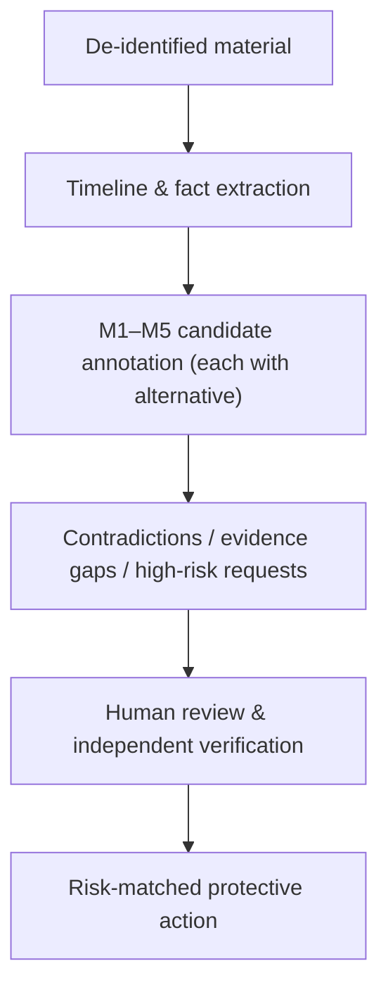

# Interpersonal Risk Analysis Protocol: From Relationship Material to Facts, Hypotheses, and Actions

**Version:** 0.1 (preprint)
**Date:** 2026-08-14
**Type:** Research design / protocol paper

## Abstract

When you hand a self-account, chat log, or interaction review to an AI, it is easy to frame the task as a question of "seeing through" the other person: is this person sincere, are they a fraudster, will they hurt me? This paper argues that this goal is neither reliable nor necessary. Neither humans nor AI can reliably infer another person's personality, motives, or childhood history from limited text; intuitive readings of deception cues have been repeatedly shown in research to be unreliable. This paper therefore shifts the object of analysis from "a person" to "an interaction, a narrative, and a request," and proposes an interpersonal risk analysis protocol: a material-organization and risk-annotation framework oriented toward safety actions, applicable across intimate relationships, friendships, families, and online-stranger relationships. Power structures, lateral competition, responsibility, and occupational safety in the workplace are a different kind of scenario, discussed separately in the companion paper *Workplace Interpersonal Risk Analysis Protocol*.

The core of the protocol is to split analysis into two separate axes: the **content axis** (appeals and needs, self-narrative and values, relationship learning and trigger conditions, interaction risk and vulnerability, relationship scripts and next steps — M1–M5) and the **judgment axis** (fact, hypothesis, action). Every inference must carry an evidence excerpt and an alternative explanation; any narrative that cannot be falsified by new information must not enter the report. High-risk requests (money transfers, investment, verification codes, accounts, identity documents, private imagery, remote control, threats) take priority over all relationship interpretation.

This paper also defines AI's appropriate place: as a structured co-pilot responsible for de-identification, timeline extraction, candidate annotation, checking contradictions and evidence gaps, and risk-matched protective actions; not as a judge of personality, not outputting "whether this person is antisocial" or "the probability of being a fraudster," and not generating probing, inducement, or manipulation strategies. This is a research-design and protocol paper and does not report model performance; it treats romance fraud (pig-butchering scams) as the high-risk branch, but its conclusions apply to general interpersonal risk assessment. The evaluation section gives five testable predictions and a local-first, user-reviewable prototype starting point.

**Keywords:** relationship material analysis; interpersonal risk; romance fraud; pig-butchering scam; AI assistance; falsifiability; human–AI collaboration

## 1. The Problem: Why "Analyzing a Person" Is the Wrong Goal

When people face a suspicious relationship, the most common way to ask is "is this person a fraudster or not?" This question has three structural flaws.

First, it demands a hard-to-verify conclusion from limited material. Real identity, accounts, and investment platforms can be verified through independent channels, but "whether the other person is sincere" cannot be confirmed through any channel. Second, it binarizes the conclusion — yes or no — whereas relationship risk is staged and changeable: a relationship with no risk at an early stage may later show isolation and requests for money, and vice versa. Third, it locks the person's attention onto "proving whether the other person is genuine or fake," while the resources that can actually be protected are accounts, information, and the right to choose. Suarez-Tangil et al. use precisely the strategy of "early identification rather than retrospective attribution" in dating-platform fraud detection [5]; this paper extends that idea to relationship analysis: not judging a person, but identifying whether an interaction is changing the way the person's judgment environment operates.

Deception research likewise does not support the goal of "seeing through" someone. DePaulo et al.'s meta-analysis of deception cues shows that observable verbal and bodily cues have a weak association with deception and are highly context-dependent [8]. This means that neither humans nor AI have a stable empirical basis for judging whether someone is lying by "feeling" or "wording." This also explains why romance fraud is so effective: the fraudster does not need great acting skill, only the ability to maintain a superficially consistent narrative for a period of time, while the victim's default psychology is trust (truth-default), not suspicion.

Therefore, this paper's research question is not "can AI see through a person," but: **Can AI help the person separate facts, hypotheses, contradictions, risks, and next actions in the material, while reducing over-inference and privacy leakage?** More generally, can a reviewable analysis protocol make interpersonal-risk discussions more honest, more refutable, and more oriented toward safety actions?

This paper does not report model performance, does not provide psychological or medical diagnosis, and does not constitute investment, legal, law-enforcement, or psychotherapy advice.

**What this paper proposes, and what it does not.** To avoid misunderstanding, let me first clarify the type and boundary of this protocol. What this paper proposes is an **analysis protocol**, not a personality model, a psychological diagnostic tool, or a "people-reading algorithm." Its input is a piece of de-identified relationship material (a self-account, chat log, or interaction review), and its output is a set of **structured annotations that can be reviewed, refuted, and incorporated into a timeline by a human** — not a verdict on "what kind of person the other party is." The protocol has three parts: (1) the definition of the unit of analysis (§3.1); (2) the separation of the content axis M1–M5 from the judgment axis "fact / hypothesis / action" (§3.2); (3) the methodological flow from material to protective action (§4). Whether it holds depends on whether the five testable predictions in Section 6 can be falsified in evaluation — not on whether it reads as plausible. The protocol's core terms are defined as follows: **fact** means a statement that can be independently verified and carries an evidence excerpt; **hypothesis** means an inference that the current material cannot yet confirm and that must carry at least one alternative explanation; **action** means a protective step to be taken under the current risk judgment; **evidence excerpt** is the original-text fragment an annotation is based on, and its absence automatically downgrades the inference; **alternative explanation** is another possibility that competes with the current hypothesis but explains the evidence equally well; **confidence** is the reviewer's explicit estimate of "how much the current material supports the inference," and it does not represent "the probability that the other person is a fraudster."

## 2. Related Material and Theoretical Boundaries

### 2.1 Why Romance Fraud Needs Relationship Analysis

The typical chain of romance fraud (commonly known as the "pig-butchering scam") is: build trust through fake dating or marriage-intent relationships, then lure the victim into fake investment, lending, or top-up schemes. This makes it different from a single phishing message: the early conversation can look like ordinary interpersonal interaction, and the real request for money often appears only later.

Whitty's Scammers' Persuasive Techniques Model (SPTM) divides this process into five stages — constructing a false identity, building rapid trust, deploying persuasive techniques, making a resource request, and possibly escalating into repeated demands or continued relationship maintenance — and points out that fraudsters systematically exploit "rapid intimacy" to bypass normal stages of relationship development [2]. In another study she further describes the victim's psychological process and the post-hoc shame [3]. Buchanan & Whitty's research on victims reminds us that victimization is not the inevitable result of a particular personality type: anyone whose emotional needs are met at a particular moment can fall in [4]. These two findings together constrain the boundary of M1–M5: the analysis can identify "whether the judgment environment is being changed," but cannot thereby accuse someone of fraud, much less label the victim.

### 2.2 What Existing Open-Source Material Can and Cannot Provide

| Resource | Type | What can be borrowed | What cannot be transferred directly |
| --- | --- | --- | --- |
| Suarez-Tangil et al., *Automatically Dismantling Online Dating Fraud*[5] | Peer-reviewed paper | Combining profile, text, and image features; early identification rather than retrospective attribution | Studies dating-platform profile detection, which is not equivalent to chat diagnosis or to effectiveness in Chinese scenarios |
| Scam Conversation Corpus (Eder, 2025)[6] | Open dataset | Multi-turn fraud conversations, structured JSON, de-identified fraudster labels | The "victim" is played by GPT-4o and cannot be treated as the real victim-behavior distribution |
| BYU-PCCL *scam-call-identification*[7] | Open-source, in-development project | Using LLMs to extract behavioral features such as pressure, information solicitation, impersonation, and requests for money; a reviewable feature catalog | Mainly about phone scams; the project is still in development and cannot be cited as a verified product or used directly to conclude about romance fraud |

Public resources still have an obvious gap: real, complete, consented Chinese intimate-relationship chat data is extremely scarce, and it inherently contains highly sensitive information. Therefore, version 0.1 of this research should not train a "people-reading model"; a more sensible starting point is to build a local-first, user-reviewable material-organizing tool, with human review and safety actions as the primary endpoints.

### 2.3 Theoretical Resources and Bibliographic Verification

This research does not treat book titles as theoretical evidence. What can currently be clearly verified is Rowland Miller's *Intimate Relationships* [1]; it is suitable for providing question dimensions for attraction, communication, commitment, conflict, and relationship maintenance. *Developmental Psychology* and *Trauma Psychology* exist in multiple Chinese editions or under works of the same title, so citations must add author, edition, and specific chapter; "antisocial personality" in the Chinese context may refer to either a clinical diagnosis or popular writing, and cannot be used as a label for remote judgment. *Trauma and Motivation* has not yet been verified to reliable bibliographic information, so this draft does not use it as a source.

This research's use of theory is deliberately narrow:

| Theoretical perspective | Questions it can ask | Conclusions it cannot draw |
| --- | --- | --- |
| Intimate relationships[1] | Are closeness, commitment, conflict repair, and resource investment reciprocal between the two parties? | "Passionate/introverted people must have a certain personality" |
| Motivation and developmental tasks | How did the current needs for belonging, recognition, safety, independence, or achievement influence choices? | "People at a certain stage are more easily deceived" |
| Trauma-informed perspective | Do pressure, shame, threats, or isolation make it hard to pause, refuse, and seek help? | "This sentence proves their childhood trauma" |
| Personality risk | Is there a repeated behavioral pattern of deception, exploitation, contempt for boundaries, and evading responsibility? The Dark Triad / D-factor literature provides boundaries for "observable behavior" rather than remote diagnosis[11] | "He/she is an antisocial personality (or NPD)" |
| Deception and trust | How reliable is the association between behavioral cues and deception? How is default trust abused?[8] | "A certain wording or expression proves the other person is lying" |

## 3. The Interpersonal Risk Analysis Protocol: M1–M5 and the Separation of Fact/Hypothesis/Action

### 3.1 The Shift in the Unit of Analysis

Interpersonal risk analysis first needs to decide "what to analyze." If the goal is "to judge whether this person is a fraudster or antisocial," the conclusion will almost inevitably exceed what the material can support. This paper therefore limits the object of analysis to **interactions, narratives, and requests**, rather than the "person" as a diagnostic object. Four basic constraints:

- The person is not the object of diagnosis; **interactions, narratives, and requests** are the object of analysis.
- Every output must be classified as one of "fact, hypothesis, action."
- Any high-risk request takes priority over relationship interpretation: when money, investment, verification codes, accounts, identity documents, private imagery, remote control, stalking, or threats appear, one should first stop the loss and seek help.
- Analysis conclusions should be overturnable by new information; unfalsifiable, elegant narratives should not enter the report.

### 3.2 Five Modules and Output Rules

This paper proposes five modules, M1–M5, as general dimensions for organizing material and annotating risk. Each module answers a different analytical question and restricts its output to a reviewable, refutable form:

| Module | Analytical question | Object of analysis | Output rule |
| --- | --- | --- | --- |
| M1: Appeals and needs | What goals are explicitly expressed in the material? | Explicitly expressed goals; needs such as belonging/safety/recognition/autonomy; and the cost when they go unmet | Only write "the material shows" or "may need verification"; do not equate needs with weakness |
| M2: Self-narrative and values | How does a person narrate themselves? | How stability/freedom/dignity/responsibility/intimacy/achievement are ordered | Distinguish self-accounts, actions, and others' evaluations; do not infer personality from writing style |
| M3: Relationship learning and trigger conditions | Which experiences are repeatedly emphasized? | Repeatedly emphasized experiences, boundaries, what one fears losing, and reactions under pressure | Do not infer childhood or trauma history; record only relationship-learning hypotheses the current material can support |
| M4: Interaction risk and vulnerability | Where are the risk and vulnerability? | Asymmetry, isolation, shame/guilt pressure, boundary punishment, identity contradictions, reality-doubt (gaslighting), and requests for money or information | Risk points to behaviors and requests, not to gender, occupation, region, or diagnostic labels |
| M5: Relationship scripts and next steps | What observable choices do the two parties have next? | The observable space of choices for both parties in conflict, repair, commitment, resource allocation, and seeking help | Write as situations-to-observe and questions-to-ask, never as "this person will certainly do X" |

### 3.3 Applicability and Boundaries Across Relationship Types

These five can be used for intimate relationships, and equally for friendships, family conflicts, or communication with online strangers. The difference lies only in resources and risk: intimate relationships often involve exclusivity, commitment, and emotional dependence; friendships and family involve the boundaries of trust and support; online-stranger relationships require handling identity, account, and transfer risks earlier. The workplace involves power structures, lateral competition, responsibility, and occupational safety, which belong to another, more complex set of scenarios handled specifically by the companion paper *Workplace Interpersonal Risk Analysis Protocol*.

An important methodological constraint comes from the temporal features of romance fraud: **the first four can help detect "whether the judgment environment is being changed," but cannot by themselves accuse someone of fraud.** Only when identity verification is persistently avoided, the relationship is used to isolate external support, or a money/account/investment conversion appears should one escalate to high-risk handling. When anyone met online asks for a money transfer or guides investment, relationship trust should not substitute for independent verification [7].

### 3.4 Reality-Doubt (Gaslighting): Why It Is a Systemic Mechanism, Not a Single Line of Manipulation

"Gaslighting" (from the play and film of the same name) refers to a systemic interaction pattern of making the other person doubt their own perception, memory, and judgment. It deserves separate treatment here because it is often misunderstood as a single line of "manipulation" and is thus ignored by M4 as an ordinary conflict. Abramson's definition in analytic philosophy offers a usable criterion: gaslighting is not "I'm telling you you're wrong," but a long-term, deliberate mistreatment of the other person's rational capacity so as to produce fundamental doubt about their own judgment [9]. In romance fraud this appears as "you're overthinking it," "you're too sensitive," "it's the platform's problem, not a scam" — precisely functioning to make it hard to pause, refuse, and seek help.

Distinguishing gaslighting from the broader **coercive control** avoids over-generalizing labels: Stark defines coercive control as "a partner's use of a pattern of behavior (isolation, degradation, surveillance, control of daily life) rather than one-off violence to systematically deprive the victim of freedom and choice" [10]. Gaslighting is one mechanism within it, but **not every quarrel or disagreement is gaslighting or coercive control**. This boundary matters for M4: the analysis should look for repeated combinations (rapid intimacy, isolation from external support, degradation, reality-doubt, requests for money), rather than escalating any single suspicious conversation into "manipulation."

## 4. Methodology: Fact → Hypothesis → Verification → Action

### 4.1 Building a Timeline

Keep dates, verbatim quotes, events, requests, promises, broken appointments, and payment points. Each entry records only identifiable facts; "very manipulative," "really loves me," "must be lying" are listed separately as interpretations and must not be mixed into the timeline. The timeline is the foundation that makes all later annotations identifiable and reviewable.

### 4.2 M1–M5 Annotation

Each annotation contains seven fields: `evidence excerpt`, `module`, `explanatory hypothesis`, `counterexample / alternative explanation`, `confidence`, `independent evidence needed`, `protective action`. Any inference without an evidence excerpt and an alternative explanation is automatically downgraded to "unusable." The alternative explanation is not a formal requirement but the primary mechanism against over-inference: if a hypothesis has one and only one explanation, it is usually not a hypothesis but a bias.

### 4.3 Attend to Patterns and Costs, Not Single Lines of "Manipulation"

A single effusive expression, one broken appointment, or one vulnerable disclosure is not enough to indicate risk. One should look for repeated combinations: rapid intimacy, avoiding reality checks, demanding secrecy, belittling outside opinions, manufacturing urgency, refusing boundaries, converting emotional trust into money or accounts. Then map the flow of resources: who invests time, emotional labor, privacy, money, and social support? Who gains decision-making power? A resource-flow diagram reveals structural asymmetry better than single-line analysis.

### 4.4 Designing Falsifiable Checks

Do not ask "are you a fraudster or not?"; ask questions that can generate new facts:

- Can they respect the explicit boundary of "no transfers, no investment, no verification codes"?
- Can their identity, work, accident, or platform be reasonably verified through independent channels?
- After a meeting is canceled, can they propose a concrete alternative plan and consistently follow through?
- Can the person still tell friends, family, or institutions about the situation without being punished?

What these questions share is that they do not depend on inferring the other person's inner state, but only on the other person's next observable behavior. Precisely because of this, they can be falsified, and they can also be satisfied — which is the touchstone for distinguishing "risk" from "bias."

**Decision thresholds.** To avoid the vague judgment of "looks like it passed," reduce each question to a three-valued answer — "yes / no / cannot judge" — and update the risk level by the following rules:

- Within a reasonable observation window, all four questions **remain "yes"**, and no new high-risk request appears → the risk stays at its current level; continue recording.
- Any question turns to **"no"**, or a "cannot judge" appears and the other party refuses to provide an independent verification channel → the risk goes up one notch (green → yellow, yellow → red).
- **"Cannot judge" does not default to safe**: if a fact that could have been verified through an independent channel repeatedly cannot be verified and the reasons keep changing, treat it as "no."

This threshold turns "falsifiable checks" from a principle into an operable rule, and is the basis on which Predictions Three and Four in Section 6 can be tested.

### 4.5 Deciding Action by Risk

| Risk level | Typical conditions | Action |
| --- | --- | --- |
| Green | General communication confusion; boundaries are respected, no high-risk requests | Continue communicating and record whether later actions are consistent |
| Yellow | Rapid intimacy, repeated broken appointments, avoiding verification, isolating outside opinions, or high-pressure urging | Slow the pace, reduce information exposure, and restate the facts to someone outside the relationship |
| Red | Money transfers, lending, investment, receiving payments on behalf, verification codes, accounts, private imagery, remote control, threats | Immediately stop operations, preserve evidence, and contact the payment channel, platform, and local law enforcement |

## 5. AI's Place: A Structured Co-Pilot, Not a Judge of Personality

### 5.1 Boundaries of Use

The desirable use of AI is to reduce omissions, make hypotheses explicit, and help the user return from strong emotion to checkable material. It should not output judgments such as "whether this person is antisocial" or "what the probability of being a fraudster is," and it must not generate testing, inducement, dependence-shaping, or reverse-manipulation strategies. The reason for this boundary is not only ethical but also empirical: observable cues are insufficient to support such judgments [8], and any seemingly precise probability lacks a real prior and evidential basis.

### 5.2 A Safe Workflow



De-identification is the first step, not an option: before input, remove names, contact information, precise locations, workplaces, accounts, identity documents, transfer receipts, and private imagery. AI output can only serve as a discussion outline and cannot replace the judgment of banks, platforms, police, lawyers, doctors, or mental-health professionals.

### 5.3 The Output Contract

Each model output is recommended to follow the structure below, so that it can be reviewed, refuted, and incorporated into a timeline by a human:

```yaml
claim: "对方在两周内三次要求将对话转到私密平台"
type: fact | hypothesis | action
module: M1 | M2 | M3 | M4 | M5
evidence: ["2026-08-01 原话…", "2026-08-05 原话…"]
alternative_explanations: ["平台使用偏好", "试图减少平台留痕"]
unknowns: ["是否也对其他联系人提出相同请求"]
risk: green | yellow | red
recommended_action: "保留平台记录；不在私密平台发送身份或资金信息"
```

### 5.4 A Reusable Prompt

> The following is de-identified relationship material. Treat it as limited evidence, not as a personality or trauma diagnosis. Output according to M1–M5: for each item, give the original-text facts, at most three explanations to be verified, at least one alternative explanation, missing information, and a protective next step. In particular, flag repeated boundaries, isolation, urging, identity contradictions, and requests for money/accounts. Do not generate advice to manipulate, probe, induce, or "get leverage over" another person. If money transfers, investment, verification codes, private imagery, remote control, or threats appear, prioritize loss-stopping and help-seeking actions.

## 6. Research Plan and Evaluation

The next version should turn the framework into an evaluable research prototype, rather than launching a "fraud verdict" directly:

1. **Annotation specification:** define the boundaries of M1–M5, the three labels of fact/hypothesis/action, red-line trigger items, and the diagnostic words that must not be output.
2. **Synthetic and public data validation:** first test format stability on public fraud corpora and hand-written harmless scenarios; do not train on unauthorized private chats.
3. **Human consistency:** have multiple reviewers annotate the facts and risk items of the same material and measure consistency; disagreements should be preserved, not "adjudicated" by the model.
4. **Safety evaluation:** test whether the model over-diagnoses, misreports ordinary conflicts as fraud, leaks sensitive information from the input, or generates manipulation advice.
5. **Utility evaluation:** measure whether users more easily notice missing information, raise boundaries, seek external verification, and stop losses in time; do not take "AI people-reading accuracy" as the sole goal.

### Five Testable Predictions

**Prediction One: Protocolized annotation is more reproducible than free-form diagnosis.** *Mechanism.* Requiring evidence excerpts and alternative explanations turns subjective impressions into identifiable records. *Testable prediction.* When multiple reviewers annotate the same material with M1–M5, the consistency of their fact items and red/yellow/green risk classifications should be significantly higher than that of freely written relationship evaluations. *Boundary.* Consistency does not mean correctness; disagreement itself is a valuable signal and should be preserved rather than eliminated.

**Prediction Two: Making hypotheses explicit reduces over-diagnosis.** *Mechanism.* Forcing "at least one alternative explanation" prevents both the model and the human from resting on the most salient interpretation alone. *Testable prediction.* In harmless scenarios (ordinary broken appointments, normal conflicts), outputs that carry the alternative-explanation requirement should misreport ordinary events as fraud or manipulation at a lower rate than unconstrained diagnostic-style outputs.

**Prediction Three: Falsifiable checks can distinguish risk from bias.** *Mechanism.* "Can they respect the no-transfer boundary?" and "Can their identity be independently verified?" depend only on observable subsequent behavior. *Testable prediction.* Under the annotation protocol, the correlation between the person's verification behavior and subsequent actual risk should be higher than the correlation between subjective evaluations of the other person's personality and subsequent risk.

**Prediction Four: High-risk requests take priority over relationship interpretation.** *Mechanism.* The workflow sets money transfers, verification codes, private imagery, remote control, and threats to the highest priority. *Testable prediction.* When such requests appear, the proportion of cases in which the system stably outputs loss-stopping and help-seeking actions rather than continuing to analyze the relationship trajectory approaches 100%; this item can be red-teamed with synthetic scenarios.

**Prediction Five: The tool changes the person's behavior, not just their judgment.** *Mechanism.* The utility goal is not to make AI more accurate, but to make it easier for users to notice information gaps, raise boundaries, seek external verification, and stop losses in time. *Testable prediction.* In controlled simulations, users of this workflow raise boundaries earlier and are less likely to keep investing money or information under high-pressure urging than users who do not use the tool.

All five predictions can be tested in the evaluation tasks of §6. If any one of them is falsified, the protocol needs revision; this is precisely why it is called a "protocol" rather than a "conclusion."

## 7. Threats to Validity and Research Boundaries

First, this paper's material is drawn mainly from public corpora, official warnings, and existing research, and cannot represent the distribution of real Chinese intimate-relationship conversations; the "victims" in public corpora may be played by synthetic roles and cannot be extrapolated to a real behavior distribution [6]. Second, the conclusions of deception-cue research come from laboratory and field studies and have an ecological distance from the long-duration interactions of romance fraud [8]. Third, this paper derives the protocol from deception research and relationship theory, and the derivation itself needs to be validated with mixed methods, including annotation consistency, user interviews, and safety audits. Fourth, AI capability changes quickly; the description of the model's role in this paper does not depend on any specific model, and deliberately avoids giving metrics such as "people-reading accuracy." Fifth, privacy is a core constraint rather than an add-on: any prototype must be local-first and must deny unauthorized data use by default.

## 8. Conclusion

The significance of M1–M5 is not to make AI better than humans at "seeing through" relationships, but to break vague intuition into evidence, hypotheses, counterexamples, verification, and action. For intimate relationships, this makes discussion more honest; for general interpersonal relationships, it makes boundaries clearer; for high-risk situations such as pig-butchering scams, it moves attention from "proving whether the other person is real or fake" to "protecting accounts, resources, and the right to choose."

This is still an unfinished research design. It must pass bibliographic verification, annotation-protocol review, privacy review, and genuine human evaluation before it is qualified to discuss any model performance. But before that, it can already do one thing: teach both humans and AI to say "this is what the material shows," "this is what needs verifying," and "this is what should be done now" — rather than "he's a fraudster."

## References

1. Miller, R. S. *Intimate Relationships* (8th ed.). Posts & Telecom Press. [Bibliographic information](https://item.xhsd.com/items/110000104393758). Used to provide question dimensions for attraction, communication, commitment, conflict, and relationship maintenance; no book's statements are treated as a diagnosis of a specific individual.
2. Whitty, M. T. (2013). [The Scammers' Persuasive Techniques Model: Development of a stage model to explain the online dating romance scam](https://academic.oup.com/bjc/article-abstract/53/4/665/396759). *British Journal of Criminology*, 53(4), 665–684. Five-stage model; this paper uses it to explain how "rapid intimacy" bypasses the normal stages of relationship development.
3. Whitty, M. T. (2015). [Anatomy of the online dating romance scam](https://wrap.warwick.ac.uk/id/eprint/81285/). *Security Journal*, 28(4), 443–455.
4. Buchanan, T., & Whitty, M. T. (2014). [The online dating romance scam: causes and consequences of victimhood](https://www.tandfonline.com/doi/abs/10.1080/1068316X.2013.772180). *Psychology, Crime & Law*, 20(3), 261–283.
5. Suarez-Tangil, G., Edwards, M., Peersman, C., Stringhini, G., Rashid, A., & Whitty, M. (2019). [Automatically dismantling online dating fraud](https://arxiv.org/abs/1905.12593). *IEEE Transactions on Information Forensics and Security*, 15, 1128–1137. DOI: [10.1109/TIFS.2019.2930479](https://doi.org/10.1109/TIFS.2019.2930479). Full version at arXiv:1905.12593; this paper cites its strategy of "early identification rather than retrospective attribution."
6. Eder, C. (2025). [Scam Conversation Corpus](https://zenodo.org/records/15212527). Zenodo. Open dataset; the victim side is played by an LLM and is used only as a method and structure reference, not as a real victim-behavior distribution.
7. BYU-PCCL. [scam-call-identification](https://github.com/BYU-PCCL/scam-call-identification). Open-source, in-development project; used to illustrate that LLMs can extract behavioral features such as pressure, information solicitation, impersonation, and requests for money, and not treated as a verified product.
8. DePaulo, B. M., Lindsay, J. J., Malone, B. E., Muhlenbruck, L., Charlton, K., & Cooper, H. (2003). [Cues to deception](https://psycnet.apa.org/record/2002-11678-004). *Psychological Bulletin*, 129(1), 74–118. Meta-analysis showing a weak association between observable cues and deception; this paper uses it to restrict all claims of "seeing through" someone.
9. Abramson, K. (2014). [Turning up the lights on gaslighting](https://doi.org/10.1111/phpe.12046). *Philosophical Perspectives*, 28(1), 1–30. Defines gaslighting as a long-term, deliberate mistreatment of the other person's rational capacity; this paper accordingly lists it as a systemic mechanism of M4 rather than a single line of manipulation.
10. Stark, E. (2007). *Coercive Control: How Men Entrap Women in Personal Life*. New York: Oxford University Press. Defines coercive control as using isolation, degradation, surveillance, and control of daily life to systematically deprive choice; this paper accordingly places gaslighting within the broader control spectrum and opposes label over-generalization.
11. Moshagen, M., Hilbig, B. E., & Zettler, I. (2018). [The dark core of personality](https://doi.org/10.1037/rev0000111). *Psychological Review*, 125(5), 656–688. Proposes a unified "dark core of personality" D-factor covering narcissism, psychopathy, and Machiavellianism; this paper uses its definition of "cross-situational behavioral patterns, a continuous spectrum" to limit personality risk to behavioral patterns rather than diagnostic labels.

## Author Information and Declarations

**Author:** Liyuk

**Conflicts of interest:** The author declares no conflicts of interest. This research received no funding from any commercial organization, and no data involving the privacy of real individuals was used for training or evaluation.

**Data availability:** This paper is a research-design and protocol paper and does not report new experimental data. The open datasets and public materials cited in this paper are listed in the references; among them, the Scam Conversation Corpus and the BYU-PCCL project are public resources used only for method reference and do not constitute an inference about the real victim-behavior distribution.

## Glossary

| Term | Definition | Role in this paper |
| --- | --- | --- |
| Relationship material | A piece of de-identified self-account, chat log, or interaction review | The protocol's input |
| Unit of analysis | Interactions, narratives, and requests — not the "person" as a diagnostic object | Determines what to analyze (§3.1) |
| M1–M5 | The five modules of the content axis: appeals and needs, self-narrative and values, relationship learning and trigger conditions, interaction risk and vulnerability, relationship scripts and next steps | The dimensions for organizing material and annotating risk (§3.2) |
| Fact | A statement that can be independently verified and carries an evidence excerpt | One of the judgment axes |
| Hypothesis | An inference that the current material cannot yet confirm and that must carry at least one alternative explanation | One of the judgment axes |
| Action | A protective step to be taken under the current risk judgment | One of the judgment axes |
| Evidence excerpt | The original-text fragment an annotation is based on | Its absence automatically downgrades the inference (§4.2) |
| Alternative explanation | Another possibility that competes with the current hypothesis but explains the evidence equally well | The primary mechanism against over-inference (§4.2) |
| Confidence | The reviewer's explicit estimate of "how much the current material supports the inference" | Does not represent "the probability that the other person is a fraudster" |
| High-risk request | Money transfers, investment, verification codes, accounts, identity documents, private imagery, remote control, threats | Takes priority over all relationship interpretation (§3.1) |
| Reality-doubt (gaslighting) | A systemic interaction pattern of making the other person doubt their own perception, memory, and judgment | A systemic mechanism of M4, not a single line of manipulation (§3.4) |
| Coercive control | Using isolation, degradation, surveillance, and control of daily life to systematically deprive choice | The broader control spectrum within which gaslighting sits (§3.4) |
