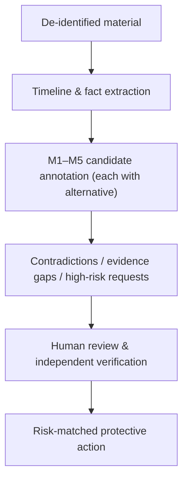

**版本：** 0.1（preprint）
**日期：** 2026-08-14
**类型：** 研究设计与协议论文（research design / protocol paper）

## 摘要

把一段自述、聊天记录或互动复盘交给 AI，很容易被表达成一个"看穿对方"的问题：这个人到底是不是真心、是不是骗子、会不会伤害我。本文主张这个目标既不可靠也无必要。人类与 AI 都无法从有限文字中可靠地推断他人人格、动机或童年经历；对欺骗线索的直觉性解读，在研究中被反复证明不可靠。因此，本文把分析对象从"一个人"转为"一段互动、叙事与请求"，并提出一个人际风险分析协议：一个跨亲密关系、友谊、家庭与线上陌生关系适用的、以安全行动为目标的材料组织与风险标注框架。职场的权力结构、横向竞争、权责与职业安全是另一类场景，由姊妹篇《职场关系分析协议》专门讨论。

协议的核心是把分析拆成两条彼此分离的轴：**内容轴**（诉求与需要、自我叙事与价值、关系学习与触发条件、互动风险与脆弱性、关系脚本与下一步，即 M1–M5）与**判断轴**（事实、假设、行动）。任何推断都必须带证据摘录与替代解释；任何无法被新信息证伪的叙述不得进入报告。高风险请求（转账、投资、验证码、账户、证件、私密影像、远程控制、威胁）优先于一切关系解释。

本文同时界定 AI 的恰当位置：作为结构化副驾驶，负责去标识、时间线抽取、候选标注、矛盾与证据缺口检查，以及风险匹配的保护动作；不作为人格判官，不输出"此人是否是反社会人格"或"是骗子的概率"，不生成试探、诱导或操控策略。本文是研究设计与协议论文，不报告模型效果；它以情感诈骗（杀猪盘）为高风险分支，但结论适用于一般人际风险评估。评估部分给出五项可检验的预测与一个本地优先、用户可审阅的原型起点。

**关键词：** 关系材料分析；人际风险；情感诈骗；杀猪盘；AI 辅助；可证伪性；人机协作

## 1. 问题：为什么"分析一个人"是错误的目标

人们面对一段可疑关系时，最常见的提问方式是"这人到底是不是骗子"。这个问法有三个结构性缺陷。

第一，它要求从有限材料中得出一个难以核验的结论。真实身份、账户、投资平台可以通过独立渠道核验，而"对方是否真心"无法通过任何渠道确认。第二，它把结论二值化——是或不是——而关系风险是分阶段、可变化的：早期毫无风险的关系可能后期出现隔离与资金请求，反之亦然。第三，它会锁定当事人的注意力在"证明对方真假"上，而真正可保护的资源是账户、信息与选择权。苏亚雷斯-坦希尔等人（Suarez-Tangil et al.）在交友平台诈骗检测中使用的正是"早期识别而非事后归因"的策略[5]；本文把这个思路推广到关系分析：不是判定一个人，而是识别一段互动是否正在改变当事人判断环境的方式。

欺骗研究同样不支持"看穿"的目标。德保罗等人（DePaulo et al.）对欺骗线索的元分析显示，可观察的言语与身体线索与欺骗之间的关联很弱，且高度依赖情境[8]。这意味着，无论人类还是 AI，凭"感觉"或"措辞"判断对方是否说谎，都缺乏稳定的实证基础。这也解释了为何情感诈骗如此有效：骗子并不需要演技高超，只需要在一段时间内维持表面一致的叙述，而受害者的默认心理是信任（truth-default），而非怀疑。

因此，本文的研究问题不是"AI 能否看穿一个人"，而是：**AI 能否帮助当事人把材料中的事实、假设、矛盾、风险与下一步行动分开，同时降低过度推断和隐私泄露？** 更一般地，一套可审阅的分析协议能否让人际风险讨论变得更诚实、更可反驳、更以安全行动为目标？

本文不报告模型效果，不提供心理或医学诊断，也不构成投资、法律、执法或心理治疗建议。

**本文提出的是什么，不是什么。** 为避免误解，先明确本协议的类型与边界。本文提出的是一套**分析协议（protocol）**，而非人格模型、心理诊断工具或"识人算法"。它的输入是一段去标识的关系材料（自述、聊天记录或互动复盘），输出是一组**可被人类审阅、反驳与合入时间线的结构化标注**，而不是对"对方是什么样的人"的判定。协议由三部分组成：(1) 分析单位的界定（§3.1）；(2) 内容轴 M1–M5 与判断轴"事实/假设/行动"的分离（§3.2）；(3) 从材料到保护动作的方法论流程（§4）。它能否成立，取决于第 6 节的五项可检验预测能否在评估中被证伪——而不是取决于它读起来是否合理。协议中的核心术语定义如下：**事实**指可被独立核验、附有证据摘录的陈述；**假设**指当前材料不足以证实、必须附带至少一种替代解释的推断；**行动**指在当前风险判断下应执行的保护性步骤；**证据摘录**是标注所依据的原文片段，缺失则推断自动降级；**替代解释**是与当前假设竞争、但同样能解释证据的另一种可能；**置信度**是审阅者对"当前材料支持该推断的程度"的显式估计，它不表示"对方是骗子的概率"。

## 2. 相关材料与理论边界

### 2.1 情感诈骗为何需要关系分析

情感诈骗（俗称"杀猪盘"）的典型链条是：以虚假交友或婚恋建立信任，再诱导受害者进入虚假投资、借贷或充值环节。这使它不同于单条钓鱼信息：前期对话可能很像普通人际互动，真正的资金请求往往较晚才出现。

惠蒂（Whitty）的诈骗者说服技巧模型（Scammers' Persuasive Techniques Model, SPTM）把这种过程分为五个阶段——虚假身份建构、建立快速信任、动用说服技巧、提出资源请求、随后可能升级为重复索取或继续维持关系——并指出骗子系统性利用"快速亲密"来绕过正常的关系发展阶段[2]。她在另一项研究中进一步描述了受害者的心理过程与事后耻辱感[3]。布坎南与惠蒂（Buchanan & Whitty）对受害者的研究则提醒我们：受害不是某类人格的必然结果，任何在特定时点满足情感需求的人都可能陷入[4]。这两条发现共同约束了 M1–M5 的边界：分析可以识别"判断环境是否正在被改变"，但不能据此指控诈骗，更不能据此标签化受害者。

### 2.2 现有开源资料能提供什么、不能提供什么

| 资源 | 类型 | 可借鉴的部分 | 不能直接迁移的部分 |
| --- | --- | --- | --- |
| Suarez-Tangil et al., *Automatically Dismantling Online Dating Fraud*[5] | 同行评审论文 | 资料、文本与图像特征组合；早期识别而非事后归因 | 研究的是交友平台资料检测，不等于聊天诊断或中文场景的效果 |
| Scam Conversation Corpus（Eder, 2025）[6] | 开放数据集 | 多轮诈骗对话、结构化 JSON、去标识的诈骗方标识 | "受害者"由 GPT-4o 扮演，不能当作真实受害者行为分布 |
| BYU-PCCL *scam-call-identification*[7] | 开源、开发中项目 | 用 LLM 提取压力、信息索取、冒充与资金请求等行为特征；可审阅特征目录 | 主要是电话诈骗；项目仍在开发，不能引用为已验证产品或直接用于情感诈骗定论 |

公开资源仍有明显缺口：真实、完整、经同意的中文亲密关系聊天数据极少，且天然包含高度敏感信息。因此，本研究的 0.1 版本不应训练"识人模型"；更合理的起点是做一个本地优先的、用户可审阅的材料整理工具，并以人工复核和安全行动为主要终点。

### 2.3 理论资源与书目核验

本研究不把书名当成理论证据。当前可明确核验的是罗兰·米勒的《亲密关系》[1]；它适合为吸引、沟通、承诺、冲突与关系维持提供问题维度。《成长心理学》与《创伤心理学》存在多个中文版本或同名著作，引用时必须补作者、版本和具体章节；"反社会人格"在中文语境中既可能指临床诊断，也可能指大众书写，不能作为远程判断的标签。《创伤与动机》尚未核验到可靠书目信息，因此本稿不将其作为来源。

本研究对理论的使用是有意收窄的：

| 理论视角 | 可问的问题 | 不可推出的结论 |
| --- | --- | --- |
| 亲密关系[1] | 双方的亲近、承诺、冲突修复和资源投入是否对等？ | "热烈/内向的人必然有某种人格" |
| 动机与发展任务 | 此刻的归属、认可、安全、独立或成就需要，怎样影响了选择？ | "某个阶段的人更容易被骗" |
| 创伤知情视角 | 催促、羞耻、威胁或隔离是否使人难以暂停、拒绝和求助？ | "这句话证明其童年创伤" |
| 人格风险 | 是否存在反复欺骗、剥削、蔑视边界和逃避责任的行为模式？黑三角/D 因子文献为"可观察行为"而非远程诊断提供边界[11] | "他/她就是反社会人格（或 NPD）" |
| 欺骗与信任 | 行为线索与欺骗之间的关联有多可靠？默认信任如何被滥用？[8] | "某个措辞或表情证明对方在说谎" |

## 3. 人际风险分析协议：M1–M5 与事实/假设/行动分离

### 3.1 分析单位的转变

人际风险分析首先需要决定"分析什么"。如果目标是"判断这个人是不是骗子、是不是反社会"，那么结论几乎必然超出材料能支持的限度。本文因此把分析对象限定为**互动、叙事与请求**，而不是作为诊断对象的"人"。四项基本约束：

- 人不是被诊断的对象；**互动、叙事与请求**才是被分析的对象。
- 每条输出必须归入"事实、假设、行动"之一。
- 任何高风险请求都优先于关系解释：钱、投资、验证码、账户、证件、私密影像、远程控制、跟踪或威胁出现时，应先止损与求助。
- 分析结论应能被新信息推翻；无法被证伪的漂亮叙事不应进入报告。

### 3.2 五个模块与输出规则

本文提出 M1–M5 五个模块，作为组织材料与标注风险的通用维度。每一模块都回答一个不同的分析问题，并把输出限制在可审阅、可反驳的形式：

| 模块 | 分析问题 | 分析对象 | 输出规则 |
| --- | --- | --- | --- |
| M1：诉求与需要 | 材料里明确表达的目标是什么？ | 明确表达的目标、归属/安全/认可/自主等需要，以及未被满足时的代价 | 只能写"材料显示"或"可能需要验证"；不把需要等同于弱点 |
| M2：自我叙事与价值 | 一个人怎样讲述自己？ | 如何排序稳定/自由/体面/责任/亲密/成就 | 区分自述、行动与他人评价；不从文风推断人格 |
| M3：关系学习与触发条件 | 哪些经验被反复强调？ | 反复强调的经验、边界、害怕失去的东西，以及在压力下的反应 | 不倒推童年或创伤史；只记录当前材料能支持的关系学习假设 |
| M4：互动风险与脆弱性 | 风险与脆弱性在哪里？ | 不对等、隔离、羞耻/愧疚施压、边界惩罚、身份矛盾、现实怀疑（gaslighting）、资金或信息请求 | 风险指向行为和请求，不指向性别、职业、地域或诊断标签 |
| M5：关系脚本与下一步 | 双方下一步有什么可观察的选择？ | 冲突、修复、承诺、资源分配和求助时，双方可观察的选择空间 | 写成待观察情境与可提问题，绝不写成"此人一定会如何" |

### 3.3 跨关系类型的适用与边界

这五项可以用于亲密关系，也可以用于友谊、家庭冲突或与陌生网友的沟通。区别只在于资源与风险：亲密关系常涉及排他、承诺与情感依赖；友谊与家庭涉及信任与支持的边界；线上陌生关系则需更早处理身份、账户和转账风险。职场涉及权力结构、横向竞争、权责与职业安全，属于另一组更复杂的场景，由姊妹篇《职场关系分析协议》专门处理。

一个重要的方法论约束来自情感诈骗的时序特征：**前四项可以帮助发现"判断环境是否正在被改变"，但不能仅据此指控诈骗。** 只有当身份核验持续被回避、关系被用来隔离外部支持、或出现资金/账户/投资转化时，才应上升到高风险处置。任何线上认识的人一旦要求转钱或引导投资，都不应由关系信任替代独立核验[7]。

### 3.4 现实怀疑：为什么它不是单句话术，而是系统性机制

"煤气灯"（gaslighting，源自同名戏剧与电影）指一种系统性让对方怀疑自身感知、记忆与判断的互动模式。它之所以在这里值得单列，是因为它常常被误解为单句"话术"，从而被 M4 当作普通冲突忽略。阿布拉姆森（Abramson）在分析哲学上的界定给出一个可用判据：煤气灯不是"我说你错了"，而是长期、蓄意地以错误方式对待对方的理性能力，使其对自身判断产生根本性怀疑[9]。在情感诈骗里，这表现为"是你想多了""你太敏感""平台的问题，不是骗局"，作用正是让人难以暂停、拒绝与求助。

把煤气灯与更为普遍的**强制控制**（coercive control）区分开，能避免标签泛化：斯达克（Stark）将强制控制定义为"伴侣用行为模式（隔离、贬低、监视、掌控日常）而非单次暴力来系统性剥夺受害者的自由与选择权"[10]。煤气灯是其中的一种机制，但**并非每段争吵、每次分歧都是煤气灯或强制控制**。这条边界对 M4 很重要：分析应当寻找反复组合（快速亲密、隔离外部支持、贬低、现实怀疑、资金请求），而不是把任何一次令人生疑的对话都升级为"操控"。

## 4. 方法论：事实 → 假设 → 核验 → 行动

### 4.1 建立时间线

保留日期、原话、事件、请求、承诺、失约和付款节点。每条记录只写可指认的事实；"很会操控""真的爱我""一定撒谎"另列为解释，不能混进时间线。时间线是让后续所有标注可指认、可复核的基础。

### 4.2 M1–M5 标注

每条标注包含七个字段：`证据摘录`、`模块`、`解释假设`、`反例/替代解释`、`置信度`、`需要的独立证据`、`保护性行动`。任何没有证据摘录和替代解释的推断，自动降级为"不可用"。替代解释不是形式要求，而是对抗过度推断的主要机制：一个假设如果有且只有一个解释，它通常不是假设，而是偏见。

### 4.3 关注模式与代价，而不是单句"话术"

单次热烈表达、一次失约或一次脆弱倾诉都不足以说明风险。应当寻找反复组合：快速亲密、回避现实核验、要求保密、贬低外部意见、制造紧急感、拒绝边界、把情感信任转换为钱或账号。然后画出资源流向：谁投入时间、情绪劳动、隐私、钱和社交支持？谁获得决定权？资源流向图比单句分析更能揭示结构性的不对等。

### 4.4 设计可证伪的检查

不问"你到底是不是骗子"，而问能产生新事实的问题：

- 是否能尊重"不转账、不投资、不提供验证码"的明确边界？
- 身份、工作、事故或平台能否通过独立渠道合理核验？
- 取消见面后，是否能提出具体替代方案并稳定履约？
- 当事人是否仍能把情况告诉朋友、家人或机构，而不受惩罚？

这些问题的共同点是：它们不依赖对他人内心状态的推断，只依赖对方下一步的可观察行为。正因为如此，它们可以被证伪，也可以被满足——这正是区分"风险"与"偏见"的试金石。

**判定阈值。** 为避免"看起来通过了"的模糊判断，把每个问题简化为"是/否/无法判断"三值，并按以下规则更新风险等级：

- 四个问题在合理观察窗口内**全部持续为"是"**，且未出现新的高风险请求 → 风险维持当前等级，可继续记录。
- 任一问题转为**"否"**，或出现"无法判断"且对方拒绝提供独立核验渠道 → 风险上调一档（绿→黄，黄→红）。
- **"无法判断"本身不默认安全**：如果一项本可通过独立渠道核验的事实，反复无法核验且理由不断变化，按"否"处理。

这条阈值把"可证伪的检查"从原则变成可操作的规则，也是第 6 节预测三、预测四得以检验的基础。

### 4.5 按风险决定行动

| 风险等级 | 典型条件 | 行动 |
| --- | --- | --- |
| 绿 | 一般沟通困惑；能尊重边界，没有高风险请求 | 继续沟通，记录后续行动是否一致 |
| 黄 | 快速亲密、反复失约、回避核验、隔离外部意见或高压催促 | 放慢节奏，降低信息暴露，向关系外的人复述事实 |
| 红 | 转账、借贷、投资、代收款、验证码、账户、私密影像、远程控制、威胁 | 立即停止操作，保存证据，联系支付渠道、平台与当地执法部门 |

## 5. AI 的位置：结构化副驾驶，而不是人格判官

### 5.1 用途边界

AI 的可取用途是减少遗漏、让假设显式化，并帮助用户从强情绪中回到可检查的材料。它不应输出"此人是不是反社会人格""概率多少是骗子"这样的判断，更不能生成测试、诱导、依赖塑造或反向操控策略。这条边界的理由不只是伦理，也是实证：可观察线索不足以支撑这类判断[8]，任何看似精确的概率都缺少真实的先验与证据基础。

### 5.2 安全工作流



去标识是第一步，不是可选项：输入前应删除姓名、联系方式、精确地点、工作单位、账号、证件、转账凭据和私密影像。AI 输出只能作为讨论提纲，不能替代银行、平台、警方、律师、医生或心理专业人员的判断。

### 5.3 输出契约

建议每个模型输出遵循以下结构，使其可被人类审阅、反驳与合入时间线：

```yaml
claim: "对方在两周内三次要求将对话转到私密平台"
type: fact | hypothesis | action
module: M1 | M2 | M3 | M4 | M5
evidence: ["2026-08-01 原话…", "2026-08-05 原话…"]
alternative_explanations: ["平台使用偏好", "试图减少平台留痕"]
unknowns: ["是否也对其他联系人提出相同请求"]
risk: green | yellow | red
recommended_action: "保留平台记录；不在私密平台发送身份或资金信息"
```

### 5.4 可复用提示词

> 以下是已经去标识的关系材料。请将其作为有限证据，而不是人格或创伤诊断。请按 M1–M5 输出：每项给出原文事实、最多三种待验证解释、至少一种替代解释、缺失信息与保护性下一步。请特别标出反复出现的边界、隔离、催促、身份矛盾和资金/账户请求。不要生成操控、试探、诱导或"拿捏"他人的建议。若出现转账、投资、验证码、私密影像、远程控制或威胁，优先输出止损与求助动作。

## 6. 研究计划与评估

下一版应把框架变成可评估的研究原型，而不是直接上线"诈骗判定"：

1. **标注规范：** 定义 M1–M5 的边界、事实/假设/行动三类标签、红线触发项与不允许输出的诊断词。
2. **合成与公开数据验证：** 先在公开诈骗语料与人工编写的无害情境中测试格式稳定性；不使用未授权私聊训练。
3. **人工一致性：** 让多位审阅者对同一材料的事实和风险项标注，测量一致性；分歧应保留，而不是被模型"裁决"。
4. **安全评估：** 测试模型是否会过度诊断、将普通冲突误报为诈骗、泄露输入中的敏感信息，或生成操控建议。
5. **效用评估：** 衡量用户是否更容易发现缺失信息、提出边界、寻求外部核验与及时止损；不以"AI 识人准确率"作为唯一目标。

### 五项可检验预测

**预测一：协议化标注比自由诊断更可复现。** *机制。* 要求证据摘录与替代解释的标注，把主观印象转化为可指认的记录。*可检验预测。* 多位审阅者对同一材料做 M1–M5 标注，其事实项与红/黄/绿风险分类的一致性，应显著高于自由书写的关系评价。*边界。* 一致性不意味着正确；分歧本身是有价值的信号，应保留而非消除。

**预测二：假设显式化降低过度诊断。** *机制。* 强制"至少一种替代解释"使模型和人都不能只停留在最显著的解释上。*可检验预测。* 在无害情境（普通失约、正常冲突）中，带替代解释要求的输出把普通事件误报为诈骗或操纵的比例，应低于无约束的诊断式输出。

**预测三：可证伪检查能区分风险与偏见。** *机制。* "能否尊重不转账的边界""能否独立核验身份"只依赖可观察的后续行为。*可检验预测。* 在标注协议下，当事人的核验行为与后续实际风险的相关性，应高于对对方人格的主观评价与后续风险的相关性。

**预测四：高风险请求优先于关系解释。** *机制。* 工作流把转账、验证码、私密影像、远程控制、威胁设为最高优先级。*可检验预测。* 当这类请求出现时，系统稳定输出止损与求助动作、而非继续分析关系走向的比例接近 100%；这一项可用合成情境做红队测试。

**预测五：工具改变的是当事人的行为，而不只是判断。** *机制。* 效用目标不是让 AI 更准，而是让用户更容易发现信息缺口、提出边界、寻求外部核验与及时止损。*可检验预测。* 使用该工作流的用户，在受控模拟中比不使用工具的用户更早提出边界、更少在高压催促下继续投入资金或信息。

这五项预测都可以在 §6 的评估任务中检验。任何一项被否证，都意味着协议需要修改；这正是把它称为"协议"而不是"结论"的原因。

## 7. 有效性威胁与研究边界

第一，本文的材料以公开语料、官方提醒与现有研究为主，无法代表中文真实亲密关系对话的分布；公开语料中的"受害者"可能由合成角色扮演，不能外推为真实行为分布[6]。第二，欺骗线索研究的结论来自实验室与现场研究，与情感诈骗的长时段互动存在生态距离[8]。第三，本文从欺骗研究与关系理论推导出协议，推导本身需要用混合方法验证，包括标注一致性、用户访谈与安全审计。第四，AI 能力变化很快，文中对模型角色的描述不依赖任何具体模型，也刻意不给出"识人准确率"这类指标。第五，隐私是核心约束而非附加项：任何原型都必须是本地优先的，默认拒绝未授权的数据使用。

## 8. 结论

M1–M5 的意义不在于使 AI 比人更会"看透"关系，而在于把模糊的直觉拆成证据、假设、反例、核验和行动。对亲密关系而言，这能让讨论更诚实；对一般人际关系而言，这能让边界更清楚；对杀猪盘等高风险情境而言，它把注意力从"证明对方是真是假"移到"保护账户、资源与选择权"。

这仍是一项未完成的研究设计。它需要经过书目核验、标注协议、隐私审查和真实的人工评估，才有资格讨论任何模型效果。但在那之前，它已经可以做到一件事：让人与 AI 都学会说"这是材料显示的"、"这是需要验证的"和"这是此刻该做的"，而不是"他就是骗子"。

## 参考文献

1. Miller, R. S. 《亲密关系》（Intimate Relationships，第 8 版）. 人民邮电出版社. [书目信息](https://item.xhsd.com/items/110000104393758). 用于为吸引、沟通、承诺、冲突与关系维持提供问题维度；不将任何书籍表述当作对具体个人的诊断。
2. Whitty, M. T. (2013). [The Scammers' Persuasive Techniques Model: Development of a stage model to explain the online dating romance scam](https://academic.oup.com/bjc/article-abstract/53/4/665/396759). *British Journal of Criminology*, 53(4), 665–684. 五阶段模型；本文据其说明"快速亲密"如何绕过正常关系发展阶段。
3. Whitty, M. T. (2015). [Anatomy of the online dating romance scam](https://wrap.warwick.ac.uk/id/eprint/81285/). *Security Journal*, 28(4), 443–455.
4. Buchanan, T., & Whitty, M. T. (2014). [The online dating romance scam: causes and consequences of victimhood](https://www.tandfonline.com/doi/abs/10.1080/1068316X.2013.772180). *Psychology, Crime & Law*, 20(3), 261–283.
5. Suarez-Tangil, G., Edwards, M., Peersman, C., Stringhini, G., Rashid, A., & Whitty, M. (2019). [Automatically dismantling online dating fraud](https://arxiv.org/abs/1905.12593). *IEEE Transactions on Information Forensics and Security*, 15, 1128–1137. DOI: [10.1109/TIFS.2019.2930479](https://doi.org/10.1109/TIFS.2019.2930479). 完整版见 arXiv:1905.12593；本文引用其"早期识别而非事后归因"的策略。
6. Eder, C. (2025). [Scam Conversation Corpus](https://zenodo.org/records/15212527). Zenodo. 开放数据集；由 LLM 扮演受害方，仅作方法与结构参考，不作为真实受害者行为分布。
7. BYU-PCCL. [scam-call-identification](https://github.com/BYU-PCCL/scam-call-identification). 开源、开发中项目；用于说明 LLM 可提取压力、信息索取、冒充与资金请求等行为特征，不作为已验证产品。
8. DePaulo, B. M., Lindsay, J. J., Malone, B. E., Muhlenbruck, L., Charlton, K., & Cooper, H. (2003). [Cues to deception](https://psycnet.apa.org/record/2002-11678-004). *Psychological Bulletin*, 129(1), 74–118. 元分析显示可观察线索与欺骗之间的关联很弱；本文据此限制一切"看穿对方"的主张。
9. Abramson, K. (2014). [Turning up the lights on gaslighting](https://doi.org/10.1111/phpe.12046). *Philosophical Perspectives*, 28(1), 1–30. 界定煤气灯为长期、蓄意地以错误方式对待对方的理性能力；本文据此将其列为 M4 的系统性机制而非单句话术。
10. Stark, E. (2007). *Coercive Control: How Men Entrap Women in Personal Life*. New York: Oxford University Press. 将强制控制定义为用隔离、贬低、监视与掌控日常来系统性剥夺选择权；本文据此把煤气灯放入更普遍的控制谱系，并反对标签泛化。
11. Moshagen, M., Hilbig, B. E., & Zettler, I. (2018). [The dark core of personality](https://doi.org/10.1037/rev0000111). *Psychological Review*, 125(5), 656–688. 提出统一的"人格暗核心"D 因子，覆盖自恋、精神病态与马基雅维利主义；本文据其"跨情境行为模式、连续光谱"的界定，把人格风险限制在行为模式而非诊断标签。

## 作者信息与声明

**作者：** Liyuk

**利益冲突：** 作者声明无利益冲突。本研究未受任何商业机构资助，未使用任何涉及真实当事人隐私的数据进行训练或评估。

**数据可用性：** 本文是研究设计与协议论文，不报告新的实验数据。本文引用的开源数据集与公开资料均已在参考文献中列出；其中 Scam Conversation Corpus 与 BYU-PCCL 项目为公开资源，仅供方法参考，不构成对真实受害者行为分布的推断。

## 术语表

| 术语 | 定义 | 在本文中的角色 |
| --- | --- | --- |
| 关系材料 | 一段去标识的自述、聊天记录或互动复盘 | 协议的输入 |
| 分析单位 | 互动、叙事与请求，而非作为诊断对象的"人" | 决定分析什么（§3.1） |
| M1–M5 | 内容轴的五个模块：诉求与需要、自我叙事与价值、关系学习与触发条件、互动风险与脆弱性、关系脚本与下一步 | 组织材料与标注风险的维度（§3.2） |
| 事实 | 可被独立核验、附有证据摘录的陈述 | 判断轴之一 |
| 假设 | 当前材料不足以证实、必须附带至少一种替代解释的推断 | 判断轴之一 |
| 行动 | 在当前风险判断下应执行的保护性步骤 | 判断轴之一 |
| 证据摘录 | 标注所依据的原文片段 | 缺失则推断自动降级（§4.2） |
| 替代解释 | 与当前假设竞争、但同样能解释证据的另一种可能 | 对抗过度推断的主要机制（§4.2） |
| 置信度 | 审阅者对"当前材料支持该推断的程度"的显式估计 | 不表示"对方是骗子的概率" |
| 高风险请求 | 转账、投资、验证码、账户、证件、私密影像、远程控制、威胁 | 优先于一切关系解释（§3.1） |
| 现实怀疑（gaslighting） | 系统性让对方怀疑自身感知、记忆与判断的互动模式 | M4 的系统性机制而非单句话术（§3.4） |
| 强制控制（coercive control） | 用隔离、贬低、监视与掌控日常来系统性剥夺选择权 | 煤气灯所在的更普遍的控制谱系（§3.4） |
