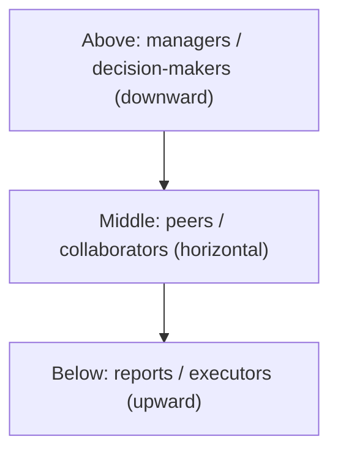
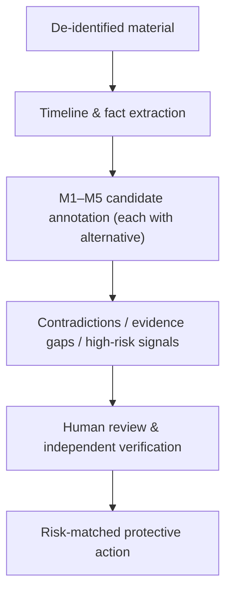

# Workplace Relationship Risk Analysis Protocol: From Power Structures to Authority, Responsibility, and Career Safety

**Version:** 0.1 (preprint)
**Date:** 2026-08-14
**Type:** Research design / protocol paper

## Abstract

Workplace conflict is easily framed as a problem of "seeing through the other person": is this manager incompetent, is this colleague framing me, is this collaborator deliberately making trouble. This paper argues that this goal is both unreliable and unnecessary. Neither humans nor AI can reliably infer another person's motives or personality from communication records; what can actually be verified is the interaction structure — who holds the information, who has the power to decide, where responsibility flows, and who bears the risk. This paper shifts the object of analysis from "a person" to "an interaction, a structural position, and a risk bearer," and proposes a workplace relationship risk analysis protocol: a framework for organizing material and annotating risk, oriented toward safety actions.

The core of the protocol is to split the analysis into two mutually separate axes: the **content axis** (claims and needs, self-narrative and values, relationship learning and trigger conditions, interaction risk and vulnerability, relationship script and next steps — i.e., M1–M5) and the **judgment axis** (facts, hypotheses, actions). Every inference must carry an evidence excerpt and an alternative explanation; any narrative that cannot be falsified by new information must not enter the report. The workplace-specific analytical dimensions include: **top-middle-bottom three-tier safety** (risks from superiors, peers, and subordinates), **vertical power structures** (who controls performance, promotion, information, and resources), **horizontal competition** (contention over information power, reputational power, and resource power), **authority-responsibility misalignment** (the separation of responsibility from power; blame-shifting and accountability patterns), **career safety** (bullying, job insecurity), **career development** (the gap between promises and delivery, being "stuck"), and **occupational mental health** (job demands-resources imbalance).

This paper also defines the appropriate role of AI: as a structured co-pilot responsible for de-identification, timeline extraction, candidate annotation, contradiction and evidence-gap checking, and risk-matched protective actions; not as a judge of personality, not outputting categorical judgments such as "this manager is a narcissist" or "this colleague is framing you," and not generating probing, inducement, retaliation, or manipulation strategies. This paper is a research-design and protocol paper and reports no model effectiveness. It shares the M1–M5 core, the fact/hypothesis/action separation, and the AI co-pilot boundary with its companion paper *Relationship Risk Analysis Protocol: From Relationship Material to Facts, Hypotheses, and Actions*, but expands on the structural positions and systemic dimensions specific to the workplace.

**Keywords:** workplace risk; three-tier safety; power structure; authority-responsibility asymmetry; career safety; career development; occupational mental health; AI assistance; human-AI collaboration

## 1. The problem: why workplace conflict cannot rely on "seeing through the other person"

When people face a workplace conflict, the most common way of asking is "is this person deliberately targeting me" and "is this manager incompetent." This way of asking has three structural flaws.

First, it demands a conclusion that is difficult to verify from limited material. Performance, rank, and promotion records can be verified through organizational channels, while "whether the other person was actually deliberate" cannot be confirmed through any channel. Second, it binarizes the conclusion — good manager/bad manager, good faith/malice — whereas workplace risk is structural: even a normal management system can make people in particular positions bear disproportionate risk. Third, it locks the person's attention onto "proving the other side is bad," when the resources that can actually be protected are records, information, reputation, and choice.

Deception research likewise does not support the goal of "seeing through." DePaulo et al.'s meta-analysis of cues to deception shows that the association between observable verbal and physical cues and deception is weak and highly context-dependent [5]. This means that neither humans nor AI have a stable empirical basis for judging, by "feeling" or "wording," whether the other party is lying or framing someone.

Therefore, the research question of this paper is not "can AI see through someone in the workplace," but: **can AI help the person concerned separate facts, hypotheses, contradictions, structural positions, and next steps in communication records, while reducing over-inference and privacy leakage?** More generally, can a reviewable protocol make workplace risk discussions more honest, more refutable, and more oriented toward protecting records, information, and choice?

This paper reports no model effectiveness, provides no psychological or medical diagnosis, and does not constitute labor arbitration, litigation, or career advice.

**What this paper proposes, and what it does not.** To avoid misunderstanding, first clarify the type and boundary of this protocol. What this paper proposes is an **analysis protocol**, not a personality model, an organizational diagnostic tool, or a "people-reading algorithm." Its input is a de-identified piece of workplace communication material (emails, messages, meeting minutes, or interaction retrospectives), and its output is a set of **structured annotations that can be reviewed, refuted, and merged into a timeline by humans** — not a judgment about "what kind of person this manager is." The protocol consists of three parts: (1) the definition of the unit of analysis (§3.1); (2) the content axis M1–M5 and the separation of the "fact/hypothesis/action" judgment axis (§3.2); (3) the methodological flow from material to protective actions (§4). Whether it holds depends on whether the five testable predictions in Section 6 can be falsified in evaluation — not on whether it reads as reasonable. The core terms of the protocol are defined as follows: a **fact** is a statement that can be independently verified and carries an evidence excerpt; a **hypothesis** is an inference that the current material cannot yet substantiate and that must carry at least one alternative explanation; an **action** is a protective step to be taken under the current risk judgment; an **evidence excerpt** is the passage of original text on which an annotation is based, and without it an inference is automatically downgraded; an **alternative explanation** is another possibility that competes with the current hypothesis but equally explains the evidence (e.g., "the information-syncing process itself is flawed," "the other party shifts blame under pressure"); **confidence** is the reviewer's explicit estimate of "the degree to which the current material supports the inference," and it does not mean "the probability that the other party is a bad person." The workplace protocol additionally distinguishes two kinds of analytical objects: **behavior patterns** (repeated observable behaviors) and **structural positions** (who controls performance, information, reputation, and resources).

## 2. Theoretical resources and boundaries

### 2.1 Why the workplace needs relationship analysis

Workplace risk and intimate-relationship risk share the same unit of analysis (interactions, narratives, and requests), but three differences determine that it needs specialized treatment.

First, **power is structural, not personal.** Pfeffer emphasizes in organizational power research a frequently underestimated fact: what determines the say in a workplace relationship is who controls resources, information, and promotion channels, not just who has a "stronger presence" [1]. A boundary-crosser does not necessarily need manipulation skills; they only need to occupy a position that makes it difficult for the other party to refuse. Second, **the relationship cannot be easily "cut off."** An intimate relationship can stop losses, seek help, and cut contact; a workplace relationship involves salary, visa, background checks, and the next job — "walking away" is itself an enormous cost. Third, **the organization is a "third party" in the game.** Workplace risk is not a two-person game — HR, the manager's manager, and colleagues are all in the game; they may be swept along, may be incapacitated, or may even be part of the collusion from the start.

### 2.2 What existing research can and cannot provide

| Perspective | Questions it can ask | Conclusions it cannot draw |
| --- | --- | --- |
| Organizational power [1] | Who controls resources, information, and promotion channels? Is power disguised as a "management style"? | "This person is very manipulative" |
| Dark core of personality (D factor) [2] | Is there a repeated behavior pattern of deception, exploitation, boundary contempt, and evasion of responsibility? | "This is a narcissistic leader" / "He/she is an antisocial personality" |
| Workplace bullying [3] | Is there repeated, directionally consistent negative treatment? | "One performance criticism is bullying" |
| Job insecurity [4] | Does worrying about losing one's job affect health and decision-making? | "Only people who overthink feel this way" |
| Abusive supervision [6] | Are performance and promotion levers repeatedly used to impose punishment with no avenue of appeal? | "Strict management is abuse" |
| Bullying and mobbing [7] | Is there group-based, directionally consistent exclusion and hostility? | "One instance of colleague friction is mobbing" |
| Employee silence [8] | Is "not speaking up" because speaking up has been empirically punished? | "No opinion means no problem" |
| Psychological safety [9] | Can the team safely ask questions, correct mistakes, and raise objections? | "A good atmosphere means no risk" |
| Career plateau [10] | Has promotion or growth stalled over the long term? Is there a gap between promises and delivery? | "No promotion means being targeted" |
| Job demands-resources [11] | Is there long-term high demand and low resources (autonomy, support, feedback)? | "Complaining about being tired means incompetence" |
| Deception and trust [5] | How reliable is the association between behavioral cues and deception? | "A certain phrasing proves the other party is framing someone" |

### 2.3 Boundary statement

This study does not treat book titles as theoretical evidence. Pfeffer's *Power: Why Some People Have It — and Others Don't* [1] can be verified; this paper borrows only its **descriptive** claim (power comes from structural positions), and adopts none of its **prescriptive** parts (how to accumulate and wield power). "Antisocial personality" and "narcissistic leader" may refer to either a clinical diagnosis or popular writing in the Chinese context, and cannot serve as labels for remote judgment. Workplace bullying and job insecurity have clear empirical research support [3][4], but they describe recurring patterns and independent stressors, and cannot be used to label specific individuals.

## 3. The workplace relationship risk analysis protocol: M1–M5 and the fact/hypothesis/action separation

### 3.1 The shift in the unit of analysis

Workplace risk analysis first needs to decide "what to analyze." If the goal is "judging whether this manager is incompetent or this colleague is framing me," then the conclusion almost inevitably exceeds what the material can support. This paper therefore limits the object of analysis to **interactions, narratives, requests, and structural positions**, rather than the "person" as an object of diagnosis. Four basic constraints:

- The person is not the object of diagnosis; **interactions, narratives, requests, and structural positions** are the objects of analysis.
- Every output must be classified into one of "fact, hypothesis, action."
- Any high-risk signal (physical threat, illegal instruction, being asked to bear unlawful responsibility) takes priority over relationship interpretation and should first be documented, cut losses, and be verified outside the organization.
- Analytical conclusions should be overturnable by new information; an elegant narrative that cannot be falsified should not enter the report.

### 3.2 Five modules and output rules

This paper proposes five modules, M1–M5, as general dimensions for organizing material and annotating risk. Each module answers a different analytical question and constrains its output to a reviewable, refutable form. As with the emotional companion paper, the M1–M5 here are **cross-scenario general** analytical dimensions:

| Module | Analytical question | Object of analysis | Output rule |
| --- | --- | --- | --- |
| M1: Claims and needs | What are the explicitly expressed goals in the material? | Explicitly expressed goals; needs such as belonging/safety/recognition/autonomy; and the cost when they are unmet | Only write "the material shows" or "may need verification"; do not equate needs with weaknesses |
| M2: Self-narrative and values | How does a person narrate themselves? | How they rank stability/freedom/dignity/responsibility/intimacy/achievement | Distinguish self-account, actions, and others' evaluations; do not infer personality from writing style |
| M3: Relationship learning and trigger conditions | Which experiences are repeatedly emphasized? | Repeatedly emphasized experiences, boundaries, things feared to be lost, and reactions under pressure | Do not trace back to childhood or trauma history; only record relationship-learning hypotheses that the current material can support |
| M4: Interaction risk and vulnerability | Where are the risks and vulnerabilities? | Asymmetry, isolation, shame/guilt pressure, boundary punishment, identity contradiction, information or resource requests | Risk points to behaviors and structural positions, not to gender, occupation, region, or diagnostic labels |
| M5: Relationship script and next steps | What observable choices do both sides have next? | The observable choice space of both sides in conflict, repair, commitment, resource allocation, and seeking help | Write as situations-to-observe and questions-to-ask, never as "this person will definitely do X" |

### 3.3 Applicability and boundaries in the workplace context

In the workplace context, each of the M1–M5 modules is placed in a more power-asymmetric structure. Intimate relationships often involve exclusivity, commitment, and emotional dependence; the workplace involves **performance, promotion, resource allocation, information access, and career safety**. The difference lies not in the unit of analysis, but in structure and risk: superiors control performance and promotion, colleagues control information and reputation, and the system controls records and interpretive authority. Therefore, risk annotation in the workplace context must simultaneously record **structural positions** and **behavior patterns**, rather than only watching "whether this person's way of speaking feels oppressive."

### 3.4 Vertical power: how power is disguised as management

The most common form of risk in the workplace is **the power asymmetry between superiors and subordinates**. Superiors control performance, promotion, relationship networks, and resource allocation; this leverage allows boundary-crossing behavior to be packaged as a "management style," a "work requirement," or "for your own good." Pfeffer points out that this positional difference is itself a source of power [1].

Empirical research provides a restrained and reliable anchor for this: Moshagen et al. propose the "dark core of personality" (D) — a dimension explaining the shared variance among narcissism, psychopathy, and Machiavellianism, whose core is the tendency to instrumentalize others and regard oneself as above the rules [2]. But the D factor is precisely an empirical reason for M4's output rule: it is a continuous spectrum (from everyday selfishness to clinical extremes), emphasizing "recurring cross-situational behavior patterns" rather than a label for any single event. Applied to the workplace, it means asking "does the other party **repeatedly** shift responsibility onto others, withdraw support when there is no return, or dismiss boundary claims as weakness" — rather than asking "is this a narcissistic leader." The latter way of asking, whatever its conclusion, exceeds what the material can support.

### 3.5 Horizontal competition: the identification boundary of rivalry, credit-stealing, and framing

Another kind of risk in the workplace does not come from superior-subordinate power, but from **horizontal antagonism between collaborating partners or counterparts**: vicious competition, credit-stealing and report-hijacking, adversarial emotions between collaborators, and framing responsibility and fault onto others. This kind of problem can likewise be identified through communication records, but it has a key difference from the vertical scenario: **there is no direct superior-subordinate power, yet there are three variants of power — information power (who controls key information and reporting channels), reputational power (whose evaluation is believed), and resource power (who decides whether collaboration can continue)**. Whoever monopolizes the channel for transmitting information to decision-makers in the course of communication effectively holds the initiative in this horizontal competition.

But here there is a boundary that must be drawn clearly first. **"Malicious framing" is a judgment about motive, while communication records can only support behavior patterns.** On the surface, "report-hijacking," adversarial emotions, and shifting responsibility onto others may be completely indistinguishable from "KPIs are inherently zero-sum," "information does not flow smoothly," and "the other party shifts blame under pressure." Therefore, the analytical goal of this section is not "judging from the records whether the other party is a bad person," but **listing verifiable behavioral indicators, and mandating that alternative explanations be exhausted first**.

The behavioral indicators that can be identified from communication records and should be annotated include:

- **Reporting and information channels:** Is reporting on key decisions bypassed, preempted, or cut off? Is key information delivered late, delivered selectively, or delivered already loaded with a negative characterization of a certain party?
- **Repeated transfer of responsibility attribution:** After a problem arises, is responsibility systematically transferred, without a factual basis, to a fixed party? Is the other party's competence or motive simultaneously disparaged during the transfer?
- **Escalating wording and emotive labels:** Is discussion of specific problems repeatedly replaced by characterizations of the person ("he's no good," "she's irresponsible") rather than the behavior ("this delivery was delayed because…")? Are unverifiable group endorsements like "everyone thinks so" used to strengthen accusations?
- **Excluding the other party from key occasions:** Is the other party repeatedly excluded from important meetings, decisions, and information syncs, while simultaneously being held responsible for the results these occasions produce?
- **Boundary punishment:** After the other party raises a boundary or objection, do they immediately face retaliatory measures — being marginalized, having their motives questioned, being hinted at as "not a team player" or "uncooperative"?

All five indicators must be grounded in **identifiable facts** (which message, which occasion, which record), must each carry **at least one alternative explanation** ("the work allocation itself may be unreasonable," "the other party may genuinely be bad at communicating," "the information sync may have had problems from the start"), and must note the **independent evidence needed** (meeting minutes, email sending/receiving records, the timeline of decision documents). Only when the same pattern **recurs** and the alternative explanations are eliminated one by one does it warrant escalation to yellow or red handling — not a conclusion drawn from one emotional phrasing.

### 3.6 Authority-responsibility misalignment: blame-shifting, accountability, and career safety

The third form of workplace risk lies not in horizontal competition, but in the **authority-responsibility asymmetry between superiors and subordinates**: superiors control resources and interpretive authority, yet can shift their own responsibility down onto subordinates while collecting subordinates' credit upward. When "who is responsible" and "who has the power to decide" are decoupled, the risk escalates from a behavioral problem to a structural institutional problem. This kind of risk has two verifiable dimensions:

**First, the pattern of blame-shifting and accountability.** After a problem arises, does responsibility always flow in a fixed direction (usually toward the party with less seniority, less power, and no ability to push back)? Is credit always collected upward by the decision-makers? Are decisions made without records, conveyed orally, and made non-accountable afterward, while the executor is held responsible for the results? The key to this pattern lies not in single events, but in **whether the direction is fixed and consistent with power** — when "bearing responsibility" and "having the power to decide" persistently fall on different people, that is a recognizable signal of authority-responsibility asymmetry.

**Second, career safety and risk disclosure.** When work demands make subordinates bear career risk (taking the blame, being held accountable, being marginalized) without protection matching the risk, it belongs to this category. Empirical research repeatedly shows: there is a stable association between workplace bullying and mental health problems, and this association exists across both cross-sectional and longitudinal studies — bullying is not just one unpleasant conflict, but repeated, directionally consistent negative treatment [3]. Conversely, **job insecurity** is itself an independent stressor that affects health and work performance, independent of specific events such as being marginalized or threatened [4]. This gives the protocol a clear implication: **"worrying about losing one's job" should not be dismissed as "overthinking" — it is itself a fact that deserves inclusion in risk assessment and protective actions.** Viewed in isolation, one performance conversation or one attribution of responsibility cannot determine whether systemic bullying is present; but when it recurs, is directionally consistent, and the person concerned feels job insecurity, it meets the "recurring combination" standard of §4.3.

### 3.7 The systemic dimension of large organizations: professionalism, information gaps, and role-based bullying

The objects handled in the preceding sections are mostly **individuals or relationship pairs**. But workplace risk is often not caused by any particular person, but is a structural product of the **organizational system** itself. This is especially true of large organizations, which have three features that are easily mistaken for "normal management" but actually constitute systemic risk:

**First, the information gap is structural.** In a large organization, "who holds information" is determined by role and hierarchy, not by individual will. Subordinates usually cannot verify what information superiors base decisions on, nor can they know whether their own reports were relayed faithfully. Pfeffer regards this positional difference as a source of power [1]; for risk analysis, it means — when the basis of a key decision cannot be verified by the person concerned, and this unverifiability is the norm rather than the exception, it should be flagged as a "gap requiring independent verification," rather than defaulting to "the organization must have its reasons."

**Second, "professionalism" and "system stability" can become language for avoiding the individual.** Large organizations often defend structural arrangements with "this is the professional way," "we must ensure system stability," and "this is reasonable from the overall perspective." These words are sometimes reasonable, and sometimes exactly the object that the alternative-explanation discipline must challenge: **a decision that protects system stability, and a decision that makes someone take the blame for the system or sacrifices someone, are indistinguishable in wording.** What distinguishes them is not the wording itself, but whether the individual is left an exit that is **verifiable, appealable, and refusable**.

**Third, the managerial role can be used as an instrument of bullying.** "Managerial-role bullying" refers not to some manager with a bad personality, but to **using the authority the role confers (performance, scheduling, resource allocation, reporting paths) to systematically demean, exclude, or threaten subordinates**, and it is hard to identify because the behavior superficially overlaps with "managerial duties." This is consistent with the "repeated, directionally consistent negative treatment" in the workplace bullying research [3]: a single performance criticism is not bullying, but when performance tools are repeatedly used to impose punishment with no avenue of appeal and to fix subordinates in a position of weakness, it enters the spectrum of authority-responsibility asymmetry and bullying.

These three give the protocol a common principle: **systemic risk cannot be resolved by analyzing a single person, but it can be resolved by annotating structural positions, information gaps, and appealability.** When, in a conflict, one party naturally holds the information, another naturally cannot verify, and the system places "stability" above the individual, the risk annotation should record all three things — then land on the actions of §4: document, use formal channels, and seek independent verification outside the organization.

### 3.8 The three tiers of workplace safety: risks from above, peers, and below

Taken together, the preceding three sections reveal a more complete map: **workplace safety is not unidirectional; it comes from three tiers — above, middle, and below.** This perspective can avoid a common bias — fixating only on "whether the manager is bad" while missing the risks from peers and below. The three tiers each have their typical problems and evidentiary forms:

| Tier | Direction | Typical problems | Key literature | Core risk signals |
| --- | --- | --- | --- | --- |
| Above: superiors / decision-makers | Downward | Abusive supervision, overstepping management, blame-shifting, abuse of performance tools, demands to bear unlawful responsibility | Abusive supervision review [6]; workplace bullying [3] | Performance and promotion levers repeatedly used to impose punishment with no avenue of appeal; responsibility flows in a fixed direction |
| Middle: peers / collaborators | Horizontal | Vicious competition, credit-stealing, information cutoff, framing, mobbing | Workplace bullying and mobbing review [7] | Contention over information and reputational power; group exclusion; boundary punishment |
| Below: reports / executors | Upward | Upward overstepping, subordinate silence and voicelessness, distortion of information at the execution layer | Employee silence research [8] | Information from below cannot reach above; dissent suppressed; information distorted in transmission |



Among the three tiers, the risk "from below" is the most easily overlooked and the most worth explaining separately. **Employee silence** research points out: employees do not speak up, often not because there is no problem, but because speaking up has been empirically punished before — being cold-shouldered, labeled "uncooperative," or excluded from key occasions [8]. When a person "chooses silence," this is itself a fact that needs to be included in risk annotation, not "he has no opinion." Psychological safety research gives the other side of the same coin from the positive direction: in a psychologically safe team, members dare to ask questions, admit mistakes, and raise objections — and this sense of safety is precisely the foundation for countering risks from all three tiers [9].

The practical value of the three-tier model for analysis is **mandated completion**: when the material contains only "superior vs me," the protocol should ask "is there a similar pattern among peers" and "are there signals of voicelessness among subordinates"; when the material contains only "me and my colleague," it should ask "who in this structure has the power to decide, and who bears the risk." This also gives the structural-position map of §4 (who controls performance, information, reputation, resources) a clear tiered skeleton.

### 3.9 Career development: risk is not only "being harmed," but also "being stuck"

Workplace risk is not entirely conflict and harm; it also includes **developmental stagnation**. When career development is manipulatively delayed, blocked, or distorted — for example, indefinitely postponing promotion with "it's not time yet," bearing long-term high-intensity work with no return under the name of "developing you," or repeatedly hollowing out promised growth opportunities — this is likewise an annotatable relationship risk, and it often appears compounded with the power structures of the preceding three sections.

Career plateau research reviews forty years of evidence: when individuals perceive that promotion or growth is no longer possible, declines appear in job satisfaction, engagement, and intention to stay [10]. It reminds the protocol of one point: **"being stuck" is a subjective perception, but it can be supported by objective signals** — the gap between promises and delivery, the opacity of promotion criteria, and growth opportunities repeatedly assigned to particular groups. These signals, like blame-shifting and framing, should conform to the annotation discipline of evidence excerpts, alternative explanations, and independent evidence.

For M1–M5, career development mainly falls under **M1 (claims and needs: growth, recognition, autonomy)** and **M5 (relationship script and next steps: commitment, resource allocation)**. A falsifiable question is: **"Does the organization's commitment to career development have a clear timetable, criteria, and delivery record?"** A recordless, unverifiable "there will be something later" and a recorded, verifiable development plan are completely different in risk.

### 3.10 Occupational mental health: when work harms more than just work

Work-health research provides one of the most solid empirical foundations for the protocol. The **job demands–resources model (JD-R)** holds that all work can be divided into job demands (load, conflict, uncertainty) and job resources (autonomy, support, feedback), and when demands are persistently high and resources low, exhaustion and disengagement follow [11]. This gives the protocol a clear implication: **when assessing a workplace relationship, "this person keeps me in sustained high intensity with no support, no feedback, and no autonomy" is not a soft complaint, but an exhaustion signal with empirical consequences.**

Research on psychological safety [9], workplace bullying [3], and job insecurity [4] further shows: these are not "things that only psychologically fragile people encounter," but **measurable products of organizational structure and interaction patterns**. Their effects exist across both cross-sectional and longitudinal studies, and job insecurity itself is a stressor independent of specific events [4].

Therefore, occupational mental health is not an appended "care section" in this protocol, but a risk dimension on par with §3.4–3.8: **it turns "I've been in bad shape lately" from a hard-to-verify feeling into a set of annotatable signals (demand/resource ratio, lack of support, no feedback, no autonomy, declining sense of safety), and gives executable protective actions (seek support, reduce exposure, formalize, verify externally).**

## 4. Methodology: fact → hypothesis → verification → action

### 4.1 Building the timeline

Preserve dates, original wording, events, requests, commitments, broken promises, decisions, and documentation nodes. Each record contains only identifiable facts; "good at shifting blame," "targeting me," "definitely framing me" are listed separately as interpretations and must not be mixed into the timeline. The timeline is the foundation that makes all subsequent annotations identifiable and reviewable. In the workplace context, additionally ask: **which facts left records, and who has the power to make records not exist.**

### 4.2 M1–M5 annotation

Each annotation contains seven fields: `evidence excerpt`, `module`, `explanatory hypothesis`, `counterexample/alternative explanation`, `confidence`, `independent evidence needed`, and `protective action`. Any inference without an evidence excerpt and an alternative explanation is automatically downgraded to "unusable." Alternative explanations are not a formal requirement, but the main mechanism against over-inference: if a hypothesis has one and only one explanation, it is usually not a hypothesis but a prejudice.

### 4.3 Focus on patterns and costs, not on single-sentence "tactics"

A single performance criticism, one emotional email, or one broken promise is not enough to establish risk. One should look for recurring combinations: responsibility repeatedly shifting in a fixed direction, boundary claims repeatedly dismissed as "uncooperative," key information repeatedly delayed or cut off, and a persistently eroding sense of career safety. Then draw the **structural positions**: who controls performance and promotion, who controls information and reporting channels, who bears the risk, who gets the credit? A structural-position map reveals systemic asymmetry better than single-sentence analysis.

### 4.4 Designing falsifiable checks

Instead of asking "is this person deliberately targeting me," ask questions that can produce new facts:

- Is there a written record of key decisions, and can the basis be verified?
- Is there a clear standard for performance or responsibility attribution, and is the same standard applied to everyone?
- Does the response to dissent or boundary claims leave an exit that is appealable and refusable?
- Can the person concerned, without being punished, tell a third party inside the organization (HR, the manager's manager) or an independent verification channel outside the organization?

What these questions have in common is: they do not depend on inferences about others' motives, but only on verifiable processes and records. Precisely because of this, they can be falsified and can also be satisfied — this is exactly the touchstone that distinguishes "risk" from "bias."

**Decision threshold.** To avoid the vague judgment of "it looks like it passed," reduce each question to three values "yes/no/cannot judge," and update the risk level according to the following rules:

- All four questions remain persistently "yes" within a reasonable observation window, and no new high-risk signal appears → risk stays at the current level; continue recording.
- Any question turns to "no," or "cannot judge" appears and the other party refuses to provide verifiable processes and records → risk is raised one level (green→yellow, yellow→red).
- **"Cannot judge" does not default to safe**: if a fact that could be verified through formal channels is repeatedly unverifiable with ever-changing reasons, treat it as "no."

This threshold turns "falsifiable checks" from a principle into an operable rule, and is also the basis on which Predictions Three and Four of Section 6 can be tested.

### 4.5 Deciding actions by risk level

| Risk level | Typical conditions | Action |
| --- | --- | --- |
| Green | General communication confusion; authority and responsibility clear, with records verifiable | Continue communicating; record whether subsequent actions are consistent |
| Yellow | Repeated boundary-crossing under power asymmetry, information cut off, authority-responsibility misalignment, or rising job insecurity | Document; use formal channels; restate the facts to a third party inside the organization or a channel outside the organization |
| Red | Physical threat, illegal instruction, being asked to bear unlawful responsibility, systemic bullying | Immediately stop participation; preserve evidence; contact formal channels inside the organization and external legal/labor bodies |

The handling of the red tier in the workplace differs from the emotional scenario: the goal here is not "cutting off contact" (which may be extremely costly), but **documenting, formalizing, and seeking verification outside the organization** — turning the risk from "person-to-person" into "a record that a third party can review."

## 5. The role of AI: a structured co-pilot, not a judge of personality

### 5.1 Boundaries of use

The desirable use of AI is to reduce omissions, make hypotheses explicit, and help the user return from strong emotion to checkable material. It should not output judgments such as "this manager is a narcissist," "this colleague is framing you," or "this person is an antisocial personality," still less generate probing, inducement, retaliation, or manipulation strategies. The reason for this boundary is not only ethical but also empirical: observable cues are insufficient to support such judgments [5].

### 5.2 Safe workflow



De-identification is the first step, not an option: before input, one should remove names, contact information, precise locations, work units, accounts, identification documents, and private content. AI output can only serve as a discussion outline, and cannot replace the judgment of HR, legal affairs, lawyers, labor arbitration bodies, or mental health professionals.

### 5.3 Output contract

It is recommended that each model output follow the following structure, so that it can be reviewed, refuted, and merged into a timeline by humans:

```yaml
claim: "该项目的问题被反复归因于执行方，而决策记录缺失"
type: fact | hypothesis | action
module: M1 | M2 | M3 | M4 | M5
evidence: ["2026-08-01 会议纪要缺失…", "2026-08-05 邮件原文…"]
alternative_explanations: ["信息同步流程本身有问题", "对方可能在压力下推责"]
unknowns: ["决策是否有书面记录", "是否对其他人也适用同样标准"]
risk: green | yellow | red
recommended_action: "补会议纪要；向项目干系人确认决策依据；保留邮件"
```

### 5.4 Reusable prompt

> The following is already de-identified workplace communication material. Please treat it as limited evidence, not as a personality or motive diagnosis. Please output according to M1–M5: for each item, give the original-text fact, at most three explanations to be verified, at least one alternative explanation, missing information, and a protective next step. Please check risk signals separately across the three tiers (superiors, peers, subordinates), and specifically flag recurring responsibility transfer, information cutoff, boundary punishment, authority-responsibility misalignment, erosion of the sense of career safety, unfulfilled development promises, and job demands-resources imbalance. Do not generate advice to manipulate, probe, induce, retaliate against, or "handle" others. If physical threats, illegal instructions, or demands to bear unlawful responsibility appear, prioritize outputting actions of documenting, stopping losses, and seeking verification outside the organization.

## 6. Research plan and evaluation

The next version should turn the framework into an evaluable research prototype, rather than directly launching a "workplace bullying verdict" system:

1. **Annotation specification:** define the boundaries of M1–M5, the three labels of fact/hypothesis/action, the red-line triggers (physical threat, illegal instruction, systemic bullying), and the diagnostic words that must not be output.
2. **Synthetic and public data validation:** first test format stability on public workplace conflict/bullying corpora and human-written harmless scenarios; do not use unauthorized internal organizational data for training.
3. **Human agreement:** have multiple reviewers annotate the facts and risk items of the same material and measure agreement; disagreements should be preserved rather than "adjudicated" by the model.
4. **Safety evaluation:** test whether the model over-diagnoses, misreports normal management as bullying, leaks sensitive information from the input, or generates retaliatory suggestions.
5. **Utility evaluation:** measure whether users more easily discover missing information, identify structural positions, use formal channels, and document in time; do not take "AI people-reading accuracy" as the sole goal.
6. **Three-tier and full-spectrum coverage evaluation:** test whether the protocol can complete the top-middle-bottom three-tier risk signals from one-sided material, and simultaneously cover the three dimensions of conflict (harm), development (stagnation), and mental health (exhaustion); avoid "seeing only the superior, missing peers and subordinates" or "seeing only conflict, missing exhaustion."

### Five testable predictions

**Prediction One: protocol-based annotation is more reproducible than free-form evaluation.** *Mechanism.* Annotation that requires evidence excerpts and alternative explanations turns subjective impressions into identifiable records. *Testable prediction.* When multiple reviewers annotate the same material with M1–M5, the agreement on their fact items and red/yellow/green risk classifications should be significantly higher than that of freely written workplace evaluations. *Boundary.* Agreement does not mean correctness; disagreement itself is a valuable signal and should be preserved rather than eliminated.

**Prediction Two: the alternative-explanation requirement reduces "framing false alarms."** *Mechanism.* Mandating "at least one alternative explanation" prevents both the model and the person from stopping at "the other party is up to no good." *Testable prediction.* In harmless scenarios (normal management conflict, ordinary KPI pressure), output that carries the alternative-explanation requirement should misreport normal management as malicious competition or bullying at a lower rate than unconstrained diagnostic output.

**Prediction Three: structural-position analysis can distinguish risk from bias.** *Mechanism.* "Who controls performance, who controls information, where responsibility flows" depends only on verifiable structural facts. *Testable prediction.* The correlation between structural-position indicators and subsequent actual conflict escalation should be higher than the correlation between subjective evaluations of the other party's personality and subsequent risk.

**Prediction Four: appealability is the falsifiable touchstone.** *Mechanism.* What distinguishes "a system decision" from "the system sacrificing an individual" is not wording, but whether an exit that is verifiable, appealable, and refusable is left open. *Testable prediction.* When a process leaves an appealable exit, the subsequent risk to the person concerned is significantly lower than when there is no exit; this can be tested with a synthetic-scenario comparison.

**Prediction Five: what the tool changes is the person's documenting and help-seeking behavior, not just judgment.** *Mechanism.* The utility goal is not to make AI more accurate, but to make it easier for users to discover information gaps, use formal channels, document, and seek verification outside the organization. *Testable prediction.* Users of this workflow, in controlled simulations, document earlier and are less likely to sign commitments that harm their own rights under high pressure than users who do not use the tool.

All five predictions can be tested in evaluation tasks. The falsification of any one of them means the protocol needs revision; this is precisely why it is called a "protocol" rather than a "conclusion."

## 7. Validity threats and research boundaries

First, the material of this paper is primarily public research and management-oriented works, which cannot represent the distribution of real internal organizational conversations. Second, workplace bullying and job insecurity research mostly comes from Western samples, with a transfer distance to Chinese workplace culture [3][4]. Third, this paper derives the protocol from organizational research, and the derivation itself needs to be validated with mixed methods, including annotation agreement, user interviews, and safety audits. Fourth, AI capabilities change quickly; the paper's description of the model's role does not depend on any specific model, and deliberately avoids metrics such as "people-reading accuracy." Fifth, privacy and employment compliance are core constraints rather than add-ons: any prototype must be local-first and refuse unauthorized data use by default.

## 8. Conclusion

The difficulty of workplace relationship risk analysis lies not in reading a particular person, but in seeing the structure clearly: who holds information, who has the power to decide, where responsibility flows, and who bears the risk. This paper's protocol breaks these structural factors into evidence, hypotheses, counterexamples, verification, and actions — for vertical power, it distinguishes "management" from "boundary-crossing disguised as management"; for horizontal competition, it distinguishes "rivalry" from "framing"; for authority and responsibility, it distinguishes "a reasonable system decision" from "making an individual take the blame for the system."

This is still an unfinished research design. It needs to pass bibliographic verification, annotation protocol, privacy and employment compliance review, and real human evaluation before it is qualified to discuss any model effectiveness. But before that, it can already do one thing: teach both humans and AI to say "this is what the material shows," "this is what needs verification," and "this is what should be done now," rather than "he did it on purpose."

## References

1. Pfeffer, J. (2010). *Power: Why Some People Have It—and Others Don't*. New York: HarperBusiness. Chinese edition: *Power: Why Only Some People Have It* (《权力：为什么只为某些人所拥有》), translated by Yang Yang, Zhejiang People's Publishing House, 2015, ISBN 9787213067662. This paper borrows only its **descriptive** claim (power comes from structural position rather than personal traits alone) to understand how risk is amplified by power asymmetry; it adopts none of the book's prescriptive advice on acquiring or wielding power.
2. Moshagen, M., Hilbig, B. E., & Zettler, I. (2018). [The dark core of personality](https://doi.org/10.1037/rev0000111). *Psychological Review*, 125(5), 656–688. Proposes the unified "dark core of personality" D factor, covering narcissism, psychopathy, and Machiavellianism; based on its "cross-situational behavior patterns, continuous spectrum" definition, this paper limits workplace relationship risk to behavior patterns rather than diagnostic labels.
3. Verkuil, B., Atasayi, S., & Molendijk, M. L. (2015). [Workplace bullying and mental health: A meta-analysis on cross-sectional and longitudinal data](https://doi.org/10.1371/journal.pone.0135225). *PLoS ONE*, 10(8), e0135225. Shows a stable association between workplace bullying and mental health problems across cross-sectional and longitudinal studies.
4. Cheng, G. H.-L., & Chan, D. K.-S. (2007). [Who suffers more from job insecurity? A meta-analytic review](https://doi.org/10.1111/j.1464-0597.2007.00312.x). *Applied Psychology*, 57(2), 272–303. Shows that job insecurity is itself an independent stressor affecting health and work performance.
5. DePaulo, B. M., Lindsay, J. J., Malone, B. E., Muhlenbruck, L., Charlton, K., & Cooper, H. (2003). [Cues to deception](https://psycnet.apa.org/record/2002-11678-004). *Psychological Bulletin*, 129(1), 74–118. The meta-analysis shows that the association between observable cues and deception is weak; this paper accordingly restricts all "seeing through the other party" claims.
6. Tepper, B. J., Simon, L., & Park, H. M. (2017). [Abusive supervision](https://doi.org/10.1146/annurev-orgpsych-041015-062539). *Annual Review of Organizational Psychology and Organizational Behavior*, 4, 123–152. A systematic review of abusive supervision; this paper uses it to explain the vertical risk of "using role authority to impose punishment."
7. Branch, S., Ramsay, S., & Barker, M. (2012). [Workplace bullying, mobbing and general harassment: A review](https://doi.org/10.1111/j.1468-2370.2012.00339.x). *International Journal of Management Reviews*, 15(3), 280–299. A review of workplace bullying and group exclusion (mobbing); this paper uses it to explain horizontal exclusion and group antagonism.
8. Donaghey, J., Cullinane, N., Dundon, T., & Wilkinson, A. (2011). [Reconceptualising employee silence](https://doi.org/10.1177/0950017010389239). *Work, Employment and Society*, 25(1), 51–67. Employee silence research; this paper uses it to explain that "not speaking up" is itself a fact that needs to be included in annotation.
9. Edmondson, A. C. (1999). [Psychological safety and learning behavior in work teams](https://doi.org/10.2307/2666999). *Administrative Science Quarterly*, 44(2), 350–383. Psychological safety research; this paper uses it to explain that an environment where one can ask questions, correct mistakes, and dissent is the foundation for countering three-tier risk.
10. Yang, W.-N., Niven, K., & Johnson, S. (2018). [Career plateau: A review of 40 years of research](https://doi.org/10.1016/j.jvb.2018.11.005). *Journal of Vocational Behavior*, 110, 286–302. A career plateau review; this paper uses it to explain that "being stuck" can be supported by objective signals such as the promise-delivery gap.
11. Bakker, A. B., & Demerouti, E. (2016). [Job demands–resources theory: Taking stock and looking forward](https://doi.org/10.1037/ocp0000056). *Journal of Occupational Health Psychology*, 22(3), 273–285. The job demands-resources model; this paper uses it to explain that long-term high demands and low resources are a signal of exhaustion rather than a soft complaint.

## Author information and declarations

**Author:** Liyuk

**Conflicts of interest:** The author declares no conflicts of interest. This research received no funding from any commercial institution, and did not use any data involving the privacy of real organizations or individuals for training or evaluation.

**Data availability:** This paper is a research-design and protocol paper and reports no new experimental data. The public research and industry materials cited in this paper are all listed in the references; conclusions about workplace bullying and job insecurity come from published meta-analyses and do not constitute a judgment about any specific organization or individual.

## Glossary

| Term | Definition | Role in this paper |
| --- | --- | --- |
| Workplace communication material | A de-identified piece of email, messages, meeting minutes, or an interaction retrospective | The protocol's input |
| Unit of analysis | Interactions, narratives, requests, and structural positions, rather than the "person" as an object of diagnosis | Determines what to analyze (§3.1) |
| M1–M5 | The five modules of the content axis (shared with the emotional companion paper) | Dimensions for organizing material and annotating risk (§3.2) |
| Fact | A statement that can be independently verified and carries an evidence excerpt | One of the judgment axes |
| Hypothesis | An inference that the current material cannot yet substantiate and that must carry at least one alternative explanation | One of the judgment axes |
| Action | A protective step to be taken under the current risk judgment | One of the judgment axes |
| Evidence excerpt | The passage of original text on which an annotation is based | Without it, an inference is automatically downgraded (§4.2) |
| Alternative explanation | Another possibility that competes with the current hypothesis but equally explains the evidence | The main mechanism against over-inference (§4.2) |
| Confidence | The reviewer's explicit estimate of "the degree to which the current material supports the inference" | Does not mean "the probability that the other party is a bad person" |
| Behavior pattern | Repeated observable behaviors | One of the workplace analytical objects |
| Structural position | Who controls performance, information, reputation, resources | One of the workplace analytical objects (§3.3) |
| Three-tier safety | Risks from superiors, peers, and subordinates | The map of workplace safety (§3.8) |
| Authority-responsibility misalignment | The separation of responsibility from power: the bearer of responsibility differs from the one with the power to decide | Blame-shifting, accountability, and career safety (§3.6) |
| Job demands-resources imbalance | Long-term high demands and low resources (autonomy, support, feedback) | An exhaustion signal for occupational mental health (§3.10) |
