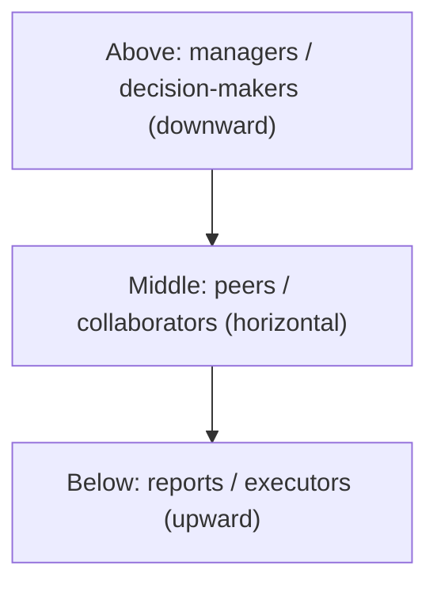
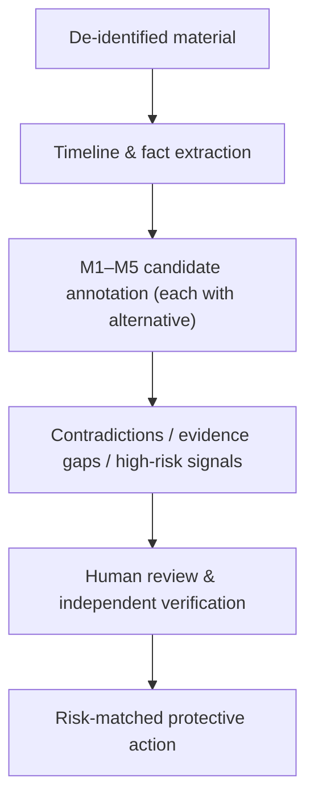

# 职场人际风险分析协议：从权力结构到权责与职业安全

**版本：** 0.1（preprint）
**日期：** 2026-08-14
**类型：** 研究设计与协议论文（research design / protocol paper）

## 摘要

职场冲突很容易被表达成一个"看穿对方"的问题：这个领导是不是不行、这个同事是不是在构陷我、这个合作方是不是故意使坏。本文主张这个目标既不可靠也无必要。人类与 AI 都无法从沟通记录中可靠地推断他人动机或人格；真正可以核验的是互动结构——谁掌握信息、谁有权决定、责任流向哪里、风险由谁承担。本文把分析对象从"一个人"转为"一段互动、结构位置与风险承担"，并提出一个职场人际风险分析协议：以安全行动为目标的材料组织与风险标注框架。

协议的核心是把分析拆成两条彼此分离的轴：**内容轴**（诉求与需要、自我叙事与价值、关系学习与触发条件、互动风险与脆弱性、关系脚本与下一步，即 M1–M5）与**判断轴**（事实、假设、行动）。任何推断都必须带证据摘录与替代解释；任何无法被新信息证伪的叙述不得进入报告。职场特有的分析维度包括：**上中下三层级的安全**（来自上级、平级与下属的风险）、**纵向权力结构**（谁掌握绩效、晋升、信息与资源）、**横向竞争**（信息权、声誉权、资源权的争夺）、**权责错位**（责任与权力分离、甩锅与担责模式）、**职业安全**（欺凌、职业不安全感）、**职业发展**（承诺与兑现的差距、被"卡住"）与**职业心理健康**（工作要求-资源失衡）。

本文同时界定 AI 的恰当位置：作为结构化副驾驶，负责去标识、时间线抽取、候选标注、矛盾与证据缺口检查，以及风险匹配的保护动作；不作为人格判官，不输出"这个领导是自恋型人格""这个同事在构陷你"这类定性判断，不生成试探、诱导、报复或操控策略。本文是研究设计与协议论文，不报告模型效果。它与姊妹篇《人际风险分析协议：从关系材料到事实、假设与行动》共享 M1–M5 核心、事实/假设/行动分离与 AI 副驾驶边界，但针对职场的结构位置与系统维度展开。

**关键词：** 职场风险；三层级安全；权力结构；权责不对等；职业安全；职业发展；职业心理健康；AI 辅助；人机协作

## 1. 问题：为什么职场冲突不能靠"看穿对方"

人们面对一段职场冲突时，最常见的提问方式是"这人是不是故意针对我""这个领导是不是不行"。这个问法有三个结构性缺陷。

第一，它要求从有限材料中得出一个难以核验的结论。绩效、职级、晋升记录可以通过组织渠道核验，而"对方到底是不是故意的"无法通过任何渠道确认。第二，它把结论二值化——好领导/坏领导、善意/恶意——而职场风险是结构性的：一个正常的管理系统也可能让特定位置的人承担不成比例的风险。第三，它会锁定当事人的注意力在"证明对方是坏人"上，而真正可保护的资源是记录、信息、声誉与选择权。

欺骗研究同样不支持"看穿"的目标。德保罗等人（DePaulo et al.）对欺骗线索的元分析显示，可观察的言语与身体线索与欺骗之间的关联很弱，且高度依赖情境[5]。这意味着，无论人类还是 AI，凭"感觉"或"措辞"判断对方是否在撒谎、是否构陷，都缺乏稳定的实证基础。

因此，本文的研究问题不是"AI 能否看穿职场里的谁"，而是：**AI 能否帮助当事人把沟通记录中的事实、假设、矛盾、结构位置与下一步行动分开，同时降低过度推断和隐私泄露？** 更一般地，一套可审阅的协议能否让职场风险讨论变得更诚实、更可反驳、更以保护记录、信息与选择权为目标？

本文不报告模型效果，不提供心理或医学诊断，也不构成劳动仲裁、诉讼或职业建议。

**本文提出的是什么，不是什么。** 为避免误解，先明确本协议的类型与边界。本文提出的是一套**分析协议（protocol）**，而非人格模型、组织诊断工具或"识人算法"。它的输入是一段去标识的职场沟通材料（邮件、消息、会议纪要或互动复盘），输出是一组**可被人类审阅、反驳与合入时间线的结构化标注**，而不是对"这个领导是什么样的人"的判定。协议由三部分组成：(1) 分析单位的界定（§3.1）；(2) 内容轴 M1–M5 与判断轴"事实/假设/行动"的分离（§3.2）；(3) 从材料到保护动作的方法论流程（§4）。它能否成立，取决于第 6 节的五项可检验预测能否在评估中被证伪——而不是取决于它读起来是否合理。协议中的核心术语定义如下：**事实**指可被独立核验、附有证据摘录的陈述；**假设**指当前材料不足以证实、必须附带至少一种替代解释的推断；**行动**指在当前风险判断下应执行的保护性步骤；**证据摘录**是标注所依据的原文片段，缺失则推断自动降级；**替代解释**是与当前假设竞争、但同样能解释证据的另一种可能（如"信息同步流程本身有问题""对方在压力下推责"）；**置信度**是审阅者对"当前材料支持该推断的程度"的显式估计，它不表示"对方是坏人的概率"。职场协议还额外区分两类分析对象：**行为模式**（反复发生的可观察行为）与**结构位置**（谁掌握绩效、信息、声誉、资源）。

## 2. 理论资源与边界

### 2.1 为什么职场需要关系分析

职场风险与亲密关系风险共享同一套分析单位（互动、叙事与请求），但有三点区别决定了它需要专门的处理。

第一，**权力是结构性的，不是个人性的。** 菲佛（Pfeffer）在组织权力研究中强调一个常被低估的事实：决定一段职场关系话语权的是谁掌握资源、信息与晋升通道，而不只是谁"气场更强"[1]。越界者不一定需要操纵技巧，只需占据一个让对方难以拒绝的位置。第二，**关系不能轻易"切断"。** 亲密关系可以止损、求助、切断联系；职场关系涉及工资、签证、背调与下一份工作，"走人"本身就是巨大的代价。第三，**组织是局中的"第三者"。** 职场风险不是两人对局——HR、上级的上级、同事都在局里，可能被裹挟、可能失能、甚至可能本来就是共谋的一部分。

### 2.2 现有研究能提供什么、不能提供什么

| 视角 | 可问的问题 | 不可推出的结论 |
| --- | --- | --- |
| 组织权力[1] | 谁掌握资源、信息与晋升通道？权力是否被伪装成"管理风格"？ | "这个人很会操控" |
| 人格暗核心（D 因子）[2] | 是否存在反复欺骗、剥削、蔑视边界和逃避责任的行为模式？ | "这是一个自恋型领导""他/她就是反社会人格" |
| 职场欺凌[3] | 是否存在反复发生的、方向固定的负面对待？ | "一次绩效批评就是欺凌" |
| 职业不安全感[4] | 担忧失去工作是否影响健康与决策？ | "想太多的人才会有这种感觉" |
| 辱虐管理[6] | 绩效与晋升杠杆是否被反复用来施加无法申诉的惩罚？ | "严格管理就是辱虐" |
| 欺凌与排挤（mobbing）[7] | 是否存在群体性的、方向固定的排挤与对抗？ | "一次同事不和就是排挤" |
| 员工沉默[8] | "不发声"是否因为发声被经验性地惩罚过？ | "没意见就是没问题" |
| 心理安全[9] | 团队里能否安全地提问、纠错、异议？ | "氛围好就等于没有风险" |
| 职业高原[10] | 晋升或成长是否长期停滞？承诺与兑现之间是否有差距？ | "没晋升就是被针对" |
| 工作要求-资源[11] | 是否长期高要求而低资源（自主、支持、反馈）？ | "喊累就是能力不行" |
| 欺骗与信任[5] | 行为线索与欺骗之间的关联有多可靠？ | "某个措辞证明对方在构陷" |

### 2.3 边界声明

本研究不把书名当成理论证据。菲佛的《权力：为什么只为某些人所拥有》[1]可以核验；本文只借用其**描述性**论点（权力来自结构性位置），不采用任何**处方性**部分（如何积累与施加权力）。"反社会人格""自恋型领导"在中文语境中既可能指临床诊断，也可能指大众书写，不能作为远程判断的标签。职场欺凌（workplace bullying）与职业不安全感（job insecurity）有明确的实证研究支撑[3][4]，但它们描述的是反复出现的模式与独立的压力源，不能用于给具体个人贴标签。

## 3. 职场人际风险分析协议：M1–M5 与事实/假设/行动分离

### 3.1 分析单位的转变

职场风险分析首先需要决定"分析什么"。如果目标是"判断这个领导是不是不行、这个同事是不是在构陷我"，那么结论几乎必然超出材料能支持的限度。本文因此把分析对象限定为**互动、叙事、请求与结构位置**，而不是作为诊断对象的"人"。四项基本约束：

- 人不是被诊断的对象；**互动、叙事、请求与结构位置**才是被分析的对象。
- 每条输出必须归入"事实、假设、行动"之一。
- 任何高风险信号（人身威胁、违法指令、被要求承担不合法责任）都优先于关系解释，应先留痕、止损与寻求组织外核验。
- 分析结论应能被新信息推翻；无法被证伪的漂亮叙事不应进入报告。

### 3.2 五个模块与输出规则

本文提出 M1–M5 五个模块，作为组织材料与标注风险的通用维度。每一模块都回答一个不同的分析问题，并把输出限制在可审阅、可反驳的形式。与情感篇相同，这里的 M1–M5 是**跨场景通用**的分析维度：

| 模块 | 分析问题 | 分析对象 | 输出规则 |
| --- | --- | --- | --- |
| M1：诉求与需要 | 材料里明确表达的目标是什么？ | 明确表达的目标、归属/安全/认可/自主等需要，以及未被满足时的代价 | 只能写"材料显示"或"可能需要验证"；不把需要等同于弱点 |
| M2：自我叙事与价值 | 一个人怎样讲述自己？ | 如何排序稳定/自由/体面/责任/亲密/成就 | 区分自述、行动与他人评价；不从文风推断人格 |
| M3：关系学习与触发条件 | 哪些经验被反复强调？ | 反复强调的经验、边界、害怕失去的东西，以及在压力下的反应 | 不倒推童年或创伤史；只记录当前材料能支持的关系学习假设 |
| M4：互动风险与脆弱性 | 风险与脆弱性在哪里？ | 不对等、隔离、羞耻/愧疚施压、边界惩罚、身份矛盾、信息或资源请求 | 风险指向行为和结构位置，不指向性别、职业、地域或诊断标签 |
| M5：关系脚本与下一步 | 双方下一步有什么可观察的选择？ | 冲突、修复、承诺、资源分配和求助时，双方可观察的选择空间 | 写成待观察情境与可提问题，绝不写成"此人一定会如何" |

### 3.3 职场场景的适用与边界

职场场景里，M1–M5 各模块都被放进权力更不对称的结构中。亲密关系常涉及排他、承诺与情感依赖；职场则涉及**绩效、晋升、资源分配、信息访问与职业安全**。区别不在于分析单位，而在于结构与风险：上级掌握绩效与晋升，同事掌握信息与声誉，系统掌握记录与解释权。因此，职场场景的风险标注必须同时记录**结构位置**与**行为模式**，而不是只盯着"这个人说话有没有压迫感"。

### 3.4 纵向权力：权力如何被伪装成管理

职场里最常见的风险形态是**上下级之间的权力不对等**。上级掌握绩效、晋升、关系网络与资源分配，这种杠杆让越界行为可以被包装成"管理风格""工作要求"或"为你好"。菲佛指出，这种位置差异本身就是权力的来源[1]。

实证研究为此提供了克制而可靠的锚点：穆萨曼等人（Moshagen et al.）提出"人格暗核心"（dark core of personality, D）——一个解释自恋、精神病态与马基雅维利主义共同变异的维度，其核心是对他人工具化与自视可以凌驾于规则之上的倾向[2]。但 D 因子恰恰是 M4 输出规则的一个实证理由：它是一条连续光谱（从日常自私到临床极端），强调"反复出现的跨情境行为模式"而非任何单次事件的标签。把它用于职场，意味着问"对方是否**反复**把责任推给他人、在无回报时撤回支持、或把边界诉求说成软弱"——而不是问"这是不是一个自恋型领导"。后一种问法无论结论如何，都超出材料能支持的范围。

### 3.5 横向竞争：竞争、抢功与构陷的识别边界

职场里另有一类风险不来自上下级权力，而来自**协作伙伴或合作方之间的横向对抗**：恶性竞争、抢功抢汇报、合作方对抗情绪、把责任和过错构陷到他人头上。这类问题同样可以用沟通记录来识别，但它与纵向场景有一个关键区别：**没有直接的上下级权力，却有三种权力的变体——信息权（谁掌握关键信息与汇报渠道）、声誉权（谁的评价被采信）、资源权（谁决定合作能否继续）**。谁在沟通过程中垄断了向决策者传递信息的通道，谁就实质上掌握了这场横向竞争的主动权。

但这里有一条必须先划清的边界。**"恶意构陷"是一个动机判断，而沟通记录只能支撑行为模式。** 从字面上看，"抢汇报"、对抗情绪、把责任推给他人，与"KPI 本身就是零和的""信息不通畅""对方在压力下推责"可能完全无法区分。因此，本节的分析目标不是"从记录里判断对方是坏人"，而是**列出可核验的行为指标，并强制先穷尽替代解释**。

从沟通记录中可以识别、也应当标注的行为指标包括：

- **汇报与信息通道：** 关键决策的汇报是否被绕开、被抢先、或被截断？关键信息是否被延迟送达、选择性送达，或送达时已附加了对某方的负面定性？
- **责任归属的反复转移：** 出问题后，责任是否被系统性地、不基于事实地转移到固定一方？是否在转移时同步贬低对方能力或动机？
- **措辞升级与情感化标签：** 讨论具体问题是否被反复替换为对个人（"他不行""她不负责任"）而非行为（"这个交付延迟了，因为…"）的定性？是否用"大家都觉得"这类无法核验的群体背书来强化指控？
- **排除对方于关键场合：** 对方是否反复被排除在重要会议、决策、信息同步之外，而同时被要求为这些场合产生的结果负责？
- **边界惩罚：** 对方提出边界或异议后，是否立刻遭遇报复性举措——被边缘化、被质疑动机、被暗示"不合群"或"不配合"？

这五项指标都必须落到**可指认的事实**（哪条消息、哪个场合、哪份记录），都必须配**至少一种替代解释**（"可能是工作分配本身就不合理""可能对方真的不擅长沟通""可能信息同步本来就有问题"），并标注**需要的独立证据**（会议纪要、邮件收发记录、决策文档的时间线）。只有当同一模式**反复出现**且替代解释逐一被排除时，才值得上升到黄档或红档处置——而不是因为一次情绪化的措辞就下结论。

### 3.6 权责错位：甩锅、担责与职业安全

职场风险的第三种形态不在横向竞争，而在**上下级之间的权责不对等**：上级掌握资源与解释权，却可以把自己的责任下移给下属，同时把下属的功劳上收。当"谁负责"与"谁有权决定"脱节时，风险就从行为问题升级为结构性制度问题。这类风险有两个可核验的维度：

**第一，甩锅与担责的模式。** 出问题后，责任是否总是流向固定方向（通常是资历浅、权力小、无法反驳的一方）？功绩是否总是上收给决策方？决策是否在没有记录、口头传达、事后不可追责的情况下作出，而执行者却被要求为结果负责？这类模式的关键不在于单次事件，而在于**方向是否固定、是否与权力一致**——当"担责"和"有权决定"持续落在不同的人身上，就是权责不对等的可识别信号。

**第二，职业安全与风险告知。** 当工作要求让下属承担职业风险（背锅、被追责、被边缘化）而得不到与风险匹配的保护时，属于这一类。实证研究反复显示：职场欺凌（workplace bullying）与心理健康问题之间存在稳定关联，且这种关联跨横断面与纵向研究都存在——欺凌不只是一次不愉快的冲突，而是反复发生的、方向固定的负面对待[3]。反过来，**职业不安全感**（job insecurity）本身就是一个独立的压力源，它会影响健康与工作表现，而与被边缘化、被威胁等具体事件无关[4]。这给协议一个明确含义：**"担心失去工作"不应被当作"想太多"，它本身就是值得纳入风险评估与保护动作的事实。** 孤立地看，一次绩效谈话或一次责任指认无法判断是否构成系统性欺凌；但当反复发生、方向固定、且当事人感受到职业不安全时，就满足 §4.3 的"反复组合"标准。

### 3.7 大组织的系统性维度：职业化、信息差与角色型霸凌

前几节的处理对象多是**个人或关系对**。但职场风险经常不是某个人造成的，而是**组织系统**本身的结构性产物。大组织尤其如此，有三个容易被当成"正常管理"、实则构成系统性风险的特征：

**第一，信息差是结构性的。** 在大组织里，"谁掌握信息"由角色和层级决定，而不是由个人意愿决定。下级通常无法核实上级依据什么信息做决策，也无法知道自己的汇报是否被如实传达。菲佛把这种位置差异视为权力的来源[1]；对风险分析而言，它意味着——当关键决策的依据无法被当事人核实，且这种不可核实是常态而非例外时，就应标记为"需要独立核验的缺口"，而不是默认"组织自有道理"。

**第二，"职业化"和"系统稳定性"可能成为回避个体的语言。** 大组织常以"这是职业化的做法""要保障系统稳定""从全局看这是合理的"来为结构性安排辩护。这些话有时是合理的，有时正是替代解释纪律要挑战的对象：**一个保护系统稳定性的决策，和让某人替系统背锅、让某人被牺牲的决策，在措辞上无法区分。** 区分它们的，不是措辞本身，而是是否对个体留下了**可核验、可申诉、可拒绝**的出口。

**第三，管理角色可以被当成霸凌的工具。** "管理角色霸凌"指的不是某个性格差的领导，而是**利用角色赋予的权限（绩效、排班、资源分配、汇报路径）来系统性贬低、排除或威胁下属**，且因为行为与"管理职责"表面重合而难以被识别。这一点与职场欺凌研究[3]中"反复发生、方向固定的负面对待"一致：单次绩效批评不是霸凌，但当绩效工具被反复用来施加无法申诉的惩罚、把下属固定在弱势位置上，就进入了权责不对等与欺凌谱系。

这三者给协议一条共同的原则：**系统性风险不能靠分析单个人解决，但它可以靠标注结构位置、信息缺口与可申诉性来解决。** 当一次冲突里，一方天然掌握信息、一方天然无法核实、且系统把"稳定"置于个体之上时，风险标注应同时记录这三件事——然后落到 §4 的行动：留痕、走正式渠道、寻找组织外的独立核验。

### 3.8 职场安全的三层级：来自上方、平级与下方的风险

把前三节合起来看，一个更完整的地图出现了：**职场安全不是单一方向的，它来自上中下三个层级。** 这一视角可以避免一个常见偏差——只盯着"领导是不是坏人"，而漏掉平级与下方的风险。三个层级各有其典型问题与证据形态：

| 层级 | 方向 | 典型问题 | 关键文献 | 核心风险信号 |
| --- | --- | --- | --- | --- |
| 上：上级/决策方 | 向下 | 辱虐管理、越权管理、甩锅、绩效工具滥用、要求承担不合法责任 | 辱虐管理综述[6]；职场欺凌[3] | 绩效与晋升杠杆被反复用来施加无法申诉的惩罚；责任流向固定方向 |
| 中：同级/协作方 | 横向 | 恶性竞争、抢功、信息截断、构陷、排挤（mobbing） | 职场欺凌与排挤综述[7] | 信息与声誉权的争夺；群体性排挤；边界惩罚 |
| 下：下属/执行方 | 向上 | 向上越界、下属的沉默与失声、执行层信息失真 | 员工沉默研究[8] | 下情无法上达；异议被压制；信息在传递中失真 |



三个层级里，"来自下方"的风险最容易被忽略，也最值得单独说明。**员工沉默（employee silence）**研究指出：员工不发声，往往不是因为没有问题，而是因为发声被经验性地惩罚过——被冷落、被贴"不配合"标签、被排除在关键场合之外[8]。当一个人"选择沉默"，这本身就是一项需要被纳入风险标注的事实，而不是"他没什么意见"。心理安全（psychological safety）研究从正面给出了同一件事的另一面：在心理安全的团队里，成员才敢于提问、承认错误、提出异议——这种安全感正是对抗三个层级风险的基础[9]。

三层级模型对分析的实际价值是**强制补全**：当材料里只有"上级 vs 我"时，协议应追问"平级那里有没有同类模式""下属那里有没有失声信号"；当材料里只有"我和同事"时，应追问"这个结构里谁有权决定、谁在承担风险"。这也让 §4 的结构位置图（谁掌握绩效、信息、声誉、资源）有了明确的分层骨架。

### 3.9 职业发展：风险不只是"被伤害"，也包括"被卡住"

职场风险不全是冲突与伤害，还包括**发展停滞**。当职业发展被操纵性地延迟、阻断或扭曲——例如以"还不到时候"无限期推迟晋升、用"培养你"为名长期承担无回报的高强度工作、把承诺的成长机会反复架空——这同样是一种可标注的关系风险，且往往与前三节的权力结构叠加出现。

职业高原（career plateau）研究梳理了四十年证据：当个体感知到晋升或成长不再可能时，会出现工作满意度、投入度与留任意愿的下降[10]。它提醒协议一个要点：**"被卡住"是一个主观感知，但它可以由客观信号支撑**——承诺与兑现之间的差距、晋升标准的不透明、成长机会被反复安排给特定人群。这些信号和甩锅、构陷一样，都应符合证据摘录、替代解释与独立证据的标注纪律。

对 M1–M5 而言，职业发展主要落在 **M1（诉求与需要：成长、认可、自主）**与 **M5（关系脚本与下一步：承诺、资源分配）**。一个可证伪的问题是：**"组织对职业发展的承诺，是否有明确的时间表、标准与兑现记录？"** 没有记录、不可核验的"以后会有的"，与有记录、可核验的发展计划，在风险上完全不同。

### 3.10 职业心理健康：当工作伤害的不只是工作

工作-健康研究为协议提供了最扎实的实证基础之一。**工作要求-资源模型（job demands–resources, JD-R）**认为：所有工作都可以分为工作要求（负荷、冲突、不确定性）与工作资源（自主、支持、反馈），当长期高要求而低资源时，耗竭与脱离便随之而来[11]。这给协议一个明确含义：**评估一段职场关系时，"这个人让我持续高强度、无支持、无反馈、无自主"不是软性抱怨，而是有实证后果的耗竭信号。**

心理安全[9]、职场欺凌[3]与职业不安全感[4]的研究进一步说明：这些不是"心理脆弱的人才会遇到的事"，而是**组织结构与互动模式的可测量产物**。它们的影响跨横断面与纵向研究都存在，且职业不安全感本身就是一个独立于具体事件的压力源[4]。

因此，职业心理健康在本协议里不是附加的"关怀章节"，而是与 §3.4–3.8 并列的风险维度：**它把"我最近状态很差"从一个难以核验的感受，转成一组可标注的信号（要求/资源比、支持缺失、无反馈、无自主、安全感下降），并给出可执行的保护动作（寻求支持、降低暴露、正式化、向外核验）。**

## 4. 方法论：事实 → 假设 → 核验 → 行动

### 4.1 建立时间线

保留日期、原话、事件、请求、承诺、失约、决策和留痕节点。每条记录只写可指认的事实；"很会甩锅""就是针对我""一定在构陷"另列为解释，不能混进时间线。时间线是让后续所有标注可指认、可复核的基础。在职场场景里，还要额外追问：**哪些事实留下了记录、谁有权让记录不存在。**

### 4.2 M1–M5 标注

每条标注包含七个字段：`证据摘录`、`模块`、`解释假设`、`反例/替代解释`、`置信度`、`需要的独立证据`、`保护性行动`。任何没有证据摘录和替代解释的推断，自动降级为"不可用"。替代解释不是形式要求，而是对抗过度推断的主要机制：一个假设如果有且只有一个解释，它通常不是假设，而是偏见。

### 4.3 关注模式与代价，而不是单句"话术"

单次绩效批评、一次情绪化的邮件或一次失约都不足以说明风险。应当寻找反复组合：责任反复向固定方向转移、边界诉求被反复贬低为"不配合"、关键信息反复被延迟或截断、以及职业安全感持续受损。然后画出**结构位置**：谁掌握绩效与晋升、谁掌握信息与汇报渠道、谁承担风险、谁获得功劳？结构位置图比单句分析更能揭示系统性的不对等。

### 4.4 设计可证伪的检查

不问"这个人是不是故意针对我"，而问能产生新事实的问题：

- 关键决策是否有书面记录，依据是否可核实？
- 绩效或责任指认是否有明确的标准，是否适用同样的标准于所有人？
- 对异议或边界诉求的回应，是否留有可申诉、可拒绝的出口？
- 当事人能否在不被惩罚的前提下，把情况告诉组织内的第三方（HR、上级的上级）或组织外的独立核验渠道？

这些问题的共同点是：它们不依赖对他人动机的推断，只依赖可核验的流程与记录。正因为如此，它们可以被证伪，也可以被满足——这正是区分"风险"与"偏见"的试金石。

**判定阈值。** 为避免"看起来通过了"的模糊判断，把每个问题简化为"是/否/无法判断"三值，并按以下规则更新风险等级：

- 四个问题在合理观察窗口内**全部持续为"是"**，且未出现新的高风险信号 → 风险维持当前等级，可继续记录。
- 任一问题转为**"否"**，或出现"无法判断"且对方拒绝提供可核验的流程与记录 → 风险上调一档（绿→黄，黄→红）。
- **"无法判断"本身不默认安全**：如果一项本可通过正式渠道核验的事实，反复无法核验且理由不断变化，按"否"处理。

这条阈值把"可证伪的检查"从原则变成可操作的规则，也是第 6 节预测三、预测四得以检验的基础。

### 4.5 按风险决定行动

| 风险等级 | 典型条件 | 行动 |
| --- | --- | --- |
| 绿 | 一般沟通困惑；权责清晰，有记录可核验 | 继续沟通，记录后续行动是否一致 |
| 黄 | 权力不对称下的反复越界、信息被截断、权责错位或职业不安全感上升 | 留痕，走正式渠道，向组织内的第三方或组织外的渠道复述事实 |
| 红 | 人身威胁、违法指令、被要求承担不合法责任、系统性欺凌 | 立即停止参与，保存证据，联系组织内正式渠道与外部法律/劳动机构 |

职场红档的处置与情感场景不同：这里的目标不是"切断联系"（那可能代价极大），而是**留痕、正式化、寻求组织外核验**——把风险从"个人对个人"转成"可被第三方审查的记录"。

## 5. AI 的位置：结构化副驾驶，而不是人格判官

### 5.1 用途边界

AI 的可取用途是减少遗漏、让假设显式化，并帮助用户从强情绪中回到可检查的材料。它不应输出"这个领导是自恋型人格""这个同事在构陷你""这个人是反社会人格"这样的判断，更不能生成试探、诱导、报复或操控策略。这条边界的理由不只是伦理，也是实证：可观察线索不足以支撑这类判断[5]。

### 5.2 安全工作流



去标识是第一步，不是可选项：输入前应删除姓名、联系方式、精确地点、工作单位、账号、证件和私密内容。AI 输出只能作为讨论提纲，不能替代 HR、法务、律师、劳动仲裁机构或心理专业人员的判断。

### 5.3 输出契约

建议每个模型输出遵循以下结构，使其可被人类审阅、反驳与合入时间线：

```yaml
claim: "该项目的问题被反复归因于执行方，而决策记录缺失"
type: fact | hypothesis | action
module: M1 | M2 | M3 | M4 | M5
evidence: ["2026-08-01 会议纪要缺失…", "2026-08-05 邮件原文…"]
alternative_explanations: ["信息同步流程本身有问题", "对方可能在压力下推责"]
unknowns: ["决策是否有书面记录", "是否对其他人也适用同样标准"]
risk: green | yellow | red
recommended_action: "补会议纪要；向项目干系人确认决策依据；保留邮件"
```

### 5.4 可复用提示词

> 以下是已经去标识的职场沟通材料。请将其作为有限证据，而不是人格或动机诊断。请按 M1–M5 输出：每项给出原文事实、最多三种待验证解释、至少一种替代解释、缺失信息与保护性下一步。请按上中下三层级（上级、平级、下属）分别检查风险信号，并特别标出反复出现的责任转移、信息截断、边界惩罚、权责错位、职业安全感受损、发展承诺落空与工作要求-资源失衡。不要生成操控、试探、诱导、报复或"拿捏"他人的建议。若出现人身威胁、违法指令或被要求承担不合法责任，优先输出留痕、止损与寻求组织外核验的动作。

## 6. 研究计划与评估

下一版应把框架变成可评估的研究原型，而不是直接上线"职场霸凌判定"：

1. **标注规范：** 定义 M1–M5 的边界、事实/假设/行动三类标签、红线触发项（人身威胁、违法指令、系统性欺凌）与不允许输出的诊断词。
2. **合成与公开数据验证：** 先在公开的职场冲突/欺凌语料与人工编写的无害情境中测试格式稳定性；不使用未授权的组织内部数据训练。
3. **人工一致性：** 让多位审阅者对同一材料的事实和风险项标注，测量一致性；分歧应保留，而不是被模型"裁决"。
4. **安全评估：** 测试模型是否会过度诊断、将正常管理误报为欺凌、泄露输入中的敏感信息，或生成报复性建议。
5. **效用评估：** 衡量用户是否更容易发现缺失信息、识别结构位置、走正式渠道与及时留痕；不以"AI 识人准确率"作为唯一目标。
6. **三层级与全谱覆盖评估：** 检验协议是否能从单方材料中补全上中下三层级风险信号，且能同时覆盖冲突（伤害）、发展（停滞）与心理健康（耗竭）三个维度；避免"只看见上级、看不见平级与下属"或"只看见冲突、看不见耗竭"。

### 五项可检验预测

**预测一：协议化标注比自由评价更可复现。** *机制。* 要求证据摘录与替代解释的标注，把主观印象转化为可指认的记录。*可检验预测。* 多位审阅者对同一材料做 M1–M5 标注，其事实项与红/黄/绿风险分类的一致性，应显著高于自由书写的职场评价。*边界。* 一致性不意味着正确；分歧本身是有价值的信号，应保留而非消除。

**预测二：替代解释要求降低"构陷误报"。** *机制。* 强制"至少一种替代解释"使模型和人都不能只停留在"对方在使坏"上。*可检验预测。* 在无害情境（正常管理冲突、普通 KPI 压力）中，带替代解释要求的输出把正常管理误报为恶意竞争或欺凌的比例，应低于无约束的诊断式输出。

**预测三：结构位置分析能区分风险与偏见。** *机制。* "谁掌握绩效、谁掌握信息、责任流向哪里"只依赖可核验的结构事实。*可检验预测。* 结构位置指标与后续实际冲突升级的相关性，应高于对对方人格的主观评价与后续风险的相关性。

**预测四：可申诉性是可证伪的试金石。** *机制。* 区分"系统决策"与"系统牺牲个体"的不是措辞，而是是否留有可核验、可申诉、可拒绝的出口。*可检验预测。* 当流程留有可申诉出口时，当事人后续风险显著低于无出口时；这一项可用合成情境做对比测试。

**预测五：工具改变的是当事人的留痕与求援行为，而不只是判断。** *机制。* 效用目标不是让 AI 更准，而是让用户更容易发现信息缺口、走正式渠道、留痕与寻求组织外核验。*可检验预测。* 使用该工作流的用户，在受控模拟中比不使用工具的用户更早留痕、更少在高压下签署有损自身权益的承诺。

这五项预测都可以在评估任务中检验。任何一项被否证，都意味着协议需要修改；这正是把它称为"协议"而不是"结论"的原因。

## 7. 有效性威胁与研究边界

第一，本文的材料以公开研究与管理类著作为主，无法代表真实组织内部对话的分布。第二，职场欺凌与职业不安全感研究多来自西方样本，与中文职场文化存在迁移距离[3][4]。第三，本文从组织研究推导出协议，推导本身需要用混合方法验证，包括标注一致性、用户访谈与安全审计。第四，AI 能力变化很快，文中对模型角色的描述不依赖任何具体模型，也刻意不给出"识人准确率"这类指标。第五，隐私与用工合规是核心约束而非附加项：任何原型都必须是本地优先的，默认拒绝未授权的数据使用。

## 8. 结论

职场人际风险分析的困难，不在于看懂某个人，而在于看清结构：谁掌握信息、谁有权决定、责任流向哪里、风险由谁承担。本文的协议把这些结构因素拆成证据、假设、反例、核验和行动——对纵向权力，它区分"管理"与"伪装成管理的越界"；对横向竞争，它区分"竞争"与"构陷"；对权责，它区分"合理的系统决策"与"让个体替系统背锅"。

这仍是一项未完成的研究设计。它需要经过书目核验、标注协议、隐私与用工合规审查和真实的人工评估，才有资格讨论任何模型效果。但在那之前，它已经可以做到一件事：让人与 AI 都学会说"这是材料显示的"、"这是需要验证的"和"这是此刻该做的"，而不是"他就是故意的"。

## 参考文献

1. Pfeffer, J. (2010). *Power: Why Some People Have It—and Others Don't*. New York: HarperBusiness. 中文版：《权力：为什么只为某些人所拥有》，杨洋 译，浙江人民出版社，2015，ISBN 9787213067662。本文仅借用其**描述性**论点（权力来自结构性位置而非仅个人特质）来理解风险如何被权力不对称放大；不采用书中任何处方性、教人获取或施加权力的建议。
2. Moshagen, M., Hilbig, B. E., & Zettler, I. (2018). [The dark core of personality](https://doi.org/10.1037/rev0000111). *Psychological Review*, 125(5), 656–688. 提出统一的"人格暗核心"D 因子，覆盖自恋、精神病态与马基雅维利主义；本文据其"跨情境行为模式、连续光谱"的界定，把职场人际风险限制在行为模式而非诊断标签。
3. Verkuil, B., Atasayi, S., & Molendijk, M. L. (2015). [Workplace bullying and mental health: A meta-analysis on cross-sectional and longitudinal data](https://doi.org/10.1371/journal.pone.0135225). *PLoS ONE*, 10(8), e0135225. 显示职场欺凌与心理健康问题之间存在跨横断面与纵向研究的稳定关联。
4. Cheng, G. H.-L., & Chan, D. K.-S. (2007). [Who suffers more from job insecurity? A meta-analytic review](https://doi.org/10.1111/j.1464-0597.2007.00312.x). *Applied Psychology*, 57(2), 272–303. 显示职业不安全感本身是独立的压力源，影响健康与工作表现。
5. DePaulo, B. M., Lindsay, J. J., Malone, B. E., Muhlenbruck, L., Charlton, K., & Cooper, H. (2003). [Cues to deception](https://psycnet.apa.org/record/2002-11678-004). *Psychological Bulletin*, 129(1), 74–118. 元分析显示可观察线索与欺骗之间的关联很弱；本文据此限制一切"看穿对方"的主张。
6. Tepper, B. J., Simon, L., & Park, H. M. (2017). [Abusive supervision](https://doi.org/10.1146/annurev-orgpsych-041015-062539). *Annual Review of Organizational Psychology and Organizational Behavior*, 4, 123–152. 辱虐管理的系统综述；本文据此说明"利用角色权限施加惩罚"的纵向风险。
7. Branch, S., Ramsay, S., & Barker, M. (2012). [Workplace bullying, mobbing and general harassment: A review](https://doi.org/10.1111/j.1468-2370.2012.00339.x). *International Journal of Management Reviews*, 15(3), 280–299. 职场欺凌与群体性排挤（mobbing）的综述；本文据此说明横向排挤与群体性对抗。
8. Donaghey, J., Cullinane, N., Dundon, T., & Wilkinson, A. (2011). [Reconceptualising employee silence](https://doi.org/10.1177/0950017010389239). *Work, Employment and Society*, 25(1), 51–67. 员工沉默研究；本文据此说明"不发声"本身是一项需要纳入标注的事实。
9. Edmondson, A. C. (1999). [Psychological safety and learning behavior in work teams](https://doi.org/10.2307/2666999). *Administrative Science Quarterly*, 44(2), 350–383. 心理安全研究；本文据此说明可提问、可纠错、可异议的环境是对抗三层级风险的基础。
10. Yang, W.-N., Niven, K., & Johnson, S. (2018). [Career plateau: A review of 40 years of research](https://doi.org/10.1016/j.jvb.2018.11.005). *Journal of Vocational Behavior*, 110, 286–302. 职业高原综述；本文据此说明"被卡住"可由承诺-兑现差距等客观信号支撑。
11. Bakker, A. B., & Demerouti, E. (2016). [Job demands–resources theory: Taking stock and looking forward](https://doi.org/10.1037/ocp0000056). *Journal of Occupational Health Psychology*, 22(3), 273–285. 工作要求-资源模型；本文据此说明长期高要求-低资源是耗竭的信号而非软性抱怨。

## 作者信息与声明

**作者：** Liyuk

**利益冲突：** 作者声明无利益冲突。本研究未受任何商业机构资助，未使用任何涉及真实组织或当事人隐私的数据进行训练或评估。

**数据可用性：** 本文是研究设计与协议论文，不报告新的实验数据。本文引用的公开研究与行业资料均已在参考文献中列出；职场欺凌与职业不安全感等结论来自已发表的元分析，不构成对任何具体组织或个人的判断。

## 术语表

| 术语 | 定义 | 在本文中的角色 |
| --- | --- | --- |
| 职场沟通材料 | 一段去标识的邮件、消息、会议纪要或互动复盘 | 协议的输入 |
| 分析单位 | 互动、叙事、请求与结构位置，而非作为诊断对象的"人" | 决定分析什么（§3.1） |
| M1–M5 | 内容轴的五个模块（与情感篇共享） | 组织材料与标注风险的维度（§3.2） |
| 事实 | 可被独立核验、附有证据摘录的陈述 | 判断轴之一 |
| 假设 | 当前材料不足以证实、必须附带至少一种替代解释的推断 | 判断轴之一 |
| 行动 | 在当前风险判断下应执行的保护性步骤 | 判断轴之一 |
| 证据摘录 | 标注所依据的原文片段 | 缺失则推断自动降级（§4.2） |
| 替代解释 | 与当前假设竞争、但同样能解释证据的另一种可能 | 对抗过度推断的主要机制（§4.2） |
| 置信度 | 审阅者对"当前材料支持该推断的程度"的显式估计 | 不表示"对方是坏人的概率" |
| 行为模式 | 反复发生的可观察行为 | 职场分析对象之一 |
| 结构位置 | 谁掌握绩效、信息、声誉、资源 | 职场分析对象之一（§3.3） |
| 三层级安全 | 来自上级、平级与下属的风险 | 职场安全地图（§3.8） |
| 权责错位 | 责任与权力分离：担责者与有权决定者不同 | 甩锅、担责与职业安全（§3.6） |
| 工作要求-资源失衡 | 长期高要求而低资源（自主、支持、反馈） | 职业心理健康的耗竭信号（§3.10） |
