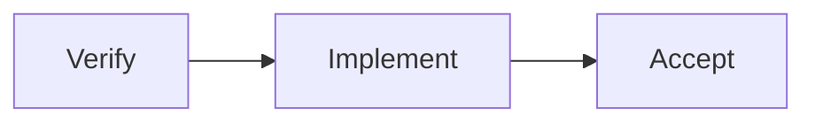

> This article is an expansion of the "context" thread in [Management Retrospective](/writing/2026/08/management-retrospective/).

Writing a document is not dumping out everything you know. A genuinely useful document lets someone who wasn't involved in the background quickly understand: why this thing needs to be done, how you plan to do it now, and where I need to weigh in with judgment.

So I prefer to think of a document as a collaboration interface. It is not an archive, not reporting material, and not a way to look like a lot of thinking happened; its job is to hand off the problem, the conclusion, and the next step clearly.

## In the AI era, documents are more like context, memory, and evidence

This becomes more explicit in AI collaboration. A human can fill in missing background with one chat, or vaguely remember "why we decided this back then"; an Agent cannot. It works only with whatever context it is given. If the context has no boundaries, it will guess; if there is no record of past decisions, it will rehash the discussion; if there is no evidence, it will write speculation that looks a lot like fact.

A good document therefore plays at least three roles:

- **Context:** give a later person or an Agent a context small enough to be manageable but complete enough to start working. The problem, scope, current state, and next step should be clear; don't stuff in all the irrelevant history.
- **Memory:** record the key decisions already made — especially "why we didn't choose the other option" and "which constraints are temporary". Otherwise, when a different person or a different session takes over, already-solved problems get discussed all over again.
- **Evidence:** distinguish fact, speculation, and conclusion, and leave sources for the data, experiments, code, or feedback. A document without evidence easily becomes, after a few retellings, a phrase no one can verify: "everyone thinks so".

Handing off between people and collaborating among multiple Agents are fundamentally the same problem: the person who originally knew the context is no longer present, and the successor has to recover the correct judgment within limited time. The only difference is that the former's successor is a colleague, while the latter's may be another model, another session, or an Agent responsible for a different subtask.

So don't write documents as hints for people who already know. Implicit premises that work for humans become missing information the moment an Agent reads them; conversely, the explicit input, state, and evidence you prepare for an Agent also makes handoffs between people much smoother. A good document doesn't make the context endlessly longer — it keeps only the content that will actually affect the next step.

Below is a basic structure I apply first myself. Not every document has to follow it in full, but it's far more reliable than starting from a blank page.

## Give the conclusion first, then the story

Many documents open with a long background, and by the third screen you still don't know what the author is trying to do. When a reader opens a proposal, the three things they most want to know are:

1. What problem is this document solving?
2. What do you suggest doing about it?
3. What do you want me to do after reading it?

If these three things aren't clear, even the most complete material that follows will be hard to read effectively. Put a short summary right at the start: what the problem is, what the recommended approach is, and what still needs to be confirmed by whom. It's not that background and process shouldn't be written — they go after the conclusion, for those who need to understand.

For example, don't write:

> Recently we ran into some problems in a certain direction, and after a period of discussion and research, we found there's quite a bit of room for optimization.

Instead, write directly:

> The current release pipeline requires manually re-checking three environments; an average release takes about twenty minutes, and it's easy to miss a configuration. I suggest first consolidating the checks into a single automated check; this week we need to confirm whether it covers the two special release scenarios.

The former has only mood and process; the latter gives the problem, the impact, the plan, and the points to discuss.

## A proposal document usually has these sections

### 1. Background: only the facts necessary to understand the problem

Background is not a project chronicle. Just write clearly what happened, why it needs handling now, and who is affected.

If the background contains data, user feedback, or failure symptoms, give the source and time range where possible; if something is only speculation, label it as speculation. Mixing facts and judgments together is one of the most common reasons later discussion goes off track.

### 2. Goals: turn "wanting to do it well" into a result you can judge

Goals should answer: once it's done, what will be different?

A practical approach is to give both the goals and the non-goals. For example:

- Goals: replace the manual pre-release checks with automated validation, and clearly point out any failures.
- Non-goals: don't rebuild the whole release platform this time, and don't handle exception flows that require manual approval.

Non-goals matter. They prevent everyone from casually stuffing in the issues they care about, and turning a small, doable project into a huge one that can never get started.

### 3. Approach: explain how to do it and why

The approach doesn't need to go into implementation details from the start. First make the core path clear: what the input is, which key steps it goes through, and what the output or change is. When the flow is complex, a diagram or a table is usually more effective than several long paragraphs.

Then add the details that actually affect decisions:

- what alternatives exist and why this one is recommended;
- what premises it depends on and where the risks are;
- which parts are still unconfirmed and need to be verified first;
- whether the interface, data structures, state changes, or exception paths will affect others.

There's no need to cram in all the technical details just to "look professional". When reviewing an approach, the point is to help people make trade-offs; only at implementation time do you need to write the boundaries, interfaces, and acceptance criteria in detail.

### 4. Plan: break the work down until it can start

A plan isn't a to-do list of dozens of lines. It's enough to state the main stages, dependencies, and completion criteria.

| Stage | Output | Completion criteria |
| --- | --- | --- |
| Verification | Minimal experiment or data check | Key assumptions confirmed or refuted |
| Implementation | A usable core path | Main flow runs, exceptions handled clearly |
| Acceptance | Testing and usage feedback | Meets the pre-defined effect or quality bar |

What's most worth writing in a plan is the uncertainty: what getting stuck would affect what follows, and when to reassess — rather than pretending every date is already fixed.

### 5. Appendix: put details where they're needed

Reference links, term explanations, complete data, expansions of alternatives, and longer research processes can all go in the appendix. The appendix is not a dump; its role is to keep the main text readable while letting those who need to dig deeper find the basis.

If a decision is later changed, add a short change note: what changed, why, and who is affected. There's no need to record every wording polish.

## Balancing the key points and the details

The two most common problems in writing documents are exact opposites: one is all talk, so after reading you still don't know what to do; the other is too much detail, so readers can't find the point.

My criterion is simple: **write first for the people who need to make a decision, then for the people who need to carry it out.**

The former need the conclusion, trade-offs, risks, and requests; only the latter need the interfaces, flows, state machines, data structures, and concrete steps. Layering the two kinds of information lets readers go as deep as their needs require.

Some writing habits also directly affect readability:

- Avoid abbreviations and jargon that you assume everyone understands; when you must use them, explain them the first time they appear.
- Put code in code blocks, not screenshots. Code needs to be copied, searched, and compared.
- Use diagrams and tables only when they explain relationships faster; an architecture diagram with no conclusion is usually just larger decoration.
- Use bold to mark conclusions and risks, not to emphasize every paragraph. When everything is emphasized, nothing is.
- After writing, delete paragraphs that don't move the problem, approach, or decision forward. Deleting much of the "setup" actually makes the piece more honest.

## After writing, check with three questions

Before sending it out, have someone who wasn't in the earlier discussions take a look, or read it yourself after a pause, and answer three questions:

1. Can I say in one minute what problem this document solves?
2. Do I know what the recommended next step is, and why?
3. If I'm going to get involved, do I know at which point to offer an opinion or start acting?

If you can't answer any one of these three questions, the usual fix isn't adding another paragraph of background — it's that the structure hasn't put the key points in the right place.

A document's quality doesn't depend on how many pages it has, or how much its title looks like a template. What it ultimately needs to accomplish is simple: let people guess a little less, and do a little more of the right thing.
