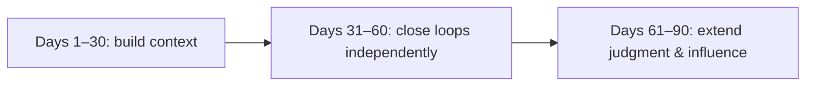

> This article expands on the "Team and Growth" thread in [Management Retrospective](/writing/2026/08/management-retrospective/).

New hires most often get one of two opposite experiences when they join: either they are buried under a long list of materials and tasks without knowing what matters, or they are told "just ask whenever you have questions" but don't know what to ask or what counts as progress. The common problem behind both is that expectations are never made explicit.

This framework does not promise a single mandatory path — specific roles, projects, and personal circumstances vary widely. What follows is only a starting point for turning "good intentions" into "actions that can be checked together."

A good mentoring relationship is not one person arranging the other's career path, nor training a new hire into a copy of oneself. It is a collaboration with goals, feedback, and a gradually shifting division of responsibility: the mentor provides necessary context, judgment, and support; the new hire builds their own judgment and delivery capability through real work. The role of the 90-day plan is to turn this relationship from good intentions into actions that can be checked together.

What is offered here is a general framework, not a substitute for specific roles, projects, and personal circumstances. The plan should be adjusted according to experience, work complexity, and available support, rather than becoming a uniform assessment checklist. The value of the plan lies not in how detailed it is, but in whether both parties can spot deviations, exchange feedback, and change the next step while there is still room to do so.

## A good mentoring relationship usually goes through three stages

### 1. Beginning: establish a shared problem first, instead of immediately assigning tasks

In the first week or two, the mentor's most important job is to understand the boundary between the person and the environment. Through one or several one-on-one conversations, learn what the new hire has already done, where they want to develop, what methods they habitually use when facing unfamiliar problems, and which capabilities the current work most requires them to build first.

This is not about labeling someone "has a solid foundation" or "learns fast." The more useful outcome is to jointly confirm several things:

- What the most important results of the first 90 days are;
- Which things the new hire can decide on their own and which need to be synced first;
- Which contexts, tools, and collaboration relationships need to be filled in;
- How to ask for help and how often to escalate when blocked;
- What evidence to use to judge progress, rather than judging by busyness alone.

For the new hire, there is no need to rush to prove you already know everything in the first week. It is more worthwhile to write down concepts, processes, and acronyms you don't understand, look them up on your own first, and then ask questions together with the thinking you have already done. A good question usually contains the known facts, the paths already tried, and where you got stuck; this saves the other person's time and also lets the mentor see how you are thinking.

### 2. Progress: turn "do more, learn more" into observable practice

The thing to avoid most in development is a vague "practice more." It sounds positive, but it actually says nothing about what to practice, where support comes from, or what level counts as passing.

A more workable arrangement is to write out four parts for each stage:

| Element | Question to answer |
| --- | --- |
| Result | What can be completed independently or explained by the end of this stage? |
| Practice | What kind of real work to practice through, rather than just reading materials? |
| Support | At what point will the mentor, peers, documentation, or reviews provide help? |
| Evidence | What output or behavior confirms progress? |

For example, the goal is not "become familiar with the system," but "be able to explain the main path of a user task, its known boundaries, and how to verify it"; not "improve communication skills," but "write out inputs, outputs, owners, and confirmation time before collaboration begins"; not "master the tech stack," but "explain the choices, costs, and alternative paths of a solution during review."

One-on-one conversations should also serve these practices. Once a week or every two weeks is usually enough. The point is not to check progress item by item, but to discuss: what was recently completed, which judgment is most uncertain, which feedback has not yet been digested, and what support is needed next. The new hire brings their own review; the mentor gives specific feedback and necessary context, so the conversation does not degrade into vague encouragement.

### 3. Ending: from "doing it with guidance" to "moving forward with questions"

A mentoring relationship should not be extended indefinitely. As the new hire becomes able to deliver steadily, support needs to shift from frequent guidance to on-demand calibration; otherwise, the original help slowly turns into dependence.

Ending does not mean never being in touch again, but re-negotiating the relationship: what kinds of problems can the new hire handle independently? What risks are still worth syncing early? When to review the development direction again later?

A reasonable ending signal is not "never asks questions again," but that the new hire can already:

- proactively clarify goals and completion criteria;
- propose more than one comparable path for a problem;
- surface risks in time and explain what support is needed;
- after finishing a piece of work, distill lessons that can be carried to the next one;
- know when and whom to go to, rather than handing all problems to the same person.

The mentor should also give one concrete stage-end feedback: which capabilities have become reliable, which boundaries still need practice, and what can be proactively taken on in the next stage. Feedback describes observed behavior and its impact, without expanding a single outcome into a judgment of character.

## A workable plan for the first 90 days

90 days need not be mechanically sliced by the calendar. It is simply a window short enough to form a feedback loop. The table below applies to most knowledge-work roles that require gradually getting up to speed through real collaboration; the specific tasks, learning materials, and completion criteria are designed primarily by the mentor, confirmed together with the new hire, and adjusted during stage reviews.

| Stage | New hire to complete | Mentor to complete | Joint output |
| --- | --- | --- | --- |
| Days 1–30: build context | Become familiar with work boundaries and collaboration methods; complete a small task with a clear scope; request feedback at key points. | Understand the starting point and goals; fill in key context; arrange a low-risk real task; introduce necessary collaborators; give one piece of specific feedback each week. | A one-page personal onboarding map; one task review; a clear goal for the next stage. |
| Days 31–60: complete an independent loop | Own a medium-complexity task; participate in solution or review discussions; complete at least one collaboration handoff. | Design tasks that are stretching but controllable; calibrate at solution, collaboration, and review points; help the new hire obtain necessary resources without pushing things forward for them. | A solution or task description; a verifiable delivery; a review of one tradeoff. |
| Days 61–90: extend judgment and influence | Proactively identify risks and dependencies; compare alternative paths; give an experience share or an improvement proposal. | Gradually delegate; connect the new hire into a wider collaboration network; give stage feedback and jointly decide the next stage's challenge. | A stage summary; a growth theme for the next quarter; one reusable piece of distilled knowledge. |



### Days 1–30: first learn "how to work" clearly

The new hire's early tasks should be real enough, but relatively controllable in scope. The mentor first needs to assess the new hire's current experience, available time, and situation, then arrange a task that can run through a complete loop without dumping high risk directly on the new hire. The goal is not to have them immediately handle the most complex problems, but to complete one full work loop: understand the goal, fill in missing information, propose a solution, complete the delivery, and receive feedback.

In this stage, the two of you can jointly build a one-page "onboarding map" that includes:

```text
我负责或参与的结果：
关键协作者与各自关注点：
常用信息来源与它们的用途：
当前最不清楚的三个问题：
本阶段要练习的一个能力：
何时、以什么方式获得反馈：
```

It does not need to become a work log. The purpose is simply to turn the scattered information in the new hire's head into something that can be discussed. What the mentor should see is not just "how much was completed," but also how the new hire understands the problem, where they hesitate, and whether they can surface risks early. The mentor is responsible for the key gaps in it: point out which contexts must be filled in, introduce who can provide useful input, and temporarily shield the new hire from problems that don't suit the current stage.

### Days 31–60: let tasks start to include judgment

Once the basic workflow is no longer unfamiliar, the next step is not simply to increase the workload, but to add a bit more tradeoff to the task. The new hire can own a module, process, or improvement with relatively complete boundaries, and before starting, write down: what the goal is, what constraints exist, how they plan to verify it, and how they plan to handle risks.

The mentor's most valuable move at this point is to design opportunities that require exactly one step beyond, and to review reasoning rather than take over the answer. A task too small only repeats existing capability; a task too large forces the new hire to ask for help or push through alone. You can probe with:

- What is the original problem you are solving?
- Which facts are already confirmed, and which are still guesses?
- If time or resources shrink, what must be kept?
- Is there a smaller validation that could first reduce the biggest uncertainty?
- Once this is done, how will you know it actually worked?

These questions help the new hire gradually move from "start doing as soon as the task arrives" to "first define the problem, then choose the path."

### Days 61–90: practice turning capability into collaborative influence

In the final month, the new hire can try to take on more complete responsibility: not only finish their own part, but also proactively clarify dependencies, sync risks, and leave notes that others can use. The mentor should consciously reduce day-to-day running of errands and instant answers, but must not simply step away: at key points they still calibrate risk and connect the new hire to relevant peers who can collaborate independently. "Influence" here does not mean having to run a large project; a clear review, a document that saves those who come later some detours, or a fact-based improvement proposal can all be valid outputs.

At the end of the stage, both sides can each complete a one-page summary and then compare them together:

| Review dimension | New hire self-assessment | Mentor feedback |
| --- | --- | --- |
| Capabilities already reliable | What can I now handle steadily? | In which scenarios can I confidently delegate already? |
| Boundaries still needing support | On which problems am I most likely to get stuck? | Which capabilities are worth continuing to stretch in the next stage? |
| Most valuable feedback | What practice changed my judgment? | Which feedback has been turned into action? |
| Next step | What am I willing to take on proactively? | What new opportunities or resources can I provide? |

This summary is not a scorecard. Its value lies in giving both sides the same clear description of "where growth has reached" and "how to continue from here."

## The mentor's boundary: support, not control

The mistakes mentors easily make often come from good intentions: paving every path, giving the answer immediately every time, treating their own work habits as the standard answer. This reduces immediate uncertainty, but does not necessarily help the new hire form their own capability.

A healthier boundary is:

- When a decision involves safety, compliance, or a very large scope of impact, step in explicitly and take responsibility;
- When information is insufficient, fill in key context, but keep room for the new hire to organize their own judgment;
- When the new hire makes an affordable mistake, help review it rather than rushing to fix everything for them;
- When a task turns out to exceed the current capability range, adjust the scope, support, and pace, rather than repackaging pressure as a "growth opportunity."

The new hire has corresponding responsibilities: honestly report progress and difficulties, without dragging a request for help to the last moment; prepare questions and reviews seriously; and keep ownership of their own learning, rest, and career choices. A mentor can light up a stretch of road, but cannot walk the whole journey for someone else.

### Mentors should also leave records that can be continued

Development should not live only in the mentor's memory. Keeping one lightweight record per stage is enough: current goals, the practice already arranged, observed progress, key feedback given, unresolved risks, and the time of the next review. Its purpose is not to monitor the new hire, but to prevent expectations from blurring over time and to let the new hire know what feedback has changed.

If the mentor needs to hand over, or the new hire begins working with more peers, this record also lets a new supporter quickly understand: in which scenarios the new hire is already reliable, what is most worth practicing next, and which support methods once worked. The record keeps only the facts and development judgments required for the work; it does not record private information or stamp people with fixed conclusions.

## Use a lightweight rhythm instead of complex processes

There is no need to build elaborate spreadsheets and meetings for development. A minimal rhythm that is practical enough is:

1. First week on the job: complete one background conversation, and write down the 90-day goals and support methods.
2. Weekly or every two weeks: hold a short conversation around real work, updating risks, feedback, and next steps.
3. Day 30 and day 60: review whether the goals still hold, and adjust task scope and practice focus if necessary.
4. Day 90: do a two-way summary to confirm which support can be gradually withdrawn and what to take on in the next stage.

The quality of a plan lies not in how detailed it is, but in whether it lets both sides spot deviations, exchange feedback, and change the next step while there is still room to do so. What a good mentoring relationship ultimately leaves behind is not a beautiful development file, but a person who can more independently define problems, make judgments, seek collaboration, and keep turning experience into capability.
