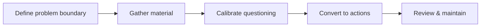

> This article expands on the "retrospective" thread in [*Management Retrospective*](/writing/2026/08/management-retrospective/).

Retrospectives most easily degenerate into two kinds of useless documents: one that retells what happened in chronological order, leaving readers with no idea what should change; and another that rushes to a seemingly clear attribution, compressing a complex problem into someone being "not careful enough." Both leave a record behind, but neither leaves behind reusable capability.

What an engineering retrospective must actually accomplish is turning an experience that has already happened into knowledge that enables better judgment the next time. It does not end by finding a person to blame; it aims to change a system: make risks visible earlier, give key judgments a basis, and make repeated work or repeated mistakes harder to occur.

## First, Judge: What Kind of Retrospective Does This Deserve

Not every deviation needs a long meeting or a long document. The effort spent on a retrospective should be proportionate to the problem's scope of impact, probability of recurrence, and learning value. A local problem that can be corrected quickly may only need its cause and fix added to the relevant records; a problem that spans multiple stages and exposes shared assumptions or default practices deserves a fuller analysis.

More useful than asking "how serious is it" are these questions:

- If nothing changes, will something similar happen again?
- Why didn't existing rules, checks, or information flow catch it earlier?
- Will this experience influence future design, collaboration, or maintenance judgments?

If the answer to any one of these questions is yes, it is worth leaving behind some form of retrospective. The goal is not to manufacture process, but to keep the experience from living only in the participants' memories.

A retrospective does not apply only to one kind of outcome. It can look back at a delivery, a period of collaboration, a technical adjustment, or a recurring quality signal. The subject differs, and so do the materials and participants, but the questions to answer are the same: what were we originally trying to achieve, what actually happened, why did it happen this way, and how can we do it more reliably next time?

## Match the Depth of the Retrospective to the Scale of the Problem

A retrospective has no fixed length. A lightweight retrospective can be a one-page checklist: background, facts, judgment, and one confirmed improvement; a retrospective with broader impact needs a more complete record of the timeline, evidence, disagreements, actions, and review checkpoints.

You can judge the investment using the following three levels:

| Level | When it applies | What to leave behind at minimum |
| --- | --- | --- |
| Lightweight record | The cause is clear, the fix is direct, and the impact is local | The symptom, the fix, and a checklist item to avoid recurrence |
| Collaborative retrospective | Multiple stages are involved, with information gaps or disagreements in judgment | Shared facts, a chain of causes, and clear actions |
| Deep retrospective | Broad impact, exposed systemic gaps, or long-term learning value | The complete process, key decisions, alternatives, actions, and follow-up verification |

The difference here is not about whose work matters more, but about avoiding two kinds of waste: organizing a meeting that adds no new information for a small problem, or handling a problem that deserved serious understanding with a few vague conclusions.

## The Workflow of a Complete Retrospective

A retrospective is best viewed as a piece of work running from information collection to improvement verification, not as an ad-hoc meeting. A stable process usually has five steps.

### 1. Define the Problem Boundary and Facilitation Responsibility

Start by stating in one or two sentences what this retrospective is about and what it aims to achieve: do you want to understand a deviation, evaluate a delivery, or improve a recurring way of collaborating? The clearer the boundary, the less likely the material will turn into a collection of all related topics.

At the same time, designate a facilitator. The facilitator need not be the person who knows the details best, nor should they by default be someone directly involved in the problem; their job is to ensure facts get filled in, the discussion stays on target, conclusions can be acted on, and follow-up review happens. Participants should be chosen by whether they "can add key facts, take part in judgment, or own an action" — not by expanding the group according to hierarchy or headcount. People who only need to know the conclusions can receive a brief summary afterward.

### 2. Gather Material and Resolve Disagreements Before the Meeting

Most fact-gathering should be done before the meeting. At a minimum, this includes expectations, actual results, key time points, the information that was visible at the time, the measures already taken, and the questions still to be confirmed. If different participants understand the facts differently, that should also be flagged in advance, rather than being discovered for the first time in the meeting.

Pre-meeting preparation has another often-overlooked role: writing down clearly "what needs to be decided." If all you are doing is sharing a record that has no remaining disagreement, a meeting may not be needed; if there are judgments that cannot be resolved in writing, list the points of contention, the possible paths, and the evidence still to be gathered in advance.

### 3. Calibrate and Press Key Questions in the Meeting

The meeting's task is not to write the document from scratch, nor to retell every detail. It should proceed around four questions:

1. Do we share the same understanding of the goal, the outcome, and the scope of impact?
2. Which evidence supports the current explanation, and where is there still uncertainty?
3. Why didn't the existing checks, handoffs, or fallbacks come into play at an earlier stage?
4. Which changes are most likely to reduce the probability of recurrence, and how do we verify that they work?

The facilitator needs to protect the main thread of the discussion. If a detail cannot change the causal judgment, the priority of actions, or the scope of applicability, it can be recorded as a follow-up question rather than continuing to occupy everyone's attention. Conversely, any counterexample that could overturn the existing explanation should be discussed seriously; it must not be skipped just because it complicates the conclusion.

### 4. Turn the Discussion into Executable Actions

Before the meeting ends, confirm each action's deliverable, owner, review time, and completion criteria one by one. Improvements of different natures can be layered: default practices that can be adjusted immediately, checks or documentation that need to be added in the near term, and longer-term changes that need further validation. Layering is not meant to push hard problems further away, but to give each item a sensible next step.

An action item that cannot answer "what will look different once it is done" is usually still just a direction. For example, "strengthen reviews" is not a completion criterion; specifying which prerequisites a certain kind of change must include, who confirms them, and through what record they are checked is the kind of change that can actually be executed and re-examined.

### 5. Review the Results and Maintain This Knowledge

Retrospective material should be updated promptly after the meeting: record the conclusions reached, the questions still unanswered, and the status of actions. When the agreed time arrives, use a short review to confirm the actual results. If an action was not completed, clarify the new arrangement or the reason for stopping; if an action was completed but did not improve the problem, record that result too and reconsider the next step.

Only then is a retrospective not a one-off archive but engineering knowledge that can be continuously updated. People who encounter similar situations in the future need to find not only "what was done at the time," but more importantly "which judgments have been validated, and which still require caution."

## Align on Facts First, Then Discuss Explanations

The most common argument in a retrospective is often not a difference of opinion, but that people are holding different facts. Before analysis begins, first build a shared record that is concise enough: what was expected, what actually happened, what the key checkpoints were, which information has been confirmed, and which is still only speculation.

A timeline is very useful here, but it is not the retrospective itself. It helps people see what was visible when decisions were made, which signals were ignored or misread, and which constraints only surfaced later. Do not use hindsight to reproach the choices made at the time; more important is to ask: given the information available then, what mechanism could make the next judgment more reliable?

Facts and explanations should be written separately. For example, "a certain check was not performed" is a fact; "because people don't take quality seriously" is an explanation — and usually a premature one. Clearly distinguishing evidence, inference, and questions still to be verified keeps the discussion honest and prevents whoever speaks first from defining the situation for everyone else.

## From Surface Causes to Changeable Conditions

"Operational error," "insufficient communication," and "inadequate review" can be starting points of observation, but they should not be the endpoint of a retrospective. These formulations are too broad to lead directly to action. If you stop here, the next time can only rely on everyone being "more careful."

More valuable follow-up questions are:

- What information was not seen at the time, and why did it not appear where it should have?
- What assumptions did the key decisions rely on? Were these assumptions validated, recorded, and re-examined?
- Is the existing process preventing mistakes, or merely asking people to be more careful?
- At what earlier point could this problem have been discovered at lower cost?

These questions shift the discussion from individual performance toward system conditions: default configuration, information boundaries, feedback speed, check coverage, responsibility handoffs, or technical constraints. System conditions do not mean individuals bear no responsibility; they mean the retrospective should find a more reliable way to improve than reminding individuals.

## Make Conclusions Usable by Future People

A reusable retrospective should leave behind at least five kinds of information:

1. **Problem boundary:** what this retrospective aims to explain, and what it explicitly does not.
2. **What happened and the evidence:** the key facts, decision points, and uncertainties that support the conclusions.
3. **Chain of causes:** the reasoning from surface symptoms to changeable conditions, rather than a single-sentence attribution.
4. **Improvement actions:** what to change, who is responsible, when to review, and the observable completion criteria.
5. **Scope of applicability:** under what conditions this lesson can be transferred, and under what conditions it needs to be re-evaluated.

The fourth item in particular cannot be left as wishes like "improve the process" or "strengthen communication." A good action item should be confirmable: what check was added, what default behavior was changed, what documentation was filled in, or what assumption that no longer holds was removed. The more specific the action, the less likely it is to disappear in the busyness that follows.

## The Meeting's Task Is Calibration, Not Inventing Conclusions On the Spot

A retrospective meeting is suited to calibrating information, pressing on boundaries, and confirming commitments — not to arguing out an attribution on the spot without preparation. The facilitator can gather facts and expose disagreements beforehand, and have the relevant participants read the material first; the meeting then concentrates on the problems still unresolved: whether the evidence is sufficient, whether the causal reasoning skips steps, and whether the actions can really reduce the risk.

This also demands a basic discussion discipline: challenge reasoning, not label people; admit what is unknown rather than filling gaps with guesses; distinguish "I disagree" from "insufficient evidence." Psychological safety is not about making discussions gentler, but about letting bad news, counterexamples, and uncertainty surface earlier.

## Value Only Begins After the Retrospective Ends

Finishing the document or ending the meeting does not mean the retrospective is done. The real conditions for finishing are: the actions have been carried out, or explicitly cancelled after validation; the original risk now has new monitoring, checks, or documentation; and people later on can find and understand these conclusions when needed.

Therefore, a retrospective should schedule a lightweight review. The review's questions are simple: did the promised changes happen? Did they actually improve the target problem? Did they introduce new costs or blind spots? If the answer is no, that should also be recorded. Withdrawing an ineffective measure is not failure; it keeps the organization from hardening an unverified practice into a ritual.

The best retrospective does not make the team remember how tortuous an experience was; it makes the next round of work depend less on luck and memory. What it leaves behind is not a verdict on the past, but a set of engineering judgments that can continue to be tested and improved in the future.
