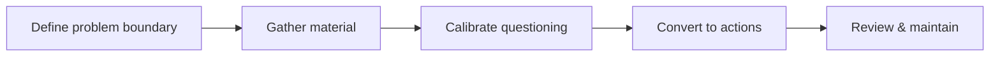

> 本文是[《管理复盘》](/writing/2026/08/management-retrospective/)中「复盘」这条线的展开。

复盘最容易变成两种无效的文档：一种是按时间顺序重述发生过什么，读完之后谁也不知道该改变什么；另一种是急着给出一个看似明确的归因，却把复杂的问题压缩成某个人“不够仔细”。两者都留下了记录，却没有留下可复用的能力。

一次工程复盘真正要完成的事，是把已经发生的经历转化为下一次能够做出更好判断的知识。它不以寻找一个人来结束，而以改变一个系统为目标：让风险更早被看见，让关键判断有依据，让重复劳动或重复错误更难发生。

## 先判断：这件事值得怎样的复盘

不是每一次偏差都需要开长会、写长文。复盘的投入应与问题的影响面、重复概率和学习价值相称。一个局部且可快速纠正的问题，也许只需要在相关记录中补上原因和修正；一个跨越多个环节、暴露出共同假设或默认做法的问题，则值得更完整地分析。

比“严重不严重”更有用的判断问题是：

- 如果不改变做法，类似情况会不会再次出现？
- 现有规则、检查或信息传递，为什么没有及早发现它？
- 这次经历是否会影响后续的设计、协作或维护判断？

只要其中一个问题的答案是肯定的，就值得留下某种形式的复盘。写这份记录的目的很简单：不让经验只留在参与者的记忆里，等下一次同样的情况发生时又要从头猜一遍。

复盘也不只适用于某一种结果。它可以回看一次交付、一段协作过程、一项技术调整，或一个反复出现的质量信号。对象不同，材料和参与者会不同，但要回答的问题是一致的：原本想达成什么，实际发生了什么，为什么会这样，下次怎样做得更可靠。

## 让复盘的深度匹配问题的规模

复盘没有统一的篇幅。一个轻量复盘可以是一页清单：背景、事实、判断、一个已确认的改进；一个影响范围更广的复盘，则需要更完整地记录时间线、证据、分歧、行动与回看节点。

可以用下面三个层次判断投入：

| 层次 | 适用情况 | 至少留下什么 |
| --- | --- | --- |
| 轻量记录 | 原因明确，修正直接，影响局部 | 现象、修正、避免重复的检查项 |
| 协作复盘 | 多个环节参与，存在信息断点或判断分歧 | 共同事实、原因链路、明确行动 |
| 深度复盘 | 影响广泛，暴露出系统性缺口，或具有长期学习价值 | 完整过程、关键决策、替代方案、行动与后续验证 |

这里的差别不在于谁的工作更重要，关键是避免两种浪费：为很小的问题组织一场没有新增信息的会议，或用几句笼统结论处理本该被认真理解的问题。

举例来说，假设某次发布后一个接口偶尔返回超时，查下来是某个下游服务的连接池配置偏小——原因清楚，改一个参数就能解决，这种情况写一页轻量记录就够了：现象、改了什么、以后怎么在压测里覆盖这类场景。

打个比方，如果同样是超时问题，但排查过程中发现三个团队各自对“谁负责熔断降级”有不同理解，直到出问题才第一次摆到桌面上讨论，这就不再是一个参数能解决的事，值得开一次协作复盘，把职责边界重新写清楚并落实到文档里。

## 一次完整复盘的工作流

复盘最好被视为一段从信息收集到改进验证的工作，而不是一场临时会议。一个稳定的流程通常有五步：先划定问题边界并确定主持人，再在会议前收集材料、暴露分歧，然后在会议中完成校准和关键追问，接着把讨论转成可执行的行动，最后回看结果并维护这份知识。这五步前后衔接：前一步没做好，后一步就会在原地打转——比如材料没收集齐就开会，讨论多半会停留在“确认发生了什么”，而不是往前推进到原因和行动。

### 1. 明确问题边界与主持责任

先用一两句话说明这次复盘的对象和目标：是希望理解一次偏差、评估一次交付，还是改进某种反复出现的协作方式。边界越清楚，材料越不会变成所有相关话题的集合。

同时确定一位主持人。主持人不必是最了解细节的人，也不应天然等同于问题的直接相关者；其职责是保证事实得到补齐、讨论不偏离目标、结论可以落地，并推动后续回看。参与者则应以“能补充关键事实、参与判断或承担行动”为标准，而不是按层级或人数扩大范围。只需要了解结论的人，可以在会后获得简洁同步。

### 2. 在会议前收集材料并处理分歧

会议前应完成大部分事实整理。最低限度包括预期、实际结果、关键时间点、当时可见的信息、已经采取的措施，以及仍待确认的问题。若不同参与者对事实有不同理解，也应提前标出，而不是等到会议中才第一次发现。

会前准备还有一个常被忽略的作用：把“需要决定什么”写清楚。若只是同步一份已经没有分歧的记录，未必需要开会；若存在无法靠文字解决的判断，就应把争议点、可选路径和需要补的证据提前列出。

### 3. 在会议中完成校准和关键追问

会议的任务不是从零写文档，也不是把每一处细节重新讲一遍。它应当围绕四个问题推进：

1. 我们对目标、结果和影响范围的理解是否一致？
2. 哪些证据支撑当前解释，哪些地方仍有不确定性？
3. 原有的检查、交接或兜底为什么没有在更早阶段发挥作用？
4. 哪些改变最可能降低重复发生的概率，又如何验证它们有效？

主持人需要保护讨论的主线。细节如果不能改变原因判断、行动优先级或适用边界，可以记为后续问题而非持续占用所有人的注意力。反过来，任何能推翻既有解释的反例，都应该被认真讨论，不能因为它让结论变得复杂就被略过。

### 4. 把讨论转成可执行的行动

会议结束前，应逐项确认行动的交付物、负责人、检查时间和完成标准。不同性质的改进可以分层：立刻可以调整的默认做法，近期需要补齐的检查或说明，以及需要进一步验证的长期改动。分层的意义在于让每一项都有一个合理的下一步，而不是把难题笼统地压后处理。

一个行动项若无法回答“完成后会看到什么不同”，通常还只是一个方向。例如“加强评审”不是完成标准；明确某类变更必须补充哪些前提、由谁确认、通过什么记录被检查，才是能够执行和复查的改变。

### 5. 回看结果，并维护这份知识

复盘材料应在会后及时更新：写清已达成的结论、尚未回答的问题和行动状态。等到约定时间，再用很短的回看确认实际结果。若行动没有完成，要明确新的安排或停止理由；若行动完成但没有改善问题，也应记录这个结果，并重新判断下一步。

这样一来，复盘材料就能持续更新，成为可以复用的工程知识，而不是存档后就没人再打开的一次性文档。未来遇到相似情况的人，需要找到的不只是“当时做了什么”，更是“什么判断已被验证，什么仍然需要谨慎”。

## 先对齐事实，再讨论解释

复盘里最常见的争论，往往不是观点不同，而是大家握有的事实并不一致。开始分析前，应先建立一份足够简洁的共同记录：预期是什么，实际发生了什么，关键节点有哪些，哪些信息已经确认，哪些仍然只是推测。

时间线在这里很有用，但它不是复盘本身。它帮助人们看清决策发生时能看到什么、哪些信号被忽略或误读、哪些约束直到后来才显现。不要用事后的知识苛责当时的选择；更重要的是问：在当时可获得的信息下，什么机制能让下一次的判断更可靠？

事实与解释应当分开写。比如“某项检查没有执行”是事实；“因为大家不重视质量”是解释，而且通常还是过早的解释。把证据、推断和待验证问题明确区分，能让讨论保持诚实，也能避免最先发言的人替所有人定性。

## 从表面原因走到可改变的条件

“操作失误”“沟通不足”“评审不充分”可以是观察的起点，却不应是复盘的终点。这些表述过于宽泛，无法直接导向行动。若只停在这里，下一次往往只能靠大家“更注意”。

更有价值的追问是：

- 当时哪些信息没有被看见，为什么它没有出现在该出现的地方？
- 关键决策依赖了哪些假设？这些假设是否被验证、记录和复查？
- 现有流程是在防止错误，还是只是在要求人更小心？
- 这个问题在哪个更早的节点，本可以以更低成本被发现？

这些问题会把讨论从个人表现移向系统条件：默认配置、信息边界、反馈速度、检查覆盖、职责交接或技术约束。系统条件并不意味着个人没有责任；它意味着复盘要找到比提醒个人更可靠的改进方式。

## 让结论能被未来的人使用

一份可复用的复盘，至少应留下五类信息：

1. **问题边界：** 这次复盘要解释什么，又明确不解释什么。
2. **经过与证据：** 支撑结论的关键事实、决策点和不确定性。
3. **原因链路：** 从表面现象到可改变条件的推理，而非单句归因。
4. **改进行动：** 要改变什么，谁负责，何时检查，以及完成的可观察标准。
5. **适用范围：** 这条经验在什么条件下可以迁移，在什么条件下需要重新判断。

尤其是第四项，不能只写“完善流程”“加强沟通”这样的愿望。好的行动项应当能够被确认：新增了什么检查、修改了什么默认行为、补齐了什么说明，或者撤销了什么不再成立的假设。行动越具体，后续越不容易在忙碌中消失。

## 会议的任务是校准，不是现场发明结论

复盘会议适合做信息校准、追问边界和确认承诺，不适合在缺少准备时现场争出一个归因。主持人可以在会前收集事实、暴露分歧，并让相关参与者先阅读材料；会议上则集中处理仍未解决的问题：证据是否充分，因果是否跳步，行动是否真的能降低风险。

这也要求一种基本的讨论纪律：质疑推理，不给人贴标签；承认不知道，不用猜测填空；区分“我不同意”与“证据不足”。心理安全不是为了让讨论更温和，而是为了让坏消息、反例和不确定性能够更早出现。

## 复盘结束之后，才开始产生价值

文档完成或会议结束，都不等于复盘完成。真正的结束条件是：行动已经落实，或者经过验证后被明确取消；原先的风险已有新的监测、检查或说明；后来的人能在需要时找到并理解这次结论。

因此，复盘应当安排一次轻量回看。回看的问题很简单：承诺的改变是否发生？它是否真的改善了目标问题？有没有带来新的成本或盲区？如果答案是否定的，也应当留下记录——撤回一项没有验证出效果的措施，好过让它悄悄变成一条没人说得清为什么存在的仪式。

复盘写到这里，其实回答的问题很朴素：这次经历，下次还有没有用得上的地方。如果一份复盘能让下一个遇到类似情况的人少走一段弯路、少猜一次原因，它就已经完成了自己的任务；至于团队会不会记住这次经历本身，反而没那么重要。
