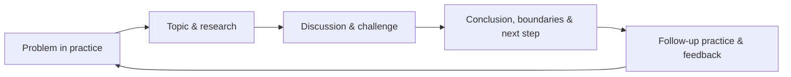

Many technical-sharing efforts, over time, turn into a fixed activity: when the time comes, pick a topic, prepare some materials, schedule a talk, and once it is over, wait for the next one. It looks industrious, but participants do not necessarily learn more deeply from it, and the experience does not necessarily get preserved. I organized this kind of "industrious but unchanged" sharing for quite a long time — until I began to measure it against a single standard, and only then did things improve: **after this sharing session, whose judgment or action will change, and in what way?**

The problem is not the format of sharing itself, but the mistake of treating "holding a sharing session" as the goal. What technical sharing really needs to solve is how knowledge turns from personal experience into a shared asset that more people can understand, question, use, and keep updating. It is not a method for giving talks, but a method for knowledge collaboration.

This method contains at least five interconnected parts: clarify why sharing exists, choose topics worth investing in, let the sharer complete sufficiently deep research, design a process that allows discussion, and turn one discussion into the starting point for the next piece of work.

## First Define What Sharing Should Serve

Technical sharing can serve different goals: help newcomers build a knowledge map, prompt a shared judgment on a hard problem, review an exploration and leave behind reusable experience, or let people from different directions see each other's constraints. When the goal differs, the topic, depth, and format should all differ too.

The situation most likely to fail is treating "sharing more" itself as the goal. The sharer then improvises topics just to fill the schedule, and the audience participates just for the sake of participating; in the end everyone spends time without forming new abilities or a common language.

That judgment standard mentioned earlier deserves to be unpacked: if the answer is only "everyone learned a little more," the topic still needs further narrowing. If it can explain "which conditions people will check first when they encounter this kind of problem in the future," "how a piece of experience will be reused," or "which disagreements can be further discussed on this basis," then the sharing has a clear landing point.

## Topics Should Come from Problems, Not from a Stock of Materials

The technical world never lacks concepts, tools, and articles to talk about. What is truly scarce is a problem worth a group of people investing attention in together. Therefore, topic selection should not start from "what materials do I have on hand," but from "what problem is worth seeing clearly together."

There are usually three kinds of topics that most readily lead to effective sharing:

| Topic source | Problem it suits | Focus of the sharing |
| --- | --- | --- |
| Experience from practice | Whether an approach can be transferred | Context, trade-offs, failure paths, and applicable boundaries |
| A long-followed direction | How a new concept enters an existing judgment system | Core concepts, key disagreements, and verification methods |
| A recurring problem | Why the same kind of problem keeps repeating | Common patterns, checklists, and follow-up improvements |

This does not mean foundational knowledge cannot be shared. Foundational topics are still important for people just entering a field, but they should clearly serve onboarding, not disguise themselves as an in-depth discussion that "everyone needs to hear again." With an audience of mixed experience, you can separate pre-reading materials from live discussion: foundational information is for alignment, while the limited shared time is for explaining judgment and working through disagreements.

A good topic also needs boundaries. A problem that can be explained clearly in a single session is often more valuable than "a complete introduction to a field." Rather than covering a string of related concepts, it is better to answer one concrete question: why does this choice work under some conditions and fail under others?

## The Sharer Is First a Researcher, Not a Courier of Materials

Organizing public materials into an introduction can lower other people's reading cost, but it is not enough to constitute high-quality sharing. The unique value of technical sharing lies in the sharer having filtered, compared, and judged the materials.

The "research" here does not have to be formal, paper-style research. It means at least: understand the context of the problem; distinguish facts, inferences, and preferences; compare more than one path; and know the conditions under which your conclusions would fail.

When preparing content, rather than endlessly adding pages, it is more worthwhile to answer the following questions:

1. What exactly is the object to be solved, and which similar problems are out of scope?
2. What alternative paths exist, and why were some of them not chosen?
3. What premises does the conclusion depend on, and where does the evidence come from?
4. Which parts still have no answer and need to be verified through discussion or follow-up practice?

This turns sharing from "showing conclusions" into "making the judgment process public." Even when the audience disagrees, they can pinpoint whether they are questioning the goal, the premises, the evidence, or the trade-offs; this is more valuable than reaching a superficial consensus.

## Format Is Determined by the State of the Knowledge

Not every topic suits one person talking from beginning to end. When the knowledge is already fairly mature and a common foundation needs to be built, a lecture is appropriate; when the problem is still open and participants each hold different evidence, a roundtable or case discussion is usually better; when a consistent practice needs to be formed, discussion should be combined with joint review.

The format can be chosen simply according to the state of the knowledge:

| State of knowledge | More suitable format | Key output |
| --- | --- | --- |
| A foundation needs to be built | Guided reading or a topical lecture | Shared concepts and a path for further learning |
| A clear proposal awaits evaluation | Proposal review | Trade-offs, decisions, and items to be verified |
| A recurring practical problem | Case discussion | Patterns, counterexamples, and checklists |
| Still being explored and disputed | A small roundtable | Hypotheses, evidence gaps, and next-step experiments |

Format is not about ceremony. It should match the cognitive work that most needs to be done at the moment. Having one person talk through all the uncertainties often squeezes out the discussion that is truly needed; conversely, opening discussion directly on a topic that lacks a shared foundation easily turns into people talking past each other.

## Design Sharing as a Back-and-Forth Process

Before a session begins, one of the most valuable preparations is to surface the problem in advance. The materials or a short abstract need not be perfect, but they should let participants know: what the problem is, why it is worth discussing, and what questions they should bring.

This has two effects. First, the audience can fill in the necessary background ahead of time, instead of spending live time on terminology. Second, the sharer can see the real questions in advance and adjust the emphasis, rather than assuming everyone cares about the same thing.

During the process, questions should not be just a polite segment in the last few minutes. Good questions help calibrate the content: they may point out that a premise was not made clear, or bring a counterexample under different conditions. The sharer does not need to answer every question on the spot, but should distinguish what already has evidence from what still needs verification, avoiding packaging uncertainty as a definite conclusion.

More worth attending to than "whether the room was lively" is: whether the discussion made the problem clearer, whether disagreements were expressed accurately, and whether someone is able to pick up the next step.

## Consolidation Is Not Archiving, but Keeping Experience Flowing

After a session ends, leaving only the materials or a recording is often not enough to support reuse. People who come later find it hard to know what the most important conclusions were, what the discussion changed, and which problems still have no answer; the content also gradually gets buried by new materials.

A more useful consolidation should be as short as possible while answering a few key questions:

- What problem was this discussion trying to solve, and what was the conclusion?
- Which principles, boundaries, or checklist items can be used in similar situations?
- What important counterexamples, limitations, or open questions emerged in the discussion?
- What needs to be verified, supplemented, or updated afterward?

This record should not be the sharer's burden alone. Those who asked questions, those who practiced, and later users can all contribute to it. Once knowledge is written in a form that can be discussed and revised, it no longer depends on one person retelling it again and again, and it truly becomes a shared asset.

Consolidation also means allowing updates. The conclusion of one session may be overturned or refined as new evidence arrives; leaving a version, an applicable scope, and the time of last verification matters more than keeping a seemingly complete but already outdated document.

## Let Sharing Form a Closed Learning Loop

The ideal state of technical sharing is not a calendar packed with topics, but a loop: practice brings problems, problems prompt research and discussion, discussion produces verifiable judgments, judgments return to practice, and new experience in turn revises the original knowledge.

In this loop, sharing is not an extra activity tacked on, but a mechanism that connects individual learning with collective progress. It does not require producing grand conclusions every time; as long as it can make a problem clearer, leave a piece of experience more usable, or make the next judgment rely less on memory and guesswork, this session has done its job.

What technical sharing ultimately cultivates is not people who are better at giving talks, but a collaborative system that can keep learning, reason in the open, preserve experience, and correct itself.
