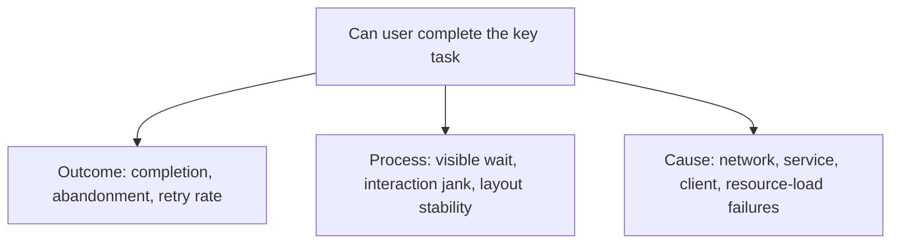

Many data arguments appear, on the surface, to be disputes over whether a number is right, when they are actually about two different things.

Some people say "errors are increasing" and mean the total number of error events; some care about the number of affected people; still others want to know whether a single failure blocks a user from completing a task. All three numbers may be correct, yet they cannot substitute for one another. Without a shared definition, the more precise the discussion becomes, the deeper the misunderstanding grows.

Therefore, a data definition is not a footnote at the end of a report. It is more like an interface in collaboration: it specifies what a metric represents, which inputs it is computed from, under which conditions it holds, and what it cannot be used to claim. When the interface is clear, analytics, engineering, product, and operations can make judgments around the same object; when the interface is vague, no matter how pretty the numbers are, they cannot reliably support action.

## A metric is never just "a number"

A usable metric should include at least the following five parts:

| Part | Question it answers |
| --- | --- |
| Measurement object | Is it measuring a request, a session, a device, a user, or a task? |
| Event definition | What counts as one occurrence, one success, one failure? |
| Calculation method | Is it a sum, average, quantile, ratio, or deduplicated per user? |
| Time and scope | Which time window, which versions, which platforms or regions are counted? |
| Usage boundary | What judgments can this metric support, and what conclusions cannot it draw? |

For example, an "error rate of 1%" only becomes meaningful after the definition is completed: is it failed requests divided by all requests, or deduplicated users who encountered an error divided by active users? Does a timeout count as an error? What about an operation the user actively cancelled? After a successful retry, should one record a failure, a success, or only the final result?

These are not pedantic nitpicks. Once the denominator and the event boundary change, the number may be describing a completely different phenomenon.

## Distinguish absolute counts, ratios, and experience first

The same question usually has at least three ways of looking at it.

**Absolute counts** answer "how much happened". Examples include daily failed requests, crash counts, and the number of feedback messages received. They are good for estimating workload and spotting sudden changes, but they change along with traffic and usage scale.

**Ratios** answer "how widespread is it". Examples include the request error rate, the share of affected users, and the task completion rate. They help comparisons across different time periods or samples, but you must state the denominator to avoid misreading small-sample fluctuations as trends.

**Experience metrics** answer "what does a person actually feel". Examples include the completion time of a key operation, the share of sessions that experienced jank, and the number of perceptible errors a single user encounters within a unit of time. They should not be fully replaced by internal system success rates, because a retry, a long wait, or an operation with no feedback can all make users believe the task failed.

It is best to look at all three kinds together. Absolute counts determine whether the processing pressure is large enough, ratios show whether the impact is spreading, and experience metrics tie the technical phenomenon back to human tasks. Looking at only one of them often yields an incomplete conclusion.

## Make data comparable

Comparable data does not mean putting two numbers on the same chart. Before comparing, first check whether the conditions are consistent.

The most common changes include: a change in the statistics period, a switch in the tracking version, adjusted filtering rules, changes in the user mix, changes in usage paths brought by feature releases, and a change in the denominator's definition. Even if the formula is unchanged, any one of these changes can cause a break.

A practical principle is: **when comparing, prefer comparing changes in the same object under the same conditions; if the conditions changed, write the change itself into the conclusion.**

For example, a drop in the average time of a task does not automatically mean the experience improved. It may be that a slower portion of samples was not recorded, or that after the task entry point was changed, fewer people completed it. At this point you should check coverage, sample size, completion rate, and long-tail latency together, rather than picking only a prettier average.

## Data also needs versions and maintainers

Metrics evolve: product paths change, collection methods get corrected, and the understanding of "success" may mature. Rather than pretending the definition never changes, it is better to record changes openly.

A lightweight metric specification is usually enough:

- the metric's name and its one-sentence purpose;
- the events, numerator, denominator, and formula;
- the statistics window, filter conditions, and data latency;
- known blind spots, such as incomplete collection coverage or an inability to judge causality;
- the most recent definition change, and whether old and new data can be compared side by side.

Here "maintenance" does not mean turning data into one person's private knowledge; it means making the definition able to be reviewed, challenged, and updated. Anyone who uses a metric to make decisions should be able to trace back to its source and boundaries; anyone who finds a definition unsuitable should be able to propose a change, rather than quietly computing a different set of numbers.

## Metrics are not a flat list, but a tree

Putting dozens of metrics on the same dashboard usually only creates more problems. A better way to organize is to start from "what do we want to protect" and break it down into observable, actionable signals.

This tree has three benefits. First, the upper-level metrics explain why you should care; second, the lower-level metrics help locate possible causes; third, whenever any number changes, you know whether to look upward at impact or downward for evidence.

For example, when the task completion rate drops, do not immediately treat some API's latency as the conclusion. First see whether the drop is concentrated on specific platforms, versions, or network conditions; then see whether failures, timeouts, jank, and entry-point changes appear at the same time; finally go back to logs, traces, and real operation paths to verify. The metric tree provides an investigation path, not automatic attribution.

## Layering metrics: decisions, guardrails, and diagnosis

Metrics at different levels carry different responsibilities; mixing them leads to ineffective optimization.

| Level | Role | Common examples | How to use |
| --- | --- | --- | --- |
| Outcome metric | Judge whether the goal is achieved | Task completion rate, number of users who completed successfully | Used to decide whether the problem is worth investing in. |
| Experience guardrail | Prevent "the result improves but the experience worsens" | Share of affected users, visible wait, jank ratio | Read together with outcome metrics to avoid one-sided optimization. |
| Diagnostic metric | Narrow the scope of investigation | Error rate of a certain kind, resource latency, device or version distribution | Used to form hypotheses; cannot directly replace the outcome. |
| Data quality metric | Judge whether the numbers can be trusted | Event coverage, reporting latency, duplication rate, missing rate | Check before any conclusion. |

A change can improve some local metric while harming the overall task. For example, shortening a waiting flow may lower page latency but leave users staring at a blank state while the result is not yet ready. If the outcome metric or experience guardrail has not improved, you cannot declare success based on local latency alone.

## From events to metrics: no skipped steps in between

Many definition problems are planted at the tracking design stage. An event must at least be able to answer: who, in what environment, toward what goal, did what, with what result, and how long it took.

| Field category | Suggested information | Why it is needed |
| --- | --- | --- |
| Identifier | Anonymous user identifier, session identifier, event identifier | For deduplication and associating the same task, avoiding reliance on identifiable personal information. |
| Context | Coarse-grained dimensions such as platform, app version, network type, language, or region | For discovering whether problems are concentrated; dimensions should follow the principle of minimum necessity. |
| Task state | Started, submitted, succeeded, failed, cancelled, timed out | To give completion rate and abandonment rate clear numerators and denominators. |
| Result | Error category, whether it is recoverable, whether it is shown to the user | To distinguish technical anomalies from impact actually perceived by the user. |
| Time | Client occurrence time, service processing time, user-visible waiting time | To distinguish end-to-end experience from the latency of a single link. |

The event name should not carry all the semantics. Rather than creating a nearly identical new event for each outcome, let the event represent a stable action and put the result, state, and error category into controlled fields. This way, when definitions are updated, it is easier to preserve comparability and easier to spot unknown values or missing collection.

At the same time, keep one principle: **the data collected to obtain a metric should be less than the data that "might be useful someday".** A public metric system does not need personal identity, message bodies, or precise location, and can usually answer most quality questions.

## Establish a baseline before reading trends

A single day's high or low is rarely enough to support a conclusion. Metrics show weekday-versus-weekend differences, gradual version rollouts, holidays, network fluctuations, and sample-size changes. Without a baseline, it is easy to mistake natural fluctuation for an incident, or an accidental dip for a fix.

When establishing a baseline, you can continuously record values under the same definition, and at the same time record sample sizes and important changes: release dates, collection versions, entry-point redesigns, or data-pipeline adjustments. These annotations should be visible on the chart. After seeing a fluctuation, checking in the following order is usually more effective:

1. whether the data is complete, whether latency is normal, and whether the denominator changed suddenly;
2. in which time period, which environments, or which tasks the impact occurred;
3. whether outcome and diagnostic metrics agree, or only one link is abnormal;
4. whether there is a reproducible user path or technical evidence;
5. after taking action, whether you return to the same definition to verify the effect.

There is no universal "red-line number" here. A reasonable target depends on the task's importance, usage conditions, historical baseline, and the cost of fixing. More important than copying a threshold is to write down in advance within the team: which changes need observation, which changes need escalation, and who confirms whether the data itself is trustworthy.

## A complete but lightweight review example

Suppose that after a change, you observe that "the completion rate of submitting a task has dropped". An effective data review should not stop at "how much did it drop", but should produce the following record:

| Question | Evidence needed | Possible next step |
| --- | --- | --- |
| Is this a real change or a data problem? | Event coverage, reporting latency, denominator and version changes | Fix the collection, or continue the analysis. |
| Who is affected? | Share of deduplicated users, platform, version, network, entry-point distribution | Narrow the affected scope. |
| At which step does the user fail? | Sequence of states such as started, submitted, responded, result displayed | Confirm the choke point and a reproducible path. |
| What is the cost to the experience? | Timeout rate, visible wait, retry count, user feedback | Determine priority and a temporary mitigation. |
| Is the fix effective? | Completion rate under the same definition, guardrail metrics, and recurrence | Regress against the original task and observe for a while. |

This record does not require writing a long report every time. What it aims to avoid is directly turning a chart change into a conclusion or action item when the object, scope, and evidence are missing.

## A good definition serves action, not decoration

The value of a metric lies not in covering more pages or generating a more complex dashboard, but in whether it helps people make the next judgment.

When you see an anomaly, you can ask in turn: what object is this a change in? Does it affect how many events, how many people, or how many key tasks? When did the change begin, and does it coincide with a change in collection or scope? Do we need to first confirm, mitigate, fix, or continue collecting evidence?

When these questions can be supported by the same set of definitions, the discussion no longer has to start from "whose data is real". Data will not make decisions for people, but clear definitions can bring disagreements back to what is truly worth discussing: goals, trade-offs, and action.
