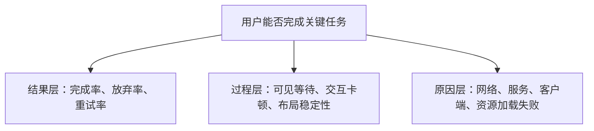

举例来说，某次周会上，产品经理说“这周错误率涨了三倍”，运维说“工单量没什么变化”，数据分析师翻了后台数据，发现两边都没算错。争到最后才发现，三个人说的根本不是同一件事：产品经理数的是后台记录的错误事件总数，运维看的是用户主动提交的工单数，数据分析师算的是出现过错误的去重用户占活跃用户的比例。三个数字都对，却描述着三个不同的对象，谁也说服不了谁。

很多数据争论表面上是在争一个数字对不对，实际上是在说两件不同的事。若没有共同的定义，讨论越精确，误解反而越深。

因此，数据口径不是报表末尾的一行注释，而更像协作中的接口：规定一个指标表示什么、由哪些输入计算、在哪些条件下成立，以及不能拿它说明什么。这套接口一旦清楚，分析、工程、产品和运营才能围绕同一个对象做判断；一旦含混，再漂亮的数字也支持不了行动。

## 指标从来不是“一个数”

回到开头那场争论：如果三个人在吵之前，先各自说清楚自己数的是什么对象、什么算一次错误、用什么方法计算、统计的是哪段时间和哪些范围、这个数能用来下什么判断——争论大概率不会发生。这五件事，正是一个可用指标必须交代清楚的部分。

| 部分 | 要回答的问题 |
| --- | --- |
| 测量对象 | 测量的是请求、会话、设备、用户，还是一项任务？ |
| 事件定义 | 什么算一次发生、一次成功、一次失败？ |
| 计算方法 | 是求和、平均、分位数、比例，还是按用户去重？ |
| 时间与范围 | 统计哪个时间窗、哪些版本、哪些平台或地区？ |
| 使用边界 | 这个指标可以支持什么判断，不能推出什么结论？ |

“错误率 1%”只有在补全这五项定义后才有意义：它究竟是失败请求数除以全部请求数，还是出现过错误的去重用户数除以活跃用户数？超时算不算错误？被用户主动取消的操作算不算？重试成功后应记录一次失败、一次成功，还是只记录最终结果？

这些不是吹毛求疵。分母和事件边界一变，数字描述的就可能是完全不同的现象——就像开头那场周会上，同一周的数据，能被三个人各自读出不同的故事。

## 先区分绝对量、比例和体验

同一个问题通常至少有三种看法。

**绝对量**回答“发生了多少”。例如每日失败请求数、崩溃次数、收到的反馈数量。它适合估算处理量、观察突发变化，但会随流量和使用规模一起变化。

**比例**回答“发生得有多普遍”。例如请求错误率、受影响用户占比、任务完成率。它能帮助不同时间段或不同样本之间比较，但必须说明分母，避免把小样本波动误读成趋势。

**体验指标**回答“人实际感受到了什么”。例如一次关键操作的完成时间、出现卡顿的会话比例、单个用户在单位时间内遇到的可感知错误次数。它不应被系统内部成功率完全替代，因为一次重试、一次长时间等待，或一次没有反馈的操作，都可能让用户认为任务失败。

三类数据最好一起看。绝对量决定是否有足够大的处理压力，比例说明影响是否扩大，体验指标则把技术现象重新接回人的任务。只看其中一个，结论往往不完整。

## 让数据具有可比性

数据可比较，不等于把两个数放在一张图上。比较之前，要先检查条件是否一致。

最常见的变化包括：统计周期改变、埋点版本切换、过滤规则调整、用户结构变化、功能发布带来使用路径改变，以及分母的口径发生变化。即便计算公式不变，其中任何一项变化都可能造成断点。

一个实用的做法是：先确认是同一个对象、同一套条件，再去比较变化量；如果条件确实变了，就把这个变化本身写进结论里，而不是假装它不存在。

例如，某项任务的平均耗时下降，并不自动表示体验更好。可能是较慢的一部分样本没有被记录，也可能是任务入口改动后，完成它的人变少了。此时应同时检查覆盖率、样本量、完成率以及长尾耗时，而不是只挑一个更好看的平均值。

## 数据也需要版本和维护者

指标会演化：产品路径会改变，采集方式会修正，对“成功”的理解也可能更成熟。与其假装定义永远不变，不如把变化公开记录下来。

一份轻量的指标说明通常足够：

- 指标名称和一句话目的；
- 事件、分子、分母与公式；
- 统计窗口、筛选条件和数据延迟；
- 已知盲区，例如采集覆盖不完整或无法判断因果；
- 最近一次定义变更，以及新旧数据是否可以横向比较。

这里的“维护”不是把数据变成某一个人的专属知识，而是让定义能被复查、被质疑、被更新。谁用这个指标做决定，就应该能查到它的来源和边界；谁发现定义不合适，也应该能提出修改，而不必私下另算一套数。

## 指标不是平铺的清单，而是一棵树

把几十个指标放到同一张看板上，通常只会制造更多问题。更好的组织方式是从“要保护什么”出发，向下拆成可观察、可行动的信号。

这棵树有三个好处：上层指标说明为什么要关心，下层指标帮助定位可能的原因。任何一个数字变化时，都知道该向上看影响，还是向下找证据。

例如，任务完成率下降时，不应立刻把某个接口延迟当成结论。先看下降是否集中在特定平台、版本或网络条件；再看失败、超时、卡顿和入口变化是否同时出现；最后回到日志、链路和真实操作路径验证。指标树提供的是调查路径，不是自动归因。

## 给指标分层：决策、护栏与诊断

不同层级的指标承担不同职责，混用会造成无效优化。

| 层级 | 作用 | 常见例子 | 使用方式 |
| --- | --- | --- | --- |
| 结果指标 | 判断目标是否实现 | 任务完成率、成功完成的用户数 | 用于确定问题是否值得投入。 |
| 体验护栏 | 防止“结果变好但体验变差” | 受影响用户占比、可见等待、卡顿占比 | 与结果指标一起看，避免单边优化。 |
| 诊断指标 | 缩小排查范围 | 某类错误率、资源耗时、设备或版本分布 | 用于提出假设，不能直接替代结果。 |
| 数据质量指标 | 判断数字能否相信 | 事件覆盖率、上报延迟、重复率、缺失率 | 任何结论之前先检查。 |

一项改动可以让某个局部指标变好，却伤害整体任务。例如压缩一段等待流程，可能降低页面耗时，却让用户在结果未准备好时看到空白状态。此时结果指标或体验护栏没有改善，就不能仅凭局部延迟宣布成功。

## 从事件到指标：中间不能跳步

许多口径问题在埋点设计时就已经埋下。一个事件至少需要能回答：谁在什么环境下，为了什么目标，做了什么，发生了什么结果，耗时多久。

| 字段类别 | 建议信息 | 为什么需要 |
| --- | --- | --- |
| 标识 | 匿名用户标识、会话标识、事件标识 | 用于去重、关联同一段任务，避免依赖可识别个人信息。 |
| 上下文 | 平台、应用版本、网络类型、语言或地区等粗粒度维度 | 用于发现问题是否集中；维度应遵守最小必要原则。 |
| 任务状态 | 开始、提交、成功、失败、取消、超时 | 让完成率和放弃率有明确分子、分母。 |
| 结果 | 错误类别、是否可恢复、是否展示给用户 | 区分技术异常与用户实际感知的影响。 |
| 时间 | 客户端发生时间、服务处理时间、用户可见等待时间 | 区分端到端体验与某一环节耗时。 |

事件名不宜承载全部语义。与其为每种结果新建一个几乎相同的事件，不如让事件表示稳定动作，把结果、状态和错误类别放进受控字段。这样定义更新时更容易保持可比性，也更容易发现未知值或采集缺失。

同时要保留一个原则：**为了得到一个指标而采集的数据，应当少于“也许以后会用”的数据。** 公开的指标体系不需要个人身份、内容正文或精确位置，通常也能回答大多数质量问题。

## 看趋势之前，先建立基线

单日的高低很少足以支持结论。指标会有工作日与周末差异、版本渐进发布、节假日、网络波动与样本量变化。没有基线，就容易把自然波动当成事故，也容易把偶然回落当成修复。

建立基线时，可以连续记录相同口径下的值，并同时记录样本量与重要变化：发布日期、采集版本、入口改版或数据链路调整。图表上应能看见这些注记。看到波动后，按下面顺序检查通常更有效：

1. 数据是否完整、延迟是否正常、分母是否突然变化；
2. 影响发生在什么时间段、哪些环境或哪些任务；
3. 结果指标与诊断指标是否一致，还是只有一条链路异常；
4. 是否存在可复现的用户路径或技术证据；
5. 采取行动后，是否回到同一口径下验证效果。

这里没有通用的“红线数字”。合理的目标取决于任务的重要性、使用条件、历史基线与修复成本。比起照搬一个阈值，更重要的是在团队内预先写清：什么变化需要观察，什么变化需要升级处理，谁来确认数据本身是否可信。

## 一个完整但轻量的评审示例

假设某次改动后，观察到“提交任务的完成率下降”。一场有效的数据评审不应停在“下降了多少”，而应形成下面的记录：

| 问题 | 需要的证据 | 可能的下一步 |
| --- | --- | --- |
| 这是真实变化还是数据问题？ | 事件覆盖率、上报延迟、分母和版本变更 | 修正采集，或继续分析。 |
| 谁被影响？ | 去重用户占比、平台、版本、网络、入口分布 | 缩小受影响范围。 |
| 用户在哪一步失败？ | 开始、提交、响应、展示结果等状态序列 | 确认卡点与可复现路径。 |
| 体验代价是什么？ | 超时率、可见等待、重试次数、用户反馈 | 判断优先级与临时缓解方案。 |
| 修复是否有效？ | 同口径的完成率、护栏指标与复发情况 | 回归原任务验证，并观察一段时间。 |

这套记录并不要求每次都写成长报告。它要避免的是在缺少对象、范围和证据时，直接把一个图表变化变成结论或行动项。

## 好口径服务于行动，而不是装饰

指标的价值不在于覆盖更多页面或生成更复杂的仪表盘，而在于它能否帮助人做出下一步判断。

看到异常时，可以依次追问：这是什么对象的变化？影响的是多少次事件、多少人、还是多少关键任务？变化从何时开始，是否与采集或范围变化重合？我们需要先确认、缓解、修复，还是继续收集证据？

当这些问题能由同一套定义支撑，讨论就不必从“谁的数据是真的”开始。数据不会替人做决定，但清楚的口径能让分歧回到真正值得讨论的地方：目标、取舍与行动。
